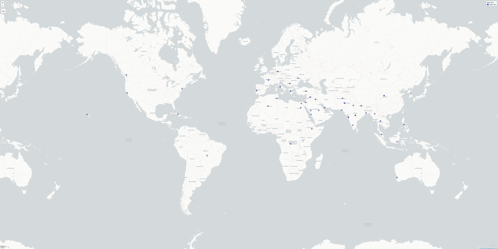
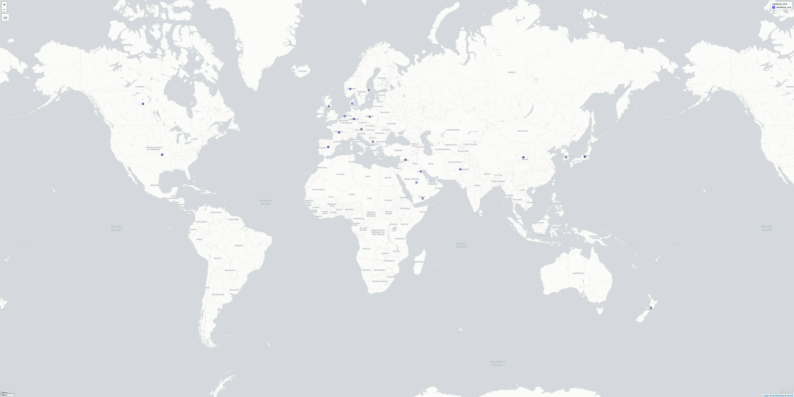
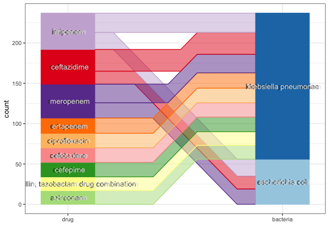
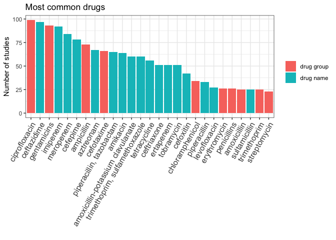
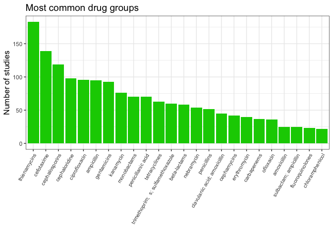
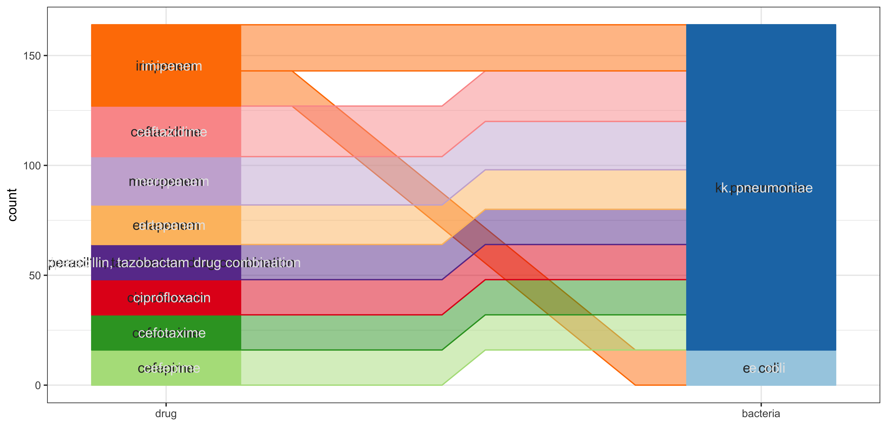
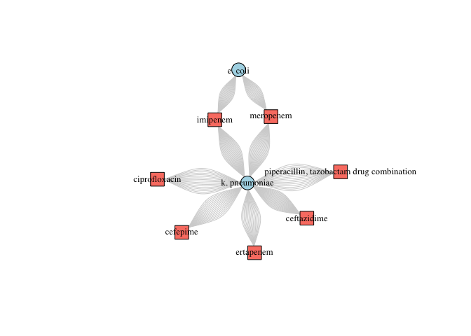
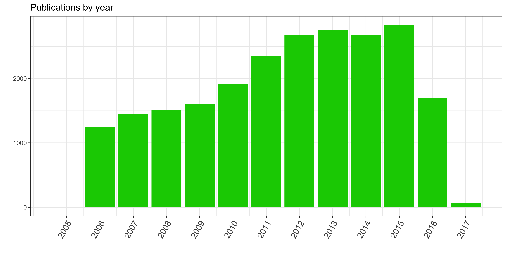
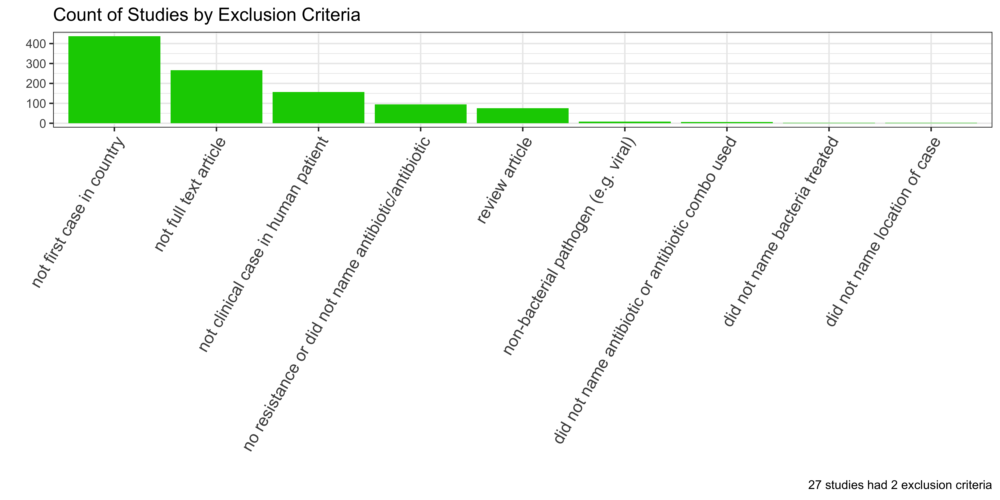

exploratory\_data
================
emmamendelsohn
Tue Jan 22 10:20:25 2019

—————–Locations—————–

Study Locations

<!-- -->

Travel Locations

<!-- -->

Residence Locations

<!-- -->

—————–Bacteria—————–

Count by rank

<table>

<thead>

<tr>

<th style="text-align:right;">

family

</th>

<th style="text-align:right;">

genus

</th>

<th style="text-align:right;">

species

</th>

<th style="text-align:right;">

\<NA\>

</th>

</tr>

</thead>

<tbody>

<tr>

<td style="text-align:right;">

2

</td>

<td style="text-align:right;">

4

</td>

<td style="text-align:right;">

299

</td>

<td style="text-align:right;">

9

</td>

</tr>

</tbody>

</table>

Count by name and
parent

| bacteria\_rank | bacteria\_preferred\_label | bacteria\_preferred\_label\_abbr | bacteria\_parent\_rank | bacteria\_parent\_name                        |  n | percent |
| :------------- | :------------------------- | :------------------------------- | :--------------------- | :-------------------------------------------- | -: | ------: |
| species        | klebsiella pneumoniae      | k. pneumoniae                    | genus                  | klebsiella                                    | 50 |    15.9 |
| species        | escherichia coli           | e. coli                          | genus                  | escherichia                                   | 27 |     8.6 |
| species        | staphylococcus aureus      | s. aureus                        | genus                  | staphylococcus                                | 23 |     7.3 |
| species        | acinetobacter baumannii    | a. baumannii                     | species group          | acinetobacter calcoaceticus/baumannii complex | 14 |     4.5 |
| species        | pseudomonas aeruginosa     | p. aeruginosa                    | species group          | pseudomonas aeruginosa group                  | 14 |     4.5 |

<!-- -->

—————–Drugs—————–

Count by rank

<table>

<thead>

<tr>

<th style="text-align:right;">

drug group

</th>

<th style="text-align:right;">

drug group + drug group

</th>

<th style="text-align:right;">

drug group + drug name

</th>

<th style="text-align:right;">

drug name

</th>

<th style="text-align:right;">

drug name + drug name

</th>

<th style="text-align:right;">

\<NA\>

</th>

</tr>

</thead>

<tbody>

<tr>

<td style="text-align:right;">

548

</td>

<td style="text-align:right;">

3

</td>

<td style="text-align:right;">

3

</td>

<td style="text-align:right;">

1389

</td>

<td style="text-align:right;">

4

</td>

<td style="text-align:right;">

116

</td>

</tr>

</tbody>

</table>

Count by name and parent

<table>

<thead>

<tr>

<th style="text-align:left;">

drug\_rank

</th>

<th style="text-align:left;">

drug\_preferred\_label\_abbr

</th>

<th style="text-align:left;">

drug\_parent\_name\_abbr

</th>

<th style="text-align:right;">

n

</th>

<th style="text-align:right;">

percent

</th>

</tr>

</thead>

<tbody>

<tr>

<td style="text-align:left;">

drug name

</td>

<td style="text-align:left;">

ceftazidime

</td>

<td style="text-align:left;">

cephaloridine

</td>

<td style="text-align:right;">

97

</td>

<td style="text-align:right;">

4.7

</td>

</tr>

<tr>

<td style="text-align:left;">

drug group

</td>

<td style="text-align:left;">

ciprofloxacin

</td>

<td style="text-align:left;">

fluoroquinolones

</td>

<td style="text-align:right;">

96

</td>

<td style="text-align:right;">

4.7

</td>

</tr>

<tr>

<td style="text-align:left;">

drug name

</td>

<td style="text-align:left;">

imipenem

</td>

<td style="text-align:left;">

thienamycins

</td>

<td style="text-align:right;">

95

</td>

<td style="text-align:right;">

4.6

</td>

</tr>

<tr>

<td style="text-align:left;">

drug group

</td>

<td style="text-align:left;">

gentamicins

</td>

<td style="text-align:left;">

aminoglycosides

</td>

<td style="text-align:right;">

93

</td>

<td style="text-align:right;">

4.5

</td>

</tr>

<tr>

<td style="text-align:left;">

drug name

</td>

<td style="text-align:left;">

meropenem

</td>

<td style="text-align:left;">

thienamycins

</td>

<td style="text-align:right;">

88

</td>

<td style="text-align:right;">

4.3

</td>

</tr>

</tbody>

</table>

<!-- -->

Count by group only

<table>

<thead>

<tr>

<th style="text-align:left;">

drug\_group

</th>

<th style="text-align:right;">

n

</th>

<th style="text-align:right;">

percent

</th>

</tr>

</thead>

<tbody>

<tr>

<td style="text-align:left;">

thienamycins

</td>

<td style="text-align:right;">

183

</td>

<td style="text-align:right;">

8.9

</td>

</tr>

<tr>

<td style="text-align:left;">

cefotaxime

</td>

<td style="text-align:right;">

139

</td>

<td style="text-align:right;">

6.7

</td>

</tr>

<tr>

<td style="text-align:left;">

cephalosporins

</td>

<td style="text-align:right;">

119

</td>

<td style="text-align:right;">

5.8

</td>

</tr>

<tr>

<td style="text-align:left;">

cephaloridine

</td>

<td style="text-align:right;">

98

</td>

<td style="text-align:right;">

4.8

</td>

</tr>

<tr>

<td style="text-align:left;">

ciprofloxacin

</td>

<td style="text-align:right;">

96

</td>

<td style="text-align:right;">

4.7

</td>

</tr>

</tbody>

</table>

<!-- -->

—————–Bacteria + Drugs Paired—————–

Count by linkages (12 most common linkages)

| drug                                      | bacteria      |  n |
| :---------------------------------------- | :------------ | -: |
| ceftazidime                               | k. pneumoniae | 22 |
| imipenem                                  | k. pneumoniae | 20 |
| meropenem                                 | k. pneumoniae | 20 |
| piperacillin, tazobactam drug combination | k. pneumoniae | 17 |
| imipenem                                  | e. coli       | 17 |
| ciprofloxacin                             | k. pneumoniae | 17 |
| cefepime                                  | k. pneumoniae | 16 |
| ertapenem                                 | k. pneumoniae | 16 |
| meropenem                                 | e. coli       | 16 |
| ceftazidime                               | e. coli       | 15 |

<!-- --><!-- -->

Count by pub
date

<!-- --><!-- --><!-- -->

Count by exclusion criteria

<!-- -->
