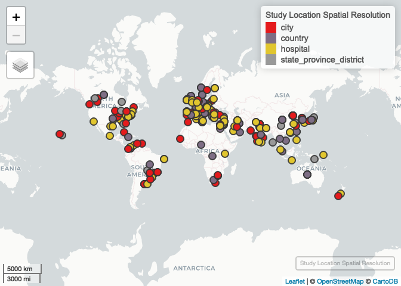
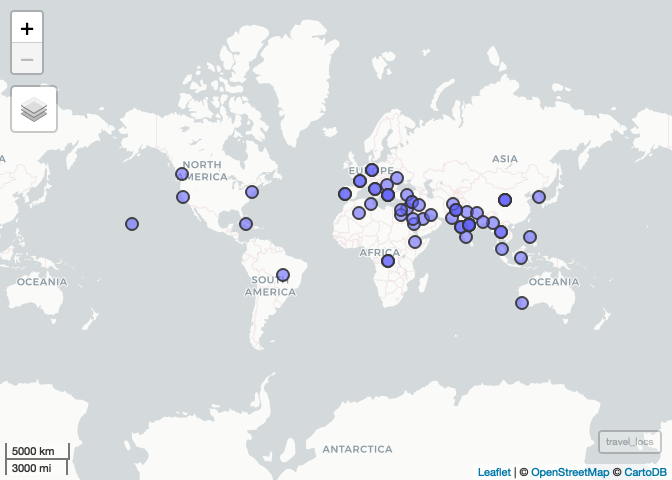
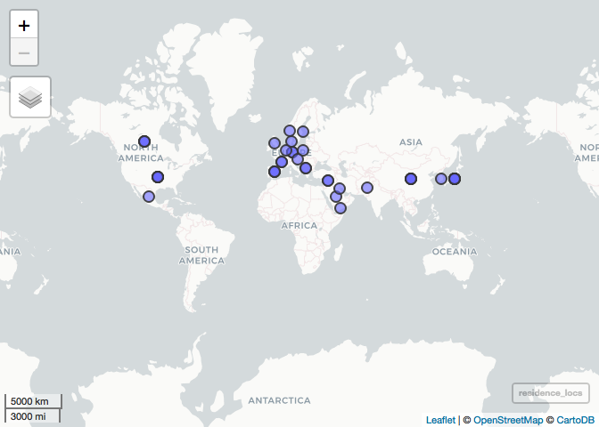
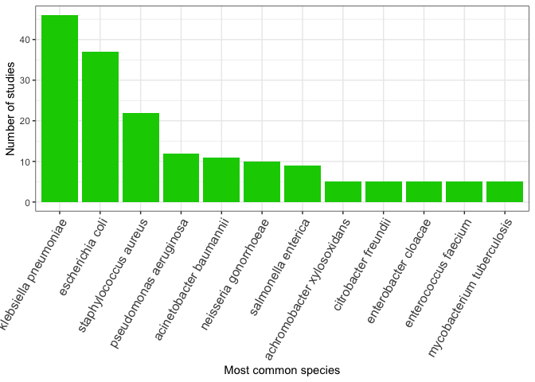
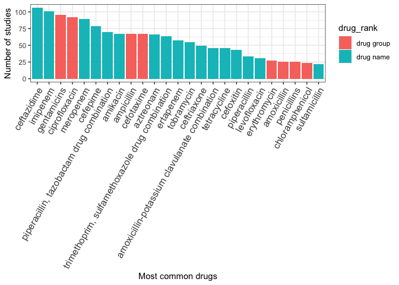
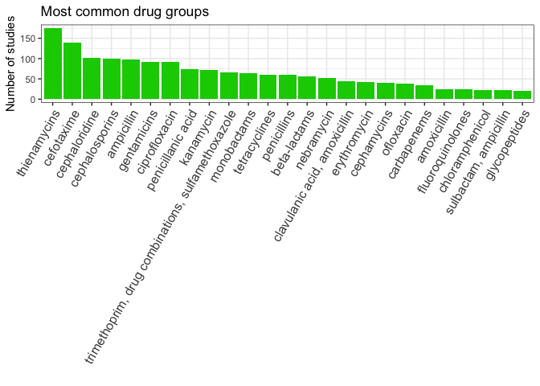
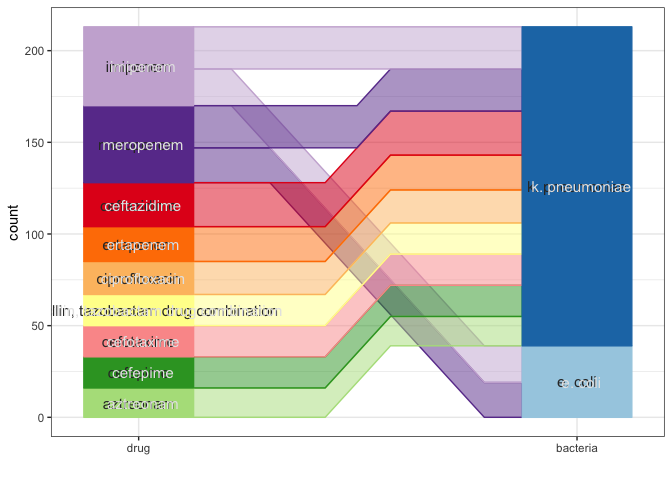
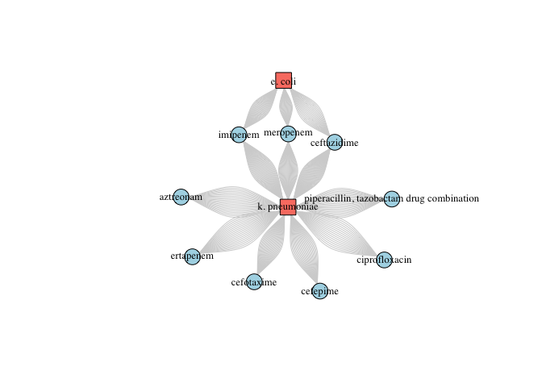

exploratory\_data
================
emmamendelsohn
2018-11-02

—————–Locations—————–

Study Locations

<!-- -->

Travel Locations

<!-- -->

Residence Locations

<!-- -->

—————–Bacteria—————–

Count by rank

<table>

<thead>

<tr>

<th style="text-align:right;">

family

</th>

<th style="text-align:right;">

genus

</th>

<th style="text-align:right;">

species

</th>

<th style="text-align:right;">

\<NA\>

</th>

</tr>

</thead>

<tbody>

<tr>

<td style="text-align:right;">

1

</td>

<td style="text-align:right;">

5

</td>

<td style="text-align:right;">

286

</td>

<td style="text-align:right;">

2

</td>

</tr>

</tbody>

</table>

Count by name and parent

<table>

<thead>

<tr>

<th style="text-align:left;">

bacteria\_rank

</th>

<th style="text-align:left;">

bacteria\_preferred\_label

</th>

<th style="text-align:left;">

bacteria\_parent\_rank

</th>

<th style="text-align:left;">

bacteria\_parent\_name

</th>

<th style="text-align:right;">

n

</th>

<th style="text-align:right;">

percent

</th>

</tr>

</thead>

<tbody>

<tr>

<td style="text-align:left;">

species

</td>

<td style="text-align:left;">

klebsiella pneumoniae

</td>

<td style="text-align:left;">

genus

</td>

<td style="text-align:left;">

klebsiella

</td>

<td style="text-align:right;">

46

</td>

<td style="text-align:right;">

15.6

</td>

</tr>

<tr>

<td style="text-align:left;">

species

</td>

<td style="text-align:left;">

escherichia coli

</td>

<td style="text-align:left;">

genus

</td>

<td style="text-align:left;">

escherichia

</td>

<td style="text-align:right;">

37

</td>

<td style="text-align:right;">

12.6

</td>

</tr>

<tr>

<td style="text-align:left;">

species

</td>

<td style="text-align:left;">

staphylococcus aureus

</td>

<td style="text-align:left;">

genus

</td>

<td style="text-align:left;">

staphylococcus

</td>

<td style="text-align:right;">

22

</td>

<td style="text-align:right;">

7.5

</td>

</tr>

<tr>

<td style="text-align:left;">

species

</td>

<td style="text-align:left;">

pseudomonas aeruginosa

</td>

<td style="text-align:left;">

species group

</td>

<td style="text-align:left;">

pseudomonas aeruginosa group

</td>

<td style="text-align:right;">

12

</td>

<td style="text-align:right;">

4.1

</td>

</tr>

<tr>

<td style="text-align:left;">

species

</td>

<td style="text-align:left;">

acinetobacter baumannii

</td>

<td style="text-align:left;">

species group

</td>

<td style="text-align:left;">

acinetobacter calcoaceticus/baumannii complex

</td>

<td style="text-align:right;">

11

</td>

<td style="text-align:right;">

3.7

</td>

</tr>

</tbody>

</table>

<!-- -->

—————–Drugs—————–

Count by rank

<table>

<thead>

<tr>

<th style="text-align:right;">

drug group

</th>

<th style="text-align:right;">

drug name

</th>

<th style="text-align:right;">

\<NA\>

</th>

</tr>

</thead>

<tbody>

<tr>

<td style="text-align:right;">

576

</td>

<td style="text-align:right;">

1432

</td>

<td style="text-align:right;">

15

</td>

</tr>

</tbody>

</table>

Count by name and parent

<table>

<thead>

<tr>

<th style="text-align:left;">

drug\_rank

</th>

<th style="text-align:left;">

drug\_preferred\_label

</th>

<th style="text-align:left;">

drug\_parent\_name

</th>

<th style="text-align:right;">

n

</th>

<th style="text-align:right;">

percent

</th>

</tr>

</thead>

<tbody>

<tr>

<td style="text-align:left;">

drug name

</td>

<td style="text-align:left;">

ceftazidime

</td>

<td style="text-align:left;">

cephaloridine

</td>

<td style="text-align:right;">

106

</td>

<td style="text-align:right;">

5.2

</td>

</tr>

<tr>

<td style="text-align:left;">

drug name

</td>

<td style="text-align:left;">

imipenem

</td>

<td style="text-align:left;">

thienamycins

</td>

<td style="text-align:right;">

101

</td>

<td style="text-align:right;">

5.0

</td>

</tr>

<tr>

<td style="text-align:left;">

drug group

</td>

<td style="text-align:left;">

gentamicins

</td>

<td style="text-align:left;">

aminoglycosides

</td>

<td style="text-align:right;">

96

</td>

<td style="text-align:right;">

4.7

</td>

</tr>

<tr>

<td style="text-align:left;">

drug group

</td>

<td style="text-align:left;">

ciprofloxacin

</td>

<td style="text-align:left;">

fluoroquinolones

</td>

<td style="text-align:right;">

92

</td>

<td style="text-align:right;">

4.5

</td>

</tr>

<tr>

<td style="text-align:left;">

drug name

</td>

<td style="text-align:left;">

meropenem

</td>

<td style="text-align:left;">

thienamycins

</td>

<td style="text-align:right;">

89

</td>

<td style="text-align:right;">

4.4

</td>

</tr>

</tbody>

</table>

<!-- -->

Count by group only

<table>

<thead>

<tr>

<th style="text-align:left;">

drug\_group

</th>

<th style="text-align:right;">

n

</th>

<th style="text-align:right;">

percent

</th>

</tr>

</thead>

<tbody>

<tr>

<td style="text-align:left;">

thienamycins

</td>

<td style="text-align:right;">

190

</td>

<td style="text-align:right;">

9.4

</td>

</tr>

<tr>

<td style="text-align:left;">

cefotaxime

</td>

<td style="text-align:right;">

142

</td>

<td style="text-align:right;">

7.0

</td>

</tr>

<tr>

<td style="text-align:left;">

cephalosporins

</td>

<td style="text-align:right;">

109

</td>

<td style="text-align:right;">

5.4

</td>

</tr>

<tr>

<td style="text-align:left;">

cephaloridine

</td>

<td style="text-align:right;">

107

</td>

<td style="text-align:right;">

5.3

</td>

</tr>

<tr>

<td style="text-align:left;">

ampicillin

</td>

<td style="text-align:right;">

101

</td>

<td style="text-align:right;">

5.0

</td>

</tr>

</tbody>

</table>

<!-- -->

—————–Bacteria + Drugs Paired—————–

Count by linkages (12 most common
linkages)

<!-- --><!-- -->
