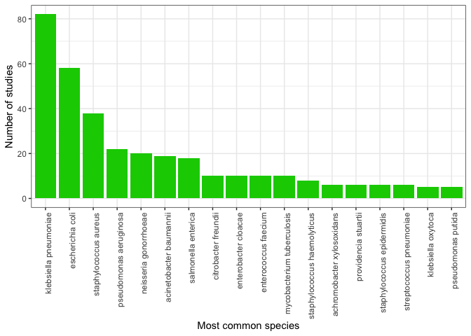

exploratory\_data
================
emmamendelsohn
2018-10-23

-----------------Bacteria-----------------

Count by rank

``` r
bacteria %>%
  group_by(ncbi_rank) %>%
  count() %>% 
  spread(ncbi_rank, n) %>%
  kable() 
```

<table>
<thead>
<tr>
<th style="text-align:right;">
family
</th>
<th style="text-align:right;">
genus
</th>
<th style="text-align:right;">
species
</th>
<th style="text-align:right;">
&lt;NA&gt;
</th>
</tr>
</thead>
<tbody>
<tr>
<td style="text-align:right;">
1
</td>
<td style="text-align:right;">
5
</td>
<td style="text-align:right;">
467
</td>
<td style="text-align:right;">
2
</td>
</tr>
</tbody>
</table>
count by name and parent

``` r
bacteria_sum <- bacteria %>%
  group_by(ncbi_rank, ncbi_preferred_label, ncbi_parent_rank, ncbi_parent_name) %>%
  count(sort = TRUE) %>%
  mutate(percent = round(100*n/nrow(bacteria), 0)) 

kable(bacteria_sum %>% filter(n > 9))
```

<table>
<thead>
<tr>
<th style="text-align:left;">
ncbi\_rank
</th>
<th style="text-align:left;">
ncbi\_preferred\_label
</th>
<th style="text-align:left;">
ncbi\_parent\_rank
</th>
<th style="text-align:left;">
ncbi\_parent\_name
</th>
<th style="text-align:right;">
n
</th>
<th style="text-align:right;">
percent
</th>
</tr>
</thead>
<tbody>
<tr>
<td style="text-align:left;">
species
</td>
<td style="text-align:left;">
klebsiella pneumoniae
</td>
<td style="text-align:left;">
genus
</td>
<td style="text-align:left;">
klebsiella
</td>
<td style="text-align:right;">
82
</td>
<td style="text-align:right;">
17
</td>
</tr>
<tr>
<td style="text-align:left;">
species
</td>
<td style="text-align:left;">
escherichia coli
</td>
<td style="text-align:left;">
genus
</td>
<td style="text-align:left;">
escherichia
</td>
<td style="text-align:right;">
58
</td>
<td style="text-align:right;">
12
</td>
</tr>
<tr>
<td style="text-align:left;">
species
</td>
<td style="text-align:left;">
staphylococcus aureus
</td>
<td style="text-align:left;">
genus
</td>
<td style="text-align:left;">
staphylococcus
</td>
<td style="text-align:right;">
38
</td>
<td style="text-align:right;">
8
</td>
</tr>
<tr>
<td style="text-align:left;">
species
</td>
<td style="text-align:left;">
pseudomonas aeruginosa
</td>
<td style="text-align:left;">
species group
</td>
<td style="text-align:left;">
pseudomonas aeruginosa group
</td>
<td style="text-align:right;">
22
</td>
<td style="text-align:right;">
5
</td>
</tr>
<tr>
<td style="text-align:left;">
species
</td>
<td style="text-align:left;">
neisseria gonorrhoeae
</td>
<td style="text-align:left;">
genus
</td>
<td style="text-align:left;">
neisseria
</td>
<td style="text-align:right;">
20
</td>
<td style="text-align:right;">
4
</td>
</tr>
<tr>
<td style="text-align:left;">
species
</td>
<td style="text-align:left;">
acinetobacter baumannii
</td>
<td style="text-align:left;">
species group
</td>
<td style="text-align:left;">
acinetobacter calcoaceticus/baumannii complex
</td>
<td style="text-align:right;">
19
</td>
<td style="text-align:right;">
4
</td>
</tr>
<tr>
<td style="text-align:left;">
species
</td>
<td style="text-align:left;">
salmonella enterica
</td>
<td style="text-align:left;">
genus
</td>
<td style="text-align:left;">
salmonella
</td>
<td style="text-align:right;">
18
</td>
<td style="text-align:right;">
4
</td>
</tr>
<tr>
<td style="text-align:left;">
species
</td>
<td style="text-align:left;">
citrobacter freundii
</td>
<td style="text-align:left;">
species group
</td>
<td style="text-align:left;">
citrobacter freundii complex
</td>
<td style="text-align:right;">
10
</td>
<td style="text-align:right;">
2
</td>
</tr>
<tr>
<td style="text-align:left;">
species
</td>
<td style="text-align:left;">
enterobacter cloacae
</td>
<td style="text-align:left;">
species group
</td>
<td style="text-align:left;">
enterobacter cloacae complex
</td>
<td style="text-align:right;">
10
</td>
<td style="text-align:right;">
2
</td>
</tr>
<tr>
<td style="text-align:left;">
species
</td>
<td style="text-align:left;">
enterococcus faecium
</td>
<td style="text-align:left;">
genus
</td>
<td style="text-align:left;">
enterococcus
</td>
<td style="text-align:right;">
10
</td>
<td style="text-align:right;">
2
</td>
</tr>
<tr>
<td style="text-align:left;">
species
</td>
<td style="text-align:left;">
mycobacterium tuberculosis
</td>
<td style="text-align:left;">
species group
</td>
<td style="text-align:left;">
mycobacterium tuberculosis complex
</td>
<td style="text-align:right;">
10
</td>
<td style="text-align:right;">
2
</td>
</tr>
</tbody>
</table>
``` r
ggplot(bacteria_sum[bacteria_sum$n > 4,], aes(x = reorder(ncbi_preferred_label, -n), y = n)) +
  geom_bar(stat = "identity", fill = "green3") +
  labs(x = "Most common species", y = "Number of studies") +
  theme_bw() +
  theme(axis.text.x = element_text(angle = 90, hjust = 1))
```


