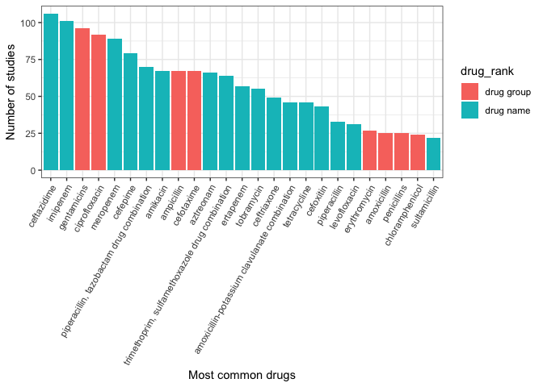

exploratory\_data
================
emmamendelsohn
2018-10-23

—————–Bacteria—————–

Count by rank

``` r
bacteria %>%
  group_by(bacteria_rank) %>%
  count() %>% 
  spread(bacteria_rank, n) %>%
  kable() 
```

<table>

<thead>

<tr>

<th style="text-align:right;">

family

</th>

<th style="text-align:right;">

genus

</th>

<th style="text-align:right;">

species

</th>

<th style="text-align:right;">

\<NA\>

</th>

</tr>

</thead>

<tbody>

<tr>

<td style="text-align:right;">

1

</td>

<td style="text-align:right;">

5

</td>

<td style="text-align:right;">

286

</td>

<td style="text-align:right;">

2

</td>

</tr>

</tbody>

</table>

Count by name and parent

``` r
bacteria_sum <- bacteria %>%
  group_by(bacteria_rank, bacteria_preferred_label, bacteria_parent_rank, bacteria_parent_name) %>%
  count(sort = TRUE) %>%
  mutate(percent = round(100*n/nrow(bacteria), 1)) %>%
  ungroup()

kable(bacteria_sum %>% slice(1:10))
```

<table>

<thead>

<tr>

<th style="text-align:left;">

bacteria\_rank

</th>

<th style="text-align:left;">

bacteria\_preferred\_label

</th>

<th style="text-align:left;">

bacteria\_parent\_rank

</th>

<th style="text-align:left;">

bacteria\_parent\_name

</th>

<th style="text-align:right;">

n

</th>

<th style="text-align:right;">

percent

</th>

</tr>

</thead>

<tbody>

<tr>

<td style="text-align:left;">

species

</td>

<td style="text-align:left;">

klebsiella pneumoniae

</td>

<td style="text-align:left;">

genus

</td>

<td style="text-align:left;">

klebsiella

</td>

<td style="text-align:right;">

46

</td>

<td style="text-align:right;">

15.6

</td>

</tr>

<tr>

<td style="text-align:left;">

species

</td>

<td style="text-align:left;">

escherichia coli

</td>

<td style="text-align:left;">

genus

</td>

<td style="text-align:left;">

escherichia

</td>

<td style="text-align:right;">

37

</td>

<td style="text-align:right;">

12.6

</td>

</tr>

<tr>

<td style="text-align:left;">

species

</td>

<td style="text-align:left;">

staphylococcus aureus

</td>

<td style="text-align:left;">

genus

</td>

<td style="text-align:left;">

staphylococcus

</td>

<td style="text-align:right;">

22

</td>

<td style="text-align:right;">

7.5

</td>

</tr>

<tr>

<td style="text-align:left;">

species

</td>

<td style="text-align:left;">

pseudomonas aeruginosa

</td>

<td style="text-align:left;">

species group

</td>

<td style="text-align:left;">

pseudomonas aeruginosa group

</td>

<td style="text-align:right;">

12

</td>

<td style="text-align:right;">

4.1

</td>

</tr>

<tr>

<td style="text-align:left;">

species

</td>

<td style="text-align:left;">

acinetobacter baumannii

</td>

<td style="text-align:left;">

species group

</td>

<td style="text-align:left;">

acinetobacter calcoaceticus/baumannii complex

</td>

<td style="text-align:right;">

11

</td>

<td style="text-align:right;">

3.7

</td>

</tr>

<tr>

<td style="text-align:left;">

species

</td>

<td style="text-align:left;">

neisseria gonorrhoeae

</td>

<td style="text-align:left;">

genus

</td>

<td style="text-align:left;">

neisseria

</td>

<td style="text-align:right;">

10

</td>

<td style="text-align:right;">

3.4

</td>

</tr>

<tr>

<td style="text-align:left;">

species

</td>

<td style="text-align:left;">

salmonella enterica

</td>

<td style="text-align:left;">

genus

</td>

<td style="text-align:left;">

salmonella

</td>

<td style="text-align:right;">

9

</td>

<td style="text-align:right;">

3.1

</td>

</tr>

<tr>

<td style="text-align:left;">

species

</td>

<td style="text-align:left;">

achromobacter xylosoxidans

</td>

<td style="text-align:left;">

genus

</td>

<td style="text-align:left;">

achromobacter

</td>

<td style="text-align:right;">

5

</td>

<td style="text-align:right;">

1.7

</td>

</tr>

<tr>

<td style="text-align:left;">

species

</td>

<td style="text-align:left;">

citrobacter freundii

</td>

<td style="text-align:left;">

species group

</td>

<td style="text-align:left;">

citrobacter freundii complex

</td>

<td style="text-align:right;">

5

</td>

<td style="text-align:right;">

1.7

</td>

</tr>

<tr>

<td style="text-align:left;">

species

</td>

<td style="text-align:left;">

enterobacter cloacae

</td>

<td style="text-align:left;">

species group

</td>

<td style="text-align:left;">

enterobacter cloacae
complex

</td>

<td style="text-align:right;">

5

</td>

<td style="text-align:right;">

1.7

</td>

</tr>

</tbody>

</table>

``` r
ggplot(bacteria_sum[bacteria_sum$n > 4,], aes(x = reorder(bacteria_preferred_label, -n), y = n)) +
  geom_bar(stat = "identity", fill = "green3") +
  labs(x = "Most common species", y = "Number of studies") +
  theme_bw() +
  theme(axis.text.x = element_text(angle = 60, hjust = 1))
```

<!-- -->

—————–Drugs—————–

Count by rank

``` r
drugs %>%
  group_by(drug_rank) %>%
  count() %>% 
  spread(drug_rank, n) %>%
  kable() 
```

<table>

<thead>

<tr>

<th style="text-align:right;">

drug group

</th>

<th style="text-align:right;">

drug name

</th>

<th style="text-align:right;">

\<NA\>

</th>

</tr>

</thead>

<tbody>

<tr>

<td style="text-align:right;">

576

</td>

<td style="text-align:right;">

1432

</td>

<td style="text-align:right;">

15

</td>

</tr>

</tbody>

</table>

Count by name and parent (note that dups have not yet been handled
10/23/18)

``` r
drugs_sum <- drugs %>%
  group_by(drug_rank, drug_preferred_label, drug_parent_name) %>%
  count(sort = TRUE) %>%
  mutate(percent = round(100*n/nrow(drugs), 1)) %>%
  ungroup()

kable(drugs_sum %>% slice(1:10)) 
```

<table>

<thead>

<tr>

<th style="text-align:left;">

drug\_rank

</th>

<th style="text-align:left;">

drug\_preferred\_label

</th>

<th style="text-align:left;">

drug\_parent\_name

</th>

<th style="text-align:right;">

n

</th>

<th style="text-align:right;">

percent

</th>

</tr>

</thead>

<tbody>

<tr>

<td style="text-align:left;">

drug name

</td>

<td style="text-align:left;">

ceftazidime

</td>

<td style="text-align:left;">

cephaloridine

</td>

<td style="text-align:right;">

106

</td>

<td style="text-align:right;">

5.2

</td>

</tr>

<tr>

<td style="text-align:left;">

drug name

</td>

<td style="text-align:left;">

imipenem

</td>

<td style="text-align:left;">

thienamycins

</td>

<td style="text-align:right;">

101

</td>

<td style="text-align:right;">

5.0

</td>

</tr>

<tr>

<td style="text-align:left;">

drug group

</td>

<td style="text-align:left;">

gentamicins

</td>

<td style="text-align:left;">

aminoglycosides

</td>

<td style="text-align:right;">

96

</td>

<td style="text-align:right;">

4.7

</td>

</tr>

<tr>

<td style="text-align:left;">

drug group

</td>

<td style="text-align:left;">

ciprofloxacin

</td>

<td style="text-align:left;">

fluoroquinolones

</td>

<td style="text-align:right;">

92

</td>

<td style="text-align:right;">

4.5

</td>

</tr>

<tr>

<td style="text-align:left;">

drug name

</td>

<td style="text-align:left;">

meropenem

</td>

<td style="text-align:left;">

thienamycins

</td>

<td style="text-align:right;">

89

</td>

<td style="text-align:right;">

4.4

</td>

</tr>

<tr>

<td style="text-align:left;">

drug name

</td>

<td style="text-align:left;">

cefepime

</td>

<td style="text-align:left;">

cephalosporins

</td>

<td style="text-align:right;">

79

</td>

<td style="text-align:right;">

3.9

</td>

</tr>

<tr>

<td style="text-align:left;">

drug name

</td>

<td style="text-align:left;">

piperacillin, tazobactam drug combination

</td>

<td style="text-align:left;">

penicillanic acid

</td>

<td style="text-align:right;">

70

</td>

<td style="text-align:right;">

3.5

</td>

</tr>

<tr>

<td style="text-align:left;">

drug group

</td>

<td style="text-align:left;">

ampicillin

</td>

<td style="text-align:left;">

penicillin g

</td>

<td style="text-align:right;">

67

</td>

<td style="text-align:right;">

3.3

</td>

</tr>

<tr>

<td style="text-align:left;">

drug group

</td>

<td style="text-align:left;">

cefotaxime

</td>

<td style="text-align:left;">

cephacetrile

</td>

<td style="text-align:right;">

67

</td>

<td style="text-align:right;">

3.3

</td>

</tr>

<tr>

<td style="text-align:left;">

drug
name

</td>

<td style="text-align:left;">

amikacin

</td>

<td style="text-align:left;">

kanamycin

</td>

<td style="text-align:right;">

67

</td>

<td style="text-align:right;">

3.3

</td>

</tr>

</tbody>

</table>

``` r
ggplot(drugs_sum[drugs_sum$percent > 1,], aes(x = reorder(drug_preferred_label, -n), y = n, fill = drug_rank)) +
  geom_bar(stat = "identity") +
  labs(x = "Most common drugs", y = "Number of studies") +
  theme_bw() +
  theme(axis.text.x = element_text(angle = 60, hjust = 1))
```

<!-- -->

—————–Bacteria + Drugs links—————–

``` r
paired_segments <- list(bacteria, drugs) %>%
  map(., ~ mutate(.x, join_id = ifelse(
    c(
      grepl("drug resisted", code_identifiers_link) &
        grepl("binomial", code_identifiers_link)
    ), code_identifiers, NA
  ))) %>%
  map(., ~ select(.x, -code_identifiers, -code_identifiers_link, -segment, -code_main)) %>%
  reduce(full_join) %>%
  filter(!is.na(bacteria_preferred_label), !is.na(drug_preferred_label)) %>%
  mutate(bacteria_drug_pair = paste(bacteria_preferred_label, drug_preferred_label, sep = " - "))
```

    ## Joining, by = c("study_id", "join_id")

Count by combo

``` r
paired_segments_count <- paired_segments %>%
  group_by(bacteria_drug_pair) %>%
  count(sort = TRUE) %>%
  ungroup() %>%
  filter(n > 15)

paired_segments_count %>%
  slice(1:10) %>%
  kable() 
```

<table>

<thead>

<tr>

<th style="text-align:left;">

bacteria\_drug\_pair

</th>

<th style="text-align:right;">

n

</th>

</tr>

</thead>

<tbody>

<tr>

<td style="text-align:left;">

klebsiella pneumoniae - ceftazidime

</td>

<td style="text-align:right;">

27

</td>

</tr>

<tr>

<td style="text-align:left;">

klebsiella pneumoniae - imipenem

</td>

<td style="text-align:right;">

24

</td>

</tr>

<tr>

<td style="text-align:left;">

klebsiella pneumoniae - meropenem

</td>

<td style="text-align:right;">

23

</td>

</tr>

<tr>

<td style="text-align:left;">

escherichia coli - imipenem

</td>

<td style="text-align:right;">

21

</td>

</tr>

<tr>

<td style="text-align:left;">

escherichia coli - meropenem

</td>

<td style="text-align:right;">

19

</td>

</tr>

<tr>

<td style="text-align:left;">

klebsiella pneumoniae - ertapenem

</td>

<td style="text-align:right;">

19

</td>

</tr>

<tr>

<td style="text-align:left;">

klebsiella pneumoniae - cefepime

</td>

<td style="text-align:right;">

18

</td>

</tr>

<tr>

<td style="text-align:left;">

klebsiella pneumoniae - cefotaxime

</td>

<td style="text-align:right;">

18

</td>

</tr>

<tr>

<td style="text-align:left;">

klebsiella pneumoniae - ciprofloxacin

</td>

<td style="text-align:right;">

18

</td>

</tr>

<tr>

<td style="text-align:left;">

klebsiella pneumoniae - aztreonam

</td>

<td style="text-align:right;">

17

</td>

</tr>

</tbody>

</table>

``` r
sub_paired_segments <- paired_segments %>%
  select(bacteria_preferred_label, drug_preferred_label, bacteria_drug_pair) %>%
  rename(bacteria = bacteria_preferred_label, drug = drug_preferred_label) %>% 
  filter(bacteria_drug_pair %in% paired_segments_count$bacteria_drug_pair)

ggparallel(list("drug", "bacteria"), 
           data=as.data.frame(sub_paired_segments), 
           text.angle=0) +
  scale_fill_brewer(palette="Paired") +
  scale_colour_brewer(palette="Paired") +
  theme_bw()+
  theme(legend.position = "none")
```

<!-- -->
