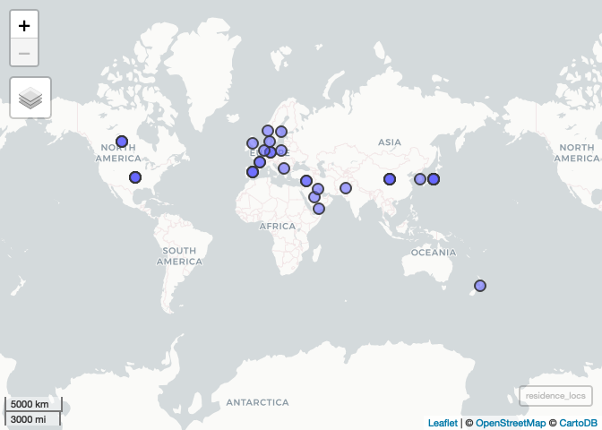
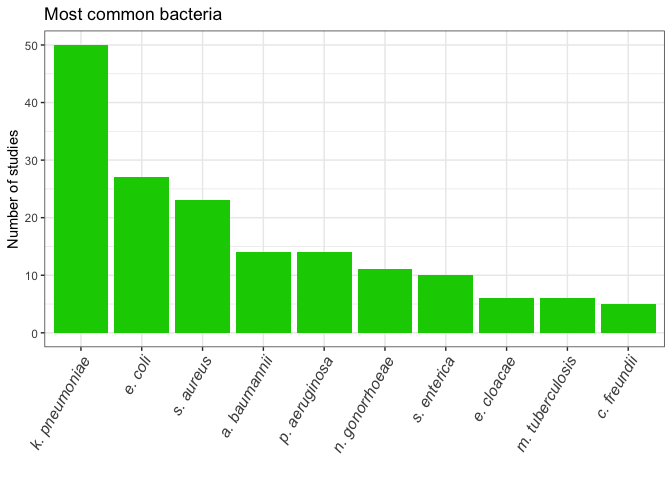

exploratory\_data
================
emmamendelsohn
2018-11-02

—————–Locations—————–

Study Locations

<!-- -->

Travel Locations

<!-- -->

Residence Locations

<!-- -->

—————–Bacteria—————–

Count by rank

<table>

<thead>

<tr>

<th style="text-align:right;">

family

</th>

<th style="text-align:right;">

genus

</th>

<th style="text-align:right;">

species

</th>

<th style="text-align:right;">

\<NA\>

</th>

</tr>

</thead>

<tbody>

<tr>

<td style="text-align:right;">

2

</td>

<td style="text-align:right;">

5

</td>

<td style="text-align:right;">

310

</td>

<td style="text-align:right;">

8

</td>

</tr>

</tbody>

</table>

Count by name and
parent

| bacteria\_rank | bacteria\_preferred\_label | bacteria\_preferred\_label\_abbr | bacteria\_parent\_rank | bacteria\_parent\_name                        |  n | percent |
| :------------- | :------------------------- | :------------------------------- | :--------------------- | :-------------------------------------------- | -: | ------: |
| species        | klebsiella pneumoniae      | k. pneumoniae                    | genus                  | klebsiella                                    | 52 |    16.0 |
| species        | escherichia coli           | e. coli                          | genus                  | escherichia                                   | 28 |     8.6 |
| species        | staphylococcus aureus      | s. aureus                        | genus                  | staphylococcus                                | 23 |     7.1 |
| species        | acinetobacter baumannii    | a. baumannii                     | species group          | acinetobacter calcoaceticus/baumannii complex | 14 |     4.3 |
| species        | pseudomonas aeruginosa     | p. aeruginosa                    | species group          | pseudomonas aeruginosa group                  | 14 |     4.3 |

<!-- -->

—————–Drugs—————–

Count by rank

<table>

<thead>

<tr>

<th style="text-align:right;">

drug group

</th>

<th style="text-align:right;">

drug name

</th>

<th style="text-align:right;">

\<NA\>

</th>

</tr>

</thead>

<tbody>

<tr>

<td style="text-align:right;">

562

</td>

<td style="text-align:right;">

1384

</td>

<td style="text-align:right;">

30

</td>

</tr>

</tbody>

</table>

Count by name and parent

<table>

<thead>

<tr>

<th style="text-align:left;">

drug\_rank

</th>

<th style="text-align:left;">

drug\_preferred\_label

</th>

<th style="text-align:left;">

drug\_parent\_name

</th>

<th style="text-align:right;">

n

</th>

<th style="text-align:right;">

percent

</th>

</tr>

</thead>

<tbody>

<tr>

<td style="text-align:left;">

drug name

</td>

<td style="text-align:left;">

ceftazidime

</td>

<td style="text-align:left;">

cephaloridine

</td>

<td style="text-align:right;">

100

</td>

<td style="text-align:right;">

5.1

</td>

</tr>

<tr>

<td style="text-align:left;">

drug group

</td>

<td style="text-align:left;">

gentamicins

</td>

<td style="text-align:left;">

aminoglycosides

</td>

<td style="text-align:right;">

92

</td>

<td style="text-align:right;">

4.7

</td>

</tr>

<tr>

<td style="text-align:left;">

drug name

</td>

<td style="text-align:left;">

imipenem

</td>

<td style="text-align:left;">

thienamycins

</td>

<td style="text-align:right;">

92

</td>

<td style="text-align:right;">

4.7

</td>

</tr>

<tr>

<td style="text-align:left;">

drug group

</td>

<td style="text-align:left;">

ciprofloxacin

</td>

<td style="text-align:left;">

fluoroquinolones

</td>

<td style="text-align:right;">

91

</td>

<td style="text-align:right;">

4.6

</td>

</tr>

<tr>

<td style="text-align:left;">

drug name

</td>

<td style="text-align:left;">

meropenem

</td>

<td style="text-align:left;">

thienamycins

</td>

<td style="text-align:right;">

83

</td>

<td style="text-align:right;">

4.2

</td>

</tr>

</tbody>

</table>

<!-- -->

Count by group only

<table>

<thead>

<tr>

<th style="text-align:left;">

drug\_group

</th>

<th style="text-align:right;">

n

</th>

<th style="text-align:right;">

percent

</th>

</tr>

</thead>

<tbody>

<tr>

<td style="text-align:left;">

thienamycins

</td>

<td style="text-align:right;">

175

</td>

<td style="text-align:right;">

8.9

</td>

</tr>

<tr>

<td style="text-align:left;">

cefotaxime

</td>

<td style="text-align:right;">

140

</td>

<td style="text-align:right;">

7.1

</td>

</tr>

<tr>

<td style="text-align:left;">

cephaloridine

</td>

<td style="text-align:right;">

101

</td>

<td style="text-align:right;">

5.1

</td>

</tr>

<tr>

<td style="text-align:left;">

cephalosporins

</td>

<td style="text-align:right;">

100

</td>

<td style="text-align:right;">

5.1

</td>

</tr>

<tr>

<td style="text-align:left;">

ampicillin

</td>

<td style="text-align:right;">

98

</td>

<td style="text-align:right;">

5.0

</td>

</tr>

</tbody>

</table>

<!-- -->

—————–Bacteria + Drugs Paired—————–

Count by linkages (12 most common linkages)

| bacteria\_drug\_pair                                      |  n |
| :-------------------------------------------------------- | -: |
| k. pneumoniae - ceftazidime                               | 30 |
| k. pneumoniae - imipenem                                  | 26 |
| k. pneumoniae - meropenem                                 | 26 |
| k. pneumoniae - cefotaxime                                | 22 |
| e. coli - imipenem                                        | 21 |
| k. pneumoniae - cefepime                                  | 21 |
| k. pneumoniae - piperacillin, tazobactam drug combination | 21 |
| k. pneumoniae - aztreonam                                 | 20 |
| e. coli - meropenem                                       | 19 |
| k. pneumoniae - ertapenem                                 | 19 |

<!-- --><!-- -->

Count by pub date

<!-- -->

Count by exclusion criteria

<!-- -->
