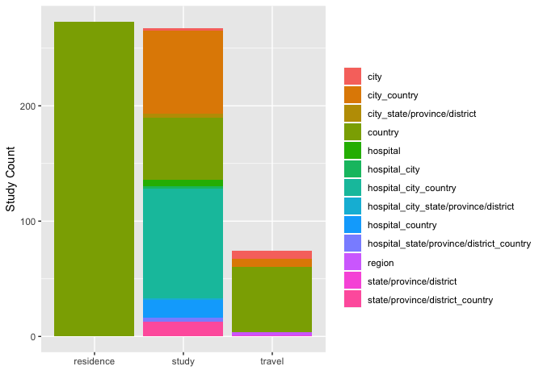
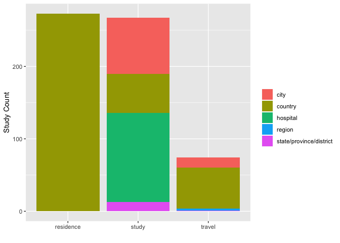

```r
knitr::opts_chunk$set(include=TRUE, echo=TRUE, message=FALSE, warning=FALSE)
```

Setup

```r
library(tidyverse)
library(magrittr)
library(stringi)
library(sf)
library(mapview)
library(opencage)
library(googlesheets)
library(here)
#gs_auth(new_user = TRUE)

#Function for data manipulation
paste_collapse <- function(x){
  x <- x[!is.na(x) & x!=""]
  paste(x, collapse = ", ")
}

#Geocode function for batch processing in opencage
##note: Opencage typically returns multiple results because of placename ambiguity - here we limit to 1 by default
opencage_forward_mutate <- function(data, location, limit=1){
  locs <- data[, location, drop = TRUE] #extract location
  out <- map(locs, opencage_forward, limit=limit) #map opencage_forward function to locations
  gcdf <- data.frame() #empty dataframe
  for(i in seq_along(out)){ #extract lat and long
    tmp <- data.frame(lat = out[[i]]$results$geometry.lat,
                      lon = out[[i]]$results$geometry.lng)
    if(nrow(tmp)==0){tmp <- data.frame(lat=NA, lon=NA)} #NA if no lat/long 
    gcdf <- rbind(gcdf, tmp)
  }
  cbind(data, gcdf)
}

load(here("data", "coded_annotations.RData")) #data compiled in 03_clean_segments.r
field_corrections <- gs_read(gs_title("amr_db_field_corrections")) %>% as.tibble() #google spreadsheet tracking field corrections
sub_names1 <- gs_read(gs_title("amr_db_clean_locs")) %>% as.tibble() #google spreadsheet with field cleanup
```
Fix to mislabeled locations 

```r
field_corrections %<>% 
  mutate(study_id=as.character(study_id)) %>%
  filter(requires_followup=="No") %>%
  select(-requires_followup, -notes)

excluded_studies <- unique(codes$study_id[codes$code_main_cat=="Exclusion"])

codes %<>%
  left_join(.,field_corrections) %>%
  mutate(code_main = ifelse(is.na(code_main_new), code_main, code_main_new)) %>%
  select(-code_main_new) %>%
  filter(!study_id %in% excluded_studies) #remove excluded studies
```
Manual Subsitutions

```r
sub_names2 <- tribble( #these values are handled well by google spreadsheet 
  ~old,                    ~new,
  "\r\n",                  "",
  "- ",                    "",
  #",",                     "",
  "2",                     ""
)

sub_names <- bind_rows(sub_names2, sub_names1) #combine with google doc for complete correction list

city_names  <- tribble( #add countries to cities missing country or state
  ~city,             ~country,
  "toronto",         "canada",
  "rio de janeiro",  "brazil",
  "santo domingo",   "dominican republic",
  "calgary",         "canada",
  "liverpool",       "united kingdom",
  "rome",            "italy"
)

state_names  <- tribble( #add countries to cities missing country or state
  ~"state/province/district",  ~country,
  "california",         "united states",
  "kanto",              "japan",
  "georgia",            "united states",
  "new york",           "united states"
)
```
Clean data

```r
#reshape  
dat <- codes %>%
  filter(code_main_cat=="Location"|code_main=="Country of Residence") %>%
  select(-code_main_cat) %>%
  spread(key = code_main, value = segment) %>%
  select(-matches_str) %>%
  unique() %>%
  group_by(study_id, code_identifiers) %>%
  summarise_all(funs(paste_collapse)) %>%
  ungroup()

#clean names
dat %<>%
  rename_all(tolower) %>%
  rename("hospital" = `hospital name`, "travel_location" = `place traveled to`, "residence_location" = `country of residence`) %>%
  mutate_all(funs(tolower)) %>%
  mutate_all(funs(gsub("\\(|\\)", "", .))) %>%
  mutate_at(vars(country, city, hospital, `state/province/district`, travel_location, residence_location), funs(stri_replace_all_regex(.,  sub_names$old, sub_names$new, vectorize_all = FALSE))) %>%
  mutate_all(funs(trimws(., "both"))) 

#assign countries to cities and states without countries
dat <- left_join(dat, city_names, by="city") %>% 
  mutate(country= ifelse(is.na(country.y), country.x, country.y)) %>%
  select(-country.y, -country.x) %>%
  left_join(., state_names, by="state/province/district") %>%
  mutate(country= ifelse(is.na(country.y), country.x, country.y)) %>%
  select(-country.y, -country.x) 

#split travel locations
do_not_split <- c("california, san francisco", "india, new delhi", "riyadh, saudi arabia", "new delhi, india", "mumbai, india", "karachi, pakistan", "cairo, egypt")

dat %<>%
  mutate(travel_location = ifelse(is.na(travel_location), "", travel_location)) %>%
  mutate(travel_location = ifelse(travel_location %in% do_not_split, travel_location, gsub("\\,", "\\;", travel_location))) %>%
  mutate(cat_split = str_split(travel_location, ";")) %>%
  unnest() %>%
  mutate(cat_split = str_trim(cat_split)) %>%
  select(-travel_location) %>%
  group_by(study_id) %>%
  mutate(travel_location_id = paste0("loc_", row_number())) %>%
  rename(travel_location = cat_split) %>%
  ungroup()
```
Evaluate data available for study locations

```r
pref <- c( #Order from most preferable to least
  "hospital_city_country",
  "hospital_city_state/province/district",
  "hospital_state/province/district_country",
  "hospital_city",
  "hospital_state/province/district",
  "hospital_country",
  "hospital",
  "city_country", 
  "city_state/province/district", 
  "state/province/district_country", 
  "city", 
  "state/province/district", 
  "country")  

dat <- as.data.frame(dat)
dat$study_location_basis <- ""
dat$study_location <- ""

#based on above preference order, assign basis for geocode (study_location_basis) and extract location name (study_location)
for (i in rev(seq_along(pref))){
  cnames <- strsplit(pref[i], "_") %>% unlist
  dat_avail <- apply(dat[,c("study_id", cnames)]!="", 1, all) #if all relevant columns have values
  dat$study_location_basis <- ifelse(dat_avail, 
                                     pref[i], 
                                     dat$study_location_basis)
  if(length(cnames)>1){
    dat$study_location <- ifelse(dat_avail, 
                                 apply(dat[, c(cnames)], 1 , paste, collapse = ", "),
                                 dat$study_location)
  }else{
    dat$study_location <- ifelse(dat_avail, 
                                 dat[, c(cnames)],
                                 dat$study_location)
  }
}


#final data clean up + assign basis for travel and residence locations
travel_city_country <- do_not_split
travel_city <- c("kolkata", "mecca", "medina", "perth", "new york city", "vancouver", "honolulu")
travel_state <- c("shandong")
travel_region <- c("southeast asia", "persian gulf", "equatorial africa")

dat %<>%
  rename(study_country=country, study_city=city, study_hospital=hospital, `study_state/province/district`= `state/province/district`) %>%
  mutate(residence_location_basis = "country", 
         travel_location_basis = ifelse(travel_location=="", "", 
                                        ifelse(travel_location %in% travel_city_country, "city_country", 
                                               ifelse(travel_location %in% travel_city, "city", 
                                                      ifelse(travel_location %in% travel_state, "state/province/district",
                                                             ifelse(travel_location %in% travel_region, "region", "country")))))) %>%
  select(study_id, code_identifiers, study_hospital, study_city, `study_state/province/district`, study_country, 
         study_location_basis, study_location, travel_location_basis, travel_location, travel_location_id, residence_location_basis, residence_location)
```

Geocode

```r
dat %<>%
  opencage_forward_mutate(location = "study_location") %>%
  rename(study_location_lat = lat, study_location_lon=lon) %>%
  opencage_forward_mutate(location = "travel_location") %>%
  rename(travel_location_lat = lat, travel_location_lon=lon) %>%
  opencage_forward_mutate(location = "residence_location") %>%
  rename(residence_location_lat = lat, residence_location_lon=lon) 
```

Maps

```r
mapviewOptions(legend.pos="bottomleft")

dat_sf_loc <- st_as_sf(dat %>% filter(!is.na(study_location_lat)) %>% unique(), coords = c("study_location_lon", "study_location_lat"), crs = 4326)
mapview(dat_sf_loc, zcol="study_location_basis", col.regions = colorRampPalette(RColorBrewer::brewer.pal(9, "Set1")), alpha.regions=1, layer.name="Study Location Spatial Resolution")
```

<!--html_preserve--><div id="htmlwidget-553aa7449319cbaed4db" style="width:672px;height:480px;" class="leaflet html-widget"></div>
<script type="application/json" data-for="htmlwidget-553aa7449319cbaed4db">{"x":{"options":{"minZoom":1,"maxZoom":100,"crs":{"crsClass":"L.CRS.EPSG3857","code":null,"proj4def":null,"projectedBounds":null,"options":{}},"preferCanvas":false,"bounceAtZoomLimits":false,"maxBounds":[[[-90,-370]],[[90,370]]]},"calls":[{"method":"addProviderTiles","args":["CartoDB.Positron",1,"CartoDB.Positron",{"errorTileUrl":"","noWrap":false,"detectRetina":false}]},{"method":"addProviderTiles","args":["CartoDB.DarkMatter",2,"CartoDB.DarkMatter",{"errorTileUrl":"","noWrap":false,"detectRetina":false}]},{"method":"addProviderTiles","args":["OpenStreetMap",3,"OpenStreetMap",{"errorTileUrl":"","noWrap":false,"detectRetina":false}]},{"method":"addProviderTiles","args":["Esri.WorldImagery",4,"Esri.WorldImagery",{"errorTileUrl":"","noWrap":false,"detectRetina":false}]},{"method":"addProviderTiles","args":["OpenTopoMap",5,"OpenTopoMap",{"errorTileUrl":"","noWrap":false,"detectRetina":false}]},{"method":"createMapPane","args":["point",440]},{"method":"addCircleMarkers","args":[[28.6141793,36.7014631,37.4884583,9.6000359,48.7960877,37.9820916,39.7837304,21.304547,36.5748441,22.3511148,18.5203062,31.1143,37.5666791,36.5748441,48.1402969,43.653963,61.0666922,33.8439408,23.5982979,23.5982979,-0.7264327,52.4760892,37.5666791,45.96171,-26.205,30.2489634,36.5748441,35.000074,39.9059631,16.187637,29.7108167,-34.8751994,33.8439408,53.13333,11.93381,10.48801,-34.96667,-21.9549806,51.0253267,38.037459,28.65381,32.2454608,32.2454608,32.2454608,32.2454608,32.2454608,46.603354,52.865196,38.6337716,-7.5,-23.6446564,43.2897729,42.98446,-22.2752762,61.0666922,-3.11927,34.74056,39.7837304,33.6938118,42.6384261,34.6937569,49.2608724,3.8899335,35.9574767,33.8986681,35.6895,31.5,40.7440691,43.275848,43.50891,44.80401,52.66472,52.865196,19.42847,46.603354,46.603354,60.1882578,60.1882578,55.670249,42.6384261,37.97945,37.97945,14.66667,-25.7459374,40.445394,23.135305,3.1516636,34.022405,-1.261807,40,32.9407495,34.43667,12.3443528,-24.7761086,-24.7761086,-24.7761086,-24.7761086,-24.7761086,27.88334,39.3262345,45.81444,-22.2752762,22,44.0234387,35.70155,64.5731537,36.365,36.8134223,33.6007,42.6384261,51.0834196,-28.4801995,30.8760272,51.327953,50.747444,41.65606,29.5078264,35.7006177,35.7006177,35.7006177,32.3293809,38.886804,38.886804,35.8465888,32.9407495,43.6211955,45.355777,41.3880618,41.3880618,31.3827023,36.7525,27.736112,27.736112,28.9685469,39.3262345,11.7880925,43.6858146,42.6978634,36.5748441,42.88052,41.0910711,47.2000338,64.5731537,51.4077063,52.3745403,47.237953,32.7876012,39.9899279,39.9059631,50.72391,35.000074,40.7308619,50.8465573,50.8465573,31.8492406,59.2747378,30.06263,-23.425269,47.33333,47.33333,39.9311357,35.000074,23.1255513,2.7243827,48.8566101,52.634211,52.634211,52.634211,35.6895,43.68341,48.8504267,42.6073975,53.535411,-26.205,31.649741,33.7490987,36.5581914,40.487358,40.487358,45.19205,41.894802,40.2253569,10.6543136,-19.5852564,23.1301964,34.4453581,39.9311357,31.52414,53.3560488,14.5551064,33.8439408,24.6924187,44.0359323,-43.5336618,40.42526,44.64783,40.7372329,33.88894,33.88894,40.7731834,44.8178131,12.8698101,29.3260998,40.6524927,37.9778485,34.659168,27.25,41.5026252,33.88894,-8.05389,-8.05389,-34.5988953,-34.5988953,2.8894434,39.6100069,39.6100069,42.98446,40.640496,52.2319237,52.2319237,52.6386,48.83864,8.59524,41.8729343,42.83333,-10.3333333,40.6678255,-8.5,55.670249,55.670249,41.894802,47.31667,-45.1299859,45.16667,-34.6075616,50.11552,-33.9617051,-28.8166236,30.7194022,30.1231349,48.8447475,57.0159028,50.93333,64.5731537,37.00167,36.5748441,37.97945,40.8859326,54.7023545,54.7023545,49.75,49.75,32,34.36594,34.36594,28.6792695,52.4708084,30.5000001,33.0000001,34.0664646,24.8667795,6.25184,22.28552,44.81892,30.048819,36.81897],[77.2022662,-118.7559974,127.0853161,7.9999721,2.3683672,23.7640844,-100.4458825,-157.8556764,139.2394179,78.6677428,73.8543185,30.94012,126.9782914,139.2394179,17.1158258,-79.387207,-107.9917071,9.400138,120.8353631,120.8353631,15.6419155,-71.8258668,126.9782914,12.65532,28.049722,120.2052342,139.2394179,104.999927,116.391248,-15.2954315,-95.399264,-56.1384593,9.400138,23.16433,79.82979,-66.87919,-54.95,-49.0232348,-114.0498685,-78.497805,77.22897,77.1872926,77.1872926,77.1872926,77.1872926,77.1872926,1.8883335,-7.9794599,-90.2416548,142,-46.5284149,5.4034414,-9.0763,-42.419415,-107.9917071,152.5982,10.76028,-100.4458825,73.0651511,12.674297,135.5014539,-123.1139529,-77.0786047,139.8670582,35.4848172,139.69171,34.75,-74.1741437,5.5311655,16.43915,20.46513,-8.62306,-7.9794599,-99.12766,1.8883335,1.8883335,24.9080827,24.9080827,10.3333283,12.674297,23.71622,23.71622,75.83333,28.1879444,-79.959578,-82.3589631,101.6943028,-6.834543,36.8241269,-4,52.9471344,35.84972,76.6526544,134.755,134.755,134.755,134.755,134.755,78.07475,-4.8380649,15.97798,-42.419415,79,-92.4630182,139.76446,11.5280364,6.61472,7.7107411,73.0679,12.674297,10.4234469,-49.0025361,35.0015196,0.5274107,-1.8218523,-0.87734,-98.5780943,51.4013785,51.4013785,51.4013785,-83.1137366,-76.990243,-76.990243,127.1350133,52.9471344,-84.6824346,10.13517,2.1506393,2.1506393,30.8516791,3.04197,85.3302137,85.3302137,50.8403297,-4.8380649,92.9409183,-79.7599337,23.3221789,139.2394179,-8.54569,23.5498031,13.199959,11.5280364,5.3927311,4.8979755,6.0243246,-79.9402728,116.1907859,116.391248,3.16117,104.999927,-73.9871558,4.351697,4.351697,117.2627129,15.2149988,31.24967,-51.9382078,13.33333,13.33333,116.3749506,104.999927,113.3191121,101.7381037,2.3514992,-8.6531552,-8.6531552,-8.6531552,139.69171,-79.76633,2.3771149,25.4856617,-113.507996,28.049722,35.162072,-84.3901849,127.9408564,-3.6938527,-3.6938527,9.15917,12.4853384,-82.6881395,-61.4351657,-54.4794731,113.2592945,35.8225116,116.3749506,34.4442,-2.9063261,121.0484247,9.400138,46.7140726,10.1395519,172.6252485,-3.69063,10.92539,-73.862477,35.49442,35.49442,30.481606,20.4568974,74.8430082,47.9040688,-73.7914214,23.7477463,-85.327672,80.75,-81.6198545,35.49442,-34.88111,-34.88111,-58.3999899,-58.3999899,-73.783892,2.6431014,2.6431014,-9.0763,-8.6537841,21.0067265,21.0067265,-1.13169,2.41579,-71.1434,-87.6738024,12.83333,-53.2,-73.9791437,115,10.3333283,10.3333283,12.4853384,5.01667,169.5248818,15.5,-58.437076,8.68417,25.6207519,24.991639,76.7646552,77.286329,2.3163033,9.9753283,6.95,11.5280364,35.32889,139.2394179,23.71622,-74.0434736,-3.2765753,-3.2765753,15,15,53,-89.52536,-89.52536,115.8885987,-1.8617604,102.4999999,119.9999999,-118.4465068,67.0311286,-75.56359,114.15769,20.45998,31.243666,10.16579],6,null,"Study Location Spatial Resolution",{"crs":{"crsClass":"L.CRS.EPSG3857","code":null,"proj4def":null,"projectedBounds":null,"options":{}},"pane":"point","stroke":true,"color":"#333333","weight":2,"opacity":[0.9,0.9,0.9,0.9,0.9,0.9,0.9,0.9,0.9,0.9,0.9,0.9,0.9,0.9,0.9,0.9,0.9,0.9,0.9,0.9,0.9,0.9,0.9,0.9,0.9,0.9,0.9,0.9,0.9,0.9,0.9,0.9,0.9,0.9,0.9,0.9,0.9,0.9,0.9,0.9,0.9,0.9,0.9,0.9,0.9,0.9,0.9,0.9,0.9,0.9,0.9,0.9,0.9,0.9,0.9,0.9,0.9,0.9,0.9,0.9,0.9,0.9,0.9,0.9,0.9,0.9,0.9,0.9,0.9,0.9,0.9,0.9,0.9,0.9,0.9,0.9,0.9,0.9,0.9,0.9,0.9,0.9,0.9,0.9,0.9,0.9,0.9,0.9,0.9,0.9,0.9,0.9,0.9,0.9,0.9,0.9,0.9,0.9,0.9,0.9,0.9,0.9,0.9,0.9,0.9,0.9,0.9,0.9,0.9,0.9,0.9,0.9,0.9,0.9,0.9,0.9,0.9,0.9,0.9,0.9,0.9,0.9,0.9,0.9,0.9,0.9,0.9,0.9,0.9,0.9,0.9,0.9,0.9,0.9,0.9,0.9,0.9,0.9,0.9,0.9,0.9,0.9,0.9,0.9,0.9,0.9,0.9,0.9,0.9,0.9,0.9,0.9,0.9,0.9,0.9,0.9,0.9,0.9,0.9,0.9,0.9,0.9,0.9,0.9,0.9,0.9,0.9,0.9,0.9,0.9,0.9,0.9,0.9,0.9,0.9,0.9,0.9,0.9,0.9,0.9,0.9,0.9,0.9,0.9,0.9,0.9,0.9,0.9,0.9,0.9,0.9,0.9,0.9,0.9,0.9,0.9,0.9,0.9,0.9,0.9,0.9,0.9,0.9,0.9,0.9,0.9,0.9,0.9,0.9,0.9,0.9,0.9,0.9,0.9,0.9,0.9,0.9,0.9,0.9,0.9,0.9,0.9,0.9,0.9,0.9,0.9,0.9,0.9,0.9,0.9,0.9,0.9,0.9,0.9,0.9,0.9,0.9,0.9,0.9,0.9,0.9,0.9,0.9,0.9,0.9,0.9,0.9,0.9,0.9,0.9,0.9,0.9,0.9,0.9,0.9,0.9,0.9,0.9,0.9,0.9,0.9,0.9,0.9,0.9,0.9,0.9],"fill":true,"fillColor":["#596A98","#999999","#FFE528","#6B886D","#C66764","#FFE528","#6B886D","#596A98","#6B886D","#6B886D","#596A98","#FFE528","#596A98","#6B886D","#FFE528","#596A98","#6B886D","#6B886D","#6B886D","#6B886D","#6B886D","#596A98","#596A98","#FFE528","#596A98","#596A98","#6B886D","#6B886D","#596A98","#596A98","#FFE528","#FFE528","#6B886D","#FFE528","#FFE528","#FFE528","#FFE528","#596A98","#596A98","#FFE528","#FFE528","#596A98","#596A98","#596A98","#596A98","#596A98","#6B886D","#6B886D","#449B75","#999999","#FFE528","#FFE528","#FFE528","#596A98","#6B886D","#FFE528","#FFE528","#6B886D","#596A98","#6B886D","#596A98","#596A98","#596A98","#E41A1C","#FFE528","#FFE528","#C66764","#FFE528","#FFE528","#FFE528","#FFE528","#FFE528","#6B886D","#FFE528","#6B886D","#6B886D","#C66764","#C66764","#6B886D","#6B886D","#FF7F00","#FFE528","#596A98","#596A98","#FFE528","#596A98","#C66764","#596A98","#FFE528","#596A98","#6B886D","#FFE528","#FFE528","#6B886D","#6B886D","#6B886D","#6B886D","#6B886D","#FFE528","#6B886D","#C66764","#596A98","#596A98","#449B75","#C66764","#6B886D","#FFE528","#FFE528","#FFE528","#6B886D","#6B886D","#FFE528","#6B886D","#C66764","#FFE528","#FFE528","#C9992C","#596A98","#596A98","#596A98","#999999","#E485B7","#E485B7","#FFE528","#6B886D","#999999","#596A98","#FFE528","#FFE528","#596A98","#FFE528","#FFE528","#FFE528","#596A98","#6B886D","#999999","#596A98","#596A98","#6B886D","#FFE528","#FFE528","#6B886D","#6B886D","#596A98","#596A98","#FFE528","#596A98","#FFE528","#596A98","#FFE528","#6B886D","#999999","#596A98","#596A98","#C66764","#596A98","#FFE528","#596A98","#FFE528","#FFE528","#C66764","#6B886D","#FFE528","#FFE528","#596A98","#FFE528","#FFE528","#FFE528","#FFE528","#FFE528","#FFE528","#6B886D","#596A98","#596A98","#6B886D","#596A98","#6B886D","#FFE528","#FFE528","#FFE528","#596A98","#596A98","#596A98","#999999","#596A98","#596A98","#FFE528","#E485B7","#E41A1C","#C66764","#6B886D","#C66764","#596A98","#C66764","#FFE528","#FFE528","#FFE528","#FFE528","#FFE528","#596A98","#596A98","#596A98","#C66764","#AC5782","#FFE528","#FFE528","#C66764","#FFE528","#FFE528","#FFE528","#FFE528","#FFE528","#AC5782","#6B886D","#FFE528","#FFE528","#FFE528","#596A98","#596A98","#596A98","#FFE528","#FFE528","#FFE528","#FFE528","#999999","#6B886D","#FF7F00","#FFE528","#6B886D","#6B886D","#596A98","#FFE528","#596A98","#C66764","#596A98","#FFE528","#596A98","#6B886D","#596A98","#596A98","#FFE528","#FFE528","#FFE528","#6B886D","#FFE528","#6B886D","#FFE528","#449B75","#6B886D","#6B886D","#999999","#999999","#596A98","#AC5782","#AC5782","#596A98","#AC5782","#999999","#999999","#FFE528","#596A98","#FFE528","#FFE528","#999999","#596A98","#FFE528"],"fillOpacity":[1,1,1,1,1,1,1,1,1,1,1,1,1,1,1,1,1,1,1,1,1,1,1,1,1,1,1,1,1,1,1,1,1,1,1,1,1,1,1,1,1,1,1,1,1,1,1,1,1,1,1,1,1,1,1,1,1,1,1,1,1,1,1,1,1,1,1,1,1,1,1,1,1,1,1,1,1,1,1,1,1,1,1,1,1,1,1,1,1,1,1,1,1,1,1,1,1,1,1,1,1,1,1,1,1,1,1,1,1,1,1,1,1,1,1,1,1,1,1,1,1,1,1,1,1,1,1,1,1,1,1,1,1,1,1,1,1,1,1,1,1,1,1,1,1,1,1,1,1,1,1,1,1,1,1,1,1,1,1,1,1,1,1,1,1,1,1,1,1,1,1,1,1,1,1,1,1,1,1,1,1,1,1,1,1,1,1,1,1,1,1,1,1,1,1,1,1,1,1,1,1,1,1,1,1,1,1,1,1,1,1,1,1,1,1,1,1,1,1,1,1,1,1,1,1,1,1,1,1,1,1,1,1,1,1,1,1,1,1,1,1,1,1,1,1,1,1,1,1,1,1,1,1,1,1,1,1,1,1,1,1,1,1,1,1,1]},null,null,["<html><head><link rel=\"stylesheet\" type=\"text/css\" href=\"lib/popup/popup.css\"><\/head><body><div class=\"scrollableContainer\"><table class=\"popup scrollable\" id=\"popup\"><tr class='coord'><td><\/td><td><b>Feature ID<\/b><\/td><td align='right'>1&emsp;<\/td><\/tr><tr class='alt'><td>1<\/td><td><b>study_id&emsp;<\/b><\/td><td align='right'>10020&emsp;<\/td><\/tr><tr><td>2<\/td><td><b>code_identifiers&emsp;<\/b><\/td><td align='right'>NA&emsp;<\/td><\/tr><tr class='alt'><td>3<\/td><td><b>study_hospital&emsp;<\/b><\/td><td align='right'>&emsp;<\/td><\/tr><tr><td>4<\/td><td><b>study_city&emsp;<\/b><\/td><td align='right'>new delhi&emsp;<\/td><\/tr><tr class='alt'><td>5<\/td><td><b>study_state/province/district&emsp;<\/b><\/td><td align='right'>&emsp;<\/td><\/tr><tr><td>6<\/td><td><b>study_country&emsp;<\/b><\/td><td align='right'>india&emsp;<\/td><\/tr><tr class='alt'><td>7<\/td><td><b>study_location_basis&emsp;<\/b><\/td><td align='right'>city_country&emsp;<\/td><\/tr><tr><td>8<\/td><td><b>study_location&emsp;<\/b><\/td><td align='right'>new delhi, india&emsp;<\/td><\/tr><tr class='alt'><td>9<\/td><td><b>travel_location_basis&emsp;<\/b><\/td><td align='right'>country&emsp;<\/td><\/tr><tr><td>10<\/td><td><b>travel_location&emsp;<\/b><\/td><td align='right'>india&emsp;<\/td><\/tr><tr class='alt'><td>11<\/td><td><b>travel_location_id&emsp;<\/b><\/td><td align='right'>loc_1&emsp;<\/td><\/tr><tr><td>12<\/td><td><b>residence_location_basis&emsp;<\/b><\/td><td align='right'>country&emsp;<\/td><\/tr><tr class='alt'><td>13<\/td><td><b>residence_location&emsp;<\/b><\/td><td align='right'>the netherlands&emsp;<\/td><\/tr><tr><td>14<\/td><td><b>travel_location_lat&emsp;<\/b><\/td><td align='right'>22.3511148&emsp;<\/td><\/tr><tr class='alt'><td>15<\/td><td><b>travel_location_lon&emsp;<\/b><\/td><td align='right'>78.6677428&emsp;<\/td><\/tr><tr><td>16<\/td><td><b>residence_location_lat&emsp;<\/b><\/td><td align='right'>52.2379891&emsp;<\/td><\/tr><tr class='alt'><td>17<\/td><td><b>residence_location_lon&emsp;<\/b><\/td><td align='right'>5.5346074&emsp;<\/td><\/tr><tr><td>18<\/td><td><b>geometry&emsp;<\/b><\/td><td align='right'>sfc_POINT&emsp;<\/td><\/tr><\/table><\/div><\/body><\/html>","<html><head><link rel=\"stylesheet\" type=\"text/css\" href=\"lib/popup/popup.css\"><\/head><body><div class=\"scrollableContainer\"><table class=\"popup scrollable\" id=\"popup\"><tr class='coord'><td><\/td><td><b>Feature ID<\/b><\/td><td align='right'>2&emsp;<\/td><\/tr><tr class='alt'><td>1<\/td><td><b>study_id&emsp;<\/b><\/td><td align='right'>10081&emsp;<\/td><\/tr><tr><td>2<\/td><td><b>code_identifiers&emsp;<\/b><\/td><td align='right'>NA&emsp;<\/td><\/tr><tr class='alt'><td>3<\/td><td><b>study_hospital&emsp;<\/b><\/td><td align='right'>&emsp;<\/td><\/tr><tr><td>4<\/td><td><b>study_city&emsp;<\/b><\/td><td align='right'>&emsp;<\/td><\/tr><tr class='alt'><td>5<\/td><td><b>study_state/province/district&emsp;<\/b><\/td><td align='right'>california&emsp;<\/td><\/tr><tr><td>6<\/td><td><b>study_country&emsp;<\/b><\/td><td align='right'>united states&emsp;<\/td><\/tr><tr class='alt'><td>7<\/td><td><b>study_location_basis&emsp;<\/b><\/td><td align='right'>state/province/district_country&emsp;<\/td><\/tr><tr><td>8<\/td><td><b>study_location&emsp;<\/b><\/td><td align='right'>california, united states&emsp;<\/td><\/tr><tr class='alt'><td>9<\/td><td><b>travel_location_basis&emsp;<\/b><\/td><td align='right'>&emsp;<\/td><\/tr><tr><td>10<\/td><td><b>travel_location&emsp;<\/b><\/td><td align='right'>&emsp;<\/td><\/tr><tr class='alt'><td>11<\/td><td><b>travel_location_id&emsp;<\/b><\/td><td align='right'>loc_1&emsp;<\/td><\/tr><tr><td>12<\/td><td><b>residence_location_basis&emsp;<\/b><\/td><td align='right'>country&emsp;<\/td><\/tr><tr class='alt'><td>13<\/td><td><b>residence_location&emsp;<\/b><\/td><td align='right'>mexico&emsp;<\/td><\/tr><tr><td>14<\/td><td><b>travel_location_lat&emsp;<\/b><\/td><td align='right'>NA&emsp;<\/td><\/tr><tr class='alt'><td>15<\/td><td><b>travel_location_lon&emsp;<\/b><\/td><td align='right'>NA&emsp;<\/td><\/tr><tr><td>16<\/td><td><b>residence_location_lat&emsp;<\/b><\/td><td align='right'>19.4326009&emsp;<\/td><\/tr><tr class='alt'><td>17<\/td><td><b>residence_location_lon&emsp;<\/b><\/td><td align='right'>-99.1333416&emsp;<\/td><\/tr><tr><td>18<\/td><td><b>geometry&emsp;<\/b><\/td><td align='right'>sfc_POINT&emsp;<\/td><\/tr><\/table><\/div><\/body><\/html>","<html><head><link rel=\"stylesheet\" type=\"text/css\" href=\"lib/popup/popup.css\"><\/head><body><div class=\"scrollableContainer\"><table class=\"popup scrollable\" id=\"popup\"><tr class='coord'><td><\/td><td><b>Feature ID<\/b><\/td><td align='right'>3&emsp;<\/td><\/tr><tr class='alt'><td>1<\/td><td><b>study_id&emsp;<\/b><\/td><td align='right'>10083&emsp;<\/td><\/tr><tr><td>2<\/td><td><b>code_identifiers&emsp;<\/b><\/td><td align='right'>NA&emsp;<\/td><\/tr><tr class='alt'><td>3<\/td><td><b>study_hospital&emsp;<\/b><\/td><td align='right'>samsung medical center,&emsp;<\/td><\/tr><tr><td>4<\/td><td><b>study_city&emsp;<\/b><\/td><td align='right'>seoul&emsp;<\/td><\/tr><tr class='alt'><td>5<\/td><td><b>study_state/province/district&emsp;<\/b><\/td><td align='right'>&emsp;<\/td><\/tr><tr><td>6<\/td><td><b>study_country&emsp;<\/b><\/td><td align='right'>south korea&emsp;<\/td><\/tr><tr class='alt'><td>7<\/td><td><b>study_location_basis&emsp;<\/b><\/td><td align='right'>hospital_city_country&emsp;<\/td><\/tr><tr><td>8<\/td><td><b>study_location&emsp;<\/b><\/td><td align='right'>samsung medical center,, seoul, south korea&emsp;<\/td><\/tr><tr class='alt'><td>9<\/td><td><b>travel_location_basis&emsp;<\/b><\/td><td align='right'>&emsp;<\/td><\/tr><tr><td>10<\/td><td><b>travel_location&emsp;<\/b><\/td><td align='right'>&emsp;<\/td><\/tr><tr class='alt'><td>11<\/td><td><b>travel_location_id&emsp;<\/b><\/td><td align='right'>loc_1&emsp;<\/td><\/tr><tr><td>12<\/td><td><b>residence_location_basis&emsp;<\/b><\/td><td align='right'>country&emsp;<\/td><\/tr><tr class='alt'><td>13<\/td><td><b>residence_location&emsp;<\/b><\/td><td align='right'>&emsp;<\/td><\/tr><tr><td>14<\/td><td><b>travel_location_lat&emsp;<\/b><\/td><td align='right'>NA&emsp;<\/td><\/tr><tr class='alt'><td>15<\/td><td><b>travel_location_lon&emsp;<\/b><\/td><td align='right'>NA&emsp;<\/td><\/tr><tr><td>16<\/td><td><b>residence_location_lat&emsp;<\/b><\/td><td align='right'>NA&emsp;<\/td><\/tr><tr class='alt'><td>17<\/td><td><b>residence_location_lon&emsp;<\/b><\/td><td align='right'>NA&emsp;<\/td><\/tr><tr><td>18<\/td><td><b>geometry&emsp;<\/b><\/td><td align='right'>sfc_POINT&emsp;<\/td><\/tr><\/table><\/div><\/body><\/html>","<html><head><link rel=\"stylesheet\" type=\"text/css\" href=\"lib/popup/popup.css\"><\/head><body><div class=\"scrollableContainer\"><table class=\"popup scrollable\" id=\"popup\"><tr class='coord'><td><\/td><td><b>Feature ID<\/b><\/td><td align='right'>4&emsp;<\/td><\/tr><tr class='alt'><td>1<\/td><td><b>study_id&emsp;<\/b><\/td><td align='right'>10209&emsp;<\/td><\/tr><tr><td>2<\/td><td><b>code_identifiers&emsp;<\/b><\/td><td align='right'>NA&emsp;<\/td><\/tr><tr class='alt'><td>3<\/td><td><b>study_hospital&emsp;<\/b><\/td><td align='right'>&emsp;<\/td><\/tr><tr><td>4<\/td><td><b>study_city&emsp;<\/b><\/td><td align='right'>&emsp;<\/td><\/tr><tr class='alt'><td>5<\/td><td><b>study_state/province/district&emsp;<\/b><\/td><td align='right'>&emsp;<\/td><\/tr><tr><td>6<\/td><td><b>study_country&emsp;<\/b><\/td><td align='right'>nigeria&emsp;<\/td><\/tr><tr class='alt'><td>7<\/td><td><b>study_location_basis&emsp;<\/b><\/td><td align='right'>country&emsp;<\/td><\/tr><tr><td>8<\/td><td><b>study_location&emsp;<\/b><\/td><td align='right'>nigeria&emsp;<\/td><\/tr><tr class='alt'><td>9<\/td><td><b>travel_location_basis&emsp;<\/b><\/td><td align='right'>&emsp;<\/td><\/tr><tr><td>10<\/td><td><b>travel_location&emsp;<\/b><\/td><td align='right'>&emsp;<\/td><\/tr><tr class='alt'><td>11<\/td><td><b>travel_location_id&emsp;<\/b><\/td><td align='right'>loc_1&emsp;<\/td><\/tr><tr><td>12<\/td><td><b>residence_location_basis&emsp;<\/b><\/td><td align='right'>country&emsp;<\/td><\/tr><tr class='alt'><td>13<\/td><td><b>residence_location&emsp;<\/b><\/td><td align='right'>&emsp;<\/td><\/tr><tr><td>14<\/td><td><b>travel_location_lat&emsp;<\/b><\/td><td align='right'>NA&emsp;<\/td><\/tr><tr class='alt'><td>15<\/td><td><b>travel_location_lon&emsp;<\/b><\/td><td align='right'>NA&emsp;<\/td><\/tr><tr><td>16<\/td><td><b>residence_location_lat&emsp;<\/b><\/td><td align='right'>NA&emsp;<\/td><\/tr><tr class='alt'><td>17<\/td><td><b>residence_location_lon&emsp;<\/b><\/td><td align='right'>NA&emsp;<\/td><\/tr><tr><td>18<\/td><td><b>geometry&emsp;<\/b><\/td><td align='right'>sfc_POINT&emsp;<\/td><\/tr><\/table><\/div><\/body><\/html>","<html><head><link rel=\"stylesheet\" type=\"text/css\" href=\"lib/popup/popup.css\"><\/head><body><div class=\"scrollableContainer\"><table class=\"popup scrollable\" id=\"popup\"><tr class='coord'><td><\/td><td><b>Feature ID<\/b><\/td><td align='right'>5&emsp;<\/td><\/tr><tr class='alt'><td>1<\/td><td><b>study_id&emsp;<\/b><\/td><td align='right'>10221&emsp;<\/td><\/tr><tr><td>2<\/td><td><b>code_identifiers&emsp;<\/b><\/td><td align='right'>NA&emsp;<\/td><\/tr><tr class='alt'><td>3<\/td><td><b>study_hospital&emsp;<\/b><\/td><td align='right'>paul brousse hospital&emsp;<\/td><\/tr><tr><td>4<\/td><td><b>study_city&emsp;<\/b><\/td><td align='right'>&emsp;<\/td><\/tr><tr class='alt'><td>5<\/td><td><b>study_state/province/district&emsp;<\/b><\/td><td align='right'>&emsp;<\/td><\/tr><tr><td>6<\/td><td><b>study_country&emsp;<\/b><\/td><td align='right'>france&emsp;<\/td><\/tr><tr class='alt'><td>7<\/td><td><b>study_location_basis&emsp;<\/b><\/td><td align='right'>hospital_country&emsp;<\/td><\/tr><tr><td>8<\/td><td><b>study_location&emsp;<\/b><\/td><td align='right'>paul brousse hospital, france&emsp;<\/td><\/tr><tr class='alt'><td>9<\/td><td><b>travel_location_basis&emsp;<\/b><\/td><td align='right'>country&emsp;<\/td><\/tr><tr><td>10<\/td><td><b>travel_location&emsp;<\/b><\/td><td align='right'>greece&emsp;<\/td><\/tr><tr class='alt'><td>11<\/td><td><b>travel_location_id&emsp;<\/b><\/td><td align='right'>loc_1&emsp;<\/td><\/tr><tr><td>12<\/td><td><b>residence_location_basis&emsp;<\/b><\/td><td align='right'>country&emsp;<\/td><\/tr><tr class='alt'><td>13<\/td><td><b>residence_location&emsp;<\/b><\/td><td align='right'>&emsp;<\/td><\/tr><tr><td>14<\/td><td><b>travel_location_lat&emsp;<\/b><\/td><td align='right'>38.9953683&emsp;<\/td><\/tr><tr class='alt'><td>15<\/td><td><b>travel_location_lon&emsp;<\/b><\/td><td align='right'>21.9877132&emsp;<\/td><\/tr><tr><td>16<\/td><td><b>residence_location_lat&emsp;<\/b><\/td><td align='right'>NA&emsp;<\/td><\/tr><tr class='alt'><td>17<\/td><td><b>residence_location_lon&emsp;<\/b><\/td><td align='right'>NA&emsp;<\/td><\/tr><tr><td>18<\/td><td><b>geometry&emsp;<\/b><\/td><td align='right'>sfc_POINT&emsp;<\/td><\/tr><\/table><\/div><\/body><\/html>","<html><head><link rel=\"stylesheet\" type=\"text/css\" href=\"lib/popup/popup.css\"><\/head><body><div class=\"scrollableContainer\"><table class=\"popup scrollable\" id=\"popup\"><tr class='coord'><td><\/td><td><b>Feature ID<\/b><\/td><td align='right'>6&emsp;<\/td><\/tr><tr class='alt'><td>1<\/td><td><b>study_id&emsp;<\/b><\/td><td align='right'>10248&emsp;<\/td><\/tr><tr><td>2<\/td><td><b>code_identifiers&emsp;<\/b><\/td><td align='right'>NA&emsp;<\/td><\/tr><tr class='alt'><td>3<\/td><td><b>study_hospital&emsp;<\/b><\/td><td align='right'>laiko general hospital&emsp;<\/td><\/tr><tr><td>4<\/td><td><b>study_city&emsp;<\/b><\/td><td align='right'>athens&emsp;<\/td><\/tr><tr class='alt'><td>5<\/td><td><b>study_state/province/district&emsp;<\/b><\/td><td align='right'>&emsp;<\/td><\/tr><tr><td>6<\/td><td><b>study_country&emsp;<\/b><\/td><td align='right'>greece&emsp;<\/td><\/tr><tr class='alt'><td>7<\/td><td><b>study_location_basis&emsp;<\/b><\/td><td align='right'>hospital_city_country&emsp;<\/td><\/tr><tr><td>8<\/td><td><b>study_location&emsp;<\/b><\/td><td align='right'>laiko general hospital, athens, greece&emsp;<\/td><\/tr><tr class='alt'><td>9<\/td><td><b>travel_location_basis&emsp;<\/b><\/td><td align='right'>&emsp;<\/td><\/tr><tr><td>10<\/td><td><b>travel_location&emsp;<\/b><\/td><td align='right'>&emsp;<\/td><\/tr><tr class='alt'><td>11<\/td><td><b>travel_location_id&emsp;<\/b><\/td><td align='right'>loc_1&emsp;<\/td><\/tr><tr><td>12<\/td><td><b>residence_location_basis&emsp;<\/b><\/td><td align='right'>country&emsp;<\/td><\/tr><tr class='alt'><td>13<\/td><td><b>residence_location&emsp;<\/b><\/td><td align='right'>&emsp;<\/td><\/tr><tr><td>14<\/td><td><b>travel_location_lat&emsp;<\/b><\/td><td align='right'>NA&emsp;<\/td><\/tr><tr class='alt'><td>15<\/td><td><b>travel_location_lon&emsp;<\/b><\/td><td align='right'>NA&emsp;<\/td><\/tr><tr><td>16<\/td><td><b>residence_location_lat&emsp;<\/b><\/td><td align='right'>NA&emsp;<\/td><\/tr><tr class='alt'><td>17<\/td><td><b>residence_location_lon&emsp;<\/b><\/td><td align='right'>NA&emsp;<\/td><\/tr><tr><td>18<\/td><td><b>geometry&emsp;<\/b><\/td><td align='right'>sfc_POINT&emsp;<\/td><\/tr><\/table><\/div><\/body><\/html>","<html><head><link rel=\"stylesheet\" type=\"text/css\" href=\"lib/popup/popup.css\"><\/head><body><div class=\"scrollableContainer\"><table class=\"popup scrollable\" id=\"popup\"><tr class='coord'><td><\/td><td><b>Feature ID<\/b><\/td><td align='right'>7&emsp;<\/td><\/tr><tr class='alt'><td>1<\/td><td><b>study_id&emsp;<\/b><\/td><td align='right'>10259&emsp;<\/td><\/tr><tr><td>2<\/td><td><b>code_identifiers&emsp;<\/b><\/td><td align='right'>NA&emsp;<\/td><\/tr><tr class='alt'><td>3<\/td><td><b>study_hospital&emsp;<\/b><\/td><td align='right'>&emsp;<\/td><\/tr><tr><td>4<\/td><td><b>study_city&emsp;<\/b><\/td><td align='right'>&emsp;<\/td><\/tr><tr class='alt'><td>5<\/td><td><b>study_state/province/district&emsp;<\/b><\/td><td align='right'>&emsp;<\/td><\/tr><tr><td>6<\/td><td><b>study_country&emsp;<\/b><\/td><td align='right'>united states&emsp;<\/td><\/tr><tr class='alt'><td>7<\/td><td><b>study_location_basis&emsp;<\/b><\/td><td align='right'>country&emsp;<\/td><\/tr><tr><td>8<\/td><td><b>study_location&emsp;<\/b><\/td><td align='right'>united states&emsp;<\/td><\/tr><tr class='alt'><td>9<\/td><td><b>travel_location_basis&emsp;<\/b><\/td><td align='right'>&emsp;<\/td><\/tr><tr><td>10<\/td><td><b>travel_location&emsp;<\/b><\/td><td align='right'>&emsp;<\/td><\/tr><tr class='alt'><td>11<\/td><td><b>travel_location_id&emsp;<\/b><\/td><td align='right'>loc_1&emsp;<\/td><\/tr><tr><td>12<\/td><td><b>residence_location_basis&emsp;<\/b><\/td><td align='right'>country&emsp;<\/td><\/tr><tr class='alt'><td>13<\/td><td><b>residence_location&emsp;<\/b><\/td><td align='right'>&emsp;<\/td><\/tr><tr><td>14<\/td><td><b>travel_location_lat&emsp;<\/b><\/td><td align='right'>NA&emsp;<\/td><\/tr><tr class='alt'><td>15<\/td><td><b>travel_location_lon&emsp;<\/b><\/td><td align='right'>NA&emsp;<\/td><\/tr><tr><td>16<\/td><td><b>residence_location_lat&emsp;<\/b><\/td><td align='right'>NA&emsp;<\/td><\/tr><tr class='alt'><td>17<\/td><td><b>residence_location_lon&emsp;<\/b><\/td><td align='right'>NA&emsp;<\/td><\/tr><tr><td>18<\/td><td><b>geometry&emsp;<\/b><\/td><td align='right'>sfc_POINT&emsp;<\/td><\/tr><\/table><\/div><\/body><\/html>","<html><head><link rel=\"stylesheet\" type=\"text/css\" href=\"lib/popup/popup.css\"><\/head><body><div class=\"scrollableContainer\"><table class=\"popup scrollable\" id=\"popup\"><tr class='coord'><td><\/td><td><b>Feature ID<\/b><\/td><td align='right'>8&emsp;<\/td><\/tr><tr class='alt'><td>1<\/td><td><b>study_id&emsp;<\/b><\/td><td align='right'>10260&emsp;<\/td><\/tr><tr><td>2<\/td><td><b>code_identifiers&emsp;<\/b><\/td><td align='right'>NA&emsp;<\/td><\/tr><tr class='alt'><td>3<\/td><td><b>study_hospital&emsp;<\/b><\/td><td align='right'>&emsp;<\/td><\/tr><tr><td>4<\/td><td><b>study_city&emsp;<\/b><\/td><td align='right'>honolulu&emsp;<\/td><\/tr><tr class='alt'><td>5<\/td><td><b>study_state/province/district&emsp;<\/b><\/td><td align='right'>hawaii&emsp;<\/td><\/tr><tr><td>6<\/td><td><b>study_country&emsp;<\/b><\/td><td align='right'>united states&emsp;<\/td><\/tr><tr class='alt'><td>7<\/td><td><b>study_location_basis&emsp;<\/b><\/td><td align='right'>city_country&emsp;<\/td><\/tr><tr><td>8<\/td><td><b>study_location&emsp;<\/b><\/td><td align='right'>honolulu, united states&emsp;<\/td><\/tr><tr class='alt'><td>9<\/td><td><b>travel_location_basis&emsp;<\/b><\/td><td align='right'>city_country&emsp;<\/td><\/tr><tr><td>10<\/td><td><b>travel_location&emsp;<\/b><\/td><td align='right'>california, san francisco&emsp;<\/td><\/tr><tr class='alt'><td>11<\/td><td><b>travel_location_id&emsp;<\/b><\/td><td align='right'>loc_1&emsp;<\/td><\/tr><tr><td>12<\/td><td><b>residence_location_basis&emsp;<\/b><\/td><td align='right'>country&emsp;<\/td><\/tr><tr class='alt'><td>13<\/td><td><b>residence_location&emsp;<\/b><\/td><td align='right'>&emsp;<\/td><\/tr><tr><td>14<\/td><td><b>travel_location_lat&emsp;<\/b><\/td><td align='right'>37.7647993&emsp;<\/td><\/tr><tr class='alt'><td>15<\/td><td><b>travel_location_lon&emsp;<\/b><\/td><td align='right'>-122.4629897&emsp;<\/td><\/tr><tr><td>16<\/td><td><b>residence_location_lat&emsp;<\/b><\/td><td align='right'>NA&emsp;<\/td><\/tr><tr class='alt'><td>17<\/td><td><b>residence_location_lon&emsp;<\/b><\/td><td align='right'>NA&emsp;<\/td><\/tr><tr><td>18<\/td><td><b>geometry&emsp;<\/b><\/td><td align='right'>sfc_POINT&emsp;<\/td><\/tr><\/table><\/div><\/body><\/html>","<html><head><link rel=\"stylesheet\" type=\"text/css\" href=\"lib/popup/popup.css\"><\/head><body><div class=\"scrollableContainer\"><table class=\"popup scrollable\" id=\"popup\"><tr class='coord'><td><\/td><td><b>Feature ID<\/b><\/td><td align='right'>9&emsp;<\/td><\/tr><tr class='alt'><td>1<\/td><td><b>study_id&emsp;<\/b><\/td><td align='right'>10300&emsp;<\/td><\/tr><tr><td>2<\/td><td><b>code_identifiers&emsp;<\/b><\/td><td align='right'>NA&emsp;<\/td><\/tr><tr class='alt'><td>3<\/td><td><b>study_hospital&emsp;<\/b><\/td><td align='right'>&emsp;<\/td><\/tr><tr><td>4<\/td><td><b>study_city&emsp;<\/b><\/td><td align='right'>&emsp;<\/td><\/tr><tr class='alt'><td>5<\/td><td><b>study_state/province/district&emsp;<\/b><\/td><td align='right'>&emsp;<\/td><\/tr><tr><td>6<\/td><td><b>study_country&emsp;<\/b><\/td><td align='right'>japan&emsp;<\/td><\/tr><tr class='alt'><td>7<\/td><td><b>study_location_basis&emsp;<\/b><\/td><td align='right'>country&emsp;<\/td><\/tr><tr><td>8<\/td><td><b>study_location&emsp;<\/b><\/td><td align='right'>japan&emsp;<\/td><\/tr><tr class='alt'><td>9<\/td><td><b>travel_location_basis&emsp;<\/b><\/td><td align='right'>&emsp;<\/td><\/tr><tr><td>10<\/td><td><b>travel_location&emsp;<\/b><\/td><td align='right'>&emsp;<\/td><\/tr><tr class='alt'><td>11<\/td><td><b>travel_location_id&emsp;<\/b><\/td><td align='right'>loc_1&emsp;<\/td><\/tr><tr><td>12<\/td><td><b>residence_location_basis&emsp;<\/b><\/td><td align='right'>country&emsp;<\/td><\/tr><tr class='alt'><td>13<\/td><td><b>residence_location&emsp;<\/b><\/td><td align='right'>&emsp;<\/td><\/tr><tr><td>14<\/td><td><b>travel_location_lat&emsp;<\/b><\/td><td align='right'>NA&emsp;<\/td><\/tr><tr class='alt'><td>15<\/td><td><b>travel_location_lon&emsp;<\/b><\/td><td align='right'>NA&emsp;<\/td><\/tr><tr><td>16<\/td><td><b>residence_location_lat&emsp;<\/b><\/td><td align='right'>NA&emsp;<\/td><\/tr><tr class='alt'><td>17<\/td><td><b>residence_location_lon&emsp;<\/b><\/td><td align='right'>NA&emsp;<\/td><\/tr><tr><td>18<\/td><td><b>geometry&emsp;<\/b><\/td><td align='right'>sfc_POINT&emsp;<\/td><\/tr><\/table><\/div><\/body><\/html>","<html><head><link rel=\"stylesheet\" type=\"text/css\" href=\"lib/popup/popup.css\"><\/head><body><div class=\"scrollableContainer\"><table class=\"popup scrollable\" id=\"popup\"><tr class='coord'><td><\/td><td><b>Feature ID<\/b><\/td><td align='right'>10&emsp;<\/td><\/tr><tr class='alt'><td>1<\/td><td><b>study_id&emsp;<\/b><\/td><td align='right'>10443&emsp;<\/td><\/tr><tr><td>2<\/td><td><b>code_identifiers&emsp;<\/b><\/td><td align='right'>NA&emsp;<\/td><\/tr><tr class='alt'><td>3<\/td><td><b>study_hospital&emsp;<\/b><\/td><td align='right'>&emsp;<\/td><\/tr><tr><td>4<\/td><td><b>study_city&emsp;<\/b><\/td><td align='right'>&emsp;<\/td><\/tr><tr class='alt'><td>5<\/td><td><b>study_state/province/district&emsp;<\/b><\/td><td align='right'>&emsp;<\/td><\/tr><tr><td>6<\/td><td><b>study_country&emsp;<\/b><\/td><td align='right'>india&emsp;<\/td><\/tr><tr class='alt'><td>7<\/td><td><b>study_location_basis&emsp;<\/b><\/td><td align='right'>country&emsp;<\/td><\/tr><tr><td>8<\/td><td><b>study_location&emsp;<\/b><\/td><td align='right'>india&emsp;<\/td><\/tr><tr class='alt'><td>9<\/td><td><b>travel_location_basis&emsp;<\/b><\/td><td align='right'>&emsp;<\/td><\/tr><tr><td>10<\/td><td><b>travel_location&emsp;<\/b><\/td><td align='right'>&emsp;<\/td><\/tr><tr class='alt'><td>11<\/td><td><b>travel_location_id&emsp;<\/b><\/td><td align='right'>loc_1&emsp;<\/td><\/tr><tr><td>12<\/td><td><b>residence_location_basis&emsp;<\/b><\/td><td align='right'>country&emsp;<\/td><\/tr><tr class='alt'><td>13<\/td><td><b>residence_location&emsp;<\/b><\/td><td align='right'>&emsp;<\/td><\/tr><tr><td>14<\/td><td><b>travel_location_lat&emsp;<\/b><\/td><td align='right'>NA&emsp;<\/td><\/tr><tr class='alt'><td>15<\/td><td><b>travel_location_lon&emsp;<\/b><\/td><td align='right'>NA&emsp;<\/td><\/tr><tr><td>16<\/td><td><b>residence_location_lat&emsp;<\/b><\/td><td align='right'>NA&emsp;<\/td><\/tr><tr class='alt'><td>17<\/td><td><b>residence_location_lon&emsp;<\/b><\/td><td align='right'>NA&emsp;<\/td><\/tr><tr><td>18<\/td><td><b>geometry&emsp;<\/b><\/td><td align='right'>sfc_POINT&emsp;<\/td><\/tr><\/table><\/div><\/body><\/html>","<html><head><link rel=\"stylesheet\" type=\"text/css\" href=\"lib/popup/popup.css\"><\/head><body><div class=\"scrollableContainer\"><table class=\"popup scrollable\" id=\"popup\"><tr class='coord'><td><\/td><td><b>Feature ID<\/b><\/td><td align='right'>11&emsp;<\/td><\/tr><tr class='alt'><td>1<\/td><td><b>study_id&emsp;<\/b><\/td><td align='right'>10445&emsp;<\/td><\/tr><tr><td>2<\/td><td><b>code_identifiers&emsp;<\/b><\/td><td align='right'>NA&emsp;<\/td><\/tr><tr class='alt'><td>3<\/td><td><b>study_hospital&emsp;<\/b><\/td><td align='right'>&emsp;<\/td><\/tr><tr><td>4<\/td><td><b>study_city&emsp;<\/b><\/td><td align='right'>pune&emsp;<\/td><\/tr><tr class='alt'><td>5<\/td><td><b>study_state/province/district&emsp;<\/b><\/td><td align='right'>&emsp;<\/td><\/tr><tr><td>6<\/td><td><b>study_country&emsp;<\/b><\/td><td align='right'>india&emsp;<\/td><\/tr><tr class='alt'><td>7<\/td><td><b>study_location_basis&emsp;<\/b><\/td><td align='right'>city_country&emsp;<\/td><\/tr><tr><td>8<\/td><td><b>study_location&emsp;<\/b><\/td><td align='right'>pune, india&emsp;<\/td><\/tr><tr class='alt'><td>9<\/td><td><b>travel_location_basis&emsp;<\/b><\/td><td align='right'>&emsp;<\/td><\/tr><tr><td>10<\/td><td><b>travel_location&emsp;<\/b><\/td><td align='right'>&emsp;<\/td><\/tr><tr class='alt'><td>11<\/td><td><b>travel_location_id&emsp;<\/b><\/td><td align='right'>loc_1&emsp;<\/td><\/tr><tr><td>12<\/td><td><b>residence_location_basis&emsp;<\/b><\/td><td align='right'>country&emsp;<\/td><\/tr><tr class='alt'><td>13<\/td><td><b>residence_location&emsp;<\/b><\/td><td align='right'>&emsp;<\/td><\/tr><tr><td>14<\/td><td><b>travel_location_lat&emsp;<\/b><\/td><td align='right'>NA&emsp;<\/td><\/tr><tr class='alt'><td>15<\/td><td><b>travel_location_lon&emsp;<\/b><\/td><td align='right'>NA&emsp;<\/td><\/tr><tr><td>16<\/td><td><b>residence_location_lat&emsp;<\/b><\/td><td align='right'>NA&emsp;<\/td><\/tr><tr class='alt'><td>17<\/td><td><b>residence_location_lon&emsp;<\/b><\/td><td align='right'>NA&emsp;<\/td><\/tr><tr><td>18<\/td><td><b>geometry&emsp;<\/b><\/td><td align='right'>sfc_POINT&emsp;<\/td><\/tr><\/table><\/div><\/body><\/html>","<html><head><link rel=\"stylesheet\" type=\"text/css\" href=\"lib/popup/popup.css\"><\/head><body><div class=\"scrollableContainer\"><table class=\"popup scrollable\" id=\"popup\"><tr class='coord'><td><\/td><td><b>Feature ID<\/b><\/td><td align='right'>12&emsp;<\/td><\/tr><tr class='alt'><td>1<\/td><td><b>study_id&emsp;<\/b><\/td><td align='right'>10450&emsp;<\/td><\/tr><tr><td>2<\/td><td><b>code_identifiers&emsp;<\/b><\/td><td align='right'>NA&emsp;<\/td><\/tr><tr class='alt'><td>3<\/td><td><b>study_hospital&emsp;<\/b><\/td><td align='right'>public hospital&emsp;<\/td><\/tr><tr><td>4<\/td><td><b>study_city&emsp;<\/b><\/td><td align='right'>kafr el-sheikh city&emsp;<\/td><\/tr><tr class='alt'><td>5<\/td><td><b>study_state/province/district&emsp;<\/b><\/td><td align='right'>&emsp;<\/td><\/tr><tr><td>6<\/td><td><b>study_country&emsp;<\/b><\/td><td align='right'>egypt&emsp;<\/td><\/tr><tr class='alt'><td>7<\/td><td><b>study_location_basis&emsp;<\/b><\/td><td align='right'>hospital_city_country&emsp;<\/td><\/tr><tr><td>8<\/td><td><b>study_location&emsp;<\/b><\/td><td align='right'>public hospital, kafr el-sheikh city, egypt&emsp;<\/td><\/tr><tr class='alt'><td>9<\/td><td><b>travel_location_basis&emsp;<\/b><\/td><td align='right'>&emsp;<\/td><\/tr><tr><td>10<\/td><td><b>travel_location&emsp;<\/b><\/td><td align='right'>&emsp;<\/td><\/tr><tr class='alt'><td>11<\/td><td><b>travel_location_id&emsp;<\/b><\/td><td align='right'>loc_1&emsp;<\/td><\/tr><tr><td>12<\/td><td><b>residence_location_basis&emsp;<\/b><\/td><td align='right'>country&emsp;<\/td><\/tr><tr class='alt'><td>13<\/td><td><b>residence_location&emsp;<\/b><\/td><td align='right'>&emsp;<\/td><\/tr><tr><td>14<\/td><td><b>travel_location_lat&emsp;<\/b><\/td><td align='right'>NA&emsp;<\/td><\/tr><tr class='alt'><td>15<\/td><td><b>travel_location_lon&emsp;<\/b><\/td><td align='right'>NA&emsp;<\/td><\/tr><tr><td>16<\/td><td><b>residence_location_lat&emsp;<\/b><\/td><td align='right'>NA&emsp;<\/td><\/tr><tr class='alt'><td>17<\/td><td><b>residence_location_lon&emsp;<\/b><\/td><td align='right'>NA&emsp;<\/td><\/tr><tr><td>18<\/td><td><b>geometry&emsp;<\/b><\/td><td align='right'>sfc_POINT&emsp;<\/td><\/tr><\/table><\/div><\/body><\/html>","<html><head><link rel=\"stylesheet\" type=\"text/css\" href=\"lib/popup/popup.css\"><\/head><body><div class=\"scrollableContainer\"><table class=\"popup scrollable\" id=\"popup\"><tr class='coord'><td><\/td><td><b>Feature ID<\/b><\/td><td align='right'>13&emsp;<\/td><\/tr><tr class='alt'><td>1<\/td><td><b>study_id&emsp;<\/b><\/td><td align='right'>10634&emsp;<\/td><\/tr><tr><td>2<\/td><td><b>code_identifiers&emsp;<\/b><\/td><td align='right'>NA&emsp;<\/td><\/tr><tr class='alt'><td>3<\/td><td><b>study_hospital&emsp;<\/b><\/td><td align='right'>&emsp;<\/td><\/tr><tr><td>4<\/td><td><b>study_city&emsp;<\/b><\/td><td align='right'>seoul&emsp;<\/td><\/tr><tr class='alt'><td>5<\/td><td><b>study_state/province/district&emsp;<\/b><\/td><td align='right'>&emsp;<\/td><\/tr><tr><td>6<\/td><td><b>study_country&emsp;<\/b><\/td><td align='right'>south korea&emsp;<\/td><\/tr><tr class='alt'><td>7<\/td><td><b>study_location_basis&emsp;<\/b><\/td><td align='right'>city_country&emsp;<\/td><\/tr><tr><td>8<\/td><td><b>study_location&emsp;<\/b><\/td><td align='right'>seoul, south korea&emsp;<\/td><\/tr><tr class='alt'><td>9<\/td><td><b>travel_location_basis&emsp;<\/b><\/td><td align='right'>&emsp;<\/td><\/tr><tr><td>10<\/td><td><b>travel_location&emsp;<\/b><\/td><td align='right'>&emsp;<\/td><\/tr><tr class='alt'><td>11<\/td><td><b>travel_location_id&emsp;<\/b><\/td><td align='right'>loc_1&emsp;<\/td><\/tr><tr><td>12<\/td><td><b>residence_location_basis&emsp;<\/b><\/td><td align='right'>country&emsp;<\/td><\/tr><tr class='alt'><td>13<\/td><td><b>residence_location&emsp;<\/b><\/td><td align='right'>&emsp;<\/td><\/tr><tr><td>14<\/td><td><b>travel_location_lat&emsp;<\/b><\/td><td align='right'>NA&emsp;<\/td><\/tr><tr class='alt'><td>15<\/td><td><b>travel_location_lon&emsp;<\/b><\/td><td align='right'>NA&emsp;<\/td><\/tr><tr><td>16<\/td><td><b>residence_location_lat&emsp;<\/b><\/td><td align='right'>NA&emsp;<\/td><\/tr><tr class='alt'><td>17<\/td><td><b>residence_location_lon&emsp;<\/b><\/td><td align='right'>NA&emsp;<\/td><\/tr><tr><td>18<\/td><td><b>geometry&emsp;<\/b><\/td><td align='right'>sfc_POINT&emsp;<\/td><\/tr><\/table><\/div><\/body><\/html>","<html><head><link rel=\"stylesheet\" type=\"text/css\" href=\"lib/popup/popup.css\"><\/head><body><div class=\"scrollableContainer\"><table class=\"popup scrollable\" id=\"popup\"><tr class='coord'><td><\/td><td><b>Feature ID<\/b><\/td><td align='right'>14&emsp;<\/td><\/tr><tr class='alt'><td>1<\/td><td><b>study_id&emsp;<\/b><\/td><td align='right'>11176&emsp;<\/td><\/tr><tr><td>2<\/td><td><b>code_identifiers&emsp;<\/b><\/td><td align='right'>NA&emsp;<\/td><\/tr><tr class='alt'><td>3<\/td><td><b>study_hospital&emsp;<\/b><\/td><td align='right'>&emsp;<\/td><\/tr><tr><td>4<\/td><td><b>study_city&emsp;<\/b><\/td><td align='right'>&emsp;<\/td><\/tr><tr class='alt'><td>5<\/td><td><b>study_state/province/district&emsp;<\/b><\/td><td align='right'>&emsp;<\/td><\/tr><tr><td>6<\/td><td><b>study_country&emsp;<\/b><\/td><td align='right'>japan&emsp;<\/td><\/tr><tr class='alt'><td>7<\/td><td><b>study_location_basis&emsp;<\/b><\/td><td align='right'>country&emsp;<\/td><\/tr><tr><td>8<\/td><td><b>study_location&emsp;<\/b><\/td><td align='right'>japan&emsp;<\/td><\/tr><tr class='alt'><td>9<\/td><td><b>travel_location_basis&emsp;<\/b><\/td><td align='right'>&emsp;<\/td><\/tr><tr><td>10<\/td><td><b>travel_location&emsp;<\/b><\/td><td align='right'>&emsp;<\/td><\/tr><tr class='alt'><td>11<\/td><td><b>travel_location_id&emsp;<\/b><\/td><td align='right'>loc_1&emsp;<\/td><\/tr><tr><td>12<\/td><td><b>residence_location_basis&emsp;<\/b><\/td><td align='right'>country&emsp;<\/td><\/tr><tr class='alt'><td>13<\/td><td><b>residence_location&emsp;<\/b><\/td><td align='right'>japan&emsp;<\/td><\/tr><tr><td>14<\/td><td><b>travel_location_lat&emsp;<\/b><\/td><td align='right'>NA&emsp;<\/td><\/tr><tr class='alt'><td>15<\/td><td><b>travel_location_lon&emsp;<\/b><\/td><td align='right'>NA&emsp;<\/td><\/tr><tr><td>16<\/td><td><b>residence_location_lat&emsp;<\/b><\/td><td align='right'>36.5748441&emsp;<\/td><\/tr><tr class='alt'><td>17<\/td><td><b>residence_location_lon&emsp;<\/b><\/td><td align='right'>139.2394179&emsp;<\/td><\/tr><tr><td>18<\/td><td><b>geometry&emsp;<\/b><\/td><td align='right'>sfc_POINT&emsp;<\/td><\/tr><\/table><\/div><\/body><\/html>","<html><head><link rel=\"stylesheet\" type=\"text/css\" href=\"lib/popup/popup.css\"><\/head><body><div class=\"scrollableContainer\"><table class=\"popup scrollable\" id=\"popup\"><tr class='coord'><td><\/td><td><b>Feature ID<\/b><\/td><td align='right'>15&emsp;<\/td><\/tr><tr class='alt'><td>1<\/td><td><b>study_id&emsp;<\/b><\/td><td align='right'>11201&emsp;<\/td><\/tr><tr><td>2<\/td><td><b>code_identifiers&emsp;<\/b><\/td><td align='right'>NA&emsp;<\/td><\/tr><tr class='alt'><td>3<\/td><td><b>study_hospital&emsp;<\/b><\/td><td align='right'>university hospital bratislava&emsp;<\/td><\/tr><tr><td>4<\/td><td><b>study_city&emsp;<\/b><\/td><td align='right'>bratislava&emsp;<\/td><\/tr><tr class='alt'><td>5<\/td><td><b>study_state/province/district&emsp;<\/b><\/td><td align='right'>&emsp;<\/td><\/tr><tr><td>6<\/td><td><b>study_country&emsp;<\/b><\/td><td align='right'>slovakia&emsp;<\/td><\/tr><tr class='alt'><td>7<\/td><td><b>study_location_basis&emsp;<\/b><\/td><td align='right'>hospital_city_country&emsp;<\/td><\/tr><tr><td>8<\/td><td><b>study_location&emsp;<\/b><\/td><td align='right'>university hospital bratislava, bratislava, slovakia&emsp;<\/td><\/tr><tr class='alt'><td>9<\/td><td><b>travel_location_basis&emsp;<\/b><\/td><td align='right'>&emsp;<\/td><\/tr><tr><td>10<\/td><td><b>travel_location&emsp;<\/b><\/td><td align='right'>&emsp;<\/td><\/tr><tr class='alt'><td>11<\/td><td><b>travel_location_id&emsp;<\/b><\/td><td align='right'>loc_1&emsp;<\/td><\/tr><tr><td>12<\/td><td><b>residence_location_basis&emsp;<\/b><\/td><td align='right'>country&emsp;<\/td><\/tr><tr class='alt'><td>13<\/td><td><b>residence_location&emsp;<\/b><\/td><td align='right'>&emsp;<\/td><\/tr><tr><td>14<\/td><td><b>travel_location_lat&emsp;<\/b><\/td><td align='right'>NA&emsp;<\/td><\/tr><tr class='alt'><td>15<\/td><td><b>travel_location_lon&emsp;<\/b><\/td><td align='right'>NA&emsp;<\/td><\/tr><tr><td>16<\/td><td><b>residence_location_lat&emsp;<\/b><\/td><td align='right'>NA&emsp;<\/td><\/tr><tr class='alt'><td>17<\/td><td><b>residence_location_lon&emsp;<\/b><\/td><td align='right'>NA&emsp;<\/td><\/tr><tr><td>18<\/td><td><b>geometry&emsp;<\/b><\/td><td align='right'>sfc_POINT&emsp;<\/td><\/tr><\/table><\/div><\/body><\/html>","<html><head><link rel=\"stylesheet\" type=\"text/css\" href=\"lib/popup/popup.css\"><\/head><body><div class=\"scrollableContainer\"><table class=\"popup scrollable\" id=\"popup\"><tr class='coord'><td><\/td><td><b>Feature ID<\/b><\/td><td align='right'>16&emsp;<\/td><\/tr><tr class='alt'><td>1<\/td><td><b>study_id&emsp;<\/b><\/td><td align='right'>11303&emsp;<\/td><\/tr><tr><td>2<\/td><td><b>code_identifiers&emsp;<\/b><\/td><td align='right'>aa&emsp;<\/td><\/tr><tr class='alt'><td>3<\/td><td><b>study_hospital&emsp;<\/b><\/td><td align='right'>&emsp;<\/td><\/tr><tr><td>4<\/td><td><b>study_city&emsp;<\/b><\/td><td align='right'>toronto&emsp;<\/td><\/tr><tr class='alt'><td>5<\/td><td><b>study_state/province/district&emsp;<\/b><\/td><td align='right'>&emsp;<\/td><\/tr><tr><td>6<\/td><td><b>study_country&emsp;<\/b><\/td><td align='right'>canada&emsp;<\/td><\/tr><tr class='alt'><td>7<\/td><td><b>study_location_basis&emsp;<\/b><\/td><td align='right'>city_country&emsp;<\/td><\/tr><tr><td>8<\/td><td><b>study_location&emsp;<\/b><\/td><td align='right'>toronto, canada&emsp;<\/td><\/tr><tr class='alt'><td>9<\/td><td><b>travel_location_basis&emsp;<\/b><\/td><td align='right'>&emsp;<\/td><\/tr><tr><td>10<\/td><td><b>travel_location&emsp;<\/b><\/td><td align='right'>&emsp;<\/td><\/tr><tr class='alt'><td>11<\/td><td><b>travel_location_id&emsp;<\/b><\/td><td align='right'>loc_1&emsp;<\/td><\/tr><tr><td>12<\/td><td><b>residence_location_basis&emsp;<\/b><\/td><td align='right'>country&emsp;<\/td><\/tr><tr class='alt'><td>13<\/td><td><b>residence_location&emsp;<\/b><\/td><td align='right'>&emsp;<\/td><\/tr><tr><td>14<\/td><td><b>travel_location_lat&emsp;<\/b><\/td><td align='right'>NA&emsp;<\/td><\/tr><tr class='alt'><td>15<\/td><td><b>travel_location_lon&emsp;<\/b><\/td><td align='right'>NA&emsp;<\/td><\/tr><tr><td>16<\/td><td><b>residence_location_lat&emsp;<\/b><\/td><td align='right'>NA&emsp;<\/td><\/tr><tr class='alt'><td>17<\/td><td><b>residence_location_lon&emsp;<\/b><\/td><td align='right'>NA&emsp;<\/td><\/tr><tr><td>18<\/td><td><b>geometry&emsp;<\/b><\/td><td align='right'>sfc_POINT&emsp;<\/td><\/tr><\/table><\/div><\/body><\/html>","<html><head><link rel=\"stylesheet\" type=\"text/css\" href=\"lib/popup/popup.css\"><\/head><body><div class=\"scrollableContainer\"><table class=\"popup scrollable\" id=\"popup\"><tr class='coord'><td><\/td><td><b>Feature ID<\/b><\/td><td align='right'>17&emsp;<\/td><\/tr><tr class='alt'><td>1<\/td><td><b>study_id&emsp;<\/b><\/td><td align='right'>11384&emsp;<\/td><\/tr><tr><td>2<\/td><td><b>code_identifiers&emsp;<\/b><\/td><td align='right'>NA&emsp;<\/td><\/tr><tr class='alt'><td>3<\/td><td><b>study_hospital&emsp;<\/b><\/td><td align='right'>&emsp;<\/td><\/tr><tr><td>4<\/td><td><b>study_city&emsp;<\/b><\/td><td align='right'>&emsp;<\/td><\/tr><tr class='alt'><td>5<\/td><td><b>study_state/province/district&emsp;<\/b><\/td><td align='right'>&emsp;<\/td><\/tr><tr><td>6<\/td><td><b>study_country&emsp;<\/b><\/td><td align='right'>canada&emsp;<\/td><\/tr><tr class='alt'><td>7<\/td><td><b>study_location_basis&emsp;<\/b><\/td><td align='right'>country&emsp;<\/td><\/tr><tr><td>8<\/td><td><b>study_location&emsp;<\/b><\/td><td align='right'>canada&emsp;<\/td><\/tr><tr class='alt'><td>9<\/td><td><b>travel_location_basis&emsp;<\/b><\/td><td align='right'>&emsp;<\/td><\/tr><tr><td>10<\/td><td><b>travel_location&emsp;<\/b><\/td><td align='right'>&emsp;<\/td><\/tr><tr class='alt'><td>11<\/td><td><b>travel_location_id&emsp;<\/b><\/td><td align='right'>loc_1&emsp;<\/td><\/tr><tr><td>12<\/td><td><b>residence_location_basis&emsp;<\/b><\/td><td align='right'>country&emsp;<\/td><\/tr><tr class='alt'><td>13<\/td><td><b>residence_location&emsp;<\/b><\/td><td align='right'>&emsp;<\/td><\/tr><tr><td>14<\/td><td><b>travel_location_lat&emsp;<\/b><\/td><td align='right'>NA&emsp;<\/td><\/tr><tr class='alt'><td>15<\/td><td><b>travel_location_lon&emsp;<\/b><\/td><td align='right'>NA&emsp;<\/td><\/tr><tr><td>16<\/td><td><b>residence_location_lat&emsp;<\/b><\/td><td align='right'>NA&emsp;<\/td><\/tr><tr class='alt'><td>17<\/td><td><b>residence_location_lon&emsp;<\/b><\/td><td align='right'>NA&emsp;<\/td><\/tr><tr><td>18<\/td><td><b>geometry&emsp;<\/b><\/td><td align='right'>sfc_POINT&emsp;<\/td><\/tr><\/table><\/div><\/body><\/html>","<html><head><link rel=\"stylesheet\" type=\"text/css\" href=\"lib/popup/popup.css\"><\/head><body><div class=\"scrollableContainer\"><table class=\"popup scrollable\" id=\"popup\"><tr class='coord'><td><\/td><td><b>Feature ID<\/b><\/td><td align='right'>18&emsp;<\/td><\/tr><tr class='alt'><td>1<\/td><td><b>study_id&emsp;<\/b><\/td><td align='right'>11395&emsp;<\/td><\/tr><tr><td>2<\/td><td><b>code_identifiers&emsp;<\/b><\/td><td align='right'>NA&emsp;<\/td><\/tr><tr class='alt'><td>3<\/td><td><b>study_hospital&emsp;<\/b><\/td><td align='right'>&emsp;<\/td><\/tr><tr><td>4<\/td><td><b>study_city&emsp;<\/b><\/td><td align='right'>&emsp;<\/td><\/tr><tr class='alt'><td>5<\/td><td><b>study_state/province/district&emsp;<\/b><\/td><td align='right'>&emsp;<\/td><\/tr><tr><td>6<\/td><td><b>study_country&emsp;<\/b><\/td><td align='right'>tunisia&emsp;<\/td><\/tr><tr class='alt'><td>7<\/td><td><b>study_location_basis&emsp;<\/b><\/td><td align='right'>country&emsp;<\/td><\/tr><tr><td>8<\/td><td><b>study_location&emsp;<\/b><\/td><td align='right'>tunisia&emsp;<\/td><\/tr><tr class='alt'><td>9<\/td><td><b>travel_location_basis&emsp;<\/b><\/td><td align='right'>&emsp;<\/td><\/tr><tr><td>10<\/td><td><b>travel_location&emsp;<\/b><\/td><td align='right'>&emsp;<\/td><\/tr><tr class='alt'><td>11<\/td><td><b>travel_location_id&emsp;<\/b><\/td><td align='right'>loc_1&emsp;<\/td><\/tr><tr><td>12<\/td><td><b>residence_location_basis&emsp;<\/b><\/td><td align='right'>country&emsp;<\/td><\/tr><tr class='alt'><td>13<\/td><td><b>residence_location&emsp;<\/b><\/td><td align='right'>&emsp;<\/td><\/tr><tr><td>14<\/td><td><b>travel_location_lat&emsp;<\/b><\/td><td align='right'>NA&emsp;<\/td><\/tr><tr class='alt'><td>15<\/td><td><b>travel_location_lon&emsp;<\/b><\/td><td align='right'>NA&emsp;<\/td><\/tr><tr><td>16<\/td><td><b>residence_location_lat&emsp;<\/b><\/td><td align='right'>NA&emsp;<\/td><\/tr><tr class='alt'><td>17<\/td><td><b>residence_location_lon&emsp;<\/b><\/td><td align='right'>NA&emsp;<\/td><\/tr><tr><td>18<\/td><td><b>geometry&emsp;<\/b><\/td><td align='right'>sfc_POINT&emsp;<\/td><\/tr><\/table><\/div><\/body><\/html>","<html><head><link rel=\"stylesheet\" type=\"text/css\" href=\"lib/popup/popup.css\"><\/head><body><div class=\"scrollableContainer\"><table class=\"popup scrollable\" id=\"popup\"><tr class='coord'><td><\/td><td><b>Feature ID<\/b><\/td><td align='right'>19&emsp;<\/td><\/tr><tr class='alt'><td>1<\/td><td><b>study_id&emsp;<\/b><\/td><td align='right'>11406&emsp;<\/td><\/tr><tr><td>2<\/td><td><b>code_identifiers&emsp;<\/b><\/td><td align='right'>NA&emsp;<\/td><\/tr><tr class='alt'><td>3<\/td><td><b>study_hospital&emsp;<\/b><\/td><td align='right'>&emsp;<\/td><\/tr><tr><td>4<\/td><td><b>study_city&emsp;<\/b><\/td><td align='right'>&emsp;<\/td><\/tr><tr class='alt'><td>5<\/td><td><b>study_state/province/district&emsp;<\/b><\/td><td align='right'>&emsp;<\/td><\/tr><tr><td>6<\/td><td><b>study_country&emsp;<\/b><\/td><td align='right'>taiwan&emsp;<\/td><\/tr><tr class='alt'><td>7<\/td><td><b>study_location_basis&emsp;<\/b><\/td><td align='right'>country&emsp;<\/td><\/tr><tr><td>8<\/td><td><b>study_location&emsp;<\/b><\/td><td align='right'>taiwan&emsp;<\/td><\/tr><tr class='alt'><td>9<\/td><td><b>travel_location_basis&emsp;<\/b><\/td><td align='right'>country&emsp;<\/td><\/tr><tr><td>10<\/td><td><b>travel_location&emsp;<\/b><\/td><td align='right'>china&emsp;<\/td><\/tr><tr class='alt'><td>11<\/td><td><b>travel_location_id&emsp;<\/b><\/td><td align='right'>loc_1&emsp;<\/td><\/tr><tr><td>12<\/td><td><b>residence_location_basis&emsp;<\/b><\/td><td align='right'>country&emsp;<\/td><\/tr><tr class='alt'><td>13<\/td><td><b>residence_location&emsp;<\/b><\/td><td align='right'>&emsp;<\/td><\/tr><tr><td>14<\/td><td><b>travel_location_lat&emsp;<\/b><\/td><td align='right'>35.000074&emsp;<\/td><\/tr><tr class='alt'><td>15<\/td><td><b>travel_location_lon&emsp;<\/b><\/td><td align='right'>104.999927&emsp;<\/td><\/tr><tr><td>16<\/td><td><b>residence_location_lat&emsp;<\/b><\/td><td align='right'>NA&emsp;<\/td><\/tr><tr class='alt'><td>17<\/td><td><b>residence_location_lon&emsp;<\/b><\/td><td align='right'>NA&emsp;<\/td><\/tr><tr><td>18<\/td><td><b>geometry&emsp;<\/b><\/td><td align='right'>sfc_POINT&emsp;<\/td><\/tr><\/table><\/div><\/body><\/html>","<html><head><link rel=\"stylesheet\" type=\"text/css\" href=\"lib/popup/popup.css\"><\/head><body><div class=\"scrollableContainer\"><table class=\"popup scrollable\" id=\"popup\"><tr class='coord'><td><\/td><td><b>Feature ID<\/b><\/td><td align='right'>20&emsp;<\/td><\/tr><tr class='alt'><td>1<\/td><td><b>study_id&emsp;<\/b><\/td><td align='right'>11413&emsp;<\/td><\/tr><tr><td>2<\/td><td><b>code_identifiers&emsp;<\/b><\/td><td align='right'>NA&emsp;<\/td><\/tr><tr class='alt'><td>3<\/td><td><b>study_hospital&emsp;<\/b><\/td><td align='right'>&emsp;<\/td><\/tr><tr><td>4<\/td><td><b>study_city&emsp;<\/b><\/td><td align='right'>&emsp;<\/td><\/tr><tr class='alt'><td>5<\/td><td><b>study_state/province/district&emsp;<\/b><\/td><td align='right'>&emsp;<\/td><\/tr><tr><td>6<\/td><td><b>study_country&emsp;<\/b><\/td><td align='right'>taiwan&emsp;<\/td><\/tr><tr class='alt'><td>7<\/td><td><b>study_location_basis&emsp;<\/b><\/td><td align='right'>country&emsp;<\/td><\/tr><tr><td>8<\/td><td><b>study_location&emsp;<\/b><\/td><td align='right'>taiwan&emsp;<\/td><\/tr><tr class='alt'><td>9<\/td><td><b>travel_location_basis&emsp;<\/b><\/td><td align='right'>&emsp;<\/td><\/tr><tr><td>10<\/td><td><b>travel_location&emsp;<\/b><\/td><td align='right'>&emsp;<\/td><\/tr><tr class='alt'><td>11<\/td><td><b>travel_location_id&emsp;<\/b><\/td><td align='right'>loc_1&emsp;<\/td><\/tr><tr><td>12<\/td><td><b>residence_location_basis&emsp;<\/b><\/td><td align='right'>country&emsp;<\/td><\/tr><tr class='alt'><td>13<\/td><td><b>residence_location&emsp;<\/b><\/td><td align='right'>&emsp;<\/td><\/tr><tr><td>14<\/td><td><b>travel_location_lat&emsp;<\/b><\/td><td align='right'>NA&emsp;<\/td><\/tr><tr class='alt'><td>15<\/td><td><b>travel_location_lon&emsp;<\/b><\/td><td align='right'>NA&emsp;<\/td><\/tr><tr><td>16<\/td><td><b>residence_location_lat&emsp;<\/b><\/td><td align='right'>NA&emsp;<\/td><\/tr><tr class='alt'><td>17<\/td><td><b>residence_location_lon&emsp;<\/b><\/td><td align='right'>NA&emsp;<\/td><\/tr><tr><td>18<\/td><td><b>geometry&emsp;<\/b><\/td><td align='right'>sfc_POINT&emsp;<\/td><\/tr><\/table><\/div><\/body><\/html>","<html><head><link rel=\"stylesheet\" type=\"text/css\" href=\"lib/popup/popup.css\"><\/head><body><div class=\"scrollableContainer\"><table class=\"popup scrollable\" id=\"popup\"><tr class='coord'><td><\/td><td><b>Feature ID<\/b><\/td><td align='right'>21&emsp;<\/td><\/tr><tr class='alt'><td>1<\/td><td><b>study_id&emsp;<\/b><\/td><td align='right'>1151&emsp;<\/td><\/tr><tr><td>2<\/td><td><b>code_identifiers&emsp;<\/b><\/td><td align='right'>NA&emsp;<\/td><\/tr><tr class='alt'><td>3<\/td><td><b>study_hospital&emsp;<\/b><\/td><td align='right'>&emsp;<\/td><\/tr><tr><td>4<\/td><td><b>study_city&emsp;<\/b><\/td><td align='right'>&emsp;<\/td><\/tr><tr class='alt'><td>5<\/td><td><b>study_state/province/district&emsp;<\/b><\/td><td align='right'>&emsp;<\/td><\/tr><tr><td>6<\/td><td><b>study_country&emsp;<\/b><\/td><td align='right'>congo&emsp;<\/td><\/tr><tr class='alt'><td>7<\/td><td><b>study_location_basis&emsp;<\/b><\/td><td align='right'>country&emsp;<\/td><\/tr><tr><td>8<\/td><td><b>study_location&emsp;<\/b><\/td><td align='right'>congo&emsp;<\/td><\/tr><tr class='alt'><td>9<\/td><td><b>travel_location_basis&emsp;<\/b><\/td><td align='right'>&emsp;<\/td><\/tr><tr><td>10<\/td><td><b>travel_location&emsp;<\/b><\/td><td align='right'>&emsp;<\/td><\/tr><tr class='alt'><td>11<\/td><td><b>travel_location_id&emsp;<\/b><\/td><td align='right'>loc_1&emsp;<\/td><\/tr><tr><td>12<\/td><td><b>residence_location_basis&emsp;<\/b><\/td><td align='right'>country&emsp;<\/td><\/tr><tr class='alt'><td>13<\/td><td><b>residence_location&emsp;<\/b><\/td><td align='right'>&emsp;<\/td><\/tr><tr><td>14<\/td><td><b>travel_location_lat&emsp;<\/b><\/td><td align='right'>NA&emsp;<\/td><\/tr><tr class='alt'><td>15<\/td><td><b>travel_location_lon&emsp;<\/b><\/td><td align='right'>NA&emsp;<\/td><\/tr><tr><td>16<\/td><td><b>residence_location_lat&emsp;<\/b><\/td><td align='right'>NA&emsp;<\/td><\/tr><tr class='alt'><td>17<\/td><td><b>residence_location_lon&emsp;<\/b><\/td><td align='right'>NA&emsp;<\/td><\/tr><tr><td>18<\/td><td><b>geometry&emsp;<\/b><\/td><td align='right'>sfc_POINT&emsp;<\/td><\/tr><\/table><\/div><\/body><\/html>","<html><head><link rel=\"stylesheet\" type=\"text/css\" href=\"lib/popup/popup.css\"><\/head><body><div class=\"scrollableContainer\"><table class=\"popup scrollable\" id=\"popup\"><tr class='coord'><td><\/td><td><b>Feature ID<\/b><\/td><td align='right'>22&emsp;<\/td><\/tr><tr class='alt'><td>1<\/td><td><b>study_id&emsp;<\/b><\/td><td align='right'>11510&emsp;<\/td><\/tr><tr><td>2<\/td><td><b>code_identifiers&emsp;<\/b><\/td><td align='right'>NA&emsp;<\/td><\/tr><tr class='alt'><td>3<\/td><td><b>study_hospital&emsp;<\/b><\/td><td align='right'>&emsp;<\/td><\/tr><tr><td>4<\/td><td><b>study_city&emsp;<\/b><\/td><td align='right'>quebec&emsp;<\/td><\/tr><tr class='alt'><td>5<\/td><td><b>study_state/province/district&emsp;<\/b><\/td><td align='right'>&emsp;<\/td><\/tr><tr><td>6<\/td><td><b>study_country&emsp;<\/b><\/td><td align='right'>canada&emsp;<\/td><\/tr><tr class='alt'><td>7<\/td><td><b>study_location_basis&emsp;<\/b><\/td><td align='right'>city_country&emsp;<\/td><\/tr><tr><td>8<\/td><td><b>study_location&emsp;<\/b><\/td><td align='right'>quebec, canada&emsp;<\/td><\/tr><tr class='alt'><td>9<\/td><td><b>travel_location_basis&emsp;<\/b><\/td><td align='right'>&emsp;<\/td><\/tr><tr><td>10<\/td><td><b>travel_location&emsp;<\/b><\/td><td align='right'>&emsp;<\/td><\/tr><tr class='alt'><td>11<\/td><td><b>travel_location_id&emsp;<\/b><\/td><td align='right'>loc_1&emsp;<\/td><\/tr><tr><td>12<\/td><td><b>residence_location_basis&emsp;<\/b><\/td><td align='right'>country&emsp;<\/td><\/tr><tr class='alt'><td>13<\/td><td><b>residence_location&emsp;<\/b><\/td><td align='right'>&emsp;<\/td><\/tr><tr><td>14<\/td><td><b>travel_location_lat&emsp;<\/b><\/td><td align='right'>NA&emsp;<\/td><\/tr><tr class='alt'><td>15<\/td><td><b>travel_location_lon&emsp;<\/b><\/td><td align='right'>NA&emsp;<\/td><\/tr><tr><td>16<\/td><td><b>residence_location_lat&emsp;<\/b><\/td><td align='right'>NA&emsp;<\/td><\/tr><tr class='alt'><td>17<\/td><td><b>residence_location_lon&emsp;<\/b><\/td><td align='right'>NA&emsp;<\/td><\/tr><tr><td>18<\/td><td><b>geometry&emsp;<\/b><\/td><td align='right'>sfc_POINT&emsp;<\/td><\/tr><\/table><\/div><\/body><\/html>","<html><head><link rel=\"stylesheet\" type=\"text/css\" href=\"lib/popup/popup.css\"><\/head><body><div class=\"scrollableContainer\"><table class=\"popup scrollable\" id=\"popup\"><tr class='coord'><td><\/td><td><b>Feature ID<\/b><\/td><td align='right'>23&emsp;<\/td><\/tr><tr class='alt'><td>1<\/td><td><b>study_id&emsp;<\/b><\/td><td align='right'>11797&emsp;<\/td><\/tr><tr><td>2<\/td><td><b>code_identifiers&emsp;<\/b><\/td><td align='right'>NA&emsp;<\/td><\/tr><tr class='alt'><td>3<\/td><td><b>study_hospital&emsp;<\/b><\/td><td align='right'>&emsp;<\/td><\/tr><tr><td>4<\/td><td><b>study_city&emsp;<\/b><\/td><td align='right'>seoul&emsp;<\/td><\/tr><tr class='alt'><td>5<\/td><td><b>study_state/province/district&emsp;<\/b><\/td><td align='right'>&emsp;<\/td><\/tr><tr><td>6<\/td><td><b>study_country&emsp;<\/b><\/td><td align='right'>south korea&emsp;<\/td><\/tr><tr class='alt'><td>7<\/td><td><b>study_location_basis&emsp;<\/b><\/td><td align='right'>city_country&emsp;<\/td><\/tr><tr><td>8<\/td><td><b>study_location&emsp;<\/b><\/td><td align='right'>seoul, south korea&emsp;<\/td><\/tr><tr class='alt'><td>9<\/td><td><b>travel_location_basis&emsp;<\/b><\/td><td align='right'>&emsp;<\/td><\/tr><tr><td>10<\/td><td><b>travel_location&emsp;<\/b><\/td><td align='right'>&emsp;<\/td><\/tr><tr class='alt'><td>11<\/td><td><b>travel_location_id&emsp;<\/b><\/td><td align='right'>loc_1&emsp;<\/td><\/tr><tr><td>12<\/td><td><b>residence_location_basis&emsp;<\/b><\/td><td align='right'>country&emsp;<\/td><\/tr><tr class='alt'><td>13<\/td><td><b>residence_location&emsp;<\/b><\/td><td align='right'>&emsp;<\/td><\/tr><tr><td>14<\/td><td><b>travel_location_lat&emsp;<\/b><\/td><td align='right'>NA&emsp;<\/td><\/tr><tr class='alt'><td>15<\/td><td><b>travel_location_lon&emsp;<\/b><\/td><td align='right'>NA&emsp;<\/td><\/tr><tr><td>16<\/td><td><b>residence_location_lat&emsp;<\/b><\/td><td align='right'>NA&emsp;<\/td><\/tr><tr class='alt'><td>17<\/td><td><b>residence_location_lon&emsp;<\/b><\/td><td align='right'>NA&emsp;<\/td><\/tr><tr><td>18<\/td><td><b>geometry&emsp;<\/b><\/td><td align='right'>sfc_POINT&emsp;<\/td><\/tr><\/table><\/div><\/body><\/html>","<html><head><link rel=\"stylesheet\" type=\"text/css\" href=\"lib/popup/popup.css\"><\/head><body><div class=\"scrollableContainer\"><table class=\"popup scrollable\" id=\"popup\"><tr class='coord'><td><\/td><td><b>Feature ID<\/b><\/td><td align='right'>24&emsp;<\/td><\/tr><tr class='alt'><td>1<\/td><td><b>study_id&emsp;<\/b><\/td><td align='right'>1198&emsp;<\/td><\/tr><tr><td>2<\/td><td><b>code_identifiers&emsp;<\/b><\/td><td align='right'>NA&emsp;<\/td><\/tr><tr class='alt'><td>3<\/td><td><b>study_hospital&emsp;<\/b><\/td><td align='right'>s. maria degli angeli regional hospital&emsp;<\/td><\/tr><tr><td>4<\/td><td><b>study_city&emsp;<\/b><\/td><td align='right'>pordenone&emsp;<\/td><\/tr><tr class='alt'><td>5<\/td><td><b>study_state/province/district&emsp;<\/b><\/td><td align='right'>&emsp;<\/td><\/tr><tr><td>6<\/td><td><b>study_country&emsp;<\/b><\/td><td align='right'>italy&emsp;<\/td><\/tr><tr class='alt'><td>7<\/td><td><b>study_location_basis&emsp;<\/b><\/td><td align='right'>hospital_city_country&emsp;<\/td><\/tr><tr><td>8<\/td><td><b>study_location&emsp;<\/b><\/td><td align='right'>s. maria degli angeli regional hospital, pordenone, italy&emsp;<\/td><\/tr><tr class='alt'><td>9<\/td><td><b>travel_location_basis&emsp;<\/b><\/td><td align='right'>&emsp;<\/td><\/tr><tr><td>10<\/td><td><b>travel_location&emsp;<\/b><\/td><td align='right'>&emsp;<\/td><\/tr><tr class='alt'><td>11<\/td><td><b>travel_location_id&emsp;<\/b><\/td><td align='right'>loc_1&emsp;<\/td><\/tr><tr><td>12<\/td><td><b>residence_location_basis&emsp;<\/b><\/td><td align='right'>country&emsp;<\/td><\/tr><tr class='alt'><td>13<\/td><td><b>residence_location&emsp;<\/b><\/td><td align='right'>&emsp;<\/td><\/tr><tr><td>14<\/td><td><b>travel_location_lat&emsp;<\/b><\/td><td align='right'>NA&emsp;<\/td><\/tr><tr class='alt'><td>15<\/td><td><b>travel_location_lon&emsp;<\/b><\/td><td align='right'>NA&emsp;<\/td><\/tr><tr><td>16<\/td><td><b>residence_location_lat&emsp;<\/b><\/td><td align='right'>NA&emsp;<\/td><\/tr><tr class='alt'><td>17<\/td><td><b>residence_location_lon&emsp;<\/b><\/td><td align='right'>NA&emsp;<\/td><\/tr><tr><td>18<\/td><td><b>geometry&emsp;<\/b><\/td><td align='right'>sfc_POINT&emsp;<\/td><\/tr><\/table><\/div><\/body><\/html>","<html><head><link rel=\"stylesheet\" type=\"text/css\" href=\"lib/popup/popup.css\"><\/head><body><div class=\"scrollableContainer\"><table class=\"popup scrollable\" id=\"popup\"><tr class='coord'><td><\/td><td><b>Feature ID<\/b><\/td><td align='right'>25&emsp;<\/td><\/tr><tr class='alt'><td>1<\/td><td><b>study_id&emsp;<\/b><\/td><td align='right'>11983&emsp;<\/td><\/tr><tr><td>2<\/td><td><b>code_identifiers&emsp;<\/b><\/td><td align='right'>NA&emsp;<\/td><\/tr><tr class='alt'><td>3<\/td><td><b>study_hospital&emsp;<\/b><\/td><td align='right'>&emsp;<\/td><\/tr><tr><td>4<\/td><td><b>study_city&emsp;<\/b><\/td><td align='right'>johannesburg&emsp;<\/td><\/tr><tr class='alt'><td>5<\/td><td><b>study_state/province/district&emsp;<\/b><\/td><td align='right'>&emsp;<\/td><\/tr><tr><td>6<\/td><td><b>study_country&emsp;<\/b><\/td><td align='right'>south africa&emsp;<\/td><\/tr><tr class='alt'><td>7<\/td><td><b>study_location_basis&emsp;<\/b><\/td><td align='right'>city_country&emsp;<\/td><\/tr><tr><td>8<\/td><td><b>study_location&emsp;<\/b><\/td><td align='right'>johannesburg, south africa&emsp;<\/td><\/tr><tr class='alt'><td>9<\/td><td><b>travel_location_basis&emsp;<\/b><\/td><td align='right'>&emsp;<\/td><\/tr><tr><td>10<\/td><td><b>travel_location&emsp;<\/b><\/td><td align='right'>&emsp;<\/td><\/tr><tr class='alt'><td>11<\/td><td><b>travel_location_id&emsp;<\/b><\/td><td align='right'>loc_1&emsp;<\/td><\/tr><tr><td>12<\/td><td><b>residence_location_basis&emsp;<\/b><\/td><td align='right'>country&emsp;<\/td><\/tr><tr class='alt'><td>13<\/td><td><b>residence_location&emsp;<\/b><\/td><td align='right'>&emsp;<\/td><\/tr><tr><td>14<\/td><td><b>travel_location_lat&emsp;<\/b><\/td><td align='right'>NA&emsp;<\/td><\/tr><tr class='alt'><td>15<\/td><td><b>travel_location_lon&emsp;<\/b><\/td><td align='right'>NA&emsp;<\/td><\/tr><tr><td>16<\/td><td><b>residence_location_lat&emsp;<\/b><\/td><td align='right'>NA&emsp;<\/td><\/tr><tr class='alt'><td>17<\/td><td><b>residence_location_lon&emsp;<\/b><\/td><td align='right'>NA&emsp;<\/td><\/tr><tr><td>18<\/td><td><b>geometry&emsp;<\/b><\/td><td align='right'>sfc_POINT&emsp;<\/td><\/tr><\/table><\/div><\/body><\/html>","<html><head><link rel=\"stylesheet\" type=\"text/css\" href=\"lib/popup/popup.css\"><\/head><body><div class=\"scrollableContainer\"><table class=\"popup scrollable\" id=\"popup\"><tr class='coord'><td><\/td><td><b>Feature ID<\/b><\/td><td align='right'>26&emsp;<\/td><\/tr><tr class='alt'><td>1<\/td><td><b>study_id&emsp;<\/b><\/td><td align='right'>12065&emsp;<\/td><\/tr><tr><td>2<\/td><td><b>code_identifiers&emsp;<\/b><\/td><td align='right'>NA&emsp;<\/td><\/tr><tr class='alt'><td>3<\/td><td><b>study_hospital&emsp;<\/b><\/td><td align='right'>&emsp;<\/td><\/tr><tr><td>4<\/td><td><b>study_city&emsp;<\/b><\/td><td align='right'>hangzhou&emsp;<\/td><\/tr><tr class='alt'><td>5<\/td><td><b>study_state/province/district&emsp;<\/b><\/td><td align='right'>&emsp;<\/td><\/tr><tr><td>6<\/td><td><b>study_country&emsp;<\/b><\/td><td align='right'>china&emsp;<\/td><\/tr><tr class='alt'><td>7<\/td><td><b>study_location_basis&emsp;<\/b><\/td><td align='right'>city_country&emsp;<\/td><\/tr><tr><td>8<\/td><td><b>study_location&emsp;<\/b><\/td><td align='right'>hangzhou, china&emsp;<\/td><\/tr><tr class='alt'><td>9<\/td><td><b>travel_location_basis&emsp;<\/b><\/td><td align='right'>&emsp;<\/td><\/tr><tr><td>10<\/td><td><b>travel_location&emsp;<\/b><\/td><td align='right'>&emsp;<\/td><\/tr><tr class='alt'><td>11<\/td><td><b>travel_location_id&emsp;<\/b><\/td><td align='right'>loc_1&emsp;<\/td><\/tr><tr><td>12<\/td><td><b>residence_location_basis&emsp;<\/b><\/td><td align='right'>country&emsp;<\/td><\/tr><tr class='alt'><td>13<\/td><td><b>residence_location&emsp;<\/b><\/td><td align='right'>&emsp;<\/td><\/tr><tr><td>14<\/td><td><b>travel_location_lat&emsp;<\/b><\/td><td align='right'>NA&emsp;<\/td><\/tr><tr class='alt'><td>15<\/td><td><b>travel_location_lon&emsp;<\/b><\/td><td align='right'>NA&emsp;<\/td><\/tr><tr><td>16<\/td><td><b>residence_location_lat&emsp;<\/b><\/td><td align='right'>NA&emsp;<\/td><\/tr><tr class='alt'><td>17<\/td><td><b>residence_location_lon&emsp;<\/b><\/td><td align='right'>NA&emsp;<\/td><\/tr><tr><td>18<\/td><td><b>geometry&emsp;<\/b><\/td><td align='right'>sfc_POINT&emsp;<\/td><\/tr><\/table><\/div><\/body><\/html>","<html><head><link rel=\"stylesheet\" type=\"text/css\" href=\"lib/popup/popup.css\"><\/head><body><div class=\"scrollableContainer\"><table class=\"popup scrollable\" id=\"popup\"><tr class='coord'><td><\/td><td><b>Feature ID<\/b><\/td><td align='right'>27&emsp;<\/td><\/tr><tr class='alt'><td>1<\/td><td><b>study_id&emsp;<\/b><\/td><td align='right'>12188&emsp;<\/td><\/tr><tr><td>2<\/td><td><b>code_identifiers&emsp;<\/b><\/td><td align='right'>NA&emsp;<\/td><\/tr><tr class='alt'><td>3<\/td><td><b>study_hospital&emsp;<\/b><\/td><td align='right'>&emsp;<\/td><\/tr><tr><td>4<\/td><td><b>study_city&emsp;<\/b><\/td><td align='right'>&emsp;<\/td><\/tr><tr class='alt'><td>5<\/td><td><b>study_state/province/district&emsp;<\/b><\/td><td align='right'>&emsp;<\/td><\/tr><tr><td>6<\/td><td><b>study_country&emsp;<\/b><\/td><td align='right'>japan&emsp;<\/td><\/tr><tr class='alt'><td>7<\/td><td><b>study_location_basis&emsp;<\/b><\/td><td align='right'>country&emsp;<\/td><\/tr><tr><td>8<\/td><td><b>study_location&emsp;<\/b><\/td><td align='right'>japan&emsp;<\/td><\/tr><tr class='alt'><td>9<\/td><td><b>travel_location_basis&emsp;<\/b><\/td><td align='right'>&emsp;<\/td><\/tr><tr><td>10<\/td><td><b>travel_location&emsp;<\/b><\/td><td align='right'>&emsp;<\/td><\/tr><tr class='alt'><td>11<\/td><td><b>travel_location_id&emsp;<\/b><\/td><td align='right'>loc_1&emsp;<\/td><\/tr><tr><td>12<\/td><td><b>residence_location_basis&emsp;<\/b><\/td><td align='right'>country&emsp;<\/td><\/tr><tr class='alt'><td>13<\/td><td><b>residence_location&emsp;<\/b><\/td><td align='right'>&emsp;<\/td><\/tr><tr><td>14<\/td><td><b>travel_location_lat&emsp;<\/b><\/td><td align='right'>NA&emsp;<\/td><\/tr><tr class='alt'><td>15<\/td><td><b>travel_location_lon&emsp;<\/b><\/td><td align='right'>NA&emsp;<\/td><\/tr><tr><td>16<\/td><td><b>residence_location_lat&emsp;<\/b><\/td><td align='right'>NA&emsp;<\/td><\/tr><tr class='alt'><td>17<\/td><td><b>residence_location_lon&emsp;<\/b><\/td><td align='right'>NA&emsp;<\/td><\/tr><tr><td>18<\/td><td><b>geometry&emsp;<\/b><\/td><td align='right'>sfc_POINT&emsp;<\/td><\/tr><\/table><\/div><\/body><\/html>","<html><head><link rel=\"stylesheet\" type=\"text/css\" href=\"lib/popup/popup.css\"><\/head><body><div class=\"scrollableContainer\"><table class=\"popup scrollable\" id=\"popup\"><tr class='coord'><td><\/td><td><b>Feature ID<\/b><\/td><td align='right'>28&emsp;<\/td><\/tr><tr class='alt'><td>1<\/td><td><b>study_id&emsp;<\/b><\/td><td align='right'>12344&emsp;<\/td><\/tr><tr><td>2<\/td><td><b>code_identifiers&emsp;<\/b><\/td><td align='right'>NA&emsp;<\/td><\/tr><tr class='alt'><td>3<\/td><td><b>study_hospital&emsp;<\/b><\/td><td align='right'>&emsp;<\/td><\/tr><tr><td>4<\/td><td><b>study_city&emsp;<\/b><\/td><td align='right'>&emsp;<\/td><\/tr><tr class='alt'><td>5<\/td><td><b>study_state/province/district&emsp;<\/b><\/td><td align='right'>&emsp;<\/td><\/tr><tr><td>6<\/td><td><b>study_country&emsp;<\/b><\/td><td align='right'>china&emsp;<\/td><\/tr><tr class='alt'><td>7<\/td><td><b>study_location_basis&emsp;<\/b><\/td><td align='right'>country&emsp;<\/td><\/tr><tr><td>8<\/td><td><b>study_location&emsp;<\/b><\/td><td align='right'>china&emsp;<\/td><\/tr><tr class='alt'><td>9<\/td><td><b>travel_location_basis&emsp;<\/b><\/td><td align='right'>&emsp;<\/td><\/tr><tr><td>10<\/td><td><b>travel_location&emsp;<\/b><\/td><td align='right'>&emsp;<\/td><\/tr><tr class='alt'><td>11<\/td><td><b>travel_location_id&emsp;<\/b><\/td><td align='right'>loc_1&emsp;<\/td><\/tr><tr><td>12<\/td><td><b>residence_location_basis&emsp;<\/b><\/td><td align='right'>country&emsp;<\/td><\/tr><tr class='alt'><td>13<\/td><td><b>residence_location&emsp;<\/b><\/td><td align='right'>&emsp;<\/td><\/tr><tr><td>14<\/td><td><b>travel_location_lat&emsp;<\/b><\/td><td align='right'>NA&emsp;<\/td><\/tr><tr class='alt'><td>15<\/td><td><b>travel_location_lon&emsp;<\/b><\/td><td align='right'>NA&emsp;<\/td><\/tr><tr><td>16<\/td><td><b>residence_location_lat&emsp;<\/b><\/td><td align='right'>NA&emsp;<\/td><\/tr><tr class='alt'><td>17<\/td><td><b>residence_location_lon&emsp;<\/b><\/td><td align='right'>NA&emsp;<\/td><\/tr><tr><td>18<\/td><td><b>geometry&emsp;<\/b><\/td><td align='right'>sfc_POINT&emsp;<\/td><\/tr><\/table><\/div><\/body><\/html>","<html><head><link rel=\"stylesheet\" type=\"text/css\" href=\"lib/popup/popup.css\"><\/head><body><div class=\"scrollableContainer\"><table class=\"popup scrollable\" id=\"popup\"><tr class='coord'><td><\/td><td><b>Feature ID<\/b><\/td><td align='right'>29&emsp;<\/td><\/tr><tr class='alt'><td>1<\/td><td><b>study_id&emsp;<\/b><\/td><td align='right'>12359&emsp;<\/td><\/tr><tr><td>2<\/td><td><b>code_identifiers&emsp;<\/b><\/td><td align='right'>NA&emsp;<\/td><\/tr><tr class='alt'><td>3<\/td><td><b>study_hospital&emsp;<\/b><\/td><td align='right'>&emsp;<\/td><\/tr><tr><td>4<\/td><td><b>study_city&emsp;<\/b><\/td><td align='right'>beijing&emsp;<\/td><\/tr><tr class='alt'><td>5<\/td><td><b>study_state/province/district&emsp;<\/b><\/td><td align='right'>&emsp;<\/td><\/tr><tr><td>6<\/td><td><b>study_country&emsp;<\/b><\/td><td align='right'>china&emsp;<\/td><\/tr><tr class='alt'><td>7<\/td><td><b>study_location_basis&emsp;<\/b><\/td><td align='right'>city_country&emsp;<\/td><\/tr><tr><td>8<\/td><td><b>study_location&emsp;<\/b><\/td><td align='right'>beijing, china&emsp;<\/td><\/tr><tr class='alt'><td>9<\/td><td><b>travel_location_basis&emsp;<\/b><\/td><td align='right'>&emsp;<\/td><\/tr><tr><td>10<\/td><td><b>travel_location&emsp;<\/b><\/td><td align='right'>&emsp;<\/td><\/tr><tr class='alt'><td>11<\/td><td><b>travel_location_id&emsp;<\/b><\/td><td align='right'>loc_1&emsp;<\/td><\/tr><tr><td>12<\/td><td><b>residence_location_basis&emsp;<\/b><\/td><td align='right'>country&emsp;<\/td><\/tr><tr class='alt'><td>13<\/td><td><b>residence_location&emsp;<\/b><\/td><td align='right'>china&emsp;<\/td><\/tr><tr><td>14<\/td><td><b>travel_location_lat&emsp;<\/b><\/td><td align='right'>NA&emsp;<\/td><\/tr><tr class='alt'><td>15<\/td><td><b>travel_location_lon&emsp;<\/b><\/td><td align='right'>NA&emsp;<\/td><\/tr><tr><td>16<\/td><td><b>residence_location_lat&emsp;<\/b><\/td><td align='right'>35.000074&emsp;<\/td><\/tr><tr class='alt'><td>17<\/td><td><b>residence_location_lon&emsp;<\/b><\/td><td align='right'>104.999927&emsp;<\/td><\/tr><tr><td>18<\/td><td><b>geometry&emsp;<\/b><\/td><td align='right'>sfc_POINT&emsp;<\/td><\/tr><\/table><\/div><\/body><\/html>","<html><head><link rel=\"stylesheet\" type=\"text/css\" href=\"lib/popup/popup.css\"><\/head><body><div class=\"scrollableContainer\"><table class=\"popup scrollable\" id=\"popup\"><tr class='coord'><td><\/td><td><b>Feature ID<\/b><\/td><td align='right'>30&emsp;<\/td><\/tr><tr class='alt'><td>1<\/td><td><b>study_id&emsp;<\/b><\/td><td align='right'>12403&emsp;<\/td><\/tr><tr><td>2<\/td><td><b>code_identifiers&emsp;<\/b><\/td><td align='right'>NA&emsp;<\/td><\/tr><tr class='alt'><td>3<\/td><td><b>study_hospital&emsp;<\/b><\/td><td align='right'>&emsp;<\/td><\/tr><tr><td>4<\/td><td><b>study_city&emsp;<\/b><\/td><td align='right'>saint louis,&emsp;<\/td><\/tr><tr class='alt'><td>5<\/td><td><b>study_state/province/district&emsp;<\/b><\/td><td align='right'>&emsp;<\/td><\/tr><tr><td>6<\/td><td><b>study_country&emsp;<\/b><\/td><td align='right'>senegal&emsp;<\/td><\/tr><tr class='alt'><td>7<\/td><td><b>study_location_basis&emsp;<\/b><\/td><td align='right'>city_country&emsp;<\/td><\/tr><tr><td>8<\/td><td><b>study_location&emsp;<\/b><\/td><td align='right'>saint louis,, senegal&emsp;<\/td><\/tr><tr class='alt'><td>9<\/td><td><b>travel_location_basis&emsp;<\/b><\/td><td align='right'>&emsp;<\/td><\/tr><tr><td>10<\/td><td><b>travel_location&emsp;<\/b><\/td><td align='right'>&emsp;<\/td><\/tr><tr class='alt'><td>11<\/td><td><b>travel_location_id&emsp;<\/b><\/td><td align='right'>loc_1&emsp;<\/td><\/tr><tr><td>12<\/td><td><b>residence_location_basis&emsp;<\/b><\/td><td align='right'>country&emsp;<\/td><\/tr><tr class='alt'><td>13<\/td><td><b>residence_location&emsp;<\/b><\/td><td align='right'>&emsp;<\/td><\/tr><tr><td>14<\/td><td><b>travel_location_lat&emsp;<\/b><\/td><td align='right'>NA&emsp;<\/td><\/tr><tr class='alt'><td>15<\/td><td><b>travel_location_lon&emsp;<\/b><\/td><td align='right'>NA&emsp;<\/td><\/tr><tr><td>16<\/td><td><b>residence_location_lat&emsp;<\/b><\/td><td align='right'>NA&emsp;<\/td><\/tr><tr class='alt'><td>17<\/td><td><b>residence_location_lon&emsp;<\/b><\/td><td align='right'>NA&emsp;<\/td><\/tr><tr><td>18<\/td><td><b>geometry&emsp;<\/b><\/td><td align='right'>sfc_POINT&emsp;<\/td><\/tr><\/table><\/div><\/body><\/html>","<html><head><link rel=\"stylesheet\" type=\"text/css\" href=\"lib/popup/popup.css\"><\/head><body><div class=\"scrollableContainer\"><table class=\"popup scrollable\" id=\"popup\"><tr class='coord'><td><\/td><td><b>Feature ID<\/b><\/td><td align='right'>31&emsp;<\/td><\/tr><tr class='alt'><td>1<\/td><td><b>study_id&emsp;<\/b><\/td><td align='right'>12482&emsp;<\/td><\/tr><tr><td>2<\/td><td><b>code_identifiers&emsp;<\/b><\/td><td align='right'>NA&emsp;<\/td><\/tr><tr class='alt'><td>3<\/td><td><b>study_hospital&emsp;<\/b><\/td><td align='right'>houston methodist hospital&emsp;<\/td><\/tr><tr><td>4<\/td><td><b>study_city&emsp;<\/b><\/td><td align='right'>houston&emsp;<\/td><\/tr><tr class='alt'><td>5<\/td><td><b>study_state/province/district&emsp;<\/b><\/td><td align='right'>texas&emsp;<\/td><\/tr><tr><td>6<\/td><td><b>study_country&emsp;<\/b><\/td><td align='right'>united states&emsp;<\/td><\/tr><tr class='alt'><td>7<\/td><td><b>study_location_basis&emsp;<\/b><\/td><td align='right'>hospital_city_country&emsp;<\/td><\/tr><tr><td>8<\/td><td><b>study_location&emsp;<\/b><\/td><td align='right'>houston methodist hospital, houston, united states&emsp;<\/td><\/tr><tr class='alt'><td>9<\/td><td><b>travel_location_basis&emsp;<\/b><\/td><td align='right'>&emsp;<\/td><\/tr><tr><td>10<\/td><td><b>travel_location&emsp;<\/b><\/td><td align='right'>&emsp;<\/td><\/tr><tr class='alt'><td>11<\/td><td><b>travel_location_id&emsp;<\/b><\/td><td align='right'>loc_1&emsp;<\/td><\/tr><tr><td>12<\/td><td><b>residence_location_basis&emsp;<\/b><\/td><td align='right'>country&emsp;<\/td><\/tr><tr class='alt'><td>13<\/td><td><b>residence_location&emsp;<\/b><\/td><td align='right'>&emsp;<\/td><\/tr><tr><td>14<\/td><td><b>travel_location_lat&emsp;<\/b><\/td><td align='right'>NA&emsp;<\/td><\/tr><tr class='alt'><td>15<\/td><td><b>travel_location_lon&emsp;<\/b><\/td><td align='right'>NA&emsp;<\/td><\/tr><tr><td>16<\/td><td><b>residence_location_lat&emsp;<\/b><\/td><td align='right'>NA&emsp;<\/td><\/tr><tr class='alt'><td>17<\/td><td><b>residence_location_lon&emsp;<\/b><\/td><td align='right'>NA&emsp;<\/td><\/tr><tr><td>18<\/td><td><b>geometry&emsp;<\/b><\/td><td align='right'>sfc_POINT&emsp;<\/td><\/tr><\/table><\/div><\/body><\/html>","<html><head><link rel=\"stylesheet\" type=\"text/css\" href=\"lib/popup/popup.css\"><\/head><body><div class=\"scrollableContainer\"><table class=\"popup scrollable\" id=\"popup\"><tr class='coord'><td><\/td><td><b>Feature ID<\/b><\/td><td align='right'>32&emsp;<\/td><\/tr><tr class='alt'><td>1<\/td><td><b>study_id&emsp;<\/b><\/td><td align='right'>1288&emsp;<\/td><\/tr><tr><td>2<\/td><td><b>code_identifiers&emsp;<\/b><\/td><td align='right'>NA&emsp;<\/td><\/tr><tr class='alt'><td>3<\/td><td><b>study_hospital&emsp;<\/b><\/td><td align='right'>hospital pasteur of montevideo&emsp;<\/td><\/tr><tr><td>4<\/td><td><b>study_city&emsp;<\/b><\/td><td align='right'>montevideo&emsp;<\/td><\/tr><tr class='alt'><td>5<\/td><td><b>study_state/province/district&emsp;<\/b><\/td><td align='right'>&emsp;<\/td><\/tr><tr><td>6<\/td><td><b>study_country&emsp;<\/b><\/td><td align='right'>uruguay&emsp;<\/td><\/tr><tr class='alt'><td>7<\/td><td><b>study_location_basis&emsp;<\/b><\/td><td align='right'>hospital_city_country&emsp;<\/td><\/tr><tr><td>8<\/td><td><b>study_location&emsp;<\/b><\/td><td align='right'>hospital pasteur of montevideo, montevideo, uruguay&emsp;<\/td><\/tr><tr class='alt'><td>9<\/td><td><b>travel_location_basis&emsp;<\/b><\/td><td align='right'>&emsp;<\/td><\/tr><tr><td>10<\/td><td><b>travel_location&emsp;<\/b><\/td><td align='right'>&emsp;<\/td><\/tr><tr class='alt'><td>11<\/td><td><b>travel_location_id&emsp;<\/b><\/td><td align='right'>loc_1&emsp;<\/td><\/tr><tr><td>12<\/td><td><b>residence_location_basis&emsp;<\/b><\/td><td align='right'>country&emsp;<\/td><\/tr><tr class='alt'><td>13<\/td><td><b>residence_location&emsp;<\/b><\/td><td align='right'>&emsp;<\/td><\/tr><tr><td>14<\/td><td><b>travel_location_lat&emsp;<\/b><\/td><td align='right'>NA&emsp;<\/td><\/tr><tr class='alt'><td>15<\/td><td><b>travel_location_lon&emsp;<\/b><\/td><td align='right'>NA&emsp;<\/td><\/tr><tr><td>16<\/td><td><b>residence_location_lat&emsp;<\/b><\/td><td align='right'>NA&emsp;<\/td><\/tr><tr class='alt'><td>17<\/td><td><b>residence_location_lon&emsp;<\/b><\/td><td align='right'>NA&emsp;<\/td><\/tr><tr><td>18<\/td><td><b>geometry&emsp;<\/b><\/td><td align='right'>sfc_POINT&emsp;<\/td><\/tr><\/table><\/div><\/body><\/html>","<html><head><link rel=\"stylesheet\" type=\"text/css\" href=\"lib/popup/popup.css\"><\/head><body><div class=\"scrollableContainer\"><table class=\"popup scrollable\" id=\"popup\"><tr class='coord'><td><\/td><td><b>Feature ID<\/b><\/td><td align='right'>33&emsp;<\/td><\/tr><tr class='alt'><td>1<\/td><td><b>study_id&emsp;<\/b><\/td><td align='right'>12887&emsp;<\/td><\/tr><tr><td>2<\/td><td><b>code_identifiers&emsp;<\/b><\/td><td align='right'>NA&emsp;<\/td><\/tr><tr class='alt'><td>3<\/td><td><b>study_hospital&emsp;<\/b><\/td><td align='right'>&emsp;<\/td><\/tr><tr><td>4<\/td><td><b>study_city&emsp;<\/b><\/td><td align='right'>&emsp;<\/td><\/tr><tr class='alt'><td>5<\/td><td><b>study_state/province/district&emsp;<\/b><\/td><td align='right'>&emsp;<\/td><\/tr><tr><td>6<\/td><td><b>study_country&emsp;<\/b><\/td><td align='right'>tunisia&emsp;<\/td><\/tr><tr class='alt'><td>7<\/td><td><b>study_location_basis&emsp;<\/b><\/td><td align='right'>country&emsp;<\/td><\/tr><tr><td>8<\/td><td><b>study_location&emsp;<\/b><\/td><td align='right'>tunisia&emsp;<\/td><\/tr><tr class='alt'><td>9<\/td><td><b>travel_location_basis&emsp;<\/b><\/td><td align='right'>&emsp;<\/td><\/tr><tr><td>10<\/td><td><b>travel_location&emsp;<\/b><\/td><td align='right'>&emsp;<\/td><\/tr><tr class='alt'><td>11<\/td><td><b>travel_location_id&emsp;<\/b><\/td><td align='right'>loc_1&emsp;<\/td><\/tr><tr><td>12<\/td><td><b>residence_location_basis&emsp;<\/b><\/td><td align='right'>country&emsp;<\/td><\/tr><tr class='alt'><td>13<\/td><td><b>residence_location&emsp;<\/b><\/td><td align='right'>&emsp;<\/td><\/tr><tr><td>14<\/td><td><b>travel_location_lat&emsp;<\/b><\/td><td align='right'>NA&emsp;<\/td><\/tr><tr class='alt'><td>15<\/td><td><b>travel_location_lon&emsp;<\/b><\/td><td align='right'>NA&emsp;<\/td><\/tr><tr><td>16<\/td><td><b>residence_location_lat&emsp;<\/b><\/td><td align='right'>NA&emsp;<\/td><\/tr><tr class='alt'><td>17<\/td><td><b>residence_location_lon&emsp;<\/b><\/td><td align='right'>NA&emsp;<\/td><\/tr><tr><td>18<\/td><td><b>geometry&emsp;<\/b><\/td><td align='right'>sfc_POINT&emsp;<\/td><\/tr><\/table><\/div><\/body><\/html>","<html><head><link rel=\"stylesheet\" type=\"text/css\" href=\"lib/popup/popup.css\"><\/head><body><div class=\"scrollableContainer\"><table class=\"popup scrollable\" id=\"popup\"><tr class='coord'><td><\/td><td><b>Feature ID<\/b><\/td><td align='right'>34&emsp;<\/td><\/tr><tr class='alt'><td>1<\/td><td><b>study_id&emsp;<\/b><\/td><td align='right'>12905&emsp;<\/td><\/tr><tr><td>2<\/td><td><b>code_identifiers&emsp;<\/b><\/td><td align='right'>NA&emsp;<\/td><\/tr><tr class='alt'><td>3<\/td><td><b>study_hospital&emsp;<\/b><\/td><td align='right'>medical university of bialystok&emsp;<\/td><\/tr><tr><td>4<\/td><td><b>study_city&emsp;<\/b><\/td><td align='right'>bialystok&emsp;<\/td><\/tr><tr class='alt'><td>5<\/td><td><b>study_state/province/district&emsp;<\/b><\/td><td align='right'>&emsp;<\/td><\/tr><tr><td>6<\/td><td><b>study_country&emsp;<\/b><\/td><td align='right'>poland&emsp;<\/td><\/tr><tr class='alt'><td>7<\/td><td><b>study_location_basis&emsp;<\/b><\/td><td align='right'>hospital_city_country&emsp;<\/td><\/tr><tr><td>8<\/td><td><b>study_location&emsp;<\/b><\/td><td align='right'>medical university of bialystok, bialystok, poland&emsp;<\/td><\/tr><tr class='alt'><td>9<\/td><td><b>travel_location_basis&emsp;<\/b><\/td><td align='right'>&emsp;<\/td><\/tr><tr><td>10<\/td><td><b>travel_location&emsp;<\/b><\/td><td align='right'>&emsp;<\/td><\/tr><tr class='alt'><td>11<\/td><td><b>travel_location_id&emsp;<\/b><\/td><td align='right'>loc_1&emsp;<\/td><\/tr><tr><td>12<\/td><td><b>residence_location_basis&emsp;<\/b><\/td><td align='right'>country&emsp;<\/td><\/tr><tr class='alt'><td>13<\/td><td><b>residence_location&emsp;<\/b><\/td><td align='right'>&emsp;<\/td><\/tr><tr><td>14<\/td><td><b>travel_location_lat&emsp;<\/b><\/td><td align='right'>NA&emsp;<\/td><\/tr><tr class='alt'><td>15<\/td><td><b>travel_location_lon&emsp;<\/b><\/td><td align='right'>NA&emsp;<\/td><\/tr><tr><td>16<\/td><td><b>residence_location_lat&emsp;<\/b><\/td><td align='right'>NA&emsp;<\/td><\/tr><tr class='alt'><td>17<\/td><td><b>residence_location_lon&emsp;<\/b><\/td><td align='right'>NA&emsp;<\/td><\/tr><tr><td>18<\/td><td><b>geometry&emsp;<\/b><\/td><td align='right'>sfc_POINT&emsp;<\/td><\/tr><\/table><\/div><\/body><\/html>","<html><head><link rel=\"stylesheet\" type=\"text/css\" href=\"lib/popup/popup.css\"><\/head><body><div class=\"scrollableContainer\"><table class=\"popup scrollable\" id=\"popup\"><tr class='coord'><td><\/td><td><b>Feature ID<\/b><\/td><td align='right'>35&emsp;<\/td><\/tr><tr class='alt'><td>1<\/td><td><b>study_id&emsp;<\/b><\/td><td align='right'>13015&emsp;<\/td><\/tr><tr><td>2<\/td><td><b>code_identifiers&emsp;<\/b><\/td><td align='right'>NA&emsp;<\/td><\/tr><tr class='alt'><td>3<\/td><td><b>study_hospital&emsp;<\/b><\/td><td align='right'>jawaharlal institute of postgraduate  medical education and research jipmer&emsp;<\/td><\/tr><tr><td>4<\/td><td><b>study_city&emsp;<\/b><\/td><td align='right'>puducherry&emsp;<\/td><\/tr><tr class='alt'><td>5<\/td><td><b>study_state/province/district&emsp;<\/b><\/td><td align='right'>&emsp;<\/td><\/tr><tr><td>6<\/td><td><b>study_country&emsp;<\/b><\/td><td align='right'>india&emsp;<\/td><\/tr><tr class='alt'><td>7<\/td><td><b>study_location_basis&emsp;<\/b><\/td><td align='right'>hospital_city_country&emsp;<\/td><\/tr><tr><td>8<\/td><td><b>study_location&emsp;<\/b><\/td><td align='right'>jawaharlal institute of postgraduate  medical education and research jipmer, puducherry, india&emsp;<\/td><\/tr><tr class='alt'><td>9<\/td><td><b>travel_location_basis&emsp;<\/b><\/td><td align='right'>&emsp;<\/td><\/tr><tr><td>10<\/td><td><b>travel_location&emsp;<\/b><\/td><td align='right'>&emsp;<\/td><\/tr><tr class='alt'><td>11<\/td><td><b>travel_location_id&emsp;<\/b><\/td><td align='right'>loc_1&emsp;<\/td><\/tr><tr><td>12<\/td><td><b>residence_location_basis&emsp;<\/b><\/td><td align='right'>country&emsp;<\/td><\/tr><tr class='alt'><td>13<\/td><td><b>residence_location&emsp;<\/b><\/td><td align='right'>&emsp;<\/td><\/tr><tr><td>14<\/td><td><b>travel_location_lat&emsp;<\/b><\/td><td align='right'>NA&emsp;<\/td><\/tr><tr class='alt'><td>15<\/td><td><b>travel_location_lon&emsp;<\/b><\/td><td align='right'>NA&emsp;<\/td><\/tr><tr><td>16<\/td><td><b>residence_location_lat&emsp;<\/b><\/td><td align='right'>NA&emsp;<\/td><\/tr><tr class='alt'><td>17<\/td><td><b>residence_location_lon&emsp;<\/b><\/td><td align='right'>NA&emsp;<\/td><\/tr><tr><td>18<\/td><td><b>geometry&emsp;<\/b><\/td><td align='right'>sfc_POINT&emsp;<\/td><\/tr><\/table><\/div><\/body><\/html>","<html><head><link rel=\"stylesheet\" type=\"text/css\" href=\"lib/popup/popup.css\"><\/head><body><div class=\"scrollableContainer\"><table class=\"popup scrollable\" id=\"popup\"><tr class='coord'><td><\/td><td><b>Feature ID<\/b><\/td><td align='right'>36&emsp;<\/td><\/tr><tr class='alt'><td>1<\/td><td><b>study_id&emsp;<\/b><\/td><td align='right'>13129&emsp;<\/td><\/tr><tr><td>2<\/td><td><b>code_identifiers&emsp;<\/b><\/td><td align='right'>NA&emsp;<\/td><\/tr><tr class='alt'><td>3<\/td><td><b>study_hospital&emsp;<\/b><\/td><td align='right'>hospital de niños ―j.m de los ríos‖&emsp;<\/td><\/tr><tr><td>4<\/td><td><b>study_city&emsp;<\/b><\/td><td align='right'>caracas&emsp;<\/td><\/tr><tr class='alt'><td>5<\/td><td><b>study_state/province/district&emsp;<\/b><\/td><td align='right'>&emsp;<\/td><\/tr><tr><td>6<\/td><td><b>study_country&emsp;<\/b><\/td><td align='right'>venezuela&emsp;<\/td><\/tr><tr class='alt'><td>7<\/td><td><b>study_location_basis&emsp;<\/b><\/td><td align='right'>hospital_city_country&emsp;<\/td><\/tr><tr><td>8<\/td><td><b>study_location&emsp;<\/b><\/td><td align='right'>hospital de niños ―j.m de los ríos‖, caracas, venezuela&emsp;<\/td><\/tr><tr class='alt'><td>9<\/td><td><b>travel_location_basis&emsp;<\/b><\/td><td align='right'>&emsp;<\/td><\/tr><tr><td>10<\/td><td><b>travel_location&emsp;<\/b><\/td><td align='right'>&emsp;<\/td><\/tr><tr class='alt'><td>11<\/td><td><b>travel_location_id&emsp;<\/b><\/td><td align='right'>loc_1&emsp;<\/td><\/tr><tr><td>12<\/td><td><b>residence_location_basis&emsp;<\/b><\/td><td align='right'>country&emsp;<\/td><\/tr><tr class='alt'><td>13<\/td><td><b>residence_location&emsp;<\/b><\/td><td align='right'>&emsp;<\/td><\/tr><tr><td>14<\/td><td><b>travel_location_lat&emsp;<\/b><\/td><td align='right'>NA&emsp;<\/td><\/tr><tr class='alt'><td>15<\/td><td><b>travel_location_lon&emsp;<\/b><\/td><td align='right'>NA&emsp;<\/td><\/tr><tr><td>16<\/td><td><b>residence_location_lat&emsp;<\/b><\/td><td align='right'>NA&emsp;<\/td><\/tr><tr class='alt'><td>17<\/td><td><b>residence_location_lon&emsp;<\/b><\/td><td align='right'>NA&emsp;<\/td><\/tr><tr><td>18<\/td><td><b>geometry&emsp;<\/b><\/td><td align='right'>sfc_POINT&emsp;<\/td><\/tr><\/table><\/div><\/body><\/html>","<html><head><link rel=\"stylesheet\" type=\"text/css\" href=\"lib/popup/popup.css\"><\/head><body><div class=\"scrollableContainer\"><table class=\"popup scrollable\" id=\"popup\"><tr class='coord'><td><\/td><td><b>Feature ID<\/b><\/td><td align='right'>37&emsp;<\/td><\/tr><tr class='alt'><td>1<\/td><td><b>study_id&emsp;<\/b><\/td><td align='right'>13223&emsp;<\/td><\/tr><tr><td>2<\/td><td><b>code_identifiers&emsp;<\/b><\/td><td align='right'>NA&emsp;<\/td><\/tr><tr class='alt'><td>3<\/td><td><b>study_hospital&emsp;<\/b><\/td><td align='right'>the ‘sanatorio mautone’&emsp;<\/td><\/tr><tr><td>4<\/td><td><b>study_city&emsp;<\/b><\/td><td align='right'>punta del este&emsp;<\/td><\/tr><tr class='alt'><td>5<\/td><td><b>study_state/province/district&emsp;<\/b><\/td><td align='right'>&emsp;<\/td><\/tr><tr><td>6<\/td><td><b>study_country&emsp;<\/b><\/td><td align='right'>uruguay&emsp;<\/td><\/tr><tr class='alt'><td>7<\/td><td><b>study_location_basis&emsp;<\/b><\/td><td align='right'>hospital_city_country&emsp;<\/td><\/tr><tr><td>8<\/td><td><b>study_location&emsp;<\/b><\/td><td align='right'>the ‘sanatorio mautone’, punta del este, uruguay&emsp;<\/td><\/tr><tr class='alt'><td>9<\/td><td><b>travel_location_basis&emsp;<\/b><\/td><td align='right'>&emsp;<\/td><\/tr><tr><td>10<\/td><td><b>travel_location&emsp;<\/b><\/td><td align='right'>&emsp;<\/td><\/tr><tr class='alt'><td>11<\/td><td><b>travel_location_id&emsp;<\/b><\/td><td align='right'>loc_1&emsp;<\/td><\/tr><tr><td>12<\/td><td><b>residence_location_basis&emsp;<\/b><\/td><td align='right'>country&emsp;<\/td><\/tr><tr class='alt'><td>13<\/td><td><b>residence_location&emsp;<\/b><\/td><td align='right'>&emsp;<\/td><\/tr><tr><td>14<\/td><td><b>travel_location_lat&emsp;<\/b><\/td><td align='right'>NA&emsp;<\/td><\/tr><tr class='alt'><td>15<\/td><td><b>travel_location_lon&emsp;<\/b><\/td><td align='right'>NA&emsp;<\/td><\/tr><tr><td>16<\/td><td><b>residence_location_lat&emsp;<\/b><\/td><td align='right'>NA&emsp;<\/td><\/tr><tr class='alt'><td>17<\/td><td><b>residence_location_lon&emsp;<\/b><\/td><td align='right'>NA&emsp;<\/td><\/tr><tr><td>18<\/td><td><b>geometry&emsp;<\/b><\/td><td align='right'>sfc_POINT&emsp;<\/td><\/tr><\/table><\/div><\/body><\/html>","<html><head><link rel=\"stylesheet\" type=\"text/css\" href=\"lib/popup/popup.css\"><\/head><body><div class=\"scrollableContainer\"><table class=\"popup scrollable\" id=\"popup\"><tr class='coord'><td><\/td><td><b>Feature ID<\/b><\/td><td align='right'>38&emsp;<\/td><\/tr><tr class='alt'><td>1<\/td><td><b>study_id&emsp;<\/b><\/td><td align='right'>13308&emsp;<\/td><\/tr><tr><td>2<\/td><td><b>code_identifiers&emsp;<\/b><\/td><td align='right'>NA&emsp;<\/td><\/tr><tr class='alt'><td>3<\/td><td><b>study_hospital&emsp;<\/b><\/td><td align='right'>&emsp;<\/td><\/tr><tr><td>4<\/td><td><b>study_city&emsp;<\/b><\/td><td align='right'>são paulo&emsp;<\/td><\/tr><tr class='alt'><td>5<\/td><td><b>study_state/province/district&emsp;<\/b><\/td><td align='right'>&emsp;<\/td><\/tr><tr><td>6<\/td><td><b>study_country&emsp;<\/b><\/td><td align='right'>brazil&emsp;<\/td><\/tr><tr class='alt'><td>7<\/td><td><b>study_location_basis&emsp;<\/b><\/td><td align='right'>city_country&emsp;<\/td><\/tr><tr><td>8<\/td><td><b>study_location&emsp;<\/b><\/td><td align='right'>são paulo, brazil&emsp;<\/td><\/tr><tr class='alt'><td>9<\/td><td><b>travel_location_basis&emsp;<\/b><\/td><td align='right'>&emsp;<\/td><\/tr><tr><td>10<\/td><td><b>travel_location&emsp;<\/b><\/td><td align='right'>&emsp;<\/td><\/tr><tr class='alt'><td>11<\/td><td><b>travel_location_id&emsp;<\/b><\/td><td align='right'>loc_1&emsp;<\/td><\/tr><tr><td>12<\/td><td><b>residence_location_basis&emsp;<\/b><\/td><td align='right'>country&emsp;<\/td><\/tr><tr class='alt'><td>13<\/td><td><b>residence_location&emsp;<\/b><\/td><td align='right'>&emsp;<\/td><\/tr><tr><td>14<\/td><td><b>travel_location_lat&emsp;<\/b><\/td><td align='right'>NA&emsp;<\/td><\/tr><tr class='alt'><td>15<\/td><td><b>travel_location_lon&emsp;<\/b><\/td><td align='right'>NA&emsp;<\/td><\/tr><tr><td>16<\/td><td><b>residence_location_lat&emsp;<\/b><\/td><td align='right'>NA&emsp;<\/td><\/tr><tr class='alt'><td>17<\/td><td><b>residence_location_lon&emsp;<\/b><\/td><td align='right'>NA&emsp;<\/td><\/tr><tr><td>18<\/td><td><b>geometry&emsp;<\/b><\/td><td align='right'>sfc_POINT&emsp;<\/td><\/tr><\/table><\/div><\/body><\/html>","<html><head><link rel=\"stylesheet\" type=\"text/css\" href=\"lib/popup/popup.css\"><\/head><body><div class=\"scrollableContainer\"><table class=\"popup scrollable\" id=\"popup\"><tr class='coord'><td><\/td><td><b>Feature ID<\/b><\/td><td align='right'>39&emsp;<\/td><\/tr><tr class='alt'><td>1<\/td><td><b>study_id&emsp;<\/b><\/td><td align='right'>13370&emsp;<\/td><\/tr><tr><td>2<\/td><td><b>code_identifiers&emsp;<\/b><\/td><td align='right'>NA&emsp;<\/td><\/tr><tr class='alt'><td>3<\/td><td><b>study_hospital&emsp;<\/b><\/td><td align='right'>&emsp;<\/td><\/tr><tr><td>4<\/td><td><b>study_city&emsp;<\/b><\/td><td align='right'>calgary&emsp;<\/td><\/tr><tr class='alt'><td>5<\/td><td><b>study_state/province/district&emsp;<\/b><\/td><td align='right'>alberta&emsp;<\/td><\/tr><tr><td>6<\/td><td><b>study_country&emsp;<\/b><\/td><td align='right'>canada&emsp;<\/td><\/tr><tr class='alt'><td>7<\/td><td><b>study_location_basis&emsp;<\/b><\/td><td align='right'>city_country&emsp;<\/td><\/tr><tr><td>8<\/td><td><b>study_location&emsp;<\/b><\/td><td align='right'>calgary, canada&emsp;<\/td><\/tr><tr class='alt'><td>9<\/td><td><b>travel_location_basis&emsp;<\/b><\/td><td align='right'>city_country&emsp;<\/td><\/tr><tr><td>10<\/td><td><b>travel_location&emsp;<\/b><\/td><td align='right'>new delhi, india&emsp;<\/td><\/tr><tr class='alt'><td>11<\/td><td><b>travel_location_id&emsp;<\/b><\/td><td align='right'>loc_1&emsp;<\/td><\/tr><tr><td>12<\/td><td><b>residence_location_basis&emsp;<\/b><\/td><td align='right'>country&emsp;<\/td><\/tr><tr class='alt'><td>13<\/td><td><b>residence_location&emsp;<\/b><\/td><td align='right'>canada&emsp;<\/td><\/tr><tr><td>14<\/td><td><b>travel_location_lat&emsp;<\/b><\/td><td align='right'>28.6141793&emsp;<\/td><\/tr><tr class='alt'><td>15<\/td><td><b>travel_location_lon&emsp;<\/b><\/td><td align='right'>77.2022662&emsp;<\/td><\/tr><tr><td>16<\/td><td><b>residence_location_lat&emsp;<\/b><\/td><td align='right'>61.0666922&emsp;<\/td><\/tr><tr class='alt'><td>17<\/td><td><b>residence_location_lon&emsp;<\/b><\/td><td align='right'>-107.9917071&emsp;<\/td><\/tr><tr><td>18<\/td><td><b>geometry&emsp;<\/b><\/td><td align='right'>sfc_POINT&emsp;<\/td><\/tr><\/table><\/div><\/body><\/html>","<html><head><link rel=\"stylesheet\" type=\"text/css\" href=\"lib/popup/popup.css\"><\/head><body><div class=\"scrollableContainer\"><table class=\"popup scrollable\" id=\"popup\"><tr class='coord'><td><\/td><td><b>Feature ID<\/b><\/td><td align='right'>40&emsp;<\/td><\/tr><tr class='alt'><td>1<\/td><td><b>study_id&emsp;<\/b><\/td><td align='right'>13376&emsp;<\/td><\/tr><tr><td>2<\/td><td><b>code_identifiers&emsp;<\/b><\/td><td align='right'>NA&emsp;<\/td><\/tr><tr class='alt'><td>3<\/td><td><b>study_hospital&emsp;<\/b><\/td><td align='right'>university of virginia medical center uvamc&emsp;<\/td><\/tr><tr><td>4<\/td><td><b>study_city&emsp;<\/b><\/td><td align='right'>charlottesville&emsp;<\/td><\/tr><tr class='alt'><td>5<\/td><td><b>study_state/province/district&emsp;<\/b><\/td><td align='right'>virginia&emsp;<\/td><\/tr><tr><td>6<\/td><td><b>study_country&emsp;<\/b><\/td><td align='right'>united states&emsp;<\/td><\/tr><tr class='alt'><td>7<\/td><td><b>study_location_basis&emsp;<\/b><\/td><td align='right'>hospital_city_country&emsp;<\/td><\/tr><tr><td>8<\/td><td><b>study_location&emsp;<\/b><\/td><td align='right'>university of virginia medical center uvamc, charlottesville, united states&emsp;<\/td><\/tr><tr class='alt'><td>9<\/td><td><b>travel_location_basis&emsp;<\/b><\/td><td align='right'>city_country&emsp;<\/td><\/tr><tr><td>10<\/td><td><b>travel_location&emsp;<\/b><\/td><td align='right'>riyadh, saudi arabia&emsp;<\/td><\/tr><tr class='alt'><td>11<\/td><td><b>travel_location_id&emsp;<\/b><\/td><td align='right'>loc_1&emsp;<\/td><\/tr><tr><td>12<\/td><td><b>residence_location_basis&emsp;<\/b><\/td><td align='right'>country&emsp;<\/td><\/tr><tr class='alt'><td>13<\/td><td><b>residence_location&emsp;<\/b><\/td><td align='right'>&emsp;<\/td><\/tr><tr><td>14<\/td><td><b>travel_location_lat&emsp;<\/b><\/td><td align='right'>24.6319692&emsp;<\/td><\/tr><tr class='alt'><td>15<\/td><td><b>travel_location_lon&emsp;<\/b><\/td><td align='right'>46.7150648&emsp;<\/td><\/tr><tr><td>16<\/td><td><b>residence_location_lat&emsp;<\/b><\/td><td align='right'>NA&emsp;<\/td><\/tr><tr class='alt'><td>17<\/td><td><b>residence_location_lon&emsp;<\/b><\/td><td align='right'>NA&emsp;<\/td><\/tr><tr><td>18<\/td><td><b>geometry&emsp;<\/b><\/td><td align='right'>sfc_POINT&emsp;<\/td><\/tr><\/table><\/div><\/body><\/html>","<html><head><link rel=\"stylesheet\" type=\"text/css\" href=\"lib/popup/popup.css\"><\/head><body><div class=\"scrollableContainer\"><table class=\"popup scrollable\" id=\"popup\"><tr class='coord'><td><\/td><td><b>Feature ID<\/b><\/td><td align='right'>41&emsp;<\/td><\/tr><tr class='alt'><td>1<\/td><td><b>study_id&emsp;<\/b><\/td><td align='right'>13399&emsp;<\/td><\/tr><tr><td>2<\/td><td><b>code_identifiers&emsp;<\/b><\/td><td align='right'>NA&emsp;<\/td><\/tr><tr class='alt'><td>3<\/td><td><b>study_hospital&emsp;<\/b><\/td><td align='right'>vmmc and associated safdarjung hospital,&emsp;<\/td><\/tr><tr><td>4<\/td><td><b>study_city&emsp;<\/b><\/td><td align='right'>delhi&emsp;<\/td><\/tr><tr class='alt'><td>5<\/td><td><b>study_state/province/district&emsp;<\/b><\/td><td align='right'>&emsp;<\/td><\/tr><tr><td>6<\/td><td><b>study_country&emsp;<\/b><\/td><td align='right'>india&emsp;<\/td><\/tr><tr class='alt'><td>7<\/td><td><b>study_location_basis&emsp;<\/b><\/td><td align='right'>hospital_city_country&emsp;<\/td><\/tr><tr><td>8<\/td><td><b>study_location&emsp;<\/b><\/td><td align='right'>vmmc and associated safdarjung hospital,, delhi, india&emsp;<\/td><\/tr><tr class='alt'><td>9<\/td><td><b>travel_location_basis&emsp;<\/b><\/td><td align='right'>&emsp;<\/td><\/tr><tr><td>10<\/td><td><b>travel_location&emsp;<\/b><\/td><td align='right'>&emsp;<\/td><\/tr><tr class='alt'><td>11<\/td><td><b>travel_location_id&emsp;<\/b><\/td><td align='right'>loc_1&emsp;<\/td><\/tr><tr><td>12<\/td><td><b>residence_location_basis&emsp;<\/b><\/td><td align='right'>country&emsp;<\/td><\/tr><tr class='alt'><td>13<\/td><td><b>residence_location&emsp;<\/b><\/td><td align='right'>&emsp;<\/td><\/tr><tr><td>14<\/td><td><b>travel_location_lat&emsp;<\/b><\/td><td align='right'>NA&emsp;<\/td><\/tr><tr class='alt'><td>15<\/td><td><b>travel_location_lon&emsp;<\/b><\/td><td align='right'>NA&emsp;<\/td><\/tr><tr><td>16<\/td><td><b>residence_location_lat&emsp;<\/b><\/td><td align='right'>NA&emsp;<\/td><\/tr><tr class='alt'><td>17<\/td><td><b>residence_location_lon&emsp;<\/b><\/td><td align='right'>NA&emsp;<\/td><\/tr><tr><td>18<\/td><td><b>geometry&emsp;<\/b><\/td><td align='right'>sfc_POINT&emsp;<\/td><\/tr><\/table><\/div><\/body><\/html>","<html><head><link rel=\"stylesheet\" type=\"text/css\" href=\"lib/popup/popup.css\"><\/head><body><div class=\"scrollableContainer\"><table class=\"popup scrollable\" id=\"popup\"><tr class='coord'><td><\/td><td><b>Feature ID<\/b><\/td><td align='right'>42&emsp;<\/td><\/tr><tr class='alt'><td>1<\/td><td><b>study_id&emsp;<\/b><\/td><td align='right'>13465&emsp;<\/td><\/tr><tr><td>2<\/td><td><b>code_identifiers&emsp;<\/b><\/td><td align='right'>NA&emsp;<\/td><\/tr><tr class='alt'><td>3<\/td><td><b>study_hospital&emsp;<\/b><\/td><td align='right'>&emsp;<\/td><\/tr><tr><td>4<\/td><td><b>study_city&emsp;<\/b><\/td><td align='right'>manali&emsp;<\/td><\/tr><tr class='alt'><td>5<\/td><td><b>study_state/province/district&emsp;<\/b><\/td><td align='right'>&emsp;<\/td><\/tr><tr><td>6<\/td><td><b>study_country&emsp;<\/b><\/td><td align='right'>india&emsp;<\/td><\/tr><tr class='alt'><td>7<\/td><td><b>study_location_basis&emsp;<\/b><\/td><td align='right'>city_country&emsp;<\/td><\/tr><tr><td>8<\/td><td><b>study_location&emsp;<\/b><\/td><td align='right'>manali, india&emsp;<\/td><\/tr><tr class='alt'><td>9<\/td><td><b>travel_location_basis&emsp;<\/b><\/td><td align='right'>country&emsp;<\/td><\/tr><tr><td>10<\/td><td><b>travel_location&emsp;<\/b><\/td><td align='right'>china&emsp;<\/td><\/tr><tr class='alt'><td>11<\/td><td><b>travel_location_id&emsp;<\/b><\/td><td align='right'>loc_1&emsp;<\/td><\/tr><tr><td>12<\/td><td><b>residence_location_basis&emsp;<\/b><\/td><td align='right'>country&emsp;<\/td><\/tr><tr class='alt'><td>13<\/td><td><b>residence_location&emsp;<\/b><\/td><td align='right'>japan&emsp;<\/td><\/tr><tr><td>14<\/td><td><b>travel_location_lat&emsp;<\/b><\/td><td align='right'>35.000074&emsp;<\/td><\/tr><tr class='alt'><td>15<\/td><td><b>travel_location_lon&emsp;<\/b><\/td><td align='right'>104.999927&emsp;<\/td><\/tr><tr><td>16<\/td><td><b>residence_location_lat&emsp;<\/b><\/td><td align='right'>36.5748441&emsp;<\/td><\/tr><tr class='alt'><td>17<\/td><td><b>residence_location_lon&emsp;<\/b><\/td><td align='right'>139.2394179&emsp;<\/td><\/tr><tr><td>18<\/td><td><b>geometry&emsp;<\/b><\/td><td align='right'>sfc_POINT&emsp;<\/td><\/tr><\/table><\/div><\/body><\/html>","<html><head><link rel=\"stylesheet\" type=\"text/css\" href=\"lib/popup/popup.css\"><\/head><body><div class=\"scrollableContainer\"><table class=\"popup scrollable\" id=\"popup\"><tr class='coord'><td><\/td><td><b>Feature ID<\/b><\/td><td align='right'>43&emsp;<\/td><\/tr><tr class='alt'><td>1<\/td><td><b>study_id&emsp;<\/b><\/td><td align='right'>13465&emsp;<\/td><\/tr><tr><td>2<\/td><td><b>code_identifiers&emsp;<\/b><\/td><td align='right'>NA&emsp;<\/td><\/tr><tr class='alt'><td>3<\/td><td><b>study_hospital&emsp;<\/b><\/td><td align='right'>&emsp;<\/td><\/tr><tr><td>4<\/td><td><b>study_city&emsp;<\/b><\/td><td align='right'>manali&emsp;<\/td><\/tr><tr class='alt'><td>5<\/td><td><b>study_state/province/district&emsp;<\/b><\/td><td align='right'>&emsp;<\/td><\/tr><tr><td>6<\/td><td><b>study_country&emsp;<\/b><\/td><td align='right'>india&emsp;<\/td><\/tr><tr class='alt'><td>7<\/td><td><b>study_location_basis&emsp;<\/b><\/td><td align='right'>city_country&emsp;<\/td><\/tr><tr><td>8<\/td><td><b>study_location&emsp;<\/b><\/td><td align='right'>manali, india&emsp;<\/td><\/tr><tr class='alt'><td>9<\/td><td><b>travel_location_basis&emsp;<\/b><\/td><td align='right'>country&emsp;<\/td><\/tr><tr><td>10<\/td><td><b>travel_location&emsp;<\/b><\/td><td align='right'>india&emsp;<\/td><\/tr><tr class='alt'><td>11<\/td><td><b>travel_location_id&emsp;<\/b><\/td><td align='right'>loc_2&emsp;<\/td><\/tr><tr><td>12<\/td><td><b>residence_location_basis&emsp;<\/b><\/td><td align='right'>country&emsp;<\/td><\/tr><tr class='alt'><td>13<\/td><td><b>residence_location&emsp;<\/b><\/td><td align='right'>japan&emsp;<\/td><\/tr><tr><td>14<\/td><td><b>travel_location_lat&emsp;<\/b><\/td><td align='right'>22.3511148&emsp;<\/td><\/tr><tr class='alt'><td>15<\/td><td><b>travel_location_lon&emsp;<\/b><\/td><td align='right'>78.6677428&emsp;<\/td><\/tr><tr><td>16<\/td><td><b>residence_location_lat&emsp;<\/b><\/td><td align='right'>36.5748441&emsp;<\/td><\/tr><tr class='alt'><td>17<\/td><td><b>residence_location_lon&emsp;<\/b><\/td><td align='right'>139.2394179&emsp;<\/td><\/tr><tr><td>18<\/td><td><b>geometry&emsp;<\/b><\/td><td align='right'>sfc_POINT&emsp;<\/td><\/tr><\/table><\/div><\/body><\/html>","<html><head><link rel=\"stylesheet\" type=\"text/css\" href=\"lib/popup/popup.css\"><\/head><body><div class=\"scrollableContainer\"><table class=\"popup scrollable\" id=\"popup\"><tr class='coord'><td><\/td><td><b>Feature ID<\/b><\/td><td align='right'>44&emsp;<\/td><\/tr><tr class='alt'><td>1<\/td><td><b>study_id&emsp;<\/b><\/td><td align='right'>13465&emsp;<\/td><\/tr><tr><td>2<\/td><td><b>code_identifiers&emsp;<\/b><\/td><td align='right'>NA&emsp;<\/td><\/tr><tr class='alt'><td>3<\/td><td><b>study_hospital&emsp;<\/b><\/td><td align='right'>&emsp;<\/td><\/tr><tr><td>4<\/td><td><b>study_city&emsp;<\/b><\/td><td align='right'>manali&emsp;<\/td><\/tr><tr class='alt'><td>5<\/td><td><b>study_state/province/district&emsp;<\/b><\/td><td align='right'>&emsp;<\/td><\/tr><tr><td>6<\/td><td><b>study_country&emsp;<\/b><\/td><td align='right'>india&emsp;<\/td><\/tr><tr class='alt'><td>7<\/td><td><b>study_location_basis&emsp;<\/b><\/td><td align='right'>city_country&emsp;<\/td><\/tr><tr><td>8<\/td><td><b>study_location&emsp;<\/b><\/td><td align='right'>manali, india&emsp;<\/td><\/tr><tr class='alt'><td>9<\/td><td><b>travel_location_basis&emsp;<\/b><\/td><td align='right'>country&emsp;<\/td><\/tr><tr><td>10<\/td><td><b>travel_location&emsp;<\/b><\/td><td align='right'>myanmar&emsp;<\/td><\/tr><tr class='alt'><td>11<\/td><td><b>travel_location_id&emsp;<\/b><\/td><td align='right'>loc_3&emsp;<\/td><\/tr><tr><td>12<\/td><td><b>residence_location_basis&emsp;<\/b><\/td><td align='right'>country&emsp;<\/td><\/tr><tr class='alt'><td>13<\/td><td><b>residence_location&emsp;<\/b><\/td><td align='right'>japan&emsp;<\/td><\/tr><tr><td>14<\/td><td><b>travel_location_lat&emsp;<\/b><\/td><td align='right'>17.1750495&emsp;<\/td><\/tr><tr class='alt'><td>15<\/td><td><b>travel_location_lon&emsp;<\/b><\/td><td align='right'>95.9999652&emsp;<\/td><\/tr><tr><td>16<\/td><td><b>residence_location_lat&emsp;<\/b><\/td><td align='right'>36.5748441&emsp;<\/td><\/tr><tr class='alt'><td>17<\/td><td><b>residence_location_lon&emsp;<\/b><\/td><td align='right'>139.2394179&emsp;<\/td><\/tr><tr><td>18<\/td><td><b>geometry&emsp;<\/b><\/td><td align='right'>sfc_POINT&emsp;<\/td><\/tr><\/table><\/div><\/body><\/html>","<html><head><link rel=\"stylesheet\" type=\"text/css\" href=\"lib/popup/popup.css\"><\/head><body><div class=\"scrollableContainer\"><table class=\"popup scrollable\" id=\"popup\"><tr class='coord'><td><\/td><td><b>Feature ID<\/b><\/td><td align='right'>45&emsp;<\/td><\/tr><tr class='alt'><td>1<\/td><td><b>study_id&emsp;<\/b><\/td><td align='right'>13465&emsp;<\/td><\/tr><tr><td>2<\/td><td><b>code_identifiers&emsp;<\/b><\/td><td align='right'>NA&emsp;<\/td><\/tr><tr class='alt'><td>3<\/td><td><b>study_hospital&emsp;<\/b><\/td><td align='right'>&emsp;<\/td><\/tr><tr><td>4<\/td><td><b>study_city&emsp;<\/b><\/td><td align='right'>manali&emsp;<\/td><\/tr><tr class='alt'><td>5<\/td><td><b>study_state/province/district&emsp;<\/b><\/td><td align='right'>&emsp;<\/td><\/tr><tr><td>6<\/td><td><b>study_country&emsp;<\/b><\/td><td align='right'>india&emsp;<\/td><\/tr><tr class='alt'><td>7<\/td><td><b>study_location_basis&emsp;<\/b><\/td><td align='right'>city_country&emsp;<\/td><\/tr><tr><td>8<\/td><td><b>study_location&emsp;<\/b><\/td><td align='right'>manali, india&emsp;<\/td><\/tr><tr class='alt'><td>9<\/td><td><b>travel_location_basis&emsp;<\/b><\/td><td align='right'>country&emsp;<\/td><\/tr><tr><td>10<\/td><td><b>travel_location&emsp;<\/b><\/td><td align='right'>thailand&emsp;<\/td><\/tr><tr class='alt'><td>11<\/td><td><b>travel_location_id&emsp;<\/b><\/td><td align='right'>loc_4&emsp;<\/td><\/tr><tr><td>12<\/td><td><b>residence_location_basis&emsp;<\/b><\/td><td align='right'>country&emsp;<\/td><\/tr><tr class='alt'><td>13<\/td><td><b>residence_location&emsp;<\/b><\/td><td align='right'>japan&emsp;<\/td><\/tr><tr><td>14<\/td><td><b>travel_location_lat&emsp;<\/b><\/td><td align='right'>14.8971921&emsp;<\/td><\/tr><tr class='alt'><td>15<\/td><td><b>travel_location_lon&emsp;<\/b><\/td><td align='right'>100.83273&emsp;<\/td><\/tr><tr><td>16<\/td><td><b>residence_location_lat&emsp;<\/b><\/td><td align='right'>36.5748441&emsp;<\/td><\/tr><tr class='alt'><td>17<\/td><td><b>residence_location_lon&emsp;<\/b><\/td><td align='right'>139.2394179&emsp;<\/td><\/tr><tr><td>18<\/td><td><b>geometry&emsp;<\/b><\/td><td align='right'>sfc_POINT&emsp;<\/td><\/tr><\/table><\/div><\/body><\/html>","<html><head><link rel=\"stylesheet\" type=\"text/css\" href=\"lib/popup/popup.css\"><\/head><body><div class=\"scrollableContainer\"><table class=\"popup scrollable\" id=\"popup\"><tr class='coord'><td><\/td><td><b>Feature ID<\/b><\/td><td align='right'>46&emsp;<\/td><\/tr><tr class='alt'><td>1<\/td><td><b>study_id&emsp;<\/b><\/td><td align='right'>13465&emsp;<\/td><\/tr><tr><td>2<\/td><td><b>code_identifiers&emsp;<\/b><\/td><td align='right'>NA&emsp;<\/td><\/tr><tr class='alt'><td>3<\/td><td><b>study_hospital&emsp;<\/b><\/td><td align='right'>&emsp;<\/td><\/tr><tr><td>4<\/td><td><b>study_city&emsp;<\/b><\/td><td align='right'>manali&emsp;<\/td><\/tr><tr class='alt'><td>5<\/td><td><b>study_state/province/district&emsp;<\/b><\/td><td align='right'>&emsp;<\/td><\/tr><tr><td>6<\/td><td><b>study_country&emsp;<\/b><\/td><td align='right'>india&emsp;<\/td><\/tr><tr class='alt'><td>7<\/td><td><b>study_location_basis&emsp;<\/b><\/td><td align='right'>city_country&emsp;<\/td><\/tr><tr><td>8<\/td><td><b>study_location&emsp;<\/b><\/td><td align='right'>manali, india&emsp;<\/td><\/tr><tr class='alt'><td>9<\/td><td><b>travel_location_basis&emsp;<\/b><\/td><td align='right'>country&emsp;<\/td><\/tr><tr><td>10<\/td><td><b>travel_location&emsp;<\/b><\/td><td align='right'>nepal&emsp;<\/td><\/tr><tr class='alt'><td>11<\/td><td><b>travel_location_id&emsp;<\/b><\/td><td align='right'>loc_5&emsp;<\/td><\/tr><tr><td>12<\/td><td><b>residence_location_basis&emsp;<\/b><\/td><td align='right'>country&emsp;<\/td><\/tr><tr class='alt'><td>13<\/td><td><b>residence_location&emsp;<\/b><\/td><td align='right'>japan&emsp;<\/td><\/tr><tr><td>14<\/td><td><b>travel_location_lat&emsp;<\/b><\/td><td align='right'>28.1083929&emsp;<\/td><\/tr><tr class='alt'><td>15<\/td><td><b>travel_location_lon&emsp;<\/b><\/td><td align='right'>84.0917139&emsp;<\/td><\/tr><tr><td>16<\/td><td><b>residence_location_lat&emsp;<\/b><\/td><td align='right'>36.5748441&emsp;<\/td><\/tr><tr class='alt'><td>17<\/td><td><b>residence_location_lon&emsp;<\/b><\/td><td align='right'>139.2394179&emsp;<\/td><\/tr><tr><td>18<\/td><td><b>geometry&emsp;<\/b><\/td><td align='right'>sfc_POINT&emsp;<\/td><\/tr><\/table><\/div><\/body><\/html>","<html><head><link rel=\"stylesheet\" type=\"text/css\" href=\"lib/popup/popup.css\"><\/head><body><div class=\"scrollableContainer\"><table class=\"popup scrollable\" id=\"popup\"><tr class='coord'><td><\/td><td><b>Feature ID<\/b><\/td><td align='right'>47&emsp;<\/td><\/tr><tr class='alt'><td>1<\/td><td><b>study_id&emsp;<\/b><\/td><td align='right'>13490&emsp;<\/td><\/tr><tr><td>2<\/td><td><b>code_identifiers&emsp;<\/b><\/td><td align='right'>NA&emsp;<\/td><\/tr><tr class='alt'><td>3<\/td><td><b>study_hospital&emsp;<\/b><\/td><td align='right'>&emsp;<\/td><\/tr><tr><td>4<\/td><td><b>study_city&emsp;<\/b><\/td><td align='right'>&emsp;<\/td><\/tr><tr class='alt'><td>5<\/td><td><b>study_state/province/district&emsp;<\/b><\/td><td align='right'>&emsp;<\/td><\/tr><tr><td>6<\/td><td><b>study_country&emsp;<\/b><\/td><td align='right'>france&emsp;<\/td><\/tr><tr class='alt'><td>7<\/td><td><b>study_location_basis&emsp;<\/b><\/td><td align='right'>country&emsp;<\/td><\/tr><tr><td>8<\/td><td><b>study_location&emsp;<\/b><\/td><td align='right'>france&emsp;<\/td><\/tr><tr class='alt'><td>9<\/td><td><b>travel_location_basis&emsp;<\/b><\/td><td align='right'>&emsp;<\/td><\/tr><tr><td>10<\/td><td><b>travel_location&emsp;<\/b><\/td><td align='right'>&emsp;<\/td><\/tr><tr class='alt'><td>11<\/td><td><b>travel_location_id&emsp;<\/b><\/td><td align='right'>loc_1&emsp;<\/td><\/tr><tr><td>12<\/td><td><b>residence_location_basis&emsp;<\/b><\/td><td align='right'>country&emsp;<\/td><\/tr><tr class='alt'><td>13<\/td><td><b>residence_location&emsp;<\/b><\/td><td align='right'>&emsp;<\/td><\/tr><tr><td>14<\/td><td><b>travel_location_lat&emsp;<\/b><\/td><td align='right'>NA&emsp;<\/td><\/tr><tr class='alt'><td>15<\/td><td><b>travel_location_lon&emsp;<\/b><\/td><td align='right'>NA&emsp;<\/td><\/tr><tr><td>16<\/td><td><b>residence_location_lat&emsp;<\/b><\/td><td align='right'>NA&emsp;<\/td><\/tr><tr class='alt'><td>17<\/td><td><b>residence_location_lon&emsp;<\/b><\/td><td align='right'>NA&emsp;<\/td><\/tr><tr><td>18<\/td><td><b>geometry&emsp;<\/b><\/td><td align='right'>sfc_POINT&emsp;<\/td><\/tr><\/table><\/div><\/body><\/html>","<html><head><link rel=\"stylesheet\" type=\"text/css\" href=\"lib/popup/popup.css\"><\/head><body><div class=\"scrollableContainer\"><table class=\"popup scrollable\" id=\"popup\"><tr class='coord'><td><\/td><td><b>Feature ID<\/b><\/td><td align='right'>48&emsp;<\/td><\/tr><tr class='alt'><td>1<\/td><td><b>study_id&emsp;<\/b><\/td><td align='right'>13548&emsp;<\/td><\/tr><tr><td>2<\/td><td><b>code_identifiers&emsp;<\/b><\/td><td align='right'>NA&emsp;<\/td><\/tr><tr class='alt'><td>3<\/td><td><b>study_hospital&emsp;<\/b><\/td><td align='right'>&emsp;<\/td><\/tr><tr><td>4<\/td><td><b>study_city&emsp;<\/b><\/td><td align='right'>&emsp;<\/td><\/tr><tr class='alt'><td>5<\/td><td><b>study_state/province/district&emsp;<\/b><\/td><td align='right'>&emsp;<\/td><\/tr><tr><td>6<\/td><td><b>study_country&emsp;<\/b><\/td><td align='right'>ireland&emsp;<\/td><\/tr><tr class='alt'><td>7<\/td><td><b>study_location_basis&emsp;<\/b><\/td><td align='right'>country&emsp;<\/td><\/tr><tr><td>8<\/td><td><b>study_location&emsp;<\/b><\/td><td align='right'>ireland&emsp;<\/td><\/tr><tr class='alt'><td>9<\/td><td><b>travel_location_basis&emsp;<\/b><\/td><td align='right'>city&emsp;<\/td><\/tr><tr><td>10<\/td><td><b>travel_location&emsp;<\/b><\/td><td align='right'>kolkata&emsp;<\/td><\/tr><tr class='alt'><td>11<\/td><td><b>travel_location_id&emsp;<\/b><\/td><td align='right'>loc_1&emsp;<\/td><\/tr><tr><td>12<\/td><td><b>residence_location_basis&emsp;<\/b><\/td><td align='right'>country&emsp;<\/td><\/tr><tr class='alt'><td>13<\/td><td><b>residence_location&emsp;<\/b><\/td><td align='right'>&emsp;<\/td><\/tr><tr><td>14<\/td><td><b>travel_location_lat&emsp;<\/b><\/td><td align='right'>22.5677459&emsp;<\/td><\/tr><tr class='alt'><td>15<\/td><td><b>travel_location_lon&emsp;<\/b><\/td><td align='right'>88.3476023&emsp;<\/td><\/tr><tr><td>16<\/td><td><b>residence_location_lat&emsp;<\/b><\/td><td align='right'>NA&emsp;<\/td><\/tr><tr class='alt'><td>17<\/td><td><b>residence_location_lon&emsp;<\/b><\/td><td align='right'>NA&emsp;<\/td><\/tr><tr><td>18<\/td><td><b>geometry&emsp;<\/b><\/td><td align='right'>sfc_POINT&emsp;<\/td><\/tr><\/table><\/div><\/body><\/html>","<html><head><link rel=\"stylesheet\" type=\"text/css\" href=\"lib/popup/popup.css\"><\/head><body><div class=\"scrollableContainer\"><table class=\"popup scrollable\" id=\"popup\"><tr class='coord'><td><\/td><td><b>Feature ID<\/b><\/td><td align='right'>49&emsp;<\/td><\/tr><tr class='alt'><td>1<\/td><td><b>study_id&emsp;<\/b><\/td><td align='right'>13557&emsp;<\/td><\/tr><tr><td>2<\/td><td><b>code_identifiers&emsp;<\/b><\/td><td align='right'>NA&emsp;<\/td><\/tr><tr class='alt'><td>3<\/td><td><b>study_hospital&emsp;<\/b><\/td><td align='right'>&emsp;<\/td><\/tr><tr><td>4<\/td><td><b>study_city&emsp;<\/b><\/td><td align='right'>st. louis&emsp;<\/td><\/tr><tr class='alt'><td>5<\/td><td><b>study_state/province/district&emsp;<\/b><\/td><td align='right'>missouri&emsp;<\/td><\/tr><tr><td>6<\/td><td><b>study_country&emsp;<\/b><\/td><td align='right'>&emsp;<\/td><\/tr><tr class='alt'><td>7<\/td><td><b>study_location_basis&emsp;<\/b><\/td><td align='right'>city_state/province/district&emsp;<\/td><\/tr><tr><td>8<\/td><td><b>study_location&emsp;<\/b><\/td><td align='right'>st. louis, missouri&emsp;<\/td><\/tr><tr class='alt'><td>9<\/td><td><b>travel_location_basis&emsp;<\/b><\/td><td align='right'>&emsp;<\/td><\/tr><tr><td>10<\/td><td><b>travel_location&emsp;<\/b><\/td><td align='right'>&emsp;<\/td><\/tr><tr class='alt'><td>11<\/td><td><b>travel_location_id&emsp;<\/b><\/td><td align='right'>loc_1&emsp;<\/td><\/tr><tr><td>12<\/td><td><b>residence_location_basis&emsp;<\/b><\/td><td align='right'>country&emsp;<\/td><\/tr><tr class='alt'><td>13<\/td><td><b>residence_location&emsp;<\/b><\/td><td align='right'>&emsp;<\/td><\/tr><tr><td>14<\/td><td><b>travel_location_lat&emsp;<\/b><\/td><td align='right'>NA&emsp;<\/td><\/tr><tr class='alt'><td>15<\/td><td><b>travel_location_lon&emsp;<\/b><\/td><td align='right'>NA&emsp;<\/td><\/tr><tr><td>16<\/td><td><b>residence_location_lat&emsp;<\/b><\/td><td align='right'>NA&emsp;<\/td><\/tr><tr class='alt'><td>17<\/td><td><b>residence_location_lon&emsp;<\/b><\/td><td align='right'>NA&emsp;<\/td><\/tr><tr><td>18<\/td><td><b>geometry&emsp;<\/b><\/td><td align='right'>sfc_POINT&emsp;<\/td><\/tr><\/table><\/div><\/body><\/html>","<html><head><link rel=\"stylesheet\" type=\"text/css\" href=\"lib/popup/popup.css\"><\/head><body><div class=\"scrollableContainer\"><table class=\"popup scrollable\" id=\"popup\"><tr class='coord'><td><\/td><td><b>Feature ID<\/b><\/td><td align='right'>50&emsp;<\/td><\/tr><tr class='alt'><td>1<\/td><td><b>study_id&emsp;<\/b><\/td><td align='right'>13592&emsp;<\/td><\/tr><tr><td>2<\/td><td><b>code_identifiers&emsp;<\/b><\/td><td align='right'>NA&emsp;<\/td><\/tr><tr class='alt'><td>3<\/td><td><b>study_hospital&emsp;<\/b><\/td><td align='right'>&emsp;<\/td><\/tr><tr><td>4<\/td><td><b>study_city&emsp;<\/b><\/td><td align='right'>&emsp;<\/td><\/tr><tr class='alt'><td>5<\/td><td><b>study_state/province/district&emsp;<\/b><\/td><td align='right'>western province&emsp;<\/td><\/tr><tr><td>6<\/td><td><b>study_country&emsp;<\/b><\/td><td align='right'>papua new guinea&emsp;<\/td><\/tr><tr class='alt'><td>7<\/td><td><b>study_location_basis&emsp;<\/b><\/td><td align='right'>state/province/district_country&emsp;<\/td><\/tr><tr><td>8<\/td><td><b>study_location&emsp;<\/b><\/td><td align='right'>western province, papua new guinea&emsp;<\/td><\/tr><tr class='alt'><td>9<\/td><td><b>travel_location_basis&emsp;<\/b><\/td><td align='right'>&emsp;<\/td><\/tr><tr><td>10<\/td><td><b>travel_location&emsp;<\/b><\/td><td align='right'>&emsp;<\/td><\/tr><tr class='alt'><td>11<\/td><td><b>travel_location_id&emsp;<\/b><\/td><td align='right'>loc_1&emsp;<\/td><\/tr><tr><td>12<\/td><td><b>residence_location_basis&emsp;<\/b><\/td><td align='right'>country&emsp;<\/td><\/tr><tr class='alt'><td>13<\/td><td><b>residence_location&emsp;<\/b><\/td><td align='right'>&emsp;<\/td><\/tr><tr><td>14<\/td><td><b>travel_location_lat&emsp;<\/b><\/td><td align='right'>NA&emsp;<\/td><\/tr><tr class='alt'><td>15<\/td><td><b>travel_location_lon&emsp;<\/b><\/td><td align='right'>NA&emsp;<\/td><\/tr><tr><td>16<\/td><td><b>residence_location_lat&emsp;<\/b><\/td><td align='right'>NA&emsp;<\/td><\/tr><tr class='alt'><td>17<\/td><td><b>residence_location_lon&emsp;<\/b><\/td><td align='right'>NA&emsp;<\/td><\/tr><tr><td>18<\/td><td><b>geometry&emsp;<\/b><\/td><td align='right'>sfc_POINT&emsp;<\/td><\/tr><\/table><\/div><\/body><\/html>","<html><head><link rel=\"stylesheet\" type=\"text/css\" href=\"lib/popup/popup.css\"><\/head><body><div class=\"scrollableContainer\"><table class=\"popup scrollable\" id=\"popup\"><tr class='coord'><td><\/td><td><b>Feature ID<\/b><\/td><td align='right'>51&emsp;<\/td><\/tr><tr class='alt'><td>1<\/td><td><b>study_id&emsp;<\/b><\/td><td align='right'>13741&emsp;<\/td><\/tr><tr><td>2<\/td><td><b>code_identifiers&emsp;<\/b><\/td><td align='right'>NA&emsp;<\/td><\/tr><tr class='alt'><td>3<\/td><td><b>study_hospital&emsp;<\/b><\/td><td align='right'>universidade federal&emsp;<\/td><\/tr><tr><td>4<\/td><td><b>study_city&emsp;<\/b><\/td><td align='right'>são paulo&emsp;<\/td><\/tr><tr class='alt'><td>5<\/td><td><b>study_state/province/district&emsp;<\/b><\/td><td align='right'>&emsp;<\/td><\/tr><tr><td>6<\/td><td><b>study_country&emsp;<\/b><\/td><td align='right'>brazil&emsp;<\/td><\/tr><tr class='alt'><td>7<\/td><td><b>study_location_basis&emsp;<\/b><\/td><td align='right'>hospital_city_country&emsp;<\/td><\/tr><tr><td>8<\/td><td><b>study_location&emsp;<\/b><\/td><td align='right'>universidade federal, são paulo, brazil&emsp;<\/td><\/tr><tr class='alt'><td>9<\/td><td><b>travel_location_basis&emsp;<\/b><\/td><td align='right'>&emsp;<\/td><\/tr><tr><td>10<\/td><td><b>travel_location&emsp;<\/b><\/td><td align='right'>&emsp;<\/td><\/tr><tr class='alt'><td>11<\/td><td><b>travel_location_id&emsp;<\/b><\/td><td align='right'>loc_1&emsp;<\/td><\/tr><tr><td>12<\/td><td><b>residence_location_basis&emsp;<\/b><\/td><td align='right'>country&emsp;<\/td><\/tr><tr class='alt'><td>13<\/td><td><b>residence_location&emsp;<\/b><\/td><td align='right'>&emsp;<\/td><\/tr><tr><td>14<\/td><td><b>travel_location_lat&emsp;<\/b><\/td><td align='right'>NA&emsp;<\/td><\/tr><tr class='alt'><td>15<\/td><td><b>travel_location_lon&emsp;<\/b><\/td><td align='right'>NA&emsp;<\/td><\/tr><tr><td>16<\/td><td><b>residence_location_lat&emsp;<\/b><\/td><td align='right'>NA&emsp;<\/td><\/tr><tr class='alt'><td>17<\/td><td><b>residence_location_lon&emsp;<\/b><\/td><td align='right'>NA&emsp;<\/td><\/tr><tr><td>18<\/td><td><b>geometry&emsp;<\/b><\/td><td align='right'>sfc_POINT&emsp;<\/td><\/tr><\/table><\/div><\/body><\/html>","<html><head><link rel=\"stylesheet\" type=\"text/css\" href=\"lib/popup/popup.css\"><\/head><body><div class=\"scrollableContainer\"><table class=\"popup scrollable\" id=\"popup\"><tr class='coord'><td><\/td><td><b>Feature ID<\/b><\/td><td align='right'>52&emsp;<\/td><\/tr><tr class='alt'><td>1<\/td><td><b>study_id&emsp;<\/b><\/td><td align='right'>13772&emsp;<\/td><\/tr><tr><td>2<\/td><td><b>code_identifiers&emsp;<\/b><\/td><td align='right'>NA&emsp;<\/td><\/tr><tr class='alt'><td>3<\/td><td><b>study_hospital&emsp;<\/b><\/td><td align='right'>hôpital timone&emsp;<\/td><\/tr><tr><td>4<\/td><td><b>study_city&emsp;<\/b><\/td><td align='right'>marseille&emsp;<\/td><\/tr><tr class='alt'><td>5<\/td><td><b>study_state/province/district&emsp;<\/b><\/td><td align='right'>&emsp;<\/td><\/tr><tr><td>6<\/td><td><b>study_country&emsp;<\/b><\/td><td align='right'>france&emsp;<\/td><\/tr><tr class='alt'><td>7<\/td><td><b>study_location_basis&emsp;<\/b><\/td><td align='right'>hospital_city_country&emsp;<\/td><\/tr><tr><td>8<\/td><td><b>study_location&emsp;<\/b><\/td><td align='right'>hôpital timone, marseille, france&emsp;<\/td><\/tr><tr class='alt'><td>9<\/td><td><b>travel_location_basis&emsp;<\/b><\/td><td align='right'>&emsp;<\/td><\/tr><tr><td>10<\/td><td><b>travel_location&emsp;<\/b><\/td><td align='right'>&emsp;<\/td><\/tr><tr class='alt'><td>11<\/td><td><b>travel_location_id&emsp;<\/b><\/td><td align='right'>loc_1&emsp;<\/td><\/tr><tr><td>12<\/td><td><b>residence_location_basis&emsp;<\/b><\/td><td align='right'>country&emsp;<\/td><\/tr><tr class='alt'><td>13<\/td><td><b>residence_location&emsp;<\/b><\/td><td align='right'>&emsp;<\/td><\/tr><tr><td>14<\/td><td><b>travel_location_lat&emsp;<\/b><\/td><td align='right'>NA&emsp;<\/td><\/tr><tr class='alt'><td>15<\/td><td><b>travel_location_lon&emsp;<\/b><\/td><td align='right'>NA&emsp;<\/td><\/tr><tr><td>16<\/td><td><b>residence_location_lat&emsp;<\/b><\/td><td align='right'>NA&emsp;<\/td><\/tr><tr class='alt'><td>17<\/td><td><b>residence_location_lon&emsp;<\/b><\/td><td align='right'>NA&emsp;<\/td><\/tr><tr><td>18<\/td><td><b>geometry&emsp;<\/b><\/td><td align='right'>sfc_POINT&emsp;<\/td><\/tr><\/table><\/div><\/body><\/html>","<html><head><link rel=\"stylesheet\" type=\"text/css\" href=\"lib/popup/popup.css\"><\/head><body><div class=\"scrollableContainer\"><table class=\"popup scrollable\" id=\"popup\"><tr class='coord'><td><\/td><td><b>Feature ID<\/b><\/td><td align='right'>53&emsp;<\/td><\/tr><tr class='alt'><td>1<\/td><td><b>study_id&emsp;<\/b><\/td><td align='right'>13794&emsp;<\/td><\/tr><tr><td>2<\/td><td><b>code_identifiers&emsp;<\/b><\/td><td align='right'>NA&emsp;<\/td><\/tr><tr class='alt'><td>3<\/td><td><b>study_hospital&emsp;<\/b><\/td><td align='right'>university hospital a coruña&emsp;<\/td><\/tr><tr><td>4<\/td><td><b>study_city&emsp;<\/b><\/td><td align='right'>a coruña&emsp;<\/td><\/tr><tr class='alt'><td>5<\/td><td><b>study_state/province/district&emsp;<\/b><\/td><td align='right'>&emsp;<\/td><\/tr><tr><td>6<\/td><td><b>study_country&emsp;<\/b><\/td><td align='right'>spain&emsp;<\/td><\/tr><tr class='alt'><td>7<\/td><td><b>study_location_basis&emsp;<\/b><\/td><td align='right'>hospital_city_country&emsp;<\/td><\/tr><tr><td>8<\/td><td><b>study_location&emsp;<\/b><\/td><td align='right'>university hospital a coruña, a coruña, spain&emsp;<\/td><\/tr><tr class='alt'><td>9<\/td><td><b>travel_location_basis&emsp;<\/b><\/td><td align='right'>country&emsp;<\/td><\/tr><tr><td>10<\/td><td><b>travel_location&emsp;<\/b><\/td><td align='right'>portugal&emsp;<\/td><\/tr><tr class='alt'><td>11<\/td><td><b>travel_location_id&emsp;<\/b><\/td><td align='right'>loc_1&emsp;<\/td><\/tr><tr><td>12<\/td><td><b>residence_location_basis&emsp;<\/b><\/td><td align='right'>country&emsp;<\/td><\/tr><tr class='alt'><td>13<\/td><td><b>residence_location&emsp;<\/b><\/td><td align='right'>&emsp;<\/td><\/tr><tr><td>14<\/td><td><b>travel_location_lat&emsp;<\/b><\/td><td align='right'>40.033265&emsp;<\/td><\/tr><tr class='alt'><td>15<\/td><td><b>travel_location_lon&emsp;<\/b><\/td><td align='right'>-7.8896263&emsp;<\/td><\/tr><tr><td>16<\/td><td><b>residence_location_lat&emsp;<\/b><\/td><td align='right'>NA&emsp;<\/td><\/tr><tr class='alt'><td>17<\/td><td><b>residence_location_lon&emsp;<\/b><\/td><td align='right'>NA&emsp;<\/td><\/tr><tr><td>18<\/td><td><b>geometry&emsp;<\/b><\/td><td align='right'>sfc_POINT&emsp;<\/td><\/tr><\/table><\/div><\/body><\/html>","<html><head><link rel=\"stylesheet\" type=\"text/css\" href=\"lib/popup/popup.css\"><\/head><body><div class=\"scrollableContainer\"><table class=\"popup scrollable\" id=\"popup\"><tr class='coord'><td><\/td><td><b>Feature ID<\/b><\/td><td align='right'>54&emsp;<\/td><\/tr><tr class='alt'><td>1<\/td><td><b>study_id&emsp;<\/b><\/td><td align='right'>13804&emsp;<\/td><\/tr><tr><td>2<\/td><td><b>code_identifiers&emsp;<\/b><\/td><td align='right'>NA&emsp;<\/td><\/tr><tr class='alt'><td>3<\/td><td><b>study_hospital&emsp;<\/b><\/td><td align='right'>&emsp;<\/td><\/tr><tr><td>4<\/td><td><b>study_city&emsp;<\/b><\/td><td align='right'>rio de janeiro&emsp;<\/td><\/tr><tr class='alt'><td>5<\/td><td><b>study_state/province/district&emsp;<\/b><\/td><td align='right'>&emsp;<\/td><\/tr><tr><td>6<\/td><td><b>study_country&emsp;<\/b><\/td><td align='right'>brazil&emsp;<\/td><\/tr><tr class='alt'><td>7<\/td><td><b>study_location_basis&emsp;<\/b><\/td><td align='right'>city_country&emsp;<\/td><\/tr><tr><td>8<\/td><td><b>study_location&emsp;<\/b><\/td><td align='right'>rio de janeiro, brazil&emsp;<\/td><\/tr><tr class='alt'><td>9<\/td><td><b>travel_location_basis&emsp;<\/b><\/td><td align='right'>&emsp;<\/td><\/tr><tr><td>10<\/td><td><b>travel_location&emsp;<\/b><\/td><td align='right'>&emsp;<\/td><\/tr><tr class='alt'><td>11<\/td><td><b>travel_location_id&emsp;<\/b><\/td><td align='right'>loc_1&emsp;<\/td><\/tr><tr><td>12<\/td><td><b>residence_location_basis&emsp;<\/b><\/td><td align='right'>country&emsp;<\/td><\/tr><tr class='alt'><td>13<\/td><td><b>residence_location&emsp;<\/b><\/td><td align='right'>&emsp;<\/td><\/tr><tr><td>14<\/td><td><b>travel_location_lat&emsp;<\/b><\/td><td align='right'>NA&emsp;<\/td><\/tr><tr class='alt'><td>15<\/td><td><b>travel_location_lon&emsp;<\/b><\/td><td align='right'>NA&emsp;<\/td><\/tr><tr><td>16<\/td><td><b>residence_location_lat&emsp;<\/b><\/td><td align='right'>NA&emsp;<\/td><\/tr><tr class='alt'><td>17<\/td><td><b>residence_location_lon&emsp;<\/b><\/td><td align='right'>NA&emsp;<\/td><\/tr><tr><td>18<\/td><td><b>geometry&emsp;<\/b><\/td><td align='right'>sfc_POINT&emsp;<\/td><\/tr><\/table><\/div><\/body><\/html>","<html><head><link rel=\"stylesheet\" type=\"text/css\" href=\"lib/popup/popup.css\"><\/head><body><div class=\"scrollableContainer\"><table class=\"popup scrollable\" id=\"popup\"><tr class='coord'><td><\/td><td><b>Feature ID<\/b><\/td><td align='right'>55&emsp;<\/td><\/tr><tr class='alt'><td>1<\/td><td><b>study_id&emsp;<\/b><\/td><td align='right'>13994&emsp;<\/td><\/tr><tr><td>2<\/td><td><b>code_identifiers&emsp;<\/b><\/td><td align='right'>NA&emsp;<\/td><\/tr><tr class='alt'><td>3<\/td><td><b>study_hospital&emsp;<\/b><\/td><td align='right'>&emsp;<\/td><\/tr><tr><td>4<\/td><td><b>study_city&emsp;<\/b><\/td><td align='right'>&emsp;<\/td><\/tr><tr class='alt'><td>5<\/td><td><b>study_state/province/district&emsp;<\/b><\/td><td align='right'>&emsp;<\/td><\/tr><tr><td>6<\/td><td><b>study_country&emsp;<\/b><\/td><td align='right'>canada&emsp;<\/td><\/tr><tr class='alt'><td>7<\/td><td><b>study_location_basis&emsp;<\/b><\/td><td align='right'>country&emsp;<\/td><\/tr><tr><td>8<\/td><td><b>study_location&emsp;<\/b><\/td><td align='right'>canada&emsp;<\/td><\/tr><tr class='alt'><td>9<\/td><td><b>travel_location_basis&emsp;<\/b><\/td><td align='right'>country&emsp;<\/td><\/tr><tr><td>10<\/td><td><b>travel_location&emsp;<\/b><\/td><td align='right'>india&emsp;<\/td><\/tr><tr class='alt'><td>11<\/td><td><b>travel_location_id&emsp;<\/b><\/td><td align='right'>loc_1&emsp;<\/td><\/tr><tr><td>12<\/td><td><b>residence_location_basis&emsp;<\/b><\/td><td align='right'>country&emsp;<\/td><\/tr><tr class='alt'><td>13<\/td><td><b>residence_location&emsp;<\/b><\/td><td align='right'>&emsp;<\/td><\/tr><tr><td>14<\/td><td><b>travel_location_lat&emsp;<\/b><\/td><td align='right'>22.3511148&emsp;<\/td><\/tr><tr class='alt'><td>15<\/td><td><b>travel_location_lon&emsp;<\/b><\/td><td align='right'>78.6677428&emsp;<\/td><\/tr><tr><td>16<\/td><td><b>residence_location_lat&emsp;<\/b><\/td><td align='right'>NA&emsp;<\/td><\/tr><tr class='alt'><td>17<\/td><td><b>residence_location_lon&emsp;<\/b><\/td><td align='right'>NA&emsp;<\/td><\/tr><tr><td>18<\/td><td><b>geometry&emsp;<\/b><\/td><td align='right'>sfc_POINT&emsp;<\/td><\/tr><\/table><\/div><\/body><\/html>","<html><head><link rel=\"stylesheet\" type=\"text/css\" href=\"lib/popup/popup.css\"><\/head><body><div class=\"scrollableContainer\"><table class=\"popup scrollable\" id=\"popup\"><tr class='coord'><td><\/td><td><b>Feature ID<\/b><\/td><td align='right'>56&emsp;<\/td><\/tr><tr class='alt'><td>1<\/td><td><b>study_id&emsp;<\/b><\/td><td align='right'>14082&emsp;<\/td><\/tr><tr><td>2<\/td><td><b>code_identifiers&emsp;<\/b><\/td><td align='right'>NA&emsp;<\/td><\/tr><tr class='alt'><td>3<\/td><td><b>study_hospital&emsp;<\/b><\/td><td align='right'>lihir medical center&emsp;<\/td><\/tr><tr><td>4<\/td><td><b>study_city&emsp;<\/b><\/td><td align='right'>lihir island&emsp;<\/td><\/tr><tr class='alt'><td>5<\/td><td><b>study_state/province/district&emsp;<\/b><\/td><td align='right'>&emsp;<\/td><\/tr><tr><td>6<\/td><td><b>study_country&emsp;<\/b><\/td><td align='right'>papua new guinea&emsp;<\/td><\/tr><tr class='alt'><td>7<\/td><td><b>study_location_basis&emsp;<\/b><\/td><td align='right'>hospital_city_country&emsp;<\/td><\/tr><tr><td>8<\/td><td><b>study_location&emsp;<\/b><\/td><td align='right'>lihir medical center, lihir island, papua new guinea&emsp;<\/td><\/tr><tr class='alt'><td>9<\/td><td><b>travel_location_basis&emsp;<\/b><\/td><td align='right'>&emsp;<\/td><\/tr><tr><td>10<\/td><td><b>travel_location&emsp;<\/b><\/td><td align='right'>&emsp;<\/td><\/tr><tr class='alt'><td>11<\/td><td><b>travel_location_id&emsp;<\/b><\/td><td align='right'>loc_1&emsp;<\/td><\/tr><tr><td>12<\/td><td><b>residence_location_basis&emsp;<\/b><\/td><td align='right'>country&emsp;<\/td><\/tr><tr class='alt'><td>13<\/td><td><b>residence_location&emsp;<\/b><\/td><td align='right'>&emsp;<\/td><\/tr><tr><td>14<\/td><td><b>travel_location_lat&emsp;<\/b><\/td><td align='right'>NA&emsp;<\/td><\/tr><tr class='alt'><td>15<\/td><td><b>travel_location_lon&emsp;<\/b><\/td><td align='right'>NA&emsp;<\/td><\/tr><tr><td>16<\/td><td><b>residence_location_lat&emsp;<\/b><\/td><td align='right'>NA&emsp;<\/td><\/tr><tr class='alt'><td>17<\/td><td><b>residence_location_lon&emsp;<\/b><\/td><td align='right'>NA&emsp;<\/td><\/tr><tr><td>18<\/td><td><b>geometry&emsp;<\/b><\/td><td align='right'>sfc_POINT&emsp;<\/td><\/tr><\/table><\/div><\/body><\/html>","<html><head><link rel=\"stylesheet\" type=\"text/css\" href=\"lib/popup/popup.css\"><\/head><body><div class=\"scrollableContainer\"><table class=\"popup scrollable\" id=\"popup\"><tr class='coord'><td><\/td><td><b>Feature ID<\/b><\/td><td align='right'>57&emsp;<\/td><\/tr><tr class='alt'><td>1<\/td><td><b>study_id&emsp;<\/b><\/td><td align='right'>14126&emsp;<\/td><\/tr><tr><td>2<\/td><td><b>code_identifiers&emsp;<\/b><\/td><td align='right'>NA&emsp;<\/td><\/tr><tr class='alt'><td>3<\/td><td><b>study_hospital&emsp;<\/b><\/td><td align='right'>sfax habib bourguiba hospital&emsp;<\/td><\/tr><tr><td>4<\/td><td><b>study_city&emsp;<\/b><\/td><td align='right'>sfax&emsp;<\/td><\/tr><tr class='alt'><td>5<\/td><td><b>study_state/province/district&emsp;<\/b><\/td><td align='right'>&emsp;<\/td><\/tr><tr><td>6<\/td><td><b>study_country&emsp;<\/b><\/td><td align='right'>tunisia&emsp;<\/td><\/tr><tr class='alt'><td>7<\/td><td><b>study_location_basis&emsp;<\/b><\/td><td align='right'>hospital_city_country&emsp;<\/td><\/tr><tr><td>8<\/td><td><b>study_location&emsp;<\/b><\/td><td align='right'>sfax habib bourguiba hospital, sfax, tunisia&emsp;<\/td><\/tr><tr class='alt'><td>9<\/td><td><b>travel_location_basis&emsp;<\/b><\/td><td align='right'>&emsp;<\/td><\/tr><tr><td>10<\/td><td><b>travel_location&emsp;<\/b><\/td><td align='right'>&emsp;<\/td><\/tr><tr class='alt'><td>11<\/td><td><b>travel_location_id&emsp;<\/b><\/td><td align='right'>loc_1&emsp;<\/td><\/tr><tr><td>12<\/td><td><b>residence_location_basis&emsp;<\/b><\/td><td align='right'>country&emsp;<\/td><\/tr><tr class='alt'><td>13<\/td><td><b>residence_location&emsp;<\/b><\/td><td align='right'>&emsp;<\/td><\/tr><tr><td>14<\/td><td><b>travel_location_lat&emsp;<\/b><\/td><td align='right'>NA&emsp;<\/td><\/tr><tr class='alt'><td>15<\/td><td><b>travel_location_lon&emsp;<\/b><\/td><td align='right'>NA&emsp;<\/td><\/tr><tr><td>16<\/td><td><b>residence_location_lat&emsp;<\/b><\/td><td align='right'>NA&emsp;<\/td><\/tr><tr class='alt'><td>17<\/td><td><b>residence_location_lon&emsp;<\/b><\/td><td align='right'>NA&emsp;<\/td><\/tr><tr><td>18<\/td><td><b>geometry&emsp;<\/b><\/td><td align='right'>sfc_POINT&emsp;<\/td><\/tr><\/table><\/div><\/body><\/html>","<html><head><link rel=\"stylesheet\" type=\"text/css\" href=\"lib/popup/popup.css\"><\/head><body><div class=\"scrollableContainer\"><table class=\"popup scrollable\" id=\"popup\"><tr class='coord'><td><\/td><td><b>Feature ID<\/b><\/td><td align='right'>58&emsp;<\/td><\/tr><tr class='alt'><td>1<\/td><td><b>study_id&emsp;<\/b><\/td><td align='right'>14130&emsp;<\/td><\/tr><tr><td>2<\/td><td><b>code_identifiers&emsp;<\/b><\/td><td align='right'>NA&emsp;<\/td><\/tr><tr class='alt'><td>3<\/td><td><b>study_hospital&emsp;<\/b><\/td><td align='right'>&emsp;<\/td><\/tr><tr><td>4<\/td><td><b>study_city&emsp;<\/b><\/td><td align='right'>&emsp;<\/td><\/tr><tr class='alt'><td>5<\/td><td><b>study_state/province/district&emsp;<\/b><\/td><td align='right'>&emsp;<\/td><\/tr><tr><td>6<\/td><td><b>study_country&emsp;<\/b><\/td><td align='right'>united states&emsp;<\/td><\/tr><tr class='alt'><td>7<\/td><td><b>study_location_basis&emsp;<\/b><\/td><td align='right'>country&emsp;<\/td><\/tr><tr><td>8<\/td><td><b>study_location&emsp;<\/b><\/td><td align='right'>united states&emsp;<\/td><\/tr><tr class='alt'><td>9<\/td><td><b>travel_location_basis&emsp;<\/b><\/td><td align='right'>country&emsp;<\/td><\/tr><tr><td>10<\/td><td><b>travel_location&emsp;<\/b><\/td><td align='right'>pakistan&emsp;<\/td><\/tr><tr class='alt'><td>11<\/td><td><b>travel_location_id&emsp;<\/b><\/td><td align='right'>loc_1&emsp;<\/td><\/tr><tr><td>12<\/td><td><b>residence_location_basis&emsp;<\/b><\/td><td align='right'>country&emsp;<\/td><\/tr><tr class='alt'><td>13<\/td><td><b>residence_location&emsp;<\/b><\/td><td align='right'>&emsp;<\/td><\/tr><tr><td>14<\/td><td><b>travel_location_lat&emsp;<\/b><\/td><td align='right'>30.3308401&emsp;<\/td><\/tr><tr class='alt'><td>15<\/td><td><b>travel_location_lon&emsp;<\/b><\/td><td align='right'>71.247499&emsp;<\/td><\/tr><tr><td>16<\/td><td><b>residence_location_lat&emsp;<\/b><\/td><td align='right'>NA&emsp;<\/td><\/tr><tr class='alt'><td>17<\/td><td><b>residence_location_lon&emsp;<\/b><\/td><td align='right'>NA&emsp;<\/td><\/tr><tr><td>18<\/td><td><b>geometry&emsp;<\/b><\/td><td align='right'>sfc_POINT&emsp;<\/td><\/tr><\/table><\/div><\/body><\/html>","<html><head><link rel=\"stylesheet\" type=\"text/css\" href=\"lib/popup/popup.css\"><\/head><body><div class=\"scrollableContainer\"><table class=\"popup scrollable\" id=\"popup\"><tr class='coord'><td><\/td><td><b>Feature ID<\/b><\/td><td align='right'>59&emsp;<\/td><\/tr><tr class='alt'><td>1<\/td><td><b>study_id&emsp;<\/b><\/td><td align='right'>14233&emsp;<\/td><\/tr><tr><td>2<\/td><td><b>code_identifiers&emsp;<\/b><\/td><td align='right'>NA&emsp;<\/td><\/tr><tr class='alt'><td>3<\/td><td><b>study_hospital&emsp;<\/b><\/td><td align='right'>&emsp;<\/td><\/tr><tr><td>4<\/td><td><b>study_city&emsp;<\/b><\/td><td align='right'>islamabad&emsp;<\/td><\/tr><tr class='alt'><td>5<\/td><td><b>study_state/province/district&emsp;<\/b><\/td><td align='right'>&emsp;<\/td><\/tr><tr><td>6<\/td><td><b>study_country&emsp;<\/b><\/td><td align='right'>pakistan&emsp;<\/td><\/tr><tr class='alt'><td>7<\/td><td><b>study_location_basis&emsp;<\/b><\/td><td align='right'>city_country&emsp;<\/td><\/tr><tr><td>8<\/td><td><b>study_location&emsp;<\/b><\/td><td align='right'>islamabad, pakistan&emsp;<\/td><\/tr><tr class='alt'><td>9<\/td><td><b>travel_location_basis&emsp;<\/b><\/td><td align='right'>&emsp;<\/td><\/tr><tr><td>10<\/td><td><b>travel_location&emsp;<\/b><\/td><td align='right'>&emsp;<\/td><\/tr><tr class='alt'><td>11<\/td><td><b>travel_location_id&emsp;<\/b><\/td><td align='right'>loc_1&emsp;<\/td><\/tr><tr><td>12<\/td><td><b>residence_location_basis&emsp;<\/b><\/td><td align='right'>country&emsp;<\/td><\/tr><tr class='alt'><td>13<\/td><td><b>residence_location&emsp;<\/b><\/td><td align='right'>&emsp;<\/td><\/tr><tr><td>14<\/td><td><b>travel_location_lat&emsp;<\/b><\/td><td align='right'>NA&emsp;<\/td><\/tr><tr class='alt'><td>15<\/td><td><b>travel_location_lon&emsp;<\/b><\/td><td align='right'>NA&emsp;<\/td><\/tr><tr><td>16<\/td><td><b>residence_location_lat&emsp;<\/b><\/td><td align='right'>NA&emsp;<\/td><\/tr><tr class='alt'><td>17<\/td><td><b>residence_location_lon&emsp;<\/b><\/td><td align='right'>NA&emsp;<\/td><\/tr><tr><td>18<\/td><td><b>geometry&emsp;<\/b><\/td><td align='right'>sfc_POINT&emsp;<\/td><\/tr><\/table><\/div><\/body><\/html>","<html><head><link rel=\"stylesheet\" type=\"text/css\" href=\"lib/popup/popup.css\"><\/head><body><div class=\"scrollableContainer\"><table class=\"popup scrollable\" id=\"popup\"><tr class='coord'><td><\/td><td><b>Feature ID<\/b><\/td><td align='right'>60&emsp;<\/td><\/tr><tr class='alt'><td>1<\/td><td><b>study_id&emsp;<\/b><\/td><td align='right'>14287&emsp;<\/td><\/tr><tr><td>2<\/td><td><b>code_identifiers&emsp;<\/b><\/td><td align='right'>NA&emsp;<\/td><\/tr><tr class='alt'><td>3<\/td><td><b>study_hospital&emsp;<\/b><\/td><td align='right'>&emsp;<\/td><\/tr><tr><td>4<\/td><td><b>study_city&emsp;<\/b><\/td><td align='right'>&emsp;<\/td><\/tr><tr class='alt'><td>5<\/td><td><b>study_state/province/district&emsp;<\/b><\/td><td align='right'>&emsp;<\/td><\/tr><tr><td>6<\/td><td><b>study_country&emsp;<\/b><\/td><td align='right'>italy&emsp;<\/td><\/tr><tr class='alt'><td>7<\/td><td><b>study_location_basis&emsp;<\/b><\/td><td align='right'>country&emsp;<\/td><\/tr><tr><td>8<\/td><td><b>study_location&emsp;<\/b><\/td><td align='right'>italy&emsp;<\/td><\/tr><tr class='alt'><td>9<\/td><td><b>travel_location_basis&emsp;<\/b><\/td><td align='right'>&emsp;<\/td><\/tr><tr><td>10<\/td><td><b>travel_location&emsp;<\/b><\/td><td align='right'>&emsp;<\/td><\/tr><tr class='alt'><td>11<\/td><td><b>travel_location_id&emsp;<\/b><\/td><td align='right'>loc_1&emsp;<\/td><\/tr><tr><td>12<\/td><td><b>residence_location_basis&emsp;<\/b><\/td><td align='right'>country&emsp;<\/td><\/tr><tr class='alt'><td>13<\/td><td><b>residence_location&emsp;<\/b><\/td><td align='right'>&emsp;<\/td><\/tr><tr><td>14<\/td><td><b>travel_location_lat&emsp;<\/b><\/td><td align='right'>NA&emsp;<\/td><\/tr><tr class='alt'><td>15<\/td><td><b>travel_location_lon&emsp;<\/b><\/td><td align='right'>NA&emsp;<\/td><\/tr><tr><td>16<\/td><td><b>residence_location_lat&emsp;<\/b><\/td><td align='right'>NA&emsp;<\/td><\/tr><tr class='alt'><td>17<\/td><td><b>residence_location_lon&emsp;<\/b><\/td><td align='right'>NA&emsp;<\/td><\/tr><tr><td>18<\/td><td><b>geometry&emsp;<\/b><\/td><td align='right'>sfc_POINT&emsp;<\/td><\/tr><\/table><\/div><\/body><\/html>","<html><head><link rel=\"stylesheet\" type=\"text/css\" href=\"lib/popup/popup.css\"><\/head><body><div class=\"scrollableContainer\"><table class=\"popup scrollable\" id=\"popup\"><tr class='coord'><td><\/td><td><b>Feature ID<\/b><\/td><td align='right'>61&emsp;<\/td><\/tr><tr class='alt'><td>1<\/td><td><b>study_id&emsp;<\/b><\/td><td align='right'>14404&emsp;<\/td><\/tr><tr><td>2<\/td><td><b>code_identifiers&emsp;<\/b><\/td><td align='right'>NA&emsp;<\/td><\/tr><tr class='alt'><td>3<\/td><td><b>study_hospital&emsp;<\/b><\/td><td align='right'>&emsp;<\/td><\/tr><tr><td>4<\/td><td><b>study_city&emsp;<\/b><\/td><td align='right'>osaka&emsp;<\/td><\/tr><tr class='alt'><td>5<\/td><td><b>study_state/province/district&emsp;<\/b><\/td><td align='right'>&emsp;<\/td><\/tr><tr><td>6<\/td><td><b>study_country&emsp;<\/b><\/td><td align='right'>japan&emsp;<\/td><\/tr><tr class='alt'><td>7<\/td><td><b>study_location_basis&emsp;<\/b><\/td><td align='right'>city_country&emsp;<\/td><\/tr><tr><td>8<\/td><td><b>study_location&emsp;<\/b><\/td><td align='right'>osaka, japan&emsp;<\/td><\/tr><tr class='alt'><td>9<\/td><td><b>travel_location_basis&emsp;<\/b><\/td><td align='right'>&emsp;<\/td><\/tr><tr><td>10<\/td><td><b>travel_location&emsp;<\/b><\/td><td align='right'>&emsp;<\/td><\/tr><tr class='alt'><td>11<\/td><td><b>travel_location_id&emsp;<\/b><\/td><td align='right'>loc_1&emsp;<\/td><\/tr><tr><td>12<\/td><td><b>residence_location_basis&emsp;<\/b><\/td><td align='right'>country&emsp;<\/td><\/tr><tr class='alt'><td>13<\/td><td><b>residence_location&emsp;<\/b><\/td><td align='right'>&emsp;<\/td><\/tr><tr><td>14<\/td><td><b>travel_location_lat&emsp;<\/b><\/td><td align='right'>NA&emsp;<\/td><\/tr><tr class='alt'><td>15<\/td><td><b>travel_location_lon&emsp;<\/b><\/td><td align='right'>NA&emsp;<\/td><\/tr><tr><td>16<\/td><td><b>residence_location_lat&emsp;<\/b><\/td><td align='right'>NA&emsp;<\/td><\/tr><tr class='alt'><td>17<\/td><td><b>residence_location_lon&emsp;<\/b><\/td><td align='right'>NA&emsp;<\/td><\/tr><tr><td>18<\/td><td><b>geometry&emsp;<\/b><\/td><td align='right'>sfc_POINT&emsp;<\/td><\/tr><\/table><\/div><\/body><\/html>","<html><head><link rel=\"stylesheet\" type=\"text/css\" href=\"lib/popup/popup.css\"><\/head><body><div class=\"scrollableContainer\"><table class=\"popup scrollable\" id=\"popup\"><tr class='coord'><td><\/td><td><b>Feature ID<\/b><\/td><td align='right'>62&emsp;<\/td><\/tr><tr class='alt'><td>1<\/td><td><b>study_id&emsp;<\/b><\/td><td align='right'>14571&emsp;<\/td><\/tr><tr><td>2<\/td><td><b>code_identifiers&emsp;<\/b><\/td><td align='right'>NA&emsp;<\/td><\/tr><tr class='alt'><td>3<\/td><td><b>study_hospital&emsp;<\/b><\/td><td align='right'>&emsp;<\/td><\/tr><tr><td>4<\/td><td><b>study_city&emsp;<\/b><\/td><td align='right'>vancouver&emsp;<\/td><\/tr><tr class='alt'><td>5<\/td><td><b>study_state/province/district&emsp;<\/b><\/td><td align='right'>british  columbia&emsp;<\/td><\/tr><tr><td>6<\/td><td><b>study_country&emsp;<\/b><\/td><td align='right'>canada&emsp;<\/td><\/tr><tr class='alt'><td>7<\/td><td><b>study_location_basis&emsp;<\/b><\/td><td align='right'>city_country&emsp;<\/td><\/tr><tr><td>8<\/td><td><b>study_location&emsp;<\/b><\/td><td align='right'>vancouver, canada&emsp;<\/td><\/tr><tr class='alt'><td>9<\/td><td><b>travel_location_basis&emsp;<\/b><\/td><td align='right'>&emsp;<\/td><\/tr><tr><td>10<\/td><td><b>travel_location&emsp;<\/b><\/td><td align='right'>&emsp;<\/td><\/tr><tr class='alt'><td>11<\/td><td><b>travel_location_id&emsp;<\/b><\/td><td align='right'>loc_1&emsp;<\/td><\/tr><tr><td>12<\/td><td><b>residence_location_basis&emsp;<\/b><\/td><td align='right'>country&emsp;<\/td><\/tr><tr class='alt'><td>13<\/td><td><b>residence_location&emsp;<\/b><\/td><td align='right'>&emsp;<\/td><\/tr><tr><td>14<\/td><td><b>travel_location_lat&emsp;<\/b><\/td><td align='right'>NA&emsp;<\/td><\/tr><tr class='alt'><td>15<\/td><td><b>travel_location_lon&emsp;<\/b><\/td><td align='right'>NA&emsp;<\/td><\/tr><tr><td>16<\/td><td><b>residence_location_lat&emsp;<\/b><\/td><td align='right'>NA&emsp;<\/td><\/tr><tr class='alt'><td>17<\/td><td><b>residence_location_lon&emsp;<\/b><\/td><td align='right'>NA&emsp;<\/td><\/tr><tr><td>18<\/td><td><b>geometry&emsp;<\/b><\/td><td align='right'>sfc_POINT&emsp;<\/td><\/tr><\/table><\/div><\/body><\/html>","<html><head><link rel=\"stylesheet\" type=\"text/css\" href=\"lib/popup/popup.css\"><\/head><body><div class=\"scrollableContainer\"><table class=\"popup scrollable\" id=\"popup\"><tr class='coord'><td><\/td><td><b>Feature ID<\/b><\/td><td align='right'>63&emsp;<\/td><\/tr><tr class='alt'><td>1<\/td><td><b>study_id&emsp;<\/b><\/td><td align='right'>14616&emsp;<\/td><\/tr><tr><td>2<\/td><td><b>code_identifiers&emsp;<\/b><\/td><td align='right'>NA&emsp;<\/td><\/tr><tr class='alt'><td>3<\/td><td><b>study_hospital&emsp;<\/b><\/td><td align='right'>&emsp;<\/td><\/tr><tr><td>4<\/td><td><b>study_city&emsp;<\/b><\/td><td align='right'>buenaventura&emsp;<\/td><\/tr><tr class='alt'><td>5<\/td><td><b>study_state/province/district&emsp;<\/b><\/td><td align='right'>&emsp;<\/td><\/tr><tr><td>6<\/td><td><b>study_country&emsp;<\/b><\/td><td align='right'>colombia&emsp;<\/td><\/tr><tr class='alt'><td>7<\/td><td><b>study_location_basis&emsp;<\/b><\/td><td align='right'>city_country&emsp;<\/td><\/tr><tr><td>8<\/td><td><b>study_location&emsp;<\/b><\/td><td align='right'>buenaventura, colombia&emsp;<\/td><\/tr><tr class='alt'><td>9<\/td><td><b>travel_location_basis&emsp;<\/b><\/td><td align='right'>&emsp;<\/td><\/tr><tr><td>10<\/td><td><b>travel_location&emsp;<\/b><\/td><td align='right'>&emsp;<\/td><\/tr><tr class='alt'><td>11<\/td><td><b>travel_location_id&emsp;<\/b><\/td><td align='right'>loc_1&emsp;<\/td><\/tr><tr><td>12<\/td><td><b>residence_location_basis&emsp;<\/b><\/td><td align='right'>country&emsp;<\/td><\/tr><tr class='alt'><td>13<\/td><td><b>residence_location&emsp;<\/b><\/td><td align='right'>&emsp;<\/td><\/tr><tr><td>14<\/td><td><b>travel_location_lat&emsp;<\/b><\/td><td align='right'>NA&emsp;<\/td><\/tr><tr class='alt'><td>15<\/td><td><b>travel_location_lon&emsp;<\/b><\/td><td align='right'>NA&emsp;<\/td><\/tr><tr><td>16<\/td><td><b>residence_location_lat&emsp;<\/b><\/td><td align='right'>NA&emsp;<\/td><\/tr><tr class='alt'><td>17<\/td><td><b>residence_location_lon&emsp;<\/b><\/td><td align='right'>NA&emsp;<\/td><\/tr><tr><td>18<\/td><td><b>geometry&emsp;<\/b><\/td><td align='right'>sfc_POINT&emsp;<\/td><\/tr><\/table><\/div><\/body><\/html>","<html><head><link rel=\"stylesheet\" type=\"text/css\" href=\"lib/popup/popup.css\"><\/head><body><div class=\"scrollableContainer\"><table class=\"popup scrollable\" id=\"popup\"><tr class='coord'><td><\/td><td><b>Feature ID<\/b><\/td><td align='right'>64&emsp;<\/td><\/tr><tr class='alt'><td>1<\/td><td><b>study_id&emsp;<\/b><\/td><td align='right'>14740&emsp;<\/td><\/tr><tr><td>2<\/td><td><b>code_identifiers&emsp;<\/b><\/td><td align='right'>NA&emsp;<\/td><\/tr><tr class='alt'><td>3<\/td><td><b>study_hospital&emsp;<\/b><\/td><td align='right'>&emsp;<\/td><\/tr><tr><td>4<\/td><td><b>study_city&emsp;<\/b><\/td><td align='right'>kanto&emsp;<\/td><\/tr><tr class='alt'><td>5<\/td><td><b>study_state/province/district&emsp;<\/b><\/td><td align='right'>&emsp;<\/td><\/tr><tr><td>6<\/td><td><b>study_country&emsp;<\/b><\/td><td align='right'>&emsp;<\/td><\/tr><tr class='alt'><td>7<\/td><td><b>study_location_basis&emsp;<\/b><\/td><td align='right'>city&emsp;<\/td><\/tr><tr><td>8<\/td><td><b>study_location&emsp;<\/b><\/td><td align='right'>kanto&emsp;<\/td><\/tr><tr class='alt'><td>9<\/td><td><b>travel_location_basis&emsp;<\/b><\/td><td align='right'>region&emsp;<\/td><\/tr><tr><td>10<\/td><td><b>travel_location&emsp;<\/b><\/td><td align='right'>southeast asia&emsp;<\/td><\/tr><tr class='alt'><td>11<\/td><td><b>travel_location_id&emsp;<\/b><\/td><td align='right'>loc_1&emsp;<\/td><\/tr><tr><td>12<\/td><td><b>residence_location_basis&emsp;<\/b><\/td><td align='right'>country&emsp;<\/td><\/tr><tr class='alt'><td>13<\/td><td><b>residence_location&emsp;<\/b><\/td><td align='right'>&emsp;<\/td><\/tr><tr><td>14<\/td><td><b>travel_location_lat&emsp;<\/b><\/td><td align='right'>56.0000002&emsp;<\/td><\/tr><tr class='alt'><td>15<\/td><td><b>travel_location_lon&emsp;<\/b><\/td><td align='right'>103.9999998&emsp;<\/td><\/tr><tr><td>16<\/td><td><b>residence_location_lat&emsp;<\/b><\/td><td align='right'>NA&emsp;<\/td><\/tr><tr class='alt'><td>17<\/td><td><b>residence_location_lon&emsp;<\/b><\/td><td align='right'>NA&emsp;<\/td><\/tr><tr><td>18<\/td><td><b>geometry&emsp;<\/b><\/td><td align='right'>sfc_POINT&emsp;<\/td><\/tr><\/table><\/div><\/body><\/html>","<html><head><link rel=\"stylesheet\" type=\"text/css\" href=\"lib/popup/popup.css\"><\/head><body><div class=\"scrollableContainer\"><table class=\"popup scrollable\" id=\"popup\"><tr class='coord'><td><\/td><td><b>Feature ID<\/b><\/td><td align='right'>65&emsp;<\/td><\/tr><tr class='alt'><td>1<\/td><td><b>study_id&emsp;<\/b><\/td><td align='right'>14751&emsp;<\/td><\/tr><tr><td>2<\/td><td><b>code_identifiers&emsp;<\/b><\/td><td align='right'>NA&emsp;<\/td><\/tr><tr class='alt'><td>3<\/td><td><b>study_hospital&emsp;<\/b><\/td><td align='right'>american university of beirut medical center&emsp;<\/td><\/tr><tr><td>4<\/td><td><b>study_city&emsp;<\/b><\/td><td align='right'>beirut&emsp;<\/td><\/tr><tr class='alt'><td>5<\/td><td><b>study_state/province/district&emsp;<\/b><\/td><td align='right'>&emsp;<\/td><\/tr><tr><td>6<\/td><td><b>study_country&emsp;<\/b><\/td><td align='right'>lebanon&emsp;<\/td><\/tr><tr class='alt'><td>7<\/td><td><b>study_location_basis&emsp;<\/b><\/td><td align='right'>hospital_city_country&emsp;<\/td><\/tr><tr><td>8<\/td><td><b>study_location&emsp;<\/b><\/td><td align='right'>american university of beirut medical center, beirut, lebanon&emsp;<\/td><\/tr><tr class='alt'><td>9<\/td><td><b>travel_location_basis&emsp;<\/b><\/td><td align='right'>&emsp;<\/td><\/tr><tr><td>10<\/td><td><b>travel_location&emsp;<\/b><\/td><td align='right'>&emsp;<\/td><\/tr><tr class='alt'><td>11<\/td><td><b>travel_location_id&emsp;<\/b><\/td><td align='right'>loc_1&emsp;<\/td><\/tr><tr><td>12<\/td><td><b>residence_location_basis&emsp;<\/b><\/td><td align='right'>country&emsp;<\/td><\/tr><tr class='alt'><td>13<\/td><td><b>residence_location&emsp;<\/b><\/td><td align='right'>&emsp;<\/td><\/tr><tr><td>14<\/td><td><b>travel_location_lat&emsp;<\/b><\/td><td align='right'>NA&emsp;<\/td><\/tr><tr class='alt'><td>15<\/td><td><b>travel_location_lon&emsp;<\/b><\/td><td align='right'>NA&emsp;<\/td><\/tr><tr><td>16<\/td><td><b>residence_location_lat&emsp;<\/b><\/td><td align='right'>NA&emsp;<\/td><\/tr><tr class='alt'><td>17<\/td><td><b>residence_location_lon&emsp;<\/b><\/td><td align='right'>NA&emsp;<\/td><\/tr><tr><td>18<\/td><td><b>geometry&emsp;<\/b><\/td><td align='right'>sfc_POINT&emsp;<\/td><\/tr><\/table><\/div><\/body><\/html>","<html><head><link rel=\"stylesheet\" type=\"text/css\" href=\"lib/popup/popup.css\"><\/head><body><div class=\"scrollableContainer\"><table class=\"popup scrollable\" id=\"popup\"><tr class='coord'><td><\/td><td><b>Feature ID<\/b><\/td><td align='right'>66&emsp;<\/td><\/tr><tr class='alt'><td>1<\/td><td><b>study_id&emsp;<\/b><\/td><td align='right'>14823&emsp;<\/td><\/tr><tr><td>2<\/td><td><b>code_identifiers&emsp;<\/b><\/td><td align='right'>NA&emsp;<\/td><\/tr><tr class='alt'><td>3<\/td><td><b>study_hospital&emsp;<\/b><\/td><td align='right'>jikei university hospital&emsp;<\/td><\/tr><tr><td>4<\/td><td><b>study_city&emsp;<\/b><\/td><td align='right'>tokyo&emsp;<\/td><\/tr><tr class='alt'><td>5<\/td><td><b>study_state/province/district&emsp;<\/b><\/td><td align='right'>&emsp;<\/td><\/tr><tr><td>6<\/td><td><b>study_country&emsp;<\/b><\/td><td align='right'>japan&emsp;<\/td><\/tr><tr class='alt'><td>7<\/td><td><b>study_location_basis&emsp;<\/b><\/td><td align='right'>hospital_city_country&emsp;<\/td><\/tr><tr><td>8<\/td><td><b>study_location&emsp;<\/b><\/td><td align='right'>jikei university hospital, tokyo, japan&emsp;<\/td><\/tr><tr class='alt'><td>9<\/td><td><b>travel_location_basis&emsp;<\/b><\/td><td align='right'>country&emsp;<\/td><\/tr><tr><td>10<\/td><td><b>travel_location&emsp;<\/b><\/td><td align='right'>india&emsp;<\/td><\/tr><tr class='alt'><td>11<\/td><td><b>travel_location_id&emsp;<\/b><\/td><td align='right'>loc_1&emsp;<\/td><\/tr><tr><td>12<\/td><td><b>residence_location_basis&emsp;<\/b><\/td><td align='right'>country&emsp;<\/td><\/tr><tr class='alt'><td>13<\/td><td><b>residence_location&emsp;<\/b><\/td><td align='right'>japan&emsp;<\/td><\/tr><tr><td>14<\/td><td><b>travel_location_lat&emsp;<\/b><\/td><td align='right'>22.3511148&emsp;<\/td><\/tr><tr class='alt'><td>15<\/td><td><b>travel_location_lon&emsp;<\/b><\/td><td align='right'>78.6677428&emsp;<\/td><\/tr><tr><td>16<\/td><td><b>residence_location_lat&emsp;<\/b><\/td><td align='right'>36.5748441&emsp;<\/td><\/tr><tr class='alt'><td>17<\/td><td><b>residence_location_lon&emsp;<\/b><\/td><td align='right'>139.2394179&emsp;<\/td><\/tr><tr><td>18<\/td><td><b>geometry&emsp;<\/b><\/td><td align='right'>sfc_POINT&emsp;<\/td><\/tr><\/table><\/div><\/body><\/html>","<html><head><link rel=\"stylesheet\" type=\"text/css\" href=\"lib/popup/popup.css\"><\/head><body><div class=\"scrollableContainer\"><table class=\"popup scrollable\" id=\"popup\"><tr class='coord'><td><\/td><td><b>Feature ID<\/b><\/td><td align='right'>67&emsp;<\/td><\/tr><tr class='alt'><td>1<\/td><td><b>study_id&emsp;<\/b><\/td><td align='right'>14906&emsp;<\/td><\/tr><tr><td>2<\/td><td><b>code_identifiers&emsp;<\/b><\/td><td align='right'>NA&emsp;<\/td><\/tr><tr class='alt'><td>3<\/td><td><b>study_hospital&emsp;<\/b><\/td><td align='right'>tel aviv medical center&emsp;<\/td><\/tr><tr><td>4<\/td><td><b>study_city&emsp;<\/b><\/td><td align='right'>&emsp;<\/td><\/tr><tr class='alt'><td>5<\/td><td><b>study_state/province/district&emsp;<\/b><\/td><td align='right'>&emsp;<\/td><\/tr><tr><td>6<\/td><td><b>study_country&emsp;<\/b><\/td><td align='right'>israel&emsp;<\/td><\/tr><tr class='alt'><td>7<\/td><td><b>study_location_basis&emsp;<\/b><\/td><td align='right'>hospital_country&emsp;<\/td><\/tr><tr><td>8<\/td><td><b>study_location&emsp;<\/b><\/td><td align='right'>tel aviv medical center, israel&emsp;<\/td><\/tr><tr class='alt'><td>9<\/td><td><b>travel_location_basis&emsp;<\/b><\/td><td align='right'>&emsp;<\/td><\/tr><tr><td>10<\/td><td><b>travel_location&emsp;<\/b><\/td><td align='right'>&emsp;<\/td><\/tr><tr class='alt'><td>11<\/td><td><b>travel_location_id&emsp;<\/b><\/td><td align='right'>loc_1&emsp;<\/td><\/tr><tr><td>12<\/td><td><b>residence_location_basis&emsp;<\/b><\/td><td align='right'>country&emsp;<\/td><\/tr><tr class='alt'><td>13<\/td><td><b>residence_location&emsp;<\/b><\/td><td align='right'>&emsp;<\/td><\/tr><tr><td>14<\/td><td><b>travel_location_lat&emsp;<\/b><\/td><td align='right'>NA&emsp;<\/td><\/tr><tr class='alt'><td>15<\/td><td><b>travel_location_lon&emsp;<\/b><\/td><td align='right'>NA&emsp;<\/td><\/tr><tr><td>16<\/td><td><b>residence_location_lat&emsp;<\/b><\/td><td align='right'>NA&emsp;<\/td><\/tr><tr class='alt'><td>17<\/td><td><b>residence_location_lon&emsp;<\/b><\/td><td align='right'>NA&emsp;<\/td><\/tr><tr><td>18<\/td><td><b>geometry&emsp;<\/b><\/td><td align='right'>sfc_POINT&emsp;<\/td><\/tr><\/table><\/div><\/body><\/html>","<html><head><link rel=\"stylesheet\" type=\"text/css\" href=\"lib/popup/popup.css\"><\/head><body><div class=\"scrollableContainer\"><table class=\"popup scrollable\" id=\"popup\"><tr class='coord'><td><\/td><td><b>Feature ID<\/b><\/td><td align='right'>68&emsp;<\/td><\/tr><tr class='alt'><td>1<\/td><td><b>study_id&emsp;<\/b><\/td><td align='right'>1495&emsp;<\/td><\/tr><tr><td>2<\/td><td><b>code_identifiers&emsp;<\/b><\/td><td align='right'>NA&emsp;<\/td><\/tr><tr class='alt'><td>3<\/td><td><b>study_hospital&emsp;<\/b><\/td><td align='right'>saint michael’s medical center&emsp;<\/td><\/tr><tr><td>4<\/td><td><b>study_city&emsp;<\/b><\/td><td align='right'>newark&emsp;<\/td><\/tr><tr class='alt'><td>5<\/td><td><b>study_state/province/district&emsp;<\/b><\/td><td align='right'>new jersey&emsp;<\/td><\/tr><tr><td>6<\/td><td><b>study_country&emsp;<\/b><\/td><td align='right'>united states&emsp;<\/td><\/tr><tr class='alt'><td>7<\/td><td><b>study_location_basis&emsp;<\/b><\/td><td align='right'>hospital_city_country&emsp;<\/td><\/tr><tr><td>8<\/td><td><b>study_location&emsp;<\/b><\/td><td align='right'>saint michael’s medical center, newark, united states&emsp;<\/td><\/tr><tr class='alt'><td>9<\/td><td><b>travel_location_basis&emsp;<\/b><\/td><td align='right'>&emsp;<\/td><\/tr><tr><td>10<\/td><td><b>travel_location&emsp;<\/b><\/td><td align='right'>&emsp;<\/td><\/tr><tr class='alt'><td>11<\/td><td><b>travel_location_id&emsp;<\/b><\/td><td align='right'>loc_1&emsp;<\/td><\/tr><tr><td>12<\/td><td><b>residence_location_basis&emsp;<\/b><\/td><td align='right'>country&emsp;<\/td><\/tr><tr class='alt'><td>13<\/td><td><b>residence_location&emsp;<\/b><\/td><td align='right'>united states&emsp;<\/td><\/tr><tr><td>14<\/td><td><b>travel_location_lat&emsp;<\/b><\/td><td align='right'>NA&emsp;<\/td><\/tr><tr class='alt'><td>15<\/td><td><b>travel_location_lon&emsp;<\/b><\/td><td align='right'>NA&emsp;<\/td><\/tr><tr><td>16<\/td><td><b>residence_location_lat&emsp;<\/b><\/td><td align='right'>39.7837304&emsp;<\/td><\/tr><tr class='alt'><td>17<\/td><td><b>residence_location_lon&emsp;<\/b><\/td><td align='right'>-100.4458825&emsp;<\/td><\/tr><tr><td>18<\/td><td><b>geometry&emsp;<\/b><\/td><td align='right'>sfc_POINT&emsp;<\/td><\/tr><\/table><\/div><\/body><\/html>","<html><head><link rel=\"stylesheet\" type=\"text/css\" href=\"lib/popup/popup.css\"><\/head><body><div class=\"scrollableContainer\"><table class=\"popup scrollable\" id=\"popup\"><tr class='coord'><td><\/td><td><b>Feature ID<\/b><\/td><td align='right'>69&emsp;<\/td><\/tr><tr class='alt'><td>1<\/td><td><b>study_id&emsp;<\/b><\/td><td align='right'>15&emsp;<\/td><\/tr><tr><td>2<\/td><td><b>code_identifiers&emsp;<\/b><\/td><td align='right'>NA&emsp;<\/td><\/tr><tr class='alt'><td>3<\/td><td><b>study_hospital&emsp;<\/b><\/td><td align='right'>casamance hospital&emsp;<\/td><\/tr><tr><td>4<\/td><td><b>study_city&emsp;<\/b><\/td><td align='right'>marseille&emsp;<\/td><\/tr><tr class='alt'><td>5<\/td><td><b>study_state/province/district&emsp;<\/b><\/td><td align='right'>&emsp;<\/td><\/tr><tr><td>6<\/td><td><b>study_country&emsp;<\/b><\/td><td align='right'>france&emsp;<\/td><\/tr><tr class='alt'><td>7<\/td><td><b>study_location_basis&emsp;<\/b><\/td><td align='right'>hospital_city_country&emsp;<\/td><\/tr><tr><td>8<\/td><td><b>study_location&emsp;<\/b><\/td><td align='right'>casamance hospital, marseille, france&emsp;<\/td><\/tr><tr class='alt'><td>9<\/td><td><b>travel_location_basis&emsp;<\/b><\/td><td align='right'>&emsp;<\/td><\/tr><tr><td>10<\/td><td><b>travel_location&emsp;<\/b><\/td><td align='right'>&emsp;<\/td><\/tr><tr class='alt'><td>11<\/td><td><b>travel_location_id&emsp;<\/b><\/td><td align='right'>loc_1&emsp;<\/td><\/tr><tr><td>12<\/td><td><b>residence_location_basis&emsp;<\/b><\/td><td align='right'>country&emsp;<\/td><\/tr><tr class='alt'><td>13<\/td><td><b>residence_location&emsp;<\/b><\/td><td align='right'>&emsp;<\/td><\/tr><tr><td>14<\/td><td><b>travel_location_lat&emsp;<\/b><\/td><td align='right'>NA&emsp;<\/td><\/tr><tr class='alt'><td>15<\/td><td><b>travel_location_lon&emsp;<\/b><\/td><td align='right'>NA&emsp;<\/td><\/tr><tr><td>16<\/td><td><b>residence_location_lat&emsp;<\/b><\/td><td align='right'>NA&emsp;<\/td><\/tr><tr class='alt'><td>17<\/td><td><b>residence_location_lon&emsp;<\/b><\/td><td align='right'>NA&emsp;<\/td><\/tr><tr><td>18<\/td><td><b>geometry&emsp;<\/b><\/td><td align='right'>sfc_POINT&emsp;<\/td><\/tr><\/table><\/div><\/body><\/html>","<html><head><link rel=\"stylesheet\" type=\"text/css\" href=\"lib/popup/popup.css\"><\/head><body><div class=\"scrollableContainer\"><table class=\"popup scrollable\" id=\"popup\"><tr class='coord'><td><\/td><td><b>Feature ID<\/b><\/td><td align='right'>70&emsp;<\/td><\/tr><tr class='alt'><td>1<\/td><td><b>study_id&emsp;<\/b><\/td><td align='right'>15256&emsp;<\/td><\/tr><tr><td>2<\/td><td><b>code_identifiers&emsp;<\/b><\/td><td align='right'>NA&emsp;<\/td><\/tr><tr class='alt'><td>3<\/td><td><b>study_hospital&emsp;<\/b><\/td><td align='right'>university hospital centre split&emsp;<\/td><\/tr><tr><td>4<\/td><td><b>study_city&emsp;<\/b><\/td><td align='right'>split&emsp;<\/td><\/tr><tr class='alt'><td>5<\/td><td><b>study_state/province/district&emsp;<\/b><\/td><td align='right'>&emsp;<\/td><\/tr><tr><td>6<\/td><td><b>study_country&emsp;<\/b><\/td><td align='right'>croatia&emsp;<\/td><\/tr><tr class='alt'><td>7<\/td><td><b>study_location_basis&emsp;<\/b><\/td><td align='right'>hospital_city_country&emsp;<\/td><\/tr><tr><td>8<\/td><td><b>study_location&emsp;<\/b><\/td><td align='right'>university hospital centre split, split, croatia&emsp;<\/td><\/tr><tr class='alt'><td>9<\/td><td><b>travel_location_basis&emsp;<\/b><\/td><td align='right'>&emsp;<\/td><\/tr><tr><td>10<\/td><td><b>travel_location&emsp;<\/b><\/td><td align='right'>&emsp;<\/td><\/tr><tr class='alt'><td>11<\/td><td><b>travel_location_id&emsp;<\/b><\/td><td align='right'>loc_1&emsp;<\/td><\/tr><tr><td>12<\/td><td><b>residence_location_basis&emsp;<\/b><\/td><td align='right'>country&emsp;<\/td><\/tr><tr class='alt'><td>13<\/td><td><b>residence_location&emsp;<\/b><\/td><td align='right'>&emsp;<\/td><\/tr><tr><td>14<\/td><td><b>travel_location_lat&emsp;<\/b><\/td><td align='right'>NA&emsp;<\/td><\/tr><tr class='alt'><td>15<\/td><td><b>travel_location_lon&emsp;<\/b><\/td><td align='right'>NA&emsp;<\/td><\/tr><tr><td>16<\/td><td><b>residence_location_lat&emsp;<\/b><\/td><td align='right'>NA&emsp;<\/td><\/tr><tr class='alt'><td>17<\/td><td><b>residence_location_lon&emsp;<\/b><\/td><td align='right'>NA&emsp;<\/td><\/tr><tr><td>18<\/td><td><b>geometry&emsp;<\/b><\/td><td align='right'>sfc_POINT&emsp;<\/td><\/tr><\/table><\/div><\/body><\/html>","<html><head><link rel=\"stylesheet\" type=\"text/css\" href=\"lib/popup/popup.css\"><\/head><body><div class=\"scrollableContainer\"><table class=\"popup scrollable\" id=\"popup\"><tr class='coord'><td><\/td><td><b>Feature ID<\/b><\/td><td align='right'>71&emsp;<\/td><\/tr><tr class='alt'><td>1<\/td><td><b>study_id&emsp;<\/b><\/td><td align='right'>15268&emsp;<\/td><\/tr><tr><td>2<\/td><td><b>code_identifiers&emsp;<\/b><\/td><td align='right'>NA&emsp;<\/td><\/tr><tr class='alt'><td>3<\/td><td><b>study_hospital&emsp;<\/b><\/td><td align='right'>institute for mother and child healthcare&emsp;<\/td><\/tr><tr><td>4<\/td><td><b>study_city&emsp;<\/b><\/td><td align='right'>belgrade&emsp;<\/td><\/tr><tr class='alt'><td>5<\/td><td><b>study_state/province/district&emsp;<\/b><\/td><td align='right'>&emsp;<\/td><\/tr><tr><td>6<\/td><td><b>study_country&emsp;<\/b><\/td><td align='right'>serbia&emsp;<\/td><\/tr><tr class='alt'><td>7<\/td><td><b>study_location_basis&emsp;<\/b><\/td><td align='right'>hospital_city_country&emsp;<\/td><\/tr><tr><td>8<\/td><td><b>study_location&emsp;<\/b><\/td><td align='right'>institute for mother and child healthcare, belgrade, serbia&emsp;<\/td><\/tr><tr class='alt'><td>9<\/td><td><b>travel_location_basis&emsp;<\/b><\/td><td align='right'>&emsp;<\/td><\/tr><tr><td>10<\/td><td><b>travel_location&emsp;<\/b><\/td><td align='right'>&emsp;<\/td><\/tr><tr class='alt'><td>11<\/td><td><b>travel_location_id&emsp;<\/b><\/td><td align='right'>loc_1&emsp;<\/td><\/tr><tr><td>12<\/td><td><b>residence_location_basis&emsp;<\/b><\/td><td align='right'>country&emsp;<\/td><\/tr><tr class='alt'><td>13<\/td><td><b>residence_location&emsp;<\/b><\/td><td align='right'>&emsp;<\/td><\/tr><tr><td>14<\/td><td><b>travel_location_lat&emsp;<\/b><\/td><td align='right'>NA&emsp;<\/td><\/tr><tr class='alt'><td>15<\/td><td><b>travel_location_lon&emsp;<\/b><\/td><td align='right'>NA&emsp;<\/td><\/tr><tr><td>16<\/td><td><b>residence_location_lat&emsp;<\/b><\/td><td align='right'>NA&emsp;<\/td><\/tr><tr class='alt'><td>17<\/td><td><b>residence_location_lon&emsp;<\/b><\/td><td align='right'>NA&emsp;<\/td><\/tr><tr><td>18<\/td><td><b>geometry&emsp;<\/b><\/td><td align='right'>sfc_POINT&emsp;<\/td><\/tr><\/table><\/div><\/body><\/html>","<html><head><link rel=\"stylesheet\" type=\"text/css\" href=\"lib/popup/popup.css\"><\/head><body><div class=\"scrollableContainer\"><table class=\"popup scrollable\" id=\"popup\"><tr class='coord'><td><\/td><td><b>Feature ID<\/b><\/td><td align='right'>72&emsp;<\/td><\/tr><tr class='alt'><td>1<\/td><td><b>study_id&emsp;<\/b><\/td><td align='right'>15331&emsp;<\/td><\/tr><tr><td>2<\/td><td><b>code_identifiers&emsp;<\/b><\/td><td align='right'>NA&emsp;<\/td><\/tr><tr class='alt'><td>3<\/td><td><b>study_hospital&emsp;<\/b><\/td><td align='right'>university hospital limerick uhl&emsp;<\/td><\/tr><tr><td>4<\/td><td><b>study_city&emsp;<\/b><\/td><td align='right'>limerick&emsp;<\/td><\/tr><tr class='alt'><td>5<\/td><td><b>study_state/province/district&emsp;<\/b><\/td><td align='right'>&emsp;<\/td><\/tr><tr><td>6<\/td><td><b>study_country&emsp;<\/b><\/td><td align='right'>ireland&emsp;<\/td><\/tr><tr class='alt'><td>7<\/td><td><b>study_location_basis&emsp;<\/b><\/td><td align='right'>hospital_city_country&emsp;<\/td><\/tr><tr><td>8<\/td><td><b>study_location&emsp;<\/b><\/td><td align='right'>university hospital limerick uhl, limerick, ireland&emsp;<\/td><\/tr><tr class='alt'><td>9<\/td><td><b>travel_location_basis&emsp;<\/b><\/td><td align='right'>&emsp;<\/td><\/tr><tr><td>10<\/td><td><b>travel_location&emsp;<\/b><\/td><td align='right'>&emsp;<\/td><\/tr><tr class='alt'><td>11<\/td><td><b>travel_location_id&emsp;<\/b><\/td><td align='right'>loc_1&emsp;<\/td><\/tr><tr><td>12<\/td><td><b>residence_location_basis&emsp;<\/b><\/td><td align='right'>country&emsp;<\/td><\/tr><tr class='alt'><td>13<\/td><td><b>residence_location&emsp;<\/b><\/td><td align='right'>&emsp;<\/td><\/tr><tr><td>14<\/td><td><b>travel_location_lat&emsp;<\/b><\/td><td align='right'>NA&emsp;<\/td><\/tr><tr class='alt'><td>15<\/td><td><b>travel_location_lon&emsp;<\/b><\/td><td align='right'>NA&emsp;<\/td><\/tr><tr><td>16<\/td><td><b>residence_location_lat&emsp;<\/b><\/td><td align='right'>NA&emsp;<\/td><\/tr><tr class='alt'><td>17<\/td><td><b>residence_location_lon&emsp;<\/b><\/td><td align='right'>NA&emsp;<\/td><\/tr><tr><td>18<\/td><td><b>geometry&emsp;<\/b><\/td><td align='right'>sfc_POINT&emsp;<\/td><\/tr><\/table><\/div><\/body><\/html>","<html><head><link rel=\"stylesheet\" type=\"text/css\" href=\"lib/popup/popup.css\"><\/head><body><div class=\"scrollableContainer\"><table class=\"popup scrollable\" id=\"popup\"><tr class='coord'><td><\/td><td><b>Feature ID<\/b><\/td><td align='right'>73&emsp;<\/td><\/tr><tr class='alt'><td>1<\/td><td><b>study_id&emsp;<\/b><\/td><td align='right'>15337&emsp;<\/td><\/tr><tr><td>2<\/td><td><b>code_identifiers&emsp;<\/b><\/td><td align='right'>NA&emsp;<\/td><\/tr><tr class='alt'><td>3<\/td><td><b>study_hospital&emsp;<\/b><\/td><td align='right'>&emsp;<\/td><\/tr><tr><td>4<\/td><td><b>study_city&emsp;<\/b><\/td><td align='right'>&emsp;<\/td><\/tr><tr class='alt'><td>5<\/td><td><b>study_state/province/district&emsp;<\/b><\/td><td align='right'>&emsp;<\/td><\/tr><tr><td>6<\/td><td><b>study_country&emsp;<\/b><\/td><td align='right'>ireland&emsp;<\/td><\/tr><tr class='alt'><td>7<\/td><td><b>study_location_basis&emsp;<\/b><\/td><td align='right'>country&emsp;<\/td><\/tr><tr><td>8<\/td><td><b>study_location&emsp;<\/b><\/td><td align='right'>ireland&emsp;<\/td><\/tr><tr class='alt'><td>9<\/td><td><b>travel_location_basis&emsp;<\/b><\/td><td align='right'>&emsp;<\/td><\/tr><tr><td>10<\/td><td><b>travel_location&emsp;<\/b><\/td><td align='right'>&emsp;<\/td><\/tr><tr class='alt'><td>11<\/td><td><b>travel_location_id&emsp;<\/b><\/td><td align='right'>loc_1&emsp;<\/td><\/tr><tr><td>12<\/td><td><b>residence_location_basis&emsp;<\/b><\/td><td align='right'>country&emsp;<\/td><\/tr><tr class='alt'><td>13<\/td><td><b>residence_location&emsp;<\/b><\/td><td align='right'>&emsp;<\/td><\/tr><tr><td>14<\/td><td><b>travel_location_lat&emsp;<\/b><\/td><td align='right'>NA&emsp;<\/td><\/tr><tr class='alt'><td>15<\/td><td><b>travel_location_lon&emsp;<\/b><\/td><td align='right'>NA&emsp;<\/td><\/tr><tr><td>16<\/td><td><b>residence_location_lat&emsp;<\/b><\/td><td align='right'>NA&emsp;<\/td><\/tr><tr class='alt'><td>17<\/td><td><b>residence_location_lon&emsp;<\/b><\/td><td align='right'>NA&emsp;<\/td><\/tr><tr><td>18<\/td><td><b>geometry&emsp;<\/b><\/td><td align='right'>sfc_POINT&emsp;<\/td><\/tr><\/table><\/div><\/body><\/html>","<html><head><link rel=\"stylesheet\" type=\"text/css\" href=\"lib/popup/popup.css\"><\/head><body><div class=\"scrollableContainer\"><table class=\"popup scrollable\" id=\"popup\"><tr class='coord'><td><\/td><td><b>Feature ID<\/b><\/td><td align='right'>74&emsp;<\/td><\/tr><tr class='alt'><td>1<\/td><td><b>study_id&emsp;<\/b><\/td><td align='right'>15378&emsp;<\/td><\/tr><tr><td>2<\/td><td><b>code_identifiers&emsp;<\/b><\/td><td align='right'>NA&emsp;<\/td><\/tr><tr class='alt'><td>3<\/td><td><b>study_hospital&emsp;<\/b><\/td><td align='right'>hospital infantil de méxico federico gómez himfg&emsp;<\/td><\/tr><tr><td>4<\/td><td><b>study_city&emsp;<\/b><\/td><td align='right'>mexico city&emsp;<\/td><\/tr><tr class='alt'><td>5<\/td><td><b>study_state/province/district&emsp;<\/b><\/td><td align='right'>&emsp;<\/td><\/tr><tr><td>6<\/td><td><b>study_country&emsp;<\/b><\/td><td align='right'>méxico&emsp;<\/td><\/tr><tr class='alt'><td>7<\/td><td><b>study_location_basis&emsp;<\/b><\/td><td align='right'>hospital_city_country&emsp;<\/td><\/tr><tr><td>8<\/td><td><b>study_location&emsp;<\/b><\/td><td align='right'>hospital infantil de méxico federico gómez himfg, mexico city, méxico&emsp;<\/td><\/tr><tr class='alt'><td>9<\/td><td><b>travel_location_basis&emsp;<\/b><\/td><td align='right'>&emsp;<\/td><\/tr><tr><td>10<\/td><td><b>travel_location&emsp;<\/b><\/td><td align='right'>&emsp;<\/td><\/tr><tr class='alt'><td>11<\/td><td><b>travel_location_id&emsp;<\/b><\/td><td align='right'>loc_1&emsp;<\/td><\/tr><tr><td>12<\/td><td><b>residence_location_basis&emsp;<\/b><\/td><td align='right'>country&emsp;<\/td><\/tr><tr class='alt'><td>13<\/td><td><b>residence_location&emsp;<\/b><\/td><td align='right'>&emsp;<\/td><\/tr><tr><td>14<\/td><td><b>travel_location_lat&emsp;<\/b><\/td><td align='right'>NA&emsp;<\/td><\/tr><tr class='alt'><td>15<\/td><td><b>travel_location_lon&emsp;<\/b><\/td><td align='right'>NA&emsp;<\/td><\/tr><tr><td>16<\/td><td><b>residence_location_lat&emsp;<\/b><\/td><td align='right'>NA&emsp;<\/td><\/tr><tr class='alt'><td>17<\/td><td><b>residence_location_lon&emsp;<\/b><\/td><td align='right'>NA&emsp;<\/td><\/tr><tr><td>18<\/td><td><b>geometry&emsp;<\/b><\/td><td align='right'>sfc_POINT&emsp;<\/td><\/tr><\/table><\/div><\/body><\/html>","<html><head><link rel=\"stylesheet\" type=\"text/css\" href=\"lib/popup/popup.css\"><\/head><body><div class=\"scrollableContainer\"><table class=\"popup scrollable\" id=\"popup\"><tr class='coord'><td><\/td><td><b>Feature ID<\/b><\/td><td align='right'>75&emsp;<\/td><\/tr><tr class='alt'><td>1<\/td><td><b>study_id&emsp;<\/b><\/td><td align='right'>15475&emsp;<\/td><\/tr><tr><td>2<\/td><td><b>code_identifiers&emsp;<\/b><\/td><td align='right'>NA&emsp;<\/td><\/tr><tr class='alt'><td>3<\/td><td><b>study_hospital&emsp;<\/b><\/td><td align='right'>&emsp;<\/td><\/tr><tr><td>4<\/td><td><b>study_city&emsp;<\/b><\/td><td align='right'>&emsp;<\/td><\/tr><tr class='alt'><td>5<\/td><td><b>study_state/province/district&emsp;<\/b><\/td><td align='right'>&emsp;<\/td><\/tr><tr><td>6<\/td><td><b>study_country&emsp;<\/b><\/td><td align='right'>france&emsp;<\/td><\/tr><tr class='alt'><td>7<\/td><td><b>study_location_basis&emsp;<\/b><\/td><td align='right'>country&emsp;<\/td><\/tr><tr><td>8<\/td><td><b>study_location&emsp;<\/b><\/td><td align='right'>france&emsp;<\/td><\/tr><tr class='alt'><td>9<\/td><td><b>travel_location_basis&emsp;<\/b><\/td><td align='right'>city&emsp;<\/td><\/tr><tr><td>10<\/td><td><b>travel_location&emsp;<\/b><\/td><td align='right'>mecca&emsp;<\/td><\/tr><tr class='alt'><td>11<\/td><td><b>travel_location_id&emsp;<\/b><\/td><td align='right'>loc_1&emsp;<\/td><\/tr><tr><td>12<\/td><td><b>residence_location_basis&emsp;<\/b><\/td><td align='right'>country&emsp;<\/td><\/tr><tr class='alt'><td>13<\/td><td><b>residence_location&emsp;<\/b><\/td><td align='right'>france&emsp;<\/td><\/tr><tr><td>14<\/td><td><b>travel_location_lat&emsp;<\/b><\/td><td align='right'>21.4209763&emsp;<\/td><\/tr><tr class='alt'><td>15<\/td><td><b>travel_location_lon&emsp;<\/b><\/td><td align='right'>39.8270873&emsp;<\/td><\/tr><tr><td>16<\/td><td><b>residence_location_lat&emsp;<\/b><\/td><td align='right'>46.603354&emsp;<\/td><\/tr><tr class='alt'><td>17<\/td><td><b>residence_location_lon&emsp;<\/b><\/td><td align='right'>1.8883335&emsp;<\/td><\/tr><tr><td>18<\/td><td><b>geometry&emsp;<\/b><\/td><td align='right'>sfc_POINT&emsp;<\/td><\/tr><\/table><\/div><\/body><\/html>","<html><head><link rel=\"stylesheet\" type=\"text/css\" href=\"lib/popup/popup.css\"><\/head><body><div class=\"scrollableContainer\"><table class=\"popup scrollable\" id=\"popup\"><tr class='coord'><td><\/td><td><b>Feature ID<\/b><\/td><td align='right'>76&emsp;<\/td><\/tr><tr class='alt'><td>1<\/td><td><b>study_id&emsp;<\/b><\/td><td align='right'>15475&emsp;<\/td><\/tr><tr><td>2<\/td><td><b>code_identifiers&emsp;<\/b><\/td><td align='right'>NA&emsp;<\/td><\/tr><tr class='alt'><td>3<\/td><td><b>study_hospital&emsp;<\/b><\/td><td align='right'>&emsp;<\/td><\/tr><tr><td>4<\/td><td><b>study_city&emsp;<\/b><\/td><td align='right'>&emsp;<\/td><\/tr><tr class='alt'><td>5<\/td><td><b>study_state/province/district&emsp;<\/b><\/td><td align='right'>&emsp;<\/td><\/tr><tr><td>6<\/td><td><b>study_country&emsp;<\/b><\/td><td align='right'>france&emsp;<\/td><\/tr><tr class='alt'><td>7<\/td><td><b>study_location_basis&emsp;<\/b><\/td><td align='right'>country&emsp;<\/td><\/tr><tr><td>8<\/td><td><b>study_location&emsp;<\/b><\/td><td align='right'>france&emsp;<\/td><\/tr><tr class='alt'><td>9<\/td><td><b>travel_location_basis&emsp;<\/b><\/td><td align='right'>city&emsp;<\/td><\/tr><tr><td>10<\/td><td><b>travel_location&emsp;<\/b><\/td><td align='right'>medina&emsp;<\/td><\/tr><tr class='alt'><td>11<\/td><td><b>travel_location_id&emsp;<\/b><\/td><td align='right'>loc_2&emsp;<\/td><\/tr><tr><td>12<\/td><td><b>residence_location_basis&emsp;<\/b><\/td><td align='right'>country&emsp;<\/td><\/tr><tr class='alt'><td>13<\/td><td><b>residence_location&emsp;<\/b><\/td><td align='right'>france&emsp;<\/td><\/tr><tr><td>14<\/td><td><b>travel_location_lat&emsp;<\/b><\/td><td align='right'>24.471153&emsp;<\/td><\/tr><tr class='alt'><td>15<\/td><td><b>travel_location_lon&emsp;<\/b><\/td><td align='right'>39.6111216&emsp;<\/td><\/tr><tr><td>16<\/td><td><b>residence_location_lat&emsp;<\/b><\/td><td align='right'>46.603354&emsp;<\/td><\/tr><tr class='alt'><td>17<\/td><td><b>residence_location_lon&emsp;<\/b><\/td><td align='right'>1.8883335&emsp;<\/td><\/tr><tr><td>18<\/td><td><b>geometry&emsp;<\/b><\/td><td align='right'>sfc_POINT&emsp;<\/td><\/tr><\/table><\/div><\/body><\/html>","<html><head><link rel=\"stylesheet\" type=\"text/css\" href=\"lib/popup/popup.css\"><\/head><body><div class=\"scrollableContainer\"><table class=\"popup scrollable\" id=\"popup\"><tr class='coord'><td><\/td><td><b>Feature ID<\/b><\/td><td align='right'>77&emsp;<\/td><\/tr><tr class='alt'><td>1<\/td><td><b>study_id&emsp;<\/b><\/td><td align='right'>15632&emsp;<\/td><\/tr><tr><td>2<\/td><td><b>code_identifiers&emsp;<\/b><\/td><td align='right'>NA&emsp;<\/td><\/tr><tr class='alt'><td>3<\/td><td><b>study_hospital&emsp;<\/b><\/td><td align='right'>hus&emsp;<\/td><\/tr><tr><td>4<\/td><td><b>study_city&emsp;<\/b><\/td><td align='right'>&emsp;<\/td><\/tr><tr class='alt'><td>5<\/td><td><b>study_state/province/district&emsp;<\/b><\/td><td align='right'>&emsp;<\/td><\/tr><tr><td>6<\/td><td><b>study_country&emsp;<\/b><\/td><td align='right'>finland&emsp;<\/td><\/tr><tr class='alt'><td>7<\/td><td><b>study_location_basis&emsp;<\/b><\/td><td align='right'>hospital_country&emsp;<\/td><\/tr><tr><td>8<\/td><td><b>study_location&emsp;<\/b><\/td><td align='right'>hus, finland&emsp;<\/td><\/tr><tr class='alt'><td>9<\/td><td><b>travel_location_basis&emsp;<\/b><\/td><td align='right'>country&emsp;<\/td><\/tr><tr><td>10<\/td><td><b>travel_location&emsp;<\/b><\/td><td align='right'>greece&emsp;<\/td><\/tr><tr class='alt'><td>11<\/td><td><b>travel_location_id&emsp;<\/b><\/td><td align='right'>loc_1&emsp;<\/td><\/tr><tr><td>12<\/td><td><b>residence_location_basis&emsp;<\/b><\/td><td align='right'>country&emsp;<\/td><\/tr><tr class='alt'><td>13<\/td><td><b>residence_location&emsp;<\/b><\/td><td align='right'>&emsp;<\/td><\/tr><tr><td>14<\/td><td><b>travel_location_lat&emsp;<\/b><\/td><td align='right'>38.9953683&emsp;<\/td><\/tr><tr class='alt'><td>15<\/td><td><b>travel_location_lon&emsp;<\/b><\/td><td align='right'>21.9877132&emsp;<\/td><\/tr><tr><td>16<\/td><td><b>residence_location_lat&emsp;<\/b><\/td><td align='right'>NA&emsp;<\/td><\/tr><tr class='alt'><td>17<\/td><td><b>residence_location_lon&emsp;<\/b><\/td><td align='right'>NA&emsp;<\/td><\/tr><tr><td>18<\/td><td><b>geometry&emsp;<\/b><\/td><td align='right'>sfc_POINT&emsp;<\/td><\/tr><\/table><\/div><\/body><\/html>","<html><head><link rel=\"stylesheet\" type=\"text/css\" href=\"lib/popup/popup.css\"><\/head><body><div class=\"scrollableContainer\"><table class=\"popup scrollable\" id=\"popup\"><tr class='coord'><td><\/td><td><b>Feature ID<\/b><\/td><td align='right'>78&emsp;<\/td><\/tr><tr class='alt'><td>1<\/td><td><b>study_id&emsp;<\/b><\/td><td align='right'>15632&emsp;<\/td><\/tr><tr><td>2<\/td><td><b>code_identifiers&emsp;<\/b><\/td><td align='right'>NA&emsp;<\/td><\/tr><tr class='alt'><td>3<\/td><td><b>study_hospital&emsp;<\/b><\/td><td align='right'>hus&emsp;<\/td><\/tr><tr><td>4<\/td><td><b>study_city&emsp;<\/b><\/td><td align='right'>&emsp;<\/td><\/tr><tr class='alt'><td>5<\/td><td><b>study_state/province/district&emsp;<\/b><\/td><td align='right'>&emsp;<\/td><\/tr><tr><td>6<\/td><td><b>study_country&emsp;<\/b><\/td><td align='right'>finland&emsp;<\/td><\/tr><tr class='alt'><td>7<\/td><td><b>study_location_basis&emsp;<\/b><\/td><td align='right'>hospital_country&emsp;<\/td><\/tr><tr><td>8<\/td><td><b>study_location&emsp;<\/b><\/td><td align='right'>hus, finland&emsp;<\/td><\/tr><tr class='alt'><td>9<\/td><td><b>travel_location_basis&emsp;<\/b><\/td><td align='right'>country&emsp;<\/td><\/tr><tr><td>10<\/td><td><b>travel_location&emsp;<\/b><\/td><td align='right'>italy&emsp;<\/td><\/tr><tr class='alt'><td>11<\/td><td><b>travel_location_id&emsp;<\/b><\/td><td align='right'>loc_2&emsp;<\/td><\/tr><tr><td>12<\/td><td><b>residence_location_basis&emsp;<\/b><\/td><td align='right'>country&emsp;<\/td><\/tr><tr class='alt'><td>13<\/td><td><b>residence_location&emsp;<\/b><\/td><td align='right'>&emsp;<\/td><\/tr><tr><td>14<\/td><td><b>travel_location_lat&emsp;<\/b><\/td><td align='right'>42.6384261&emsp;<\/td><\/tr><tr class='alt'><td>15<\/td><td><b>travel_location_lon&emsp;<\/b><\/td><td align='right'>12.674297&emsp;<\/td><\/tr><tr><td>16<\/td><td><b>residence_location_lat&emsp;<\/b><\/td><td align='right'>NA&emsp;<\/td><\/tr><tr class='alt'><td>17<\/td><td><b>residence_location_lon&emsp;<\/b><\/td><td align='right'>NA&emsp;<\/td><\/tr><tr><td>18<\/td><td><b>geometry&emsp;<\/b><\/td><td align='right'>sfc_POINT&emsp;<\/td><\/tr><\/table><\/div><\/body><\/html>","<html><head><link rel=\"stylesheet\" type=\"text/css\" href=\"lib/popup/popup.css\"><\/head><body><div class=\"scrollableContainer\"><table class=\"popup scrollable\" id=\"popup\"><tr class='coord'><td><\/td><td><b>Feature ID<\/b><\/td><td align='right'>79&emsp;<\/td><\/tr><tr class='alt'><td>1<\/td><td><b>study_id&emsp;<\/b><\/td><td align='right'>15654&emsp;<\/td><\/tr><tr><td>2<\/td><td><b>code_identifiers&emsp;<\/b><\/td><td align='right'>NA&emsp;<\/td><\/tr><tr class='alt'><td>3<\/td><td><b>study_hospital&emsp;<\/b><\/td><td align='right'>&emsp;<\/td><\/tr><tr><td>4<\/td><td><b>study_city&emsp;<\/b><\/td><td align='right'>&emsp;<\/td><\/tr><tr class='alt'><td>5<\/td><td><b>study_state/province/district&emsp;<\/b><\/td><td align='right'>&emsp;<\/td><\/tr><tr><td>6<\/td><td><b>study_country&emsp;<\/b><\/td><td align='right'>denmark&emsp;<\/td><\/tr><tr class='alt'><td>7<\/td><td><b>study_location_basis&emsp;<\/b><\/td><td align='right'>country&emsp;<\/td><\/tr><tr><td>8<\/td><td><b>study_location&emsp;<\/b><\/td><td align='right'>denmark&emsp;<\/td><\/tr><tr class='alt'><td>9<\/td><td><b>travel_location_basis&emsp;<\/b><\/td><td align='right'>&emsp;<\/td><\/tr><tr><td>10<\/td><td><b>travel_location&emsp;<\/b><\/td><td align='right'>&emsp;<\/td><\/tr><tr class='alt'><td>11<\/td><td><b>travel_location_id&emsp;<\/b><\/td><td align='right'>loc_1&emsp;<\/td><\/tr><tr><td>12<\/td><td><b>residence_location_basis&emsp;<\/b><\/td><td align='right'>country&emsp;<\/td><\/tr><tr class='alt'><td>13<\/td><td><b>residence_location&emsp;<\/b><\/td><td align='right'>denmark&emsp;<\/td><\/tr><tr><td>14<\/td><td><b>travel_location_lat&emsp;<\/b><\/td><td align='right'>NA&emsp;<\/td><\/tr><tr class='alt'><td>15<\/td><td><b>travel_location_lon&emsp;<\/b><\/td><td align='right'>NA&emsp;<\/td><\/tr><tr><td>16<\/td><td><b>residence_location_lat&emsp;<\/b><\/td><td align='right'>55.670249&emsp;<\/td><\/tr><tr class='alt'><td>17<\/td><td><b>residence_location_lon&emsp;<\/b><\/td><td align='right'>10.3333283&emsp;<\/td><\/tr><tr><td>18<\/td><td><b>geometry&emsp;<\/b><\/td><td align='right'>sfc_POINT&emsp;<\/td><\/tr><\/table><\/div><\/body><\/html>","<html><head><link rel=\"stylesheet\" type=\"text/css\" href=\"lib/popup/popup.css\"><\/head><body><div class=\"scrollableContainer\"><table class=\"popup scrollable\" id=\"popup\"><tr class='coord'><td><\/td><td><b>Feature ID<\/b><\/td><td align='right'>80&emsp;<\/td><\/tr><tr class='alt'><td>1<\/td><td><b>study_id&emsp;<\/b><\/td><td align='right'>1566&emsp;<\/td><\/tr><tr><td>2<\/td><td><b>code_identifiers&emsp;<\/b><\/td><td align='right'>NA&emsp;<\/td><\/tr><tr class='alt'><td>3<\/td><td><b>study_hospital&emsp;<\/b><\/td><td align='right'>&emsp;<\/td><\/tr><tr><td>4<\/td><td><b>study_city&emsp;<\/b><\/td><td align='right'>&emsp;<\/td><\/tr><tr class='alt'><td>5<\/td><td><b>study_state/province/district&emsp;<\/b><\/td><td align='right'>&emsp;<\/td><\/tr><tr><td>6<\/td><td><b>study_country&emsp;<\/b><\/td><td align='right'>italy&emsp;<\/td><\/tr><tr class='alt'><td>7<\/td><td><b>study_location_basis&emsp;<\/b><\/td><td align='right'>country&emsp;<\/td><\/tr><tr><td>8<\/td><td><b>study_location&emsp;<\/b><\/td><td align='right'>italy&emsp;<\/td><\/tr><tr class='alt'><td>9<\/td><td><b>travel_location_basis&emsp;<\/b><\/td><td align='right'>&emsp;<\/td><\/tr><tr><td>10<\/td><td><b>travel_location&emsp;<\/b><\/td><td align='right'>&emsp;<\/td><\/tr><tr class='alt'><td>11<\/td><td><b>travel_location_id&emsp;<\/b><\/td><td align='right'>loc_1&emsp;<\/td><\/tr><tr><td>12<\/td><td><b>residence_location_basis&emsp;<\/b><\/td><td align='right'>country&emsp;<\/td><\/tr><tr class='alt'><td>13<\/td><td><b>residence_location&emsp;<\/b><\/td><td align='right'>&emsp;<\/td><\/tr><tr><td>14<\/td><td><b>travel_location_lat&emsp;<\/b><\/td><td align='right'>NA&emsp;<\/td><\/tr><tr class='alt'><td>15<\/td><td><b>travel_location_lon&emsp;<\/b><\/td><td align='right'>NA&emsp;<\/td><\/tr><tr><td>16<\/td><td><b>residence_location_lat&emsp;<\/b><\/td><td align='right'>NA&emsp;<\/td><\/tr><tr class='alt'><td>17<\/td><td><b>residence_location_lon&emsp;<\/b><\/td><td align='right'>NA&emsp;<\/td><\/tr><tr><td>18<\/td><td><b>geometry&emsp;<\/b><\/td><td align='right'>sfc_POINT&emsp;<\/td><\/tr><\/table><\/div><\/body><\/html>","<html><head><link rel=\"stylesheet\" type=\"text/css\" href=\"lib/popup/popup.css\"><\/head><body><div class=\"scrollableContainer\"><table class=\"popup scrollable\" id=\"popup\"><tr class='coord'><td><\/td><td><b>Feature ID<\/b><\/td><td align='right'>81&emsp;<\/td><\/tr><tr class='alt'><td>1<\/td><td><b>study_id&emsp;<\/b><\/td><td align='right'>15936&emsp;<\/td><\/tr><tr><td>2<\/td><td><b>code_identifiers&emsp;<\/b><\/td><td align='right'>NA&emsp;<\/td><\/tr><tr class='alt'><td>3<\/td><td><b>study_hospital&emsp;<\/b><\/td><td align='right'>aglaia kyriakou pediatric hospital&emsp;<\/td><\/tr><tr><td>4<\/td><td><b>study_city&emsp;<\/b><\/td><td align='right'>athens&emsp;<\/td><\/tr><tr class='alt'><td>5<\/td><td><b>study_state/province/district&emsp;<\/b><\/td><td align='right'>&emsp;<\/td><\/tr><tr><td>6<\/td><td><b>study_country&emsp;<\/b><\/td><td align='right'>&emsp;<\/td><\/tr><tr class='alt'><td>7<\/td><td><b>study_location_basis&emsp;<\/b><\/td><td align='right'>hospital_city&emsp;<\/td><\/tr><tr><td>8<\/td><td><b>study_location&emsp;<\/b><\/td><td align='right'>aglaia kyriakou pediatric hospital, athens&emsp;<\/td><\/tr><tr class='alt'><td>9<\/td><td><b>travel_location_basis&emsp;<\/b><\/td><td align='right'>&emsp;<\/td><\/tr><tr><td>10<\/td><td><b>travel_location&emsp;<\/b><\/td><td align='right'>&emsp;<\/td><\/tr><tr class='alt'><td>11<\/td><td><b>travel_location_id&emsp;<\/b><\/td><td align='right'>loc_1&emsp;<\/td><\/tr><tr><td>12<\/td><td><b>residence_location_basis&emsp;<\/b><\/td><td align='right'>country&emsp;<\/td><\/tr><tr class='alt'><td>13<\/td><td><b>residence_location&emsp;<\/b><\/td><td align='right'>&emsp;<\/td><\/tr><tr><td>14<\/td><td><b>travel_location_lat&emsp;<\/b><\/td><td align='right'>NA&emsp;<\/td><\/tr><tr class='alt'><td>15<\/td><td><b>travel_location_lon&emsp;<\/b><\/td><td align='right'>NA&emsp;<\/td><\/tr><tr><td>16<\/td><td><b>residence_location_lat&emsp;<\/b><\/td><td align='right'>NA&emsp;<\/td><\/tr><tr class='alt'><td>17<\/td><td><b>residence_location_lon&emsp;<\/b><\/td><td align='right'>NA&emsp;<\/td><\/tr><tr><td>18<\/td><td><b>geometry&emsp;<\/b><\/td><td align='right'>sfc_POINT&emsp;<\/td><\/tr><\/table><\/div><\/body><\/html>","<html><head><link rel=\"stylesheet\" type=\"text/css\" href=\"lib/popup/popup.css\"><\/head><body><div class=\"scrollableContainer\"><table class=\"popup scrollable\" id=\"popup\"><tr class='coord'><td><\/td><td><b>Feature ID<\/b><\/td><td align='right'>82&emsp;<\/td><\/tr><tr class='alt'><td>1<\/td><td><b>study_id&emsp;<\/b><\/td><td align='right'>15946&emsp;<\/td><\/tr><tr><td>2<\/td><td><b>code_identifiers&emsp;<\/b><\/td><td align='right'>NA&emsp;<\/td><\/tr><tr class='alt'><td>3<\/td><td><b>study_hospital&emsp;<\/b><\/td><td align='right'>“iatrikon athinon” medical center&emsp;<\/td><\/tr><tr><td>4<\/td><td><b>study_city&emsp;<\/b><\/td><td align='right'>athens&emsp;<\/td><\/tr><tr class='alt'><td>5<\/td><td><b>study_state/province/district&emsp;<\/b><\/td><td align='right'>&emsp;<\/td><\/tr><tr><td>6<\/td><td><b>study_country&emsp;<\/b><\/td><td align='right'>greece&emsp;<\/td><\/tr><tr class='alt'><td>7<\/td><td><b>study_location_basis&emsp;<\/b><\/td><td align='right'>hospital_city_country&emsp;<\/td><\/tr><tr><td>8<\/td><td><b>study_location&emsp;<\/b><\/td><td align='right'>“iatrikon athinon” medical center, athens, greece&emsp;<\/td><\/tr><tr class='alt'><td>9<\/td><td><b>travel_location_basis&emsp;<\/b><\/td><td align='right'>&emsp;<\/td><\/tr><tr><td>10<\/td><td><b>travel_location&emsp;<\/b><\/td><td align='right'>&emsp;<\/td><\/tr><tr class='alt'><td>11<\/td><td><b>travel_location_id&emsp;<\/b><\/td><td align='right'>loc_1&emsp;<\/td><\/tr><tr><td>12<\/td><td><b>residence_location_basis&emsp;<\/b><\/td><td align='right'>country&emsp;<\/td><\/tr><tr class='alt'><td>13<\/td><td><b>residence_location&emsp;<\/b><\/td><td align='right'>&emsp;<\/td><\/tr><tr><td>14<\/td><td><b>travel_location_lat&emsp;<\/b><\/td><td align='right'>NA&emsp;<\/td><\/tr><tr class='alt'><td>15<\/td><td><b>travel_location_lon&emsp;<\/b><\/td><td align='right'>NA&emsp;<\/td><\/tr><tr><td>16<\/td><td><b>residence_location_lat&emsp;<\/b><\/td><td align='right'>NA&emsp;<\/td><\/tr><tr class='alt'><td>17<\/td><td><b>residence_location_lon&emsp;<\/b><\/td><td align='right'>NA&emsp;<\/td><\/tr><tr><td>18<\/td><td><b>geometry&emsp;<\/b><\/td><td align='right'>sfc_POINT&emsp;<\/td><\/tr><\/table><\/div><\/body><\/html>","<html><head><link rel=\"stylesheet\" type=\"text/css\" href=\"lib/popup/popup.css\"><\/head><body><div class=\"scrollableContainer\"><table class=\"popup scrollable\" id=\"popup\"><tr class='coord'><td><\/td><td><b>Feature ID<\/b><\/td><td align='right'>83&emsp;<\/td><\/tr><tr class='alt'><td>1<\/td><td><b>study_id&emsp;<\/b><\/td><td align='right'>16248&emsp;<\/td><\/tr><tr><td>2<\/td><td><b>code_identifiers&emsp;<\/b><\/td><td align='right'>NA&emsp;<\/td><\/tr><tr class='alt'><td>3<\/td><td><b>study_hospital&emsp;<\/b><\/td><td align='right'>&emsp;<\/td><\/tr><tr><td>4<\/td><td><b>study_city&emsp;<\/b><\/td><td align='right'>alberta, mysore&emsp;<\/td><\/tr><tr class='alt'><td>5<\/td><td><b>study_state/province/district&emsp;<\/b><\/td><td align='right'>&emsp;<\/td><\/tr><tr><td>6<\/td><td><b>study_country&emsp;<\/b><\/td><td align='right'>india&emsp;<\/td><\/tr><tr class='alt'><td>7<\/td><td><b>study_location_basis&emsp;<\/b><\/td><td align='right'>city_country&emsp;<\/td><\/tr><tr><td>8<\/td><td><b>study_location&emsp;<\/b><\/td><td align='right'>alberta, mysore, india&emsp;<\/td><\/tr><tr class='alt'><td>9<\/td><td><b>travel_location_basis&emsp;<\/b><\/td><td align='right'>country&emsp;<\/td><\/tr><tr><td>10<\/td><td><b>travel_location&emsp;<\/b><\/td><td align='right'>india&emsp;<\/td><\/tr><tr class='alt'><td>11<\/td><td><b>travel_location_id&emsp;<\/b><\/td><td align='right'>loc_1&emsp;<\/td><\/tr><tr><td>12<\/td><td><b>residence_location_basis&emsp;<\/b><\/td><td align='right'>country&emsp;<\/td><\/tr><tr class='alt'><td>13<\/td><td><b>residence_location&emsp;<\/b><\/td><td align='right'>canada&emsp;<\/td><\/tr><tr><td>14<\/td><td><b>travel_location_lat&emsp;<\/b><\/td><td align='right'>22.3511148&emsp;<\/td><\/tr><tr class='alt'><td>15<\/td><td><b>travel_location_lon&emsp;<\/b><\/td><td align='right'>78.6677428&emsp;<\/td><\/tr><tr><td>16<\/td><td><b>residence_location_lat&emsp;<\/b><\/td><td align='right'>61.0666922&emsp;<\/td><\/tr><tr class='alt'><td>17<\/td><td><b>residence_location_lon&emsp;<\/b><\/td><td align='right'>-107.9917071&emsp;<\/td><\/tr><tr><td>18<\/td><td><b>geometry&emsp;<\/b><\/td><td align='right'>sfc_POINT&emsp;<\/td><\/tr><\/table><\/div><\/body><\/html>","<html><head><link rel=\"stylesheet\" type=\"text/css\" href=\"lib/popup/popup.css\"><\/head><body><div class=\"scrollableContainer\"><table class=\"popup scrollable\" id=\"popup\"><tr class='coord'><td><\/td><td><b>Feature ID<\/b><\/td><td align='right'>84&emsp;<\/td><\/tr><tr class='alt'><td>1<\/td><td><b>study_id&emsp;<\/b><\/td><td align='right'>16251&emsp;<\/td><\/tr><tr><td>2<\/td><td><b>code_identifiers&emsp;<\/b><\/td><td align='right'>NA&emsp;<\/td><\/tr><tr class='alt'><td>3<\/td><td><b>study_hospital&emsp;<\/b><\/td><td align='right'>&emsp;<\/td><\/tr><tr><td>4<\/td><td><b>study_city&emsp;<\/b><\/td><td align='right'>pretoria&emsp;<\/td><\/tr><tr class='alt'><td>5<\/td><td><b>study_state/province/district&emsp;<\/b><\/td><td align='right'>gauteng&emsp;<\/td><\/tr><tr><td>6<\/td><td><b>study_country&emsp;<\/b><\/td><td align='right'>south africa&emsp;<\/td><\/tr><tr class='alt'><td>7<\/td><td><b>study_location_basis&emsp;<\/b><\/td><td align='right'>city_country&emsp;<\/td><\/tr><tr><td>8<\/td><td><b>study_location&emsp;<\/b><\/td><td align='right'>pretoria, south africa&emsp;<\/td><\/tr><tr class='alt'><td>9<\/td><td><b>travel_location_basis&emsp;<\/b><\/td><td align='right'>&emsp;<\/td><\/tr><tr><td>10<\/td><td><b>travel_location&emsp;<\/b><\/td><td align='right'>&emsp;<\/td><\/tr><tr class='alt'><td>11<\/td><td><b>travel_location_id&emsp;<\/b><\/td><td align='right'>loc_1&emsp;<\/td><\/tr><tr><td>12<\/td><td><b>residence_location_basis&emsp;<\/b><\/td><td align='right'>country&emsp;<\/td><\/tr><tr class='alt'><td>13<\/td><td><b>residence_location&emsp;<\/b><\/td><td align='right'>&emsp;<\/td><\/tr><tr><td>14<\/td><td><b>travel_location_lat&emsp;<\/b><\/td><td align='right'>NA&emsp;<\/td><\/tr><tr class='alt'><td>15<\/td><td><b>travel_location_lon&emsp;<\/b><\/td><td align='right'>NA&emsp;<\/td><\/tr><tr><td>16<\/td><td><b>residence_location_lat&emsp;<\/b><\/td><td align='right'>NA&emsp;<\/td><\/tr><tr class='alt'><td>17<\/td><td><b>residence_location_lon&emsp;<\/b><\/td><td align='right'>NA&emsp;<\/td><\/tr><tr><td>18<\/td><td><b>geometry&emsp;<\/b><\/td><td align='right'>sfc_POINT&emsp;<\/td><\/tr><\/table><\/div><\/body><\/html>","<html><head><link rel=\"stylesheet\" type=\"text/css\" href=\"lib/popup/popup.css\"><\/head><body><div class=\"scrollableContainer\"><table class=\"popup scrollable\" id=\"popup\"><tr class='coord'><td><\/td><td><b>Feature ID<\/b><\/td><td align='right'>85&emsp;<\/td><\/tr><tr class='alt'><td>1<\/td><td><b>study_id&emsp;<\/b><\/td><td align='right'>16267&emsp;<\/td><\/tr><tr><td>2<\/td><td><b>code_identifiers&emsp;<\/b><\/td><td align='right'>NA&emsp;<\/td><\/tr><tr class='alt'><td>3<\/td><td><b>study_hospital&emsp;<\/b><\/td><td align='right'>university of pittsburgh medical center&emsp;<\/td><\/tr><tr><td>4<\/td><td><b>study_city&emsp;<\/b><\/td><td align='right'>pittsburgh&emsp;<\/td><\/tr><tr class='alt'><td>5<\/td><td><b>study_state/province/district&emsp;<\/b><\/td><td align='right'>pennsylvania&emsp;<\/td><\/tr><tr><td>6<\/td><td><b>study_country&emsp;<\/b><\/td><td align='right'>united states&emsp;<\/td><\/tr><tr class='alt'><td>7<\/td><td><b>study_location_basis&emsp;<\/b><\/td><td align='right'>hospital_city_country&emsp;<\/td><\/tr><tr><td>8<\/td><td><b>study_location&emsp;<\/b><\/td><td align='right'>university of pittsburgh medical center, pittsburgh, united states&emsp;<\/td><\/tr><tr class='alt'><td>9<\/td><td><b>travel_location_basis&emsp;<\/b><\/td><td align='right'>&emsp;<\/td><\/tr><tr><td>10<\/td><td><b>travel_location&emsp;<\/b><\/td><td align='right'>&emsp;<\/td><\/tr><tr class='alt'><td>11<\/td><td><b>travel_location_id&emsp;<\/b><\/td><td align='right'>loc_1&emsp;<\/td><\/tr><tr><td>12<\/td><td><b>residence_location_basis&emsp;<\/b><\/td><td align='right'>country&emsp;<\/td><\/tr><tr class='alt'><td>13<\/td><td><b>residence_location&emsp;<\/b><\/td><td align='right'>&emsp;<\/td><\/tr><tr><td>14<\/td><td><b>travel_location_lat&emsp;<\/b><\/td><td align='right'>NA&emsp;<\/td><\/tr><tr class='alt'><td>15<\/td><td><b>travel_location_lon&emsp;<\/b><\/td><td align='right'>NA&emsp;<\/td><\/tr><tr><td>16<\/td><td><b>residence_location_lat&emsp;<\/b><\/td><td align='right'>NA&emsp;<\/td><\/tr><tr class='alt'><td>17<\/td><td><b>residence_location_lon&emsp;<\/b><\/td><td align='right'>NA&emsp;<\/td><\/tr><tr><td>18<\/td><td><b>geometry&emsp;<\/b><\/td><td align='right'>sfc_POINT&emsp;<\/td><\/tr><\/table><\/div><\/body><\/html>","<html><head><link rel=\"stylesheet\" type=\"text/css\" href=\"lib/popup/popup.css\"><\/head><body><div class=\"scrollableContainer\"><table class=\"popup scrollable\" id=\"popup\"><tr class='coord'><td><\/td><td><b>Feature ID<\/b><\/td><td align='right'>86&emsp;<\/td><\/tr><tr class='alt'><td>1<\/td><td><b>study_id&emsp;<\/b><\/td><td align='right'>1652&emsp;<\/td><\/tr><tr><td>2<\/td><td><b>code_identifiers&emsp;<\/b><\/td><td align='right'>NA&emsp;<\/td><\/tr><tr class='alt'><td>3<\/td><td><b>study_hospital&emsp;<\/b><\/td><td align='right'>&emsp;<\/td><\/tr><tr><td>4<\/td><td><b>study_city&emsp;<\/b><\/td><td align='right'>havana&emsp;<\/td><\/tr><tr class='alt'><td>5<\/td><td><b>study_state/province/district&emsp;<\/b><\/td><td align='right'>&emsp;<\/td><\/tr><tr><td>6<\/td><td><b>study_country&emsp;<\/b><\/td><td align='right'>cuba&emsp;<\/td><\/tr><tr class='alt'><td>7<\/td><td><b>study_location_basis&emsp;<\/b><\/td><td align='right'>city_country&emsp;<\/td><\/tr><tr><td>8<\/td><td><b>study_location&emsp;<\/b><\/td><td align='right'>havana, cuba&emsp;<\/td><\/tr><tr class='alt'><td>9<\/td><td><b>travel_location_basis&emsp;<\/b><\/td><td align='right'>country&emsp;<\/td><\/tr><tr><td>10<\/td><td><b>travel_location&emsp;<\/b><\/td><td align='right'>cuba&emsp;<\/td><\/tr><tr class='alt'><td>11<\/td><td><b>travel_location_id&emsp;<\/b><\/td><td align='right'>loc_1&emsp;<\/td><\/tr><tr><td>12<\/td><td><b>residence_location_basis&emsp;<\/b><\/td><td align='right'>country&emsp;<\/td><\/tr><tr class='alt'><td>13<\/td><td><b>residence_location&emsp;<\/b><\/td><td align='right'>germany&emsp;<\/td><\/tr><tr><td>14<\/td><td><b>travel_location_lat&emsp;<\/b><\/td><td align='right'>23.0131338&emsp;<\/td><\/tr><tr class='alt'><td>15<\/td><td><b>travel_location_lon&emsp;<\/b><\/td><td align='right'>-80.8328748&emsp;<\/td><\/tr><tr><td>16<\/td><td><b>residence_location_lat&emsp;<\/b><\/td><td align='right'>51.0834196&emsp;<\/td><\/tr><tr class='alt'><td>17<\/td><td><b>residence_location_lon&emsp;<\/b><\/td><td align='right'>10.4234469&emsp;<\/td><\/tr><tr><td>18<\/td><td><b>geometry&emsp;<\/b><\/td><td align='right'>sfc_POINT&emsp;<\/td><\/tr><\/table><\/div><\/body><\/html>","<html><head><link rel=\"stylesheet\" type=\"text/css\" href=\"lib/popup/popup.css\"><\/head><body><div class=\"scrollableContainer\"><table class=\"popup scrollable\" id=\"popup\"><tr class='coord'><td><\/td><td><b>Feature ID<\/b><\/td><td align='right'>87&emsp;<\/td><\/tr><tr class='alt'><td>1<\/td><td><b>study_id&emsp;<\/b><\/td><td align='right'>16713&emsp;<\/td><\/tr><tr><td>2<\/td><td><b>code_identifiers&emsp;<\/b><\/td><td align='right'>NA&emsp;<\/td><\/tr><tr class='alt'><td>3<\/td><td><b>study_hospital&emsp;<\/b><\/td><td align='right'>kuala lumpur hospital&emsp;<\/td><\/tr><tr><td>4<\/td><td><b>study_city&emsp;<\/b><\/td><td align='right'>&emsp;<\/td><\/tr><tr class='alt'><td>5<\/td><td><b>study_state/province/district&emsp;<\/b><\/td><td align='right'>&emsp;<\/td><\/tr><tr><td>6<\/td><td><b>study_country&emsp;<\/b><\/td><td align='right'>malaysia&emsp;<\/td><\/tr><tr class='alt'><td>7<\/td><td><b>study_location_basis&emsp;<\/b><\/td><td align='right'>hospital_country&emsp;<\/td><\/tr><tr><td>8<\/td><td><b>study_location&emsp;<\/b><\/td><td align='right'>kuala lumpur hospital, malaysia&emsp;<\/td><\/tr><tr class='alt'><td>9<\/td><td><b>travel_location_basis&emsp;<\/b><\/td><td align='right'>&emsp;<\/td><\/tr><tr><td>10<\/td><td><b>travel_location&emsp;<\/b><\/td><td align='right'>&emsp;<\/td><\/tr><tr class='alt'><td>11<\/td><td><b>travel_location_id&emsp;<\/b><\/td><td align='right'>loc_1&emsp;<\/td><\/tr><tr><td>12<\/td><td><b>residence_location_basis&emsp;<\/b><\/td><td align='right'>country&emsp;<\/td><\/tr><tr class='alt'><td>13<\/td><td><b>residence_location&emsp;<\/b><\/td><td align='right'>&emsp;<\/td><\/tr><tr><td>14<\/td><td><b>travel_location_lat&emsp;<\/b><\/td><td align='right'>NA&emsp;<\/td><\/tr><tr class='alt'><td>15<\/td><td><b>travel_location_lon&emsp;<\/b><\/td><td align='right'>NA&emsp;<\/td><\/tr><tr><td>16<\/td><td><b>residence_location_lat&emsp;<\/b><\/td><td align='right'>NA&emsp;<\/td><\/tr><tr class='alt'><td>17<\/td><td><b>residence_location_lon&emsp;<\/b><\/td><td align='right'>NA&emsp;<\/td><\/tr><tr><td>18<\/td><td><b>geometry&emsp;<\/b><\/td><td align='right'>sfc_POINT&emsp;<\/td><\/tr><\/table><\/div><\/body><\/html>","<html><head><link rel=\"stylesheet\" type=\"text/css\" href=\"lib/popup/popup.css\"><\/head><body><div class=\"scrollableContainer\"><table class=\"popup scrollable\" id=\"popup\"><tr class='coord'><td><\/td><td><b>Feature ID<\/b><\/td><td align='right'>88&emsp;<\/td><\/tr><tr class='alt'><td>1<\/td><td><b>study_id&emsp;<\/b><\/td><td align='right'>16715&emsp;<\/td><\/tr><tr><td>2<\/td><td><b>code_identifiers&emsp;<\/b><\/td><td align='right'>NA&emsp;<\/td><\/tr><tr class='alt'><td>3<\/td><td><b>study_hospital&emsp;<\/b><\/td><td align='right'>&emsp;<\/td><\/tr><tr><td>4<\/td><td><b>study_city&emsp;<\/b><\/td><td align='right'>rabat&emsp;<\/td><\/tr><tr class='alt'><td>5<\/td><td><b>study_state/province/district&emsp;<\/b><\/td><td align='right'>&emsp;<\/td><\/tr><tr><td>6<\/td><td><b>study_country&emsp;<\/b><\/td><td align='right'>morocco&emsp;<\/td><\/tr><tr class='alt'><td>7<\/td><td><b>study_location_basis&emsp;<\/b><\/td><td align='right'>city_country&emsp;<\/td><\/tr><tr><td>8<\/td><td><b>study_location&emsp;<\/b><\/td><td align='right'>rabat, morocco&emsp;<\/td><\/tr><tr class='alt'><td>9<\/td><td><b>travel_location_basis&emsp;<\/b><\/td><td align='right'>&emsp;<\/td><\/tr><tr><td>10<\/td><td><b>travel_location&emsp;<\/b><\/td><td align='right'>&emsp;<\/td><\/tr><tr class='alt'><td>11<\/td><td><b>travel_location_id&emsp;<\/b><\/td><td align='right'>loc_1&emsp;<\/td><\/tr><tr><td>12<\/td><td><b>residence_location_basis&emsp;<\/b><\/td><td align='right'>country&emsp;<\/td><\/tr><tr class='alt'><td>13<\/td><td><b>residence_location&emsp;<\/b><\/td><td align='right'>&emsp;<\/td><\/tr><tr><td>14<\/td><td><b>travel_location_lat&emsp;<\/b><\/td><td align='right'>NA&emsp;<\/td><\/tr><tr class='alt'><td>15<\/td><td><b>travel_location_lon&emsp;<\/b><\/td><td align='right'>NA&emsp;<\/td><\/tr><tr><td>16<\/td><td><b>residence_location_lat&emsp;<\/b><\/td><td align='right'>NA&emsp;<\/td><\/tr><tr class='alt'><td>17<\/td><td><b>residence_location_lon&emsp;<\/b><\/td><td align='right'>NA&emsp;<\/td><\/tr><tr><td>18<\/td><td><b>geometry&emsp;<\/b><\/td><td align='right'>sfc_POINT&emsp;<\/td><\/tr><\/table><\/div><\/body><\/html>","<html><head><link rel=\"stylesheet\" type=\"text/css\" href=\"lib/popup/popup.css\"><\/head><body><div class=\"scrollableContainer\"><table class=\"popup scrollable\" id=\"popup\"><tr class='coord'><td><\/td><td><b>Feature ID<\/b><\/td><td align='right'>89&emsp;<\/td><\/tr><tr class='alt'><td>1<\/td><td><b>study_id&emsp;<\/b><\/td><td align='right'>16726&emsp;<\/td><\/tr><tr><td>2<\/td><td><b>code_identifiers&emsp;<\/b><\/td><td align='right'>NA&emsp;<\/td><\/tr><tr class='alt'><td>3<\/td><td><b>study_hospital&emsp;<\/b><\/td><td align='right'>aga khan university hospital&emsp;<\/td><\/tr><tr><td>4<\/td><td><b>study_city&emsp;<\/b><\/td><td align='right'>nairobi&emsp;<\/td><\/tr><tr class='alt'><td>5<\/td><td><b>study_state/province/district&emsp;<\/b><\/td><td align='right'>&emsp;<\/td><\/tr><tr><td>6<\/td><td><b>study_country&emsp;<\/b><\/td><td align='right'>kenya&emsp;<\/td><\/tr><tr class='alt'><td>7<\/td><td><b>study_location_basis&emsp;<\/b><\/td><td align='right'>hospital_city_country&emsp;<\/td><\/tr><tr><td>8<\/td><td><b>study_location&emsp;<\/b><\/td><td align='right'>aga khan university hospital, nairobi, kenya&emsp;<\/td><\/tr><tr class='alt'><td>9<\/td><td><b>travel_location_basis&emsp;<\/b><\/td><td align='right'>&emsp;<\/td><\/tr><tr><td>10<\/td><td><b>travel_location&emsp;<\/b><\/td><td align='right'>&emsp;<\/td><\/tr><tr class='alt'><td>11<\/td><td><b>travel_location_id&emsp;<\/b><\/td><td align='right'>loc_1&emsp;<\/td><\/tr><tr><td>12<\/td><td><b>residence_location_basis&emsp;<\/b><\/td><td align='right'>country&emsp;<\/td><\/tr><tr class='alt'><td>13<\/td><td><b>residence_location&emsp;<\/b><\/td><td align='right'>&emsp;<\/td><\/tr><tr><td>14<\/td><td><b>travel_location_lat&emsp;<\/b><\/td><td align='right'>NA&emsp;<\/td><\/tr><tr class='alt'><td>15<\/td><td><b>travel_location_lon&emsp;<\/b><\/td><td align='right'>NA&emsp;<\/td><\/tr><tr><td>16<\/td><td><b>residence_location_lat&emsp;<\/b><\/td><td align='right'>NA&emsp;<\/td><\/tr><tr class='alt'><td>17<\/td><td><b>residence_location_lon&emsp;<\/b><\/td><td align='right'>NA&emsp;<\/td><\/tr><tr><td>18<\/td><td><b>geometry&emsp;<\/b><\/td><td align='right'>sfc_POINT&emsp;<\/td><\/tr><\/table><\/div><\/body><\/html>","<html><head><link rel=\"stylesheet\" type=\"text/css\" href=\"lib/popup/popup.css\"><\/head><body><div class=\"scrollableContainer\"><table class=\"popup scrollable\" id=\"popup\"><tr class='coord'><td><\/td><td><b>Feature ID<\/b><\/td><td align='right'>90&emsp;<\/td><\/tr><tr class='alt'><td>1<\/td><td><b>study_id&emsp;<\/b><\/td><td align='right'>16801&emsp;<\/td><\/tr><tr><td>2<\/td><td><b>code_identifiers&emsp;<\/b><\/td><td align='right'>NA&emsp;<\/td><\/tr><tr class='alt'><td>3<\/td><td><b>study_hospital&emsp;<\/b><\/td><td align='right'>&emsp;<\/td><\/tr><tr><td>4<\/td><td><b>study_city&emsp;<\/b><\/td><td align='right'>vogroño&emsp;<\/td><\/tr><tr class='alt'><td>5<\/td><td><b>study_state/province/district&emsp;<\/b><\/td><td align='right'>&emsp;<\/td><\/tr><tr><td>6<\/td><td><b>study_country&emsp;<\/b><\/td><td align='right'>spain&emsp;<\/td><\/tr><tr class='alt'><td>7<\/td><td><b>study_location_basis&emsp;<\/b><\/td><td align='right'>city_country&emsp;<\/td><\/tr><tr><td>8<\/td><td><b>study_location&emsp;<\/b><\/td><td align='right'>vogroño, spain&emsp;<\/td><\/tr><tr class='alt'><td>9<\/td><td><b>travel_location_basis&emsp;<\/b><\/td><td align='right'>&emsp;<\/td><\/tr><tr><td>10<\/td><td><b>travel_location&emsp;<\/b><\/td><td align='right'>&emsp;<\/td><\/tr><tr class='alt'><td>11<\/td><td><b>travel_location_id&emsp;<\/b><\/td><td align='right'>loc_1&emsp;<\/td><\/tr><tr><td>12<\/td><td><b>residence_location_basis&emsp;<\/b><\/td><td align='right'>country&emsp;<\/td><\/tr><tr class='alt'><td>13<\/td><td><b>residence_location&emsp;<\/b><\/td><td align='right'>spain&emsp;<\/td><\/tr><tr><td>14<\/td><td><b>travel_location_lat&emsp;<\/b><\/td><td align='right'>NA&emsp;<\/td><\/tr><tr class='alt'><td>15<\/td><td><b>travel_location_lon&emsp;<\/b><\/td><td align='right'>NA&emsp;<\/td><\/tr><tr><td>16<\/td><td><b>residence_location_lat&emsp;<\/b><\/td><td align='right'>39.3262345&emsp;<\/td><\/tr><tr class='alt'><td>17<\/td><td><b>residence_location_lon&emsp;<\/b><\/td><td align='right'>-4.8380649&emsp;<\/td><\/tr><tr><td>18<\/td><td><b>geometry&emsp;<\/b><\/td><td align='right'>sfc_POINT&emsp;<\/td><\/tr><\/table><\/div><\/body><\/html>","<html><head><link rel=\"stylesheet\" type=\"text/css\" href=\"lib/popup/popup.css\"><\/head><body><div class=\"scrollableContainer\"><table class=\"popup scrollable\" id=\"popup\"><tr class='coord'><td><\/td><td><b>Feature ID<\/b><\/td><td align='right'>91&emsp;<\/td><\/tr><tr class='alt'><td>1<\/td><td><b>study_id&emsp;<\/b><\/td><td align='right'>16837&emsp;<\/td><\/tr><tr><td>2<\/td><td><b>code_identifiers&emsp;<\/b><\/td><td align='right'>NA&emsp;<\/td><\/tr><tr class='alt'><td>3<\/td><td><b>study_hospital&emsp;<\/b><\/td><td align='right'>&emsp;<\/td><\/tr><tr><td>4<\/td><td><b>study_city&emsp;<\/b><\/td><td align='right'>&emsp;<\/td><\/tr><tr class='alt'><td>5<\/td><td><b>study_state/province/district&emsp;<\/b><\/td><td align='right'>&emsp;<\/td><\/tr><tr><td>6<\/td><td><b>study_country&emsp;<\/b><\/td><td align='right'>iran&emsp;<\/td><\/tr><tr class='alt'><td>7<\/td><td><b>study_location_basis&emsp;<\/b><\/td><td align='right'>country&emsp;<\/td><\/tr><tr><td>8<\/td><td><b>study_location&emsp;<\/b><\/td><td align='right'>iran&emsp;<\/td><\/tr><tr class='alt'><td>9<\/td><td><b>travel_location_basis&emsp;<\/b><\/td><td align='right'>&emsp;<\/td><\/tr><tr><td>10<\/td><td><b>travel_location&emsp;<\/b><\/td><td align='right'>&emsp;<\/td><\/tr><tr class='alt'><td>11<\/td><td><b>travel_location_id&emsp;<\/b><\/td><td align='right'>loc_1&emsp;<\/td><\/tr><tr><td>12<\/td><td><b>residence_location_basis&emsp;<\/b><\/td><td align='right'>country&emsp;<\/td><\/tr><tr class='alt'><td>13<\/td><td><b>residence_location&emsp;<\/b><\/td><td align='right'>&emsp;<\/td><\/tr><tr><td>14<\/td><td><b>travel_location_lat&emsp;<\/b><\/td><td align='right'>NA&emsp;<\/td><\/tr><tr class='alt'><td>15<\/td><td><b>travel_location_lon&emsp;<\/b><\/td><td align='right'>NA&emsp;<\/td><\/tr><tr><td>16<\/td><td><b>residence_location_lat&emsp;<\/b><\/td><td align='right'>NA&emsp;<\/td><\/tr><tr class='alt'><td>17<\/td><td><b>residence_location_lon&emsp;<\/b><\/td><td align='right'>NA&emsp;<\/td><\/tr><tr><td>18<\/td><td><b>geometry&emsp;<\/b><\/td><td align='right'>sfc_POINT&emsp;<\/td><\/tr><\/table><\/div><\/body><\/html>","<html><head><link rel=\"stylesheet\" type=\"text/css\" href=\"lib/popup/popup.css\"><\/head><body><div class=\"scrollableContainer\"><table class=\"popup scrollable\" id=\"popup\"><tr class='coord'><td><\/td><td><b>Feature ID<\/b><\/td><td align='right'>92&emsp;<\/td><\/tr><tr class='alt'><td>1<\/td><td><b>study_id&emsp;<\/b><\/td><td align='right'>17121&emsp;<\/td><\/tr><tr><td>2<\/td><td><b>code_identifiers&emsp;<\/b><\/td><td align='right'>NA&emsp;<\/td><\/tr><tr class='alt'><td>3<\/td><td><b>study_hospital&emsp;<\/b><\/td><td align='right'>government hospital of kobbe&emsp;<\/td><\/tr><tr><td>4<\/td><td><b>study_city&emsp;<\/b><\/td><td align='right'>tripoli&emsp;<\/td><\/tr><tr class='alt'><td>5<\/td><td><b>study_state/province/district&emsp;<\/b><\/td><td align='right'>&emsp;<\/td><\/tr><tr><td>6<\/td><td><b>study_country&emsp;<\/b><\/td><td align='right'>lebanon&emsp;<\/td><\/tr><tr class='alt'><td>7<\/td><td><b>study_location_basis&emsp;<\/b><\/td><td align='right'>hospital_city_country&emsp;<\/td><\/tr><tr><td>8<\/td><td><b>study_location&emsp;<\/b><\/td><td align='right'>government hospital of kobbe, tripoli, lebanon&emsp;<\/td><\/tr><tr class='alt'><td>9<\/td><td><b>travel_location_basis&emsp;<\/b><\/td><td align='right'>country&emsp;<\/td><\/tr><tr><td>10<\/td><td><b>travel_location&emsp;<\/b><\/td><td align='right'>syria&emsp;<\/td><\/tr><tr class='alt'><td>11<\/td><td><b>travel_location_id&emsp;<\/b><\/td><td align='right'>loc_1&emsp;<\/td><\/tr><tr><td>12<\/td><td><b>residence_location_basis&emsp;<\/b><\/td><td align='right'>country&emsp;<\/td><\/tr><tr class='alt'><td>13<\/td><td><b>residence_location&emsp;<\/b><\/td><td align='right'>syria&emsp;<\/td><\/tr><tr><td>14<\/td><td><b>travel_location_lat&emsp;<\/b><\/td><td align='right'>34.6401861&emsp;<\/td><\/tr><tr class='alt'><td>15<\/td><td><b>travel_location_lon&emsp;<\/b><\/td><td align='right'>39.0494106&emsp;<\/td><\/tr><tr><td>16<\/td><td><b>residence_location_lat&emsp;<\/b><\/td><td align='right'>34.6401861&emsp;<\/td><\/tr><tr class='alt'><td>17<\/td><td><b>residence_location_lon&emsp;<\/b><\/td><td align='right'>39.0494106&emsp;<\/td><\/tr><tr><td>18<\/td><td><b>geometry&emsp;<\/b><\/td><td align='right'>sfc_POINT&emsp;<\/td><\/tr><\/table><\/div><\/body><\/html>","<html><head><link rel=\"stylesheet\" type=\"text/css\" href=\"lib/popup/popup.css\"><\/head><body><div class=\"scrollableContainer\"><table class=\"popup scrollable\" id=\"popup\"><tr class='coord'><td><\/td><td><b>Feature ID<\/b><\/td><td align='right'>93&emsp;<\/td><\/tr><tr class='alt'><td>1<\/td><td><b>study_id&emsp;<\/b><\/td><td align='right'>17169&emsp;<\/td><\/tr><tr><td>2<\/td><td><b>code_identifiers&emsp;<\/b><\/td><td align='right'>NA&emsp;<\/td><\/tr><tr class='alt'><td>3<\/td><td><b>study_hospital&emsp;<\/b><\/td><td align='right'>jss medical college&emsp;<\/td><\/tr><tr><td>4<\/td><td><b>study_city&emsp;<\/b><\/td><td align='right'>mysore&emsp;<\/td><\/tr><tr class='alt'><td>5<\/td><td><b>study_state/province/district&emsp;<\/b><\/td><td align='right'>&emsp;<\/td><\/tr><tr><td>6<\/td><td><b>study_country&emsp;<\/b><\/td><td align='right'>india&emsp;<\/td><\/tr><tr class='alt'><td>7<\/td><td><b>study_location_basis&emsp;<\/b><\/td><td align='right'>hospital_city_country&emsp;<\/td><\/tr><tr><td>8<\/td><td><b>study_location&emsp;<\/b><\/td><td align='right'>jss medical college, mysore, india&emsp;<\/td><\/tr><tr class='alt'><td>9<\/td><td><b>travel_location_basis&emsp;<\/b><\/td><td align='right'>&emsp;<\/td><\/tr><tr><td>10<\/td><td><b>travel_location&emsp;<\/b><\/td><td align='right'>&emsp;<\/td><\/tr><tr class='alt'><td>11<\/td><td><b>travel_location_id&emsp;<\/b><\/td><td align='right'>loc_1&emsp;<\/td><\/tr><tr><td>12<\/td><td><b>residence_location_basis&emsp;<\/b><\/td><td align='right'>country&emsp;<\/td><\/tr><tr class='alt'><td>13<\/td><td><b>residence_location&emsp;<\/b><\/td><td align='right'>&emsp;<\/td><\/tr><tr><td>14<\/td><td><b>travel_location_lat&emsp;<\/b><\/td><td align='right'>NA&emsp;<\/td><\/tr><tr class='alt'><td>15<\/td><td><b>travel_location_lon&emsp;<\/b><\/td><td align='right'>NA&emsp;<\/td><\/tr><tr><td>16<\/td><td><b>residence_location_lat&emsp;<\/b><\/td><td align='right'>NA&emsp;<\/td><\/tr><tr class='alt'><td>17<\/td><td><b>residence_location_lon&emsp;<\/b><\/td><td align='right'>NA&emsp;<\/td><\/tr><tr><td>18<\/td><td><b>geometry&emsp;<\/b><\/td><td align='right'>sfc_POINT&emsp;<\/td><\/tr><\/table><\/div><\/body><\/html>","<html><head><link rel=\"stylesheet\" type=\"text/css\" href=\"lib/popup/popup.css\"><\/head><body><div class=\"scrollableContainer\"><table class=\"popup scrollable\" id=\"popup\"><tr class='coord'><td><\/td><td><b>Feature ID<\/b><\/td><td align='right'>94&emsp;<\/td><\/tr><tr class='alt'><td>1<\/td><td><b>study_id&emsp;<\/b><\/td><td align='right'>17611&emsp;<\/td><\/tr><tr><td>2<\/td><td><b>code_identifiers&emsp;<\/b><\/td><td align='right'>NA&emsp;<\/td><\/tr><tr class='alt'><td>3<\/td><td><b>study_hospital&emsp;<\/b><\/td><td align='right'>&emsp;<\/td><\/tr><tr><td>4<\/td><td><b>study_city&emsp;<\/b><\/td><td align='right'>&emsp;<\/td><\/tr><tr class='alt'><td>5<\/td><td><b>study_state/province/district&emsp;<\/b><\/td><td align='right'>&emsp;<\/td><\/tr><tr><td>6<\/td><td><b>study_country&emsp;<\/b><\/td><td align='right'>australia&emsp;<\/td><\/tr><tr class='alt'><td>7<\/td><td><b>study_location_basis&emsp;<\/b><\/td><td align='right'>country&emsp;<\/td><\/tr><tr><td>8<\/td><td><b>study_location&emsp;<\/b><\/td><td align='right'>australia&emsp;<\/td><\/tr><tr class='alt'><td>9<\/td><td><b>travel_location_basis&emsp;<\/b><\/td><td align='right'>city&emsp;<\/td><\/tr><tr><td>10<\/td><td><b>travel_location&emsp;<\/b><\/td><td align='right'>perth&emsp;<\/td><\/tr><tr class='alt'><td>11<\/td><td><b>travel_location_id&emsp;<\/b><\/td><td align='right'>loc_1&emsp;<\/td><\/tr><tr><td>12<\/td><td><b>residence_location_basis&emsp;<\/b><\/td><td align='right'>country&emsp;<\/td><\/tr><tr class='alt'><td>13<\/td><td><b>residence_location&emsp;<\/b><\/td><td align='right'>&emsp;<\/td><\/tr><tr><td>14<\/td><td><b>travel_location_lat&emsp;<\/b><\/td><td align='right'>-31.9527121&emsp;<\/td><\/tr><tr class='alt'><td>15<\/td><td><b>travel_location_lon&emsp;<\/b><\/td><td align='right'>115.8604796&emsp;<\/td><\/tr><tr><td>16<\/td><td><b>residence_location_lat&emsp;<\/b><\/td><td align='right'>NA&emsp;<\/td><\/tr><tr class='alt'><td>17<\/td><td><b>residence_location_lon&emsp;<\/b><\/td><td align='right'>NA&emsp;<\/td><\/tr><tr><td>18<\/td><td><b>geometry&emsp;<\/b><\/td><td align='right'>sfc_POINT&emsp;<\/td><\/tr><\/table><\/div><\/body><\/html>","<html><head><link rel=\"stylesheet\" type=\"text/css\" href=\"lib/popup/popup.css\"><\/head><body><div class=\"scrollableContainer\"><table class=\"popup scrollable\" id=\"popup\"><tr class='coord'><td><\/td><td><b>Feature ID<\/b><\/td><td align='right'>95&emsp;<\/td><\/tr><tr class='alt'><td>1<\/td><td><b>study_id&emsp;<\/b><\/td><td align='right'>17611&emsp;<\/td><\/tr><tr><td>2<\/td><td><b>code_identifiers&emsp;<\/b><\/td><td align='right'>NA&emsp;<\/td><\/tr><tr class='alt'><td>3<\/td><td><b>study_hospital&emsp;<\/b><\/td><td align='right'>&emsp;<\/td><\/tr><tr><td>4<\/td><td><b>study_city&emsp;<\/b><\/td><td align='right'>&emsp;<\/td><\/tr><tr class='alt'><td>5<\/td><td><b>study_state/province/district&emsp;<\/b><\/td><td align='right'>&emsp;<\/td><\/tr><tr><td>6<\/td><td><b>study_country&emsp;<\/b><\/td><td align='right'>australia&emsp;<\/td><\/tr><tr class='alt'><td>7<\/td><td><b>study_location_basis&emsp;<\/b><\/td><td align='right'>country&emsp;<\/td><\/tr><tr><td>8<\/td><td><b>study_location&emsp;<\/b><\/td><td align='right'>australia&emsp;<\/td><\/tr><tr class='alt'><td>9<\/td><td><b>travel_location_basis&emsp;<\/b><\/td><td align='right'>city&emsp;<\/td><\/tr><tr><td>10<\/td><td><b>travel_location&emsp;<\/b><\/td><td align='right'>new york city&emsp;<\/td><\/tr><tr class='alt'><td>11<\/td><td><b>travel_location_id&emsp;<\/b><\/td><td align='right'>loc_2&emsp;<\/td><\/tr><tr><td>12<\/td><td><b>residence_location_basis&emsp;<\/b><\/td><td align='right'>country&emsp;<\/td><\/tr><tr class='alt'><td>13<\/td><td><b>residence_location&emsp;<\/b><\/td><td align='right'>&emsp;<\/td><\/tr><tr><td>14<\/td><td><b>travel_location_lat&emsp;<\/b><\/td><td align='right'>40.7308619&emsp;<\/td><\/tr><tr class='alt'><td>15<\/td><td><b>travel_location_lon&emsp;<\/b><\/td><td align='right'>-73.9871558&emsp;<\/td><\/tr><tr><td>16<\/td><td><b>residence_location_lat&emsp;<\/b><\/td><td align='right'>NA&emsp;<\/td><\/tr><tr class='alt'><td>17<\/td><td><b>residence_location_lon&emsp;<\/b><\/td><td align='right'>NA&emsp;<\/td><\/tr><tr><td>18<\/td><td><b>geometry&emsp;<\/b><\/td><td align='right'>sfc_POINT&emsp;<\/td><\/tr><\/table><\/div><\/body><\/html>","<html><head><link rel=\"stylesheet\" type=\"text/css\" href=\"lib/popup/popup.css\"><\/head><body><div class=\"scrollableContainer\"><table class=\"popup scrollable\" id=\"popup\"><tr class='coord'><td><\/td><td><b>Feature ID<\/b><\/td><td align='right'>96&emsp;<\/td><\/tr><tr class='alt'><td>1<\/td><td><b>study_id&emsp;<\/b><\/td><td align='right'>17611&emsp;<\/td><\/tr><tr><td>2<\/td><td><b>code_identifiers&emsp;<\/b><\/td><td align='right'>NA&emsp;<\/td><\/tr><tr class='alt'><td>3<\/td><td><b>study_hospital&emsp;<\/b><\/td><td align='right'>&emsp;<\/td><\/tr><tr><td>4<\/td><td><b>study_city&emsp;<\/b><\/td><td align='right'>&emsp;<\/td><\/tr><tr class='alt'><td>5<\/td><td><b>study_state/province/district&emsp;<\/b><\/td><td align='right'>&emsp;<\/td><\/tr><tr><td>6<\/td><td><b>study_country&emsp;<\/b><\/td><td align='right'>australia&emsp;<\/td><\/tr><tr class='alt'><td>7<\/td><td><b>study_location_basis&emsp;<\/b><\/td><td align='right'>country&emsp;<\/td><\/tr><tr><td>8<\/td><td><b>study_location&emsp;<\/b><\/td><td align='right'>australia&emsp;<\/td><\/tr><tr class='alt'><td>9<\/td><td><b>travel_location_basis&emsp;<\/b><\/td><td align='right'>country&emsp;<\/td><\/tr><tr><td>10<\/td><td><b>travel_location&emsp;<\/b><\/td><td align='right'>hawaii&emsp;<\/td><\/tr><tr class='alt'><td>11<\/td><td><b>travel_location_id&emsp;<\/b><\/td><td align='right'>loc_3&emsp;<\/td><\/tr><tr><td>12<\/td><td><b>residence_location_basis&emsp;<\/b><\/td><td align='right'>country&emsp;<\/td><\/tr><tr class='alt'><td>13<\/td><td><b>residence_location&emsp;<\/b><\/td><td align='right'>&emsp;<\/td><\/tr><tr><td>14<\/td><td><b>travel_location_lat&emsp;<\/b><\/td><td align='right'>21.2160437&emsp;<\/td><\/tr><tr class='alt'><td>15<\/td><td><b>travel_location_lon&emsp;<\/b><\/td><td align='right'>-157.975203&emsp;<\/td><\/tr><tr><td>16<\/td><td><b>residence_location_lat&emsp;<\/b><\/td><td align='right'>NA&emsp;<\/td><\/tr><tr class='alt'><td>17<\/td><td><b>residence_location_lon&emsp;<\/b><\/td><td align='right'>NA&emsp;<\/td><\/tr><tr><td>18<\/td><td><b>geometry&emsp;<\/b><\/td><td align='right'>sfc_POINT&emsp;<\/td><\/tr><\/table><\/div><\/body><\/html>","<html><head><link rel=\"stylesheet\" type=\"text/css\" href=\"lib/popup/popup.css\"><\/head><body><div class=\"scrollableContainer\"><table class=\"popup scrollable\" id=\"popup\"><tr class='coord'><td><\/td><td><b>Feature ID<\/b><\/td><td align='right'>97&emsp;<\/td><\/tr><tr class='alt'><td>1<\/td><td><b>study_id&emsp;<\/b><\/td><td align='right'>17611&emsp;<\/td><\/tr><tr><td>2<\/td><td><b>code_identifiers&emsp;<\/b><\/td><td align='right'>NA&emsp;<\/td><\/tr><tr class='alt'><td>3<\/td><td><b>study_hospital&emsp;<\/b><\/td><td align='right'>&emsp;<\/td><\/tr><tr><td>4<\/td><td><b>study_city&emsp;<\/b><\/td><td align='right'>&emsp;<\/td><\/tr><tr class='alt'><td>5<\/td><td><b>study_state/province/district&emsp;<\/b><\/td><td align='right'>&emsp;<\/td><\/tr><tr><td>6<\/td><td><b>study_country&emsp;<\/b><\/td><td align='right'>australia&emsp;<\/td><\/tr><tr class='alt'><td>7<\/td><td><b>study_location_basis&emsp;<\/b><\/td><td align='right'>country&emsp;<\/td><\/tr><tr><td>8<\/td><td><b>study_location&emsp;<\/b><\/td><td align='right'>australia&emsp;<\/td><\/tr><tr class='alt'><td>9<\/td><td><b>travel_location_basis&emsp;<\/b><\/td><td align='right'>city&emsp;<\/td><\/tr><tr><td>10<\/td><td><b>travel_location&emsp;<\/b><\/td><td align='right'>vancouver&emsp;<\/td><\/tr><tr class='alt'><td>11<\/td><td><b>travel_location_id&emsp;<\/b><\/td><td align='right'>loc_4&emsp;<\/td><\/tr><tr><td>12<\/td><td><b>residence_location_basis&emsp;<\/b><\/td><td align='right'>country&emsp;<\/td><\/tr><tr class='alt'><td>13<\/td><td><b>residence_location&emsp;<\/b><\/td><td align='right'>&emsp;<\/td><\/tr><tr><td>14<\/td><td><b>travel_location_lat&emsp;<\/b><\/td><td align='right'>49.2608724&emsp;<\/td><\/tr><tr class='alt'><td>15<\/td><td><b>travel_location_lon&emsp;<\/b><\/td><td align='right'>-123.1139529&emsp;<\/td><\/tr><tr><td>16<\/td><td><b>residence_location_lat&emsp;<\/b><\/td><td align='right'>NA&emsp;<\/td><\/tr><tr class='alt'><td>17<\/td><td><b>residence_location_lon&emsp;<\/b><\/td><td align='right'>NA&emsp;<\/td><\/tr><tr><td>18<\/td><td><b>geometry&emsp;<\/b><\/td><td align='right'>sfc_POINT&emsp;<\/td><\/tr><\/table><\/div><\/body><\/html>","<html><head><link rel=\"stylesheet\" type=\"text/css\" href=\"lib/popup/popup.css\"><\/head><body><div class=\"scrollableContainer\"><table class=\"popup scrollable\" id=\"popup\"><tr class='coord'><td><\/td><td><b>Feature ID<\/b><\/td><td align='right'>98&emsp;<\/td><\/tr><tr class='alt'><td>1<\/td><td><b>study_id&emsp;<\/b><\/td><td align='right'>17611&emsp;<\/td><\/tr><tr><td>2<\/td><td><b>code_identifiers&emsp;<\/b><\/td><td align='right'>NA&emsp;<\/td><\/tr><tr class='alt'><td>3<\/td><td><b>study_hospital&emsp;<\/b><\/td><td align='right'>&emsp;<\/td><\/tr><tr><td>4<\/td><td><b>study_city&emsp;<\/b><\/td><td align='right'>&emsp;<\/td><\/tr><tr class='alt'><td>5<\/td><td><b>study_state/province/district&emsp;<\/b><\/td><td align='right'>&emsp;<\/td><\/tr><tr><td>6<\/td><td><b>study_country&emsp;<\/b><\/td><td align='right'>australia&emsp;<\/td><\/tr><tr class='alt'><td>7<\/td><td><b>study_location_basis&emsp;<\/b><\/td><td align='right'>country&emsp;<\/td><\/tr><tr><td>8<\/td><td><b>study_location&emsp;<\/b><\/td><td align='right'>australia&emsp;<\/td><\/tr><tr class='alt'><td>9<\/td><td><b>travel_location_basis&emsp;<\/b><\/td><td align='right'>city&emsp;<\/td><\/tr><tr><td>10<\/td><td><b>travel_location&emsp;<\/b><\/td><td align='right'>honolulu&emsp;<\/td><\/tr><tr class='alt'><td>11<\/td><td><b>travel_location_id&emsp;<\/b><\/td><td align='right'>loc_5&emsp;<\/td><\/tr><tr><td>12<\/td><td><b>residence_location_basis&emsp;<\/b><\/td><td align='right'>country&emsp;<\/td><\/tr><tr class='alt'><td>13<\/td><td><b>residence_location&emsp;<\/b><\/td><td align='right'>&emsp;<\/td><\/tr><tr><td>14<\/td><td><b>travel_location_lat&emsp;<\/b><\/td><td align='right'>21.304547&emsp;<\/td><\/tr><tr class='alt'><td>15<\/td><td><b>travel_location_lon&emsp;<\/b><\/td><td align='right'>-157.8556764&emsp;<\/td><\/tr><tr><td>16<\/td><td><b>residence_location_lat&emsp;<\/b><\/td><td align='right'>NA&emsp;<\/td><\/tr><tr class='alt'><td>17<\/td><td><b>residence_location_lon&emsp;<\/b><\/td><td align='right'>NA&emsp;<\/td><\/tr><tr><td>18<\/td><td><b>geometry&emsp;<\/b><\/td><td align='right'>sfc_POINT&emsp;<\/td><\/tr><\/table><\/div><\/body><\/html>","<html><head><link rel=\"stylesheet\" type=\"text/css\" href=\"lib/popup/popup.css\"><\/head><body><div class=\"scrollableContainer\"><table class=\"popup scrollable\" id=\"popup\"><tr class='coord'><td><\/td><td><b>Feature ID<\/b><\/td><td align='right'>99&emsp;<\/td><\/tr><tr class='alt'><td>1<\/td><td><b>study_id&emsp;<\/b><\/td><td align='right'>17649&emsp;<\/td><\/tr><tr><td>2<\/td><td><b>code_identifiers&emsp;<\/b><\/td><td align='right'>NA&emsp;<\/td><\/tr><tr class='alt'><td>3<\/td><td><b>study_hospital&emsp;<\/b><\/td><td align='right'>jawaharlal nehru medical college&emsp;<\/td><\/tr><tr><td>4<\/td><td><b>study_city&emsp;<\/b><\/td><td align='right'>aligarh&emsp;<\/td><\/tr><tr class='alt'><td>5<\/td><td><b>study_state/province/district&emsp;<\/b><\/td><td align='right'>&emsp;<\/td><\/tr><tr><td>6<\/td><td><b>study_country&emsp;<\/b><\/td><td align='right'>india&emsp;<\/td><\/tr><tr class='alt'><td>7<\/td><td><b>study_location_basis&emsp;<\/b><\/td><td align='right'>hospital_city_country&emsp;<\/td><\/tr><tr><td>8<\/td><td><b>study_location&emsp;<\/b><\/td><td align='right'>jawaharlal nehru medical college, aligarh, india&emsp;<\/td><\/tr><tr class='alt'><td>9<\/td><td><b>travel_location_basis&emsp;<\/b><\/td><td align='right'>&emsp;<\/td><\/tr><tr><td>10<\/td><td><b>travel_location&emsp;<\/b><\/td><td align='right'>&emsp;<\/td><\/tr><tr class='alt'><td>11<\/td><td><b>travel_location_id&emsp;<\/b><\/td><td align='right'>loc_1&emsp;<\/td><\/tr><tr><td>12<\/td><td><b>residence_location_basis&emsp;<\/b><\/td><td align='right'>country&emsp;<\/td><\/tr><tr class='alt'><td>13<\/td><td><b>residence_location&emsp;<\/b><\/td><td align='right'>&emsp;<\/td><\/tr><tr><td>14<\/td><td><b>travel_location_lat&emsp;<\/b><\/td><td align='right'>NA&emsp;<\/td><\/tr><tr class='alt'><td>15<\/td><td><b>travel_location_lon&emsp;<\/b><\/td><td align='right'>NA&emsp;<\/td><\/tr><tr><td>16<\/td><td><b>residence_location_lat&emsp;<\/b><\/td><td align='right'>NA&emsp;<\/td><\/tr><tr class='alt'><td>17<\/td><td><b>residence_location_lon&emsp;<\/b><\/td><td align='right'>NA&emsp;<\/td><\/tr><tr><td>18<\/td><td><b>geometry&emsp;<\/b><\/td><td align='right'>sfc_POINT&emsp;<\/td><\/tr><\/table><\/div><\/body><\/html>","<html><head><link rel=\"stylesheet\" type=\"text/css\" href=\"lib/popup/popup.css\"><\/head><body><div class=\"scrollableContainer\"><table class=\"popup scrollable\" id=\"popup\"><tr class='coord'><td><\/td><td><b>Feature ID<\/b><\/td><td align='right'>100&emsp;<\/td><\/tr><tr class='alt'><td>1<\/td><td><b>study_id&emsp;<\/b><\/td><td align='right'>17819&emsp;<\/td><\/tr><tr><td>2<\/td><td><b>code_identifiers&emsp;<\/b><\/td><td align='right'>NA&emsp;<\/td><\/tr><tr class='alt'><td>3<\/td><td><b>study_hospital&emsp;<\/b><\/td><td align='right'>&emsp;<\/td><\/tr><tr><td>4<\/td><td><b>study_city&emsp;<\/b><\/td><td align='right'>&emsp;<\/td><\/tr><tr class='alt'><td>5<\/td><td><b>study_state/province/district&emsp;<\/b><\/td><td align='right'>&emsp;<\/td><\/tr><tr><td>6<\/td><td><b>study_country&emsp;<\/b><\/td><td align='right'>spain&emsp;<\/td><\/tr><tr class='alt'><td>7<\/td><td><b>study_location_basis&emsp;<\/b><\/td><td align='right'>country&emsp;<\/td><\/tr><tr><td>8<\/td><td><b>study_location&emsp;<\/b><\/td><td align='right'>spain&emsp;<\/td><\/tr><tr class='alt'><td>9<\/td><td><b>travel_location_basis&emsp;<\/b><\/td><td align='right'>&emsp;<\/td><\/tr><tr><td>10<\/td><td><b>travel_location&emsp;<\/b><\/td><td align='right'>&emsp;<\/td><\/tr><tr class='alt'><td>11<\/td><td><b>travel_location_id&emsp;<\/b><\/td><td align='right'>loc_1&emsp;<\/td><\/tr><tr><td>12<\/td><td><b>residence_location_basis&emsp;<\/b><\/td><td align='right'>country&emsp;<\/td><\/tr><tr class='alt'><td>13<\/td><td><b>residence_location&emsp;<\/b><\/td><td align='right'>&emsp;<\/td><\/tr><tr><td>14<\/td><td><b>travel_location_lat&emsp;<\/b><\/td><td align='right'>NA&emsp;<\/td><\/tr><tr class='alt'><td>15<\/td><td><b>travel_location_lon&emsp;<\/b><\/td><td align='right'>NA&emsp;<\/td><\/tr><tr><td>16<\/td><td><b>residence_location_lat&emsp;<\/b><\/td><td align='right'>NA&emsp;<\/td><\/tr><tr class='alt'><td>17<\/td><td><b>residence_location_lon&emsp;<\/b><\/td><td align='right'>NA&emsp;<\/td><\/tr><tr><td>18<\/td><td><b>geometry&emsp;<\/b><\/td><td align='right'>sfc_POINT&emsp;<\/td><\/tr><\/table><\/div><\/body><\/html>","<html><head><link rel=\"stylesheet\" type=\"text/css\" href=\"lib/popup/popup.css\"><\/head><body><div class=\"scrollableContainer\"><table class=\"popup scrollable\" id=\"popup\"><tr class='coord'><td><\/td><td><b>Feature ID<\/b><\/td><td align='right'>101&emsp;<\/td><\/tr><tr class='alt'><td>1<\/td><td><b>study_id&emsp;<\/b><\/td><td align='right'>1786&emsp;<\/td><\/tr><tr><td>2<\/td><td><b>code_identifiers&emsp;<\/b><\/td><td align='right'>NA&emsp;<\/td><\/tr><tr class='alt'><td>3<\/td><td><b>study_hospital&emsp;<\/b><\/td><td align='right'>clinical hospital center zagreb&emsp;<\/td><\/tr><tr><td>4<\/td><td><b>study_city&emsp;<\/b><\/td><td align='right'>&emsp;<\/td><\/tr><tr class='alt'><td>5<\/td><td><b>study_state/province/district&emsp;<\/b><\/td><td align='right'>&emsp;<\/td><\/tr><tr><td>6<\/td><td><b>study_country&emsp;<\/b><\/td><td align='right'>croatia&emsp;<\/td><\/tr><tr class='alt'><td>7<\/td><td><b>study_location_basis&emsp;<\/b><\/td><td align='right'>hospital_country&emsp;<\/td><\/tr><tr><td>8<\/td><td><b>study_location&emsp;<\/b><\/td><td align='right'>clinical hospital center zagreb, croatia&emsp;<\/td><\/tr><tr class='alt'><td>9<\/td><td><b>travel_location_basis&emsp;<\/b><\/td><td align='right'>&emsp;<\/td><\/tr><tr><td>10<\/td><td><b>travel_location&emsp;<\/b><\/td><td align='right'>&emsp;<\/td><\/tr><tr class='alt'><td>11<\/td><td><b>travel_location_id&emsp;<\/b><\/td><td align='right'>loc_1&emsp;<\/td><\/tr><tr><td>12<\/td><td><b>residence_location_basis&emsp;<\/b><\/td><td align='right'>country&emsp;<\/td><\/tr><tr class='alt'><td>13<\/td><td><b>residence_location&emsp;<\/b><\/td><td align='right'>&emsp;<\/td><\/tr><tr><td>14<\/td><td><b>travel_location_lat&emsp;<\/b><\/td><td align='right'>NA&emsp;<\/td><\/tr><tr class='alt'><td>15<\/td><td><b>travel_location_lon&emsp;<\/b><\/td><td align='right'>NA&emsp;<\/td><\/tr><tr><td>16<\/td><td><b>residence_location_lat&emsp;<\/b><\/td><td align='right'>NA&emsp;<\/td><\/tr><tr class='alt'><td>17<\/td><td><b>residence_location_lon&emsp;<\/b><\/td><td align='right'>NA&emsp;<\/td><\/tr><tr><td>18<\/td><td><b>geometry&emsp;<\/b><\/td><td align='right'>sfc_POINT&emsp;<\/td><\/tr><\/table><\/div><\/body><\/html>","<html><head><link rel=\"stylesheet\" type=\"text/css\" href=\"lib/popup/popup.css\"><\/head><body><div class=\"scrollableContainer\"><table class=\"popup scrollable\" id=\"popup\"><tr class='coord'><td><\/td><td><b>Feature ID<\/b><\/td><td align='right'>102&emsp;<\/td><\/tr><tr class='alt'><td>1<\/td><td><b>study_id&emsp;<\/b><\/td><td align='right'>17942&emsp;<\/td><\/tr><tr><td>2<\/td><td><b>code_identifiers&emsp;<\/b><\/td><td align='right'>NA&emsp;<\/td><\/tr><tr class='alt'><td>3<\/td><td><b>study_hospital&emsp;<\/b><\/td><td align='right'>&emsp;<\/td><\/tr><tr><td>4<\/td><td><b>study_city&emsp;<\/b><\/td><td align='right'>rio de janeiro&emsp;<\/td><\/tr><tr class='alt'><td>5<\/td><td><b>study_state/province/district&emsp;<\/b><\/td><td align='right'>&emsp;<\/td><\/tr><tr><td>6<\/td><td><b>study_country&emsp;<\/b><\/td><td align='right'>brazil&emsp;<\/td><\/tr><tr class='alt'><td>7<\/td><td><b>study_location_basis&emsp;<\/b><\/td><td align='right'>city_country&emsp;<\/td><\/tr><tr><td>8<\/td><td><b>study_location&emsp;<\/b><\/td><td align='right'>rio de janeiro, brazil&emsp;<\/td><\/tr><tr class='alt'><td>9<\/td><td><b>travel_location_basis&emsp;<\/b><\/td><td align='right'>&emsp;<\/td><\/tr><tr><td>10<\/td><td><b>travel_location&emsp;<\/b><\/td><td align='right'>&emsp;<\/td><\/tr><tr class='alt'><td>11<\/td><td><b>travel_location_id&emsp;<\/b><\/td><td align='right'>loc_1&emsp;<\/td><\/tr><tr><td>12<\/td><td><b>residence_location_basis&emsp;<\/b><\/td><td align='right'>country&emsp;<\/td><\/tr><tr class='alt'><td>13<\/td><td><b>residence_location&emsp;<\/b><\/td><td align='right'>&emsp;<\/td><\/tr><tr><td>14<\/td><td><b>travel_location_lat&emsp;<\/b><\/td><td align='right'>NA&emsp;<\/td><\/tr><tr class='alt'><td>15<\/td><td><b>travel_location_lon&emsp;<\/b><\/td><td align='right'>NA&emsp;<\/td><\/tr><tr><td>16<\/td><td><b>residence_location_lat&emsp;<\/b><\/td><td align='right'>NA&emsp;<\/td><\/tr><tr class='alt'><td>17<\/td><td><b>residence_location_lon&emsp;<\/b><\/td><td align='right'>NA&emsp;<\/td><\/tr><tr><td>18<\/td><td><b>geometry&emsp;<\/b><\/td><td align='right'>sfc_POINT&emsp;<\/td><\/tr><\/table><\/div><\/body><\/html>","<html><head><link rel=\"stylesheet\" type=\"text/css\" href=\"lib/popup/popup.css\"><\/head><body><div class=\"scrollableContainer\"><table class=\"popup scrollable\" id=\"popup\"><tr class='coord'><td><\/td><td><b>Feature ID<\/b><\/td><td align='right'>103&emsp;<\/td><\/tr><tr class='alt'><td>1<\/td><td><b>study_id&emsp;<\/b><\/td><td align='right'>1806&emsp;<\/td><\/tr><tr><td>2<\/td><td><b>code_identifiers&emsp;<\/b><\/td><td align='right'>NA&emsp;<\/td><\/tr><tr class='alt'><td>3<\/td><td><b>study_hospital&emsp;<\/b><\/td><td align='right'>&emsp;<\/td><\/tr><tr><td>4<\/td><td><b>study_city&emsp;<\/b><\/td><td align='right'>rajamundry&emsp;<\/td><\/tr><tr class='alt'><td>5<\/td><td><b>study_state/province/district&emsp;<\/b><\/td><td align='right'>andhra pradesh&emsp;<\/td><\/tr><tr><td>6<\/td><td><b>study_country&emsp;<\/b><\/td><td align='right'>india&emsp;<\/td><\/tr><tr class='alt'><td>7<\/td><td><b>study_location_basis&emsp;<\/b><\/td><td align='right'>city_country&emsp;<\/td><\/tr><tr><td>8<\/td><td><b>study_location&emsp;<\/b><\/td><td align='right'>rajamundry, india&emsp;<\/td><\/tr><tr class='alt'><td>9<\/td><td><b>travel_location_basis&emsp;<\/b><\/td><td align='right'>&emsp;<\/td><\/tr><tr><td>10<\/td><td><b>travel_location&emsp;<\/b><\/td><td align='right'>&emsp;<\/td><\/tr><tr class='alt'><td>11<\/td><td><b>travel_location_id&emsp;<\/b><\/td><td align='right'>loc_1&emsp;<\/td><\/tr><tr><td>12<\/td><td><b>residence_location_basis&emsp;<\/b><\/td><td align='right'>country&emsp;<\/td><\/tr><tr class='alt'><td>13<\/td><td><b>residence_location&emsp;<\/b><\/td><td align='right'>&emsp;<\/td><\/tr><tr><td>14<\/td><td><b>travel_location_lat&emsp;<\/b><\/td><td align='right'>NA&emsp;<\/td><\/tr><tr class='alt'><td>15<\/td><td><b>travel_location_lon&emsp;<\/b><\/td><td align='right'>NA&emsp;<\/td><\/tr><tr><td>16<\/td><td><b>residence_location_lat&emsp;<\/b><\/td><td align='right'>NA&emsp;<\/td><\/tr><tr class='alt'><td>17<\/td><td><b>residence_location_lon&emsp;<\/b><\/td><td align='right'>NA&emsp;<\/td><\/tr><tr><td>18<\/td><td><b>geometry&emsp;<\/b><\/td><td align='right'>sfc_POINT&emsp;<\/td><\/tr><\/table><\/div><\/body><\/html>","<html><head><link rel=\"stylesheet\" type=\"text/css\" href=\"lib/popup/popup.css\"><\/head><body><div class=\"scrollableContainer\"><table class=\"popup scrollable\" id=\"popup\"><tr class='coord'><td><\/td><td><b>Feature ID<\/b><\/td><td align='right'>104&emsp;<\/td><\/tr><tr class='alt'><td>1<\/td><td><b>study_id&emsp;<\/b><\/td><td align='right'>18073&emsp;<\/td><\/tr><tr><td>2<\/td><td><b>code_identifiers&emsp;<\/b><\/td><td align='right'>NA&emsp;<\/td><\/tr><tr class='alt'><td>3<\/td><td><b>study_hospital&emsp;<\/b><\/td><td align='right'>&emsp;<\/td><\/tr><tr><td>4<\/td><td><b>study_city&emsp;<\/b><\/td><td align='right'>rochester&emsp;<\/td><\/tr><tr class='alt'><td>5<\/td><td><b>study_state/province/district&emsp;<\/b><\/td><td align='right'>minnesota&emsp;<\/td><\/tr><tr><td>6<\/td><td><b>study_country&emsp;<\/b><\/td><td align='right'>&emsp;<\/td><\/tr><tr class='alt'><td>7<\/td><td><b>study_location_basis&emsp;<\/b><\/td><td align='right'>city_state/province/district&emsp;<\/td><\/tr><tr><td>8<\/td><td><b>study_location&emsp;<\/b><\/td><td align='right'>rochester, minnesota&emsp;<\/td><\/tr><tr class='alt'><td>9<\/td><td><b>travel_location_basis&emsp;<\/b><\/td><td align='right'>&emsp;<\/td><\/tr><tr><td>10<\/td><td><b>travel_location&emsp;<\/b><\/td><td align='right'>&emsp;<\/td><\/tr><tr class='alt'><td>11<\/td><td><b>travel_location_id&emsp;<\/b><\/td><td align='right'>loc_1&emsp;<\/td><\/tr><tr><td>12<\/td><td><b>residence_location_basis&emsp;<\/b><\/td><td align='right'>country&emsp;<\/td><\/tr><tr class='alt'><td>13<\/td><td><b>residence_location&emsp;<\/b><\/td><td align='right'>&emsp;<\/td><\/tr><tr><td>14<\/td><td><b>travel_location_lat&emsp;<\/b><\/td><td align='right'>NA&emsp;<\/td><\/tr><tr class='alt'><td>15<\/td><td><b>travel_location_lon&emsp;<\/b><\/td><td align='right'>NA&emsp;<\/td><\/tr><tr><td>16<\/td><td><b>residence_location_lat&emsp;<\/b><\/td><td align='right'>NA&emsp;<\/td><\/tr><tr class='alt'><td>17<\/td><td><b>residence_location_lon&emsp;<\/b><\/td><td align='right'>NA&emsp;<\/td><\/tr><tr><td>18<\/td><td><b>geometry&emsp;<\/b><\/td><td align='right'>sfc_POINT&emsp;<\/td><\/tr><\/table><\/div><\/body><\/html>","<html><head><link rel=\"stylesheet\" type=\"text/css\" href=\"lib/popup/popup.css\"><\/head><body><div class=\"scrollableContainer\"><table class=\"popup scrollable\" id=\"popup\"><tr class='coord'><td><\/td><td><b>Feature ID<\/b><\/td><td align='right'>105&emsp;<\/td><\/tr><tr class='alt'><td>1<\/td><td><b>study_id&emsp;<\/b><\/td><td align='right'>18158&emsp;<\/td><\/tr><tr><td>2<\/td><td><b>code_identifiers&emsp;<\/b><\/td><td align='right'>NA&emsp;<\/td><\/tr><tr class='alt'><td>3<\/td><td><b>study_hospital&emsp;<\/b><\/td><td align='right'>medical hospital of tokyo medical and dental university&emsp;<\/td><\/tr><tr><td>4<\/td><td><b>study_city&emsp;<\/b><\/td><td align='right'>&emsp;<\/td><\/tr><tr class='alt'><td>5<\/td><td><b>study_state/province/district&emsp;<\/b><\/td><td align='right'>&emsp;<\/td><\/tr><tr><td>6<\/td><td><b>study_country&emsp;<\/b><\/td><td align='right'>japan&emsp;<\/td><\/tr><tr class='alt'><td>7<\/td><td><b>study_location_basis&emsp;<\/b><\/td><td align='right'>hospital_country&emsp;<\/td><\/tr><tr><td>8<\/td><td><b>study_location&emsp;<\/b><\/td><td align='right'>medical hospital of tokyo medical and dental university, japan&emsp;<\/td><\/tr><tr class='alt'><td>9<\/td><td><b>travel_location_basis&emsp;<\/b><\/td><td align='right'>country&emsp;<\/td><\/tr><tr><td>10<\/td><td><b>travel_location&emsp;<\/b><\/td><td align='right'>brazil&emsp;<\/td><\/tr><tr class='alt'><td>11<\/td><td><b>travel_location_id&emsp;<\/b><\/td><td align='right'>loc_1&emsp;<\/td><\/tr><tr><td>12<\/td><td><b>residence_location_basis&emsp;<\/b><\/td><td align='right'>country&emsp;<\/td><\/tr><tr class='alt'><td>13<\/td><td><b>residence_location&emsp;<\/b><\/td><td align='right'>&emsp;<\/td><\/tr><tr><td>14<\/td><td><b>travel_location_lat&emsp;<\/b><\/td><td align='right'>-10.3333333&emsp;<\/td><\/tr><tr class='alt'><td>15<\/td><td><b>travel_location_lon&emsp;<\/b><\/td><td align='right'>-53.2&emsp;<\/td><\/tr><tr><td>16<\/td><td><b>residence_location_lat&emsp;<\/b><\/td><td align='right'>NA&emsp;<\/td><\/tr><tr class='alt'><td>17<\/td><td><b>residence_location_lon&emsp;<\/b><\/td><td align='right'>NA&emsp;<\/td><\/tr><tr><td>18<\/td><td><b>geometry&emsp;<\/b><\/td><td align='right'>sfc_POINT&emsp;<\/td><\/tr><\/table><\/div><\/body><\/html>","<html><head><link rel=\"stylesheet\" type=\"text/css\" href=\"lib/popup/popup.css\"><\/head><body><div class=\"scrollableContainer\"><table class=\"popup scrollable\" id=\"popup\"><tr class='coord'><td><\/td><td><b>Feature ID<\/b><\/td><td align='right'>106&emsp;<\/td><\/tr><tr class='alt'><td>1<\/td><td><b>study_id&emsp;<\/b><\/td><td align='right'>18265&emsp;<\/td><\/tr><tr><td>2<\/td><td><b>code_identifiers&emsp;<\/b><\/td><td align='right'>NA&emsp;<\/td><\/tr><tr class='alt'><td>3<\/td><td><b>study_hospital&emsp;<\/b><\/td><td align='right'>&emsp;<\/td><\/tr><tr><td>4<\/td><td><b>study_city&emsp;<\/b><\/td><td align='right'>&emsp;<\/td><\/tr><tr class='alt'><td>5<\/td><td><b>study_state/province/district&emsp;<\/b><\/td><td align='right'>&emsp;<\/td><\/tr><tr><td>6<\/td><td><b>study_country&emsp;<\/b><\/td><td align='right'>norway&emsp;<\/td><\/tr><tr class='alt'><td>7<\/td><td><b>study_location_basis&emsp;<\/b><\/td><td align='right'>country&emsp;<\/td><\/tr><tr><td>8<\/td><td><b>study_location&emsp;<\/b><\/td><td align='right'>norway&emsp;<\/td><\/tr><tr class='alt'><td>9<\/td><td><b>travel_location_basis&emsp;<\/b><\/td><td align='right'>country&emsp;<\/td><\/tr><tr><td>10<\/td><td><b>travel_location&emsp;<\/b><\/td><td align='right'>greece&emsp;<\/td><\/tr><tr class='alt'><td>11<\/td><td><b>travel_location_id&emsp;<\/b><\/td><td align='right'>loc_1&emsp;<\/td><\/tr><tr><td>12<\/td><td><b>residence_location_basis&emsp;<\/b><\/td><td align='right'>country&emsp;<\/td><\/tr><tr class='alt'><td>13<\/td><td><b>residence_location&emsp;<\/b><\/td><td align='right'>&emsp;<\/td><\/tr><tr><td>14<\/td><td><b>travel_location_lat&emsp;<\/b><\/td><td align='right'>38.9953683&emsp;<\/td><\/tr><tr class='alt'><td>15<\/td><td><b>travel_location_lon&emsp;<\/b><\/td><td align='right'>21.9877132&emsp;<\/td><\/tr><tr><td>16<\/td><td><b>residence_location_lat&emsp;<\/b><\/td><td align='right'>NA&emsp;<\/td><\/tr><tr class='alt'><td>17<\/td><td><b>residence_location_lon&emsp;<\/b><\/td><td align='right'>NA&emsp;<\/td><\/tr><tr><td>18<\/td><td><b>geometry&emsp;<\/b><\/td><td align='right'>sfc_POINT&emsp;<\/td><\/tr><\/table><\/div><\/body><\/html>","<html><head><link rel=\"stylesheet\" type=\"text/css\" href=\"lib/popup/popup.css\"><\/head><body><div class=\"scrollableContainer\"><table class=\"popup scrollable\" id=\"popup\"><tr class='coord'><td><\/td><td><b>Feature ID<\/b><\/td><td align='right'>107&emsp;<\/td><\/tr><tr class='alt'><td>1<\/td><td><b>study_id&emsp;<\/b><\/td><td align='right'>183&emsp;<\/td><\/tr><tr><td>2<\/td><td><b>code_identifiers&emsp;<\/b><\/td><td align='right'>NA&emsp;<\/td><\/tr><tr class='alt'><td>3<\/td><td><b>study_hospital&emsp;<\/b><\/td><td align='right'>military hospital of constantine&emsp;<\/td><\/tr><tr><td>4<\/td><td><b>study_city&emsp;<\/b><\/td><td align='right'>constantine&emsp;<\/td><\/tr><tr class='alt'><td>5<\/td><td><b>study_state/province/district&emsp;<\/b><\/td><td align='right'>&emsp;<\/td><\/tr><tr><td>6<\/td><td><b>study_country&emsp;<\/b><\/td><td align='right'>algeria&emsp;<\/td><\/tr><tr class='alt'><td>7<\/td><td><b>study_location_basis&emsp;<\/b><\/td><td align='right'>hospital_city_country&emsp;<\/td><\/tr><tr><td>8<\/td><td><b>study_location&emsp;<\/b><\/td><td align='right'>military hospital of constantine, constantine, algeria&emsp;<\/td><\/tr><tr class='alt'><td>9<\/td><td><b>travel_location_basis&emsp;<\/b><\/td><td align='right'>country&emsp;<\/td><\/tr><tr><td>10<\/td><td><b>travel_location&emsp;<\/b><\/td><td align='right'>tunisia&emsp;<\/td><\/tr><tr class='alt'><td>11<\/td><td><b>travel_location_id&emsp;<\/b><\/td><td align='right'>loc_1&emsp;<\/td><\/tr><tr><td>12<\/td><td><b>residence_location_basis&emsp;<\/b><\/td><td align='right'>country&emsp;<\/td><\/tr><tr class='alt'><td>13<\/td><td><b>residence_location&emsp;<\/b><\/td><td align='right'>&emsp;<\/td><\/tr><tr><td>14<\/td><td><b>travel_location_lat&emsp;<\/b><\/td><td align='right'>33.8439408&emsp;<\/td><\/tr><tr class='alt'><td>15<\/td><td><b>travel_location_lon&emsp;<\/b><\/td><td align='right'>9.400138&emsp;<\/td><\/tr><tr><td>16<\/td><td><b>residence_location_lat&emsp;<\/b><\/td><td align='right'>NA&emsp;<\/td><\/tr><tr class='alt'><td>17<\/td><td><b>residence_location_lon&emsp;<\/b><\/td><td align='right'>NA&emsp;<\/td><\/tr><tr><td>18<\/td><td><b>geometry&emsp;<\/b><\/td><td align='right'>sfc_POINT&emsp;<\/td><\/tr><\/table><\/div><\/body><\/html>","<html><head><link rel=\"stylesheet\" type=\"text/css\" href=\"lib/popup/popup.css\"><\/head><body><div class=\"scrollableContainer\"><table class=\"popup scrollable\" id=\"popup\"><tr class='coord'><td><\/td><td><b>Feature ID<\/b><\/td><td align='right'>108&emsp;<\/td><\/tr><tr class='alt'><td>1<\/td><td><b>study_id&emsp;<\/b><\/td><td align='right'>18418&emsp;<\/td><\/tr><tr><td>2<\/td><td><b>code_identifiers&emsp;<\/b><\/td><td align='right'>NA&emsp;<\/td><\/tr><tr class='alt'><td>3<\/td><td><b>study_hospital&emsp;<\/b><\/td><td align='right'>university hospital of annaba&emsp;<\/td><\/tr><tr><td>4<\/td><td><b>study_city&emsp;<\/b><\/td><td align='right'>annaba&emsp;<\/td><\/tr><tr class='alt'><td>5<\/td><td><b>study_state/province/district&emsp;<\/b><\/td><td align='right'>&emsp;<\/td><\/tr><tr><td>6<\/td><td><b>study_country&emsp;<\/b><\/td><td align='right'>algeria&emsp;<\/td><\/tr><tr class='alt'><td>7<\/td><td><b>study_location_basis&emsp;<\/b><\/td><td align='right'>hospital_city_country&emsp;<\/td><\/tr><tr><td>8<\/td><td><b>study_location&emsp;<\/b><\/td><td align='right'>university hospital of annaba, annaba, algeria&emsp;<\/td><\/tr><tr class='alt'><td>9<\/td><td><b>travel_location_basis&emsp;<\/b><\/td><td align='right'>&emsp;<\/td><\/tr><tr><td>10<\/td><td><b>travel_location&emsp;<\/b><\/td><td align='right'>&emsp;<\/td><\/tr><tr class='alt'><td>11<\/td><td><b>travel_location_id&emsp;<\/b><\/td><td align='right'>loc_1&emsp;<\/td><\/tr><tr><td>12<\/td><td><b>residence_location_basis&emsp;<\/b><\/td><td align='right'>country&emsp;<\/td><\/tr><tr class='alt'><td>13<\/td><td><b>residence_location&emsp;<\/b><\/td><td align='right'>&emsp;<\/td><\/tr><tr><td>14<\/td><td><b>travel_location_lat&emsp;<\/b><\/td><td align='right'>NA&emsp;<\/td><\/tr><tr class='alt'><td>15<\/td><td><b>travel_location_lon&emsp;<\/b><\/td><td align='right'>NA&emsp;<\/td><\/tr><tr><td>16<\/td><td><b>residence_location_lat&emsp;<\/b><\/td><td align='right'>NA&emsp;<\/td><\/tr><tr class='alt'><td>17<\/td><td><b>residence_location_lon&emsp;<\/b><\/td><td align='right'>NA&emsp;<\/td><\/tr><tr><td>18<\/td><td><b>geometry&emsp;<\/b><\/td><td align='right'>sfc_POINT&emsp;<\/td><\/tr><\/table><\/div><\/body><\/html>","<html><head><link rel=\"stylesheet\" type=\"text/css\" href=\"lib/popup/popup.css\"><\/head><body><div class=\"scrollableContainer\"><table class=\"popup scrollable\" id=\"popup\"><tr class='coord'><td><\/td><td><b>Feature ID<\/b><\/td><td align='right'>109&emsp;<\/td><\/tr><tr class='alt'><td>1<\/td><td><b>study_id&emsp;<\/b><\/td><td align='right'>18438&emsp;<\/td><\/tr><tr><td>2<\/td><td><b>code_identifiers&emsp;<\/b><\/td><td align='right'>NA&emsp;<\/td><\/tr><tr class='alt'><td>3<\/td><td><b>study_hospital&emsp;<\/b><\/td><td align='right'>children ward of the military hospital&emsp;<\/td><\/tr><tr><td>4<\/td><td><b>study_city&emsp;<\/b><\/td><td align='right'>rawalpindi&emsp;<\/td><\/tr><tr class='alt'><td>5<\/td><td><b>study_state/province/district&emsp;<\/b><\/td><td align='right'>&emsp;<\/td><\/tr><tr><td>6<\/td><td><b>study_country&emsp;<\/b><\/td><td align='right'>pakistan&emsp;<\/td><\/tr><tr class='alt'><td>7<\/td><td><b>study_location_basis&emsp;<\/b><\/td><td align='right'>hospital_city_country&emsp;<\/td><\/tr><tr><td>8<\/td><td><b>study_location&emsp;<\/b><\/td><td align='right'>children ward of the military hospital, rawalpindi, pakistan&emsp;<\/td><\/tr><tr class='alt'><td>9<\/td><td><b>travel_location_basis&emsp;<\/b><\/td><td align='right'>&emsp;<\/td><\/tr><tr><td>10<\/td><td><b>travel_location&emsp;<\/b><\/td><td align='right'>&emsp;<\/td><\/tr><tr class='alt'><td>11<\/td><td><b>travel_location_id&emsp;<\/b><\/td><td align='right'>loc_1&emsp;<\/td><\/tr><tr><td>12<\/td><td><b>residence_location_basis&emsp;<\/b><\/td><td align='right'>country&emsp;<\/td><\/tr><tr class='alt'><td>13<\/td><td><b>residence_location&emsp;<\/b><\/td><td align='right'>&emsp;<\/td><\/tr><tr><td>14<\/td><td><b>travel_location_lat&emsp;<\/b><\/td><td align='right'>NA&emsp;<\/td><\/tr><tr class='alt'><td>15<\/td><td><b>travel_location_lon&emsp;<\/b><\/td><td align='right'>NA&emsp;<\/td><\/tr><tr><td>16<\/td><td><b>residence_location_lat&emsp;<\/b><\/td><td align='right'>NA&emsp;<\/td><\/tr><tr class='alt'><td>17<\/td><td><b>residence_location_lon&emsp;<\/b><\/td><td align='right'>NA&emsp;<\/td><\/tr><tr><td>18<\/td><td><b>geometry&emsp;<\/b><\/td><td align='right'>sfc_POINT&emsp;<\/td><\/tr><\/table><\/div><\/body><\/html>","<html><head><link rel=\"stylesheet\" type=\"text/css\" href=\"lib/popup/popup.css\"><\/head><body><div class=\"scrollableContainer\"><table class=\"popup scrollable\" id=\"popup\"><tr class='coord'><td><\/td><td><b>Feature ID<\/b><\/td><td align='right'>110&emsp;<\/td><\/tr><tr class='alt'><td>1<\/td><td><b>study_id&emsp;<\/b><\/td><td align='right'>18470&emsp;<\/td><\/tr><tr><td>2<\/td><td><b>code_identifiers&emsp;<\/b><\/td><td align='right'>NA&emsp;<\/td><\/tr><tr class='alt'><td>3<\/td><td><b>study_hospital&emsp;<\/b><\/td><td align='right'>&emsp;<\/td><\/tr><tr><td>4<\/td><td><b>study_city&emsp;<\/b><\/td><td align='right'>&emsp;<\/td><\/tr><tr class='alt'><td>5<\/td><td><b>study_state/province/district&emsp;<\/b><\/td><td align='right'>&emsp;<\/td><\/tr><tr><td>6<\/td><td><b>study_country&emsp;<\/b><\/td><td align='right'>italy&emsp;<\/td><\/tr><tr class='alt'><td>7<\/td><td><b>study_location_basis&emsp;<\/b><\/td><td align='right'>country&emsp;<\/td><\/tr><tr><td>8<\/td><td><b>study_location&emsp;<\/b><\/td><td align='right'>italy&emsp;<\/td><\/tr><tr class='alt'><td>9<\/td><td><b>travel_location_basis&emsp;<\/b><\/td><td align='right'>&emsp;<\/td><\/tr><tr><td>10<\/td><td><b>travel_location&emsp;<\/b><\/td><td align='right'>&emsp;<\/td><\/tr><tr class='alt'><td>11<\/td><td><b>travel_location_id&emsp;<\/b><\/td><td align='right'>loc_1&emsp;<\/td><\/tr><tr><td>12<\/td><td><b>residence_location_basis&emsp;<\/b><\/td><td align='right'>country&emsp;<\/td><\/tr><tr class='alt'><td>13<\/td><td><b>residence_location&emsp;<\/b><\/td><td align='right'>&emsp;<\/td><\/tr><tr><td>14<\/td><td><b>travel_location_lat&emsp;<\/b><\/td><td align='right'>NA&emsp;<\/td><\/tr><tr class='alt'><td>15<\/td><td><b>travel_location_lon&emsp;<\/b><\/td><td align='right'>NA&emsp;<\/td><\/tr><tr><td>16<\/td><td><b>residence_location_lat&emsp;<\/b><\/td><td align='right'>NA&emsp;<\/td><\/tr><tr class='alt'><td>17<\/td><td><b>residence_location_lon&emsp;<\/b><\/td><td align='right'>NA&emsp;<\/td><\/tr><tr><td>18<\/td><td><b>geometry&emsp;<\/b><\/td><td align='right'>sfc_POINT&emsp;<\/td><\/tr><\/table><\/div><\/body><\/html>","<html><head><link rel=\"stylesheet\" type=\"text/css\" href=\"lib/popup/popup.css\"><\/head><body><div class=\"scrollableContainer\"><table class=\"popup scrollable\" id=\"popup\"><tr class='coord'><td><\/td><td><b>Feature ID<\/b><\/td><td align='right'>111&emsp;<\/td><\/tr><tr class='alt'><td>1<\/td><td><b>study_id&emsp;<\/b><\/td><td align='right'>18631&emsp;<\/td><\/tr><tr><td>2<\/td><td><b>code_identifiers&emsp;<\/b><\/td><td align='right'>NA&emsp;<\/td><\/tr><tr class='alt'><td>3<\/td><td><b>study_hospital&emsp;<\/b><\/td><td align='right'>&emsp;<\/td><\/tr><tr><td>4<\/td><td><b>study_city&emsp;<\/b><\/td><td align='right'>&emsp;<\/td><\/tr><tr class='alt'><td>5<\/td><td><b>study_state/province/district&emsp;<\/b><\/td><td align='right'>&emsp;<\/td><\/tr><tr><td>6<\/td><td><b>study_country&emsp;<\/b><\/td><td align='right'>germany&emsp;<\/td><\/tr><tr class='alt'><td>7<\/td><td><b>study_location_basis&emsp;<\/b><\/td><td align='right'>country&emsp;<\/td><\/tr><tr><td>8<\/td><td><b>study_location&emsp;<\/b><\/td><td align='right'>germany&emsp;<\/td><\/tr><tr class='alt'><td>9<\/td><td><b>travel_location_basis&emsp;<\/b><\/td><td align='right'>&emsp;<\/td><\/tr><tr><td>10<\/td><td><b>travel_location&emsp;<\/b><\/td><td align='right'>&emsp;<\/td><\/tr><tr class='alt'><td>11<\/td><td><b>travel_location_id&emsp;<\/b><\/td><td align='right'>loc_1&emsp;<\/td><\/tr><tr><td>12<\/td><td><b>residence_location_basis&emsp;<\/b><\/td><td align='right'>country&emsp;<\/td><\/tr><tr class='alt'><td>13<\/td><td><b>residence_location&emsp;<\/b><\/td><td align='right'>&emsp;<\/td><\/tr><tr><td>14<\/td><td><b>travel_location_lat&emsp;<\/b><\/td><td align='right'>NA&emsp;<\/td><\/tr><tr class='alt'><td>15<\/td><td><b>travel_location_lon&emsp;<\/b><\/td><td align='right'>NA&emsp;<\/td><\/tr><tr><td>16<\/td><td><b>residence_location_lat&emsp;<\/b><\/td><td align='right'>NA&emsp;<\/td><\/tr><tr class='alt'><td>17<\/td><td><b>residence_location_lon&emsp;<\/b><\/td><td align='right'>NA&emsp;<\/td><\/tr><tr><td>18<\/td><td><b>geometry&emsp;<\/b><\/td><td align='right'>sfc_POINT&emsp;<\/td><\/tr><\/table><\/div><\/body><\/html>","<html><head><link rel=\"stylesheet\" type=\"text/css\" href=\"lib/popup/popup.css\"><\/head><body><div class=\"scrollableContainer\"><table class=\"popup scrollable\" id=\"popup\"><tr class='coord'><td><\/td><td><b>Feature ID<\/b><\/td><td align='right'>112&emsp;<\/td><\/tr><tr class='alt'><td>1<\/td><td><b>study_id&emsp;<\/b><\/td><td align='right'>18674&emsp;<\/td><\/tr><tr><td>2<\/td><td><b>code_identifiers&emsp;<\/b><\/td><td align='right'>NA&emsp;<\/td><\/tr><tr class='alt'><td>3<\/td><td><b>study_hospital&emsp;<\/b><\/td><td align='right'>hospital nossa  senhora da conceição&emsp;<\/td><\/tr><tr><td>4<\/td><td><b>study_city&emsp;<\/b><\/td><td align='right'>tubarão&emsp;<\/td><\/tr><tr class='alt'><td>5<\/td><td><b>study_state/province/district&emsp;<\/b><\/td><td align='right'>santa catarina&emsp;<\/td><\/tr><tr><td>6<\/td><td><b>study_country&emsp;<\/b><\/td><td align='right'>brazil&emsp;<\/td><\/tr><tr class='alt'><td>7<\/td><td><b>study_location_basis&emsp;<\/b><\/td><td align='right'>hospital_city_country&emsp;<\/td><\/tr><tr><td>8<\/td><td><b>study_location&emsp;<\/b><\/td><td align='right'>hospital nossa  senhora da conceição, tubarão, brazil&emsp;<\/td><\/tr><tr class='alt'><td>9<\/td><td><b>travel_location_basis&emsp;<\/b><\/td><td align='right'>&emsp;<\/td><\/tr><tr><td>10<\/td><td><b>travel_location&emsp;<\/b><\/td><td align='right'>&emsp;<\/td><\/tr><tr class='alt'><td>11<\/td><td><b>travel_location_id&emsp;<\/b><\/td><td align='right'>loc_1&emsp;<\/td><\/tr><tr><td>12<\/td><td><b>residence_location_basis&emsp;<\/b><\/td><td align='right'>country&emsp;<\/td><\/tr><tr class='alt'><td>13<\/td><td><b>residence_location&emsp;<\/b><\/td><td align='right'>&emsp;<\/td><\/tr><tr><td>14<\/td><td><b>travel_location_lat&emsp;<\/b><\/td><td align='right'>NA&emsp;<\/td><\/tr><tr class='alt'><td>15<\/td><td><b>travel_location_lon&emsp;<\/b><\/td><td align='right'>NA&emsp;<\/td><\/tr><tr><td>16<\/td><td><b>residence_location_lat&emsp;<\/b><\/td><td align='right'>NA&emsp;<\/td><\/tr><tr class='alt'><td>17<\/td><td><b>residence_location_lon&emsp;<\/b><\/td><td align='right'>NA&emsp;<\/td><\/tr><tr><td>18<\/td><td><b>geometry&emsp;<\/b><\/td><td align='right'>sfc_POINT&emsp;<\/td><\/tr><\/table><\/div><\/body><\/html>","<html><head><link rel=\"stylesheet\" type=\"text/css\" href=\"lib/popup/popup.css\"><\/head><body><div class=\"scrollableContainer\"><table class=\"popup scrollable\" id=\"popup\"><tr class='coord'><td><\/td><td><b>Feature ID<\/b><\/td><td align='right'>113&emsp;<\/td><\/tr><tr class='alt'><td>1<\/td><td><b>study_id&emsp;<\/b><\/td><td align='right'>1874&emsp;<\/td><\/tr><tr><td>2<\/td><td><b>code_identifiers&emsp;<\/b><\/td><td align='right'>NA&emsp;<\/td><\/tr><tr class='alt'><td>3<\/td><td><b>study_hospital&emsp;<\/b><\/td><td align='right'>&emsp;<\/td><\/tr><tr><td>4<\/td><td><b>study_city&emsp;<\/b><\/td><td align='right'>&emsp;<\/td><\/tr><tr class='alt'><td>5<\/td><td><b>study_state/province/district&emsp;<\/b><\/td><td align='right'>&emsp;<\/td><\/tr><tr><td>6<\/td><td><b>study_country&emsp;<\/b><\/td><td align='right'>israel&emsp;<\/td><\/tr><tr class='alt'><td>7<\/td><td><b>study_location_basis&emsp;<\/b><\/td><td align='right'>country&emsp;<\/td><\/tr><tr><td>8<\/td><td><b>study_location&emsp;<\/b><\/td><td align='right'>israel&emsp;<\/td><\/tr><tr class='alt'><td>9<\/td><td><b>travel_location_basis&emsp;<\/b><\/td><td align='right'>&emsp;<\/td><\/tr><tr><td>10<\/td><td><b>travel_location&emsp;<\/b><\/td><td align='right'>&emsp;<\/td><\/tr><tr class='alt'><td>11<\/td><td><b>travel_location_id&emsp;<\/b><\/td><td align='right'>loc_1&emsp;<\/td><\/tr><tr><td>12<\/td><td><b>residence_location_basis&emsp;<\/b><\/td><td align='right'>country&emsp;<\/td><\/tr><tr class='alt'><td>13<\/td><td><b>residence_location&emsp;<\/b><\/td><td align='right'>&emsp;<\/td><\/tr><tr><td>14<\/td><td><b>travel_location_lat&emsp;<\/b><\/td><td align='right'>NA&emsp;<\/td><\/tr><tr class='alt'><td>15<\/td><td><b>travel_location_lon&emsp;<\/b><\/td><td align='right'>NA&emsp;<\/td><\/tr><tr><td>16<\/td><td><b>residence_location_lat&emsp;<\/b><\/td><td align='right'>NA&emsp;<\/td><\/tr><tr class='alt'><td>17<\/td><td><b>residence_location_lon&emsp;<\/b><\/td><td align='right'>NA&emsp;<\/td><\/tr><tr><td>18<\/td><td><b>geometry&emsp;<\/b><\/td><td align='right'>sfc_POINT&emsp;<\/td><\/tr><\/table><\/div><\/body><\/html>","<html><head><link rel=\"stylesheet\" type=\"text/css\" href=\"lib/popup/popup.css\"><\/head><body><div class=\"scrollableContainer\"><table class=\"popup scrollable\" id=\"popup\"><tr class='coord'><td><\/td><td><b>Feature ID<\/b><\/td><td align='right'>114&emsp;<\/td><\/tr><tr class='alt'><td>1<\/td><td><b>study_id&emsp;<\/b><\/td><td align='right'>18778&emsp;<\/td><\/tr><tr><td>2<\/td><td><b>code_identifiers&emsp;<\/b><\/td><td align='right'>NA&emsp;<\/td><\/tr><tr class='alt'><td>3<\/td><td><b>study_hospital&emsp;<\/b><\/td><td align='right'>alexandra hospital,&emsp;<\/td><\/tr><tr><td>4<\/td><td><b>study_city&emsp;<\/b><\/td><td align='right'>&emsp;<\/td><\/tr><tr class='alt'><td>5<\/td><td><b>study_state/province/district&emsp;<\/b><\/td><td align='right'>&emsp;<\/td><\/tr><tr><td>6<\/td><td><b>study_country&emsp;<\/b><\/td><td align='right'>united kingdom&emsp;<\/td><\/tr><tr class='alt'><td>7<\/td><td><b>study_location_basis&emsp;<\/b><\/td><td align='right'>hospital_country&emsp;<\/td><\/tr><tr><td>8<\/td><td><b>study_location&emsp;<\/b><\/td><td align='right'>alexandra hospital,, united kingdom&emsp;<\/td><\/tr><tr class='alt'><td>9<\/td><td><b>travel_location_basis&emsp;<\/b><\/td><td align='right'>&emsp;<\/td><\/tr><tr><td>10<\/td><td><b>travel_location&emsp;<\/b><\/td><td align='right'>&emsp;<\/td><\/tr><tr class='alt'><td>11<\/td><td><b>travel_location_id&emsp;<\/b><\/td><td align='right'>loc_1&emsp;<\/td><\/tr><tr><td>12<\/td><td><b>residence_location_basis&emsp;<\/b><\/td><td align='right'>country&emsp;<\/td><\/tr><tr class='alt'><td>13<\/td><td><b>residence_location&emsp;<\/b><\/td><td align='right'>united kingdom&emsp;<\/td><\/tr><tr><td>14<\/td><td><b>travel_location_lat&emsp;<\/b><\/td><td align='right'>NA&emsp;<\/td><\/tr><tr class='alt'><td>15<\/td><td><b>travel_location_lon&emsp;<\/b><\/td><td align='right'>NA&emsp;<\/td><\/tr><tr><td>16<\/td><td><b>residence_location_lat&emsp;<\/b><\/td><td align='right'>54.7023545&emsp;<\/td><\/tr><tr class='alt'><td>17<\/td><td><b>residence_location_lon&emsp;<\/b><\/td><td align='right'>-3.2765753&emsp;<\/td><\/tr><tr><td>18<\/td><td><b>geometry&emsp;<\/b><\/td><td align='right'>sfc_POINT&emsp;<\/td><\/tr><\/table><\/div><\/body><\/html>","<html><head><link rel=\"stylesheet\" type=\"text/css\" href=\"lib/popup/popup.css\"><\/head><body><div class=\"scrollableContainer\"><table class=\"popup scrollable\" id=\"popup\"><tr class='coord'><td><\/td><td><b>Feature ID<\/b><\/td><td align='right'>115&emsp;<\/td><\/tr><tr class='alt'><td>1<\/td><td><b>study_id&emsp;<\/b><\/td><td align='right'>18818&emsp;<\/td><\/tr><tr><td>2<\/td><td><b>code_identifiers&emsp;<\/b><\/td><td align='right'>NA&emsp;<\/td><\/tr><tr class='alt'><td>3<\/td><td><b>study_hospital&emsp;<\/b><\/td><td align='right'>bournemouth hospital&emsp;<\/td><\/tr><tr><td>4<\/td><td><b>study_city&emsp;<\/b><\/td><td align='right'>bournemouth&emsp;<\/td><\/tr><tr class='alt'><td>5<\/td><td><b>study_state/province/district&emsp;<\/b><\/td><td align='right'>&emsp;<\/td><\/tr><tr><td>6<\/td><td><b>study_country&emsp;<\/b><\/td><td align='right'>united kingdom&emsp;<\/td><\/tr><tr class='alt'><td>7<\/td><td><b>study_location_basis&emsp;<\/b><\/td><td align='right'>hospital_city_country&emsp;<\/td><\/tr><tr><td>8<\/td><td><b>study_location&emsp;<\/b><\/td><td align='right'>bournemouth hospital, bournemouth, united kingdom&emsp;<\/td><\/tr><tr class='alt'><td>9<\/td><td><b>travel_location_basis&emsp;<\/b><\/td><td align='right'>&emsp;<\/td><\/tr><tr><td>10<\/td><td><b>travel_location&emsp;<\/b><\/td><td align='right'>&emsp;<\/td><\/tr><tr class='alt'><td>11<\/td><td><b>travel_location_id&emsp;<\/b><\/td><td align='right'>loc_1&emsp;<\/td><\/tr><tr><td>12<\/td><td><b>residence_location_basis&emsp;<\/b><\/td><td align='right'>country&emsp;<\/td><\/tr><tr class='alt'><td>13<\/td><td><b>residence_location&emsp;<\/b><\/td><td align='right'>&emsp;<\/td><\/tr><tr><td>14<\/td><td><b>travel_location_lat&emsp;<\/b><\/td><td align='right'>NA&emsp;<\/td><\/tr><tr class='alt'><td>15<\/td><td><b>travel_location_lon&emsp;<\/b><\/td><td align='right'>NA&emsp;<\/td><\/tr><tr><td>16<\/td><td><b>residence_location_lat&emsp;<\/b><\/td><td align='right'>NA&emsp;<\/td><\/tr><tr class='alt'><td>17<\/td><td><b>residence_location_lon&emsp;<\/b><\/td><td align='right'>NA&emsp;<\/td><\/tr><tr><td>18<\/td><td><b>geometry&emsp;<\/b><\/td><td align='right'>sfc_POINT&emsp;<\/td><\/tr><\/table><\/div><\/body><\/html>","<html><head><link rel=\"stylesheet\" type=\"text/css\" href=\"lib/popup/popup.css\"><\/head><body><div class=\"scrollableContainer\"><table class=\"popup scrollable\" id=\"popup\"><tr class='coord'><td><\/td><td><b>Feature ID<\/b><\/td><td align='right'>116&emsp;<\/td><\/tr><tr class='alt'><td>1<\/td><td><b>study_id&emsp;<\/b><\/td><td align='right'>18852&emsp;<\/td><\/tr><tr><td>2<\/td><td><b>code_identifiers&emsp;<\/b><\/td><td align='right'>NA&emsp;<\/td><\/tr><tr class='alt'><td>3<\/td><td><b>study_hospital&emsp;<\/b><\/td><td align='right'>the hospital clínico ‘lozano blesa’&emsp;<\/td><\/tr><tr><td>4<\/td><td><b>study_city&emsp;<\/b><\/td><td align='right'>zaragoza&emsp;<\/td><\/tr><tr class='alt'><td>5<\/td><td><b>study_state/province/district&emsp;<\/b><\/td><td align='right'>&emsp;<\/td><\/tr><tr><td>6<\/td><td><b>study_country&emsp;<\/b><\/td><td align='right'>spain&emsp;<\/td><\/tr><tr class='alt'><td>7<\/td><td><b>study_location_basis&emsp;<\/b><\/td><td align='right'>hospital_city_country&emsp;<\/td><\/tr><tr><td>8<\/td><td><b>study_location&emsp;<\/b><\/td><td align='right'>the hospital clínico ‘lozano blesa’, zaragoza, spain&emsp;<\/td><\/tr><tr class='alt'><td>9<\/td><td><b>travel_location_basis&emsp;<\/b><\/td><td align='right'>&emsp;<\/td><\/tr><tr><td>10<\/td><td><b>travel_location&emsp;<\/b><\/td><td align='right'>&emsp;<\/td><\/tr><tr class='alt'><td>11<\/td><td><b>travel_location_id&emsp;<\/b><\/td><td align='right'>loc_1&emsp;<\/td><\/tr><tr><td>12<\/td><td><b>residence_location_basis&emsp;<\/b><\/td><td align='right'>country&emsp;<\/td><\/tr><tr class='alt'><td>13<\/td><td><b>residence_location&emsp;<\/b><\/td><td align='right'>&emsp;<\/td><\/tr><tr><td>14<\/td><td><b>travel_location_lat&emsp;<\/b><\/td><td align='right'>NA&emsp;<\/td><\/tr><tr class='alt'><td>15<\/td><td><b>travel_location_lon&emsp;<\/b><\/td><td align='right'>NA&emsp;<\/td><\/tr><tr><td>16<\/td><td><b>residence_location_lat&emsp;<\/b><\/td><td align='right'>NA&emsp;<\/td><\/tr><tr class='alt'><td>17<\/td><td><b>residence_location_lon&emsp;<\/b><\/td><td align='right'>NA&emsp;<\/td><\/tr><tr><td>18<\/td><td><b>geometry&emsp;<\/b><\/td><td align='right'>sfc_POINT&emsp;<\/td><\/tr><\/table><\/div><\/body><\/html>","<html><head><link rel=\"stylesheet\" type=\"text/css\" href=\"lib/popup/popup.css\"><\/head><body><div class=\"scrollableContainer\"><table class=\"popup scrollable\" id=\"popup\"><tr class='coord'><td><\/td><td><b>Feature ID<\/b><\/td><td align='right'>117&emsp;<\/td><\/tr><tr class='alt'><td>1<\/td><td><b>study_id&emsp;<\/b><\/td><td align='right'>1887&emsp;<\/td><\/tr><tr><td>2<\/td><td><b>code_identifiers&emsp;<\/b><\/td><td align='right'>NA&emsp;<\/td><\/tr><tr class='alt'><td>3<\/td><td><b>study_hospital&emsp;<\/b><\/td><td align='right'>university hospital&emsp;<\/td><\/tr><tr><td>4<\/td><td><b>study_city&emsp;<\/b><\/td><td align='right'>san antonio&emsp;<\/td><\/tr><tr class='alt'><td>5<\/td><td><b>study_state/province/district&emsp;<\/b><\/td><td align='right'>texas&emsp;<\/td><\/tr><tr><td>6<\/td><td><b>study_country&emsp;<\/b><\/td><td align='right'>&emsp;<\/td><\/tr><tr class='alt'><td>7<\/td><td><b>study_location_basis&emsp;<\/b><\/td><td align='right'>hospital_city_state/province/district&emsp;<\/td><\/tr><tr><td>8<\/td><td><b>study_location&emsp;<\/b><\/td><td align='right'>university hospital, san antonio, texas&emsp;<\/td><\/tr><tr class='alt'><td>9<\/td><td><b>travel_location_basis&emsp;<\/b><\/td><td align='right'>&emsp;<\/td><\/tr><tr><td>10<\/td><td><b>travel_location&emsp;<\/b><\/td><td align='right'>&emsp;<\/td><\/tr><tr class='alt'><td>11<\/td><td><b>travel_location_id&emsp;<\/b><\/td><td align='right'>loc_1&emsp;<\/td><\/tr><tr><td>12<\/td><td><b>residence_location_basis&emsp;<\/b><\/td><td align='right'>country&emsp;<\/td><\/tr><tr class='alt'><td>13<\/td><td><b>residence_location&emsp;<\/b><\/td><td align='right'>&emsp;<\/td><\/tr><tr><td>14<\/td><td><b>travel_location_lat&emsp;<\/b><\/td><td align='right'>NA&emsp;<\/td><\/tr><tr class='alt'><td>15<\/td><td><b>travel_location_lon&emsp;<\/b><\/td><td align='right'>NA&emsp;<\/td><\/tr><tr><td>16<\/td><td><b>residence_location_lat&emsp;<\/b><\/td><td align='right'>NA&emsp;<\/td><\/tr><tr class='alt'><td>17<\/td><td><b>residence_location_lon&emsp;<\/b><\/td><td align='right'>NA&emsp;<\/td><\/tr><tr><td>18<\/td><td><b>geometry&emsp;<\/b><\/td><td align='right'>sfc_POINT&emsp;<\/td><\/tr><\/table><\/div><\/body><\/html>","<html><head><link rel=\"stylesheet\" type=\"text/css\" href=\"lib/popup/popup.css\"><\/head><body><div class=\"scrollableContainer\"><table class=\"popup scrollable\" id=\"popup\"><tr class='coord'><td><\/td><td><b>Feature ID<\/b><\/td><td align='right'>118&emsp;<\/td><\/tr><tr class='alt'><td>1<\/td><td><b>study_id&emsp;<\/b><\/td><td align='right'>18946&emsp;<\/td><\/tr><tr><td>2<\/td><td><b>code_identifiers&emsp;<\/b><\/td><td align='right'>NA&emsp;<\/td><\/tr><tr class='alt'><td>3<\/td><td><b>study_hospital&emsp;<\/b><\/td><td align='right'>&emsp;<\/td><\/tr><tr><td>4<\/td><td><b>study_city&emsp;<\/b><\/td><td align='right'>tehran&emsp;<\/td><\/tr><tr class='alt'><td>5<\/td><td><b>study_state/province/district&emsp;<\/b><\/td><td align='right'>&emsp;<\/td><\/tr><tr><td>6<\/td><td><b>study_country&emsp;<\/b><\/td><td align='right'>iran&emsp;<\/td><\/tr><tr class='alt'><td>7<\/td><td><b>study_location_basis&emsp;<\/b><\/td><td align='right'>city_country&emsp;<\/td><\/tr><tr><td>8<\/td><td><b>study_location&emsp;<\/b><\/td><td align='right'>tehran, iran&emsp;<\/td><\/tr><tr class='alt'><td>9<\/td><td><b>travel_location_basis&emsp;<\/b><\/td><td align='right'>country&emsp;<\/td><\/tr><tr><td>10<\/td><td><b>travel_location&emsp;<\/b><\/td><td align='right'>india&emsp;<\/td><\/tr><tr class='alt'><td>11<\/td><td><b>travel_location_id&emsp;<\/b><\/td><td align='right'>loc_1&emsp;<\/td><\/tr><tr><td>12<\/td><td><b>residence_location_basis&emsp;<\/b><\/td><td align='right'>country&emsp;<\/td><\/tr><tr class='alt'><td>13<\/td><td><b>residence_location&emsp;<\/b><\/td><td align='right'>&emsp;<\/td><\/tr><tr><td>14<\/td><td><b>travel_location_lat&emsp;<\/b><\/td><td align='right'>22.3511148&emsp;<\/td><\/tr><tr class='alt'><td>15<\/td><td><b>travel_location_lon&emsp;<\/b><\/td><td align='right'>78.6677428&emsp;<\/td><\/tr><tr><td>16<\/td><td><b>residence_location_lat&emsp;<\/b><\/td><td align='right'>NA&emsp;<\/td><\/tr><tr class='alt'><td>17<\/td><td><b>residence_location_lon&emsp;<\/b><\/td><td align='right'>NA&emsp;<\/td><\/tr><tr><td>18<\/td><td><b>geometry&emsp;<\/b><\/td><td align='right'>sfc_POINT&emsp;<\/td><\/tr><\/table><\/div><\/body><\/html>","<html><head><link rel=\"stylesheet\" type=\"text/css\" href=\"lib/popup/popup.css\"><\/head><body><div class=\"scrollableContainer\"><table class=\"popup scrollable\" id=\"popup\"><tr class='coord'><td><\/td><td><b>Feature ID<\/b><\/td><td align='right'>119&emsp;<\/td><\/tr><tr class='alt'><td>1<\/td><td><b>study_id&emsp;<\/b><\/td><td align='right'>18946&emsp;<\/td><\/tr><tr><td>2<\/td><td><b>code_identifiers&emsp;<\/b><\/td><td align='right'>NA&emsp;<\/td><\/tr><tr class='alt'><td>3<\/td><td><b>study_hospital&emsp;<\/b><\/td><td align='right'>&emsp;<\/td><\/tr><tr><td>4<\/td><td><b>study_city&emsp;<\/b><\/td><td align='right'>tehran&emsp;<\/td><\/tr><tr class='alt'><td>5<\/td><td><b>study_state/province/district&emsp;<\/b><\/td><td align='right'>&emsp;<\/td><\/tr><tr><td>6<\/td><td><b>study_country&emsp;<\/b><\/td><td align='right'>iran&emsp;<\/td><\/tr><tr class='alt'><td>7<\/td><td><b>study_location_basis&emsp;<\/b><\/td><td align='right'>city_country&emsp;<\/td><\/tr><tr><td>8<\/td><td><b>study_location&emsp;<\/b><\/td><td align='right'>tehran, iran&emsp;<\/td><\/tr><tr class='alt'><td>9<\/td><td><b>travel_location_basis&emsp;<\/b><\/td><td align='right'>country&emsp;<\/td><\/tr><tr><td>10<\/td><td><b>travel_location&emsp;<\/b><\/td><td align='right'>pakistan&emsp;<\/td><\/tr><tr class='alt'><td>11<\/td><td><b>travel_location_id&emsp;<\/b><\/td><td align='right'>loc_2&emsp;<\/td><\/tr><tr><td>12<\/td><td><b>residence_location_basis&emsp;<\/b><\/td><td align='right'>country&emsp;<\/td><\/tr><tr class='alt'><td>13<\/td><td><b>residence_location&emsp;<\/b><\/td><td align='right'>&emsp;<\/td><\/tr><tr><td>14<\/td><td><b>travel_location_lat&emsp;<\/b><\/td><td align='right'>30.3308401&emsp;<\/td><\/tr><tr class='alt'><td>15<\/td><td><b>travel_location_lon&emsp;<\/b><\/td><td align='right'>71.247499&emsp;<\/td><\/tr><tr><td>16<\/td><td><b>residence_location_lat&emsp;<\/b><\/td><td align='right'>NA&emsp;<\/td><\/tr><tr class='alt'><td>17<\/td><td><b>residence_location_lon&emsp;<\/b><\/td><td align='right'>NA&emsp;<\/td><\/tr><tr><td>18<\/td><td><b>geometry&emsp;<\/b><\/td><td align='right'>sfc_POINT&emsp;<\/td><\/tr><\/table><\/div><\/body><\/html>","<html><head><link rel=\"stylesheet\" type=\"text/css\" href=\"lib/popup/popup.css\"><\/head><body><div class=\"scrollableContainer\"><table class=\"popup scrollable\" id=\"popup\"><tr class='coord'><td><\/td><td><b>Feature ID<\/b><\/td><td align='right'>120&emsp;<\/td><\/tr><tr class='alt'><td>1<\/td><td><b>study_id&emsp;<\/b><\/td><td align='right'>18947&emsp;<\/td><\/tr><tr><td>2<\/td><td><b>code_identifiers&emsp;<\/b><\/td><td align='right'>NA&emsp;<\/td><\/tr><tr class='alt'><td>3<\/td><td><b>study_hospital&emsp;<\/b><\/td><td align='right'>&emsp;<\/td><\/tr><tr><td>4<\/td><td><b>study_city&emsp;<\/b><\/td><td align='right'>tehran&emsp;<\/td><\/tr><tr class='alt'><td>5<\/td><td><b>study_state/province/district&emsp;<\/b><\/td><td align='right'>&emsp;<\/td><\/tr><tr><td>6<\/td><td><b>study_country&emsp;<\/b><\/td><td align='right'>iran&emsp;<\/td><\/tr><tr class='alt'><td>7<\/td><td><b>study_location_basis&emsp;<\/b><\/td><td align='right'>city_country&emsp;<\/td><\/tr><tr><td>8<\/td><td><b>study_location&emsp;<\/b><\/td><td align='right'>tehran, iran&emsp;<\/td><\/tr><tr class='alt'><td>9<\/td><td><b>travel_location_basis&emsp;<\/b><\/td><td align='right'>&emsp;<\/td><\/tr><tr><td>10<\/td><td><b>travel_location&emsp;<\/b><\/td><td align='right'>&emsp;<\/td><\/tr><tr class='alt'><td>11<\/td><td><b>travel_location_id&emsp;<\/b><\/td><td align='right'>loc_1&emsp;<\/td><\/tr><tr><td>12<\/td><td><b>residence_location_basis&emsp;<\/b><\/td><td align='right'>country&emsp;<\/td><\/tr><tr class='alt'><td>13<\/td><td><b>residence_location&emsp;<\/b><\/td><td align='right'>&emsp;<\/td><\/tr><tr><td>14<\/td><td><b>travel_location_lat&emsp;<\/b><\/td><td align='right'>NA&emsp;<\/td><\/tr><tr class='alt'><td>15<\/td><td><b>travel_location_lon&emsp;<\/b><\/td><td align='right'>NA&emsp;<\/td><\/tr><tr><td>16<\/td><td><b>residence_location_lat&emsp;<\/b><\/td><td align='right'>NA&emsp;<\/td><\/tr><tr class='alt'><td>17<\/td><td><b>residence_location_lon&emsp;<\/b><\/td><td align='right'>NA&emsp;<\/td><\/tr><tr><td>18<\/td><td><b>geometry&emsp;<\/b><\/td><td align='right'>sfc_POINT&emsp;<\/td><\/tr><\/table><\/div><\/body><\/html>","<html><head><link rel=\"stylesheet\" type=\"text/css\" href=\"lib/popup/popup.css\"><\/head><body><div class=\"scrollableContainer\"><table class=\"popup scrollable\" id=\"popup\"><tr class='coord'><td><\/td><td><b>Feature ID<\/b><\/td><td align='right'>121&emsp;<\/td><\/tr><tr class='alt'><td>1<\/td><td><b>study_id&emsp;<\/b><\/td><td align='right'>18963&emsp;<\/td><\/tr><tr><td>2<\/td><td><b>code_identifiers&emsp;<\/b><\/td><td align='right'>NA&emsp;<\/td><\/tr><tr class='alt'><td>3<\/td><td><b>study_hospital&emsp;<\/b><\/td><td align='right'>&emsp;<\/td><\/tr><tr><td>4<\/td><td><b>study_city&emsp;<\/b><\/td><td align='right'>&emsp;<\/td><\/tr><tr class='alt'><td>5<\/td><td><b>study_state/province/district&emsp;<\/b><\/td><td align='right'>georgia&emsp;<\/td><\/tr><tr><td>6<\/td><td><b>study_country&emsp;<\/b><\/td><td align='right'>united states&emsp;<\/td><\/tr><tr class='alt'><td>7<\/td><td><b>study_location_basis&emsp;<\/b><\/td><td align='right'>state/province/district_country&emsp;<\/td><\/tr><tr><td>8<\/td><td><b>study_location&emsp;<\/b><\/td><td align='right'>georgia, united states&emsp;<\/td><\/tr><tr class='alt'><td>9<\/td><td><b>travel_location_basis&emsp;<\/b><\/td><td align='right'>&emsp;<\/td><\/tr><tr><td>10<\/td><td><b>travel_location&emsp;<\/b><\/td><td align='right'>&emsp;<\/td><\/tr><tr class='alt'><td>11<\/td><td><b>travel_location_id&emsp;<\/b><\/td><td align='right'>loc_1&emsp;<\/td><\/tr><tr><td>12<\/td><td><b>residence_location_basis&emsp;<\/b><\/td><td align='right'>country&emsp;<\/td><\/tr><tr class='alt'><td>13<\/td><td><b>residence_location&emsp;<\/b><\/td><td align='right'>&emsp;<\/td><\/tr><tr><td>14<\/td><td><b>travel_location_lat&emsp;<\/b><\/td><td align='right'>NA&emsp;<\/td><\/tr><tr class='alt'><td>15<\/td><td><b>travel_location_lon&emsp;<\/b><\/td><td align='right'>NA&emsp;<\/td><\/tr><tr><td>16<\/td><td><b>residence_location_lat&emsp;<\/b><\/td><td align='right'>NA&emsp;<\/td><\/tr><tr class='alt'><td>17<\/td><td><b>residence_location_lon&emsp;<\/b><\/td><td align='right'>NA&emsp;<\/td><\/tr><tr><td>18<\/td><td><b>geometry&emsp;<\/b><\/td><td align='right'>sfc_POINT&emsp;<\/td><\/tr><\/table><\/div><\/body><\/html>","<html><head><link rel=\"stylesheet\" type=\"text/css\" href=\"lib/popup/popup.css\"><\/head><body><div class=\"scrollableContainer\"><table class=\"popup scrollable\" id=\"popup\"><tr class='coord'><td><\/td><td><b>Feature ID<\/b><\/td><td align='right'>122&emsp;<\/td><\/tr><tr class='alt'><td>1<\/td><td><b>study_id&emsp;<\/b><\/td><td align='right'>19093&emsp;<\/td><\/tr><tr><td>2<\/td><td><b>code_identifiers&emsp;<\/b><\/td><td align='right'>NA&emsp;<\/td><\/tr><tr class='alt'><td>3<\/td><td><b>study_hospital&emsp;<\/b><\/td><td align='right'>walter reed army medical center wramc&emsp;<\/td><\/tr><tr><td>4<\/td><td><b>study_city&emsp;<\/b><\/td><td align='right'>&emsp;<\/td><\/tr><tr class='alt'><td>5<\/td><td><b>study_state/province/district&emsp;<\/b><\/td><td align='right'>washington, dc&emsp;<\/td><\/tr><tr><td>6<\/td><td><b>study_country&emsp;<\/b><\/td><td align='right'>united states&emsp;<\/td><\/tr><tr class='alt'><td>7<\/td><td><b>study_location_basis&emsp;<\/b><\/td><td align='right'>hospital_state/province/district_country&emsp;<\/td><\/tr><tr><td>8<\/td><td><b>study_location&emsp;<\/b><\/td><td align='right'>walter reed army medical center wramc, washington, dc, united states&emsp;<\/td><\/tr><tr class='alt'><td>9<\/td><td><b>travel_location_basis&emsp;<\/b><\/td><td align='right'>country&emsp;<\/td><\/tr><tr><td>10<\/td><td><b>travel_location&emsp;<\/b><\/td><td align='right'>germany&emsp;<\/td><\/tr><tr class='alt'><td>11<\/td><td><b>travel_location_id&emsp;<\/b><\/td><td align='right'>loc_1&emsp;<\/td><\/tr><tr><td>12<\/td><td><b>residence_location_basis&emsp;<\/b><\/td><td align='right'>country&emsp;<\/td><\/tr><tr class='alt'><td>13<\/td><td><b>residence_location&emsp;<\/b><\/td><td align='right'>united states&emsp;<\/td><\/tr><tr><td>14<\/td><td><b>travel_location_lat&emsp;<\/b><\/td><td align='right'>51.0834196&emsp;<\/td><\/tr><tr class='alt'><td>15<\/td><td><b>travel_location_lon&emsp;<\/b><\/td><td align='right'>10.4234469&emsp;<\/td><\/tr><tr><td>16<\/td><td><b>residence_location_lat&emsp;<\/b><\/td><td align='right'>39.7837304&emsp;<\/td><\/tr><tr class='alt'><td>17<\/td><td><b>residence_location_lon&emsp;<\/b><\/td><td align='right'>-100.4458825&emsp;<\/td><\/tr><tr><td>18<\/td><td><b>geometry&emsp;<\/b><\/td><td align='right'>sfc_POINT&emsp;<\/td><\/tr><\/table><\/div><\/body><\/html>","<html><head><link rel=\"stylesheet\" type=\"text/css\" href=\"lib/popup/popup.css\"><\/head><body><div class=\"scrollableContainer\"><table class=\"popup scrollable\" id=\"popup\"><tr class='coord'><td><\/td><td><b>Feature ID<\/b><\/td><td align='right'>123&emsp;<\/td><\/tr><tr class='alt'><td>1<\/td><td><b>study_id&emsp;<\/b><\/td><td align='right'>19093&emsp;<\/td><\/tr><tr><td>2<\/td><td><b>code_identifiers&emsp;<\/b><\/td><td align='right'>NA&emsp;<\/td><\/tr><tr class='alt'><td>3<\/td><td><b>study_hospital&emsp;<\/b><\/td><td align='right'>walter reed army medical center wramc&emsp;<\/td><\/tr><tr><td>4<\/td><td><b>study_city&emsp;<\/b><\/td><td align='right'>&emsp;<\/td><\/tr><tr class='alt'><td>5<\/td><td><b>study_state/province/district&emsp;<\/b><\/td><td align='right'>washington, dc&emsp;<\/td><\/tr><tr><td>6<\/td><td><b>study_country&emsp;<\/b><\/td><td align='right'>united states&emsp;<\/td><\/tr><tr class='alt'><td>7<\/td><td><b>study_location_basis&emsp;<\/b><\/td><td align='right'>hospital_state/province/district_country&emsp;<\/td><\/tr><tr><td>8<\/td><td><b>study_location&emsp;<\/b><\/td><td align='right'>walter reed army medical center wramc, washington, dc, united states&emsp;<\/td><\/tr><tr class='alt'><td>9<\/td><td><b>travel_location_basis&emsp;<\/b><\/td><td align='right'>country&emsp;<\/td><\/tr><tr><td>10<\/td><td><b>travel_location&emsp;<\/b><\/td><td align='right'>afghanistan&emsp;<\/td><\/tr><tr class='alt'><td>11<\/td><td><b>travel_location_id&emsp;<\/b><\/td><td align='right'>loc_2&emsp;<\/td><\/tr><tr><td>12<\/td><td><b>residence_location_basis&emsp;<\/b><\/td><td align='right'>country&emsp;<\/td><\/tr><tr class='alt'><td>13<\/td><td><b>residence_location&emsp;<\/b><\/td><td align='right'>united states&emsp;<\/td><\/tr><tr><td>14<\/td><td><b>travel_location_lat&emsp;<\/b><\/td><td align='right'>33.7680065&emsp;<\/td><\/tr><tr class='alt'><td>15<\/td><td><b>travel_location_lon&emsp;<\/b><\/td><td align='right'>66.2385139&emsp;<\/td><\/tr><tr><td>16<\/td><td><b>residence_location_lat&emsp;<\/b><\/td><td align='right'>39.7837304&emsp;<\/td><\/tr><tr class='alt'><td>17<\/td><td><b>residence_location_lon&emsp;<\/b><\/td><td align='right'>-100.4458825&emsp;<\/td><\/tr><tr><td>18<\/td><td><b>geometry&emsp;<\/b><\/td><td align='right'>sfc_POINT&emsp;<\/td><\/tr><\/table><\/div><\/body><\/html>","<html><head><link rel=\"stylesheet\" type=\"text/css\" href=\"lib/popup/popup.css\"><\/head><body><div class=\"scrollableContainer\"><table class=\"popup scrollable\" id=\"popup\"><tr class='coord'><td><\/td><td><b>Feature ID<\/b><\/td><td align='right'>124&emsp;<\/td><\/tr><tr class='alt'><td>1<\/td><td><b>study_id&emsp;<\/b><\/td><td align='right'>19152&emsp;<\/td><\/tr><tr><td>2<\/td><td><b>code_identifiers&emsp;<\/b><\/td><td align='right'>NA&emsp;<\/td><\/tr><tr class='alt'><td>3<\/td><td><b>study_hospital&emsp;<\/b><\/td><td align='right'>chonbuk national university hospital&emsp;<\/td><\/tr><tr><td>4<\/td><td><b>study_city&emsp;<\/b><\/td><td align='right'>jeonju&emsp;<\/td><\/tr><tr class='alt'><td>5<\/td><td><b>study_state/province/district&emsp;<\/b><\/td><td align='right'>&emsp;<\/td><\/tr><tr><td>6<\/td><td><b>study_country&emsp;<\/b><\/td><td align='right'>south korea&emsp;<\/td><\/tr><tr class='alt'><td>7<\/td><td><b>study_location_basis&emsp;<\/b><\/td><td align='right'>hospital_city_country&emsp;<\/td><\/tr><tr><td>8<\/td><td><b>study_location&emsp;<\/b><\/td><td align='right'>chonbuk national university hospital, jeonju, south korea&emsp;<\/td><\/tr><tr class='alt'><td>9<\/td><td><b>travel_location_basis&emsp;<\/b><\/td><td align='right'>&emsp;<\/td><\/tr><tr><td>10<\/td><td><b>travel_location&emsp;<\/b><\/td><td align='right'>&emsp;<\/td><\/tr><tr class='alt'><td>11<\/td><td><b>travel_location_id&emsp;<\/b><\/td><td align='right'>loc_1&emsp;<\/td><\/tr><tr><td>12<\/td><td><b>residence_location_basis&emsp;<\/b><\/td><td align='right'>country&emsp;<\/td><\/tr><tr class='alt'><td>13<\/td><td><b>residence_location&emsp;<\/b><\/td><td align='right'>&emsp;<\/td><\/tr><tr><td>14<\/td><td><b>travel_location_lat&emsp;<\/b><\/td><td align='right'>NA&emsp;<\/td><\/tr><tr class='alt'><td>15<\/td><td><b>travel_location_lon&emsp;<\/b><\/td><td align='right'>NA&emsp;<\/td><\/tr><tr><td>16<\/td><td><b>residence_location_lat&emsp;<\/b><\/td><td align='right'>NA&emsp;<\/td><\/tr><tr class='alt'><td>17<\/td><td><b>residence_location_lon&emsp;<\/b><\/td><td align='right'>NA&emsp;<\/td><\/tr><tr><td>18<\/td><td><b>geometry&emsp;<\/b><\/td><td align='right'>sfc_POINT&emsp;<\/td><\/tr><\/table><\/div><\/body><\/html>","<html><head><link rel=\"stylesheet\" type=\"text/css\" href=\"lib/popup/popup.css\"><\/head><body><div class=\"scrollableContainer\"><table class=\"popup scrollable\" id=\"popup\"><tr class='coord'><td><\/td><td><b>Feature ID<\/b><\/td><td align='right'>125&emsp;<\/td><\/tr><tr class='alt'><td>1<\/td><td><b>study_id&emsp;<\/b><\/td><td align='right'>19196&emsp;<\/td><\/tr><tr><td>2<\/td><td><b>code_identifiers&emsp;<\/b><\/td><td align='right'>NA&emsp;<\/td><\/tr><tr class='alt'><td>3<\/td><td><b>study_hospital&emsp;<\/b><\/td><td align='right'>&emsp;<\/td><\/tr><tr><td>4<\/td><td><b>study_city&emsp;<\/b><\/td><td align='right'>&emsp;<\/td><\/tr><tr class='alt'><td>5<\/td><td><b>study_state/province/district&emsp;<\/b><\/td><td align='right'>&emsp;<\/td><\/tr><tr><td>6<\/td><td><b>study_country&emsp;<\/b><\/td><td align='right'>iran&emsp;<\/td><\/tr><tr class='alt'><td>7<\/td><td><b>study_location_basis&emsp;<\/b><\/td><td align='right'>country&emsp;<\/td><\/tr><tr><td>8<\/td><td><b>study_location&emsp;<\/b><\/td><td align='right'>iran&emsp;<\/td><\/tr><tr class='alt'><td>9<\/td><td><b>travel_location_basis&emsp;<\/b><\/td><td align='right'>&emsp;<\/td><\/tr><tr><td>10<\/td><td><b>travel_location&emsp;<\/b><\/td><td align='right'>&emsp;<\/td><\/tr><tr class='alt'><td>11<\/td><td><b>travel_location_id&emsp;<\/b><\/td><td align='right'>loc_1&emsp;<\/td><\/tr><tr><td>12<\/td><td><b>residence_location_basis&emsp;<\/b><\/td><td align='right'>country&emsp;<\/td><\/tr><tr class='alt'><td>13<\/td><td><b>residence_location&emsp;<\/b><\/td><td align='right'>&emsp;<\/td><\/tr><tr><td>14<\/td><td><b>travel_location_lat&emsp;<\/b><\/td><td align='right'>NA&emsp;<\/td><\/tr><tr class='alt'><td>15<\/td><td><b>travel_location_lon&emsp;<\/b><\/td><td align='right'>NA&emsp;<\/td><\/tr><tr><td>16<\/td><td><b>residence_location_lat&emsp;<\/b><\/td><td align='right'>NA&emsp;<\/td><\/tr><tr class='alt'><td>17<\/td><td><b>residence_location_lon&emsp;<\/b><\/td><td align='right'>NA&emsp;<\/td><\/tr><tr><td>18<\/td><td><b>geometry&emsp;<\/b><\/td><td align='right'>sfc_POINT&emsp;<\/td><\/tr><\/table><\/div><\/body><\/html>","<html><head><link rel=\"stylesheet\" type=\"text/css\" href=\"lib/popup/popup.css\"><\/head><body><div class=\"scrollableContainer\"><table class=\"popup scrollable\" id=\"popup\"><tr class='coord'><td><\/td><td><b>Feature ID<\/b><\/td><td align='right'>126&emsp;<\/td><\/tr><tr class='alt'><td>1<\/td><td><b>study_id&emsp;<\/b><\/td><td align='right'>19267&emsp;<\/td><\/tr><tr><td>2<\/td><td><b>code_identifiers&emsp;<\/b><\/td><td align='right'>NA&emsp;<\/td><\/tr><tr class='alt'><td>3<\/td><td><b>study_hospital&emsp;<\/b><\/td><td align='right'>&emsp;<\/td><\/tr><tr><td>4<\/td><td><b>study_city&emsp;<\/b><\/td><td align='right'>&emsp;<\/td><\/tr><tr class='alt'><td>5<\/td><td><b>study_state/province/district&emsp;<\/b><\/td><td align='right'>michigan&emsp;<\/td><\/tr><tr><td>6<\/td><td><b>study_country&emsp;<\/b><\/td><td align='right'>united states&emsp;<\/td><\/tr><tr class='alt'><td>7<\/td><td><b>study_location_basis&emsp;<\/b><\/td><td align='right'>state/province/district_country&emsp;<\/td><\/tr><tr><td>8<\/td><td><b>study_location&emsp;<\/b><\/td><td align='right'>michigan, united states&emsp;<\/td><\/tr><tr class='alt'><td>9<\/td><td><b>travel_location_basis&emsp;<\/b><\/td><td align='right'>&emsp;<\/td><\/tr><tr><td>10<\/td><td><b>travel_location&emsp;<\/b><\/td><td align='right'>&emsp;<\/td><\/tr><tr class='alt'><td>11<\/td><td><b>travel_location_id&emsp;<\/b><\/td><td align='right'>loc_1&emsp;<\/td><\/tr><tr><td>12<\/td><td><b>residence_location_basis&emsp;<\/b><\/td><td align='right'>country&emsp;<\/td><\/tr><tr class='alt'><td>13<\/td><td><b>residence_location&emsp;<\/b><\/td><td align='right'>&emsp;<\/td><\/tr><tr><td>14<\/td><td><b>travel_location_lat&emsp;<\/b><\/td><td align='right'>NA&emsp;<\/td><\/tr><tr class='alt'><td>15<\/td><td><b>travel_location_lon&emsp;<\/b><\/td><td align='right'>NA&emsp;<\/td><\/tr><tr><td>16<\/td><td><b>residence_location_lat&emsp;<\/b><\/td><td align='right'>NA&emsp;<\/td><\/tr><tr class='alt'><td>17<\/td><td><b>residence_location_lon&emsp;<\/b><\/td><td align='right'>NA&emsp;<\/td><\/tr><tr><td>18<\/td><td><b>geometry&emsp;<\/b><\/td><td align='right'>sfc_POINT&emsp;<\/td><\/tr><\/table><\/div><\/body><\/html>","<html><head><link rel=\"stylesheet\" type=\"text/css\" href=\"lib/popup/popup.css\"><\/head><body><div class=\"scrollableContainer\"><table class=\"popup scrollable\" id=\"popup\"><tr class='coord'><td><\/td><td><b>Feature ID<\/b><\/td><td align='right'>127&emsp;<\/td><\/tr><tr class='alt'><td>1<\/td><td><b>study_id&emsp;<\/b><\/td><td align='right'>19568&emsp;<\/td><\/tr><tr><td>2<\/td><td><b>code_identifiers&emsp;<\/b><\/td><td align='right'>NA&emsp;<\/td><\/tr><tr class='alt'><td>3<\/td><td><b>study_hospital&emsp;<\/b><\/td><td align='right'>&emsp;<\/td><\/tr><tr><td>4<\/td><td><b>study_city&emsp;<\/b><\/td><td align='right'>manerbio&emsp;<\/td><\/tr><tr class='alt'><td>5<\/td><td><b>study_state/province/district&emsp;<\/b><\/td><td align='right'>&emsp;<\/td><\/tr><tr><td>6<\/td><td><b>study_country&emsp;<\/b><\/td><td align='right'>italy&emsp;<\/td><\/tr><tr class='alt'><td>7<\/td><td><b>study_location_basis&emsp;<\/b><\/td><td align='right'>city_country&emsp;<\/td><\/tr><tr><td>8<\/td><td><b>study_location&emsp;<\/b><\/td><td align='right'>manerbio, italy&emsp;<\/td><\/tr><tr class='alt'><td>9<\/td><td><b>travel_location_basis&emsp;<\/b><\/td><td align='right'>&emsp;<\/td><\/tr><tr><td>10<\/td><td><b>travel_location&emsp;<\/b><\/td><td align='right'>&emsp;<\/td><\/tr><tr class='alt'><td>11<\/td><td><b>travel_location_id&emsp;<\/b><\/td><td align='right'>loc_1&emsp;<\/td><\/tr><tr><td>12<\/td><td><b>residence_location_basis&emsp;<\/b><\/td><td align='right'>country&emsp;<\/td><\/tr><tr class='alt'><td>13<\/td><td><b>residence_location&emsp;<\/b><\/td><td align='right'>&emsp;<\/td><\/tr><tr><td>14<\/td><td><b>travel_location_lat&emsp;<\/b><\/td><td align='right'>NA&emsp;<\/td><\/tr><tr class='alt'><td>15<\/td><td><b>travel_location_lon&emsp;<\/b><\/td><td align='right'>NA&emsp;<\/td><\/tr><tr><td>16<\/td><td><b>residence_location_lat&emsp;<\/b><\/td><td align='right'>NA&emsp;<\/td><\/tr><tr class='alt'><td>17<\/td><td><b>residence_location_lon&emsp;<\/b><\/td><td align='right'>NA&emsp;<\/td><\/tr><tr><td>18<\/td><td><b>geometry&emsp;<\/b><\/td><td align='right'>sfc_POINT&emsp;<\/td><\/tr><\/table><\/div><\/body><\/html>","<html><head><link rel=\"stylesheet\" type=\"text/css\" href=\"lib/popup/popup.css\"><\/head><body><div class=\"scrollableContainer\"><table class=\"popup scrollable\" id=\"popup\"><tr class='coord'><td><\/td><td><b>Feature ID<\/b><\/td><td align='right'>128&emsp;<\/td><\/tr><tr class='alt'><td>1<\/td><td><b>study_id&emsp;<\/b><\/td><td align='right'>19607&emsp;<\/td><\/tr><tr><td>2<\/td><td><b>code_identifiers&emsp;<\/b><\/td><td align='right'>NA&emsp;<\/td><\/tr><tr class='alt'><td>3<\/td><td><b>study_hospital&emsp;<\/b><\/td><td align='right'>the hospital clinic of barcelona&emsp;<\/td><\/tr><tr><td>4<\/td><td><b>study_city&emsp;<\/b><\/td><td align='right'>barcelona&emsp;<\/td><\/tr><tr class='alt'><td>5<\/td><td><b>study_state/province/district&emsp;<\/b><\/td><td align='right'>&emsp;<\/td><\/tr><tr><td>6<\/td><td><b>study_country&emsp;<\/b><\/td><td align='right'>spain&emsp;<\/td><\/tr><tr class='alt'><td>7<\/td><td><b>study_location_basis&emsp;<\/b><\/td><td align='right'>hospital_city_country&emsp;<\/td><\/tr><tr><td>8<\/td><td><b>study_location&emsp;<\/b><\/td><td align='right'>the hospital clinic of barcelona, barcelona, spain&emsp;<\/td><\/tr><tr class='alt'><td>9<\/td><td><b>travel_location_basis&emsp;<\/b><\/td><td align='right'>country&emsp;<\/td><\/tr><tr><td>10<\/td><td><b>travel_location&emsp;<\/b><\/td><td align='right'>india&emsp;<\/td><\/tr><tr class='alt'><td>11<\/td><td><b>travel_location_id&emsp;<\/b><\/td><td align='right'>loc_1&emsp;<\/td><\/tr><tr><td>12<\/td><td><b>residence_location_basis&emsp;<\/b><\/td><td align='right'>country&emsp;<\/td><\/tr><tr class='alt'><td>13<\/td><td><b>residence_location&emsp;<\/b><\/td><td align='right'>spain&emsp;<\/td><\/tr><tr><td>14<\/td><td><b>travel_location_lat&emsp;<\/b><\/td><td align='right'>22.3511148&emsp;<\/td><\/tr><tr class='alt'><td>15<\/td><td><b>travel_location_lon&emsp;<\/b><\/td><td align='right'>78.6677428&emsp;<\/td><\/tr><tr><td>16<\/td><td><b>residence_location_lat&emsp;<\/b><\/td><td align='right'>39.3262345&emsp;<\/td><\/tr><tr class='alt'><td>17<\/td><td><b>residence_location_lon&emsp;<\/b><\/td><td align='right'>-4.8380649&emsp;<\/td><\/tr><tr><td>18<\/td><td><b>geometry&emsp;<\/b><\/td><td align='right'>sfc_POINT&emsp;<\/td><\/tr><\/table><\/div><\/body><\/html>","<html><head><link rel=\"stylesheet\" type=\"text/css\" href=\"lib/popup/popup.css\"><\/head><body><div class=\"scrollableContainer\"><table class=\"popup scrollable\" id=\"popup\"><tr class='coord'><td><\/td><td><b>Feature ID<\/b><\/td><td align='right'>129&emsp;<\/td><\/tr><tr class='alt'><td>1<\/td><td><b>study_id&emsp;<\/b><\/td><td align='right'>19609&emsp;<\/td><\/tr><tr><td>2<\/td><td><b>code_identifiers&emsp;<\/b><\/td><td align='right'>NA&emsp;<\/td><\/tr><tr class='alt'><td>3<\/td><td><b>study_hospital&emsp;<\/b><\/td><td align='right'>hospital clinic of barcelona&emsp;<\/td><\/tr><tr><td>4<\/td><td><b>study_city&emsp;<\/b><\/td><td align='right'>barcelona&emsp;<\/td><\/tr><tr class='alt'><td>5<\/td><td><b>study_state/province/district&emsp;<\/b><\/td><td align='right'>&emsp;<\/td><\/tr><tr><td>6<\/td><td><b>study_country&emsp;<\/b><\/td><td align='right'>spain&emsp;<\/td><\/tr><tr class='alt'><td>7<\/td><td><b>study_location_basis&emsp;<\/b><\/td><td align='right'>hospital_city_country&emsp;<\/td><\/tr><tr><td>8<\/td><td><b>study_location&emsp;<\/b><\/td><td align='right'>hospital clinic of barcelona, barcelona, spain&emsp;<\/td><\/tr><tr class='alt'><td>9<\/td><td><b>travel_location_basis&emsp;<\/b><\/td><td align='right'>country&emsp;<\/td><\/tr><tr><td>10<\/td><td><b>travel_location&emsp;<\/b><\/td><td align='right'>india&emsp;<\/td><\/tr><tr class='alt'><td>11<\/td><td><b>travel_location_id&emsp;<\/b><\/td><td align='right'>loc_1&emsp;<\/td><\/tr><tr><td>12<\/td><td><b>residence_location_basis&emsp;<\/b><\/td><td align='right'>country&emsp;<\/td><\/tr><tr class='alt'><td>13<\/td><td><b>residence_location&emsp;<\/b><\/td><td align='right'>spain&emsp;<\/td><\/tr><tr><td>14<\/td><td><b>travel_location_lat&emsp;<\/b><\/td><td align='right'>22.3511148&emsp;<\/td><\/tr><tr class='alt'><td>15<\/td><td><b>travel_location_lon&emsp;<\/b><\/td><td align='right'>78.6677428&emsp;<\/td><\/tr><tr><td>16<\/td><td><b>residence_location_lat&emsp;<\/b><\/td><td align='right'>39.3262345&emsp;<\/td><\/tr><tr class='alt'><td>17<\/td><td><b>residence_location_lon&emsp;<\/b><\/td><td align='right'>-4.8380649&emsp;<\/td><\/tr><tr><td>18<\/td><td><b>geometry&emsp;<\/b><\/td><td align='right'>sfc_POINT&emsp;<\/td><\/tr><\/table><\/div><\/body><\/html>","<html><head><link rel=\"stylesheet\" type=\"text/css\" href=\"lib/popup/popup.css\"><\/head><body><div class=\"scrollableContainer\"><table class=\"popup scrollable\" id=\"popup\"><tr class='coord'><td><\/td><td><b>Feature ID<\/b><\/td><td align='right'>130&emsp;<\/td><\/tr><tr class='alt'><td>1<\/td><td><b>study_id&emsp;<\/b><\/td><td align='right'>19615&emsp;<\/td><\/tr><tr><td>2<\/td><td><b>code_identifiers&emsp;<\/b><\/td><td align='right'>NA&emsp;<\/td><\/tr><tr class='alt'><td>3<\/td><td><b>study_hospital&emsp;<\/b><\/td><td align='right'>&emsp;<\/td><\/tr><tr><td>4<\/td><td><b>study_city&emsp;<\/b><\/td><td align='right'>kafr el-sheikh&emsp;<\/td><\/tr><tr class='alt'><td>5<\/td><td><b>study_state/province/district&emsp;<\/b><\/td><td align='right'>&emsp;<\/td><\/tr><tr><td>6<\/td><td><b>study_country&emsp;<\/b><\/td><td align='right'>egypt&emsp;<\/td><\/tr><tr class='alt'><td>7<\/td><td><b>study_location_basis&emsp;<\/b><\/td><td align='right'>city_country&emsp;<\/td><\/tr><tr><td>8<\/td><td><b>study_location&emsp;<\/b><\/td><td align='right'>kafr el-sheikh, egypt&emsp;<\/td><\/tr><tr class='alt'><td>9<\/td><td><b>travel_location_basis&emsp;<\/b><\/td><td align='right'>&emsp;<\/td><\/tr><tr><td>10<\/td><td><b>travel_location&emsp;<\/b><\/td><td align='right'>&emsp;<\/td><\/tr><tr class='alt'><td>11<\/td><td><b>travel_location_id&emsp;<\/b><\/td><td align='right'>loc_1&emsp;<\/td><\/tr><tr><td>12<\/td><td><b>residence_location_basis&emsp;<\/b><\/td><td align='right'>country&emsp;<\/td><\/tr><tr class='alt'><td>13<\/td><td><b>residence_location&emsp;<\/b><\/td><td align='right'>&emsp;<\/td><\/tr><tr><td>14<\/td><td><b>travel_location_lat&emsp;<\/b><\/td><td align='right'>NA&emsp;<\/td><\/tr><tr class='alt'><td>15<\/td><td><b>travel_location_lon&emsp;<\/b><\/td><td align='right'>NA&emsp;<\/td><\/tr><tr><td>16<\/td><td><b>residence_location_lat&emsp;<\/b><\/td><td align='right'>NA&emsp;<\/td><\/tr><tr class='alt'><td>17<\/td><td><b>residence_location_lon&emsp;<\/b><\/td><td align='right'>NA&emsp;<\/td><\/tr><tr><td>18<\/td><td><b>geometry&emsp;<\/b><\/td><td align='right'>sfc_POINT&emsp;<\/td><\/tr><\/table><\/div><\/body><\/html>","<html><head><link rel=\"stylesheet\" type=\"text/css\" href=\"lib/popup/popup.css\"><\/head><body><div class=\"scrollableContainer\"><table class=\"popup scrollable\" id=\"popup\"><tr class='coord'><td><\/td><td><b>Feature ID<\/b><\/td><td align='right'>131&emsp;<\/td><\/tr><tr class='alt'><td>1<\/td><td><b>study_id&emsp;<\/b><\/td><td align='right'>202&emsp;<\/td><\/tr><tr><td>2<\/td><td><b>code_identifiers&emsp;<\/b><\/td><td align='right'>NA&emsp;<\/td><\/tr><tr class='alt'><td>3<\/td><td><b>study_hospital&emsp;<\/b><\/td><td align='right'>hoˆpital central de l’arme´e of algiers&emsp;<\/td><\/tr><tr><td>4<\/td><td><b>study_city&emsp;<\/b><\/td><td align='right'>algiers&emsp;<\/td><\/tr><tr class='alt'><td>5<\/td><td><b>study_state/province/district&emsp;<\/b><\/td><td align='right'>&emsp;<\/td><\/tr><tr><td>6<\/td><td><b>study_country&emsp;<\/b><\/td><td align='right'>algeria&emsp;<\/td><\/tr><tr class='alt'><td>7<\/td><td><b>study_location_basis&emsp;<\/b><\/td><td align='right'>hospital_city_country&emsp;<\/td><\/tr><tr><td>8<\/td><td><b>study_location&emsp;<\/b><\/td><td align='right'>hoˆpital central de l’arme´e of algiers, algiers, algeria&emsp;<\/td><\/tr><tr class='alt'><td>9<\/td><td><b>travel_location_basis&emsp;<\/b><\/td><td align='right'>&emsp;<\/td><\/tr><tr><td>10<\/td><td><b>travel_location&emsp;<\/b><\/td><td align='right'>&emsp;<\/td><\/tr><tr class='alt'><td>11<\/td><td><b>travel_location_id&emsp;<\/b><\/td><td align='right'>loc_1&emsp;<\/td><\/tr><tr><td>12<\/td><td><b>residence_location_basis&emsp;<\/b><\/td><td align='right'>country&emsp;<\/td><\/tr><tr class='alt'><td>13<\/td><td><b>residence_location&emsp;<\/b><\/td><td align='right'>&emsp;<\/td><\/tr><tr><td>14<\/td><td><b>travel_location_lat&emsp;<\/b><\/td><td align='right'>NA&emsp;<\/td><\/tr><tr class='alt'><td>15<\/td><td><b>travel_location_lon&emsp;<\/b><\/td><td align='right'>NA&emsp;<\/td><\/tr><tr><td>16<\/td><td><b>residence_location_lat&emsp;<\/b><\/td><td align='right'>NA&emsp;<\/td><\/tr><tr class='alt'><td>17<\/td><td><b>residence_location_lon&emsp;<\/b><\/td><td align='right'>NA&emsp;<\/td><\/tr><tr><td>18<\/td><td><b>geometry&emsp;<\/b><\/td><td align='right'>sfc_POINT&emsp;<\/td><\/tr><\/table><\/div><\/body><\/html>","<html><head><link rel=\"stylesheet\" type=\"text/css\" href=\"lib/popup/popup.css\"><\/head><body><div class=\"scrollableContainer\"><table class=\"popup scrollable\" id=\"popup\"><tr class='coord'><td><\/td><td><b>Feature ID<\/b><\/td><td align='right'>132&emsp;<\/td><\/tr><tr class='alt'><td>1<\/td><td><b>study_id&emsp;<\/b><\/td><td align='right'>20331&emsp;<\/td><\/tr><tr><td>2<\/td><td><b>code_identifiers&emsp;<\/b><\/td><td align='right'>NA&emsp;<\/td><\/tr><tr class='alt'><td>3<\/td><td><b>study_hospital&emsp;<\/b><\/td><td align='right'>tribhuvan university teaching hospital&emsp;<\/td><\/tr><tr><td>4<\/td><td><b>study_city&emsp;<\/b><\/td><td align='right'>kathmandu&emsp;<\/td><\/tr><tr class='alt'><td>5<\/td><td><b>study_state/province/district&emsp;<\/b><\/td><td align='right'>&emsp;<\/td><\/tr><tr><td>6<\/td><td><b>study_country&emsp;<\/b><\/td><td align='right'>nepal&emsp;<\/td><\/tr><tr class='alt'><td>7<\/td><td><b>study_location_basis&emsp;<\/b><\/td><td align='right'>hospital_city_country&emsp;<\/td><\/tr><tr><td>8<\/td><td><b>study_location&emsp;<\/b><\/td><td align='right'>tribhuvan university teaching hospital, kathmandu, nepal&emsp;<\/td><\/tr><tr class='alt'><td>9<\/td><td><b>travel_location_basis&emsp;<\/b><\/td><td align='right'>&emsp;<\/td><\/tr><tr><td>10<\/td><td><b>travel_location&emsp;<\/b><\/td><td align='right'>&emsp;<\/td><\/tr><tr class='alt'><td>11<\/td><td><b>travel_location_id&emsp;<\/b><\/td><td align='right'>loc_1&emsp;<\/td><\/tr><tr><td>12<\/td><td><b>residence_location_basis&emsp;<\/b><\/td><td align='right'>country&emsp;<\/td><\/tr><tr class='alt'><td>13<\/td><td><b>residence_location&emsp;<\/b><\/td><td align='right'>&emsp;<\/td><\/tr><tr><td>14<\/td><td><b>travel_location_lat&emsp;<\/b><\/td><td align='right'>NA&emsp;<\/td><\/tr><tr class='alt'><td>15<\/td><td><b>travel_location_lon&emsp;<\/b><\/td><td align='right'>NA&emsp;<\/td><\/tr><tr><td>16<\/td><td><b>residence_location_lat&emsp;<\/b><\/td><td align='right'>NA&emsp;<\/td><\/tr><tr class='alt'><td>17<\/td><td><b>residence_location_lon&emsp;<\/b><\/td><td align='right'>NA&emsp;<\/td><\/tr><tr><td>18<\/td><td><b>geometry&emsp;<\/b><\/td><td align='right'>sfc_POINT&emsp;<\/td><\/tr><\/table><\/div><\/body><\/html>","<html><head><link rel=\"stylesheet\" type=\"text/css\" href=\"lib/popup/popup.css\"><\/head><body><div class=\"scrollableContainer\"><table class=\"popup scrollable\" id=\"popup\"><tr class='coord'><td><\/td><td><b>Feature ID<\/b><\/td><td align='right'>133&emsp;<\/td><\/tr><tr class='alt'><td>1<\/td><td><b>study_id&emsp;<\/b><\/td><td align='right'>20332&emsp;<\/td><\/tr><tr><td>2<\/td><td><b>code_identifiers&emsp;<\/b><\/td><td align='right'>NA&emsp;<\/td><\/tr><tr class='alt'><td>3<\/td><td><b>study_hospital&emsp;<\/b><\/td><td align='right'>tribhuvan university teaching hospital&emsp;<\/td><\/tr><tr><td>4<\/td><td><b>study_city&emsp;<\/b><\/td><td align='right'>kathmandu&emsp;<\/td><\/tr><tr class='alt'><td>5<\/td><td><b>study_state/province/district&emsp;<\/b><\/td><td align='right'>&emsp;<\/td><\/tr><tr><td>6<\/td><td><b>study_country&emsp;<\/b><\/td><td align='right'>nepal&emsp;<\/td><\/tr><tr class='alt'><td>7<\/td><td><b>study_location_basis&emsp;<\/b><\/td><td align='right'>hospital_city_country&emsp;<\/td><\/tr><tr><td>8<\/td><td><b>study_location&emsp;<\/b><\/td><td align='right'>tribhuvan university teaching hospital, kathmandu, nepal&emsp;<\/td><\/tr><tr class='alt'><td>9<\/td><td><b>travel_location_basis&emsp;<\/b><\/td><td align='right'>&emsp;<\/td><\/tr><tr><td>10<\/td><td><b>travel_location&emsp;<\/b><\/td><td align='right'>&emsp;<\/td><\/tr><tr class='alt'><td>11<\/td><td><b>travel_location_id&emsp;<\/b><\/td><td align='right'>loc_1&emsp;<\/td><\/tr><tr><td>12<\/td><td><b>residence_location_basis&emsp;<\/b><\/td><td align='right'>country&emsp;<\/td><\/tr><tr class='alt'><td>13<\/td><td><b>residence_location&emsp;<\/b><\/td><td align='right'>&emsp;<\/td><\/tr><tr><td>14<\/td><td><b>travel_location_lat&emsp;<\/b><\/td><td align='right'>NA&emsp;<\/td><\/tr><tr class='alt'><td>15<\/td><td><b>travel_location_lon&emsp;<\/b><\/td><td align='right'>NA&emsp;<\/td><\/tr><tr><td>16<\/td><td><b>residence_location_lat&emsp;<\/b><\/td><td align='right'>NA&emsp;<\/td><\/tr><tr class='alt'><td>17<\/td><td><b>residence_location_lon&emsp;<\/b><\/td><td align='right'>NA&emsp;<\/td><\/tr><tr><td>18<\/td><td><b>geometry&emsp;<\/b><\/td><td align='right'>sfc_POINT&emsp;<\/td><\/tr><\/table><\/div><\/body><\/html>","<html><head><link rel=\"stylesheet\" type=\"text/css\" href=\"lib/popup/popup.css\"><\/head><body><div class=\"scrollableContainer\"><table class=\"popup scrollable\" id=\"popup\"><tr class='coord'><td><\/td><td><b>Feature ID<\/b><\/td><td align='right'>134&emsp;<\/td><\/tr><tr class='alt'><td>1<\/td><td><b>study_id&emsp;<\/b><\/td><td align='right'>20350&emsp;<\/td><\/tr><tr><td>2<\/td><td><b>code_identifiers&emsp;<\/b><\/td><td align='right'>NA&emsp;<\/td><\/tr><tr class='alt'><td>3<\/td><td><b>study_hospital&emsp;<\/b><\/td><td align='right'>&emsp;<\/td><\/tr><tr><td>4<\/td><td><b>study_city&emsp;<\/b><\/td><td align='right'>bushehr&emsp;<\/td><\/tr><tr class='alt'><td>5<\/td><td><b>study_state/province/district&emsp;<\/b><\/td><td align='right'>&emsp;<\/td><\/tr><tr><td>6<\/td><td><b>study_country&emsp;<\/b><\/td><td align='right'>iran&emsp;<\/td><\/tr><tr class='alt'><td>7<\/td><td><b>study_location_basis&emsp;<\/b><\/td><td align='right'>city_country&emsp;<\/td><\/tr><tr><td>8<\/td><td><b>study_location&emsp;<\/b><\/td><td align='right'>bushehr, iran&emsp;<\/td><\/tr><tr class='alt'><td>9<\/td><td><b>travel_location_basis&emsp;<\/b><\/td><td align='right'>region&emsp;<\/td><\/tr><tr><td>10<\/td><td><b>travel_location&emsp;<\/b><\/td><td align='right'>persian gulf&emsp;<\/td><\/tr><tr class='alt'><td>11<\/td><td><b>travel_location_id&emsp;<\/b><\/td><td align='right'>loc_1&emsp;<\/td><\/tr><tr><td>12<\/td><td><b>residence_location_basis&emsp;<\/b><\/td><td align='right'>country&emsp;<\/td><\/tr><tr class='alt'><td>13<\/td><td><b>residence_location&emsp;<\/b><\/td><td align='right'>&emsp;<\/td><\/tr><tr><td>14<\/td><td><b>travel_location_lat&emsp;<\/b><\/td><td align='right'>27.0000001&emsp;<\/td><\/tr><tr class='alt'><td>15<\/td><td><b>travel_location_lon&emsp;<\/b><\/td><td align='right'>50.9999999&emsp;<\/td><\/tr><tr><td>16<\/td><td><b>residence_location_lat&emsp;<\/b><\/td><td align='right'>NA&emsp;<\/td><\/tr><tr class='alt'><td>17<\/td><td><b>residence_location_lon&emsp;<\/b><\/td><td align='right'>NA&emsp;<\/td><\/tr><tr><td>18<\/td><td><b>geometry&emsp;<\/b><\/td><td align='right'>sfc_POINT&emsp;<\/td><\/tr><\/table><\/div><\/body><\/html>","<html><head><link rel=\"stylesheet\" type=\"text/css\" href=\"lib/popup/popup.css\"><\/head><body><div class=\"scrollableContainer\"><table class=\"popup scrollable\" id=\"popup\"><tr class='coord'><td><\/td><td><b>Feature ID<\/b><\/td><td align='right'>135&emsp;<\/td><\/tr><tr class='alt'><td>1<\/td><td><b>study_id&emsp;<\/b><\/td><td align='right'>20553&emsp;<\/td><\/tr><tr><td>2<\/td><td><b>code_identifiers&emsp;<\/b><\/td><td align='right'>NA&emsp;<\/td><\/tr><tr class='alt'><td>3<\/td><td><b>study_hospital&emsp;<\/b><\/td><td align='right'>&emsp;<\/td><\/tr><tr><td>4<\/td><td><b>study_city&emsp;<\/b><\/td><td align='right'>&emsp;<\/td><\/tr><tr class='alt'><td>5<\/td><td><b>study_state/province/district&emsp;<\/b><\/td><td align='right'>&emsp;<\/td><\/tr><tr><td>6<\/td><td><b>study_country&emsp;<\/b><\/td><td align='right'>spain&emsp;<\/td><\/tr><tr class='alt'><td>7<\/td><td><b>study_location_basis&emsp;<\/b><\/td><td align='right'>country&emsp;<\/td><\/tr><tr><td>8<\/td><td><b>study_location&emsp;<\/b><\/td><td align='right'>spain&emsp;<\/td><\/tr><tr class='alt'><td>9<\/td><td><b>travel_location_basis&emsp;<\/b><\/td><td align='right'>&emsp;<\/td><\/tr><tr><td>10<\/td><td><b>travel_location&emsp;<\/b><\/td><td align='right'>&emsp;<\/td><\/tr><tr class='alt'><td>11<\/td><td><b>travel_location_id&emsp;<\/b><\/td><td align='right'>loc_1&emsp;<\/td><\/tr><tr><td>12<\/td><td><b>residence_location_basis&emsp;<\/b><\/td><td align='right'>country&emsp;<\/td><\/tr><tr class='alt'><td>13<\/td><td><b>residence_location&emsp;<\/b><\/td><td align='right'>&emsp;<\/td><\/tr><tr><td>14<\/td><td><b>travel_location_lat&emsp;<\/b><\/td><td align='right'>NA&emsp;<\/td><\/tr><tr class='alt'><td>15<\/td><td><b>travel_location_lon&emsp;<\/b><\/td><td align='right'>NA&emsp;<\/td><\/tr><tr><td>16<\/td><td><b>residence_location_lat&emsp;<\/b><\/td><td align='right'>NA&emsp;<\/td><\/tr><tr class='alt'><td>17<\/td><td><b>residence_location_lon&emsp;<\/b><\/td><td align='right'>NA&emsp;<\/td><\/tr><tr><td>18<\/td><td><b>geometry&emsp;<\/b><\/td><td align='right'>sfc_POINT&emsp;<\/td><\/tr><\/table><\/div><\/body><\/html>","<html><head><link rel=\"stylesheet\" type=\"text/css\" href=\"lib/popup/popup.css\"><\/head><body><div class=\"scrollableContainer\"><table class=\"popup scrollable\" id=\"popup\"><tr class='coord'><td><\/td><td><b>Feature ID<\/b><\/td><td align='right'>136&emsp;<\/td><\/tr><tr class='alt'><td>1<\/td><td><b>study_id&emsp;<\/b><\/td><td align='right'>2067&emsp;<\/td><\/tr><tr><td>2<\/td><td><b>code_identifiers&emsp;<\/b><\/td><td align='right'>NA&emsp;<\/td><\/tr><tr class='alt'><td>3<\/td><td><b>study_hospital&emsp;<\/b><\/td><td align='right'>&emsp;<\/td><\/tr><tr><td>4<\/td><td><b>study_city&emsp;<\/b><\/td><td align='right'>&emsp;<\/td><\/tr><tr class='alt'><td>5<\/td><td><b>study_state/province/district&emsp;<\/b><\/td><td align='right'>andaman islands&emsp;<\/td><\/tr><tr><td>6<\/td><td><b>study_country&emsp;<\/b><\/td><td align='right'>india&emsp;<\/td><\/tr><tr class='alt'><td>7<\/td><td><b>study_location_basis&emsp;<\/b><\/td><td align='right'>state/province/district_country&emsp;<\/td><\/tr><tr><td>8<\/td><td><b>study_location&emsp;<\/b><\/td><td align='right'>andaman islands, india&emsp;<\/td><\/tr><tr class='alt'><td>9<\/td><td><b>travel_location_basis&emsp;<\/b><\/td><td align='right'>&emsp;<\/td><\/tr><tr><td>10<\/td><td><b>travel_location&emsp;<\/b><\/td><td align='right'>&emsp;<\/td><\/tr><tr class='alt'><td>11<\/td><td><b>travel_location_id&emsp;<\/b><\/td><td align='right'>loc_1&emsp;<\/td><\/tr><tr><td>12<\/td><td><b>residence_location_basis&emsp;<\/b><\/td><td align='right'>country&emsp;<\/td><\/tr><tr class='alt'><td>13<\/td><td><b>residence_location&emsp;<\/b><\/td><td align='right'>&emsp;<\/td><\/tr><tr><td>14<\/td><td><b>travel_location_lat&emsp;<\/b><\/td><td align='right'>NA&emsp;<\/td><\/tr><tr class='alt'><td>15<\/td><td><b>travel_location_lon&emsp;<\/b><\/td><td align='right'>NA&emsp;<\/td><\/tr><tr><td>16<\/td><td><b>residence_location_lat&emsp;<\/b><\/td><td align='right'>NA&emsp;<\/td><\/tr><tr class='alt'><td>17<\/td><td><b>residence_location_lon&emsp;<\/b><\/td><td align='right'>NA&emsp;<\/td><\/tr><tr><td>18<\/td><td><b>geometry&emsp;<\/b><\/td><td align='right'>sfc_POINT&emsp;<\/td><\/tr><\/table><\/div><\/body><\/html>","<html><head><link rel=\"stylesheet\" type=\"text/css\" href=\"lib/popup/popup.css\"><\/head><body><div class=\"scrollableContainer\"><table class=\"popup scrollable\" id=\"popup\"><tr class='coord'><td><\/td><td><b>Feature ID<\/b><\/td><td align='right'>137&emsp;<\/td><\/tr><tr class='alt'><td>1<\/td><td><b>study_id&emsp;<\/b><\/td><td align='right'>20841&emsp;<\/td><\/tr><tr><td>2<\/td><td><b>code_identifiers&emsp;<\/b><\/td><td align='right'>NA&emsp;<\/td><\/tr><tr class='alt'><td>3<\/td><td><b>study_hospital&emsp;<\/b><\/td><td align='right'>&emsp;<\/td><\/tr><tr><td>4<\/td><td><b>study_city&emsp;<\/b><\/td><td align='right'>brampton&emsp;<\/td><\/tr><tr class='alt'><td>5<\/td><td><b>study_state/province/district&emsp;<\/b><\/td><td align='right'>ontario&emsp;<\/td><\/tr><tr><td>6<\/td><td><b>study_country&emsp;<\/b><\/td><td align='right'>canada&emsp;<\/td><\/tr><tr class='alt'><td>7<\/td><td><b>study_location_basis&emsp;<\/b><\/td><td align='right'>city_country&emsp;<\/td><\/tr><tr><td>8<\/td><td><b>study_location&emsp;<\/b><\/td><td align='right'>brampton, canada&emsp;<\/td><\/tr><tr class='alt'><td>9<\/td><td><b>travel_location_basis&emsp;<\/b><\/td><td align='right'>city_country&emsp;<\/td><\/tr><tr><td>10<\/td><td><b>travel_location&emsp;<\/b><\/td><td align='right'>mumbai, india&emsp;<\/td><\/tr><tr class='alt'><td>11<\/td><td><b>travel_location_id&emsp;<\/b><\/td><td align='right'>loc_1&emsp;<\/td><\/tr><tr><td>12<\/td><td><b>residence_location_basis&emsp;<\/b><\/td><td align='right'>country&emsp;<\/td><\/tr><tr class='alt'><td>13<\/td><td><b>residence_location&emsp;<\/b><\/td><td align='right'>&emsp;<\/td><\/tr><tr><td>14<\/td><td><b>travel_location_lat&emsp;<\/b><\/td><td align='right'>18.9387544&emsp;<\/td><\/tr><tr class='alt'><td>15<\/td><td><b>travel_location_lon&emsp;<\/b><\/td><td align='right'>72.8352382&emsp;<\/td><\/tr><tr><td>16<\/td><td><b>residence_location_lat&emsp;<\/b><\/td><td align='right'>NA&emsp;<\/td><\/tr><tr class='alt'><td>17<\/td><td><b>residence_location_lon&emsp;<\/b><\/td><td align='right'>NA&emsp;<\/td><\/tr><tr><td>18<\/td><td><b>geometry&emsp;<\/b><\/td><td align='right'>sfc_POINT&emsp;<\/td><\/tr><\/table><\/div><\/body><\/html>","<html><head><link rel=\"stylesheet\" type=\"text/css\" href=\"lib/popup/popup.css\"><\/head><body><div class=\"scrollableContainer\"><table class=\"popup scrollable\" id=\"popup\"><tr class='coord'><td><\/td><td><b>Feature ID<\/b><\/td><td align='right'>138&emsp;<\/td><\/tr><tr class='alt'><td>1<\/td><td><b>study_id&emsp;<\/b><\/td><td align='right'>20899&emsp;<\/td><\/tr><tr><td>2<\/td><td><b>code_identifiers&emsp;<\/b><\/td><td align='right'>NA&emsp;<\/td><\/tr><tr class='alt'><td>3<\/td><td><b>study_hospital&emsp;<\/b><\/td><td align='right'>&emsp;<\/td><\/tr><tr><td>4<\/td><td><b>study_city&emsp;<\/b><\/td><td align='right'>sofia&emsp;<\/td><\/tr><tr class='alt'><td>5<\/td><td><b>study_state/province/district&emsp;<\/b><\/td><td align='right'>&emsp;<\/td><\/tr><tr><td>6<\/td><td><b>study_country&emsp;<\/b><\/td><td align='right'>bulgaria&emsp;<\/td><\/tr><tr class='alt'><td>7<\/td><td><b>study_location_basis&emsp;<\/b><\/td><td align='right'>city_country&emsp;<\/td><\/tr><tr><td>8<\/td><td><b>study_location&emsp;<\/b><\/td><td align='right'>sofia, bulgaria&emsp;<\/td><\/tr><tr class='alt'><td>9<\/td><td><b>travel_location_basis&emsp;<\/b><\/td><td align='right'>&emsp;<\/td><\/tr><tr><td>10<\/td><td><b>travel_location&emsp;<\/b><\/td><td align='right'>&emsp;<\/td><\/tr><tr class='alt'><td>11<\/td><td><b>travel_location_id&emsp;<\/b><\/td><td align='right'>loc_1&emsp;<\/td><\/tr><tr><td>12<\/td><td><b>residence_location_basis&emsp;<\/b><\/td><td align='right'>country&emsp;<\/td><\/tr><tr class='alt'><td>13<\/td><td><b>residence_location&emsp;<\/b><\/td><td align='right'>&emsp;<\/td><\/tr><tr><td>14<\/td><td><b>travel_location_lat&emsp;<\/b><\/td><td align='right'>NA&emsp;<\/td><\/tr><tr class='alt'><td>15<\/td><td><b>travel_location_lon&emsp;<\/b><\/td><td align='right'>NA&emsp;<\/td><\/tr><tr><td>16<\/td><td><b>residence_location_lat&emsp;<\/b><\/td><td align='right'>NA&emsp;<\/td><\/tr><tr class='alt'><td>17<\/td><td><b>residence_location_lon&emsp;<\/b><\/td><td align='right'>NA&emsp;<\/td><\/tr><tr><td>18<\/td><td><b>geometry&emsp;<\/b><\/td><td align='right'>sfc_POINT&emsp;<\/td><\/tr><\/table><\/div><\/body><\/html>","<html><head><link rel=\"stylesheet\" type=\"text/css\" href=\"lib/popup/popup.css\"><\/head><body><div class=\"scrollableContainer\"><table class=\"popup scrollable\" id=\"popup\"><tr class='coord'><td><\/td><td><b>Feature ID<\/b><\/td><td align='right'>139&emsp;<\/td><\/tr><tr class='alt'><td>1<\/td><td><b>study_id&emsp;<\/b><\/td><td align='right'>21029&emsp;<\/td><\/tr><tr><td>2<\/td><td><b>code_identifiers&emsp;<\/b><\/td><td align='right'>NA&emsp;<\/td><\/tr><tr class='alt'><td>3<\/td><td><b>study_hospital&emsp;<\/b><\/td><td align='right'>&emsp;<\/td><\/tr><tr><td>4<\/td><td><b>study_city&emsp;<\/b><\/td><td align='right'>&emsp;<\/td><\/tr><tr class='alt'><td>5<\/td><td><b>study_state/province/district&emsp;<\/b><\/td><td align='right'>&emsp;<\/td><\/tr><tr><td>6<\/td><td><b>study_country&emsp;<\/b><\/td><td align='right'>japan&emsp;<\/td><\/tr><tr class='alt'><td>7<\/td><td><b>study_location_basis&emsp;<\/b><\/td><td align='right'>country&emsp;<\/td><\/tr><tr><td>8<\/td><td><b>study_location&emsp;<\/b><\/td><td align='right'>japan&emsp;<\/td><\/tr><tr class='alt'><td>9<\/td><td><b>travel_location_basis&emsp;<\/b><\/td><td align='right'>&emsp;<\/td><\/tr><tr><td>10<\/td><td><b>travel_location&emsp;<\/b><\/td><td align='right'>&emsp;<\/td><\/tr><tr class='alt'><td>11<\/td><td><b>travel_location_id&emsp;<\/b><\/td><td align='right'>loc_1&emsp;<\/td><\/tr><tr><td>12<\/td><td><b>residence_location_basis&emsp;<\/b><\/td><td align='right'>country&emsp;<\/td><\/tr><tr class='alt'><td>13<\/td><td><b>residence_location&emsp;<\/b><\/td><td align='right'>japan&emsp;<\/td><\/tr><tr><td>14<\/td><td><b>travel_location_lat&emsp;<\/b><\/td><td align='right'>NA&emsp;<\/td><\/tr><tr class='alt'><td>15<\/td><td><b>travel_location_lon&emsp;<\/b><\/td><td align='right'>NA&emsp;<\/td><\/tr><tr><td>16<\/td><td><b>residence_location_lat&emsp;<\/b><\/td><td align='right'>36.5748441&emsp;<\/td><\/tr><tr class='alt'><td>17<\/td><td><b>residence_location_lon&emsp;<\/b><\/td><td align='right'>139.2394179&emsp;<\/td><\/tr><tr><td>18<\/td><td><b>geometry&emsp;<\/b><\/td><td align='right'>sfc_POINT&emsp;<\/td><\/tr><\/table><\/div><\/body><\/html>","<html><head><link rel=\"stylesheet\" type=\"text/css\" href=\"lib/popup/popup.css\"><\/head><body><div class=\"scrollableContainer\"><table class=\"popup scrollable\" id=\"popup\"><tr class='coord'><td><\/td><td><b>Feature ID<\/b><\/td><td align='right'>140&emsp;<\/td><\/tr><tr class='alt'><td>1<\/td><td><b>study_id&emsp;<\/b><\/td><td align='right'>21083&emsp;<\/td><\/tr><tr><td>2<\/td><td><b>code_identifiers&emsp;<\/b><\/td><td align='right'>NA&emsp;<\/td><\/tr><tr class='alt'><td>3<\/td><td><b>study_hospital&emsp;<\/b><\/td><td align='right'>university hospital complex of santiago de compostela&emsp;<\/td><\/tr><tr><td>4<\/td><td><b>study_city&emsp;<\/b><\/td><td align='right'>santiago de compostela&emsp;<\/td><\/tr><tr class='alt'><td>5<\/td><td><b>study_state/province/district&emsp;<\/b><\/td><td align='right'>&emsp;<\/td><\/tr><tr><td>6<\/td><td><b>study_country&emsp;<\/b><\/td><td align='right'>spain&emsp;<\/td><\/tr><tr class='alt'><td>7<\/td><td><b>study_location_basis&emsp;<\/b><\/td><td align='right'>hospital_city_country&emsp;<\/td><\/tr><tr><td>8<\/td><td><b>study_location&emsp;<\/b><\/td><td align='right'>university hospital complex of santiago de compostela, santiago de compostela, spain&emsp;<\/td><\/tr><tr class='alt'><td>9<\/td><td><b>travel_location_basis&emsp;<\/b><\/td><td align='right'>&emsp;<\/td><\/tr><tr><td>10<\/td><td><b>travel_location&emsp;<\/b><\/td><td align='right'>&emsp;<\/td><\/tr><tr class='alt'><td>11<\/td><td><b>travel_location_id&emsp;<\/b><\/td><td align='right'>loc_1&emsp;<\/td><\/tr><tr><td>12<\/td><td><b>residence_location_basis&emsp;<\/b><\/td><td align='right'>country&emsp;<\/td><\/tr><tr class='alt'><td>13<\/td><td><b>residence_location&emsp;<\/b><\/td><td align='right'>&emsp;<\/td><\/tr><tr><td>14<\/td><td><b>travel_location_lat&emsp;<\/b><\/td><td align='right'>NA&emsp;<\/td><\/tr><tr class='alt'><td>15<\/td><td><b>travel_location_lon&emsp;<\/b><\/td><td align='right'>NA&emsp;<\/td><\/tr><tr><td>16<\/td><td><b>residence_location_lat&emsp;<\/b><\/td><td align='right'>NA&emsp;<\/td><\/tr><tr class='alt'><td>17<\/td><td><b>residence_location_lon&emsp;<\/b><\/td><td align='right'>NA&emsp;<\/td><\/tr><tr><td>18<\/td><td><b>geometry&emsp;<\/b><\/td><td align='right'>sfc_POINT&emsp;<\/td><\/tr><\/table><\/div><\/body><\/html>","<html><head><link rel=\"stylesheet\" type=\"text/css\" href=\"lib/popup/popup.css\"><\/head><body><div class=\"scrollableContainer\"><table class=\"popup scrollable\" id=\"popup\"><tr class='coord'><td><\/td><td><b>Feature ID<\/b><\/td><td align='right'>141&emsp;<\/td><\/tr><tr class='alt'><td>1<\/td><td><b>study_id&emsp;<\/b><\/td><td align='right'>21149&emsp;<\/td><\/tr><tr><td>2<\/td><td><b>code_identifiers&emsp;<\/b><\/td><td align='right'>NA&emsp;<\/td><\/tr><tr class='alt'><td>3<\/td><td><b>study_hospital&emsp;<\/b><\/td><td align='right'>serres general hospital&emsp;<\/td><\/tr><tr><td>4<\/td><td><b>study_city&emsp;<\/b><\/td><td align='right'>serres&emsp;<\/td><\/tr><tr class='alt'><td>5<\/td><td><b>study_state/province/district&emsp;<\/b><\/td><td align='right'>&emsp;<\/td><\/tr><tr><td>6<\/td><td><b>study_country&emsp;<\/b><\/td><td align='right'>greece&emsp;<\/td><\/tr><tr class='alt'><td>7<\/td><td><b>study_location_basis&emsp;<\/b><\/td><td align='right'>hospital_city_country&emsp;<\/td><\/tr><tr><td>8<\/td><td><b>study_location&emsp;<\/b><\/td><td align='right'>serres general hospital, serres, greece&emsp;<\/td><\/tr><tr class='alt'><td>9<\/td><td><b>travel_location_basis&emsp;<\/b><\/td><td align='right'>&emsp;<\/td><\/tr><tr><td>10<\/td><td><b>travel_location&emsp;<\/b><\/td><td align='right'>&emsp;<\/td><\/tr><tr class='alt'><td>11<\/td><td><b>travel_location_id&emsp;<\/b><\/td><td align='right'>loc_1&emsp;<\/td><\/tr><tr><td>12<\/td><td><b>residence_location_basis&emsp;<\/b><\/td><td align='right'>country&emsp;<\/td><\/tr><tr class='alt'><td>13<\/td><td><b>residence_location&emsp;<\/b><\/td><td align='right'>&emsp;<\/td><\/tr><tr><td>14<\/td><td><b>travel_location_lat&emsp;<\/b><\/td><td align='right'>NA&emsp;<\/td><\/tr><tr class='alt'><td>15<\/td><td><b>travel_location_lon&emsp;<\/b><\/td><td align='right'>NA&emsp;<\/td><\/tr><tr><td>16<\/td><td><b>residence_location_lat&emsp;<\/b><\/td><td align='right'>NA&emsp;<\/td><\/tr><tr class='alt'><td>17<\/td><td><b>residence_location_lon&emsp;<\/b><\/td><td align='right'>NA&emsp;<\/td><\/tr><tr><td>18<\/td><td><b>geometry&emsp;<\/b><\/td><td align='right'>sfc_POINT&emsp;<\/td><\/tr><\/table><\/div><\/body><\/html>","<html><head><link rel=\"stylesheet\" type=\"text/css\" href=\"lib/popup/popup.css\"><\/head><body><div class=\"scrollableContainer\"><table class=\"popup scrollable\" id=\"popup\"><tr class='coord'><td><\/td><td><b>Feature ID<\/b><\/td><td align='right'>142&emsp;<\/td><\/tr><tr class='alt'><td>1<\/td><td><b>study_id&emsp;<\/b><\/td><td align='right'>21347&emsp;<\/td><\/tr><tr><td>2<\/td><td><b>code_identifiers&emsp;<\/b><\/td><td align='right'>NA&emsp;<\/td><\/tr><tr class='alt'><td>3<\/td><td><b>study_hospital&emsp;<\/b><\/td><td align='right'>&emsp;<\/td><\/tr><tr><td>4<\/td><td><b>study_city&emsp;<\/b><\/td><td align='right'>&emsp;<\/td><\/tr><tr class='alt'><td>5<\/td><td><b>study_state/province/district&emsp;<\/b><\/td><td align='right'>&emsp;<\/td><\/tr><tr><td>6<\/td><td><b>study_country&emsp;<\/b><\/td><td align='right'>austria&emsp;<\/td><\/tr><tr class='alt'><td>7<\/td><td><b>study_location_basis&emsp;<\/b><\/td><td align='right'>country&emsp;<\/td><\/tr><tr><td>8<\/td><td><b>study_location&emsp;<\/b><\/td><td align='right'>austria&emsp;<\/td><\/tr><tr class='alt'><td>9<\/td><td><b>travel_location_basis&emsp;<\/b><\/td><td align='right'>country&emsp;<\/td><\/tr><tr><td>10<\/td><td><b>travel_location&emsp;<\/b><\/td><td align='right'>germany&emsp;<\/td><\/tr><tr class='alt'><td>11<\/td><td><b>travel_location_id&emsp;<\/b><\/td><td align='right'>loc_1&emsp;<\/td><\/tr><tr><td>12<\/td><td><b>residence_location_basis&emsp;<\/b><\/td><td align='right'>country&emsp;<\/td><\/tr><tr class='alt'><td>13<\/td><td><b>residence_location&emsp;<\/b><\/td><td align='right'>&emsp;<\/td><\/tr><tr><td>14<\/td><td><b>travel_location_lat&emsp;<\/b><\/td><td align='right'>51.0834196&emsp;<\/td><\/tr><tr class='alt'><td>15<\/td><td><b>travel_location_lon&emsp;<\/b><\/td><td align='right'>10.4234469&emsp;<\/td><\/tr><tr><td>16<\/td><td><b>residence_location_lat&emsp;<\/b><\/td><td align='right'>NA&emsp;<\/td><\/tr><tr class='alt'><td>17<\/td><td><b>residence_location_lon&emsp;<\/b><\/td><td align='right'>NA&emsp;<\/td><\/tr><tr><td>18<\/td><td><b>geometry&emsp;<\/b><\/td><td align='right'>sfc_POINT&emsp;<\/td><\/tr><\/table><\/div><\/body><\/html>","<html><head><link rel=\"stylesheet\" type=\"text/css\" href=\"lib/popup/popup.css\"><\/head><body><div class=\"scrollableContainer\"><table class=\"popup scrollable\" id=\"popup\"><tr class='coord'><td><\/td><td><b>Feature ID<\/b><\/td><td align='right'>143&emsp;<\/td><\/tr><tr class='alt'><td>1<\/td><td><b>study_id&emsp;<\/b><\/td><td align='right'>21348&emsp;<\/td><\/tr><tr><td>2<\/td><td><b>code_identifiers&emsp;<\/b><\/td><td align='right'>NA&emsp;<\/td><\/tr><tr class='alt'><td>3<\/td><td><b>study_hospital&emsp;<\/b><\/td><td align='right'>&emsp;<\/td><\/tr><tr><td>4<\/td><td><b>study_city&emsp;<\/b><\/td><td align='right'>&emsp;<\/td><\/tr><tr class='alt'><td>5<\/td><td><b>study_state/province/district&emsp;<\/b><\/td><td align='right'>&emsp;<\/td><\/tr><tr><td>6<\/td><td><b>study_country&emsp;<\/b><\/td><td align='right'>norway&emsp;<\/td><\/tr><tr class='alt'><td>7<\/td><td><b>study_location_basis&emsp;<\/b><\/td><td align='right'>country&emsp;<\/td><\/tr><tr><td>8<\/td><td><b>study_location&emsp;<\/b><\/td><td align='right'>norway&emsp;<\/td><\/tr><tr class='alt'><td>9<\/td><td><b>travel_location_basis&emsp;<\/b><\/td><td align='right'>&emsp;<\/td><\/tr><tr><td>10<\/td><td><b>travel_location&emsp;<\/b><\/td><td align='right'>&emsp;<\/td><\/tr><tr class='alt'><td>11<\/td><td><b>travel_location_id&emsp;<\/b><\/td><td align='right'>loc_1&emsp;<\/td><\/tr><tr><td>12<\/td><td><b>residence_location_basis&emsp;<\/b><\/td><td align='right'>country&emsp;<\/td><\/tr><tr class='alt'><td>13<\/td><td><b>residence_location&emsp;<\/b><\/td><td align='right'>norway&emsp;<\/td><\/tr><tr><td>14<\/td><td><b>travel_location_lat&emsp;<\/b><\/td><td align='right'>NA&emsp;<\/td><\/tr><tr class='alt'><td>15<\/td><td><b>travel_location_lon&emsp;<\/b><\/td><td align='right'>NA&emsp;<\/td><\/tr><tr><td>16<\/td><td><b>residence_location_lat&emsp;<\/b><\/td><td align='right'>64.5731537&emsp;<\/td><\/tr><tr class='alt'><td>17<\/td><td><b>residence_location_lon&emsp;<\/b><\/td><td align='right'>11.5280364&emsp;<\/td><\/tr><tr><td>18<\/td><td><b>geometry&emsp;<\/b><\/td><td align='right'>sfc_POINT&emsp;<\/td><\/tr><\/table><\/div><\/body><\/html>","<html><head><link rel=\"stylesheet\" type=\"text/css\" href=\"lib/popup/popup.css\"><\/head><body><div class=\"scrollableContainer\"><table class=\"popup scrollable\" id=\"popup\"><tr class='coord'><td><\/td><td><b>Feature ID<\/b><\/td><td align='right'>144&emsp;<\/td><\/tr><tr class='alt'><td>1<\/td><td><b>study_id&emsp;<\/b><\/td><td align='right'>21464&emsp;<\/td><\/tr><tr><td>2<\/td><td><b>code_identifiers&emsp;<\/b><\/td><td align='right'>NA&emsp;<\/td><\/tr><tr class='alt'><td>3<\/td><td><b>study_hospital&emsp;<\/b><\/td><td align='right'>&emsp;<\/td><\/tr><tr><td>4<\/td><td><b>study_city&emsp;<\/b><\/td><td align='right'>veldhoven&emsp;<\/td><\/tr><tr class='alt'><td>5<\/td><td><b>study_state/province/district&emsp;<\/b><\/td><td align='right'>&emsp;<\/td><\/tr><tr><td>6<\/td><td><b>study_country&emsp;<\/b><\/td><td align='right'>the netherlands&emsp;<\/td><\/tr><tr class='alt'><td>7<\/td><td><b>study_location_basis&emsp;<\/b><\/td><td align='right'>city_country&emsp;<\/td><\/tr><tr><td>8<\/td><td><b>study_location&emsp;<\/b><\/td><td align='right'>veldhoven, the netherlands&emsp;<\/td><\/tr><tr class='alt'><td>9<\/td><td><b>travel_location_basis&emsp;<\/b><\/td><td align='right'>&emsp;<\/td><\/tr><tr><td>10<\/td><td><b>travel_location&emsp;<\/b><\/td><td align='right'>&emsp;<\/td><\/tr><tr class='alt'><td>11<\/td><td><b>travel_location_id&emsp;<\/b><\/td><td align='right'>loc_1&emsp;<\/td><\/tr><tr><td>12<\/td><td><b>residence_location_basis&emsp;<\/b><\/td><td align='right'>country&emsp;<\/td><\/tr><tr class='alt'><td>13<\/td><td><b>residence_location&emsp;<\/b><\/td><td align='right'>&emsp;<\/td><\/tr><tr><td>14<\/td><td><b>travel_location_lat&emsp;<\/b><\/td><td align='right'>NA&emsp;<\/td><\/tr><tr class='alt'><td>15<\/td><td><b>travel_location_lon&emsp;<\/b><\/td><td align='right'>NA&emsp;<\/td><\/tr><tr><td>16<\/td><td><b>residence_location_lat&emsp;<\/b><\/td><td align='right'>NA&emsp;<\/td><\/tr><tr class='alt'><td>17<\/td><td><b>residence_location_lon&emsp;<\/b><\/td><td align='right'>NA&emsp;<\/td><\/tr><tr><td>18<\/td><td><b>geometry&emsp;<\/b><\/td><td align='right'>sfc_POINT&emsp;<\/td><\/tr><\/table><\/div><\/body><\/html>","<html><head><link rel=\"stylesheet\" type=\"text/css\" href=\"lib/popup/popup.css\"><\/head><body><div class=\"scrollableContainer\"><table class=\"popup scrollable\" id=\"popup\"><tr class='coord'><td><\/td><td><b>Feature ID<\/b><\/td><td align='right'>145&emsp;<\/td><\/tr><tr class='alt'><td>1<\/td><td><b>study_id&emsp;<\/b><\/td><td align='right'>21479&emsp;<\/td><\/tr><tr><td>2<\/td><td><b>code_identifiers&emsp;<\/b><\/td><td align='right'>NA&emsp;<\/td><\/tr><tr class='alt'><td>3<\/td><td><b>study_hospital&emsp;<\/b><\/td><td align='right'>&emsp;<\/td><\/tr><tr><td>4<\/td><td><b>study_city&emsp;<\/b><\/td><td align='right'>amsterdam&emsp;<\/td><\/tr><tr class='alt'><td>5<\/td><td><b>study_state/province/district&emsp;<\/b><\/td><td align='right'>&emsp;<\/td><\/tr><tr><td>6<\/td><td><b>study_country&emsp;<\/b><\/td><td align='right'>netherlands&emsp;<\/td><\/tr><tr class='alt'><td>7<\/td><td><b>study_location_basis&emsp;<\/b><\/td><td align='right'>city_country&emsp;<\/td><\/tr><tr><td>8<\/td><td><b>study_location&emsp;<\/b><\/td><td align='right'>amsterdam, netherlands&emsp;<\/td><\/tr><tr class='alt'><td>9<\/td><td><b>travel_location_basis&emsp;<\/b><\/td><td align='right'>&emsp;<\/td><\/tr><tr><td>10<\/td><td><b>travel_location&emsp;<\/b><\/td><td align='right'>&emsp;<\/td><\/tr><tr class='alt'><td>11<\/td><td><b>travel_location_id&emsp;<\/b><\/td><td align='right'>loc_1&emsp;<\/td><\/tr><tr><td>12<\/td><td><b>residence_location_basis&emsp;<\/b><\/td><td align='right'>country&emsp;<\/td><\/tr><tr class='alt'><td>13<\/td><td><b>residence_location&emsp;<\/b><\/td><td align='right'>&emsp;<\/td><\/tr><tr><td>14<\/td><td><b>travel_location_lat&emsp;<\/b><\/td><td align='right'>NA&emsp;<\/td><\/tr><tr class='alt'><td>15<\/td><td><b>travel_location_lon&emsp;<\/b><\/td><td align='right'>NA&emsp;<\/td><\/tr><tr><td>16<\/td><td><b>residence_location_lat&emsp;<\/b><\/td><td align='right'>NA&emsp;<\/td><\/tr><tr class='alt'><td>17<\/td><td><b>residence_location_lon&emsp;<\/b><\/td><td align='right'>NA&emsp;<\/td><\/tr><tr><td>18<\/td><td><b>geometry&emsp;<\/b><\/td><td align='right'>sfc_POINT&emsp;<\/td><\/tr><\/table><\/div><\/body><\/html>","<html><head><link rel=\"stylesheet\" type=\"text/css\" href=\"lib/popup/popup.css\"><\/head><body><div class=\"scrollableContainer\"><table class=\"popup scrollable\" id=\"popup\"><tr class='coord'><td><\/td><td><b>Feature ID<\/b><\/td><td align='right'>146&emsp;<\/td><\/tr><tr class='alt'><td>1<\/td><td><b>study_id&emsp;<\/b><\/td><td align='right'>21824&emsp;<\/td><\/tr><tr><td>2<\/td><td><b>code_identifiers&emsp;<\/b><\/td><td align='right'>NA&emsp;<\/td><\/tr><tr class='alt'><td>3<\/td><td><b>study_hospital&emsp;<\/b><\/td><td align='right'>besançon hospital&emsp;<\/td><\/tr><tr><td>4<\/td><td><b>study_city&emsp;<\/b><\/td><td align='right'>besançon&emsp;<\/td><\/tr><tr class='alt'><td>5<\/td><td><b>study_state/province/district&emsp;<\/b><\/td><td align='right'>&emsp;<\/td><\/tr><tr><td>6<\/td><td><b>study_country&emsp;<\/b><\/td><td align='right'>france&emsp;<\/td><\/tr><tr class='alt'><td>7<\/td><td><b>study_location_basis&emsp;<\/b><\/td><td align='right'>hospital_city_country&emsp;<\/td><\/tr><tr><td>8<\/td><td><b>study_location&emsp;<\/b><\/td><td align='right'>besançon hospital, besançon, france&emsp;<\/td><\/tr><tr class='alt'><td>9<\/td><td><b>travel_location_basis&emsp;<\/b><\/td><td align='right'>&emsp;<\/td><\/tr><tr><td>10<\/td><td><b>travel_location&emsp;<\/b><\/td><td align='right'>&emsp;<\/td><\/tr><tr class='alt'><td>11<\/td><td><b>travel_location_id&emsp;<\/b><\/td><td align='right'>loc_1&emsp;<\/td><\/tr><tr><td>12<\/td><td><b>residence_location_basis&emsp;<\/b><\/td><td align='right'>country&emsp;<\/td><\/tr><tr class='alt'><td>13<\/td><td><b>residence_location&emsp;<\/b><\/td><td align='right'>&emsp;<\/td><\/tr><tr><td>14<\/td><td><b>travel_location_lat&emsp;<\/b><\/td><td align='right'>NA&emsp;<\/td><\/tr><tr class='alt'><td>15<\/td><td><b>travel_location_lon&emsp;<\/b><\/td><td align='right'>NA&emsp;<\/td><\/tr><tr><td>16<\/td><td><b>residence_location_lat&emsp;<\/b><\/td><td align='right'>NA&emsp;<\/td><\/tr><tr class='alt'><td>17<\/td><td><b>residence_location_lon&emsp;<\/b><\/td><td align='right'>NA&emsp;<\/td><\/tr><tr><td>18<\/td><td><b>geometry&emsp;<\/b><\/td><td align='right'>sfc_POINT&emsp;<\/td><\/tr><\/table><\/div><\/body><\/html>","<html><head><link rel=\"stylesheet\" type=\"text/css\" href=\"lib/popup/popup.css\"><\/head><body><div class=\"scrollableContainer\"><table class=\"popup scrollable\" id=\"popup\"><tr class='coord'><td><\/td><td><b>Feature ID<\/b><\/td><td align='right'>147&emsp;<\/td><\/tr><tr class='alt'><td>1<\/td><td><b>study_id&emsp;<\/b><\/td><td align='right'>21838&emsp;<\/td><\/tr><tr><td>2<\/td><td><b>code_identifiers&emsp;<\/b><\/td><td align='right'>NA&emsp;<\/td><\/tr><tr class='alt'><td>3<\/td><td><b>study_hospital&emsp;<\/b><\/td><td align='right'>&emsp;<\/td><\/tr><tr><td>4<\/td><td><b>study_city&emsp;<\/b><\/td><td align='right'>charleston&emsp;<\/td><\/tr><tr class='alt'><td>5<\/td><td><b>study_state/province/district&emsp;<\/b><\/td><td align='right'>south carolina&emsp;<\/td><\/tr><tr><td>6<\/td><td><b>study_country&emsp;<\/b><\/td><td align='right'>united states&emsp;<\/td><\/tr><tr class='alt'><td>7<\/td><td><b>study_location_basis&emsp;<\/b><\/td><td align='right'>city_country&emsp;<\/td><\/tr><tr><td>8<\/td><td><b>study_location&emsp;<\/b><\/td><td align='right'>charleston, united states&emsp;<\/td><\/tr><tr class='alt'><td>9<\/td><td><b>travel_location_basis&emsp;<\/b><\/td><td align='right'>&emsp;<\/td><\/tr><tr><td>10<\/td><td><b>travel_location&emsp;<\/b><\/td><td align='right'>&emsp;<\/td><\/tr><tr class='alt'><td>11<\/td><td><b>travel_location_id&emsp;<\/b><\/td><td align='right'>loc_1&emsp;<\/td><\/tr><tr><td>12<\/td><td><b>residence_location_basis&emsp;<\/b><\/td><td align='right'>country&emsp;<\/td><\/tr><tr class='alt'><td>13<\/td><td><b>residence_location&emsp;<\/b><\/td><td align='right'>&emsp;<\/td><\/tr><tr><td>14<\/td><td><b>travel_location_lat&emsp;<\/b><\/td><td align='right'>NA&emsp;<\/td><\/tr><tr class='alt'><td>15<\/td><td><b>travel_location_lon&emsp;<\/b><\/td><td align='right'>NA&emsp;<\/td><\/tr><tr><td>16<\/td><td><b>residence_location_lat&emsp;<\/b><\/td><td align='right'>NA&emsp;<\/td><\/tr><tr class='alt'><td>17<\/td><td><b>residence_location_lon&emsp;<\/b><\/td><td align='right'>NA&emsp;<\/td><\/tr><tr><td>18<\/td><td><b>geometry&emsp;<\/b><\/td><td align='right'>sfc_POINT&emsp;<\/td><\/tr><\/table><\/div><\/body><\/html>","<html><head><link rel=\"stylesheet\" type=\"text/css\" href=\"lib/popup/popup.css\"><\/head><body><div class=\"scrollableContainer\"><table class=\"popup scrollable\" id=\"popup\"><tr class='coord'><td><\/td><td><b>Feature ID<\/b><\/td><td align='right'>148&emsp;<\/td><\/tr><tr class='alt'><td>1<\/td><td><b>study_id&emsp;<\/b><\/td><td align='right'>22167&emsp;<\/td><\/tr><tr><td>2<\/td><td><b>code_identifiers&emsp;<\/b><\/td><td align='right'>NA&emsp;<\/td><\/tr><tr class='alt'><td>3<\/td><td><b>study_hospital&emsp;<\/b><\/td><td align='right'>public hospital&emsp;<\/td><\/tr><tr><td>4<\/td><td><b>study_city&emsp;<\/b><\/td><td align='right'>beijing&emsp;<\/td><\/tr><tr class='alt'><td>5<\/td><td><b>study_state/province/district&emsp;<\/b><\/td><td align='right'>&emsp;<\/td><\/tr><tr><td>6<\/td><td><b>study_country&emsp;<\/b><\/td><td align='right'>china&emsp;<\/td><\/tr><tr class='alt'><td>7<\/td><td><b>study_location_basis&emsp;<\/b><\/td><td align='right'>hospital_city_country&emsp;<\/td><\/tr><tr><td>8<\/td><td><b>study_location&emsp;<\/b><\/td><td align='right'>public hospital, beijing, china&emsp;<\/td><\/tr><tr class='alt'><td>9<\/td><td><b>travel_location_basis&emsp;<\/b><\/td><td align='right'>&emsp;<\/td><\/tr><tr><td>10<\/td><td><b>travel_location&emsp;<\/b><\/td><td align='right'>&emsp;<\/td><\/tr><tr class='alt'><td>11<\/td><td><b>travel_location_id&emsp;<\/b><\/td><td align='right'>loc_1&emsp;<\/td><\/tr><tr><td>12<\/td><td><b>residence_location_basis&emsp;<\/b><\/td><td align='right'>country&emsp;<\/td><\/tr><tr class='alt'><td>13<\/td><td><b>residence_location&emsp;<\/b><\/td><td align='right'>&emsp;<\/td><\/tr><tr><td>14<\/td><td><b>travel_location_lat&emsp;<\/b><\/td><td align='right'>NA&emsp;<\/td><\/tr><tr class='alt'><td>15<\/td><td><b>travel_location_lon&emsp;<\/b><\/td><td align='right'>NA&emsp;<\/td><\/tr><tr><td>16<\/td><td><b>residence_location_lat&emsp;<\/b><\/td><td align='right'>NA&emsp;<\/td><\/tr><tr class='alt'><td>17<\/td><td><b>residence_location_lon&emsp;<\/b><\/td><td align='right'>NA&emsp;<\/td><\/tr><tr><td>18<\/td><td><b>geometry&emsp;<\/b><\/td><td align='right'>sfc_POINT&emsp;<\/td><\/tr><\/table><\/div><\/body><\/html>","<html><head><link rel=\"stylesheet\" type=\"text/css\" href=\"lib/popup/popup.css\"><\/head><body><div class=\"scrollableContainer\"><table class=\"popup scrollable\" id=\"popup\"><tr class='coord'><td><\/td><td><b>Feature ID<\/b><\/td><td align='right'>149&emsp;<\/td><\/tr><tr class='alt'><td>1<\/td><td><b>study_id&emsp;<\/b><\/td><td align='right'>22199&emsp;<\/td><\/tr><tr><td>2<\/td><td><b>code_identifiers&emsp;<\/b><\/td><td align='right'>NA&emsp;<\/td><\/tr><tr class='alt'><td>3<\/td><td><b>study_hospital&emsp;<\/b><\/td><td align='right'>&emsp;<\/td><\/tr><tr><td>4<\/td><td><b>study_city&emsp;<\/b><\/td><td align='right'>beijing&emsp;<\/td><\/tr><tr class='alt'><td>5<\/td><td><b>study_state/province/district&emsp;<\/b><\/td><td align='right'>&emsp;<\/td><\/tr><tr><td>6<\/td><td><b>study_country&emsp;<\/b><\/td><td align='right'>china&emsp;<\/td><\/tr><tr class='alt'><td>7<\/td><td><b>study_location_basis&emsp;<\/b><\/td><td align='right'>city_country&emsp;<\/td><\/tr><tr><td>8<\/td><td><b>study_location&emsp;<\/b><\/td><td align='right'>beijing, china&emsp;<\/td><\/tr><tr class='alt'><td>9<\/td><td><b>travel_location_basis&emsp;<\/b><\/td><td align='right'>&emsp;<\/td><\/tr><tr><td>10<\/td><td><b>travel_location&emsp;<\/b><\/td><td align='right'>&emsp;<\/td><\/tr><tr class='alt'><td>11<\/td><td><b>travel_location_id&emsp;<\/b><\/td><td align='right'>loc_1&emsp;<\/td><\/tr><tr><td>12<\/td><td><b>residence_location_basis&emsp;<\/b><\/td><td align='right'>country&emsp;<\/td><\/tr><tr class='alt'><td>13<\/td><td><b>residence_location&emsp;<\/b><\/td><td align='right'>&emsp;<\/td><\/tr><tr><td>14<\/td><td><b>travel_location_lat&emsp;<\/b><\/td><td align='right'>NA&emsp;<\/td><\/tr><tr class='alt'><td>15<\/td><td><b>travel_location_lon&emsp;<\/b><\/td><td align='right'>NA&emsp;<\/td><\/tr><tr><td>16<\/td><td><b>residence_location_lat&emsp;<\/b><\/td><td align='right'>NA&emsp;<\/td><\/tr><tr class='alt'><td>17<\/td><td><b>residence_location_lon&emsp;<\/b><\/td><td align='right'>NA&emsp;<\/td><\/tr><tr><td>18<\/td><td><b>geometry&emsp;<\/b><\/td><td align='right'>sfc_POINT&emsp;<\/td><\/tr><\/table><\/div><\/body><\/html>","<html><head><link rel=\"stylesheet\" type=\"text/css\" href=\"lib/popup/popup.css\"><\/head><body><div class=\"scrollableContainer\"><table class=\"popup scrollable\" id=\"popup\"><tr class='coord'><td><\/td><td><b>Feature ID<\/b><\/td><td align='right'>150&emsp;<\/td><\/tr><tr class='alt'><td>1<\/td><td><b>study_id&emsp;<\/b><\/td><td align='right'>22437&emsp;<\/td><\/tr><tr><td>2<\/td><td><b>code_identifiers&emsp;<\/b><\/td><td align='right'>NA&emsp;<\/td><\/tr><tr class='alt'><td>3<\/td><td><b>study_hospital&emsp;<\/b><\/td><td align='right'>dron hospita&emsp;<\/td><\/tr><tr><td>4<\/td><td><b>study_city&emsp;<\/b><\/td><td align='right'>tourcoing&emsp;<\/td><\/tr><tr class='alt'><td>5<\/td><td><b>study_state/province/district&emsp;<\/b><\/td><td align='right'>&emsp;<\/td><\/tr><tr><td>6<\/td><td><b>study_country&emsp;<\/b><\/td><td align='right'>france&emsp;<\/td><\/tr><tr class='alt'><td>7<\/td><td><b>study_location_basis&emsp;<\/b><\/td><td align='right'>hospital_city_country&emsp;<\/td><\/tr><tr><td>8<\/td><td><b>study_location&emsp;<\/b><\/td><td align='right'>dron hospita, tourcoing, france&emsp;<\/td><\/tr><tr class='alt'><td>9<\/td><td><b>travel_location_basis&emsp;<\/b><\/td><td align='right'>&emsp;<\/td><\/tr><tr><td>10<\/td><td><b>travel_location&emsp;<\/b><\/td><td align='right'>&emsp;<\/td><\/tr><tr class='alt'><td>11<\/td><td><b>travel_location_id&emsp;<\/b><\/td><td align='right'>loc_1&emsp;<\/td><\/tr><tr><td>12<\/td><td><b>residence_location_basis&emsp;<\/b><\/td><td align='right'>country&emsp;<\/td><\/tr><tr class='alt'><td>13<\/td><td><b>residence_location&emsp;<\/b><\/td><td align='right'>&emsp;<\/td><\/tr><tr><td>14<\/td><td><b>travel_location_lat&emsp;<\/b><\/td><td align='right'>NA&emsp;<\/td><\/tr><tr class='alt'><td>15<\/td><td><b>travel_location_lon&emsp;<\/b><\/td><td align='right'>NA&emsp;<\/td><\/tr><tr><td>16<\/td><td><b>residence_location_lat&emsp;<\/b><\/td><td align='right'>NA&emsp;<\/td><\/tr><tr class='alt'><td>17<\/td><td><b>residence_location_lon&emsp;<\/b><\/td><td align='right'>NA&emsp;<\/td><\/tr><tr><td>18<\/td><td><b>geometry&emsp;<\/b><\/td><td align='right'>sfc_POINT&emsp;<\/td><\/tr><\/table><\/div><\/body><\/html>","<html><head><link rel=\"stylesheet\" type=\"text/css\" href=\"lib/popup/popup.css\"><\/head><body><div class=\"scrollableContainer\"><table class=\"popup scrollable\" id=\"popup\"><tr class='coord'><td><\/td><td><b>Feature ID<\/b><\/td><td align='right'>151&emsp;<\/td><\/tr><tr class='alt'><td>1<\/td><td><b>study_id&emsp;<\/b><\/td><td align='right'>22668&emsp;<\/td><\/tr><tr><td>2<\/td><td><b>code_identifiers&emsp;<\/b><\/td><td align='right'>NA&emsp;<\/td><\/tr><tr class='alt'><td>3<\/td><td><b>study_hospital&emsp;<\/b><\/td><td align='right'>&emsp;<\/td><\/tr><tr><td>4<\/td><td><b>study_city&emsp;<\/b><\/td><td align='right'>&emsp;<\/td><\/tr><tr class='alt'><td>5<\/td><td><b>study_state/province/district&emsp;<\/b><\/td><td align='right'>&emsp;<\/td><\/tr><tr><td>6<\/td><td><b>study_country&emsp;<\/b><\/td><td align='right'>china&emsp;<\/td><\/tr><tr class='alt'><td>7<\/td><td><b>study_location_basis&emsp;<\/b><\/td><td align='right'>country&emsp;<\/td><\/tr><tr><td>8<\/td><td><b>study_location&emsp;<\/b><\/td><td align='right'>china&emsp;<\/td><\/tr><tr class='alt'><td>9<\/td><td><b>travel_location_basis&emsp;<\/b><\/td><td align='right'>&emsp;<\/td><\/tr><tr><td>10<\/td><td><b>travel_location&emsp;<\/b><\/td><td align='right'>&emsp;<\/td><\/tr><tr class='alt'><td>11<\/td><td><b>travel_location_id&emsp;<\/b><\/td><td align='right'>loc_1&emsp;<\/td><\/tr><tr><td>12<\/td><td><b>residence_location_basis&emsp;<\/b><\/td><td align='right'>country&emsp;<\/td><\/tr><tr class='alt'><td>13<\/td><td><b>residence_location&emsp;<\/b><\/td><td align='right'>&emsp;<\/td><\/tr><tr><td>14<\/td><td><b>travel_location_lat&emsp;<\/b><\/td><td align='right'>NA&emsp;<\/td><\/tr><tr class='alt'><td>15<\/td><td><b>travel_location_lon&emsp;<\/b><\/td><td align='right'>NA&emsp;<\/td><\/tr><tr><td>16<\/td><td><b>residence_location_lat&emsp;<\/b><\/td><td align='right'>NA&emsp;<\/td><\/tr><tr class='alt'><td>17<\/td><td><b>residence_location_lon&emsp;<\/b><\/td><td align='right'>NA&emsp;<\/td><\/tr><tr><td>18<\/td><td><b>geometry&emsp;<\/b><\/td><td align='right'>sfc_POINT&emsp;<\/td><\/tr><\/table><\/div><\/body><\/html>","<html><head><link rel=\"stylesheet\" type=\"text/css\" href=\"lib/popup/popup.css\"><\/head><body><div class=\"scrollableContainer\"><table class=\"popup scrollable\" id=\"popup\"><tr class='coord'><td><\/td><td><b>Feature ID<\/b><\/td><td align='right'>152&emsp;<\/td><\/tr><tr class='alt'><td>1<\/td><td><b>study_id&emsp;<\/b><\/td><td align='right'>22703&emsp;<\/td><\/tr><tr><td>2<\/td><td><b>code_identifiers&emsp;<\/b><\/td><td align='right'>NA&emsp;<\/td><\/tr><tr class='alt'><td>3<\/td><td><b>study_hospital&emsp;<\/b><\/td><td align='right'>&emsp;<\/td><\/tr><tr><td>4<\/td><td><b>study_city&emsp;<\/b><\/td><td align='right'>&emsp;<\/td><\/tr><tr class='alt'><td>5<\/td><td><b>study_state/province/district&emsp;<\/b><\/td><td align='right'>new york&emsp;<\/td><\/tr><tr><td>6<\/td><td><b>study_country&emsp;<\/b><\/td><td align='right'>united states&emsp;<\/td><\/tr><tr class='alt'><td>7<\/td><td><b>study_location_basis&emsp;<\/b><\/td><td align='right'>state/province/district_country&emsp;<\/td><\/tr><tr><td>8<\/td><td><b>study_location&emsp;<\/b><\/td><td align='right'>new york, united states&emsp;<\/td><\/tr><tr class='alt'><td>9<\/td><td><b>travel_location_basis&emsp;<\/b><\/td><td align='right'>&emsp;<\/td><\/tr><tr><td>10<\/td><td><b>travel_location&emsp;<\/b><\/td><td align='right'>&emsp;<\/td><\/tr><tr class='alt'><td>11<\/td><td><b>travel_location_id&emsp;<\/b><\/td><td align='right'>loc_1&emsp;<\/td><\/tr><tr><td>12<\/td><td><b>residence_location_basis&emsp;<\/b><\/td><td align='right'>country&emsp;<\/td><\/tr><tr class='alt'><td>13<\/td><td><b>residence_location&emsp;<\/b><\/td><td align='right'>&emsp;<\/td><\/tr><tr><td>14<\/td><td><b>travel_location_lat&emsp;<\/b><\/td><td align='right'>NA&emsp;<\/td><\/tr><tr class='alt'><td>15<\/td><td><b>travel_location_lon&emsp;<\/b><\/td><td align='right'>NA&emsp;<\/td><\/tr><tr><td>16<\/td><td><b>residence_location_lat&emsp;<\/b><\/td><td align='right'>NA&emsp;<\/td><\/tr><tr class='alt'><td>17<\/td><td><b>residence_location_lon&emsp;<\/b><\/td><td align='right'>NA&emsp;<\/td><\/tr><tr><td>18<\/td><td><b>geometry&emsp;<\/b><\/td><td align='right'>sfc_POINT&emsp;<\/td><\/tr><\/table><\/div><\/body><\/html>","<html><head><link rel=\"stylesheet\" type=\"text/css\" href=\"lib/popup/popup.css\"><\/head><body><div class=\"scrollableContainer\"><table class=\"popup scrollable\" id=\"popup\"><tr class='coord'><td><\/td><td><b>Feature ID<\/b><\/td><td align='right'>153&emsp;<\/td><\/tr><tr class='alt'><td>1<\/td><td><b>study_id&emsp;<\/b><\/td><td align='right'>2302&emsp;<\/td><\/tr><tr><td>2<\/td><td><b>code_identifiers&emsp;<\/b><\/td><td align='right'>NA&emsp;<\/td><\/tr><tr class='alt'><td>3<\/td><td><b>study_hospital&emsp;<\/b><\/td><td align='right'>&emsp;<\/td><\/tr><tr><td>4<\/td><td><b>study_city&emsp;<\/b><\/td><td align='right'>brussels&emsp;<\/td><\/tr><tr class='alt'><td>5<\/td><td><b>study_state/province/district&emsp;<\/b><\/td><td align='right'>&emsp;<\/td><\/tr><tr><td>6<\/td><td><b>study_country&emsp;<\/b><\/td><td align='right'>belgium&emsp;<\/td><\/tr><tr class='alt'><td>7<\/td><td><b>study_location_basis&emsp;<\/b><\/td><td align='right'>city_country&emsp;<\/td><\/tr><tr><td>8<\/td><td><b>study_location&emsp;<\/b><\/td><td align='right'>brussels, belgium&emsp;<\/td><\/tr><tr class='alt'><td>9<\/td><td><b>travel_location_basis&emsp;<\/b><\/td><td align='right'>&emsp;<\/td><\/tr><tr><td>10<\/td><td><b>travel_location&emsp;<\/b><\/td><td align='right'>&emsp;<\/td><\/tr><tr class='alt'><td>11<\/td><td><b>travel_location_id&emsp;<\/b><\/td><td align='right'>loc_1&emsp;<\/td><\/tr><tr><td>12<\/td><td><b>residence_location_basis&emsp;<\/b><\/td><td align='right'>country&emsp;<\/td><\/tr><tr class='alt'><td>13<\/td><td><b>residence_location&emsp;<\/b><\/td><td align='right'>&emsp;<\/td><\/tr><tr><td>14<\/td><td><b>travel_location_lat&emsp;<\/b><\/td><td align='right'>NA&emsp;<\/td><\/tr><tr class='alt'><td>15<\/td><td><b>travel_location_lon&emsp;<\/b><\/td><td align='right'>NA&emsp;<\/td><\/tr><tr><td>16<\/td><td><b>residence_location_lat&emsp;<\/b><\/td><td align='right'>NA&emsp;<\/td><\/tr><tr class='alt'><td>17<\/td><td><b>residence_location_lon&emsp;<\/b><\/td><td align='right'>NA&emsp;<\/td><\/tr><tr><td>18<\/td><td><b>geometry&emsp;<\/b><\/td><td align='right'>sfc_POINT&emsp;<\/td><\/tr><\/table><\/div><\/body><\/html>","<html><head><link rel=\"stylesheet\" type=\"text/css\" href=\"lib/popup/popup.css\"><\/head><body><div class=\"scrollableContainer\"><table class=\"popup scrollable\" id=\"popup\"><tr class='coord'><td><\/td><td><b>Feature ID<\/b><\/td><td align='right'>154&emsp;<\/td><\/tr><tr class='alt'><td>1<\/td><td><b>study_id&emsp;<\/b><\/td><td align='right'>2303&emsp;<\/td><\/tr><tr><td>2<\/td><td><b>code_identifiers&emsp;<\/b><\/td><td align='right'>NA&emsp;<\/td><\/tr><tr class='alt'><td>3<\/td><td><b>study_hospital&emsp;<\/b><\/td><td align='right'>&emsp;<\/td><\/tr><tr><td>4<\/td><td><b>study_city&emsp;<\/b><\/td><td align='right'>brussels&emsp;<\/td><\/tr><tr class='alt'><td>5<\/td><td><b>study_state/province/district&emsp;<\/b><\/td><td align='right'>&emsp;<\/td><\/tr><tr><td>6<\/td><td><b>study_country&emsp;<\/b><\/td><td align='right'>belgium&emsp;<\/td><\/tr><tr class='alt'><td>7<\/td><td><b>study_location_basis&emsp;<\/b><\/td><td align='right'>city_country&emsp;<\/td><\/tr><tr><td>8<\/td><td><b>study_location&emsp;<\/b><\/td><td align='right'>brussels, belgium&emsp;<\/td><\/tr><tr class='alt'><td>9<\/td><td><b>travel_location_basis&emsp;<\/b><\/td><td align='right'>country&emsp;<\/td><\/tr><tr><td>10<\/td><td><b>travel_location&emsp;<\/b><\/td><td align='right'>pakistan&emsp;<\/td><\/tr><tr class='alt'><td>11<\/td><td><b>travel_location_id&emsp;<\/b><\/td><td align='right'>loc_1&emsp;<\/td><\/tr><tr><td>12<\/td><td><b>residence_location_basis&emsp;<\/b><\/td><td align='right'>country&emsp;<\/td><\/tr><tr class='alt'><td>13<\/td><td><b>residence_location&emsp;<\/b><\/td><td align='right'>&emsp;<\/td><\/tr><tr><td>14<\/td><td><b>travel_location_lat&emsp;<\/b><\/td><td align='right'>30.3308401&emsp;<\/td><\/tr><tr class='alt'><td>15<\/td><td><b>travel_location_lon&emsp;<\/b><\/td><td align='right'>71.247499&emsp;<\/td><\/tr><tr><td>16<\/td><td><b>residence_location_lat&emsp;<\/b><\/td><td align='right'>NA&emsp;<\/td><\/tr><tr class='alt'><td>17<\/td><td><b>residence_location_lon&emsp;<\/b><\/td><td align='right'>NA&emsp;<\/td><\/tr><tr><td>18<\/td><td><b>geometry&emsp;<\/b><\/td><td align='right'>sfc_POINT&emsp;<\/td><\/tr><\/table><\/div><\/body><\/html>","<html><head><link rel=\"stylesheet\" type=\"text/css\" href=\"lib/popup/popup.css\"><\/head><body><div class=\"scrollableContainer\"><table class=\"popup scrollable\" id=\"popup\"><tr class='coord'><td><\/td><td><b>Feature ID<\/b><\/td><td align='right'>155&emsp;<\/td><\/tr><tr class='alt'><td>1<\/td><td><b>study_id&emsp;<\/b><\/td><td align='right'>23039&emsp;<\/td><\/tr><tr><td>2<\/td><td><b>code_identifiers&emsp;<\/b><\/td><td align='right'>NA&emsp;<\/td><\/tr><tr class='alt'><td>3<\/td><td><b>study_hospital&emsp;<\/b><\/td><td align='right'>the first affiliated hospital of anhui medical university&emsp;<\/td><\/tr><tr><td>4<\/td><td><b>study_city&emsp;<\/b><\/td><td align='right'>&emsp;<\/td><\/tr><tr class='alt'><td>5<\/td><td><b>study_state/province/district&emsp;<\/b><\/td><td align='right'>&emsp;<\/td><\/tr><tr><td>6<\/td><td><b>study_country&emsp;<\/b><\/td><td align='right'>china&emsp;<\/td><\/tr><tr class='alt'><td>7<\/td><td><b>study_location_basis&emsp;<\/b><\/td><td align='right'>hospital_country&emsp;<\/td><\/tr><tr><td>8<\/td><td><b>study_location&emsp;<\/b><\/td><td align='right'>the first affiliated hospital of anhui medical university, china&emsp;<\/td><\/tr><tr class='alt'><td>9<\/td><td><b>travel_location_basis&emsp;<\/b><\/td><td align='right'>&emsp;<\/td><\/tr><tr><td>10<\/td><td><b>travel_location&emsp;<\/b><\/td><td align='right'>&emsp;<\/td><\/tr><tr class='alt'><td>11<\/td><td><b>travel_location_id&emsp;<\/b><\/td><td align='right'>loc_1&emsp;<\/td><\/tr><tr><td>12<\/td><td><b>residence_location_basis&emsp;<\/b><\/td><td align='right'>country&emsp;<\/td><\/tr><tr class='alt'><td>13<\/td><td><b>residence_location&emsp;<\/b><\/td><td align='right'>&emsp;<\/td><\/tr><tr><td>14<\/td><td><b>travel_location_lat&emsp;<\/b><\/td><td align='right'>NA&emsp;<\/td><\/tr><tr class='alt'><td>15<\/td><td><b>travel_location_lon&emsp;<\/b><\/td><td align='right'>NA&emsp;<\/td><\/tr><tr><td>16<\/td><td><b>residence_location_lat&emsp;<\/b><\/td><td align='right'>NA&emsp;<\/td><\/tr><tr class='alt'><td>17<\/td><td><b>residence_location_lon&emsp;<\/b><\/td><td align='right'>NA&emsp;<\/td><\/tr><tr><td>18<\/td><td><b>geometry&emsp;<\/b><\/td><td align='right'>sfc_POINT&emsp;<\/td><\/tr><\/table><\/div><\/body><\/html>","<html><head><link rel=\"stylesheet\" type=\"text/css\" href=\"lib/popup/popup.css\"><\/head><body><div class=\"scrollableContainer\"><table class=\"popup scrollable\" id=\"popup\"><tr class='coord'><td><\/td><td><b>Feature ID<\/b><\/td><td align='right'>156&emsp;<\/td><\/tr><tr class='alt'><td>1<\/td><td><b>study_id&emsp;<\/b><\/td><td align='right'>23107&emsp;<\/td><\/tr><tr><td>2<\/td><td><b>code_identifiers&emsp;<\/b><\/td><td align='right'>NA&emsp;<\/td><\/tr><tr class='alt'><td>3<\/td><td><b>study_hospital&emsp;<\/b><\/td><td align='right'>&emsp;<\/td><\/tr><tr><td>4<\/td><td><b>study_city&emsp;<\/b><\/td><td align='right'>orebro&emsp;<\/td><\/tr><tr class='alt'><td>5<\/td><td><b>study_state/province/district&emsp;<\/b><\/td><td align='right'>&emsp;<\/td><\/tr><tr><td>6<\/td><td><b>study_country&emsp;<\/b><\/td><td align='right'>sweden&emsp;<\/td><\/tr><tr class='alt'><td>7<\/td><td><b>study_location_basis&emsp;<\/b><\/td><td align='right'>city_country&emsp;<\/td><\/tr><tr><td>8<\/td><td><b>study_location&emsp;<\/b><\/td><td align='right'>orebro, sweden&emsp;<\/td><\/tr><tr class='alt'><td>9<\/td><td><b>travel_location_basis&emsp;<\/b><\/td><td align='right'>country&emsp;<\/td><\/tr><tr><td>10<\/td><td><b>travel_location&emsp;<\/b><\/td><td align='right'>india&emsp;<\/td><\/tr><tr class='alt'><td>11<\/td><td><b>travel_location_id&emsp;<\/b><\/td><td align='right'>loc_1&emsp;<\/td><\/tr><tr><td>12<\/td><td><b>residence_location_basis&emsp;<\/b><\/td><td align='right'>country&emsp;<\/td><\/tr><tr class='alt'><td>13<\/td><td><b>residence_location&emsp;<\/b><\/td><td align='right'>sweden&emsp;<\/td><\/tr><tr><td>14<\/td><td><b>travel_location_lat&emsp;<\/b><\/td><td align='right'>22.3511148&emsp;<\/td><\/tr><tr class='alt'><td>15<\/td><td><b>travel_location_lon&emsp;<\/b><\/td><td align='right'>78.6677428&emsp;<\/td><\/tr><tr><td>16<\/td><td><b>residence_location_lat&emsp;<\/b><\/td><td align='right'>59.6749712&emsp;<\/td><\/tr><tr class='alt'><td>17<\/td><td><b>residence_location_lon&emsp;<\/b><\/td><td align='right'>14.5208584&emsp;<\/td><\/tr><tr><td>18<\/td><td><b>geometry&emsp;<\/b><\/td><td align='right'>sfc_POINT&emsp;<\/td><\/tr><\/table><\/div><\/body><\/html>","<html><head><link rel=\"stylesheet\" type=\"text/css\" href=\"lib/popup/popup.css\"><\/head><body><div class=\"scrollableContainer\"><table class=\"popup scrollable\" id=\"popup\"><tr class='coord'><td><\/td><td><b>Feature ID<\/b><\/td><td align='right'>157&emsp;<\/td><\/tr><tr class='alt'><td>1<\/td><td><b>study_id&emsp;<\/b><\/td><td align='right'>23248&emsp;<\/td><\/tr><tr><td>2<\/td><td><b>code_identifiers&emsp;<\/b><\/td><td align='right'>NA&emsp;<\/td><\/tr><tr class='alt'><td>3<\/td><td><b>study_hospital&emsp;<\/b><\/td><td align='right'>kasr al aini hospita&emsp;<\/td><\/tr><tr><td>4<\/td><td><b>study_city&emsp;<\/b><\/td><td align='right'>cairo&emsp;<\/td><\/tr><tr class='alt'><td>5<\/td><td><b>study_state/province/district&emsp;<\/b><\/td><td align='right'>&emsp;<\/td><\/tr><tr><td>6<\/td><td><b>study_country&emsp;<\/b><\/td><td align='right'>egypt&emsp;<\/td><\/tr><tr class='alt'><td>7<\/td><td><b>study_location_basis&emsp;<\/b><\/td><td align='right'>hospital_city_country&emsp;<\/td><\/tr><tr><td>8<\/td><td><b>study_location&emsp;<\/b><\/td><td align='right'>kasr al aini hospita, cairo, egypt&emsp;<\/td><\/tr><tr class='alt'><td>9<\/td><td><b>travel_location_basis&emsp;<\/b><\/td><td align='right'>&emsp;<\/td><\/tr><tr><td>10<\/td><td><b>travel_location&emsp;<\/b><\/td><td align='right'>&emsp;<\/td><\/tr><tr class='alt'><td>11<\/td><td><b>travel_location_id&emsp;<\/b><\/td><td align='right'>loc_1&emsp;<\/td><\/tr><tr><td>12<\/td><td><b>residence_location_basis&emsp;<\/b><\/td><td align='right'>country&emsp;<\/td><\/tr><tr class='alt'><td>13<\/td><td><b>residence_location&emsp;<\/b><\/td><td align='right'>&emsp;<\/td><\/tr><tr><td>14<\/td><td><b>travel_location_lat&emsp;<\/b><\/td><td align='right'>NA&emsp;<\/td><\/tr><tr class='alt'><td>15<\/td><td><b>travel_location_lon&emsp;<\/b><\/td><td align='right'>NA&emsp;<\/td><\/tr><tr><td>16<\/td><td><b>residence_location_lat&emsp;<\/b><\/td><td align='right'>NA&emsp;<\/td><\/tr><tr class='alt'><td>17<\/td><td><b>residence_location_lon&emsp;<\/b><\/td><td align='right'>NA&emsp;<\/td><\/tr><tr><td>18<\/td><td><b>geometry&emsp;<\/b><\/td><td align='right'>sfc_POINT&emsp;<\/td><\/tr><\/table><\/div><\/body><\/html>","<html><head><link rel=\"stylesheet\" type=\"text/css\" href=\"lib/popup/popup.css\"><\/head><body><div class=\"scrollableContainer\"><table class=\"popup scrollable\" id=\"popup\"><tr class='coord'><td><\/td><td><b>Feature ID<\/b><\/td><td align='right'>158&emsp;<\/td><\/tr><tr class='alt'><td>1<\/td><td><b>study_id&emsp;<\/b><\/td><td align='right'>23251&emsp;<\/td><\/tr><tr><td>2<\/td><td><b>code_identifiers&emsp;<\/b><\/td><td align='right'>NA&emsp;<\/td><\/tr><tr class='alt'><td>3<\/td><td><b>study_hospital&emsp;<\/b><\/td><td align='right'>&emsp;<\/td><\/tr><tr><td>4<\/td><td><b>study_city&emsp;<\/b><\/td><td align='right'>maringa´&emsp;<\/td><\/tr><tr class='alt'><td>5<\/td><td><b>study_state/province/district&emsp;<\/b><\/td><td align='right'>parana´&emsp;<\/td><\/tr><tr><td>6<\/td><td><b>study_country&emsp;<\/b><\/td><td align='right'>brazil&emsp;<\/td><\/tr><tr class='alt'><td>7<\/td><td><b>study_location_basis&emsp;<\/b><\/td><td align='right'>city_country&emsp;<\/td><\/tr><tr><td>8<\/td><td><b>study_location&emsp;<\/b><\/td><td align='right'>maringa´, brazil&emsp;<\/td><\/tr><tr class='alt'><td>9<\/td><td><b>travel_location_basis&emsp;<\/b><\/td><td align='right'>&emsp;<\/td><\/tr><tr><td>10<\/td><td><b>travel_location&emsp;<\/b><\/td><td align='right'>&emsp;<\/td><\/tr><tr class='alt'><td>11<\/td><td><b>travel_location_id&emsp;<\/b><\/td><td align='right'>loc_1&emsp;<\/td><\/tr><tr><td>12<\/td><td><b>residence_location_basis&emsp;<\/b><\/td><td align='right'>country&emsp;<\/td><\/tr><tr class='alt'><td>13<\/td><td><b>residence_location&emsp;<\/b><\/td><td align='right'>&emsp;<\/td><\/tr><tr><td>14<\/td><td><b>travel_location_lat&emsp;<\/b><\/td><td align='right'>NA&emsp;<\/td><\/tr><tr class='alt'><td>15<\/td><td><b>travel_location_lon&emsp;<\/b><\/td><td align='right'>NA&emsp;<\/td><\/tr><tr><td>16<\/td><td><b>residence_location_lat&emsp;<\/b><\/td><td align='right'>NA&emsp;<\/td><\/tr><tr class='alt'><td>17<\/td><td><b>residence_location_lon&emsp;<\/b><\/td><td align='right'>NA&emsp;<\/td><\/tr><tr><td>18<\/td><td><b>geometry&emsp;<\/b><\/td><td align='right'>sfc_POINT&emsp;<\/td><\/tr><\/table><\/div><\/body><\/html>","<html><head><link rel=\"stylesheet\" type=\"text/css\" href=\"lib/popup/popup.css\"><\/head><body><div class=\"scrollableContainer\"><table class=\"popup scrollable\" id=\"popup\"><tr class='coord'><td><\/td><td><b>Feature ID<\/b><\/td><td align='right'>159&emsp;<\/td><\/tr><tr class='alt'><td>1<\/td><td><b>study_id&emsp;<\/b><\/td><td align='right'>23314&emsp;<\/td><\/tr><tr><td>2<\/td><td><b>code_identifiers&emsp;<\/b><\/td><td align='right'>NA&emsp;<\/td><\/tr><tr class='alt'><td>3<\/td><td><b>study_hospital&emsp;<\/b><\/td><td align='right'>university hospital, university hospita&emsp;<\/td><\/tr><tr><td>4<\/td><td><b>study_city&emsp;<\/b><\/td><td align='right'>graz, pristina&emsp;<\/td><\/tr><tr class='alt'><td>5<\/td><td><b>study_state/province/district&emsp;<\/b><\/td><td align='right'>&emsp;<\/td><\/tr><tr><td>6<\/td><td><b>study_country&emsp;<\/b><\/td><td align='right'>austria, austria&emsp;<\/td><\/tr><tr class='alt'><td>7<\/td><td><b>study_location_basis&emsp;<\/b><\/td><td align='right'>hospital_city_country&emsp;<\/td><\/tr><tr><td>8<\/td><td><b>study_location&emsp;<\/b><\/td><td align='right'>university hospital, university hospita, graz, pristina, austria, austria&emsp;<\/td><\/tr><tr class='alt'><td>9<\/td><td><b>travel_location_basis&emsp;<\/b><\/td><td align='right'>country&emsp;<\/td><\/tr><tr><td>10<\/td><td><b>travel_location&emsp;<\/b><\/td><td align='right'>india&emsp;<\/td><\/tr><tr class='alt'><td>11<\/td><td><b>travel_location_id&emsp;<\/b><\/td><td align='right'>loc_1&emsp;<\/td><\/tr><tr><td>12<\/td><td><b>residence_location_basis&emsp;<\/b><\/td><td align='right'>country&emsp;<\/td><\/tr><tr class='alt'><td>13<\/td><td><b>residence_location&emsp;<\/b><\/td><td align='right'>kosovo, austria&emsp;<\/td><\/tr><tr><td>14<\/td><td><b>travel_location_lat&emsp;<\/b><\/td><td align='right'>22.3511148&emsp;<\/td><\/tr><tr class='alt'><td>15<\/td><td><b>travel_location_lon&emsp;<\/b><\/td><td align='right'>78.6677428&emsp;<\/td><\/tr><tr><td>16<\/td><td><b>residence_location_lat&emsp;<\/b><\/td><td align='right'>42.2208954&emsp;<\/td><\/tr><tr class='alt'><td>17<\/td><td><b>residence_location_lon&emsp;<\/b><\/td><td align='right'>20.7396716&emsp;<\/td><\/tr><tr><td>18<\/td><td><b>geometry&emsp;<\/b><\/td><td align='right'>sfc_POINT&emsp;<\/td><\/tr><\/table><\/div><\/body><\/html>","<html><head><link rel=\"stylesheet\" type=\"text/css\" href=\"lib/popup/popup.css\"><\/head><body><div class=\"scrollableContainer\"><table class=\"popup scrollable\" id=\"popup\"><tr class='coord'><td><\/td><td><b>Feature ID<\/b><\/td><td align='right'>160&emsp;<\/td><\/tr><tr class='alt'><td>1<\/td><td><b>study_id&emsp;<\/b><\/td><td align='right'>23314&emsp;<\/td><\/tr><tr><td>2<\/td><td><b>code_identifiers&emsp;<\/b><\/td><td align='right'>NA&emsp;<\/td><\/tr><tr class='alt'><td>3<\/td><td><b>study_hospital&emsp;<\/b><\/td><td align='right'>university hospital, university hospita&emsp;<\/td><\/tr><tr><td>4<\/td><td><b>study_city&emsp;<\/b><\/td><td align='right'>graz, pristina&emsp;<\/td><\/tr><tr class='alt'><td>5<\/td><td><b>study_state/province/district&emsp;<\/b><\/td><td align='right'>&emsp;<\/td><\/tr><tr><td>6<\/td><td><b>study_country&emsp;<\/b><\/td><td align='right'>austria, austria&emsp;<\/td><\/tr><tr class='alt'><td>7<\/td><td><b>study_location_basis&emsp;<\/b><\/td><td align='right'>hospital_city_country&emsp;<\/td><\/tr><tr><td>8<\/td><td><b>study_location&emsp;<\/b><\/td><td align='right'>university hospital, university hospita, graz, pristina, austria, austria&emsp;<\/td><\/tr><tr class='alt'><td>9<\/td><td><b>travel_location_basis&emsp;<\/b><\/td><td align='right'>country&emsp;<\/td><\/tr><tr><td>10<\/td><td><b>travel_location&emsp;<\/b><\/td><td align='right'>pakistan&emsp;<\/td><\/tr><tr class='alt'><td>11<\/td><td><b>travel_location_id&emsp;<\/b><\/td><td align='right'>loc_2&emsp;<\/td><\/tr><tr><td>12<\/td><td><b>residence_location_basis&emsp;<\/b><\/td><td align='right'>country&emsp;<\/td><\/tr><tr class='alt'><td>13<\/td><td><b>residence_location&emsp;<\/b><\/td><td align='right'>kosovo, austria&emsp;<\/td><\/tr><tr><td>14<\/td><td><b>travel_location_lat&emsp;<\/b><\/td><td align='right'>30.3308401&emsp;<\/td><\/tr><tr class='alt'><td>15<\/td><td><b>travel_location_lon&emsp;<\/b><\/td><td align='right'>71.247499&emsp;<\/td><\/tr><tr><td>16<\/td><td><b>residence_location_lat&emsp;<\/b><\/td><td align='right'>42.2208954&emsp;<\/td><\/tr><tr class='alt'><td>17<\/td><td><b>residence_location_lon&emsp;<\/b><\/td><td align='right'>20.7396716&emsp;<\/td><\/tr><tr><td>18<\/td><td><b>geometry&emsp;<\/b><\/td><td align='right'>sfc_POINT&emsp;<\/td><\/tr><\/table><\/div><\/body><\/html>","<html><head><link rel=\"stylesheet\" type=\"text/css\" href=\"lib/popup/popup.css\"><\/head><body><div class=\"scrollableContainer\"><table class=\"popup scrollable\" id=\"popup\"><tr class='coord'><td><\/td><td><b>Feature ID<\/b><\/td><td align='right'>161&emsp;<\/td><\/tr><tr class='alt'><td>1<\/td><td><b>study_id&emsp;<\/b><\/td><td align='right'>23408&emsp;<\/td><\/tr><tr><td>2<\/td><td><b>code_identifiers&emsp;<\/b><\/td><td align='right'>NA&emsp;<\/td><\/tr><tr class='alt'><td>3<\/td><td><b>study_hospital&emsp;<\/b><\/td><td align='right'>peking university first hospital&emsp;<\/td><\/tr><tr><td>4<\/td><td><b>study_city&emsp;<\/b><\/td><td align='right'>&emsp;<\/td><\/tr><tr class='alt'><td>5<\/td><td><b>study_state/province/district&emsp;<\/b><\/td><td align='right'>&emsp;<\/td><\/tr><tr><td>6<\/td><td><b>study_country&emsp;<\/b><\/td><td align='right'>china&emsp;<\/td><\/tr><tr class='alt'><td>7<\/td><td><b>study_location_basis&emsp;<\/b><\/td><td align='right'>hospital_country&emsp;<\/td><\/tr><tr><td>8<\/td><td><b>study_location&emsp;<\/b><\/td><td align='right'>peking university first hospital, china&emsp;<\/td><\/tr><tr class='alt'><td>9<\/td><td><b>travel_location_basis&emsp;<\/b><\/td><td align='right'>state/province/district&emsp;<\/td><\/tr><tr><td>10<\/td><td><b>travel_location&emsp;<\/b><\/td><td align='right'>shandong&emsp;<\/td><\/tr><tr class='alt'><td>11<\/td><td><b>travel_location_id&emsp;<\/b><\/td><td align='right'>loc_1&emsp;<\/td><\/tr><tr><td>12<\/td><td><b>residence_location_basis&emsp;<\/b><\/td><td align='right'>country&emsp;<\/td><\/tr><tr class='alt'><td>13<\/td><td><b>residence_location&emsp;<\/b><\/td><td align='right'>&emsp;<\/td><\/tr><tr><td>14<\/td><td><b>travel_location_lat&emsp;<\/b><\/td><td align='right'>36.0000001&emsp;<\/td><\/tr><tr class='alt'><td>15<\/td><td><b>travel_location_lon&emsp;<\/b><\/td><td align='right'>118.9999999&emsp;<\/td><\/tr><tr><td>16<\/td><td><b>residence_location_lat&emsp;<\/b><\/td><td align='right'>NA&emsp;<\/td><\/tr><tr class='alt'><td>17<\/td><td><b>residence_location_lon&emsp;<\/b><\/td><td align='right'>NA&emsp;<\/td><\/tr><tr><td>18<\/td><td><b>geometry&emsp;<\/b><\/td><td align='right'>sfc_POINT&emsp;<\/td><\/tr><\/table><\/div><\/body><\/html>","<html><head><link rel=\"stylesheet\" type=\"text/css\" href=\"lib/popup/popup.css\"><\/head><body><div class=\"scrollableContainer\"><table class=\"popup scrollable\" id=\"popup\"><tr class='coord'><td><\/td><td><b>Feature ID<\/b><\/td><td align='right'>162&emsp;<\/td><\/tr><tr class='alt'><td>1<\/td><td><b>study_id&emsp;<\/b><\/td><td align='right'>23491&emsp;<\/td><\/tr><tr><td>2<\/td><td><b>code_identifiers&emsp;<\/b><\/td><td align='right'>NA&emsp;<\/td><\/tr><tr class='alt'><td>3<\/td><td><b>study_hospital&emsp;<\/b><\/td><td align='right'>&emsp;<\/td><\/tr><tr><td>4<\/td><td><b>study_city&emsp;<\/b><\/td><td align='right'>&emsp;<\/td><\/tr><tr class='alt'><td>5<\/td><td><b>study_state/province/district&emsp;<\/b><\/td><td align='right'>&emsp;<\/td><\/tr><tr><td>6<\/td><td><b>study_country&emsp;<\/b><\/td><td align='right'>china&emsp;<\/td><\/tr><tr class='alt'><td>7<\/td><td><b>study_location_basis&emsp;<\/b><\/td><td align='right'>country&emsp;<\/td><\/tr><tr><td>8<\/td><td><b>study_location&emsp;<\/b><\/td><td align='right'>china&emsp;<\/td><\/tr><tr class='alt'><td>9<\/td><td><b>travel_location_basis&emsp;<\/b><\/td><td align='right'>&emsp;<\/td><\/tr><tr><td>10<\/td><td><b>travel_location&emsp;<\/b><\/td><td align='right'>&emsp;<\/td><\/tr><tr class='alt'><td>11<\/td><td><b>travel_location_id&emsp;<\/b><\/td><td align='right'>loc_1&emsp;<\/td><\/tr><tr><td>12<\/td><td><b>residence_location_basis&emsp;<\/b><\/td><td align='right'>country&emsp;<\/td><\/tr><tr class='alt'><td>13<\/td><td><b>residence_location&emsp;<\/b><\/td><td align='right'>&emsp;<\/td><\/tr><tr><td>14<\/td><td><b>travel_location_lat&emsp;<\/b><\/td><td align='right'>NA&emsp;<\/td><\/tr><tr class='alt'><td>15<\/td><td><b>travel_location_lon&emsp;<\/b><\/td><td align='right'>NA&emsp;<\/td><\/tr><tr><td>16<\/td><td><b>residence_location_lat&emsp;<\/b><\/td><td align='right'>NA&emsp;<\/td><\/tr><tr class='alt'><td>17<\/td><td><b>residence_location_lon&emsp;<\/b><\/td><td align='right'>NA&emsp;<\/td><\/tr><tr><td>18<\/td><td><b>geometry&emsp;<\/b><\/td><td align='right'>sfc_POINT&emsp;<\/td><\/tr><\/table><\/div><\/body><\/html>","<html><head><link rel=\"stylesheet\" type=\"text/css\" href=\"lib/popup/popup.css\"><\/head><body><div class=\"scrollableContainer\"><table class=\"popup scrollable\" id=\"popup\"><tr class='coord'><td><\/td><td><b>Feature ID<\/b><\/td><td align='right'>163&emsp;<\/td><\/tr><tr class='alt'><td>1<\/td><td><b>study_id&emsp;<\/b><\/td><td align='right'>23549&emsp;<\/td><\/tr><tr><td>2<\/td><td><b>code_identifiers&emsp;<\/b><\/td><td align='right'>NA&emsp;<\/td><\/tr><tr class='alt'><td>3<\/td><td><b>study_hospital&emsp;<\/b><\/td><td align='right'>guangzhou women and children’s&emsp;<\/td><\/tr><tr><td>4<\/td><td><b>study_city&emsp;<\/b><\/td><td align='right'>guangzhou&emsp;<\/td><\/tr><tr class='alt'><td>5<\/td><td><b>study_state/province/district&emsp;<\/b><\/td><td align='right'>&emsp;<\/td><\/tr><tr><td>6<\/td><td><b>study_country&emsp;<\/b><\/td><td align='right'>china&emsp;<\/td><\/tr><tr class='alt'><td>7<\/td><td><b>study_location_basis&emsp;<\/b><\/td><td align='right'>hospital_city_country&emsp;<\/td><\/tr><tr><td>8<\/td><td><b>study_location&emsp;<\/b><\/td><td align='right'>guangzhou women and children’s, guangzhou, china&emsp;<\/td><\/tr><tr class='alt'><td>9<\/td><td><b>travel_location_basis&emsp;<\/b><\/td><td align='right'>&emsp;<\/td><\/tr><tr><td>10<\/td><td><b>travel_location&emsp;<\/b><\/td><td align='right'>&emsp;<\/td><\/tr><tr class='alt'><td>11<\/td><td><b>travel_location_id&emsp;<\/b><\/td><td align='right'>loc_1&emsp;<\/td><\/tr><tr><td>12<\/td><td><b>residence_location_basis&emsp;<\/b><\/td><td align='right'>country&emsp;<\/td><\/tr><tr class='alt'><td>13<\/td><td><b>residence_location&emsp;<\/b><\/td><td align='right'>china&emsp;<\/td><\/tr><tr><td>14<\/td><td><b>travel_location_lat&emsp;<\/b><\/td><td align='right'>NA&emsp;<\/td><\/tr><tr class='alt'><td>15<\/td><td><b>travel_location_lon&emsp;<\/b><\/td><td align='right'>NA&emsp;<\/td><\/tr><tr><td>16<\/td><td><b>residence_location_lat&emsp;<\/b><\/td><td align='right'>35.000074&emsp;<\/td><\/tr><tr class='alt'><td>17<\/td><td><b>residence_location_lon&emsp;<\/b><\/td><td align='right'>104.999927&emsp;<\/td><\/tr><tr><td>18<\/td><td><b>geometry&emsp;<\/b><\/td><td align='right'>sfc_POINT&emsp;<\/td><\/tr><\/table><\/div><\/body><\/html>","<html><head><link rel=\"stylesheet\" type=\"text/css\" href=\"lib/popup/popup.css\"><\/head><body><div class=\"scrollableContainer\"><table class=\"popup scrollable\" id=\"popup\"><tr class='coord'><td><\/td><td><b>Feature ID<\/b><\/td><td align='right'>164&emsp;<\/td><\/tr><tr class='alt'><td>1<\/td><td><b>study_id&emsp;<\/b><\/td><td align='right'>23647&emsp;<\/td><\/tr><tr><td>2<\/td><td><b>code_identifiers&emsp;<\/b><\/td><td align='right'>NA&emsp;<\/td><\/tr><tr class='alt'><td>3<\/td><td><b>study_hospital&emsp;<\/b><\/td><td align='right'>kuala lumpur hospital&emsp;<\/td><\/tr><tr><td>4<\/td><td><b>study_city&emsp;<\/b><\/td><td align='right'>kuala lumpur&emsp;<\/td><\/tr><tr class='alt'><td>5<\/td><td><b>study_state/province/district&emsp;<\/b><\/td><td align='right'>&emsp;<\/td><\/tr><tr><td>6<\/td><td><b>study_country&emsp;<\/b><\/td><td align='right'>malaysia&emsp;<\/td><\/tr><tr class='alt'><td>7<\/td><td><b>study_location_basis&emsp;<\/b><\/td><td align='right'>hospital_city_country&emsp;<\/td><\/tr><tr><td>8<\/td><td><b>study_location&emsp;<\/b><\/td><td align='right'>kuala lumpur hospital, kuala lumpur, malaysia&emsp;<\/td><\/tr><tr class='alt'><td>9<\/td><td><b>travel_location_basis&emsp;<\/b><\/td><td align='right'>&emsp;<\/td><\/tr><tr><td>10<\/td><td><b>travel_location&emsp;<\/b><\/td><td align='right'>&emsp;<\/td><\/tr><tr class='alt'><td>11<\/td><td><b>travel_location_id&emsp;<\/b><\/td><td align='right'>loc_1&emsp;<\/td><\/tr><tr><td>12<\/td><td><b>residence_location_basis&emsp;<\/b><\/td><td align='right'>country&emsp;<\/td><\/tr><tr class='alt'><td>13<\/td><td><b>residence_location&emsp;<\/b><\/td><td align='right'>&emsp;<\/td><\/tr><tr><td>14<\/td><td><b>travel_location_lat&emsp;<\/b><\/td><td align='right'>NA&emsp;<\/td><\/tr><tr class='alt'><td>15<\/td><td><b>travel_location_lon&emsp;<\/b><\/td><td align='right'>NA&emsp;<\/td><\/tr><tr><td>16<\/td><td><b>residence_location_lat&emsp;<\/b><\/td><td align='right'>NA&emsp;<\/td><\/tr><tr class='alt'><td>17<\/td><td><b>residence_location_lon&emsp;<\/b><\/td><td align='right'>NA&emsp;<\/td><\/tr><tr><td>18<\/td><td><b>geometry&emsp;<\/b><\/td><td align='right'>sfc_POINT&emsp;<\/td><\/tr><\/table><\/div><\/body><\/html>","<html><head><link rel=\"stylesheet\" type=\"text/css\" href=\"lib/popup/popup.css\"><\/head><body><div class=\"scrollableContainer\"><table class=\"popup scrollable\" id=\"popup\"><tr class='coord'><td><\/td><td><b>Feature ID<\/b><\/td><td align='right'>165&emsp;<\/td><\/tr><tr class='alt'><td>1<\/td><td><b>study_id&emsp;<\/b><\/td><td align='right'>2372&emsp;<\/td><\/tr><tr><td>2<\/td><td><b>code_identifiers&emsp;<\/b><\/td><td align='right'>NA&emsp;<\/td><\/tr><tr class='alt'><td>3<\/td><td><b>study_hospital&emsp;<\/b><\/td><td align='right'>&emsp;<\/td><\/tr><tr><td>4<\/td><td><b>study_city&emsp;<\/b><\/td><td align='right'>paris&emsp;<\/td><\/tr><tr class='alt'><td>5<\/td><td><b>study_state/province/district&emsp;<\/b><\/td><td align='right'>&emsp;<\/td><\/tr><tr><td>6<\/td><td><b>study_country&emsp;<\/b><\/td><td align='right'>france&emsp;<\/td><\/tr><tr class='alt'><td>7<\/td><td><b>study_location_basis&emsp;<\/b><\/td><td align='right'>city_country&emsp;<\/td><\/tr><tr><td>8<\/td><td><b>study_location&emsp;<\/b><\/td><td align='right'>paris, france&emsp;<\/td><\/tr><tr class='alt'><td>9<\/td><td><b>travel_location_basis&emsp;<\/b><\/td><td align='right'>country&emsp;<\/td><\/tr><tr><td>10<\/td><td><b>travel_location&emsp;<\/b><\/td><td align='right'>algeria&emsp;<\/td><\/tr><tr class='alt'><td>11<\/td><td><b>travel_location_id&emsp;<\/b><\/td><td align='right'>loc_1&emsp;<\/td><\/tr><tr><td>12<\/td><td><b>residence_location_basis&emsp;<\/b><\/td><td align='right'>country&emsp;<\/td><\/tr><tr class='alt'><td>13<\/td><td><b>residence_location&emsp;<\/b><\/td><td align='right'>&emsp;<\/td><\/tr><tr><td>14<\/td><td><b>travel_location_lat&emsp;<\/b><\/td><td align='right'>28.0000272&emsp;<\/td><\/tr><tr class='alt'><td>15<\/td><td><b>travel_location_lon&emsp;<\/b><\/td><td align='right'>2.9999825&emsp;<\/td><\/tr><tr><td>16<\/td><td><b>residence_location_lat&emsp;<\/b><\/td><td align='right'>NA&emsp;<\/td><\/tr><tr class='alt'><td>17<\/td><td><b>residence_location_lon&emsp;<\/b><\/td><td align='right'>NA&emsp;<\/td><\/tr><tr><td>18<\/td><td><b>geometry&emsp;<\/b><\/td><td align='right'>sfc_POINT&emsp;<\/td><\/tr><\/table><\/div><\/body><\/html>","<html><head><link rel=\"stylesheet\" type=\"text/css\" href=\"lib/popup/popup.css\"><\/head><body><div class=\"scrollableContainer\"><table class=\"popup scrollable\" id=\"popup\"><tr class='coord'><td><\/td><td><b>Feature ID<\/b><\/td><td align='right'>166&emsp;<\/td><\/tr><tr class='alt'><td>1<\/td><td><b>study_id&emsp;<\/b><\/td><td align='right'>2389&emsp;<\/td><\/tr><tr><td>2<\/td><td><b>code_identifiers&emsp;<\/b><\/td><td align='right'>NA&emsp;<\/td><\/tr><tr class='alt'><td>3<\/td><td><b>study_hospital&emsp;<\/b><\/td><td align='right'>mid-western regional hospital&emsp;<\/td><\/tr><tr><td>4<\/td><td><b>study_city&emsp;<\/b><\/td><td align='right'>limerick&emsp;<\/td><\/tr><tr class='alt'><td>5<\/td><td><b>study_state/province/district&emsp;<\/b><\/td><td align='right'>&emsp;<\/td><\/tr><tr><td>6<\/td><td><b>study_country&emsp;<\/b><\/td><td align='right'>ireland&emsp;<\/td><\/tr><tr class='alt'><td>7<\/td><td><b>study_location_basis&emsp;<\/b><\/td><td align='right'>hospital_city_country&emsp;<\/td><\/tr><tr><td>8<\/td><td><b>study_location&emsp;<\/b><\/td><td align='right'>mid-western regional hospital, limerick, ireland&emsp;<\/td><\/tr><tr class='alt'><td>9<\/td><td><b>travel_location_basis&emsp;<\/b><\/td><td align='right'>country&emsp;<\/td><\/tr><tr><td>10<\/td><td><b>travel_location&emsp;<\/b><\/td><td align='right'>france&emsp;<\/td><\/tr><tr class='alt'><td>11<\/td><td><b>travel_location_id&emsp;<\/b><\/td><td align='right'>loc_1&emsp;<\/td><\/tr><tr><td>12<\/td><td><b>residence_location_basis&emsp;<\/b><\/td><td align='right'>country&emsp;<\/td><\/tr><tr class='alt'><td>13<\/td><td><b>residence_location&emsp;<\/b><\/td><td align='right'>&emsp;<\/td><\/tr><tr><td>14<\/td><td><b>travel_location_lat&emsp;<\/b><\/td><td align='right'>46.603354&emsp;<\/td><\/tr><tr class='alt'><td>15<\/td><td><b>travel_location_lon&emsp;<\/b><\/td><td align='right'>1.8883335&emsp;<\/td><\/tr><tr><td>16<\/td><td><b>residence_location_lat&emsp;<\/b><\/td><td align='right'>NA&emsp;<\/td><\/tr><tr class='alt'><td>17<\/td><td><b>residence_location_lon&emsp;<\/b><\/td><td align='right'>NA&emsp;<\/td><\/tr><tr><td>18<\/td><td><b>geometry&emsp;<\/b><\/td><td align='right'>sfc_POINT&emsp;<\/td><\/tr><\/table><\/div><\/body><\/html>","<html><head><link rel=\"stylesheet\" type=\"text/css\" href=\"lib/popup/popup.css\"><\/head><body><div class=\"scrollableContainer\"><table class=\"popup scrollable\" id=\"popup\"><tr class='coord'><td><\/td><td><b>Feature ID<\/b><\/td><td align='right'>167&emsp;<\/td><\/tr><tr class='alt'><td>1<\/td><td><b>study_id&emsp;<\/b><\/td><td align='right'>2389&emsp;<\/td><\/tr><tr><td>2<\/td><td><b>code_identifiers&emsp;<\/b><\/td><td align='right'>NA&emsp;<\/td><\/tr><tr class='alt'><td>3<\/td><td><b>study_hospital&emsp;<\/b><\/td><td align='right'>mid-western regional hospital&emsp;<\/td><\/tr><tr><td>4<\/td><td><b>study_city&emsp;<\/b><\/td><td align='right'>limerick&emsp;<\/td><\/tr><tr class='alt'><td>5<\/td><td><b>study_state/province/district&emsp;<\/b><\/td><td align='right'>&emsp;<\/td><\/tr><tr><td>6<\/td><td><b>study_country&emsp;<\/b><\/td><td align='right'>ireland&emsp;<\/td><\/tr><tr class='alt'><td>7<\/td><td><b>study_location_basis&emsp;<\/b><\/td><td align='right'>hospital_city_country&emsp;<\/td><\/tr><tr><td>8<\/td><td><b>study_location&emsp;<\/b><\/td><td align='right'>mid-western regional hospital, limerick, ireland&emsp;<\/td><\/tr><tr class='alt'><td>9<\/td><td><b>travel_location_basis&emsp;<\/b><\/td><td align='right'>country&emsp;<\/td><\/tr><tr><td>10<\/td><td><b>travel_location&emsp;<\/b><\/td><td align='right'>italy&emsp;<\/td><\/tr><tr class='alt'><td>11<\/td><td><b>travel_location_id&emsp;<\/b><\/td><td align='right'>loc_2&emsp;<\/td><\/tr><tr><td>12<\/td><td><b>residence_location_basis&emsp;<\/b><\/td><td align='right'>country&emsp;<\/td><\/tr><tr class='alt'><td>13<\/td><td><b>residence_location&emsp;<\/b><\/td><td align='right'>&emsp;<\/td><\/tr><tr><td>14<\/td><td><b>travel_location_lat&emsp;<\/b><\/td><td align='right'>42.6384261&emsp;<\/td><\/tr><tr class='alt'><td>15<\/td><td><b>travel_location_lon&emsp;<\/b><\/td><td align='right'>12.674297&emsp;<\/td><\/tr><tr><td>16<\/td><td><b>residence_location_lat&emsp;<\/b><\/td><td align='right'>NA&emsp;<\/td><\/tr><tr class='alt'><td>17<\/td><td><b>residence_location_lon&emsp;<\/b><\/td><td align='right'>NA&emsp;<\/td><\/tr><tr><td>18<\/td><td><b>geometry&emsp;<\/b><\/td><td align='right'>sfc_POINT&emsp;<\/td><\/tr><\/table><\/div><\/body><\/html>","<html><head><link rel=\"stylesheet\" type=\"text/css\" href=\"lib/popup/popup.css\"><\/head><body><div class=\"scrollableContainer\"><table class=\"popup scrollable\" id=\"popup\"><tr class='coord'><td><\/td><td><b>Feature ID<\/b><\/td><td align='right'>168&emsp;<\/td><\/tr><tr class='alt'><td>1<\/td><td><b>study_id&emsp;<\/b><\/td><td align='right'>2389&emsp;<\/td><\/tr><tr><td>2<\/td><td><b>code_identifiers&emsp;<\/b><\/td><td align='right'>NA&emsp;<\/td><\/tr><tr class='alt'><td>3<\/td><td><b>study_hospital&emsp;<\/b><\/td><td align='right'>mid-western regional hospital&emsp;<\/td><\/tr><tr><td>4<\/td><td><b>study_city&emsp;<\/b><\/td><td align='right'>limerick&emsp;<\/td><\/tr><tr class='alt'><td>5<\/td><td><b>study_state/province/district&emsp;<\/b><\/td><td align='right'>&emsp;<\/td><\/tr><tr><td>6<\/td><td><b>study_country&emsp;<\/b><\/td><td align='right'>ireland&emsp;<\/td><\/tr><tr class='alt'><td>7<\/td><td><b>study_location_basis&emsp;<\/b><\/td><td align='right'>hospital_city_country&emsp;<\/td><\/tr><tr><td>8<\/td><td><b>study_location&emsp;<\/b><\/td><td align='right'>mid-western regional hospital, limerick, ireland&emsp;<\/td><\/tr><tr class='alt'><td>9<\/td><td><b>travel_location_basis&emsp;<\/b><\/td><td align='right'>country&emsp;<\/td><\/tr><tr><td>10<\/td><td><b>travel_location&emsp;<\/b><\/td><td align='right'>israel&emsp;<\/td><\/tr><tr class='alt'><td>11<\/td><td><b>travel_location_id&emsp;<\/b><\/td><td align='right'>loc_3&emsp;<\/td><\/tr><tr><td>12<\/td><td><b>residence_location_basis&emsp;<\/b><\/td><td align='right'>country&emsp;<\/td><\/tr><tr class='alt'><td>13<\/td><td><b>residence_location&emsp;<\/b><\/td><td align='right'>&emsp;<\/td><\/tr><tr><td>14<\/td><td><b>travel_location_lat&emsp;<\/b><\/td><td align='right'>30.8760272&emsp;<\/td><\/tr><tr class='alt'><td>15<\/td><td><b>travel_location_lon&emsp;<\/b><\/td><td align='right'>35.0015196&emsp;<\/td><\/tr><tr><td>16<\/td><td><b>residence_location_lat&emsp;<\/b><\/td><td align='right'>NA&emsp;<\/td><\/tr><tr class='alt'><td>17<\/td><td><b>residence_location_lon&emsp;<\/b><\/td><td align='right'>NA&emsp;<\/td><\/tr><tr><td>18<\/td><td><b>geometry&emsp;<\/b><\/td><td align='right'>sfc_POINT&emsp;<\/td><\/tr><\/table><\/div><\/body><\/html>","<html><head><link rel=\"stylesheet\" type=\"text/css\" href=\"lib/popup/popup.css\"><\/head><body><div class=\"scrollableContainer\"><table class=\"popup scrollable\" id=\"popup\"><tr class='coord'><td><\/td><td><b>Feature ID<\/b><\/td><td align='right'>169&emsp;<\/td><\/tr><tr class='alt'><td>1<\/td><td><b>study_id&emsp;<\/b><\/td><td align='right'>2418&emsp;<\/td><\/tr><tr><td>2<\/td><td><b>code_identifiers&emsp;<\/b><\/td><td align='right'>NA&emsp;<\/td><\/tr><tr class='alt'><td>3<\/td><td><b>study_hospital&emsp;<\/b><\/td><td align='right'>department of infection control and prevention, tokyo medical university hospital,&emsp;<\/td><\/tr><tr><td>4<\/td><td><b>study_city&emsp;<\/b><\/td><td align='right'>tokyo&emsp;<\/td><\/tr><tr class='alt'><td>5<\/td><td><b>study_state/province/district&emsp;<\/b><\/td><td align='right'>&emsp;<\/td><\/tr><tr><td>6<\/td><td><b>study_country&emsp;<\/b><\/td><td align='right'>japan&emsp;<\/td><\/tr><tr class='alt'><td>7<\/td><td><b>study_location_basis&emsp;<\/b><\/td><td align='right'>hospital_city_country&emsp;<\/td><\/tr><tr><td>8<\/td><td><b>study_location&emsp;<\/b><\/td><td align='right'>department of infection control and prevention, tokyo medical university hospital,, tokyo, japan&emsp;<\/td><\/tr><tr class='alt'><td>9<\/td><td><b>travel_location_basis&emsp;<\/b><\/td><td align='right'>&emsp;<\/td><\/tr><tr><td>10<\/td><td><b>travel_location&emsp;<\/b><\/td><td align='right'>&emsp;<\/td><\/tr><tr class='alt'><td>11<\/td><td><b>travel_location_id&emsp;<\/b><\/td><td align='right'>loc_1&emsp;<\/td><\/tr><tr><td>12<\/td><td><b>residence_location_basis&emsp;<\/b><\/td><td align='right'>country&emsp;<\/td><\/tr><tr class='alt'><td>13<\/td><td><b>residence_location&emsp;<\/b><\/td><td align='right'>&emsp;<\/td><\/tr><tr><td>14<\/td><td><b>travel_location_lat&emsp;<\/b><\/td><td align='right'>NA&emsp;<\/td><\/tr><tr class='alt'><td>15<\/td><td><b>travel_location_lon&emsp;<\/b><\/td><td align='right'>NA&emsp;<\/td><\/tr><tr><td>16<\/td><td><b>residence_location_lat&emsp;<\/b><\/td><td align='right'>NA&emsp;<\/td><\/tr><tr class='alt'><td>17<\/td><td><b>residence_location_lon&emsp;<\/b><\/td><td align='right'>NA&emsp;<\/td><\/tr><tr><td>18<\/td><td><b>geometry&emsp;<\/b><\/td><td align='right'>sfc_POINT&emsp;<\/td><\/tr><\/table><\/div><\/body><\/html>","<html><head><link rel=\"stylesheet\" type=\"text/css\" href=\"lib/popup/popup.css\"><\/head><body><div class=\"scrollableContainer\"><table class=\"popup scrollable\" id=\"popup\"><tr class='coord'><td><\/td><td><b>Feature ID<\/b><\/td><td align='right'>170&emsp;<\/td><\/tr><tr class='alt'><td>1<\/td><td><b>study_id&emsp;<\/b><\/td><td align='right'>2419&emsp;<\/td><\/tr><tr><td>2<\/td><td><b>code_identifiers&emsp;<\/b><\/td><td align='right'>NA&emsp;<\/td><\/tr><tr class='alt'><td>3<\/td><td><b>study_hospital&emsp;<\/b><\/td><td align='right'>brampton civic hospital campus bch&emsp;<\/td><\/tr><tr><td>4<\/td><td><b>study_city&emsp;<\/b><\/td><td align='right'>brampton&emsp;<\/td><\/tr><tr class='alt'><td>5<\/td><td><b>study_state/province/district&emsp;<\/b><\/td><td align='right'>ontario&emsp;<\/td><\/tr><tr><td>6<\/td><td><b>study_country&emsp;<\/b><\/td><td align='right'>canada&emsp;<\/td><\/tr><tr class='alt'><td>7<\/td><td><b>study_location_basis&emsp;<\/b><\/td><td align='right'>hospital_city_country&emsp;<\/td><\/tr><tr><td>8<\/td><td><b>study_location&emsp;<\/b><\/td><td align='right'>brampton civic hospital campus bch, brampton, canada&emsp;<\/td><\/tr><tr class='alt'><td>9<\/td><td><b>travel_location_basis&emsp;<\/b><\/td><td align='right'>&emsp;<\/td><\/tr><tr><td>10<\/td><td><b>travel_location&emsp;<\/b><\/td><td align='right'>&emsp;<\/td><\/tr><tr class='alt'><td>11<\/td><td><b>travel_location_id&emsp;<\/b><\/td><td align='right'>loc_1&emsp;<\/td><\/tr><tr><td>12<\/td><td><b>residence_location_basis&emsp;<\/b><\/td><td align='right'>country&emsp;<\/td><\/tr><tr class='alt'><td>13<\/td><td><b>residence_location&emsp;<\/b><\/td><td align='right'>&emsp;<\/td><\/tr><tr><td>14<\/td><td><b>travel_location_lat&emsp;<\/b><\/td><td align='right'>NA&emsp;<\/td><\/tr><tr class='alt'><td>15<\/td><td><b>travel_location_lon&emsp;<\/b><\/td><td align='right'>NA&emsp;<\/td><\/tr><tr><td>16<\/td><td><b>residence_location_lat&emsp;<\/b><\/td><td align='right'>NA&emsp;<\/td><\/tr><tr class='alt'><td>17<\/td><td><b>residence_location_lon&emsp;<\/b><\/td><td align='right'>NA&emsp;<\/td><\/tr><tr><td>18<\/td><td><b>geometry&emsp;<\/b><\/td><td align='right'>sfc_POINT&emsp;<\/td><\/tr><\/table><\/div><\/body><\/html>","<html><head><link rel=\"stylesheet\" type=\"text/css\" href=\"lib/popup/popup.css\"><\/head><body><div class=\"scrollableContainer\"><table class=\"popup scrollable\" id=\"popup\"><tr class='coord'><td><\/td><td><b>Feature ID<\/b><\/td><td align='right'>171&emsp;<\/td><\/tr><tr class='alt'><td>1<\/td><td><b>study_id&emsp;<\/b><\/td><td align='right'>2487&emsp;<\/td><\/tr><tr><td>2<\/td><td><b>code_identifiers&emsp;<\/b><\/td><td align='right'>NA&emsp;<\/td><\/tr><tr class='alt'><td>3<\/td><td><b>study_hospital&emsp;<\/b><\/td><td align='right'>trousseau hospital&emsp;<\/td><\/tr><tr><td>4<\/td><td><b>study_city&emsp;<\/b><\/td><td align='right'>paris&emsp;<\/td><\/tr><tr class='alt'><td>5<\/td><td><b>study_state/province/district&emsp;<\/b><\/td><td align='right'>&emsp;<\/td><\/tr><tr><td>6<\/td><td><b>study_country&emsp;<\/b><\/td><td align='right'>france&emsp;<\/td><\/tr><tr class='alt'><td>7<\/td><td><b>study_location_basis&emsp;<\/b><\/td><td align='right'>hospital_city_country&emsp;<\/td><\/tr><tr><td>8<\/td><td><b>study_location&emsp;<\/b><\/td><td align='right'>trousseau hospital, paris, france&emsp;<\/td><\/tr><tr class='alt'><td>9<\/td><td><b>travel_location_basis&emsp;<\/b><\/td><td align='right'>&emsp;<\/td><\/tr><tr><td>10<\/td><td><b>travel_location&emsp;<\/b><\/td><td align='right'>&emsp;<\/td><\/tr><tr class='alt'><td>11<\/td><td><b>travel_location_id&emsp;<\/b><\/td><td align='right'>loc_1&emsp;<\/td><\/tr><tr><td>12<\/td><td><b>residence_location_basis&emsp;<\/b><\/td><td align='right'>country&emsp;<\/td><\/tr><tr class='alt'><td>13<\/td><td><b>residence_location&emsp;<\/b><\/td><td align='right'>&emsp;<\/td><\/tr><tr><td>14<\/td><td><b>travel_location_lat&emsp;<\/b><\/td><td align='right'>NA&emsp;<\/td><\/tr><tr class='alt'><td>15<\/td><td><b>travel_location_lon&emsp;<\/b><\/td><td align='right'>NA&emsp;<\/td><\/tr><tr><td>16<\/td><td><b>residence_location_lat&emsp;<\/b><\/td><td align='right'>NA&emsp;<\/td><\/tr><tr class='alt'><td>17<\/td><td><b>residence_location_lon&emsp;<\/b><\/td><td align='right'>NA&emsp;<\/td><\/tr><tr><td>18<\/td><td><b>geometry&emsp;<\/b><\/td><td align='right'>sfc_POINT&emsp;<\/td><\/tr><\/table><\/div><\/body><\/html>","<html><head><link rel=\"stylesheet\" type=\"text/css\" href=\"lib/popup/popup.css\"><\/head><body><div class=\"scrollableContainer\"><table class=\"popup scrollable\" id=\"popup\"><tr class='coord'><td><\/td><td><b>Feature ID<\/b><\/td><td align='right'>172&emsp;<\/td><\/tr><tr class='alt'><td>1<\/td><td><b>study_id&emsp;<\/b><\/td><td align='right'>2512&emsp;<\/td><\/tr><tr><td>2<\/td><td><b>code_identifiers&emsp;<\/b><\/td><td align='right'>NA&emsp;<\/td><\/tr><tr class='alt'><td>3<\/td><td><b>study_hospital&emsp;<\/b><\/td><td align='right'>&emsp;<\/td><\/tr><tr><td>4<\/td><td><b>study_city&emsp;<\/b><\/td><td align='right'>&emsp;<\/td><\/tr><tr class='alt'><td>5<\/td><td><b>study_state/province/district&emsp;<\/b><\/td><td align='right'>&emsp;<\/td><\/tr><tr><td>6<\/td><td><b>study_country&emsp;<\/b><\/td><td align='right'>bulgaria&emsp;<\/td><\/tr><tr class='alt'><td>7<\/td><td><b>study_location_basis&emsp;<\/b><\/td><td align='right'>country&emsp;<\/td><\/tr><tr><td>8<\/td><td><b>study_location&emsp;<\/b><\/td><td align='right'>bulgaria&emsp;<\/td><\/tr><tr class='alt'><td>9<\/td><td><b>travel_location_basis&emsp;<\/b><\/td><td align='right'>&emsp;<\/td><\/tr><tr><td>10<\/td><td><b>travel_location&emsp;<\/b><\/td><td align='right'>&emsp;<\/td><\/tr><tr class='alt'><td>11<\/td><td><b>travel_location_id&emsp;<\/b><\/td><td align='right'>loc_1&emsp;<\/td><\/tr><tr><td>12<\/td><td><b>residence_location_basis&emsp;<\/b><\/td><td align='right'>country&emsp;<\/td><\/tr><tr class='alt'><td>13<\/td><td><b>residence_location&emsp;<\/b><\/td><td align='right'>&emsp;<\/td><\/tr><tr><td>14<\/td><td><b>travel_location_lat&emsp;<\/b><\/td><td align='right'>NA&emsp;<\/td><\/tr><tr class='alt'><td>15<\/td><td><b>travel_location_lon&emsp;<\/b><\/td><td align='right'>NA&emsp;<\/td><\/tr><tr><td>16<\/td><td><b>residence_location_lat&emsp;<\/b><\/td><td align='right'>NA&emsp;<\/td><\/tr><tr class='alt'><td>17<\/td><td><b>residence_location_lon&emsp;<\/b><\/td><td align='right'>NA&emsp;<\/td><\/tr><tr><td>18<\/td><td><b>geometry&emsp;<\/b><\/td><td align='right'>sfc_POINT&emsp;<\/td><\/tr><\/table><\/div><\/body><\/html>","<html><head><link rel=\"stylesheet\" type=\"text/css\" href=\"lib/popup/popup.css\"><\/head><body><div class=\"scrollableContainer\"><table class=\"popup scrollable\" id=\"popup\"><tr class='coord'><td><\/td><td><b>Feature ID<\/b><\/td><td align='right'>173&emsp;<\/td><\/tr><tr class='alt'><td>1<\/td><td><b>study_id&emsp;<\/b><\/td><td align='right'>261&emsp;<\/td><\/tr><tr><td>2<\/td><td><b>code_identifiers&emsp;<\/b><\/td><td align='right'>NA&emsp;<\/td><\/tr><tr class='alt'><td>3<\/td><td><b>study_hospital&emsp;<\/b><\/td><td align='right'>&emsp;<\/td><\/tr><tr><td>4<\/td><td><b>study_city&emsp;<\/b><\/td><td align='right'>edmonton&emsp;<\/td><\/tr><tr class='alt'><td>5<\/td><td><b>study_state/province/district&emsp;<\/b><\/td><td align='right'>alberta&emsp;<\/td><\/tr><tr><td>6<\/td><td><b>study_country&emsp;<\/b><\/td><td align='right'>canada&emsp;<\/td><\/tr><tr class='alt'><td>7<\/td><td><b>study_location_basis&emsp;<\/b><\/td><td align='right'>city_country&emsp;<\/td><\/tr><tr><td>8<\/td><td><b>study_location&emsp;<\/b><\/td><td align='right'>edmonton, canada&emsp;<\/td><\/tr><tr class='alt'><td>9<\/td><td><b>travel_location_basis&emsp;<\/b><\/td><td align='right'>country&emsp;<\/td><\/tr><tr><td>10<\/td><td><b>travel_location&emsp;<\/b><\/td><td align='right'>india&emsp;<\/td><\/tr><tr class='alt'><td>11<\/td><td><b>travel_location_id&emsp;<\/b><\/td><td align='right'>loc_1&emsp;<\/td><\/tr><tr><td>12<\/td><td><b>residence_location_basis&emsp;<\/b><\/td><td align='right'>country&emsp;<\/td><\/tr><tr class='alt'><td>13<\/td><td><b>residence_location&emsp;<\/b><\/td><td align='right'>canada&emsp;<\/td><\/tr><tr><td>14<\/td><td><b>travel_location_lat&emsp;<\/b><\/td><td align='right'>22.3511148&emsp;<\/td><\/tr><tr class='alt'><td>15<\/td><td><b>travel_location_lon&emsp;<\/b><\/td><td align='right'>78.6677428&emsp;<\/td><\/tr><tr><td>16<\/td><td><b>residence_location_lat&emsp;<\/b><\/td><td align='right'>61.0666922&emsp;<\/td><\/tr><tr class='alt'><td>17<\/td><td><b>residence_location_lon&emsp;<\/b><\/td><td align='right'>-107.9917071&emsp;<\/td><\/tr><tr><td>18<\/td><td><b>geometry&emsp;<\/b><\/td><td align='right'>sfc_POINT&emsp;<\/td><\/tr><\/table><\/div><\/body><\/html>","<html><head><link rel=\"stylesheet\" type=\"text/css\" href=\"lib/popup/popup.css\"><\/head><body><div class=\"scrollableContainer\"><table class=\"popup scrollable\" id=\"popup\"><tr class='coord'><td><\/td><td><b>Feature ID<\/b><\/td><td align='right'>174&emsp;<\/td><\/tr><tr class='alt'><td>1<\/td><td><b>study_id&emsp;<\/b><\/td><td align='right'>2628&emsp;<\/td><\/tr><tr><td>2<\/td><td><b>code_identifiers&emsp;<\/b><\/td><td align='right'>NA&emsp;<\/td><\/tr><tr class='alt'><td>3<\/td><td><b>study_hospital&emsp;<\/b><\/td><td align='right'>&emsp;<\/td><\/tr><tr><td>4<\/td><td><b>study_city&emsp;<\/b><\/td><td align='right'>johannesburg&emsp;<\/td><\/tr><tr class='alt'><td>5<\/td><td><b>study_state/province/district&emsp;<\/b><\/td><td align='right'>&emsp;<\/td><\/tr><tr><td>6<\/td><td><b>study_country&emsp;<\/b><\/td><td align='right'>south africa&emsp;<\/td><\/tr><tr class='alt'><td>7<\/td><td><b>study_location_basis&emsp;<\/b><\/td><td align='right'>city_country&emsp;<\/td><\/tr><tr><td>8<\/td><td><b>study_location&emsp;<\/b><\/td><td align='right'>johannesburg, south africa&emsp;<\/td><\/tr><tr class='alt'><td>9<\/td><td><b>travel_location_basis&emsp;<\/b><\/td><td align='right'>&emsp;<\/td><\/tr><tr><td>10<\/td><td><b>travel_location&emsp;<\/b><\/td><td align='right'>&emsp;<\/td><\/tr><tr class='alt'><td>11<\/td><td><b>travel_location_id&emsp;<\/b><\/td><td align='right'>loc_1&emsp;<\/td><\/tr><tr><td>12<\/td><td><b>residence_location_basis&emsp;<\/b><\/td><td align='right'>country&emsp;<\/td><\/tr><tr class='alt'><td>13<\/td><td><b>residence_location&emsp;<\/b><\/td><td align='right'>&emsp;<\/td><\/tr><tr><td>14<\/td><td><b>travel_location_lat&emsp;<\/b><\/td><td align='right'>NA&emsp;<\/td><\/tr><tr class='alt'><td>15<\/td><td><b>travel_location_lon&emsp;<\/b><\/td><td align='right'>NA&emsp;<\/td><\/tr><tr><td>16<\/td><td><b>residence_location_lat&emsp;<\/b><\/td><td align='right'>NA&emsp;<\/td><\/tr><tr class='alt'><td>17<\/td><td><b>residence_location_lon&emsp;<\/b><\/td><td align='right'>NA&emsp;<\/td><\/tr><tr><td>18<\/td><td><b>geometry&emsp;<\/b><\/td><td align='right'>sfc_POINT&emsp;<\/td><\/tr><\/table><\/div><\/body><\/html>","<html><head><link rel=\"stylesheet\" type=\"text/css\" href=\"lib/popup/popup.css\"><\/head><body><div class=\"scrollableContainer\"><table class=\"popup scrollable\" id=\"popup\"><tr class='coord'><td><\/td><td><b>Feature ID<\/b><\/td><td align='right'>175&emsp;<\/td><\/tr><tr class='alt'><td>1<\/td><td><b>study_id&emsp;<\/b><\/td><td align='right'>267&emsp;<\/td><\/tr><tr><td>2<\/td><td><b>code_identifiers&emsp;<\/b><\/td><td align='right'>NA&emsp;<\/td><\/tr><tr class='alt'><td>3<\/td><td><b>study_hospital&emsp;<\/b><\/td><td align='right'>&emsp;<\/td><\/tr><tr><td>4<\/td><td><b>study_city&emsp;<\/b><\/td><td align='right'>&emsp;<\/td><\/tr><tr class='alt'><td>5<\/td><td><b>study_state/province/district&emsp;<\/b><\/td><td align='right'>&emsp;<\/td><\/tr><tr><td>6<\/td><td><b>study_country&emsp;<\/b><\/td><td align='right'>palestine&emsp;<\/td><\/tr><tr class='alt'><td>7<\/td><td><b>study_location_basis&emsp;<\/b><\/td><td align='right'>country&emsp;<\/td><\/tr><tr><td>8<\/td><td><b>study_location&emsp;<\/b><\/td><td align='right'>palestine&emsp;<\/td><\/tr><tr class='alt'><td>9<\/td><td><b>travel_location_basis&emsp;<\/b><\/td><td align='right'>&emsp;<\/td><\/tr><tr><td>10<\/td><td><b>travel_location&emsp;<\/b><\/td><td align='right'>&emsp;<\/td><\/tr><tr class='alt'><td>11<\/td><td><b>travel_location_id&emsp;<\/b><\/td><td align='right'>loc_1&emsp;<\/td><\/tr><tr><td>12<\/td><td><b>residence_location_basis&emsp;<\/b><\/td><td align='right'>country&emsp;<\/td><\/tr><tr class='alt'><td>13<\/td><td><b>residence_location&emsp;<\/b><\/td><td align='right'>&emsp;<\/td><\/tr><tr><td>14<\/td><td><b>travel_location_lat&emsp;<\/b><\/td><td align='right'>NA&emsp;<\/td><\/tr><tr class='alt'><td>15<\/td><td><b>travel_location_lon&emsp;<\/b><\/td><td align='right'>NA&emsp;<\/td><\/tr><tr><td>16<\/td><td><b>residence_location_lat&emsp;<\/b><\/td><td align='right'>NA&emsp;<\/td><\/tr><tr class='alt'><td>17<\/td><td><b>residence_location_lon&emsp;<\/b><\/td><td align='right'>NA&emsp;<\/td><\/tr><tr><td>18<\/td><td><b>geometry&emsp;<\/b><\/td><td align='right'>sfc_POINT&emsp;<\/td><\/tr><\/table><\/div><\/body><\/html>","<html><head><link rel=\"stylesheet\" type=\"text/css\" href=\"lib/popup/popup.css\"><\/head><body><div class=\"scrollableContainer\"><table class=\"popup scrollable\" id=\"popup\"><tr class='coord'><td><\/td><td><b>Feature ID<\/b><\/td><td align='right'>176&emsp;<\/td><\/tr><tr class='alt'><td>1<\/td><td><b>study_id&emsp;<\/b><\/td><td align='right'>2791&emsp;<\/td><\/tr><tr><td>2<\/td><td><b>code_identifiers&emsp;<\/b><\/td><td align='right'>NA&emsp;<\/td><\/tr><tr class='alt'><td>3<\/td><td><b>study_hospital&emsp;<\/b><\/td><td align='right'>&emsp;<\/td><\/tr><tr><td>4<\/td><td><b>study_city&emsp;<\/b><\/td><td align='right'>atlanta&emsp;<\/td><\/tr><tr class='alt'><td>5<\/td><td><b>study_state/province/district&emsp;<\/b><\/td><td align='right'>georgia&emsp;<\/td><\/tr><tr><td>6<\/td><td><b>study_country&emsp;<\/b><\/td><td align='right'>united states&emsp;<\/td><\/tr><tr class='alt'><td>7<\/td><td><b>study_location_basis&emsp;<\/b><\/td><td align='right'>city_country&emsp;<\/td><\/tr><tr><td>8<\/td><td><b>study_location&emsp;<\/b><\/td><td align='right'>atlanta, united states&emsp;<\/td><\/tr><tr class='alt'><td>9<\/td><td><b>travel_location_basis&emsp;<\/b><\/td><td align='right'>&emsp;<\/td><\/tr><tr><td>10<\/td><td><b>travel_location&emsp;<\/b><\/td><td align='right'>&emsp;<\/td><\/tr><tr class='alt'><td>11<\/td><td><b>travel_location_id&emsp;<\/b><\/td><td align='right'>loc_1&emsp;<\/td><\/tr><tr><td>12<\/td><td><b>residence_location_basis&emsp;<\/b><\/td><td align='right'>country&emsp;<\/td><\/tr><tr class='alt'><td>13<\/td><td><b>residence_location&emsp;<\/b><\/td><td align='right'>&emsp;<\/td><\/tr><tr><td>14<\/td><td><b>travel_location_lat&emsp;<\/b><\/td><td align='right'>NA&emsp;<\/td><\/tr><tr class='alt'><td>15<\/td><td><b>travel_location_lon&emsp;<\/b><\/td><td align='right'>NA&emsp;<\/td><\/tr><tr><td>16<\/td><td><b>residence_location_lat&emsp;<\/b><\/td><td align='right'>NA&emsp;<\/td><\/tr><tr class='alt'><td>17<\/td><td><b>residence_location_lon&emsp;<\/b><\/td><td align='right'>NA&emsp;<\/td><\/tr><tr><td>18<\/td><td><b>geometry&emsp;<\/b><\/td><td align='right'>sfc_POINT&emsp;<\/td><\/tr><\/table><\/div><\/body><\/html>","<html><head><link rel=\"stylesheet\" type=\"text/css\" href=\"lib/popup/popup.css\"><\/head><body><div class=\"scrollableContainer\"><table class=\"popup scrollable\" id=\"popup\"><tr class='coord'><td><\/td><td><b>Feature ID<\/b><\/td><td align='right'>177&emsp;<\/td><\/tr><tr class='alt'><td>1<\/td><td><b>study_id&emsp;<\/b><\/td><td align='right'>281&emsp;<\/td><\/tr><tr><td>2<\/td><td><b>code_identifiers&emsp;<\/b><\/td><td align='right'>NA&emsp;<\/td><\/tr><tr class='alt'><td>3<\/td><td><b>study_hospital&emsp;<\/b><\/td><td align='right'>&emsp;<\/td><\/tr><tr><td>4<\/td><td><b>study_city&emsp;<\/b><\/td><td align='right'>&emsp;<\/td><\/tr><tr class='alt'><td>5<\/td><td><b>study_state/province/district&emsp;<\/b><\/td><td align='right'>&emsp;<\/td><\/tr><tr><td>6<\/td><td><b>study_country&emsp;<\/b><\/td><td align='right'>south korea&emsp;<\/td><\/tr><tr class='alt'><td>7<\/td><td><b>study_location_basis&emsp;<\/b><\/td><td align='right'>country&emsp;<\/td><\/tr><tr><td>8<\/td><td><b>study_location&emsp;<\/b><\/td><td align='right'>south korea&emsp;<\/td><\/tr><tr class='alt'><td>9<\/td><td><b>travel_location_basis&emsp;<\/b><\/td><td align='right'>&emsp;<\/td><\/tr><tr><td>10<\/td><td><b>travel_location&emsp;<\/b><\/td><td align='right'>&emsp;<\/td><\/tr><tr class='alt'><td>11<\/td><td><b>travel_location_id&emsp;<\/b><\/td><td align='right'>loc_1&emsp;<\/td><\/tr><tr><td>12<\/td><td><b>residence_location_basis&emsp;<\/b><\/td><td align='right'>country&emsp;<\/td><\/tr><tr class='alt'><td>13<\/td><td><b>residence_location&emsp;<\/b><\/td><td align='right'>&emsp;<\/td><\/tr><tr><td>14<\/td><td><b>travel_location_lat&emsp;<\/b><\/td><td align='right'>NA&emsp;<\/td><\/tr><tr class='alt'><td>15<\/td><td><b>travel_location_lon&emsp;<\/b><\/td><td align='right'>NA&emsp;<\/td><\/tr><tr><td>16<\/td><td><b>residence_location_lat&emsp;<\/b><\/td><td align='right'>NA&emsp;<\/td><\/tr><tr class='alt'><td>17<\/td><td><b>residence_location_lon&emsp;<\/b><\/td><td align='right'>NA&emsp;<\/td><\/tr><tr><td>18<\/td><td><b>geometry&emsp;<\/b><\/td><td align='right'>sfc_POINT&emsp;<\/td><\/tr><\/table><\/div><\/body><\/html>","<html><head><link rel=\"stylesheet\" type=\"text/css\" href=\"lib/popup/popup.css\"><\/head><body><div class=\"scrollableContainer\"><table class=\"popup scrollable\" id=\"popup\"><tr class='coord'><td><\/td><td><b>Feature ID<\/b><\/td><td align='right'>178&emsp;<\/td><\/tr><tr class='alt'><td>1<\/td><td><b>study_id&emsp;<\/b><\/td><td align='right'>2889&emsp;<\/td><\/tr><tr><td>2<\/td><td><b>code_identifiers&emsp;<\/b><\/td><td align='right'>NA&emsp;<\/td><\/tr><tr class='alt'><td>3<\/td><td><b>study_hospital&emsp;<\/b><\/td><td align='right'>hospital universitario ramón y cajal&emsp;<\/td><\/tr><tr><td>4<\/td><td><b>study_city&emsp;<\/b><\/td><td align='right'>madrid&emsp;<\/td><\/tr><tr class='alt'><td>5<\/td><td><b>study_state/province/district&emsp;<\/b><\/td><td align='right'>&emsp;<\/td><\/tr><tr><td>6<\/td><td><b>study_country&emsp;<\/b><\/td><td align='right'>spain&emsp;<\/td><\/tr><tr class='alt'><td>7<\/td><td><b>study_location_basis&emsp;<\/b><\/td><td align='right'>hospital_city_country&emsp;<\/td><\/tr><tr><td>8<\/td><td><b>study_location&emsp;<\/b><\/td><td align='right'>hospital universitario ramón y cajal, madrid, spain&emsp;<\/td><\/tr><tr class='alt'><td>9<\/td><td><b>travel_location_basis&emsp;<\/b><\/td><td align='right'>country&emsp;<\/td><\/tr><tr><td>10<\/td><td><b>travel_location&emsp;<\/b><\/td><td align='right'>korea&emsp;<\/td><\/tr><tr class='alt'><td>11<\/td><td><b>travel_location_id&emsp;<\/b><\/td><td align='right'>loc_1&emsp;<\/td><\/tr><tr><td>12<\/td><td><b>residence_location_basis&emsp;<\/b><\/td><td align='right'>country&emsp;<\/td><\/tr><tr class='alt'><td>13<\/td><td><b>residence_location&emsp;<\/b><\/td><td align='right'>china&emsp;<\/td><\/tr><tr><td>14<\/td><td><b>travel_location_lat&emsp;<\/b><\/td><td align='right'>36.5581914&emsp;<\/td><\/tr><tr class='alt'><td>15<\/td><td><b>travel_location_lon&emsp;<\/b><\/td><td align='right'>127.9408564&emsp;<\/td><\/tr><tr><td>16<\/td><td><b>residence_location_lat&emsp;<\/b><\/td><td align='right'>35.000074&emsp;<\/td><\/tr><tr class='alt'><td>17<\/td><td><b>residence_location_lon&emsp;<\/b><\/td><td align='right'>104.999927&emsp;<\/td><\/tr><tr><td>18<\/td><td><b>geometry&emsp;<\/b><\/td><td align='right'>sfc_POINT&emsp;<\/td><\/tr><\/table><\/div><\/body><\/html>","<html><head><link rel=\"stylesheet\" type=\"text/css\" href=\"lib/popup/popup.css\"><\/head><body><div class=\"scrollableContainer\"><table class=\"popup scrollable\" id=\"popup\"><tr class='coord'><td><\/td><td><b>Feature ID<\/b><\/td><td align='right'>179&emsp;<\/td><\/tr><tr class='alt'><td>1<\/td><td><b>study_id&emsp;<\/b><\/td><td align='right'>2889&emsp;<\/td><\/tr><tr><td>2<\/td><td><b>code_identifiers&emsp;<\/b><\/td><td align='right'>NA&emsp;<\/td><\/tr><tr class='alt'><td>3<\/td><td><b>study_hospital&emsp;<\/b><\/td><td align='right'>hospital universitario ramón y cajal&emsp;<\/td><\/tr><tr><td>4<\/td><td><b>study_city&emsp;<\/b><\/td><td align='right'>madrid&emsp;<\/td><\/tr><tr class='alt'><td>5<\/td><td><b>study_state/province/district&emsp;<\/b><\/td><td align='right'>&emsp;<\/td><\/tr><tr><td>6<\/td><td><b>study_country&emsp;<\/b><\/td><td align='right'>spain&emsp;<\/td><\/tr><tr class='alt'><td>7<\/td><td><b>study_location_basis&emsp;<\/b><\/td><td align='right'>hospital_city_country&emsp;<\/td><\/tr><tr><td>8<\/td><td><b>study_location&emsp;<\/b><\/td><td align='right'>hospital universitario ramón y cajal, madrid, spain&emsp;<\/td><\/tr><tr class='alt'><td>9<\/td><td><b>travel_location_basis&emsp;<\/b><\/td><td align='right'>country&emsp;<\/td><\/tr><tr><td>10<\/td><td><b>travel_location&emsp;<\/b><\/td><td align='right'>china&emsp;<\/td><\/tr><tr class='alt'><td>11<\/td><td><b>travel_location_id&emsp;<\/b><\/td><td align='right'>loc_2&emsp;<\/td><\/tr><tr><td>12<\/td><td><b>residence_location_basis&emsp;<\/b><\/td><td align='right'>country&emsp;<\/td><\/tr><tr class='alt'><td>13<\/td><td><b>residence_location&emsp;<\/b><\/td><td align='right'>china&emsp;<\/td><\/tr><tr><td>14<\/td><td><b>travel_location_lat&emsp;<\/b><\/td><td align='right'>35.000074&emsp;<\/td><\/tr><tr class='alt'><td>15<\/td><td><b>travel_location_lon&emsp;<\/b><\/td><td align='right'>104.999927&emsp;<\/td><\/tr><tr><td>16<\/td><td><b>residence_location_lat&emsp;<\/b><\/td><td align='right'>35.000074&emsp;<\/td><\/tr><tr class='alt'><td>17<\/td><td><b>residence_location_lon&emsp;<\/b><\/td><td align='right'>104.999927&emsp;<\/td><\/tr><tr><td>18<\/td><td><b>geometry&emsp;<\/b><\/td><td align='right'>sfc_POINT&emsp;<\/td><\/tr><\/table><\/div><\/body><\/html>","<html><head><link rel=\"stylesheet\" type=\"text/css\" href=\"lib/popup/popup.css\"><\/head><body><div class=\"scrollableContainer\"><table class=\"popup scrollable\" id=\"popup\"><tr class='coord'><td><\/td><td><b>Feature ID<\/b><\/td><td align='right'>180&emsp;<\/td><\/tr><tr class='alt'><td>1<\/td><td><b>study_id&emsp;<\/b><\/td><td align='right'>2963&emsp;<\/td><\/tr><tr><td>2<\/td><td><b>code_identifiers&emsp;<\/b><\/td><td align='right'>NA&emsp;<\/td><\/tr><tr class='alt'><td>3<\/td><td><b>study_hospital&emsp;<\/b><\/td><td align='right'>i.r.c.c.s. fondazione s. maugeri in pavia&emsp;<\/td><\/tr><tr><td>4<\/td><td><b>study_city&emsp;<\/b><\/td><td align='right'>pavia&emsp;<\/td><\/tr><tr class='alt'><td>5<\/td><td><b>study_state/province/district&emsp;<\/b><\/td><td align='right'>&emsp;<\/td><\/tr><tr><td>6<\/td><td><b>study_country&emsp;<\/b><\/td><td align='right'>italy&emsp;<\/td><\/tr><tr class='alt'><td>7<\/td><td><b>study_location_basis&emsp;<\/b><\/td><td align='right'>hospital_city_country&emsp;<\/td><\/tr><tr><td>8<\/td><td><b>study_location&emsp;<\/b><\/td><td align='right'>i.r.c.c.s. fondazione s. maugeri in pavia, pavia, italy&emsp;<\/td><\/tr><tr class='alt'><td>9<\/td><td><b>travel_location_basis&emsp;<\/b><\/td><td align='right'>&emsp;<\/td><\/tr><tr><td>10<\/td><td><b>travel_location&emsp;<\/b><\/td><td align='right'>&emsp;<\/td><\/tr><tr class='alt'><td>11<\/td><td><b>travel_location_id&emsp;<\/b><\/td><td align='right'>loc_1&emsp;<\/td><\/tr><tr><td>12<\/td><td><b>residence_location_basis&emsp;<\/b><\/td><td align='right'>country&emsp;<\/td><\/tr><tr class='alt'><td>13<\/td><td><b>residence_location&emsp;<\/b><\/td><td align='right'>&emsp;<\/td><\/tr><tr><td>14<\/td><td><b>travel_location_lat&emsp;<\/b><\/td><td align='right'>NA&emsp;<\/td><\/tr><tr class='alt'><td>15<\/td><td><b>travel_location_lon&emsp;<\/b><\/td><td align='right'>NA&emsp;<\/td><\/tr><tr><td>16<\/td><td><b>residence_location_lat&emsp;<\/b><\/td><td align='right'>NA&emsp;<\/td><\/tr><tr class='alt'><td>17<\/td><td><b>residence_location_lon&emsp;<\/b><\/td><td align='right'>NA&emsp;<\/td><\/tr><tr><td>18<\/td><td><b>geometry&emsp;<\/b><\/td><td align='right'>sfc_POINT&emsp;<\/td><\/tr><\/table><\/div><\/body><\/html>","<html><head><link rel=\"stylesheet\" type=\"text/css\" href=\"lib/popup/popup.css\"><\/head><body><div class=\"scrollableContainer\"><table class=\"popup scrollable\" id=\"popup\"><tr class='coord'><td><\/td><td><b>Feature ID<\/b><\/td><td align='right'>181&emsp;<\/td><\/tr><tr class='alt'><td>1<\/td><td><b>study_id&emsp;<\/b><\/td><td align='right'>3095&emsp;<\/td><\/tr><tr><td>2<\/td><td><b>code_identifiers&emsp;<\/b><\/td><td align='right'>NA&emsp;<\/td><\/tr><tr class='alt'><td>3<\/td><td><b>study_hospital&emsp;<\/b><\/td><td align='right'>&emsp;<\/td><\/tr><tr><td>4<\/td><td><b>study_city&emsp;<\/b><\/td><td align='right'>rome&emsp;<\/td><\/tr><tr class='alt'><td>5<\/td><td><b>study_state/province/district&emsp;<\/b><\/td><td align='right'>&emsp;<\/td><\/tr><tr><td>6<\/td><td><b>study_country&emsp;<\/b><\/td><td align='right'>italy&emsp;<\/td><\/tr><tr class='alt'><td>7<\/td><td><b>study_location_basis&emsp;<\/b><\/td><td align='right'>city_country&emsp;<\/td><\/tr><tr><td>8<\/td><td><b>study_location&emsp;<\/b><\/td><td align='right'>rome, italy&emsp;<\/td><\/tr><tr class='alt'><td>9<\/td><td><b>travel_location_basis&emsp;<\/b><\/td><td align='right'>&emsp;<\/td><\/tr><tr><td>10<\/td><td><b>travel_location&emsp;<\/b><\/td><td align='right'>&emsp;<\/td><\/tr><tr class='alt'><td>11<\/td><td><b>travel_location_id&emsp;<\/b><\/td><td align='right'>loc_1&emsp;<\/td><\/tr><tr><td>12<\/td><td><b>residence_location_basis&emsp;<\/b><\/td><td align='right'>country&emsp;<\/td><\/tr><tr class='alt'><td>13<\/td><td><b>residence_location&emsp;<\/b><\/td><td align='right'>&emsp;<\/td><\/tr><tr><td>14<\/td><td><b>travel_location_lat&emsp;<\/b><\/td><td align='right'>NA&emsp;<\/td><\/tr><tr class='alt'><td>15<\/td><td><b>travel_location_lon&emsp;<\/b><\/td><td align='right'>NA&emsp;<\/td><\/tr><tr><td>16<\/td><td><b>residence_location_lat&emsp;<\/b><\/td><td align='right'>NA&emsp;<\/td><\/tr><tr class='alt'><td>17<\/td><td><b>residence_location_lon&emsp;<\/b><\/td><td align='right'>NA&emsp;<\/td><\/tr><tr><td>18<\/td><td><b>geometry&emsp;<\/b><\/td><td align='right'>sfc_POINT&emsp;<\/td><\/tr><\/table><\/div><\/body><\/html>","<html><head><link rel=\"stylesheet\" type=\"text/css\" href=\"lib/popup/popup.css\"><\/head><body><div class=\"scrollableContainer\"><table class=\"popup scrollable\" id=\"popup\"><tr class='coord'><td><\/td><td><b>Feature ID<\/b><\/td><td align='right'>182&emsp;<\/td><\/tr><tr class='alt'><td>1<\/td><td><b>study_id&emsp;<\/b><\/td><td align='right'>3235&emsp;<\/td><\/tr><tr><td>2<\/td><td><b>code_identifiers&emsp;<\/b><\/td><td align='right'>NA&emsp;<\/td><\/tr><tr class='alt'><td>3<\/td><td><b>study_hospital&emsp;<\/b><\/td><td align='right'>&emsp;<\/td><\/tr><tr><td>4<\/td><td><b>study_city&emsp;<\/b><\/td><td align='right'>ohio&emsp;<\/td><\/tr><tr class='alt'><td>5<\/td><td><b>study_state/province/district&emsp;<\/b><\/td><td align='right'>&emsp;<\/td><\/tr><tr><td>6<\/td><td><b>study_country&emsp;<\/b><\/td><td align='right'>united states&emsp;<\/td><\/tr><tr class='alt'><td>7<\/td><td><b>study_location_basis&emsp;<\/b><\/td><td align='right'>city_country&emsp;<\/td><\/tr><tr><td>8<\/td><td><b>study_location&emsp;<\/b><\/td><td align='right'>ohio, united states&emsp;<\/td><\/tr><tr class='alt'><td>9<\/td><td><b>travel_location_basis&emsp;<\/b><\/td><td align='right'>&emsp;<\/td><\/tr><tr><td>10<\/td><td><b>travel_location&emsp;<\/b><\/td><td align='right'>&emsp;<\/td><\/tr><tr class='alt'><td>11<\/td><td><b>travel_location_id&emsp;<\/b><\/td><td align='right'>loc_1&emsp;<\/td><\/tr><tr><td>12<\/td><td><b>residence_location_basis&emsp;<\/b><\/td><td align='right'>country&emsp;<\/td><\/tr><tr class='alt'><td>13<\/td><td><b>residence_location&emsp;<\/b><\/td><td align='right'>&emsp;<\/td><\/tr><tr><td>14<\/td><td><b>travel_location_lat&emsp;<\/b><\/td><td align='right'>NA&emsp;<\/td><\/tr><tr class='alt'><td>15<\/td><td><b>travel_location_lon&emsp;<\/b><\/td><td align='right'>NA&emsp;<\/td><\/tr><tr><td>16<\/td><td><b>residence_location_lat&emsp;<\/b><\/td><td align='right'>NA&emsp;<\/td><\/tr><tr class='alt'><td>17<\/td><td><b>residence_location_lon&emsp;<\/b><\/td><td align='right'>NA&emsp;<\/td><\/tr><tr><td>18<\/td><td><b>geometry&emsp;<\/b><\/td><td align='right'>sfc_POINT&emsp;<\/td><\/tr><\/table><\/div><\/body><\/html>","<html><head><link rel=\"stylesheet\" type=\"text/css\" href=\"lib/popup/popup.css\"><\/head><body><div class=\"scrollableContainer\"><table class=\"popup scrollable\" id=\"popup\"><tr class='coord'><td><\/td><td><b>Feature ID<\/b><\/td><td align='right'>183&emsp;<\/td><\/tr><tr class='alt'><td>1<\/td><td><b>study_id&emsp;<\/b><\/td><td align='right'>345&emsp;<\/td><\/tr><tr><td>2<\/td><td><b>code_identifiers&emsp;<\/b><\/td><td align='right'>NA&emsp;<\/td><\/tr><tr class='alt'><td>3<\/td><td><b>study_hospital&emsp;<\/b><\/td><td align='right'>&emsp;<\/td><\/tr><tr><td>4<\/td><td><b>study_city&emsp;<\/b><\/td><td align='right'>mount hope&emsp;<\/td><\/tr><tr class='alt'><td>5<\/td><td><b>study_state/province/district&emsp;<\/b><\/td><td align='right'>&emsp;<\/td><\/tr><tr><td>6<\/td><td><b>study_country&emsp;<\/b><\/td><td align='right'>trinidad and tobago&emsp;<\/td><\/tr><tr class='alt'><td>7<\/td><td><b>study_location_basis&emsp;<\/b><\/td><td align='right'>city_country&emsp;<\/td><\/tr><tr><td>8<\/td><td><b>study_location&emsp;<\/b><\/td><td align='right'>mount hope, trinidad and tobago&emsp;<\/td><\/tr><tr class='alt'><td>9<\/td><td><b>travel_location_basis&emsp;<\/b><\/td><td align='right'>&emsp;<\/td><\/tr><tr><td>10<\/td><td><b>travel_location&emsp;<\/b><\/td><td align='right'>&emsp;<\/td><\/tr><tr class='alt'><td>11<\/td><td><b>travel_location_id&emsp;<\/b><\/td><td align='right'>loc_1&emsp;<\/td><\/tr><tr><td>12<\/td><td><b>residence_location_basis&emsp;<\/b><\/td><td align='right'>country&emsp;<\/td><\/tr><tr class='alt'><td>13<\/td><td><b>residence_location&emsp;<\/b><\/td><td align='right'>&emsp;<\/td><\/tr><tr><td>14<\/td><td><b>travel_location_lat&emsp;<\/b><\/td><td align='right'>NA&emsp;<\/td><\/tr><tr class='alt'><td>15<\/td><td><b>travel_location_lon&emsp;<\/b><\/td><td align='right'>NA&emsp;<\/td><\/tr><tr><td>16<\/td><td><b>residence_location_lat&emsp;<\/b><\/td><td align='right'>NA&emsp;<\/td><\/tr><tr class='alt'><td>17<\/td><td><b>residence_location_lon&emsp;<\/b><\/td><td align='right'>NA&emsp;<\/td><\/tr><tr><td>18<\/td><td><b>geometry&emsp;<\/b><\/td><td align='right'>sfc_POINT&emsp;<\/td><\/tr><\/table><\/div><\/body><\/html>","<html><head><link rel=\"stylesheet\" type=\"text/css\" href=\"lib/popup/popup.css\"><\/head><body><div class=\"scrollableContainer\"><table class=\"popup scrollable\" id=\"popup\"><tr class='coord'><td><\/td><td><b>Feature ID<\/b><\/td><td align='right'>184&emsp;<\/td><\/tr><tr class='alt'><td>1<\/td><td><b>study_id&emsp;<\/b><\/td><td align='right'>3461&emsp;<\/td><\/tr><tr><td>2<\/td><td><b>code_identifiers&emsp;<\/b><\/td><td align='right'>NA&emsp;<\/td><\/tr><tr class='alt'><td>3<\/td><td><b>study_hospital&emsp;<\/b><\/td><td align='right'>&emsp;<\/td><\/tr><tr><td>4<\/td><td><b>study_city&emsp;<\/b><\/td><td align='right'>&emsp;<\/td><\/tr><tr class='alt'><td>5<\/td><td><b>study_state/province/district&emsp;<\/b><\/td><td align='right'>mato grosso do sul&emsp;<\/td><\/tr><tr><td>6<\/td><td><b>study_country&emsp;<\/b><\/td><td align='right'>brazil&emsp;<\/td><\/tr><tr class='alt'><td>7<\/td><td><b>study_location_basis&emsp;<\/b><\/td><td align='right'>state/province/district_country&emsp;<\/td><\/tr><tr><td>8<\/td><td><b>study_location&emsp;<\/b><\/td><td align='right'>mato grosso do sul, brazil&emsp;<\/td><\/tr><tr class='alt'><td>9<\/td><td><b>travel_location_basis&emsp;<\/b><\/td><td align='right'>&emsp;<\/td><\/tr><tr><td>10<\/td><td><b>travel_location&emsp;<\/b><\/td><td align='right'>&emsp;<\/td><\/tr><tr class='alt'><td>11<\/td><td><b>travel_location_id&emsp;<\/b><\/td><td align='right'>loc_1&emsp;<\/td><\/tr><tr><td>12<\/td><td><b>residence_location_basis&emsp;<\/b><\/td><td align='right'>country&emsp;<\/td><\/tr><tr class='alt'><td>13<\/td><td><b>residence_location&emsp;<\/b><\/td><td align='right'>&emsp;<\/td><\/tr><tr><td>14<\/td><td><b>travel_location_lat&emsp;<\/b><\/td><td align='right'>NA&emsp;<\/td><\/tr><tr class='alt'><td>15<\/td><td><b>travel_location_lon&emsp;<\/b><\/td><td align='right'>NA&emsp;<\/td><\/tr><tr><td>16<\/td><td><b>residence_location_lat&emsp;<\/b><\/td><td align='right'>NA&emsp;<\/td><\/tr><tr class='alt'><td>17<\/td><td><b>residence_location_lon&emsp;<\/b><\/td><td align='right'>NA&emsp;<\/td><\/tr><tr><td>18<\/td><td><b>geometry&emsp;<\/b><\/td><td align='right'>sfc_POINT&emsp;<\/td><\/tr><\/table><\/div><\/body><\/html>","<html><head><link rel=\"stylesheet\" type=\"text/css\" href=\"lib/popup/popup.css\"><\/head><body><div class=\"scrollableContainer\"><table class=\"popup scrollable\" id=\"popup\"><tr class='coord'><td><\/td><td><b>Feature ID<\/b><\/td><td align='right'>185&emsp;<\/td><\/tr><tr class='alt'><td>1<\/td><td><b>study_id&emsp;<\/b><\/td><td align='right'>3596&emsp;<\/td><\/tr><tr><td>2<\/td><td><b>code_identifiers&emsp;<\/b><\/td><td align='right'>NA&emsp;<\/td><\/tr><tr class='alt'><td>3<\/td><td><b>study_hospital&emsp;<\/b><\/td><td align='right'>&emsp;<\/td><\/tr><tr><td>4<\/td><td><b>study_city&emsp;<\/b><\/td><td align='right'>guangzhou&emsp;<\/td><\/tr><tr class='alt'><td>5<\/td><td><b>study_state/province/district&emsp;<\/b><\/td><td align='right'>&emsp;<\/td><\/tr><tr><td>6<\/td><td><b>study_country&emsp;<\/b><\/td><td align='right'>china&emsp;<\/td><\/tr><tr class='alt'><td>7<\/td><td><b>study_location_basis&emsp;<\/b><\/td><td align='right'>city_country&emsp;<\/td><\/tr><tr><td>8<\/td><td><b>study_location&emsp;<\/b><\/td><td align='right'>guangzhou, china&emsp;<\/td><\/tr><tr class='alt'><td>9<\/td><td><b>travel_location_basis&emsp;<\/b><\/td><td align='right'>&emsp;<\/td><\/tr><tr><td>10<\/td><td><b>travel_location&emsp;<\/b><\/td><td align='right'>&emsp;<\/td><\/tr><tr class='alt'><td>11<\/td><td><b>travel_location_id&emsp;<\/b><\/td><td align='right'>loc_1&emsp;<\/td><\/tr><tr><td>12<\/td><td><b>residence_location_basis&emsp;<\/b><\/td><td align='right'>country&emsp;<\/td><\/tr><tr class='alt'><td>13<\/td><td><b>residence_location&emsp;<\/b><\/td><td align='right'>&emsp;<\/td><\/tr><tr><td>14<\/td><td><b>travel_location_lat&emsp;<\/b><\/td><td align='right'>NA&emsp;<\/td><\/tr><tr class='alt'><td>15<\/td><td><b>travel_location_lon&emsp;<\/b><\/td><td align='right'>NA&emsp;<\/td><\/tr><tr><td>16<\/td><td><b>residence_location_lat&emsp;<\/b><\/td><td align='right'>NA&emsp;<\/td><\/tr><tr class='alt'><td>17<\/td><td><b>residence_location_lon&emsp;<\/b><\/td><td align='right'>NA&emsp;<\/td><\/tr><tr><td>18<\/td><td><b>geometry&emsp;<\/b><\/td><td align='right'>sfc_POINT&emsp;<\/td><\/tr><\/table><\/div><\/body><\/html>","<html><head><link rel=\"stylesheet\" type=\"text/css\" href=\"lib/popup/popup.css\"><\/head><body><div class=\"scrollableContainer\"><table class=\"popup scrollable\" id=\"popup\"><tr class='coord'><td><\/td><td><b>Feature ID<\/b><\/td><td align='right'>186&emsp;<\/td><\/tr><tr class='alt'><td>1<\/td><td><b>study_id&emsp;<\/b><\/td><td align='right'>360&emsp;<\/td><\/tr><tr><td>2<\/td><td><b>code_identifiers&emsp;<\/b><\/td><td align='right'>NA&emsp;<\/td><\/tr><tr class='alt'><td>3<\/td><td><b>study_hospital&emsp;<\/b><\/td><td align='right'>&emsp;<\/td><\/tr><tr><td>4<\/td><td><b>study_city&emsp;<\/b><\/td><td align='right'>tripoli&emsp;<\/td><\/tr><tr class='alt'><td>5<\/td><td><b>study_state/province/district&emsp;<\/b><\/td><td align='right'>north lebanon&emsp;<\/td><\/tr><tr><td>6<\/td><td><b>study_country&emsp;<\/b><\/td><td align='right'>lebanon&emsp;<\/td><\/tr><tr class='alt'><td>7<\/td><td><b>study_location_basis&emsp;<\/b><\/td><td align='right'>city_country&emsp;<\/td><\/tr><tr><td>8<\/td><td><b>study_location&emsp;<\/b><\/td><td align='right'>tripoli, lebanon&emsp;<\/td><\/tr><tr class='alt'><td>9<\/td><td><b>travel_location_basis&emsp;<\/b><\/td><td align='right'>&emsp;<\/td><\/tr><tr><td>10<\/td><td><b>travel_location&emsp;<\/b><\/td><td align='right'>&emsp;<\/td><\/tr><tr class='alt'><td>11<\/td><td><b>travel_location_id&emsp;<\/b><\/td><td align='right'>loc_1&emsp;<\/td><\/tr><tr><td>12<\/td><td><b>residence_location_basis&emsp;<\/b><\/td><td align='right'>country&emsp;<\/td><\/tr><tr class='alt'><td>13<\/td><td><b>residence_location&emsp;<\/b><\/td><td align='right'>&emsp;<\/td><\/tr><tr><td>14<\/td><td><b>travel_location_lat&emsp;<\/b><\/td><td align='right'>NA&emsp;<\/td><\/tr><tr class='alt'><td>15<\/td><td><b>travel_location_lon&emsp;<\/b><\/td><td align='right'>NA&emsp;<\/td><\/tr><tr><td>16<\/td><td><b>residence_location_lat&emsp;<\/b><\/td><td align='right'>NA&emsp;<\/td><\/tr><tr class='alt'><td>17<\/td><td><b>residence_location_lon&emsp;<\/b><\/td><td align='right'>NA&emsp;<\/td><\/tr><tr><td>18<\/td><td><b>geometry&emsp;<\/b><\/td><td align='right'>sfc_POINT&emsp;<\/td><\/tr><\/table><\/div><\/body><\/html>","<html><head><link rel=\"stylesheet\" type=\"text/css\" href=\"lib/popup/popup.css\"><\/head><body><div class=\"scrollableContainer\"><table class=\"popup scrollable\" id=\"popup\"><tr class='coord'><td><\/td><td><b>Feature ID<\/b><\/td><td align='right'>187&emsp;<\/td><\/tr><tr class='alt'><td>1<\/td><td><b>study_id&emsp;<\/b><\/td><td align='right'>3613&emsp;<\/td><\/tr><tr><td>2<\/td><td><b>code_identifiers&emsp;<\/b><\/td><td align='right'>NA&emsp;<\/td><\/tr><tr class='alt'><td>3<\/td><td><b>study_hospital&emsp;<\/b><\/td><td align='right'>peking university first hospital,&emsp;<\/td><\/tr><tr><td>4<\/td><td><b>study_city&emsp;<\/b><\/td><td align='right'>beijing&emsp;<\/td><\/tr><tr class='alt'><td>5<\/td><td><b>study_state/province/district&emsp;<\/b><\/td><td align='right'>&emsp;<\/td><\/tr><tr><td>6<\/td><td><b>study_country&emsp;<\/b><\/td><td align='right'>china&emsp;<\/td><\/tr><tr class='alt'><td>7<\/td><td><b>study_location_basis&emsp;<\/b><\/td><td align='right'>hospital_city_country&emsp;<\/td><\/tr><tr><td>8<\/td><td><b>study_location&emsp;<\/b><\/td><td align='right'>peking university first hospital,, beijing, china&emsp;<\/td><\/tr><tr class='alt'><td>9<\/td><td><b>travel_location_basis&emsp;<\/b><\/td><td align='right'>&emsp;<\/td><\/tr><tr><td>10<\/td><td><b>travel_location&emsp;<\/b><\/td><td align='right'>&emsp;<\/td><\/tr><tr class='alt'><td>11<\/td><td><b>travel_location_id&emsp;<\/b><\/td><td align='right'>loc_1&emsp;<\/td><\/tr><tr><td>12<\/td><td><b>residence_location_basis&emsp;<\/b><\/td><td align='right'>country&emsp;<\/td><\/tr><tr class='alt'><td>13<\/td><td><b>residence_location&emsp;<\/b><\/td><td align='right'>&emsp;<\/td><\/tr><tr><td>14<\/td><td><b>travel_location_lat&emsp;<\/b><\/td><td align='right'>NA&emsp;<\/td><\/tr><tr class='alt'><td>15<\/td><td><b>travel_location_lon&emsp;<\/b><\/td><td align='right'>NA&emsp;<\/td><\/tr><tr><td>16<\/td><td><b>residence_location_lat&emsp;<\/b><\/td><td align='right'>NA&emsp;<\/td><\/tr><tr class='alt'><td>17<\/td><td><b>residence_location_lon&emsp;<\/b><\/td><td align='right'>NA&emsp;<\/td><\/tr><tr><td>18<\/td><td><b>geometry&emsp;<\/b><\/td><td align='right'>sfc_POINT&emsp;<\/td><\/tr><\/table><\/div><\/body><\/html>","<html><head><link rel=\"stylesheet\" type=\"text/css\" href=\"lib/popup/popup.css\"><\/head><body><div class=\"scrollableContainer\"><table class=\"popup scrollable\" id=\"popup\"><tr class='coord'><td><\/td><td><b>Feature ID<\/b><\/td><td align='right'>188&emsp;<\/td><\/tr><tr class='alt'><td>1<\/td><td><b>study_id&emsp;<\/b><\/td><td align='right'>3622&emsp;<\/td><\/tr><tr><td>2<\/td><td><b>code_identifiers&emsp;<\/b><\/td><td align='right'>NA&emsp;<\/td><\/tr><tr class='alt'><td>3<\/td><td><b>study_hospital&emsp;<\/b><\/td><td align='right'>al-shifa hospital&emsp;<\/td><\/tr><tr><td>4<\/td><td><b>study_city&emsp;<\/b><\/td><td align='right'>&emsp;<\/td><\/tr><tr class='alt'><td>5<\/td><td><b>study_state/province/district&emsp;<\/b><\/td><td align='right'>gaza&emsp;<\/td><\/tr><tr><td>6<\/td><td><b>study_country&emsp;<\/b><\/td><td align='right'>palestine&emsp;<\/td><\/tr><tr class='alt'><td>7<\/td><td><b>study_location_basis&emsp;<\/b><\/td><td align='right'>hospital_state/province/district_country&emsp;<\/td><\/tr><tr><td>8<\/td><td><b>study_location&emsp;<\/b><\/td><td align='right'>al-shifa hospital, gaza, palestine&emsp;<\/td><\/tr><tr class='alt'><td>9<\/td><td><b>travel_location_basis&emsp;<\/b><\/td><td align='right'>&emsp;<\/td><\/tr><tr><td>10<\/td><td><b>travel_location&emsp;<\/b><\/td><td align='right'>&emsp;<\/td><\/tr><tr class='alt'><td>11<\/td><td><b>travel_location_id&emsp;<\/b><\/td><td align='right'>loc_1&emsp;<\/td><\/tr><tr><td>12<\/td><td><b>residence_location_basis&emsp;<\/b><\/td><td align='right'>country&emsp;<\/td><\/tr><tr class='alt'><td>13<\/td><td><b>residence_location&emsp;<\/b><\/td><td align='right'>&emsp;<\/td><\/tr><tr><td>14<\/td><td><b>travel_location_lat&emsp;<\/b><\/td><td align='right'>NA&emsp;<\/td><\/tr><tr class='alt'><td>15<\/td><td><b>travel_location_lon&emsp;<\/b><\/td><td align='right'>NA&emsp;<\/td><\/tr><tr><td>16<\/td><td><b>residence_location_lat&emsp;<\/b><\/td><td align='right'>NA&emsp;<\/td><\/tr><tr class='alt'><td>17<\/td><td><b>residence_location_lon&emsp;<\/b><\/td><td align='right'>NA&emsp;<\/td><\/tr><tr><td>18<\/td><td><b>geometry&emsp;<\/b><\/td><td align='right'>sfc_POINT&emsp;<\/td><\/tr><\/table><\/div><\/body><\/html>","<html><head><link rel=\"stylesheet\" type=\"text/css\" href=\"lib/popup/popup.css\"><\/head><body><div class=\"scrollableContainer\"><table class=\"popup scrollable\" id=\"popup\"><tr class='coord'><td><\/td><td><b>Feature ID<\/b><\/td><td align='right'>189&emsp;<\/td><\/tr><tr class='alt'><td>1<\/td><td><b>study_id&emsp;<\/b><\/td><td align='right'>3799&emsp;<\/td><\/tr><tr><td>2<\/td><td><b>code_identifiers&emsp;<\/b><\/td><td align='right'>NA&emsp;<\/td><\/tr><tr class='alt'><td>3<\/td><td><b>study_hospital&emsp;<\/b><\/td><td align='right'>&emsp;<\/td><\/tr><tr><td>4<\/td><td><b>study_city&emsp;<\/b><\/td><td align='right'>cardiff, liverpool&emsp;<\/td><\/tr><tr class='alt'><td>5<\/td><td><b>study_state/province/district&emsp;<\/b><\/td><td align='right'>&emsp;<\/td><\/tr><tr><td>6<\/td><td><b>study_country&emsp;<\/b><\/td><td align='right'>&emsp;<\/td><\/tr><tr class='alt'><td>7<\/td><td><b>study_location_basis&emsp;<\/b><\/td><td align='right'>city&emsp;<\/td><\/tr><tr><td>8<\/td><td><b>study_location&emsp;<\/b><\/td><td align='right'>cardiff, liverpool&emsp;<\/td><\/tr><tr class='alt'><td>9<\/td><td><b>travel_location_basis&emsp;<\/b><\/td><td align='right'>&emsp;<\/td><\/tr><tr><td>10<\/td><td><b>travel_location&emsp;<\/b><\/td><td align='right'>&emsp;<\/td><\/tr><tr class='alt'><td>11<\/td><td><b>travel_location_id&emsp;<\/b><\/td><td align='right'>loc_1&emsp;<\/td><\/tr><tr><td>12<\/td><td><b>residence_location_basis&emsp;<\/b><\/td><td align='right'>country&emsp;<\/td><\/tr><tr class='alt'><td>13<\/td><td><b>residence_location&emsp;<\/b><\/td><td align='right'>&emsp;<\/td><\/tr><tr><td>14<\/td><td><b>travel_location_lat&emsp;<\/b><\/td><td align='right'>NA&emsp;<\/td><\/tr><tr class='alt'><td>15<\/td><td><b>travel_location_lon&emsp;<\/b><\/td><td align='right'>NA&emsp;<\/td><\/tr><tr><td>16<\/td><td><b>residence_location_lat&emsp;<\/b><\/td><td align='right'>NA&emsp;<\/td><\/tr><tr class='alt'><td>17<\/td><td><b>residence_location_lon&emsp;<\/b><\/td><td align='right'>NA&emsp;<\/td><\/tr><tr><td>18<\/td><td><b>geometry&emsp;<\/b><\/td><td align='right'>sfc_POINT&emsp;<\/td><\/tr><\/table><\/div><\/body><\/html>","<html><head><link rel=\"stylesheet\" type=\"text/css\" href=\"lib/popup/popup.css\"><\/head><body><div class=\"scrollableContainer\"><table class=\"popup scrollable\" id=\"popup\"><tr class='coord'><td><\/td><td><b>Feature ID<\/b><\/td><td align='right'>190&emsp;<\/td><\/tr><tr class='alt'><td>1<\/td><td><b>study_id&emsp;<\/b><\/td><td align='right'>3872&emsp;<\/td><\/tr><tr><td>2<\/td><td><b>code_identifiers&emsp;<\/b><\/td><td align='right'>NA&emsp;<\/td><\/tr><tr class='alt'><td>3<\/td><td><b>study_hospital&emsp;<\/b><\/td><td align='right'>st. luke’s medical center global city&emsp;<\/td><\/tr><tr><td>4<\/td><td><b>study_city&emsp;<\/b><\/td><td align='right'>&emsp;<\/td><\/tr><tr class='alt'><td>5<\/td><td><b>study_state/province/district&emsp;<\/b><\/td><td align='right'>&emsp;<\/td><\/tr><tr><td>6<\/td><td><b>study_country&emsp;<\/b><\/td><td align='right'>philippines&emsp;<\/td><\/tr><tr class='alt'><td>7<\/td><td><b>study_location_basis&emsp;<\/b><\/td><td align='right'>hospital_country&emsp;<\/td><\/tr><tr><td>8<\/td><td><b>study_location&emsp;<\/b><\/td><td align='right'>st. luke’s medical center global city, philippines&emsp;<\/td><\/tr><tr class='alt'><td>9<\/td><td><b>travel_location_basis&emsp;<\/b><\/td><td align='right'>&emsp;<\/td><\/tr><tr><td>10<\/td><td><b>travel_location&emsp;<\/b><\/td><td align='right'>&emsp;<\/td><\/tr><tr class='alt'><td>11<\/td><td><b>travel_location_id&emsp;<\/b><\/td><td align='right'>loc_1&emsp;<\/td><\/tr><tr><td>12<\/td><td><b>residence_location_basis&emsp;<\/b><\/td><td align='right'>country&emsp;<\/td><\/tr><tr class='alt'><td>13<\/td><td><b>residence_location&emsp;<\/b><\/td><td align='right'>&emsp;<\/td><\/tr><tr><td>14<\/td><td><b>travel_location_lat&emsp;<\/b><\/td><td align='right'>NA&emsp;<\/td><\/tr><tr class='alt'><td>15<\/td><td><b>travel_location_lon&emsp;<\/b><\/td><td align='right'>NA&emsp;<\/td><\/tr><tr><td>16<\/td><td><b>residence_location_lat&emsp;<\/b><\/td><td align='right'>NA&emsp;<\/td><\/tr><tr class='alt'><td>17<\/td><td><b>residence_location_lon&emsp;<\/b><\/td><td align='right'>NA&emsp;<\/td><\/tr><tr><td>18<\/td><td><b>geometry&emsp;<\/b><\/td><td align='right'>sfc_POINT&emsp;<\/td><\/tr><\/table><\/div><\/body><\/html>","<html><head><link rel=\"stylesheet\" type=\"text/css\" href=\"lib/popup/popup.css\"><\/head><body><div class=\"scrollableContainer\"><table class=\"popup scrollable\" id=\"popup\"><tr class='coord'><td><\/td><td><b>Feature ID<\/b><\/td><td align='right'>191&emsp;<\/td><\/tr><tr class='alt'><td>1<\/td><td><b>study_id&emsp;<\/b><\/td><td align='right'>3882&emsp;<\/td><\/tr><tr><td>2<\/td><td><b>code_identifiers&emsp;<\/b><\/td><td align='right'>NA&emsp;<\/td><\/tr><tr class='alt'><td>3<\/td><td><b>study_hospital&emsp;<\/b><\/td><td align='right'>&emsp;<\/td><\/tr><tr><td>4<\/td><td><b>study_city&emsp;<\/b><\/td><td align='right'>&emsp;<\/td><\/tr><tr class='alt'><td>5<\/td><td><b>study_state/province/district&emsp;<\/b><\/td><td align='right'>&emsp;<\/td><\/tr><tr><td>6<\/td><td><b>study_country&emsp;<\/b><\/td><td align='right'>tunisia&emsp;<\/td><\/tr><tr class='alt'><td>7<\/td><td><b>study_location_basis&emsp;<\/b><\/td><td align='right'>country&emsp;<\/td><\/tr><tr><td>8<\/td><td><b>study_location&emsp;<\/b><\/td><td align='right'>tunisia&emsp;<\/td><\/tr><tr class='alt'><td>9<\/td><td><b>travel_location_basis&emsp;<\/b><\/td><td align='right'>&emsp;<\/td><\/tr><tr><td>10<\/td><td><b>travel_location&emsp;<\/b><\/td><td align='right'>&emsp;<\/td><\/tr><tr class='alt'><td>11<\/td><td><b>travel_location_id&emsp;<\/b><\/td><td align='right'>loc_1&emsp;<\/td><\/tr><tr><td>12<\/td><td><b>residence_location_basis&emsp;<\/b><\/td><td align='right'>country&emsp;<\/td><\/tr><tr class='alt'><td>13<\/td><td><b>residence_location&emsp;<\/b><\/td><td align='right'>&emsp;<\/td><\/tr><tr><td>14<\/td><td><b>travel_location_lat&emsp;<\/b><\/td><td align='right'>NA&emsp;<\/td><\/tr><tr class='alt'><td>15<\/td><td><b>travel_location_lon&emsp;<\/b><\/td><td align='right'>NA&emsp;<\/td><\/tr><tr><td>16<\/td><td><b>residence_location_lat&emsp;<\/b><\/td><td align='right'>NA&emsp;<\/td><\/tr><tr class='alt'><td>17<\/td><td><b>residence_location_lon&emsp;<\/b><\/td><td align='right'>NA&emsp;<\/td><\/tr><tr><td>18<\/td><td><b>geometry&emsp;<\/b><\/td><td align='right'>sfc_POINT&emsp;<\/td><\/tr><\/table><\/div><\/body><\/html>","<html><head><link rel=\"stylesheet\" type=\"text/css\" href=\"lib/popup/popup.css\"><\/head><body><div class=\"scrollableContainer\"><table class=\"popup scrollable\" id=\"popup\"><tr class='coord'><td><\/td><td><b>Feature ID<\/b><\/td><td align='right'>192&emsp;<\/td><\/tr><tr class='alt'><td>1<\/td><td><b>study_id&emsp;<\/b><\/td><td align='right'>404&emsp;<\/td><\/tr><tr><td>2<\/td><td><b>code_identifiers&emsp;<\/b><\/td><td align='right'>NA&emsp;<\/td><\/tr><tr class='alt'><td>3<\/td><td><b>study_hospital&emsp;<\/b><\/td><td align='right'>riyadh military hospital&emsp;<\/td><\/tr><tr><td>4<\/td><td><b>study_city&emsp;<\/b><\/td><td align='right'>&emsp;<\/td><\/tr><tr class='alt'><td>5<\/td><td><b>study_state/province/district&emsp;<\/b><\/td><td align='right'>&emsp;<\/td><\/tr><tr><td>6<\/td><td><b>study_country&emsp;<\/b><\/td><td align='right'>saudi arabia&emsp;<\/td><\/tr><tr class='alt'><td>7<\/td><td><b>study_location_basis&emsp;<\/b><\/td><td align='right'>hospital_country&emsp;<\/td><\/tr><tr><td>8<\/td><td><b>study_location&emsp;<\/b><\/td><td align='right'>riyadh military hospital, saudi arabia&emsp;<\/td><\/tr><tr class='alt'><td>9<\/td><td><b>travel_location_basis&emsp;<\/b><\/td><td align='right'>&emsp;<\/td><\/tr><tr><td>10<\/td><td><b>travel_location&emsp;<\/b><\/td><td align='right'>&emsp;<\/td><\/tr><tr class='alt'><td>11<\/td><td><b>travel_location_id&emsp;<\/b><\/td><td align='right'>loc_1&emsp;<\/td><\/tr><tr><td>12<\/td><td><b>residence_location_basis&emsp;<\/b><\/td><td align='right'>country&emsp;<\/td><\/tr><tr class='alt'><td>13<\/td><td><b>residence_location&emsp;<\/b><\/td><td align='right'>saudi arabia&emsp;<\/td><\/tr><tr><td>14<\/td><td><b>travel_location_lat&emsp;<\/b><\/td><td align='right'>NA&emsp;<\/td><\/tr><tr class='alt'><td>15<\/td><td><b>travel_location_lon&emsp;<\/b><\/td><td align='right'>NA&emsp;<\/td><\/tr><tr><td>16<\/td><td><b>residence_location_lat&emsp;<\/b><\/td><td align='right'>25.6242618&emsp;<\/td><\/tr><tr class='alt'><td>17<\/td><td><b>residence_location_lon&emsp;<\/b><\/td><td align='right'>42.3528328&emsp;<\/td><\/tr><tr><td>18<\/td><td><b>geometry&emsp;<\/b><\/td><td align='right'>sfc_POINT&emsp;<\/td><\/tr><\/table><\/div><\/body><\/html>","<html><head><link rel=\"stylesheet\" type=\"text/css\" href=\"lib/popup/popup.css\"><\/head><body><div class=\"scrollableContainer\"><table class=\"popup scrollable\" id=\"popup\"><tr class='coord'><td><\/td><td><b>Feature ID<\/b><\/td><td align='right'>193&emsp;<\/td><\/tr><tr class='alt'><td>1<\/td><td><b>study_id&emsp;<\/b><\/td><td align='right'>4167&emsp;<\/td><\/tr><tr><td>2<\/td><td><b>code_identifiers&emsp;<\/b><\/td><td align='right'>NA&emsp;<\/td><\/tr><tr class='alt'><td>3<\/td><td><b>study_hospital&emsp;<\/b><\/td><td align='right'>&emsp;<\/td><\/tr><tr><td>4<\/td><td><b>study_city&emsp;<\/b><\/td><td align='right'>massa&emsp;<\/td><\/tr><tr class='alt'><td>5<\/td><td><b>study_state/province/district&emsp;<\/b><\/td><td align='right'>&emsp;<\/td><\/tr><tr><td>6<\/td><td><b>study_country&emsp;<\/b><\/td><td align='right'>italy&emsp;<\/td><\/tr><tr class='alt'><td>7<\/td><td><b>study_location_basis&emsp;<\/b><\/td><td align='right'>city_country&emsp;<\/td><\/tr><tr><td>8<\/td><td><b>study_location&emsp;<\/b><\/td><td align='right'>massa, italy&emsp;<\/td><\/tr><tr class='alt'><td>9<\/td><td><b>travel_location_basis&emsp;<\/b><\/td><td align='right'>&emsp;<\/td><\/tr><tr><td>10<\/td><td><b>travel_location&emsp;<\/b><\/td><td align='right'>&emsp;<\/td><\/tr><tr class='alt'><td>11<\/td><td><b>travel_location_id&emsp;<\/b><\/td><td align='right'>loc_1&emsp;<\/td><\/tr><tr><td>12<\/td><td><b>residence_location_basis&emsp;<\/b><\/td><td align='right'>country&emsp;<\/td><\/tr><tr class='alt'><td>13<\/td><td><b>residence_location&emsp;<\/b><\/td><td align='right'>&emsp;<\/td><\/tr><tr><td>14<\/td><td><b>travel_location_lat&emsp;<\/b><\/td><td align='right'>NA&emsp;<\/td><\/tr><tr class='alt'><td>15<\/td><td><b>travel_location_lon&emsp;<\/b><\/td><td align='right'>NA&emsp;<\/td><\/tr><tr><td>16<\/td><td><b>residence_location_lat&emsp;<\/b><\/td><td align='right'>NA&emsp;<\/td><\/tr><tr class='alt'><td>17<\/td><td><b>residence_location_lon&emsp;<\/b><\/td><td align='right'>NA&emsp;<\/td><\/tr><tr><td>18<\/td><td><b>geometry&emsp;<\/b><\/td><td align='right'>sfc_POINT&emsp;<\/td><\/tr><\/table><\/div><\/body><\/html>","<html><head><link rel=\"stylesheet\" type=\"text/css\" href=\"lib/popup/popup.css\"><\/head><body><div class=\"scrollableContainer\"><table class=\"popup scrollable\" id=\"popup\"><tr class='coord'><td><\/td><td><b>Feature ID<\/b><\/td><td align='right'>194&emsp;<\/td><\/tr><tr class='alt'><td>1<\/td><td><b>study_id&emsp;<\/b><\/td><td align='right'>4379&emsp;<\/td><\/tr><tr><td>2<\/td><td><b>code_identifiers&emsp;<\/b><\/td><td align='right'>NA&emsp;<\/td><\/tr><tr class='alt'><td>3<\/td><td><b>study_hospital&emsp;<\/b><\/td><td align='right'>christchurch hospital&emsp;<\/td><\/tr><tr><td>4<\/td><td><b>study_city&emsp;<\/b><\/td><td align='right'>&emsp;<\/td><\/tr><tr class='alt'><td>5<\/td><td><b>study_state/province/district&emsp;<\/b><\/td><td align='right'>&emsp;<\/td><\/tr><tr><td>6<\/td><td><b>study_country&emsp;<\/b><\/td><td align='right'>new zealand&emsp;<\/td><\/tr><tr class='alt'><td>7<\/td><td><b>study_location_basis&emsp;<\/b><\/td><td align='right'>hospital_country&emsp;<\/td><\/tr><tr><td>8<\/td><td><b>study_location&emsp;<\/b><\/td><td align='right'>christchurch hospital, new zealand&emsp;<\/td><\/tr><tr class='alt'><td>9<\/td><td><b>travel_location_basis&emsp;<\/b><\/td><td align='right'>&emsp;<\/td><\/tr><tr><td>10<\/td><td><b>travel_location&emsp;<\/b><\/td><td align='right'>&emsp;<\/td><\/tr><tr class='alt'><td>11<\/td><td><b>travel_location_id&emsp;<\/b><\/td><td align='right'>loc_1&emsp;<\/td><\/tr><tr><td>12<\/td><td><b>residence_location_basis&emsp;<\/b><\/td><td align='right'>country&emsp;<\/td><\/tr><tr class='alt'><td>13<\/td><td><b>residence_location&emsp;<\/b><\/td><td align='right'>&emsp;<\/td><\/tr><tr><td>14<\/td><td><b>travel_location_lat&emsp;<\/b><\/td><td align='right'>NA&emsp;<\/td><\/tr><tr class='alt'><td>15<\/td><td><b>travel_location_lon&emsp;<\/b><\/td><td align='right'>NA&emsp;<\/td><\/tr><tr><td>16<\/td><td><b>residence_location_lat&emsp;<\/b><\/td><td align='right'>NA&emsp;<\/td><\/tr><tr class='alt'><td>17<\/td><td><b>residence_location_lon&emsp;<\/b><\/td><td align='right'>NA&emsp;<\/td><\/tr><tr><td>18<\/td><td><b>geometry&emsp;<\/b><\/td><td align='right'>sfc_POINT&emsp;<\/td><\/tr><\/table><\/div><\/body><\/html>","<html><head><link rel=\"stylesheet\" type=\"text/css\" href=\"lib/popup/popup.css\"><\/head><body><div class=\"scrollableContainer\"><table class=\"popup scrollable\" id=\"popup\"><tr class='coord'><td><\/td><td><b>Feature ID<\/b><\/td><td align='right'>195&emsp;<\/td><\/tr><tr class='alt'><td>1<\/td><td><b>study_id&emsp;<\/b><\/td><td align='right'>4489&emsp;<\/td><\/tr><tr><td>2<\/td><td><b>code_identifiers&emsp;<\/b><\/td><td align='right'>NA&emsp;<\/td><\/tr><tr class='alt'><td>3<\/td><td><b>study_hospital&emsp;<\/b><\/td><td align='right'>ramo´n y cajal university hospital&emsp;<\/td><\/tr><tr><td>4<\/td><td><b>study_city&emsp;<\/b><\/td><td align='right'>madrid&emsp;<\/td><\/tr><tr class='alt'><td>5<\/td><td><b>study_state/province/district&emsp;<\/b><\/td><td align='right'>&emsp;<\/td><\/tr><tr><td>6<\/td><td><b>study_country&emsp;<\/b><\/td><td align='right'>spain&emsp;<\/td><\/tr><tr class='alt'><td>7<\/td><td><b>study_location_basis&emsp;<\/b><\/td><td align='right'>hospital_city_country&emsp;<\/td><\/tr><tr><td>8<\/td><td><b>study_location&emsp;<\/b><\/td><td align='right'>ramo´n y cajal university hospital, madrid, spain&emsp;<\/td><\/tr><tr class='alt'><td>9<\/td><td><b>travel_location_basis&emsp;<\/b><\/td><td align='right'>&emsp;<\/td><\/tr><tr><td>10<\/td><td><b>travel_location&emsp;<\/b><\/td><td align='right'>&emsp;<\/td><\/tr><tr class='alt'><td>11<\/td><td><b>travel_location_id&emsp;<\/b><\/td><td align='right'>loc_1&emsp;<\/td><\/tr><tr><td>12<\/td><td><b>residence_location_basis&emsp;<\/b><\/td><td align='right'>country&emsp;<\/td><\/tr><tr class='alt'><td>13<\/td><td><b>residence_location&emsp;<\/b><\/td><td align='right'>&emsp;<\/td><\/tr><tr><td>14<\/td><td><b>travel_location_lat&emsp;<\/b><\/td><td align='right'>NA&emsp;<\/td><\/tr><tr class='alt'><td>15<\/td><td><b>travel_location_lon&emsp;<\/b><\/td><td align='right'>NA&emsp;<\/td><\/tr><tr><td>16<\/td><td><b>residence_location_lat&emsp;<\/b><\/td><td align='right'>NA&emsp;<\/td><\/tr><tr class='alt'><td>17<\/td><td><b>residence_location_lon&emsp;<\/b><\/td><td align='right'>NA&emsp;<\/td><\/tr><tr><td>18<\/td><td><b>geometry&emsp;<\/b><\/td><td align='right'>sfc_POINT&emsp;<\/td><\/tr><\/table><\/div><\/body><\/html>","<html><head><link rel=\"stylesheet\" type=\"text/css\" href=\"lib/popup/popup.css\"><\/head><body><div class=\"scrollableContainer\"><table class=\"popup scrollable\" id=\"popup\"><tr class='coord'><td><\/td><td><b>Feature ID<\/b><\/td><td align='right'>196&emsp;<\/td><\/tr><tr class='alt'><td>1<\/td><td><b>study_id&emsp;<\/b><\/td><td align='right'>4519&emsp;<\/td><\/tr><tr><td>2<\/td><td><b>code_identifiers&emsp;<\/b><\/td><td align='right'>NA&emsp;<\/td><\/tr><tr class='alt'><td>3<\/td><td><b>study_hospital&emsp;<\/b><\/td><td align='right'>modena university hospital&emsp;<\/td><\/tr><tr><td>4<\/td><td><b>study_city&emsp;<\/b><\/td><td align='right'>modena&emsp;<\/td><\/tr><tr class='alt'><td>5<\/td><td><b>study_state/province/district&emsp;<\/b><\/td><td align='right'>&emsp;<\/td><\/tr><tr><td>6<\/td><td><b>study_country&emsp;<\/b><\/td><td align='right'>italy&emsp;<\/td><\/tr><tr class='alt'><td>7<\/td><td><b>study_location_basis&emsp;<\/b><\/td><td align='right'>hospital_city_country&emsp;<\/td><\/tr><tr><td>8<\/td><td><b>study_location&emsp;<\/b><\/td><td align='right'>modena university hospital, modena, italy&emsp;<\/td><\/tr><tr class='alt'><td>9<\/td><td><b>travel_location_basis&emsp;<\/b><\/td><td align='right'>country&emsp;<\/td><\/tr><tr><td>10<\/td><td><b>travel_location&emsp;<\/b><\/td><td align='right'>india&emsp;<\/td><\/tr><tr class='alt'><td>11<\/td><td><b>travel_location_id&emsp;<\/b><\/td><td align='right'>loc_1&emsp;<\/td><\/tr><tr><td>12<\/td><td><b>residence_location_basis&emsp;<\/b><\/td><td align='right'>country&emsp;<\/td><\/tr><tr class='alt'><td>13<\/td><td><b>residence_location&emsp;<\/b><\/td><td align='right'>&emsp;<\/td><\/tr><tr><td>14<\/td><td><b>travel_location_lat&emsp;<\/b><\/td><td align='right'>22.3511148&emsp;<\/td><\/tr><tr class='alt'><td>15<\/td><td><b>travel_location_lon&emsp;<\/b><\/td><td align='right'>78.6677428&emsp;<\/td><\/tr><tr><td>16<\/td><td><b>residence_location_lat&emsp;<\/b><\/td><td align='right'>NA&emsp;<\/td><\/tr><tr class='alt'><td>17<\/td><td><b>residence_location_lon&emsp;<\/b><\/td><td align='right'>NA&emsp;<\/td><\/tr><tr><td>18<\/td><td><b>geometry&emsp;<\/b><\/td><td align='right'>sfc_POINT&emsp;<\/td><\/tr><\/table><\/div><\/body><\/html>","<html><head><link rel=\"stylesheet\" type=\"text/css\" href=\"lib/popup/popup.css\"><\/head><body><div class=\"scrollableContainer\"><table class=\"popup scrollable\" id=\"popup\"><tr class='coord'><td><\/td><td><b>Feature ID<\/b><\/td><td align='right'>197&emsp;<\/td><\/tr><tr class='alt'><td>1<\/td><td><b>study_id&emsp;<\/b><\/td><td align='right'>4581&emsp;<\/td><\/tr><tr><td>2<\/td><td><b>code_identifiers&emsp;<\/b><\/td><td align='right'>NA&emsp;<\/td><\/tr><tr class='alt'><td>3<\/td><td><b>study_hospital&emsp;<\/b><\/td><td align='right'>new york hospital queens&emsp;<\/td><\/tr><tr><td>4<\/td><td><b>study_city&emsp;<\/b><\/td><td align='right'>new york&emsp;<\/td><\/tr><tr class='alt'><td>5<\/td><td><b>study_state/province/district&emsp;<\/b><\/td><td align='right'>new york&emsp;<\/td><\/tr><tr><td>6<\/td><td><b>study_country&emsp;<\/b><\/td><td align='right'>united states&emsp;<\/td><\/tr><tr class='alt'><td>7<\/td><td><b>study_location_basis&emsp;<\/b><\/td><td align='right'>hospital_city_country&emsp;<\/td><\/tr><tr><td>8<\/td><td><b>study_location&emsp;<\/b><\/td><td align='right'>new york hospital queens, new york, united states&emsp;<\/td><\/tr><tr class='alt'><td>9<\/td><td><b>travel_location_basis&emsp;<\/b><\/td><td align='right'>&emsp;<\/td><\/tr><tr><td>10<\/td><td><b>travel_location&emsp;<\/b><\/td><td align='right'>&emsp;<\/td><\/tr><tr class='alt'><td>11<\/td><td><b>travel_location_id&emsp;<\/b><\/td><td align='right'>loc_1&emsp;<\/td><\/tr><tr><td>12<\/td><td><b>residence_location_basis&emsp;<\/b><\/td><td align='right'>country&emsp;<\/td><\/tr><tr class='alt'><td>13<\/td><td><b>residence_location&emsp;<\/b><\/td><td align='right'>&emsp;<\/td><\/tr><tr><td>14<\/td><td><b>travel_location_lat&emsp;<\/b><\/td><td align='right'>NA&emsp;<\/td><\/tr><tr class='alt'><td>15<\/td><td><b>travel_location_lon&emsp;<\/b><\/td><td align='right'>NA&emsp;<\/td><\/tr><tr><td>16<\/td><td><b>residence_location_lat&emsp;<\/b><\/td><td align='right'>NA&emsp;<\/td><\/tr><tr class='alt'><td>17<\/td><td><b>residence_location_lon&emsp;<\/b><\/td><td align='right'>NA&emsp;<\/td><\/tr><tr><td>18<\/td><td><b>geometry&emsp;<\/b><\/td><td align='right'>sfc_POINT&emsp;<\/td><\/tr><\/table><\/div><\/body><\/html>","<html><head><link rel=\"stylesheet\" type=\"text/css\" href=\"lib/popup/popup.css\"><\/head><body><div class=\"scrollableContainer\"><table class=\"popup scrollable\" id=\"popup\"><tr class='coord'><td><\/td><td><b>Feature ID<\/b><\/td><td align='right'>198&emsp;<\/td><\/tr><tr class='alt'><td>1<\/td><td><b>study_id&emsp;<\/b><\/td><td align='right'>4641&emsp;<\/td><\/tr><tr><td>2<\/td><td><b>code_identifiers&emsp;<\/b><\/td><td align='right'>NA&emsp;<\/td><\/tr><tr class='alt'><td>3<\/td><td><b>study_hospital&emsp;<\/b><\/td><td align='right'>saint joseph hospital-raymond and aida najjar polyclinic&emsp;<\/td><\/tr><tr><td>4<\/td><td><b>study_city&emsp;<\/b><\/td><td align='right'>beirut&emsp;<\/td><\/tr><tr class='alt'><td>5<\/td><td><b>study_state/province/district&emsp;<\/b><\/td><td align='right'>&emsp;<\/td><\/tr><tr><td>6<\/td><td><b>study_country&emsp;<\/b><\/td><td align='right'>lebanon&emsp;<\/td><\/tr><tr class='alt'><td>7<\/td><td><b>study_location_basis&emsp;<\/b><\/td><td align='right'>hospital_city_country&emsp;<\/td><\/tr><tr><td>8<\/td><td><b>study_location&emsp;<\/b><\/td><td align='right'>saint joseph hospital-raymond and aida najjar polyclinic, beirut, lebanon&emsp;<\/td><\/tr><tr class='alt'><td>9<\/td><td><b>travel_location_basis&emsp;<\/b><\/td><td align='right'>&emsp;<\/td><\/tr><tr><td>10<\/td><td><b>travel_location&emsp;<\/b><\/td><td align='right'>&emsp;<\/td><\/tr><tr class='alt'><td>11<\/td><td><b>travel_location_id&emsp;<\/b><\/td><td align='right'>loc_1&emsp;<\/td><\/tr><tr><td>12<\/td><td><b>residence_location_basis&emsp;<\/b><\/td><td align='right'>country&emsp;<\/td><\/tr><tr class='alt'><td>13<\/td><td><b>residence_location&emsp;<\/b><\/td><td align='right'>&emsp;<\/td><\/tr><tr><td>14<\/td><td><b>travel_location_lat&emsp;<\/b><\/td><td align='right'>NA&emsp;<\/td><\/tr><tr class='alt'><td>15<\/td><td><b>travel_location_lon&emsp;<\/b><\/td><td align='right'>NA&emsp;<\/td><\/tr><tr><td>16<\/td><td><b>residence_location_lat&emsp;<\/b><\/td><td align='right'>NA&emsp;<\/td><\/tr><tr class='alt'><td>17<\/td><td><b>residence_location_lon&emsp;<\/b><\/td><td align='right'>NA&emsp;<\/td><\/tr><tr><td>18<\/td><td><b>geometry&emsp;<\/b><\/td><td align='right'>sfc_POINT&emsp;<\/td><\/tr><\/table><\/div><\/body><\/html>","<html><head><link rel=\"stylesheet\" type=\"text/css\" href=\"lib/popup/popup.css\"><\/head><body><div class=\"scrollableContainer\"><table class=\"popup scrollable\" id=\"popup\"><tr class='coord'><td><\/td><td><b>Feature ID<\/b><\/td><td align='right'>199&emsp;<\/td><\/tr><tr class='alt'><td>1<\/td><td><b>study_id&emsp;<\/b><\/td><td align='right'>4642&emsp;<\/td><\/tr><tr><td>2<\/td><td><b>code_identifiers&emsp;<\/b><\/td><td align='right'>NA&emsp;<\/td><\/tr><tr class='alt'><td>3<\/td><td><b>study_hospital&emsp;<\/b><\/td><td align='right'>saint joseph hospital-raymond and aida najjar polyclinic&emsp;<\/td><\/tr><tr><td>4<\/td><td><b>study_city&emsp;<\/b><\/td><td align='right'>beirut&emsp;<\/td><\/tr><tr class='alt'><td>5<\/td><td><b>study_state/province/district&emsp;<\/b><\/td><td align='right'>&emsp;<\/td><\/tr><tr><td>6<\/td><td><b>study_country&emsp;<\/b><\/td><td align='right'>lebanon&emsp;<\/td><\/tr><tr class='alt'><td>7<\/td><td><b>study_location_basis&emsp;<\/b><\/td><td align='right'>hospital_city_country&emsp;<\/td><\/tr><tr><td>8<\/td><td><b>study_location&emsp;<\/b><\/td><td align='right'>saint joseph hospital-raymond and aida najjar polyclinic, beirut, lebanon&emsp;<\/td><\/tr><tr class='alt'><td>9<\/td><td><b>travel_location_basis&emsp;<\/b><\/td><td align='right'>&emsp;<\/td><\/tr><tr><td>10<\/td><td><b>travel_location&emsp;<\/b><\/td><td align='right'>&emsp;<\/td><\/tr><tr class='alt'><td>11<\/td><td><b>travel_location_id&emsp;<\/b><\/td><td align='right'>loc_1&emsp;<\/td><\/tr><tr><td>12<\/td><td><b>residence_location_basis&emsp;<\/b><\/td><td align='right'>country&emsp;<\/td><\/tr><tr class='alt'><td>13<\/td><td><b>residence_location&emsp;<\/b><\/td><td align='right'>&emsp;<\/td><\/tr><tr><td>14<\/td><td><b>travel_location_lat&emsp;<\/b><\/td><td align='right'>NA&emsp;<\/td><\/tr><tr class='alt'><td>15<\/td><td><b>travel_location_lon&emsp;<\/b><\/td><td align='right'>NA&emsp;<\/td><\/tr><tr><td>16<\/td><td><b>residence_location_lat&emsp;<\/b><\/td><td align='right'>NA&emsp;<\/td><\/tr><tr class='alt'><td>17<\/td><td><b>residence_location_lon&emsp;<\/b><\/td><td align='right'>NA&emsp;<\/td><\/tr><tr><td>18<\/td><td><b>geometry&emsp;<\/b><\/td><td align='right'>sfc_POINT&emsp;<\/td><\/tr><\/table><\/div><\/body><\/html>","<html><head><link rel=\"stylesheet\" type=\"text/css\" href=\"lib/popup/popup.css\"><\/head><body><div class=\"scrollableContainer\"><table class=\"popup scrollable\" id=\"popup\"><tr class='coord'><td><\/td><td><b>Feature ID<\/b><\/td><td align='right'>200&emsp;<\/td><\/tr><tr class='alt'><td>1<\/td><td><b>study_id&emsp;<\/b><\/td><td align='right'>5005&emsp;<\/td><\/tr><tr><td>2<\/td><td><b>code_identifiers&emsp;<\/b><\/td><td align='right'>NA&emsp;<\/td><\/tr><tr class='alt'><td>3<\/td><td><b>study_hospital&emsp;<\/b><\/td><td align='right'>&emsp;<\/td><\/tr><tr><td>4<\/td><td><b>study_city&emsp;<\/b><\/td><td align='right'>sakarya&emsp;<\/td><\/tr><tr class='alt'><td>5<\/td><td><b>study_state/province/district&emsp;<\/b><\/td><td align='right'>&emsp;<\/td><\/tr><tr><td>6<\/td><td><b>study_country&emsp;<\/b><\/td><td align='right'>turkey&emsp;<\/td><\/tr><tr class='alt'><td>7<\/td><td><b>study_location_basis&emsp;<\/b><\/td><td align='right'>city_country&emsp;<\/td><\/tr><tr><td>8<\/td><td><b>study_location&emsp;<\/b><\/td><td align='right'>sakarya, turkey&emsp;<\/td><\/tr><tr class='alt'><td>9<\/td><td><b>travel_location_basis&emsp;<\/b><\/td><td align='right'>&emsp;<\/td><\/tr><tr><td>10<\/td><td><b>travel_location&emsp;<\/b><\/td><td align='right'>&emsp;<\/td><\/tr><tr class='alt'><td>11<\/td><td><b>travel_location_id&emsp;<\/b><\/td><td align='right'>loc_1&emsp;<\/td><\/tr><tr><td>12<\/td><td><b>residence_location_basis&emsp;<\/b><\/td><td align='right'>country&emsp;<\/td><\/tr><tr class='alt'><td>13<\/td><td><b>residence_location&emsp;<\/b><\/td><td align='right'>&emsp;<\/td><\/tr><tr><td>14<\/td><td><b>travel_location_lat&emsp;<\/b><\/td><td align='right'>NA&emsp;<\/td><\/tr><tr class='alt'><td>15<\/td><td><b>travel_location_lon&emsp;<\/b><\/td><td align='right'>NA&emsp;<\/td><\/tr><tr><td>16<\/td><td><b>residence_location_lat&emsp;<\/b><\/td><td align='right'>NA&emsp;<\/td><\/tr><tr class='alt'><td>17<\/td><td><b>residence_location_lon&emsp;<\/b><\/td><td align='right'>NA&emsp;<\/td><\/tr><tr><td>18<\/td><td><b>geometry&emsp;<\/b><\/td><td align='right'>sfc_POINT&emsp;<\/td><\/tr><\/table><\/div><\/body><\/html>","<html><head><link rel=\"stylesheet\" type=\"text/css\" href=\"lib/popup/popup.css\"><\/head><body><div class=\"scrollableContainer\"><table class=\"popup scrollable\" id=\"popup\"><tr class='coord'><td><\/td><td><b>Feature ID<\/b><\/td><td align='right'>201&emsp;<\/td><\/tr><tr class='alt'><td>1<\/td><td><b>study_id&emsp;<\/b><\/td><td align='right'>5091&emsp;<\/td><\/tr><tr><td>2<\/td><td><b>code_identifiers&emsp;<\/b><\/td><td align='right'>NA&emsp;<\/td><\/tr><tr class='alt'><td>3<\/td><td><b>study_hospital&emsp;<\/b><\/td><td align='right'>&emsp;<\/td><\/tr><tr><td>4<\/td><td><b>study_city&emsp;<\/b><\/td><td align='right'>belgrade&emsp;<\/td><\/tr><tr class='alt'><td>5<\/td><td><b>study_state/province/district&emsp;<\/b><\/td><td align='right'>&emsp;<\/td><\/tr><tr><td>6<\/td><td><b>study_country&emsp;<\/b><\/td><td align='right'>serbia&emsp;<\/td><\/tr><tr class='alt'><td>7<\/td><td><b>study_location_basis&emsp;<\/b><\/td><td align='right'>city_country&emsp;<\/td><\/tr><tr><td>8<\/td><td><b>study_location&emsp;<\/b><\/td><td align='right'>belgrade, serbia&emsp;<\/td><\/tr><tr class='alt'><td>9<\/td><td><b>travel_location_basis&emsp;<\/b><\/td><td align='right'>&emsp;<\/td><\/tr><tr><td>10<\/td><td><b>travel_location&emsp;<\/b><\/td><td align='right'>&emsp;<\/td><\/tr><tr class='alt'><td>11<\/td><td><b>travel_location_id&emsp;<\/b><\/td><td align='right'>loc_1&emsp;<\/td><\/tr><tr><td>12<\/td><td><b>residence_location_basis&emsp;<\/b><\/td><td align='right'>country&emsp;<\/td><\/tr><tr class='alt'><td>13<\/td><td><b>residence_location&emsp;<\/b><\/td><td align='right'>&emsp;<\/td><\/tr><tr><td>14<\/td><td><b>travel_location_lat&emsp;<\/b><\/td><td align='right'>NA&emsp;<\/td><\/tr><tr class='alt'><td>15<\/td><td><b>travel_location_lon&emsp;<\/b><\/td><td align='right'>NA&emsp;<\/td><\/tr><tr><td>16<\/td><td><b>residence_location_lat&emsp;<\/b><\/td><td align='right'>NA&emsp;<\/td><\/tr><tr class='alt'><td>17<\/td><td><b>residence_location_lon&emsp;<\/b><\/td><td align='right'>NA&emsp;<\/td><\/tr><tr><td>18<\/td><td><b>geometry&emsp;<\/b><\/td><td align='right'>sfc_POINT&emsp;<\/td><\/tr><\/table><\/div><\/body><\/html>","<html><head><link rel=\"stylesheet\" type=\"text/css\" href=\"lib/popup/popup.css\"><\/head><body><div class=\"scrollableContainer\"><table class=\"popup scrollable\" id=\"popup\"><tr class='coord'><td><\/td><td><b>Feature ID<\/b><\/td><td align='right'>202&emsp;<\/td><\/tr><tr class='alt'><td>1<\/td><td><b>study_id&emsp;<\/b><\/td><td align='right'>5183&emsp;<\/td><\/tr><tr><td>2<\/td><td><b>code_identifiers&emsp;<\/b><\/td><td align='right'>NA&emsp;<\/td><\/tr><tr class='alt'><td>3<\/td><td><b>study_hospital&emsp;<\/b><\/td><td align='right'>&emsp;<\/td><\/tr><tr><td>4<\/td><td><b>study_city&emsp;<\/b><\/td><td align='right'>mangalore&emsp;<\/td><\/tr><tr class='alt'><td>5<\/td><td><b>study_state/province/district&emsp;<\/b><\/td><td align='right'>&emsp;<\/td><\/tr><tr><td>6<\/td><td><b>study_country&emsp;<\/b><\/td><td align='right'>india&emsp;<\/td><\/tr><tr class='alt'><td>7<\/td><td><b>study_location_basis&emsp;<\/b><\/td><td align='right'>city_country&emsp;<\/td><\/tr><tr><td>8<\/td><td><b>study_location&emsp;<\/b><\/td><td align='right'>mangalore, india&emsp;<\/td><\/tr><tr class='alt'><td>9<\/td><td><b>travel_location_basis&emsp;<\/b><\/td><td align='right'>&emsp;<\/td><\/tr><tr><td>10<\/td><td><b>travel_location&emsp;<\/b><\/td><td align='right'>&emsp;<\/td><\/tr><tr class='alt'><td>11<\/td><td><b>travel_location_id&emsp;<\/b><\/td><td align='right'>loc_1&emsp;<\/td><\/tr><tr><td>12<\/td><td><b>residence_location_basis&emsp;<\/b><\/td><td align='right'>country&emsp;<\/td><\/tr><tr class='alt'><td>13<\/td><td><b>residence_location&emsp;<\/b><\/td><td align='right'>&emsp;<\/td><\/tr><tr><td>14<\/td><td><b>travel_location_lat&emsp;<\/b><\/td><td align='right'>NA&emsp;<\/td><\/tr><tr class='alt'><td>15<\/td><td><b>travel_location_lon&emsp;<\/b><\/td><td align='right'>NA&emsp;<\/td><\/tr><tr><td>16<\/td><td><b>residence_location_lat&emsp;<\/b><\/td><td align='right'>NA&emsp;<\/td><\/tr><tr class='alt'><td>17<\/td><td><b>residence_location_lon&emsp;<\/b><\/td><td align='right'>NA&emsp;<\/td><\/tr><tr><td>18<\/td><td><b>geometry&emsp;<\/b><\/td><td align='right'>sfc_POINT&emsp;<\/td><\/tr><\/table><\/div><\/body><\/html>","<html><head><link rel=\"stylesheet\" type=\"text/css\" href=\"lib/popup/popup.css\"><\/head><body><div class=\"scrollableContainer\"><table class=\"popup scrollable\" id=\"popup\"><tr class='coord'><td><\/td><td><b>Feature ID<\/b><\/td><td align='right'>203&emsp;<\/td><\/tr><tr class='alt'><td>1<\/td><td><b>study_id&emsp;<\/b><\/td><td align='right'>5251&emsp;<\/td><\/tr><tr><td>2<\/td><td><b>code_identifiers&emsp;<\/b><\/td><td align='right'>NA&emsp;<\/td><\/tr><tr class='alt'><td>3<\/td><td><b>study_hospital&emsp;<\/b><\/td><td align='right'>al-sabah hospital&emsp;<\/td><\/tr><tr><td>4<\/td><td><b>study_city&emsp;<\/b><\/td><td align='right'>&emsp;<\/td><\/tr><tr class='alt'><td>5<\/td><td><b>study_state/province/district&emsp;<\/b><\/td><td align='right'>&emsp;<\/td><\/tr><tr><td>6<\/td><td><b>study_country&emsp;<\/b><\/td><td align='right'>kuwait&emsp;<\/td><\/tr><tr class='alt'><td>7<\/td><td><b>study_location_basis&emsp;<\/b><\/td><td align='right'>hospital_country&emsp;<\/td><\/tr><tr><td>8<\/td><td><b>study_location&emsp;<\/b><\/td><td align='right'>al-sabah hospital, kuwait&emsp;<\/td><\/tr><tr class='alt'><td>9<\/td><td><b>travel_location_basis&emsp;<\/b><\/td><td align='right'>&emsp;<\/td><\/tr><tr><td>10<\/td><td><b>travel_location&emsp;<\/b><\/td><td align='right'>&emsp;<\/td><\/tr><tr class='alt'><td>11<\/td><td><b>travel_location_id&emsp;<\/b><\/td><td align='right'>loc_1&emsp;<\/td><\/tr><tr><td>12<\/td><td><b>residence_location_basis&emsp;<\/b><\/td><td align='right'>country&emsp;<\/td><\/tr><tr class='alt'><td>13<\/td><td><b>residence_location&emsp;<\/b><\/td><td align='right'>bedouin&emsp;<\/td><\/tr><tr><td>14<\/td><td><b>travel_location_lat&emsp;<\/b><\/td><td align='right'>NA&emsp;<\/td><\/tr><tr class='alt'><td>15<\/td><td><b>travel_location_lon&emsp;<\/b><\/td><td align='right'>NA&emsp;<\/td><\/tr><tr><td>16<\/td><td><b>residence_location_lat&emsp;<\/b><\/td><td align='right'>31.7557814&emsp;<\/td><\/tr><tr class='alt'><td>17<\/td><td><b>residence_location_lon&emsp;<\/b><\/td><td align='right'>35.2863183&emsp;<\/td><\/tr><tr><td>18<\/td><td><b>geometry&emsp;<\/b><\/td><td align='right'>sfc_POINT&emsp;<\/td><\/tr><\/table><\/div><\/body><\/html>","<html><head><link rel=\"stylesheet\" type=\"text/css\" href=\"lib/popup/popup.css\"><\/head><body><div class=\"scrollableContainer\"><table class=\"popup scrollable\" id=\"popup\"><tr class='coord'><td><\/td><td><b>Feature ID<\/b><\/td><td align='right'>204&emsp;<\/td><\/tr><tr class='alt'><td>1<\/td><td><b>study_id&emsp;<\/b><\/td><td align='right'>5265&emsp;<\/td><\/tr><tr><td>2<\/td><td><b>code_identifiers&emsp;<\/b><\/td><td align='right'>NA&emsp;<\/td><\/tr><tr class='alt'><td>3<\/td><td><b>study_hospital&emsp;<\/b><\/td><td align='right'>new york hospital queens&emsp;<\/td><\/tr><tr><td>4<\/td><td><b>study_city&emsp;<\/b><\/td><td align='right'>&emsp;<\/td><\/tr><tr class='alt'><td>5<\/td><td><b>study_state/province/district&emsp;<\/b><\/td><td align='right'>&emsp;<\/td><\/tr><tr><td>6<\/td><td><b>study_country&emsp;<\/b><\/td><td align='right'>&emsp;<\/td><\/tr><tr class='alt'><td>7<\/td><td><b>study_location_basis&emsp;<\/b><\/td><td align='right'>hospital&emsp;<\/td><\/tr><tr><td>8<\/td><td><b>study_location&emsp;<\/b><\/td><td align='right'>new york hospital queens&emsp;<\/td><\/tr><tr class='alt'><td>9<\/td><td><b>travel_location_basis&emsp;<\/b><\/td><td align='right'>&emsp;<\/td><\/tr><tr><td>10<\/td><td><b>travel_location&emsp;<\/b><\/td><td align='right'>&emsp;<\/td><\/tr><tr class='alt'><td>11<\/td><td><b>travel_location_id&emsp;<\/b><\/td><td align='right'>loc_1&emsp;<\/td><\/tr><tr><td>12<\/td><td><b>residence_location_basis&emsp;<\/b><\/td><td align='right'>country&emsp;<\/td><\/tr><tr class='alt'><td>13<\/td><td><b>residence_location&emsp;<\/b><\/td><td align='right'>&emsp;<\/td><\/tr><tr><td>14<\/td><td><b>travel_location_lat&emsp;<\/b><\/td><td align='right'>NA&emsp;<\/td><\/tr><tr class='alt'><td>15<\/td><td><b>travel_location_lon&emsp;<\/b><\/td><td align='right'>NA&emsp;<\/td><\/tr><tr><td>16<\/td><td><b>residence_location_lat&emsp;<\/b><\/td><td align='right'>NA&emsp;<\/td><\/tr><tr class='alt'><td>17<\/td><td><b>residence_location_lon&emsp;<\/b><\/td><td align='right'>NA&emsp;<\/td><\/tr><tr><td>18<\/td><td><b>geometry&emsp;<\/b><\/td><td align='right'>sfc_POINT&emsp;<\/td><\/tr><\/table><\/div><\/body><\/html>","<html><head><link rel=\"stylesheet\" type=\"text/css\" href=\"lib/popup/popup.css\"><\/head><body><div class=\"scrollableContainer\"><table class=\"popup scrollable\" id=\"popup\"><tr class='coord'><td><\/td><td><b>Feature ID<\/b><\/td><td align='right'>205&emsp;<\/td><\/tr><tr class='alt'><td>1<\/td><td><b>study_id&emsp;<\/b><\/td><td align='right'>5449&emsp;<\/td><\/tr><tr><td>2<\/td><td><b>code_identifiers&emsp;<\/b><\/td><td align='right'>NA&emsp;<\/td><\/tr><tr class='alt'><td>3<\/td><td><b>study_hospital&emsp;<\/b><\/td><td align='right'>evangelismos hospital&emsp;<\/td><\/tr><tr><td>4<\/td><td><b>study_city&emsp;<\/b><\/td><td align='right'>athens&emsp;<\/td><\/tr><tr class='alt'><td>5<\/td><td><b>study_state/province/district&emsp;<\/b><\/td><td align='right'>&emsp;<\/td><\/tr><tr><td>6<\/td><td><b>study_country&emsp;<\/b><\/td><td align='right'>greece&emsp;<\/td><\/tr><tr class='alt'><td>7<\/td><td><b>study_location_basis&emsp;<\/b><\/td><td align='right'>hospital_city_country&emsp;<\/td><\/tr><tr><td>8<\/td><td><b>study_location&emsp;<\/b><\/td><td align='right'>evangelismos hospital, athens, greece&emsp;<\/td><\/tr><tr class='alt'><td>9<\/td><td><b>travel_location_basis&emsp;<\/b><\/td><td align='right'>&emsp;<\/td><\/tr><tr><td>10<\/td><td><b>travel_location&emsp;<\/b><\/td><td align='right'>&emsp;<\/td><\/tr><tr class='alt'><td>11<\/td><td><b>travel_location_id&emsp;<\/b><\/td><td align='right'>loc_1&emsp;<\/td><\/tr><tr><td>12<\/td><td><b>residence_location_basis&emsp;<\/b><\/td><td align='right'>country&emsp;<\/td><\/tr><tr class='alt'><td>13<\/td><td><b>residence_location&emsp;<\/b><\/td><td align='right'>&emsp;<\/td><\/tr><tr><td>14<\/td><td><b>travel_location_lat&emsp;<\/b><\/td><td align='right'>NA&emsp;<\/td><\/tr><tr class='alt'><td>15<\/td><td><b>travel_location_lon&emsp;<\/b><\/td><td align='right'>NA&emsp;<\/td><\/tr><tr><td>16<\/td><td><b>residence_location_lat&emsp;<\/b><\/td><td align='right'>NA&emsp;<\/td><\/tr><tr class='alt'><td>17<\/td><td><b>residence_location_lon&emsp;<\/b><\/td><td align='right'>NA&emsp;<\/td><\/tr><tr><td>18<\/td><td><b>geometry&emsp;<\/b><\/td><td align='right'>sfc_POINT&emsp;<\/td><\/tr><\/table><\/div><\/body><\/html>","<html><head><link rel=\"stylesheet\" type=\"text/css\" href=\"lib/popup/popup.css\"><\/head><body><div class=\"scrollableContainer\"><table class=\"popup scrollable\" id=\"popup\"><tr class='coord'><td><\/td><td><b>Feature ID<\/b><\/td><td align='right'>206&emsp;<\/td><\/tr><tr class='alt'><td>1<\/td><td><b>study_id&emsp;<\/b><\/td><td align='right'>5451&emsp;<\/td><\/tr><tr><td>2<\/td><td><b>code_identifiers&emsp;<\/b><\/td><td align='right'>NA&emsp;<\/td><\/tr><tr class='alt'><td>3<\/td><td><b>study_hospital&emsp;<\/b><\/td><td align='right'>children’s hospital at montefiore, albert einstein college of medicine&emsp;<\/td><\/tr><tr><td>4<\/td><td><b>study_city&emsp;<\/b><\/td><td align='right'>bronx,&emsp;<\/td><\/tr><tr class='alt'><td>5<\/td><td><b>study_state/province/district&emsp;<\/b><\/td><td align='right'>new york&emsp;<\/td><\/tr><tr><td>6<\/td><td><b>study_country&emsp;<\/b><\/td><td align='right'>united states&emsp;<\/td><\/tr><tr class='alt'><td>7<\/td><td><b>study_location_basis&emsp;<\/b><\/td><td align='right'>hospital_city_country&emsp;<\/td><\/tr><tr><td>8<\/td><td><b>study_location&emsp;<\/b><\/td><td align='right'>children’s hospital at montefiore, albert einstein college of medicine, bronx,, united states&emsp;<\/td><\/tr><tr class='alt'><td>9<\/td><td><b>travel_location_basis&emsp;<\/b><\/td><td align='right'>&emsp;<\/td><\/tr><tr><td>10<\/td><td><b>travel_location&emsp;<\/b><\/td><td align='right'>&emsp;<\/td><\/tr><tr class='alt'><td>11<\/td><td><b>travel_location_id&emsp;<\/b><\/td><td align='right'>loc_1&emsp;<\/td><\/tr><tr><td>12<\/td><td><b>residence_location_basis&emsp;<\/b><\/td><td align='right'>country&emsp;<\/td><\/tr><tr class='alt'><td>13<\/td><td><b>residence_location&emsp;<\/b><\/td><td align='right'>&emsp;<\/td><\/tr><tr><td>14<\/td><td><b>travel_location_lat&emsp;<\/b><\/td><td align='right'>NA&emsp;<\/td><\/tr><tr class='alt'><td>15<\/td><td><b>travel_location_lon&emsp;<\/b><\/td><td align='right'>NA&emsp;<\/td><\/tr><tr><td>16<\/td><td><b>residence_location_lat&emsp;<\/b><\/td><td align='right'>NA&emsp;<\/td><\/tr><tr class='alt'><td>17<\/td><td><b>residence_location_lon&emsp;<\/b><\/td><td align='right'>NA&emsp;<\/td><\/tr><tr><td>18<\/td><td><b>geometry&emsp;<\/b><\/td><td align='right'>sfc_POINT&emsp;<\/td><\/tr><\/table><\/div><\/body><\/html>","<html><head><link rel=\"stylesheet\" type=\"text/css\" href=\"lib/popup/popup.css\"><\/head><body><div class=\"scrollableContainer\"><table class=\"popup scrollable\" id=\"popup\"><tr class='coord'><td><\/td><td><b>Feature ID<\/b><\/td><td align='right'>207&emsp;<\/td><\/tr><tr class='alt'><td>1<\/td><td><b>study_id&emsp;<\/b><\/td><td align='right'>5553&emsp;<\/td><\/tr><tr><td>2<\/td><td><b>code_identifiers&emsp;<\/b><\/td><td align='right'>NA&emsp;<\/td><\/tr><tr class='alt'><td>3<\/td><td><b>study_hospital&emsp;<\/b><\/td><td align='right'>glocal medical college and super speciality hospital, uttar pradesh&emsp;<\/td><\/tr><tr><td>4<\/td><td><b>study_city&emsp;<\/b><\/td><td align='right'>&emsp;<\/td><\/tr><tr class='alt'><td>5<\/td><td><b>study_state/province/district&emsp;<\/b><\/td><td align='right'>&emsp;<\/td><\/tr><tr><td>6<\/td><td><b>study_country&emsp;<\/b><\/td><td align='right'>india&emsp;<\/td><\/tr><tr class='alt'><td>7<\/td><td><b>study_location_basis&emsp;<\/b><\/td><td align='right'>hospital_country&emsp;<\/td><\/tr><tr><td>8<\/td><td><b>study_location&emsp;<\/b><\/td><td align='right'>glocal medical college and super speciality hospital, uttar pradesh, india&emsp;<\/td><\/tr><tr class='alt'><td>9<\/td><td><b>travel_location_basis&emsp;<\/b><\/td><td align='right'>&emsp;<\/td><\/tr><tr><td>10<\/td><td><b>travel_location&emsp;<\/b><\/td><td align='right'>&emsp;<\/td><\/tr><tr class='alt'><td>11<\/td><td><b>travel_location_id&emsp;<\/b><\/td><td align='right'>loc_1&emsp;<\/td><\/tr><tr><td>12<\/td><td><b>residence_location_basis&emsp;<\/b><\/td><td align='right'>country&emsp;<\/td><\/tr><tr class='alt'><td>13<\/td><td><b>residence_location&emsp;<\/b><\/td><td align='right'>&emsp;<\/td><\/tr><tr><td>14<\/td><td><b>travel_location_lat&emsp;<\/b><\/td><td align='right'>NA&emsp;<\/td><\/tr><tr class='alt'><td>15<\/td><td><b>travel_location_lon&emsp;<\/b><\/td><td align='right'>NA&emsp;<\/td><\/tr><tr><td>16<\/td><td><b>residence_location_lat&emsp;<\/b><\/td><td align='right'>NA&emsp;<\/td><\/tr><tr class='alt'><td>17<\/td><td><b>residence_location_lon&emsp;<\/b><\/td><td align='right'>NA&emsp;<\/td><\/tr><tr><td>18<\/td><td><b>geometry&emsp;<\/b><\/td><td align='right'>sfc_POINT&emsp;<\/td><\/tr><\/table><\/div><\/body><\/html>","<html><head><link rel=\"stylesheet\" type=\"text/css\" href=\"lib/popup/popup.css\"><\/head><body><div class=\"scrollableContainer\"><table class=\"popup scrollable\" id=\"popup\"><tr class='coord'><td><\/td><td><b>Feature ID<\/b><\/td><td align='right'>208&emsp;<\/td><\/tr><tr class='alt'><td>1<\/td><td><b>study_id&emsp;<\/b><\/td><td align='right'>5560&emsp;<\/td><\/tr><tr><td>2<\/td><td><b>code_identifiers&emsp;<\/b><\/td><td align='right'>NA&emsp;<\/td><\/tr><tr class='alt'><td>3<\/td><td><b>study_hospital&emsp;<\/b><\/td><td align='right'>the cleveland clinic&emsp;<\/td><\/tr><tr><td>4<\/td><td><b>study_city&emsp;<\/b><\/td><td align='right'>cleveland&emsp;<\/td><\/tr><tr class='alt'><td>5<\/td><td><b>study_state/province/district&emsp;<\/b><\/td><td align='right'>ohio&emsp;<\/td><\/tr><tr><td>6<\/td><td><b>study_country&emsp;<\/b><\/td><td align='right'>united states&emsp;<\/td><\/tr><tr class='alt'><td>7<\/td><td><b>study_location_basis&emsp;<\/b><\/td><td align='right'>hospital_city_country&emsp;<\/td><\/tr><tr><td>8<\/td><td><b>study_location&emsp;<\/b><\/td><td align='right'>the cleveland clinic, cleveland, united states&emsp;<\/td><\/tr><tr class='alt'><td>9<\/td><td><b>travel_location_basis&emsp;<\/b><\/td><td align='right'>&emsp;<\/td><\/tr><tr><td>10<\/td><td><b>travel_location&emsp;<\/b><\/td><td align='right'>&emsp;<\/td><\/tr><tr class='alt'><td>11<\/td><td><b>travel_location_id&emsp;<\/b><\/td><td align='right'>loc_1&emsp;<\/td><\/tr><tr><td>12<\/td><td><b>residence_location_basis&emsp;<\/b><\/td><td align='right'>country&emsp;<\/td><\/tr><tr class='alt'><td>13<\/td><td><b>residence_location&emsp;<\/b><\/td><td align='right'>&emsp;<\/td><\/tr><tr><td>14<\/td><td><b>travel_location_lat&emsp;<\/b><\/td><td align='right'>NA&emsp;<\/td><\/tr><tr class='alt'><td>15<\/td><td><b>travel_location_lon&emsp;<\/b><\/td><td align='right'>NA&emsp;<\/td><\/tr><tr><td>16<\/td><td><b>residence_location_lat&emsp;<\/b><\/td><td align='right'>NA&emsp;<\/td><\/tr><tr class='alt'><td>17<\/td><td><b>residence_location_lon&emsp;<\/b><\/td><td align='right'>NA&emsp;<\/td><\/tr><tr><td>18<\/td><td><b>geometry&emsp;<\/b><\/td><td align='right'>sfc_POINT&emsp;<\/td><\/tr><\/table><\/div><\/body><\/html>","<html><head><link rel=\"stylesheet\" type=\"text/css\" href=\"lib/popup/popup.css\"><\/head><body><div class=\"scrollableContainer\"><table class=\"popup scrollable\" id=\"popup\"><tr class='coord'><td><\/td><td><b>Feature ID<\/b><\/td><td align='right'>209&emsp;<\/td><\/tr><tr class='alt'><td>1<\/td><td><b>study_id&emsp;<\/b><\/td><td align='right'>5774&emsp;<\/td><\/tr><tr><td>2<\/td><td><b>code_identifiers&emsp;<\/b><\/td><td align='right'>NA&emsp;<\/td><\/tr><tr class='alt'><td>3<\/td><td><b>study_hospital&emsp;<\/b><\/td><td align='right'>american  university of beirut medical center aub-mc&emsp;<\/td><\/tr><tr><td>4<\/td><td><b>study_city&emsp;<\/b><\/td><td align='right'>beirut&emsp;<\/td><\/tr><tr class='alt'><td>5<\/td><td><b>study_state/province/district&emsp;<\/b><\/td><td align='right'>&emsp;<\/td><\/tr><tr><td>6<\/td><td><b>study_country&emsp;<\/b><\/td><td align='right'>lebanon&emsp;<\/td><\/tr><tr class='alt'><td>7<\/td><td><b>study_location_basis&emsp;<\/b><\/td><td align='right'>hospital_city_country&emsp;<\/td><\/tr><tr><td>8<\/td><td><b>study_location&emsp;<\/b><\/td><td align='right'>american  university of beirut medical center aub-mc, beirut, lebanon&emsp;<\/td><\/tr><tr class='alt'><td>9<\/td><td><b>travel_location_basis&emsp;<\/b><\/td><td align='right'>&emsp;<\/td><\/tr><tr><td>10<\/td><td><b>travel_location&emsp;<\/b><\/td><td align='right'>&emsp;<\/td><\/tr><tr class='alt'><td>11<\/td><td><b>travel_location_id&emsp;<\/b><\/td><td align='right'>loc_1&emsp;<\/td><\/tr><tr><td>12<\/td><td><b>residence_location_basis&emsp;<\/b><\/td><td align='right'>country&emsp;<\/td><\/tr><tr class='alt'><td>13<\/td><td><b>residence_location&emsp;<\/b><\/td><td align='right'>&emsp;<\/td><\/tr><tr><td>14<\/td><td><b>travel_location_lat&emsp;<\/b><\/td><td align='right'>NA&emsp;<\/td><\/tr><tr class='alt'><td>15<\/td><td><b>travel_location_lon&emsp;<\/b><\/td><td align='right'>NA&emsp;<\/td><\/tr><tr><td>16<\/td><td><b>residence_location_lat&emsp;<\/b><\/td><td align='right'>NA&emsp;<\/td><\/tr><tr class='alt'><td>17<\/td><td><b>residence_location_lon&emsp;<\/b><\/td><td align='right'>NA&emsp;<\/td><\/tr><tr><td>18<\/td><td><b>geometry&emsp;<\/b><\/td><td align='right'>sfc_POINT&emsp;<\/td><\/tr><\/table><\/div><\/body><\/html>","<html><head><link rel=\"stylesheet\" type=\"text/css\" href=\"lib/popup/popup.css\"><\/head><body><div class=\"scrollableContainer\"><table class=\"popup scrollable\" id=\"popup\"><tr class='coord'><td><\/td><td><b>Feature ID<\/b><\/td><td align='right'>210&emsp;<\/td><\/tr><tr class='alt'><td>1<\/td><td><b>study_id&emsp;<\/b><\/td><td align='right'>579&emsp;<\/td><\/tr><tr><td>2<\/td><td><b>code_identifiers&emsp;<\/b><\/td><td align='right'>NA&emsp;<\/td><\/tr><tr class='alt'><td>3<\/td><td><b>study_hospital&emsp;<\/b><\/td><td align='right'>university hospital oswaldo cruz&emsp;<\/td><\/tr><tr><td>4<\/td><td><b>study_city&emsp;<\/b><\/td><td align='right'>recife&emsp;<\/td><\/tr><tr class='alt'><td>5<\/td><td><b>study_state/province/district&emsp;<\/b><\/td><td align='right'>&emsp;<\/td><\/tr><tr><td>6<\/td><td><b>study_country&emsp;<\/b><\/td><td align='right'>brazil&emsp;<\/td><\/tr><tr class='alt'><td>7<\/td><td><b>study_location_basis&emsp;<\/b><\/td><td align='right'>hospital_city_country&emsp;<\/td><\/tr><tr><td>8<\/td><td><b>study_location&emsp;<\/b><\/td><td align='right'>university hospital oswaldo cruz, recife, brazil&emsp;<\/td><\/tr><tr class='alt'><td>9<\/td><td><b>travel_location_basis&emsp;<\/b><\/td><td align='right'>&emsp;<\/td><\/tr><tr><td>10<\/td><td><b>travel_location&emsp;<\/b><\/td><td align='right'>&emsp;<\/td><\/tr><tr class='alt'><td>11<\/td><td><b>travel_location_id&emsp;<\/b><\/td><td align='right'>loc_1&emsp;<\/td><\/tr><tr><td>12<\/td><td><b>residence_location_basis&emsp;<\/b><\/td><td align='right'>country&emsp;<\/td><\/tr><tr class='alt'><td>13<\/td><td><b>residence_location&emsp;<\/b><\/td><td align='right'>&emsp;<\/td><\/tr><tr><td>14<\/td><td><b>travel_location_lat&emsp;<\/b><\/td><td align='right'>NA&emsp;<\/td><\/tr><tr class='alt'><td>15<\/td><td><b>travel_location_lon&emsp;<\/b><\/td><td align='right'>NA&emsp;<\/td><\/tr><tr><td>16<\/td><td><b>residence_location_lat&emsp;<\/b><\/td><td align='right'>NA&emsp;<\/td><\/tr><tr class='alt'><td>17<\/td><td><b>residence_location_lon&emsp;<\/b><\/td><td align='right'>NA&emsp;<\/td><\/tr><tr><td>18<\/td><td><b>geometry&emsp;<\/b><\/td><td align='right'>sfc_POINT&emsp;<\/td><\/tr><\/table><\/div><\/body><\/html>","<html><head><link rel=\"stylesheet\" type=\"text/css\" href=\"lib/popup/popup.css\"><\/head><body><div class=\"scrollableContainer\"><table class=\"popup scrollable\" id=\"popup\"><tr class='coord'><td><\/td><td><b>Feature ID<\/b><\/td><td align='right'>211&emsp;<\/td><\/tr><tr class='alt'><td>1<\/td><td><b>study_id&emsp;<\/b><\/td><td align='right'>580&emsp;<\/td><\/tr><tr><td>2<\/td><td><b>code_identifiers&emsp;<\/b><\/td><td align='right'>NA&emsp;<\/td><\/tr><tr class='alt'><td>3<\/td><td><b>study_hospital&emsp;<\/b><\/td><td align='right'>university hospital oswaldo cruz&emsp;<\/td><\/tr><tr><td>4<\/td><td><b>study_city&emsp;<\/b><\/td><td align='right'>recife&emsp;<\/td><\/tr><tr class='alt'><td>5<\/td><td><b>study_state/province/district&emsp;<\/b><\/td><td align='right'>&emsp;<\/td><\/tr><tr><td>6<\/td><td><b>study_country&emsp;<\/b><\/td><td align='right'>brazil&emsp;<\/td><\/tr><tr class='alt'><td>7<\/td><td><b>study_location_basis&emsp;<\/b><\/td><td align='right'>hospital_city_country&emsp;<\/td><\/tr><tr><td>8<\/td><td><b>study_location&emsp;<\/b><\/td><td align='right'>university hospital oswaldo cruz, recife, brazil&emsp;<\/td><\/tr><tr class='alt'><td>9<\/td><td><b>travel_location_basis&emsp;<\/b><\/td><td align='right'>&emsp;<\/td><\/tr><tr><td>10<\/td><td><b>travel_location&emsp;<\/b><\/td><td align='right'>&emsp;<\/td><\/tr><tr class='alt'><td>11<\/td><td><b>travel_location_id&emsp;<\/b><\/td><td align='right'>loc_1&emsp;<\/td><\/tr><tr><td>12<\/td><td><b>residence_location_basis&emsp;<\/b><\/td><td align='right'>country&emsp;<\/td><\/tr><tr class='alt'><td>13<\/td><td><b>residence_location&emsp;<\/b><\/td><td align='right'>&emsp;<\/td><\/tr><tr><td>14<\/td><td><b>travel_location_lat&emsp;<\/b><\/td><td align='right'>NA&emsp;<\/td><\/tr><tr class='alt'><td>15<\/td><td><b>travel_location_lon&emsp;<\/b><\/td><td align='right'>NA&emsp;<\/td><\/tr><tr><td>16<\/td><td><b>residence_location_lat&emsp;<\/b><\/td><td align='right'>NA&emsp;<\/td><\/tr><tr class='alt'><td>17<\/td><td><b>residence_location_lon&emsp;<\/b><\/td><td align='right'>NA&emsp;<\/td><\/tr><tr><td>18<\/td><td><b>geometry&emsp;<\/b><\/td><td align='right'>sfc_POINT&emsp;<\/td><\/tr><\/table><\/div><\/body><\/html>","<html><head><link rel=\"stylesheet\" type=\"text/css\" href=\"lib/popup/popup.css\"><\/head><body><div class=\"scrollableContainer\"><table class=\"popup scrollable\" id=\"popup\"><tr class='coord'><td><\/td><td><b>Feature ID<\/b><\/td><td align='right'>212&emsp;<\/td><\/tr><tr class='alt'><td>1<\/td><td><b>study_id&emsp;<\/b><\/td><td align='right'>591&emsp;<\/td><\/tr><tr><td>2<\/td><td><b>code_identifiers&emsp;<\/b><\/td><td align='right'>NA&emsp;<\/td><\/tr><tr class='alt'><td>3<\/td><td><b>study_hospital&emsp;<\/b><\/td><td align='right'>hospital de clínicas josé de san martín&emsp;<\/td><\/tr><tr><td>4<\/td><td><b>study_city&emsp;<\/b><\/td><td align='right'>buenos aires&emsp;<\/td><\/tr><tr class='alt'><td>5<\/td><td><b>study_state/province/district&emsp;<\/b><\/td><td align='right'>&emsp;<\/td><\/tr><tr><td>6<\/td><td><b>study_country&emsp;<\/b><\/td><td align='right'>argentina&emsp;<\/td><\/tr><tr class='alt'><td>7<\/td><td><b>study_location_basis&emsp;<\/b><\/td><td align='right'>hospital_city_country&emsp;<\/td><\/tr><tr><td>8<\/td><td><b>study_location&emsp;<\/b><\/td><td align='right'>hospital de clínicas josé de san martín, buenos aires, argentina&emsp;<\/td><\/tr><tr class='alt'><td>9<\/td><td><b>travel_location_basis&emsp;<\/b><\/td><td align='right'>&emsp;<\/td><\/tr><tr><td>10<\/td><td><b>travel_location&emsp;<\/b><\/td><td align='right'>&emsp;<\/td><\/tr><tr class='alt'><td>11<\/td><td><b>travel_location_id&emsp;<\/b><\/td><td align='right'>loc_1&emsp;<\/td><\/tr><tr><td>12<\/td><td><b>residence_location_basis&emsp;<\/b><\/td><td align='right'>country&emsp;<\/td><\/tr><tr class='alt'><td>13<\/td><td><b>residence_location&emsp;<\/b><\/td><td align='right'>&emsp;<\/td><\/tr><tr><td>14<\/td><td><b>travel_location_lat&emsp;<\/b><\/td><td align='right'>NA&emsp;<\/td><\/tr><tr class='alt'><td>15<\/td><td><b>travel_location_lon&emsp;<\/b><\/td><td align='right'>NA&emsp;<\/td><\/tr><tr><td>16<\/td><td><b>residence_location_lat&emsp;<\/b><\/td><td align='right'>NA&emsp;<\/td><\/tr><tr class='alt'><td>17<\/td><td><b>residence_location_lon&emsp;<\/b><\/td><td align='right'>NA&emsp;<\/td><\/tr><tr><td>18<\/td><td><b>geometry&emsp;<\/b><\/td><td align='right'>sfc_POINT&emsp;<\/td><\/tr><\/table><\/div><\/body><\/html>","<html><head><link rel=\"stylesheet\" type=\"text/css\" href=\"lib/popup/popup.css\"><\/head><body><div class=\"scrollableContainer\"><table class=\"popup scrollable\" id=\"popup\"><tr class='coord'><td><\/td><td><b>Feature ID<\/b><\/td><td align='right'>213&emsp;<\/td><\/tr><tr class='alt'><td>1<\/td><td><b>study_id&emsp;<\/b><\/td><td align='right'>592&emsp;<\/td><\/tr><tr><td>2<\/td><td><b>code_identifiers&emsp;<\/b><\/td><td align='right'>NA&emsp;<\/td><\/tr><tr class='alt'><td>3<\/td><td><b>study_hospital&emsp;<\/b><\/td><td align='right'>hospital de clínicas josé de san martín&emsp;<\/td><\/tr><tr><td>4<\/td><td><b>study_city&emsp;<\/b><\/td><td align='right'>&emsp;<\/td><\/tr><tr class='alt'><td>5<\/td><td><b>study_state/province/district&emsp;<\/b><\/td><td align='right'>&emsp;<\/td><\/tr><tr><td>6<\/td><td><b>study_country&emsp;<\/b><\/td><td align='right'>&emsp;<\/td><\/tr><tr class='alt'><td>7<\/td><td><b>study_location_basis&emsp;<\/b><\/td><td align='right'>hospital&emsp;<\/td><\/tr><tr><td>8<\/td><td><b>study_location&emsp;<\/b><\/td><td align='right'>hospital de clínicas josé de san martín&emsp;<\/td><\/tr><tr class='alt'><td>9<\/td><td><b>travel_location_basis&emsp;<\/b><\/td><td align='right'>&emsp;<\/td><\/tr><tr><td>10<\/td><td><b>travel_location&emsp;<\/b><\/td><td align='right'>&emsp;<\/td><\/tr><tr class='alt'><td>11<\/td><td><b>travel_location_id&emsp;<\/b><\/td><td align='right'>loc_1&emsp;<\/td><\/tr><tr><td>12<\/td><td><b>residence_location_basis&emsp;<\/b><\/td><td align='right'>country&emsp;<\/td><\/tr><tr class='alt'><td>13<\/td><td><b>residence_location&emsp;<\/b><\/td><td align='right'>&emsp;<\/td><\/tr><tr><td>14<\/td><td><b>travel_location_lat&emsp;<\/b><\/td><td align='right'>NA&emsp;<\/td><\/tr><tr class='alt'><td>15<\/td><td><b>travel_location_lon&emsp;<\/b><\/td><td align='right'>NA&emsp;<\/td><\/tr><tr><td>16<\/td><td><b>residence_location_lat&emsp;<\/b><\/td><td align='right'>NA&emsp;<\/td><\/tr><tr class='alt'><td>17<\/td><td><b>residence_location_lon&emsp;<\/b><\/td><td align='right'>NA&emsp;<\/td><\/tr><tr><td>18<\/td><td><b>geometry&emsp;<\/b><\/td><td align='right'>sfc_POINT&emsp;<\/td><\/tr><\/table><\/div><\/body><\/html>","<html><head><link rel=\"stylesheet\" type=\"text/css\" href=\"lib/popup/popup.css\"><\/head><body><div class=\"scrollableContainer\"><table class=\"popup scrollable\" id=\"popup\"><tr class='coord'><td><\/td><td><b>Feature ID<\/b><\/td><td align='right'>214&emsp;<\/td><\/tr><tr class='alt'><td>1<\/td><td><b>study_id&emsp;<\/b><\/td><td align='right'>5934&emsp;<\/td><\/tr><tr><td>2<\/td><td><b>code_identifiers&emsp;<\/b><\/td><td align='right'>NA&emsp;<\/td><\/tr><tr class='alt'><td>3<\/td><td><b>study_hospital&emsp;<\/b><\/td><td align='right'>&emsp;<\/td><\/tr><tr><td>4<\/td><td><b>study_city&emsp;<\/b><\/td><td align='right'>&emsp;<\/td><\/tr><tr class='alt'><td>5<\/td><td><b>study_state/province/district&emsp;<\/b><\/td><td align='right'>&emsp;<\/td><\/tr><tr><td>6<\/td><td><b>study_country&emsp;<\/b><\/td><td align='right'>colombia&emsp;<\/td><\/tr><tr class='alt'><td>7<\/td><td><b>study_location_basis&emsp;<\/b><\/td><td align='right'>country&emsp;<\/td><\/tr><tr><td>8<\/td><td><b>study_location&emsp;<\/b><\/td><td align='right'>colombia&emsp;<\/td><\/tr><tr class='alt'><td>9<\/td><td><b>travel_location_basis&emsp;<\/b><\/td><td align='right'>&emsp;<\/td><\/tr><tr><td>10<\/td><td><b>travel_location&emsp;<\/b><\/td><td align='right'>&emsp;<\/td><\/tr><tr class='alt'><td>11<\/td><td><b>travel_location_id&emsp;<\/b><\/td><td align='right'>loc_1&emsp;<\/td><\/tr><tr><td>12<\/td><td><b>residence_location_basis&emsp;<\/b><\/td><td align='right'>country&emsp;<\/td><\/tr><tr class='alt'><td>13<\/td><td><b>residence_location&emsp;<\/b><\/td><td align='right'>&emsp;<\/td><\/tr><tr><td>14<\/td><td><b>travel_location_lat&emsp;<\/b><\/td><td align='right'>NA&emsp;<\/td><\/tr><tr class='alt'><td>15<\/td><td><b>travel_location_lon&emsp;<\/b><\/td><td align='right'>NA&emsp;<\/td><\/tr><tr><td>16<\/td><td><b>residence_location_lat&emsp;<\/b><\/td><td align='right'>NA&emsp;<\/td><\/tr><tr class='alt'><td>17<\/td><td><b>residence_location_lon&emsp;<\/b><\/td><td align='right'>NA&emsp;<\/td><\/tr><tr><td>18<\/td><td><b>geometry&emsp;<\/b><\/td><td align='right'>sfc_POINT&emsp;<\/td><\/tr><\/table><\/div><\/body><\/html>","<html><head><link rel=\"stylesheet\" type=\"text/css\" href=\"lib/popup/popup.css\"><\/head><body><div class=\"scrollableContainer\"><table class=\"popup scrollable\" id=\"popup\"><tr class='coord'><td><\/td><td><b>Feature ID<\/b><\/td><td align='right'>215&emsp;<\/td><\/tr><tr class='alt'><td>1<\/td><td><b>study_id&emsp;<\/b><\/td><td align='right'>5961&emsp;<\/td><\/tr><tr><td>2<\/td><td><b>code_identifiers&emsp;<\/b><\/td><td align='right'>NA&emsp;<\/td><\/tr><tr class='alt'><td>3<\/td><td><b>study_hospital&emsp;<\/b><\/td><td align='right'>son espases hospital&emsp;<\/td><\/tr><tr><td>4<\/td><td><b>study_city&emsp;<\/b><\/td><td align='right'>mallorca&emsp;<\/td><\/tr><tr class='alt'><td>5<\/td><td><b>study_state/province/district&emsp;<\/b><\/td><td align='right'>&emsp;<\/td><\/tr><tr><td>6<\/td><td><b>study_country&emsp;<\/b><\/td><td align='right'>spain&emsp;<\/td><\/tr><tr class='alt'><td>7<\/td><td><b>study_location_basis&emsp;<\/b><\/td><td align='right'>hospital_city_country&emsp;<\/td><\/tr><tr><td>8<\/td><td><b>study_location&emsp;<\/b><\/td><td align='right'>son espases hospital, mallorca, spain&emsp;<\/td><\/tr><tr class='alt'><td>9<\/td><td><b>travel_location_basis&emsp;<\/b><\/td><td align='right'>country&emsp;<\/td><\/tr><tr><td>10<\/td><td><b>travel_location&emsp;<\/b><\/td><td align='right'>portugal&emsp;<\/td><\/tr><tr class='alt'><td>11<\/td><td><b>travel_location_id&emsp;<\/b><\/td><td align='right'>loc_1&emsp;<\/td><\/tr><tr><td>12<\/td><td><b>residence_location_basis&emsp;<\/b><\/td><td align='right'>country&emsp;<\/td><\/tr><tr class='alt'><td>13<\/td><td><b>residence_location&emsp;<\/b><\/td><td align='right'>&emsp;<\/td><\/tr><tr><td>14<\/td><td><b>travel_location_lat&emsp;<\/b><\/td><td align='right'>40.033265&emsp;<\/td><\/tr><tr class='alt'><td>15<\/td><td><b>travel_location_lon&emsp;<\/b><\/td><td align='right'>-7.8896263&emsp;<\/td><\/tr><tr><td>16<\/td><td><b>residence_location_lat&emsp;<\/b><\/td><td align='right'>NA&emsp;<\/td><\/tr><tr class='alt'><td>17<\/td><td><b>residence_location_lon&emsp;<\/b><\/td><td align='right'>NA&emsp;<\/td><\/tr><tr><td>18<\/td><td><b>geometry&emsp;<\/b><\/td><td align='right'>sfc_POINT&emsp;<\/td><\/tr><\/table><\/div><\/body><\/html>","<html><head><link rel=\"stylesheet\" type=\"text/css\" href=\"lib/popup/popup.css\"><\/head><body><div class=\"scrollableContainer\"><table class=\"popup scrollable\" id=\"popup\"><tr class='coord'><td><\/td><td><b>Feature ID<\/b><\/td><td align='right'>216&emsp;<\/td><\/tr><tr class='alt'><td>1<\/td><td><b>study_id&emsp;<\/b><\/td><td align='right'>5961&emsp;<\/td><\/tr><tr><td>2<\/td><td><b>code_identifiers&emsp;<\/b><\/td><td align='right'>NA&emsp;<\/td><\/tr><tr class='alt'><td>3<\/td><td><b>study_hospital&emsp;<\/b><\/td><td align='right'>son espases hospital&emsp;<\/td><\/tr><tr><td>4<\/td><td><b>study_city&emsp;<\/b><\/td><td align='right'>mallorca&emsp;<\/td><\/tr><tr class='alt'><td>5<\/td><td><b>study_state/province/district&emsp;<\/b><\/td><td align='right'>&emsp;<\/td><\/tr><tr><td>6<\/td><td><b>study_country&emsp;<\/b><\/td><td align='right'>spain&emsp;<\/td><\/tr><tr class='alt'><td>7<\/td><td><b>study_location_basis&emsp;<\/b><\/td><td align='right'>hospital_city_country&emsp;<\/td><\/tr><tr><td>8<\/td><td><b>study_location&emsp;<\/b><\/td><td align='right'>son espases hospital, mallorca, spain&emsp;<\/td><\/tr><tr class='alt'><td>9<\/td><td><b>travel_location_basis&emsp;<\/b><\/td><td align='right'>country&emsp;<\/td><\/tr><tr><td>10<\/td><td><b>travel_location&emsp;<\/b><\/td><td align='right'>france&emsp;<\/td><\/tr><tr class='alt'><td>11<\/td><td><b>travel_location_id&emsp;<\/b><\/td><td align='right'>loc_2&emsp;<\/td><\/tr><tr><td>12<\/td><td><b>residence_location_basis&emsp;<\/b><\/td><td align='right'>country&emsp;<\/td><\/tr><tr class='alt'><td>13<\/td><td><b>residence_location&emsp;<\/b><\/td><td align='right'>&emsp;<\/td><\/tr><tr><td>14<\/td><td><b>travel_location_lat&emsp;<\/b><\/td><td align='right'>46.603354&emsp;<\/td><\/tr><tr class='alt'><td>15<\/td><td><b>travel_location_lon&emsp;<\/b><\/td><td align='right'>1.8883335&emsp;<\/td><\/tr><tr><td>16<\/td><td><b>residence_location_lat&emsp;<\/b><\/td><td align='right'>NA&emsp;<\/td><\/tr><tr class='alt'><td>17<\/td><td><b>residence_location_lon&emsp;<\/b><\/td><td align='right'>NA&emsp;<\/td><\/tr><tr><td>18<\/td><td><b>geometry&emsp;<\/b><\/td><td align='right'>sfc_POINT&emsp;<\/td><\/tr><\/table><\/div><\/body><\/html>","<html><head><link rel=\"stylesheet\" type=\"text/css\" href=\"lib/popup/popup.css\"><\/head><body><div class=\"scrollableContainer\"><table class=\"popup scrollable\" id=\"popup\"><tr class='coord'><td><\/td><td><b>Feature ID<\/b><\/td><td align='right'>217&emsp;<\/td><\/tr><tr class='alt'><td>1<\/td><td><b>study_id&emsp;<\/b><\/td><td align='right'>6314&emsp;<\/td><\/tr><tr><td>2<\/td><td><b>code_identifiers&emsp;<\/b><\/td><td align='right'>NA&emsp;<\/td><\/tr><tr class='alt'><td>3<\/td><td><b>study_hospital&emsp;<\/b><\/td><td align='right'>a coruña university hospital,&emsp;<\/td><\/tr><tr><td>4<\/td><td><b>study_city&emsp;<\/b><\/td><td align='right'>a coruña&emsp;<\/td><\/tr><tr class='alt'><td>5<\/td><td><b>study_state/province/district&emsp;<\/b><\/td><td align='right'>&emsp;<\/td><\/tr><tr><td>6<\/td><td><b>study_country&emsp;<\/b><\/td><td align='right'>spain&emsp;<\/td><\/tr><tr class='alt'><td>7<\/td><td><b>study_location_basis&emsp;<\/b><\/td><td align='right'>hospital_city_country&emsp;<\/td><\/tr><tr><td>8<\/td><td><b>study_location&emsp;<\/b><\/td><td align='right'>a coruña university hospital,, a coruña, spain&emsp;<\/td><\/tr><tr class='alt'><td>9<\/td><td><b>travel_location_basis&emsp;<\/b><\/td><td align='right'>&emsp;<\/td><\/tr><tr><td>10<\/td><td><b>travel_location&emsp;<\/b><\/td><td align='right'>&emsp;<\/td><\/tr><tr class='alt'><td>11<\/td><td><b>travel_location_id&emsp;<\/b><\/td><td align='right'>loc_1&emsp;<\/td><\/tr><tr><td>12<\/td><td><b>residence_location_basis&emsp;<\/b><\/td><td align='right'>country&emsp;<\/td><\/tr><tr class='alt'><td>13<\/td><td><b>residence_location&emsp;<\/b><\/td><td align='right'>&emsp;<\/td><\/tr><tr><td>14<\/td><td><b>travel_location_lat&emsp;<\/b><\/td><td align='right'>NA&emsp;<\/td><\/tr><tr class='alt'><td>15<\/td><td><b>travel_location_lon&emsp;<\/b><\/td><td align='right'>NA&emsp;<\/td><\/tr><tr><td>16<\/td><td><b>residence_location_lat&emsp;<\/b><\/td><td align='right'>NA&emsp;<\/td><\/tr><tr class='alt'><td>17<\/td><td><b>residence_location_lon&emsp;<\/b><\/td><td align='right'>NA&emsp;<\/td><\/tr><tr><td>18<\/td><td><b>geometry&emsp;<\/b><\/td><td align='right'>sfc_POINT&emsp;<\/td><\/tr><\/table><\/div><\/body><\/html>","<html><head><link rel=\"stylesheet\" type=\"text/css\" href=\"lib/popup/popup.css\"><\/head><body><div class=\"scrollableContainer\"><table class=\"popup scrollable\" id=\"popup\"><tr class='coord'><td><\/td><td><b>Feature ID<\/b><\/td><td align='right'>218&emsp;<\/td><\/tr><tr class='alt'><td>1<\/td><td><b>study_id&emsp;<\/b><\/td><td align='right'>6350&emsp;<\/td><\/tr><tr><td>2<\/td><td><b>code_identifiers&emsp;<\/b><\/td><td align='right'>NA&emsp;<\/td><\/tr><tr class='alt'><td>3<\/td><td><b>study_hospital&emsp;<\/b><\/td><td align='right'>&emsp;<\/td><\/tr><tr><td>4<\/td><td><b>study_city&emsp;<\/b><\/td><td align='right'>aveiro&emsp;<\/td><\/tr><tr class='alt'><td>5<\/td><td><b>study_state/province/district&emsp;<\/b><\/td><td align='right'>&emsp;<\/td><\/tr><tr><td>6<\/td><td><b>study_country&emsp;<\/b><\/td><td align='right'>portugal&emsp;<\/td><\/tr><tr class='alt'><td>7<\/td><td><b>study_location_basis&emsp;<\/b><\/td><td align='right'>city_country&emsp;<\/td><\/tr><tr><td>8<\/td><td><b>study_location&emsp;<\/b><\/td><td align='right'>aveiro, portugal&emsp;<\/td><\/tr><tr class='alt'><td>9<\/td><td><b>travel_location_basis&emsp;<\/b><\/td><td align='right'>&emsp;<\/td><\/tr><tr><td>10<\/td><td><b>travel_location&emsp;<\/b><\/td><td align='right'>&emsp;<\/td><\/tr><tr class='alt'><td>11<\/td><td><b>travel_location_id&emsp;<\/b><\/td><td align='right'>loc_1&emsp;<\/td><\/tr><tr><td>12<\/td><td><b>residence_location_basis&emsp;<\/b><\/td><td align='right'>country&emsp;<\/td><\/tr><tr class='alt'><td>13<\/td><td><b>residence_location&emsp;<\/b><\/td><td align='right'>&emsp;<\/td><\/tr><tr><td>14<\/td><td><b>travel_location_lat&emsp;<\/b><\/td><td align='right'>NA&emsp;<\/td><\/tr><tr class='alt'><td>15<\/td><td><b>travel_location_lon&emsp;<\/b><\/td><td align='right'>NA&emsp;<\/td><\/tr><tr><td>16<\/td><td><b>residence_location_lat&emsp;<\/b><\/td><td align='right'>NA&emsp;<\/td><\/tr><tr class='alt'><td>17<\/td><td><b>residence_location_lon&emsp;<\/b><\/td><td align='right'>NA&emsp;<\/td><\/tr><tr><td>18<\/td><td><b>geometry&emsp;<\/b><\/td><td align='right'>sfc_POINT&emsp;<\/td><\/tr><\/table><\/div><\/body><\/html>","<html><head><link rel=\"stylesheet\" type=\"text/css\" href=\"lib/popup/popup.css\"><\/head><body><div class=\"scrollableContainer\"><table class=\"popup scrollable\" id=\"popup\"><tr class='coord'><td><\/td><td><b>Feature ID<\/b><\/td><td align='right'>219&emsp;<\/td><\/tr><tr class='alt'><td>1<\/td><td><b>study_id&emsp;<\/b><\/td><td align='right'>6375&emsp;<\/td><\/tr><tr><td>2<\/td><td><b>code_identifiers&emsp;<\/b><\/td><td align='right'>NA&emsp;<\/td><\/tr><tr class='alt'><td>3<\/td><td><b>study_hospital&emsp;<\/b><\/td><td align='right'>&emsp;<\/td><\/tr><tr><td>4<\/td><td><b>study_city&emsp;<\/b><\/td><td align='right'>warsaw&emsp;<\/td><\/tr><tr class='alt'><td>5<\/td><td><b>study_state/province/district&emsp;<\/b><\/td><td align='right'>&emsp;<\/td><\/tr><tr><td>6<\/td><td><b>study_country&emsp;<\/b><\/td><td align='right'>poland&emsp;<\/td><\/tr><tr class='alt'><td>7<\/td><td><b>study_location_basis&emsp;<\/b><\/td><td align='right'>city_country&emsp;<\/td><\/tr><tr><td>8<\/td><td><b>study_location&emsp;<\/b><\/td><td align='right'>warsaw, poland&emsp;<\/td><\/tr><tr class='alt'><td>9<\/td><td><b>travel_location_basis&emsp;<\/b><\/td><td align='right'>country&emsp;<\/td><\/tr><tr><td>10<\/td><td><b>travel_location&emsp;<\/b><\/td><td align='right'>congo&emsp;<\/td><\/tr><tr class='alt'><td>11<\/td><td><b>travel_location_id&emsp;<\/b><\/td><td align='right'>loc_1&emsp;<\/td><\/tr><tr><td>12<\/td><td><b>residence_location_basis&emsp;<\/b><\/td><td align='right'>country&emsp;<\/td><\/tr><tr class='alt'><td>13<\/td><td><b>residence_location&emsp;<\/b><\/td><td align='right'>poland&emsp;<\/td><\/tr><tr><td>14<\/td><td><b>travel_location_lat&emsp;<\/b><\/td><td align='right'>-0.7264327&emsp;<\/td><\/tr><tr class='alt'><td>15<\/td><td><b>travel_location_lon&emsp;<\/b><\/td><td align='right'>15.6419155&emsp;<\/td><\/tr><tr><td>16<\/td><td><b>residence_location_lat&emsp;<\/b><\/td><td align='right'>52.0977181&emsp;<\/td><\/tr><tr class='alt'><td>17<\/td><td><b>residence_location_lon&emsp;<\/b><\/td><td align='right'>19.0258159&emsp;<\/td><\/tr><tr><td>18<\/td><td><b>geometry&emsp;<\/b><\/td><td align='right'>sfc_POINT&emsp;<\/td><\/tr><\/table><\/div><\/body><\/html>","<html><head><link rel=\"stylesheet\" type=\"text/css\" href=\"lib/popup/popup.css\"><\/head><body><div class=\"scrollableContainer\"><table class=\"popup scrollable\" id=\"popup\"><tr class='coord'><td><\/td><td><b>Feature ID<\/b><\/td><td align='right'>220&emsp;<\/td><\/tr><tr class='alt'><td>1<\/td><td><b>study_id&emsp;<\/b><\/td><td align='right'>6375&emsp;<\/td><\/tr><tr><td>2<\/td><td><b>code_identifiers&emsp;<\/b><\/td><td align='right'>NA&emsp;<\/td><\/tr><tr class='alt'><td>3<\/td><td><b>study_hospital&emsp;<\/b><\/td><td align='right'>&emsp;<\/td><\/tr><tr><td>4<\/td><td><b>study_city&emsp;<\/b><\/td><td align='right'>warsaw&emsp;<\/td><\/tr><tr class='alt'><td>5<\/td><td><b>study_state/province/district&emsp;<\/b><\/td><td align='right'>&emsp;<\/td><\/tr><tr><td>6<\/td><td><b>study_country&emsp;<\/b><\/td><td align='right'>poland&emsp;<\/td><\/tr><tr class='alt'><td>7<\/td><td><b>study_location_basis&emsp;<\/b><\/td><td align='right'>city_country&emsp;<\/td><\/tr><tr><td>8<\/td><td><b>study_location&emsp;<\/b><\/td><td align='right'>warsaw, poland&emsp;<\/td><\/tr><tr class='alt'><td>9<\/td><td><b>travel_location_basis&emsp;<\/b><\/td><td align='right'>region&emsp;<\/td><\/tr><tr><td>10<\/td><td><b>travel_location&emsp;<\/b><\/td><td align='right'>equatorial africa&emsp;<\/td><\/tr><tr class='alt'><td>11<\/td><td><b>travel_location_id&emsp;<\/b><\/td><td align='right'>loc_2&emsp;<\/td><\/tr><tr><td>12<\/td><td><b>residence_location_basis&emsp;<\/b><\/td><td align='right'>country&emsp;<\/td><\/tr><tr class='alt'><td>13<\/td><td><b>residence_location&emsp;<\/b><\/td><td align='right'>poland&emsp;<\/td><\/tr><tr><td>14<\/td><td><b>travel_location_lat&emsp;<\/b><\/td><td align='right'>0.3183229&emsp;<\/td><\/tr><tr class='alt'><td>15<\/td><td><b>travel_location_lon&emsp;<\/b><\/td><td align='right'>32.5740767&emsp;<\/td><\/tr><tr><td>16<\/td><td><b>residence_location_lat&emsp;<\/b><\/td><td align='right'>52.0977181&emsp;<\/td><\/tr><tr class='alt'><td>17<\/td><td><b>residence_location_lon&emsp;<\/b><\/td><td align='right'>19.0258159&emsp;<\/td><\/tr><tr><td>18<\/td><td><b>geometry&emsp;<\/b><\/td><td align='right'>sfc_POINT&emsp;<\/td><\/tr><\/table><\/div><\/body><\/html>","<html><head><link rel=\"stylesheet\" type=\"text/css\" href=\"lib/popup/popup.css\"><\/head><body><div class=\"scrollableContainer\"><table class=\"popup scrollable\" id=\"popup\"><tr class='coord'><td><\/td><td><b>Feature ID<\/b><\/td><td align='right'>221&emsp;<\/td><\/tr><tr class='alt'><td>1<\/td><td><b>study_id&emsp;<\/b><\/td><td align='right'>6454&emsp;<\/td><\/tr><tr><td>2<\/td><td><b>code_identifiers&emsp;<\/b><\/td><td align='right'>NA&emsp;<\/td><\/tr><tr class='alt'><td>3<\/td><td><b>study_hospital&emsp;<\/b><\/td><td align='right'>university hospital of leicester nhs trust&emsp;<\/td><\/tr><tr><td>4<\/td><td><b>study_city&emsp;<\/b><\/td><td align='right'>leicester&emsp;<\/td><\/tr><tr class='alt'><td>5<\/td><td><b>study_state/province/district&emsp;<\/b><\/td><td align='right'>&emsp;<\/td><\/tr><tr><td>6<\/td><td><b>study_country&emsp;<\/b><\/td><td align='right'>united kingdom&emsp;<\/td><\/tr><tr class='alt'><td>7<\/td><td><b>study_location_basis&emsp;<\/b><\/td><td align='right'>hospital_city_country&emsp;<\/td><\/tr><tr><td>8<\/td><td><b>study_location&emsp;<\/b><\/td><td align='right'>university hospital of leicester nhs trust, leicester, united kingdom&emsp;<\/td><\/tr><tr class='alt'><td>9<\/td><td><b>travel_location_basis&emsp;<\/b><\/td><td align='right'>country&emsp;<\/td><\/tr><tr><td>10<\/td><td><b>travel_location&emsp;<\/b><\/td><td align='right'>ethiopia&emsp;<\/td><\/tr><tr class='alt'><td>11<\/td><td><b>travel_location_id&emsp;<\/b><\/td><td align='right'>loc_1&emsp;<\/td><\/tr><tr><td>12<\/td><td><b>residence_location_basis&emsp;<\/b><\/td><td align='right'>country&emsp;<\/td><\/tr><tr class='alt'><td>13<\/td><td><b>residence_location&emsp;<\/b><\/td><td align='right'>&emsp;<\/td><\/tr><tr><td>14<\/td><td><b>travel_location_lat&emsp;<\/b><\/td><td align='right'>10.2116702&emsp;<\/td><\/tr><tr class='alt'><td>15<\/td><td><b>travel_location_lon&emsp;<\/b><\/td><td align='right'>38.6521203&emsp;<\/td><\/tr><tr><td>16<\/td><td><b>residence_location_lat&emsp;<\/b><\/td><td align='right'>NA&emsp;<\/td><\/tr><tr class='alt'><td>17<\/td><td><b>residence_location_lon&emsp;<\/b><\/td><td align='right'>NA&emsp;<\/td><\/tr><tr><td>18<\/td><td><b>geometry&emsp;<\/b><\/td><td align='right'>sfc_POINT&emsp;<\/td><\/tr><\/table><\/div><\/body><\/html>","<html><head><link rel=\"stylesheet\" type=\"text/css\" href=\"lib/popup/popup.css\"><\/head><body><div class=\"scrollableContainer\"><table class=\"popup scrollable\" id=\"popup\"><tr class='coord'><td><\/td><td><b>Feature ID<\/b><\/td><td align='right'>222&emsp;<\/td><\/tr><tr class='alt'><td>1<\/td><td><b>study_id&emsp;<\/b><\/td><td align='right'>6467&emsp;<\/td><\/tr><tr><td>2<\/td><td><b>code_identifiers&emsp;<\/b><\/td><td align='right'>NA&emsp;<\/td><\/tr><tr class='alt'><td>3<\/td><td><b>study_hospital&emsp;<\/b><\/td><td align='right'>military  hospital bégin&emsp;<\/td><\/tr><tr><td>4<\/td><td><b>study_city&emsp;<\/b><\/td><td align='right'>saint-mandé&emsp;<\/td><\/tr><tr class='alt'><td>5<\/td><td><b>study_state/province/district&emsp;<\/b><\/td><td align='right'>&emsp;<\/td><\/tr><tr><td>6<\/td><td><b>study_country&emsp;<\/b><\/td><td align='right'>france&emsp;<\/td><\/tr><tr class='alt'><td>7<\/td><td><b>study_location_basis&emsp;<\/b><\/td><td align='right'>hospital_city_country&emsp;<\/td><\/tr><tr><td>8<\/td><td><b>study_location&emsp;<\/b><\/td><td align='right'>military  hospital bégin, saint-mandé, france&emsp;<\/td><\/tr><tr class='alt'><td>9<\/td><td><b>travel_location_basis&emsp;<\/b><\/td><td align='right'>country&emsp;<\/td><\/tr><tr><td>10<\/td><td><b>travel_location&emsp;<\/b><\/td><td align='right'>serbia&emsp;<\/td><\/tr><tr class='alt'><td>11<\/td><td><b>travel_location_id&emsp;<\/b><\/td><td align='right'>loc_1&emsp;<\/td><\/tr><tr><td>12<\/td><td><b>residence_location_basis&emsp;<\/b><\/td><td align='right'>country&emsp;<\/td><\/tr><tr class='alt'><td>13<\/td><td><b>residence_location&emsp;<\/b><\/td><td align='right'>&emsp;<\/td><\/tr><tr><td>14<\/td><td><b>travel_location_lat&emsp;<\/b><\/td><td align='right'>44.1534121&emsp;<\/td><\/tr><tr class='alt'><td>15<\/td><td><b>travel_location_lon&emsp;<\/b><\/td><td align='right'>20.55144&emsp;<\/td><\/tr><tr><td>16<\/td><td><b>residence_location_lat&emsp;<\/b><\/td><td align='right'>NA&emsp;<\/td><\/tr><tr class='alt'><td>17<\/td><td><b>residence_location_lon&emsp;<\/b><\/td><td align='right'>NA&emsp;<\/td><\/tr><tr><td>18<\/td><td><b>geometry&emsp;<\/b><\/td><td align='right'>sfc_POINT&emsp;<\/td><\/tr><\/table><\/div><\/body><\/html>","<html><head><link rel=\"stylesheet\" type=\"text/css\" href=\"lib/popup/popup.css\"><\/head><body><div class=\"scrollableContainer\"><table class=\"popup scrollable\" id=\"popup\"><tr class='coord'><td><\/td><td><b>Feature ID<\/b><\/td><td align='right'>223&emsp;<\/td><\/tr><tr class='alt'><td>1<\/td><td><b>study_id&emsp;<\/b><\/td><td align='right'>6492&emsp;<\/td><\/tr><tr><td>2<\/td><td><b>code_identifiers&emsp;<\/b><\/td><td align='right'>NA&emsp;<\/td><\/tr><tr class='alt'><td>3<\/td><td><b>study_hospital&emsp;<\/b><\/td><td align='right'>the andes university hospital in mérida&emsp;<\/td><\/tr><tr><td>4<\/td><td><b>study_city&emsp;<\/b><\/td><td align='right'>mérida&emsp;<\/td><\/tr><tr class='alt'><td>5<\/td><td><b>study_state/province/district&emsp;<\/b><\/td><td align='right'>&emsp;<\/td><\/tr><tr><td>6<\/td><td><b>study_country&emsp;<\/b><\/td><td align='right'>venezuela&emsp;<\/td><\/tr><tr class='alt'><td>7<\/td><td><b>study_location_basis&emsp;<\/b><\/td><td align='right'>hospital_city_country&emsp;<\/td><\/tr><tr><td>8<\/td><td><b>study_location&emsp;<\/b><\/td><td align='right'>the andes university hospital in mérida, mérida, venezuela&emsp;<\/td><\/tr><tr class='alt'><td>9<\/td><td><b>travel_location_basis&emsp;<\/b><\/td><td align='right'>&emsp;<\/td><\/tr><tr><td>10<\/td><td><b>travel_location&emsp;<\/b><\/td><td align='right'>&emsp;<\/td><\/tr><tr class='alt'><td>11<\/td><td><b>travel_location_id&emsp;<\/b><\/td><td align='right'>loc_1&emsp;<\/td><\/tr><tr><td>12<\/td><td><b>residence_location_basis&emsp;<\/b><\/td><td align='right'>country&emsp;<\/td><\/tr><tr class='alt'><td>13<\/td><td><b>residence_location&emsp;<\/b><\/td><td align='right'>&emsp;<\/td><\/tr><tr><td>14<\/td><td><b>travel_location_lat&emsp;<\/b><\/td><td align='right'>NA&emsp;<\/td><\/tr><tr class='alt'><td>15<\/td><td><b>travel_location_lon&emsp;<\/b><\/td><td align='right'>NA&emsp;<\/td><\/tr><tr><td>16<\/td><td><b>residence_location_lat&emsp;<\/b><\/td><td align='right'>NA&emsp;<\/td><\/tr><tr class='alt'><td>17<\/td><td><b>residence_location_lon&emsp;<\/b><\/td><td align='right'>NA&emsp;<\/td><\/tr><tr><td>18<\/td><td><b>geometry&emsp;<\/b><\/td><td align='right'>sfc_POINT&emsp;<\/td><\/tr><\/table><\/div><\/body><\/html>","<html><head><link rel=\"stylesheet\" type=\"text/css\" href=\"lib/popup/popup.css\"><\/head><body><div class=\"scrollableContainer\"><table class=\"popup scrollable\" id=\"popup\"><tr class='coord'><td><\/td><td><b>Feature ID<\/b><\/td><td align='right'>224&emsp;<\/td><\/tr><tr class='alt'><td>1<\/td><td><b>study_id&emsp;<\/b><\/td><td align='right'>6505&emsp;<\/td><\/tr><tr><td>2<\/td><td><b>code_identifiers&emsp;<\/b><\/td><td align='right'>NA&emsp;<\/td><\/tr><tr class='alt'><td>3<\/td><td><b>study_hospital&emsp;<\/b><\/td><td align='right'>cook county hospital&emsp;<\/td><\/tr><tr><td>4<\/td><td><b>study_city&emsp;<\/b><\/td><td align='right'>chicago&emsp;<\/td><\/tr><tr class='alt'><td>5<\/td><td><b>study_state/province/district&emsp;<\/b><\/td><td align='right'>illinois&emsp;<\/td><\/tr><tr><td>6<\/td><td><b>study_country&emsp;<\/b><\/td><td align='right'>united states&emsp;<\/td><\/tr><tr class='alt'><td>7<\/td><td><b>study_location_basis&emsp;<\/b><\/td><td align='right'>hospital_city_country&emsp;<\/td><\/tr><tr><td>8<\/td><td><b>study_location&emsp;<\/b><\/td><td align='right'>cook county hospital, chicago, united states&emsp;<\/td><\/tr><tr class='alt'><td>9<\/td><td><b>travel_location_basis&emsp;<\/b><\/td><td align='right'>country&emsp;<\/td><\/tr><tr><td>10<\/td><td><b>travel_location&emsp;<\/b><\/td><td align='right'>syria&emsp;<\/td><\/tr><tr class='alt'><td>11<\/td><td><b>travel_location_id&emsp;<\/b><\/td><td align='right'>loc_1&emsp;<\/td><\/tr><tr><td>12<\/td><td><b>residence_location_basis&emsp;<\/b><\/td><td align='right'>country&emsp;<\/td><\/tr><tr class='alt'><td>13<\/td><td><b>residence_location&emsp;<\/b><\/td><td align='right'>&emsp;<\/td><\/tr><tr><td>14<\/td><td><b>travel_location_lat&emsp;<\/b><\/td><td align='right'>34.6401861&emsp;<\/td><\/tr><tr class='alt'><td>15<\/td><td><b>travel_location_lon&emsp;<\/b><\/td><td align='right'>39.0494106&emsp;<\/td><\/tr><tr><td>16<\/td><td><b>residence_location_lat&emsp;<\/b><\/td><td align='right'>NA&emsp;<\/td><\/tr><tr class='alt'><td>17<\/td><td><b>residence_location_lon&emsp;<\/b><\/td><td align='right'>NA&emsp;<\/td><\/tr><tr><td>18<\/td><td><b>geometry&emsp;<\/b><\/td><td align='right'>sfc_POINT&emsp;<\/td><\/tr><\/table><\/div><\/body><\/html>","<html><head><link rel=\"stylesheet\" type=\"text/css\" href=\"lib/popup/popup.css\"><\/head><body><div class=\"scrollableContainer\"><table class=\"popup scrollable\" id=\"popup\"><tr class='coord'><td><\/td><td><b>Feature ID<\/b><\/td><td align='right'>225&emsp;<\/td><\/tr><tr class='alt'><td>1<\/td><td><b>study_id&emsp;<\/b><\/td><td align='right'>6655&emsp;<\/td><\/tr><tr><td>2<\/td><td><b>code_identifiers&emsp;<\/b><\/td><td align='right'>NA&emsp;<\/td><\/tr><tr class='alt'><td>3<\/td><td><b>study_hospital&emsp;<\/b><\/td><td align='right'>&emsp;<\/td><\/tr><tr><td>4<\/td><td><b>study_city&emsp;<\/b><\/td><td align='right'>&emsp;<\/td><\/tr><tr class='alt'><td>5<\/td><td><b>study_state/province/district&emsp;<\/b><\/td><td align='right'>florence province&emsp;<\/td><\/tr><tr><td>6<\/td><td><b>study_country&emsp;<\/b><\/td><td align='right'>italy&emsp;<\/td><\/tr><tr class='alt'><td>7<\/td><td><b>study_location_basis&emsp;<\/b><\/td><td align='right'>state/province/district_country&emsp;<\/td><\/tr><tr><td>8<\/td><td><b>study_location&emsp;<\/b><\/td><td align='right'>florence province, italy&emsp;<\/td><\/tr><tr class='alt'><td>9<\/td><td><b>travel_location_basis&emsp;<\/b><\/td><td align='right'>&emsp;<\/td><\/tr><tr><td>10<\/td><td><b>travel_location&emsp;<\/b><\/td><td align='right'>&emsp;<\/td><\/tr><tr class='alt'><td>11<\/td><td><b>travel_location_id&emsp;<\/b><\/td><td align='right'>loc_1&emsp;<\/td><\/tr><tr><td>12<\/td><td><b>residence_location_basis&emsp;<\/b><\/td><td align='right'>country&emsp;<\/td><\/tr><tr class='alt'><td>13<\/td><td><b>residence_location&emsp;<\/b><\/td><td align='right'>&emsp;<\/td><\/tr><tr><td>14<\/td><td><b>travel_location_lat&emsp;<\/b><\/td><td align='right'>NA&emsp;<\/td><\/tr><tr class='alt'><td>15<\/td><td><b>travel_location_lon&emsp;<\/b><\/td><td align='right'>NA&emsp;<\/td><\/tr><tr><td>16<\/td><td><b>residence_location_lat&emsp;<\/b><\/td><td align='right'>NA&emsp;<\/td><\/tr><tr class='alt'><td>17<\/td><td><b>residence_location_lon&emsp;<\/b><\/td><td align='right'>NA&emsp;<\/td><\/tr><tr><td>18<\/td><td><b>geometry&emsp;<\/b><\/td><td align='right'>sfc_POINT&emsp;<\/td><\/tr><\/table><\/div><\/body><\/html>","<html><head><link rel=\"stylesheet\" type=\"text/css\" href=\"lib/popup/popup.css\"><\/head><body><div class=\"scrollableContainer\"><table class=\"popup scrollable\" id=\"popup\"><tr class='coord'><td><\/td><td><b>Feature ID<\/b><\/td><td align='right'>226&emsp;<\/td><\/tr><tr class='alt'><td>1<\/td><td><b>study_id&emsp;<\/b><\/td><td align='right'>6842&emsp;<\/td><\/tr><tr><td>2<\/td><td><b>code_identifiers&emsp;<\/b><\/td><td align='right'>NA&emsp;<\/td><\/tr><tr class='alt'><td>3<\/td><td><b>study_hospital&emsp;<\/b><\/td><td align='right'>&emsp;<\/td><\/tr><tr><td>4<\/td><td><b>study_city&emsp;<\/b><\/td><td align='right'>&emsp;<\/td><\/tr><tr class='alt'><td>5<\/td><td><b>study_state/province/district&emsp;<\/b><\/td><td align='right'>&emsp;<\/td><\/tr><tr><td>6<\/td><td><b>study_country&emsp;<\/b><\/td><td align='right'>brazil&emsp;<\/td><\/tr><tr class='alt'><td>7<\/td><td><b>study_location_basis&emsp;<\/b><\/td><td align='right'>country&emsp;<\/td><\/tr><tr><td>8<\/td><td><b>study_location&emsp;<\/b><\/td><td align='right'>brazil&emsp;<\/td><\/tr><tr class='alt'><td>9<\/td><td><b>travel_location_basis&emsp;<\/b><\/td><td align='right'>&emsp;<\/td><\/tr><tr><td>10<\/td><td><b>travel_location&emsp;<\/b><\/td><td align='right'>&emsp;<\/td><\/tr><tr class='alt'><td>11<\/td><td><b>travel_location_id&emsp;<\/b><\/td><td align='right'>loc_1&emsp;<\/td><\/tr><tr><td>12<\/td><td><b>residence_location_basis&emsp;<\/b><\/td><td align='right'>country&emsp;<\/td><\/tr><tr class='alt'><td>13<\/td><td><b>residence_location&emsp;<\/b><\/td><td align='right'>&emsp;<\/td><\/tr><tr><td>14<\/td><td><b>travel_location_lat&emsp;<\/b><\/td><td align='right'>NA&emsp;<\/td><\/tr><tr class='alt'><td>15<\/td><td><b>travel_location_lon&emsp;<\/b><\/td><td align='right'>NA&emsp;<\/td><\/tr><tr><td>16<\/td><td><b>residence_location_lat&emsp;<\/b><\/td><td align='right'>NA&emsp;<\/td><\/tr><tr class='alt'><td>17<\/td><td><b>residence_location_lon&emsp;<\/b><\/td><td align='right'>NA&emsp;<\/td><\/tr><tr><td>18<\/td><td><b>geometry&emsp;<\/b><\/td><td align='right'>sfc_POINT&emsp;<\/td><\/tr><\/table><\/div><\/body><\/html>","<html><head><link rel=\"stylesheet\" type=\"text/css\" href=\"lib/popup/popup.css\"><\/head><body><div class=\"scrollableContainer\"><table class=\"popup scrollable\" id=\"popup\"><tr class='coord'><td><\/td><td><b>Feature ID<\/b><\/td><td align='right'>227&emsp;<\/td><\/tr><tr class='alt'><td>1<\/td><td><b>study_id&emsp;<\/b><\/td><td align='right'>708&emsp;<\/td><\/tr><tr><td>2<\/td><td><b>code_identifiers&emsp;<\/b><\/td><td align='right'>NA&emsp;<\/td><\/tr><tr class='alt'><td>3<\/td><td><b>study_hospital&emsp;<\/b><\/td><td align='right'>new york methodist hospital&emsp;<\/td><\/tr><tr><td>4<\/td><td><b>study_city&emsp;<\/b><\/td><td align='right'>new york&emsp;<\/td><\/tr><tr class='alt'><td>5<\/td><td><b>study_state/province/district&emsp;<\/b><\/td><td align='right'>&emsp;<\/td><\/tr><tr><td>6<\/td><td><b>study_country&emsp;<\/b><\/td><td align='right'>&emsp;<\/td><\/tr><tr class='alt'><td>7<\/td><td><b>study_location_basis&emsp;<\/b><\/td><td align='right'>hospital_city&emsp;<\/td><\/tr><tr><td>8<\/td><td><b>study_location&emsp;<\/b><\/td><td align='right'>new york methodist hospital, new york&emsp;<\/td><\/tr><tr class='alt'><td>9<\/td><td><b>travel_location_basis&emsp;<\/b><\/td><td align='right'>&emsp;<\/td><\/tr><tr><td>10<\/td><td><b>travel_location&emsp;<\/b><\/td><td align='right'>&emsp;<\/td><\/tr><tr class='alt'><td>11<\/td><td><b>travel_location_id&emsp;<\/b><\/td><td align='right'>loc_1&emsp;<\/td><\/tr><tr><td>12<\/td><td><b>residence_location_basis&emsp;<\/b><\/td><td align='right'>country&emsp;<\/td><\/tr><tr class='alt'><td>13<\/td><td><b>residence_location&emsp;<\/b><\/td><td align='right'>united states&emsp;<\/td><\/tr><tr><td>14<\/td><td><b>travel_location_lat&emsp;<\/b><\/td><td align='right'>NA&emsp;<\/td><\/tr><tr class='alt'><td>15<\/td><td><b>travel_location_lon&emsp;<\/b><\/td><td align='right'>NA&emsp;<\/td><\/tr><tr><td>16<\/td><td><b>residence_location_lat&emsp;<\/b><\/td><td align='right'>39.7837304&emsp;<\/td><\/tr><tr class='alt'><td>17<\/td><td><b>residence_location_lon&emsp;<\/b><\/td><td align='right'>-100.4458825&emsp;<\/td><\/tr><tr><td>18<\/td><td><b>geometry&emsp;<\/b><\/td><td align='right'>sfc_POINT&emsp;<\/td><\/tr><\/table><\/div><\/body><\/html>","<html><head><link rel=\"stylesheet\" type=\"text/css\" href=\"lib/popup/popup.css\"><\/head><body><div class=\"scrollableContainer\"><table class=\"popup scrollable\" id=\"popup\"><tr class='coord'><td><\/td><td><b>Feature ID<\/b><\/td><td align='right'>228&emsp;<\/td><\/tr><tr class='alt'><td>1<\/td><td><b>study_id&emsp;<\/b><\/td><td align='right'>7090&emsp;<\/td><\/tr><tr><td>2<\/td><td><b>code_identifiers&emsp;<\/b><\/td><td align='right'>NA&emsp;<\/td><\/tr><tr class='alt'><td>3<\/td><td><b>study_hospital&emsp;<\/b><\/td><td align='right'>udayana university sanglah hospital&emsp;<\/td><\/tr><tr><td>4<\/td><td><b>study_city&emsp;<\/b><\/td><td align='right'>bali&emsp;<\/td><\/tr><tr class='alt'><td>5<\/td><td><b>study_state/province/district&emsp;<\/b><\/td><td align='right'>&emsp;<\/td><\/tr><tr><td>6<\/td><td><b>study_country&emsp;<\/b><\/td><td align='right'>indonesia&emsp;<\/td><\/tr><tr class='alt'><td>7<\/td><td><b>study_location_basis&emsp;<\/b><\/td><td align='right'>hospital_city_country&emsp;<\/td><\/tr><tr><td>8<\/td><td><b>study_location&emsp;<\/b><\/td><td align='right'>udayana university sanglah hospital, bali, indonesia&emsp;<\/td><\/tr><tr class='alt'><td>9<\/td><td><b>travel_location_basis&emsp;<\/b><\/td><td align='right'>&emsp;<\/td><\/tr><tr><td>10<\/td><td><b>travel_location&emsp;<\/b><\/td><td align='right'>&emsp;<\/td><\/tr><tr class='alt'><td>11<\/td><td><b>travel_location_id&emsp;<\/b><\/td><td align='right'>loc_1&emsp;<\/td><\/tr><tr><td>12<\/td><td><b>residence_location_basis&emsp;<\/b><\/td><td align='right'>country&emsp;<\/td><\/tr><tr class='alt'><td>13<\/td><td><b>residence_location&emsp;<\/b><\/td><td align='right'>&emsp;<\/td><\/tr><tr><td>14<\/td><td><b>travel_location_lat&emsp;<\/b><\/td><td align='right'>NA&emsp;<\/td><\/tr><tr class='alt'><td>15<\/td><td><b>travel_location_lon&emsp;<\/b><\/td><td align='right'>NA&emsp;<\/td><\/tr><tr><td>16<\/td><td><b>residence_location_lat&emsp;<\/b><\/td><td align='right'>NA&emsp;<\/td><\/tr><tr class='alt'><td>17<\/td><td><b>residence_location_lon&emsp;<\/b><\/td><td align='right'>NA&emsp;<\/td><\/tr><tr><td>18<\/td><td><b>geometry&emsp;<\/b><\/td><td align='right'>sfc_POINT&emsp;<\/td><\/tr><\/table><\/div><\/body><\/html>","<html><head><link rel=\"stylesheet\" type=\"text/css\" href=\"lib/popup/popup.css\"><\/head><body><div class=\"scrollableContainer\"><table class=\"popup scrollable\" id=\"popup\"><tr class='coord'><td><\/td><td><b>Feature ID<\/b><\/td><td align='right'>229&emsp;<\/td><\/tr><tr class='alt'><td>1<\/td><td><b>study_id&emsp;<\/b><\/td><td align='right'>7108&emsp;<\/td><\/tr><tr><td>2<\/td><td><b>code_identifiers&emsp;<\/b><\/td><td align='right'>NA&emsp;<\/td><\/tr><tr class='alt'><td>3<\/td><td><b>study_hospital&emsp;<\/b><\/td><td align='right'>&emsp;<\/td><\/tr><tr><td>4<\/td><td><b>study_city&emsp;<\/b><\/td><td align='right'>&emsp;<\/td><\/tr><tr class='alt'><td>5<\/td><td><b>study_state/province/district&emsp;<\/b><\/td><td align='right'>&emsp;<\/td><\/tr><tr><td>6<\/td><td><b>study_country&emsp;<\/b><\/td><td align='right'>denmark&emsp;<\/td><\/tr><tr class='alt'><td>7<\/td><td><b>study_location_basis&emsp;<\/b><\/td><td align='right'>country&emsp;<\/td><\/tr><tr><td>8<\/td><td><b>study_location&emsp;<\/b><\/td><td align='right'>denmark&emsp;<\/td><\/tr><tr class='alt'><td>9<\/td><td><b>travel_location_basis&emsp;<\/b><\/td><td align='right'>country&emsp;<\/td><\/tr><tr><td>10<\/td><td><b>travel_location&emsp;<\/b><\/td><td align='right'>egypt&emsp;<\/td><\/tr><tr class='alt'><td>11<\/td><td><b>travel_location_id&emsp;<\/b><\/td><td align='right'>loc_1&emsp;<\/td><\/tr><tr><td>12<\/td><td><b>residence_location_basis&emsp;<\/b><\/td><td align='right'>country&emsp;<\/td><\/tr><tr class='alt'><td>13<\/td><td><b>residence_location&emsp;<\/b><\/td><td align='right'>&emsp;<\/td><\/tr><tr><td>14<\/td><td><b>travel_location_lat&emsp;<\/b><\/td><td align='right'>26.2540493&emsp;<\/td><\/tr><tr class='alt'><td>15<\/td><td><b>travel_location_lon&emsp;<\/b><\/td><td align='right'>29.2675469&emsp;<\/td><\/tr><tr><td>16<\/td><td><b>residence_location_lat&emsp;<\/b><\/td><td align='right'>NA&emsp;<\/td><\/tr><tr class='alt'><td>17<\/td><td><b>residence_location_lon&emsp;<\/b><\/td><td align='right'>NA&emsp;<\/td><\/tr><tr><td>18<\/td><td><b>geometry&emsp;<\/b><\/td><td align='right'>sfc_POINT&emsp;<\/td><\/tr><\/table><\/div><\/body><\/html>","<html><head><link rel=\"stylesheet\" type=\"text/css\" href=\"lib/popup/popup.css\"><\/head><body><div class=\"scrollableContainer\"><table class=\"popup scrollable\" id=\"popup\"><tr class='coord'><td><\/td><td><b>Feature ID<\/b><\/td><td align='right'>230&emsp;<\/td><\/tr><tr class='alt'><td>1<\/td><td><b>study_id&emsp;<\/b><\/td><td align='right'>7108&emsp;<\/td><\/tr><tr><td>2<\/td><td><b>code_identifiers&emsp;<\/b><\/td><td align='right'>NA&emsp;<\/td><\/tr><tr class='alt'><td>3<\/td><td><b>study_hospital&emsp;<\/b><\/td><td align='right'>&emsp;<\/td><\/tr><tr><td>4<\/td><td><b>study_city&emsp;<\/b><\/td><td align='right'>&emsp;<\/td><\/tr><tr class='alt'><td>5<\/td><td><b>study_state/province/district&emsp;<\/b><\/td><td align='right'>&emsp;<\/td><\/tr><tr><td>6<\/td><td><b>study_country&emsp;<\/b><\/td><td align='right'>denmark&emsp;<\/td><\/tr><tr class='alt'><td>7<\/td><td><b>study_location_basis&emsp;<\/b><\/td><td align='right'>country&emsp;<\/td><\/tr><tr><td>8<\/td><td><b>study_location&emsp;<\/b><\/td><td align='right'>denmark&emsp;<\/td><\/tr><tr class='alt'><td>9<\/td><td><b>travel_location_basis&emsp;<\/b><\/td><td align='right'>country&emsp;<\/td><\/tr><tr><td>10<\/td><td><b>travel_location&emsp;<\/b><\/td><td align='right'>turkey&emsp;<\/td><\/tr><tr class='alt'><td>11<\/td><td><b>travel_location_id&emsp;<\/b><\/td><td align='right'>loc_2&emsp;<\/td><\/tr><tr><td>12<\/td><td><b>residence_location_basis&emsp;<\/b><\/td><td align='right'>country&emsp;<\/td><\/tr><tr class='alt'><td>13<\/td><td><b>residence_location&emsp;<\/b><\/td><td align='right'>&emsp;<\/td><\/tr><tr><td>14<\/td><td><b>travel_location_lat&emsp;<\/b><\/td><td align='right'>38.9597594&emsp;<\/td><\/tr><tr class='alt'><td>15<\/td><td><b>travel_location_lon&emsp;<\/b><\/td><td align='right'>34.9249653&emsp;<\/td><\/tr><tr><td>16<\/td><td><b>residence_location_lat&emsp;<\/b><\/td><td align='right'>NA&emsp;<\/td><\/tr><tr class='alt'><td>17<\/td><td><b>residence_location_lon&emsp;<\/b><\/td><td align='right'>NA&emsp;<\/td><\/tr><tr><td>18<\/td><td><b>geometry&emsp;<\/b><\/td><td align='right'>sfc_POINT&emsp;<\/td><\/tr><\/table><\/div><\/body><\/html>","<html><head><link rel=\"stylesheet\" type=\"text/css\" href=\"lib/popup/popup.css\"><\/head><body><div class=\"scrollableContainer\"><table class=\"popup scrollable\" id=\"popup\"><tr class='coord'><td><\/td><td><b>Feature ID<\/b><\/td><td align='right'>231&emsp;<\/td><\/tr><tr class='alt'><td>1<\/td><td><b>study_id&emsp;<\/b><\/td><td align='right'>7369&emsp;<\/td><\/tr><tr><td>2<\/td><td><b>code_identifiers&emsp;<\/b><\/td><td align='right'>NA&emsp;<\/td><\/tr><tr class='alt'><td>3<\/td><td><b>study_hospital&emsp;<\/b><\/td><td align='right'>&emsp;<\/td><\/tr><tr><td>4<\/td><td><b>study_city&emsp;<\/b><\/td><td align='right'>rome&emsp;<\/td><\/tr><tr class='alt'><td>5<\/td><td><b>study_state/province/district&emsp;<\/b><\/td><td align='right'>&emsp;<\/td><\/tr><tr><td>6<\/td><td><b>study_country&emsp;<\/b><\/td><td align='right'>italy&emsp;<\/td><\/tr><tr class='alt'><td>7<\/td><td><b>study_location_basis&emsp;<\/b><\/td><td align='right'>city_country&emsp;<\/td><\/tr><tr><td>8<\/td><td><b>study_location&emsp;<\/b><\/td><td align='right'>rome, italy&emsp;<\/td><\/tr><tr class='alt'><td>9<\/td><td><b>travel_location_basis&emsp;<\/b><\/td><td align='right'>&emsp;<\/td><\/tr><tr><td>10<\/td><td><b>travel_location&emsp;<\/b><\/td><td align='right'>&emsp;<\/td><\/tr><tr class='alt'><td>11<\/td><td><b>travel_location_id&emsp;<\/b><\/td><td align='right'>loc_1&emsp;<\/td><\/tr><tr><td>12<\/td><td><b>residence_location_basis&emsp;<\/b><\/td><td align='right'>country&emsp;<\/td><\/tr><tr class='alt'><td>13<\/td><td><b>residence_location&emsp;<\/b><\/td><td align='right'>&emsp;<\/td><\/tr><tr><td>14<\/td><td><b>travel_location_lat&emsp;<\/b><\/td><td align='right'>NA&emsp;<\/td><\/tr><tr class='alt'><td>15<\/td><td><b>travel_location_lon&emsp;<\/b><\/td><td align='right'>NA&emsp;<\/td><\/tr><tr><td>16<\/td><td><b>residence_location_lat&emsp;<\/b><\/td><td align='right'>NA&emsp;<\/td><\/tr><tr class='alt'><td>17<\/td><td><b>residence_location_lon&emsp;<\/b><\/td><td align='right'>NA&emsp;<\/td><\/tr><tr><td>18<\/td><td><b>geometry&emsp;<\/b><\/td><td align='right'>sfc_POINT&emsp;<\/td><\/tr><\/table><\/div><\/body><\/html>","<html><head><link rel=\"stylesheet\" type=\"text/css\" href=\"lib/popup/popup.css\"><\/head><body><div class=\"scrollableContainer\"><table class=\"popup scrollable\" id=\"popup\"><tr class='coord'><td><\/td><td><b>Feature ID<\/b><\/td><td align='right'>232&emsp;<\/td><\/tr><tr class='alt'><td>1<\/td><td><b>study_id&emsp;<\/b><\/td><td align='right'>737&emsp;<\/td><\/tr><tr><td>2<\/td><td><b>code_identifiers&emsp;<\/b><\/td><td align='right'>NA&emsp;<\/td><\/tr><tr class='alt'><td>3<\/td><td><b>study_hospital&emsp;<\/b><\/td><td align='right'>hospital center regional university of dijon bourgogne&emsp;<\/td><\/tr><tr><td>4<\/td><td><b>study_city&emsp;<\/b><\/td><td align='right'>dijon&emsp;<\/td><\/tr><tr class='alt'><td>5<\/td><td><b>study_state/province/district&emsp;<\/b><\/td><td align='right'>burgundy&emsp;<\/td><\/tr><tr><td>6<\/td><td><b>study_country&emsp;<\/b><\/td><td align='right'>france&emsp;<\/td><\/tr><tr class='alt'><td>7<\/td><td><b>study_location_basis&emsp;<\/b><\/td><td align='right'>hospital_city_country&emsp;<\/td><\/tr><tr><td>8<\/td><td><b>study_location&emsp;<\/b><\/td><td align='right'>hospital center regional university of dijon bourgogne, dijon, france&emsp;<\/td><\/tr><tr class='alt'><td>9<\/td><td><b>travel_location_basis&emsp;<\/b><\/td><td align='right'>&emsp;<\/td><\/tr><tr><td>10<\/td><td><b>travel_location&emsp;<\/b><\/td><td align='right'>&emsp;<\/td><\/tr><tr class='alt'><td>11<\/td><td><b>travel_location_id&emsp;<\/b><\/td><td align='right'>loc_1&emsp;<\/td><\/tr><tr><td>12<\/td><td><b>residence_location_basis&emsp;<\/b><\/td><td align='right'>country&emsp;<\/td><\/tr><tr class='alt'><td>13<\/td><td><b>residence_location&emsp;<\/b><\/td><td align='right'>&emsp;<\/td><\/tr><tr><td>14<\/td><td><b>travel_location_lat&emsp;<\/b><\/td><td align='right'>NA&emsp;<\/td><\/tr><tr class='alt'><td>15<\/td><td><b>travel_location_lon&emsp;<\/b><\/td><td align='right'>NA&emsp;<\/td><\/tr><tr><td>16<\/td><td><b>residence_location_lat&emsp;<\/b><\/td><td align='right'>NA&emsp;<\/td><\/tr><tr class='alt'><td>17<\/td><td><b>residence_location_lon&emsp;<\/b><\/td><td align='right'>NA&emsp;<\/td><\/tr><tr><td>18<\/td><td><b>geometry&emsp;<\/b><\/td><td align='right'>sfc_POINT&emsp;<\/td><\/tr><\/table><\/div><\/body><\/html>","<html><head><link rel=\"stylesheet\" type=\"text/css\" href=\"lib/popup/popup.css\"><\/head><body><div class=\"scrollableContainer\"><table class=\"popup scrollable\" id=\"popup\"><tr class='coord'><td><\/td><td><b>Feature ID<\/b><\/td><td align='right'>233&emsp;<\/td><\/tr><tr class='alt'><td>1<\/td><td><b>study_id&emsp;<\/b><\/td><td align='right'>7437&emsp;<\/td><\/tr><tr><td>2<\/td><td><b>code_identifiers&emsp;<\/b><\/td><td align='right'>NA&emsp;<\/td><\/tr><tr class='alt'><td>3<\/td><td><b>study_hospital&emsp;<\/b><\/td><td align='right'>&emsp;<\/td><\/tr><tr><td>4<\/td><td><b>study_city&emsp;<\/b><\/td><td align='right'>otago&emsp;<\/td><\/tr><tr class='alt'><td>5<\/td><td><b>study_state/province/district&emsp;<\/b><\/td><td align='right'>&emsp;<\/td><\/tr><tr><td>6<\/td><td><b>study_country&emsp;<\/b><\/td><td align='right'>new zealand&emsp;<\/td><\/tr><tr class='alt'><td>7<\/td><td><b>study_location_basis&emsp;<\/b><\/td><td align='right'>city_country&emsp;<\/td><\/tr><tr><td>8<\/td><td><b>study_location&emsp;<\/b><\/td><td align='right'>otago, new zealand&emsp;<\/td><\/tr><tr class='alt'><td>9<\/td><td><b>travel_location_basis&emsp;<\/b><\/td><td align='right'>&emsp;<\/td><\/tr><tr><td>10<\/td><td><b>travel_location&emsp;<\/b><\/td><td align='right'>&emsp;<\/td><\/tr><tr class='alt'><td>11<\/td><td><b>travel_location_id&emsp;<\/b><\/td><td align='right'>loc_1&emsp;<\/td><\/tr><tr><td>12<\/td><td><b>residence_location_basis&emsp;<\/b><\/td><td align='right'>country&emsp;<\/td><\/tr><tr class='alt'><td>13<\/td><td><b>residence_location&emsp;<\/b><\/td><td align='right'>new zealand&emsp;<\/td><\/tr><tr><td>14<\/td><td><b>travel_location_lat&emsp;<\/b><\/td><td align='right'>NA&emsp;<\/td><\/tr><tr class='alt'><td>15<\/td><td><b>travel_location_lon&emsp;<\/b><\/td><td align='right'>NA&emsp;<\/td><\/tr><tr><td>16<\/td><td><b>residence_location_lat&emsp;<\/b><\/td><td align='right'>-41.5000831&emsp;<\/td><\/tr><tr class='alt'><td>17<\/td><td><b>residence_location_lon&emsp;<\/b><\/td><td align='right'>172.8344077&emsp;<\/td><\/tr><tr><td>18<\/td><td><b>geometry&emsp;<\/b><\/td><td align='right'>sfc_POINT&emsp;<\/td><\/tr><\/table><\/div><\/body><\/html>","<html><head><link rel=\"stylesheet\" type=\"text/css\" href=\"lib/popup/popup.css\"><\/head><body><div class=\"scrollableContainer\"><table class=\"popup scrollable\" id=\"popup\"><tr class='coord'><td><\/td><td><b>Feature ID<\/b><\/td><td align='right'>234&emsp;<\/td><\/tr><tr class='alt'><td>1<\/td><td><b>study_id&emsp;<\/b><\/td><td align='right'>7440&emsp;<\/td><\/tr><tr><td>2<\/td><td><b>code_identifiers&emsp;<\/b><\/td><td align='right'>NA&emsp;<\/td><\/tr><tr class='alt'><td>3<\/td><td><b>study_hospital&emsp;<\/b><\/td><td align='right'>split university hospital&emsp;<\/td><\/tr><tr><td>4<\/td><td><b>study_city&emsp;<\/b><\/td><td align='right'>&emsp;<\/td><\/tr><tr class='alt'><td>5<\/td><td><b>study_state/province/district&emsp;<\/b><\/td><td align='right'>&emsp;<\/td><\/tr><tr><td>6<\/td><td><b>study_country&emsp;<\/b><\/td><td align='right'>croatia&emsp;<\/td><\/tr><tr class='alt'><td>7<\/td><td><b>study_location_basis&emsp;<\/b><\/td><td align='right'>hospital_country&emsp;<\/td><\/tr><tr><td>8<\/td><td><b>study_location&emsp;<\/b><\/td><td align='right'>split university hospital, croatia&emsp;<\/td><\/tr><tr class='alt'><td>9<\/td><td><b>travel_location_basis&emsp;<\/b><\/td><td align='right'>&emsp;<\/td><\/tr><tr><td>10<\/td><td><b>travel_location&emsp;<\/b><\/td><td align='right'>&emsp;<\/td><\/tr><tr class='alt'><td>11<\/td><td><b>travel_location_id&emsp;<\/b><\/td><td align='right'>loc_1&emsp;<\/td><\/tr><tr><td>12<\/td><td><b>residence_location_basis&emsp;<\/b><\/td><td align='right'>country&emsp;<\/td><\/tr><tr class='alt'><td>13<\/td><td><b>residence_location&emsp;<\/b><\/td><td align='right'>&emsp;<\/td><\/tr><tr><td>14<\/td><td><b>travel_location_lat&emsp;<\/b><\/td><td align='right'>NA&emsp;<\/td><\/tr><tr class='alt'><td>15<\/td><td><b>travel_location_lon&emsp;<\/b><\/td><td align='right'>NA&emsp;<\/td><\/tr><tr><td>16<\/td><td><b>residence_location_lat&emsp;<\/b><\/td><td align='right'>NA&emsp;<\/td><\/tr><tr class='alt'><td>17<\/td><td><b>residence_location_lon&emsp;<\/b><\/td><td align='right'>NA&emsp;<\/td><\/tr><tr><td>18<\/td><td><b>geometry&emsp;<\/b><\/td><td align='right'>sfc_POINT&emsp;<\/td><\/tr><\/table><\/div><\/body><\/html>","<html><head><link rel=\"stylesheet\" type=\"text/css\" href=\"lib/popup/popup.css\"><\/head><body><div class=\"scrollableContainer\"><table class=\"popup scrollable\" id=\"popup\"><tr class='coord'><td><\/td><td><b>Feature ID<\/b><\/td><td align='right'>235&emsp;<\/td><\/tr><tr class='alt'><td>1<\/td><td><b>study_id&emsp;<\/b><\/td><td align='right'>7494&emsp;<\/td><\/tr><tr><td>2<\/td><td><b>code_identifiers&emsp;<\/b><\/td><td align='right'>NA&emsp;<\/td><\/tr><tr class='alt'><td>3<\/td><td><b>study_hospital&emsp;<\/b><\/td><td align='right'>&emsp;<\/td><\/tr><tr><td>4<\/td><td><b>study_city&emsp;<\/b><\/td><td align='right'>buenos aires&emsp;<\/td><\/tr><tr class='alt'><td>5<\/td><td><b>study_state/province/district&emsp;<\/b><\/td><td align='right'>&emsp;<\/td><\/tr><tr><td>6<\/td><td><b>study_country&emsp;<\/b><\/td><td align='right'>argentina&emsp;<\/td><\/tr><tr class='alt'><td>7<\/td><td><b>study_location_basis&emsp;<\/b><\/td><td align='right'>city_country&emsp;<\/td><\/tr><tr><td>8<\/td><td><b>study_location&emsp;<\/b><\/td><td align='right'>buenos aires, argentina&emsp;<\/td><\/tr><tr class='alt'><td>9<\/td><td><b>travel_location_basis&emsp;<\/b><\/td><td align='right'>&emsp;<\/td><\/tr><tr><td>10<\/td><td><b>travel_location&emsp;<\/b><\/td><td align='right'>&emsp;<\/td><\/tr><tr class='alt'><td>11<\/td><td><b>travel_location_id&emsp;<\/b><\/td><td align='right'>loc_1&emsp;<\/td><\/tr><tr><td>12<\/td><td><b>residence_location_basis&emsp;<\/b><\/td><td align='right'>country&emsp;<\/td><\/tr><tr class='alt'><td>13<\/td><td><b>residence_location&emsp;<\/b><\/td><td align='right'>&emsp;<\/td><\/tr><tr><td>14<\/td><td><b>travel_location_lat&emsp;<\/b><\/td><td align='right'>NA&emsp;<\/td><\/tr><tr class='alt'><td>15<\/td><td><b>travel_location_lon&emsp;<\/b><\/td><td align='right'>NA&emsp;<\/td><\/tr><tr><td>16<\/td><td><b>residence_location_lat&emsp;<\/b><\/td><td align='right'>NA&emsp;<\/td><\/tr><tr class='alt'><td>17<\/td><td><b>residence_location_lon&emsp;<\/b><\/td><td align='right'>NA&emsp;<\/td><\/tr><tr><td>18<\/td><td><b>geometry&emsp;<\/b><\/td><td align='right'>sfc_POINT&emsp;<\/td><\/tr><\/table><\/div><\/body><\/html>","<html><head><link rel=\"stylesheet\" type=\"text/css\" href=\"lib/popup/popup.css\"><\/head><body><div class=\"scrollableContainer\"><table class=\"popup scrollable\" id=\"popup\"><tr class='coord'><td><\/td><td><b>Feature ID<\/b><\/td><td align='right'>236&emsp;<\/td><\/tr><tr class='alt'><td>1<\/td><td><b>study_id&emsp;<\/b><\/td><td align='right'>7585&emsp;<\/td><\/tr><tr><td>2<\/td><td><b>code_identifiers&emsp;<\/b><\/td><td align='right'>NA&emsp;<\/td><\/tr><tr class='alt'><td>3<\/td><td><b>study_hospital&emsp;<\/b><\/td><td align='right'>frankfurt university hospital&emsp;<\/td><\/tr><tr><td>4<\/td><td><b>study_city&emsp;<\/b><\/td><td align='right'>frankfurt&emsp;<\/td><\/tr><tr class='alt'><td>5<\/td><td><b>study_state/province/district&emsp;<\/b><\/td><td align='right'>&emsp;<\/td><\/tr><tr><td>6<\/td><td><b>study_country&emsp;<\/b><\/td><td align='right'>germany&emsp;<\/td><\/tr><tr class='alt'><td>7<\/td><td><b>study_location_basis&emsp;<\/b><\/td><td align='right'>hospital_city_country&emsp;<\/td><\/tr><tr><td>8<\/td><td><b>study_location&emsp;<\/b><\/td><td align='right'>frankfurt university hospital, frankfurt, germany&emsp;<\/td><\/tr><tr class='alt'><td>9<\/td><td><b>travel_location_basis&emsp;<\/b><\/td><td align='right'>city_country&emsp;<\/td><\/tr><tr><td>10<\/td><td><b>travel_location&emsp;<\/b><\/td><td align='right'>mumbai, india&emsp;<\/td><\/tr><tr class='alt'><td>11<\/td><td><b>travel_location_id&emsp;<\/b><\/td><td align='right'>loc_1&emsp;<\/td><\/tr><tr><td>12<\/td><td><b>residence_location_basis&emsp;<\/b><\/td><td align='right'>country&emsp;<\/td><\/tr><tr class='alt'><td>13<\/td><td><b>residence_location&emsp;<\/b><\/td><td align='right'>yemen&emsp;<\/td><\/tr><tr><td>14<\/td><td><b>travel_location_lat&emsp;<\/b><\/td><td align='right'>18.9387544&emsp;<\/td><\/tr><tr class='alt'><td>15<\/td><td><b>travel_location_lon&emsp;<\/b><\/td><td align='right'>72.8352382&emsp;<\/td><\/tr><tr><td>16<\/td><td><b>residence_location_lat&emsp;<\/b><\/td><td align='right'>16.3471243&emsp;<\/td><\/tr><tr class='alt'><td>17<\/td><td><b>residence_location_lon&emsp;<\/b><\/td><td align='right'>47.8915271&emsp;<\/td><\/tr><tr><td>18<\/td><td><b>geometry&emsp;<\/b><\/td><td align='right'>sfc_POINT&emsp;<\/td><\/tr><\/table><\/div><\/body><\/html>","<html><head><link rel=\"stylesheet\" type=\"text/css\" href=\"lib/popup/popup.css\"><\/head><body><div class=\"scrollableContainer\"><table class=\"popup scrollable\" id=\"popup\"><tr class='coord'><td><\/td><td><b>Feature ID<\/b><\/td><td align='right'>237&emsp;<\/td><\/tr><tr class='alt'><td>1<\/td><td><b>study_id&emsp;<\/b><\/td><td align='right'>7620&emsp;<\/td><\/tr><tr><td>2<\/td><td><b>code_identifiers&emsp;<\/b><\/td><td align='right'>NA&emsp;<\/td><\/tr><tr class='alt'><td>3<\/td><td><b>study_hospital&emsp;<\/b><\/td><td align='right'>&emsp;<\/td><\/tr><tr><td>4<\/td><td><b>study_city&emsp;<\/b><\/td><td align='right'>port elizabeth&emsp;<\/td><\/tr><tr class='alt'><td>5<\/td><td><b>study_state/province/district&emsp;<\/b><\/td><td align='right'>&emsp;<\/td><\/tr><tr><td>6<\/td><td><b>study_country&emsp;<\/b><\/td><td align='right'>south africa&emsp;<\/td><\/tr><tr class='alt'><td>7<\/td><td><b>study_location_basis&emsp;<\/b><\/td><td align='right'>city_country&emsp;<\/td><\/tr><tr><td>8<\/td><td><b>study_location&emsp;<\/b><\/td><td align='right'>port elizabeth, south africa&emsp;<\/td><\/tr><tr class='alt'><td>9<\/td><td><b>travel_location_basis&emsp;<\/b><\/td><td align='right'>&emsp;<\/td><\/tr><tr><td>10<\/td><td><b>travel_location&emsp;<\/b><\/td><td align='right'>&emsp;<\/td><\/tr><tr class='alt'><td>11<\/td><td><b>travel_location_id&emsp;<\/b><\/td><td align='right'>loc_1&emsp;<\/td><\/tr><tr><td>12<\/td><td><b>residence_location_basis&emsp;<\/b><\/td><td align='right'>country&emsp;<\/td><\/tr><tr class='alt'><td>13<\/td><td><b>residence_location&emsp;<\/b><\/td><td align='right'>&emsp;<\/td><\/tr><tr><td>14<\/td><td><b>travel_location_lat&emsp;<\/b><\/td><td align='right'>NA&emsp;<\/td><\/tr><tr class='alt'><td>15<\/td><td><b>travel_location_lon&emsp;<\/b><\/td><td align='right'>NA&emsp;<\/td><\/tr><tr><td>16<\/td><td><b>residence_location_lat&emsp;<\/b><\/td><td align='right'>NA&emsp;<\/td><\/tr><tr class='alt'><td>17<\/td><td><b>residence_location_lon&emsp;<\/b><\/td><td align='right'>NA&emsp;<\/td><\/tr><tr><td>18<\/td><td><b>geometry&emsp;<\/b><\/td><td align='right'>sfc_POINT&emsp;<\/td><\/tr><\/table><\/div><\/body><\/html>","<html><head><link rel=\"stylesheet\" type=\"text/css\" href=\"lib/popup/popup.css\"><\/head><body><div class=\"scrollableContainer\"><table class=\"popup scrollable\" id=\"popup\"><tr class='coord'><td><\/td><td><b>Feature ID<\/b><\/td><td align='right'>238&emsp;<\/td><\/tr><tr class='alt'><td>1<\/td><td><b>study_id&emsp;<\/b><\/td><td align='right'>7904&emsp;<\/td><\/tr><tr><td>2<\/td><td><b>code_identifiers&emsp;<\/b><\/td><td align='right'>NA&emsp;<\/td><\/tr><tr class='alt'><td>3<\/td><td><b>study_hospital&emsp;<\/b><\/td><td align='right'>&emsp;<\/td><\/tr><tr><td>4<\/td><td><b>study_city&emsp;<\/b><\/td><td align='right'>&emsp;<\/td><\/tr><tr class='alt'><td>5<\/td><td><b>study_state/province/district&emsp;<\/b><\/td><td align='right'>&emsp;<\/td><\/tr><tr><td>6<\/td><td><b>study_country&emsp;<\/b><\/td><td align='right'>south africa&emsp;<\/td><\/tr><tr class='alt'><td>7<\/td><td><b>study_location_basis&emsp;<\/b><\/td><td align='right'>country&emsp;<\/td><\/tr><tr><td>8<\/td><td><b>study_location&emsp;<\/b><\/td><td align='right'>south africa&emsp;<\/td><\/tr><tr class='alt'><td>9<\/td><td><b>travel_location_basis&emsp;<\/b><\/td><td align='right'>&emsp;<\/td><\/tr><tr><td>10<\/td><td><b>travel_location&emsp;<\/b><\/td><td align='right'>&emsp;<\/td><\/tr><tr class='alt'><td>11<\/td><td><b>travel_location_id&emsp;<\/b><\/td><td align='right'>loc_1&emsp;<\/td><\/tr><tr><td>12<\/td><td><b>residence_location_basis&emsp;<\/b><\/td><td align='right'>country&emsp;<\/td><\/tr><tr class='alt'><td>13<\/td><td><b>residence_location&emsp;<\/b><\/td><td align='right'>&emsp;<\/td><\/tr><tr><td>14<\/td><td><b>travel_location_lat&emsp;<\/b><\/td><td align='right'>NA&emsp;<\/td><\/tr><tr class='alt'><td>15<\/td><td><b>travel_location_lon&emsp;<\/b><\/td><td align='right'>NA&emsp;<\/td><\/tr><tr><td>16<\/td><td><b>residence_location_lat&emsp;<\/b><\/td><td align='right'>NA&emsp;<\/td><\/tr><tr class='alt'><td>17<\/td><td><b>residence_location_lon&emsp;<\/b><\/td><td align='right'>NA&emsp;<\/td><\/tr><tr><td>18<\/td><td><b>geometry&emsp;<\/b><\/td><td align='right'>sfc_POINT&emsp;<\/td><\/tr><\/table><\/div><\/body><\/html>","<html><head><link rel=\"stylesheet\" type=\"text/css\" href=\"lib/popup/popup.css\"><\/head><body><div class=\"scrollableContainer\"><table class=\"popup scrollable\" id=\"popup\"><tr class='coord'><td><\/td><td><b>Feature ID<\/b><\/td><td align='right'>239&emsp;<\/td><\/tr><tr class='alt'><td>1<\/td><td><b>study_id&emsp;<\/b><\/td><td align='right'>7945&emsp;<\/td><\/tr><tr><td>2<\/td><td><b>code_identifiers&emsp;<\/b><\/td><td align='right'>NA&emsp;<\/td><\/tr><tr class='alt'><td>3<\/td><td><b>study_hospital&emsp;<\/b><\/td><td align='right'>&emsp;<\/td><\/tr><tr><td>4<\/td><td><b>study_city&emsp;<\/b><\/td><td align='right'>chandigarh&emsp;<\/td><\/tr><tr class='alt'><td>5<\/td><td><b>study_state/province/district&emsp;<\/b><\/td><td align='right'>&emsp;<\/td><\/tr><tr><td>6<\/td><td><b>study_country&emsp;<\/b><\/td><td align='right'>india&emsp;<\/td><\/tr><tr class='alt'><td>7<\/td><td><b>study_location_basis&emsp;<\/b><\/td><td align='right'>city_country&emsp;<\/td><\/tr><tr><td>8<\/td><td><b>study_location&emsp;<\/b><\/td><td align='right'>chandigarh, india&emsp;<\/td><\/tr><tr class='alt'><td>9<\/td><td><b>travel_location_basis&emsp;<\/b><\/td><td align='right'>&emsp;<\/td><\/tr><tr><td>10<\/td><td><b>travel_location&emsp;<\/b><\/td><td align='right'>&emsp;<\/td><\/tr><tr class='alt'><td>11<\/td><td><b>travel_location_id&emsp;<\/b><\/td><td align='right'>loc_1&emsp;<\/td><\/tr><tr><td>12<\/td><td><b>residence_location_basis&emsp;<\/b><\/td><td align='right'>country&emsp;<\/td><\/tr><tr class='alt'><td>13<\/td><td><b>residence_location&emsp;<\/b><\/td><td align='right'>&emsp;<\/td><\/tr><tr><td>14<\/td><td><b>travel_location_lat&emsp;<\/b><\/td><td align='right'>NA&emsp;<\/td><\/tr><tr class='alt'><td>15<\/td><td><b>travel_location_lon&emsp;<\/b><\/td><td align='right'>NA&emsp;<\/td><\/tr><tr><td>16<\/td><td><b>residence_location_lat&emsp;<\/b><\/td><td align='right'>NA&emsp;<\/td><\/tr><tr class='alt'><td>17<\/td><td><b>residence_location_lon&emsp;<\/b><\/td><td align='right'>NA&emsp;<\/td><\/tr><tr><td>18<\/td><td><b>geometry&emsp;<\/b><\/td><td align='right'>sfc_POINT&emsp;<\/td><\/tr><\/table><\/div><\/body><\/html>","<html><head><link rel=\"stylesheet\" type=\"text/css\" href=\"lib/popup/popup.css\"><\/head><body><div class=\"scrollableContainer\"><table class=\"popup scrollable\" id=\"popup\"><tr class='coord'><td><\/td><td><b>Feature ID<\/b><\/td><td align='right'>240&emsp;<\/td><\/tr><tr class='alt'><td>1<\/td><td><b>study_id&emsp;<\/b><\/td><td align='right'>7968&emsp;<\/td><\/tr><tr><td>2<\/td><td><b>code_identifiers&emsp;<\/b><\/td><td align='right'>NA&emsp;<\/td><\/tr><tr class='alt'><td>3<\/td><td><b>study_hospital&emsp;<\/b><\/td><td align='right'>&emsp;<\/td><\/tr><tr><td>4<\/td><td><b>study_city&emsp;<\/b><\/td><td align='right'>yamunanagar&emsp;<\/td><\/tr><tr class='alt'><td>5<\/td><td><b>study_state/province/district&emsp;<\/b><\/td><td align='right'>haryana&emsp;<\/td><\/tr><tr><td>6<\/td><td><b>study_country&emsp;<\/b><\/td><td align='right'>india&emsp;<\/td><\/tr><tr class='alt'><td>7<\/td><td><b>study_location_basis&emsp;<\/b><\/td><td align='right'>city_country&emsp;<\/td><\/tr><tr><td>8<\/td><td><b>study_location&emsp;<\/b><\/td><td align='right'>yamunanagar, india&emsp;<\/td><\/tr><tr class='alt'><td>9<\/td><td><b>travel_location_basis&emsp;<\/b><\/td><td align='right'>&emsp;<\/td><\/tr><tr><td>10<\/td><td><b>travel_location&emsp;<\/b><\/td><td align='right'>&emsp;<\/td><\/tr><tr class='alt'><td>11<\/td><td><b>travel_location_id&emsp;<\/b><\/td><td align='right'>loc_1&emsp;<\/td><\/tr><tr><td>12<\/td><td><b>residence_location_basis&emsp;<\/b><\/td><td align='right'>country&emsp;<\/td><\/tr><tr class='alt'><td>13<\/td><td><b>residence_location&emsp;<\/b><\/td><td align='right'>&emsp;<\/td><\/tr><tr><td>14<\/td><td><b>travel_location_lat&emsp;<\/b><\/td><td align='right'>NA&emsp;<\/td><\/tr><tr class='alt'><td>15<\/td><td><b>travel_location_lon&emsp;<\/b><\/td><td align='right'>NA&emsp;<\/td><\/tr><tr><td>16<\/td><td><b>residence_location_lat&emsp;<\/b><\/td><td align='right'>NA&emsp;<\/td><\/tr><tr class='alt'><td>17<\/td><td><b>residence_location_lon&emsp;<\/b><\/td><td align='right'>NA&emsp;<\/td><\/tr><tr><td>18<\/td><td><b>geometry&emsp;<\/b><\/td><td align='right'>sfc_POINT&emsp;<\/td><\/tr><\/table><\/div><\/body><\/html>","<html><head><link rel=\"stylesheet\" type=\"text/css\" href=\"lib/popup/popup.css\"><\/head><body><div class=\"scrollableContainer\"><table class=\"popup scrollable\" id=\"popup\"><tr class='coord'><td><\/td><td><b>Feature ID<\/b><\/td><td align='right'>241&emsp;<\/td><\/tr><tr class='alt'><td>1<\/td><td><b>study_id&emsp;<\/b><\/td><td align='right'>8089&emsp;<\/td><\/tr><tr><td>2<\/td><td><b>code_identifiers&emsp;<\/b><\/td><td align='right'>NA&emsp;<\/td><\/tr><tr class='alt'><td>3<\/td><td><b>study_hospital&emsp;<\/b><\/td><td align='right'>robert debré hospital&emsp;<\/td><\/tr><tr><td>4<\/td><td><b>study_city&emsp;<\/b><\/td><td align='right'>paris&emsp;<\/td><\/tr><tr class='alt'><td>5<\/td><td><b>study_state/province/district&emsp;<\/b><\/td><td align='right'>&emsp;<\/td><\/tr><tr><td>6<\/td><td><b>study_country&emsp;<\/b><\/td><td align='right'>france&emsp;<\/td><\/tr><tr class='alt'><td>7<\/td><td><b>study_location_basis&emsp;<\/b><\/td><td align='right'>hospital_city_country&emsp;<\/td><\/tr><tr><td>8<\/td><td><b>study_location&emsp;<\/b><\/td><td align='right'>robert debré hospital, paris, france&emsp;<\/td><\/tr><tr class='alt'><td>9<\/td><td><b>travel_location_basis&emsp;<\/b><\/td><td align='right'>&emsp;<\/td><\/tr><tr><td>10<\/td><td><b>travel_location&emsp;<\/b><\/td><td align='right'>&emsp;<\/td><\/tr><tr class='alt'><td>11<\/td><td><b>travel_location_id&emsp;<\/b><\/td><td align='right'>loc_1&emsp;<\/td><\/tr><tr><td>12<\/td><td><b>residence_location_basis&emsp;<\/b><\/td><td align='right'>country&emsp;<\/td><\/tr><tr class='alt'><td>13<\/td><td><b>residence_location&emsp;<\/b><\/td><td align='right'>&emsp;<\/td><\/tr><tr><td>14<\/td><td><b>travel_location_lat&emsp;<\/b><\/td><td align='right'>NA&emsp;<\/td><\/tr><tr class='alt'><td>15<\/td><td><b>travel_location_lon&emsp;<\/b><\/td><td align='right'>NA&emsp;<\/td><\/tr><tr><td>16<\/td><td><b>residence_location_lat&emsp;<\/b><\/td><td align='right'>NA&emsp;<\/td><\/tr><tr class='alt'><td>17<\/td><td><b>residence_location_lon&emsp;<\/b><\/td><td align='right'>NA&emsp;<\/td><\/tr><tr><td>18<\/td><td><b>geometry&emsp;<\/b><\/td><td align='right'>sfc_POINT&emsp;<\/td><\/tr><\/table><\/div><\/body><\/html>","<html><head><link rel=\"stylesheet\" type=\"text/css\" href=\"lib/popup/popup.css\"><\/head><body><div class=\"scrollableContainer\"><table class=\"popup scrollable\" id=\"popup\"><tr class='coord'><td><\/td><td><b>Feature ID<\/b><\/td><td align='right'>242&emsp;<\/td><\/tr><tr class='alt'><td>1<\/td><td><b>study_id&emsp;<\/b><\/td><td align='right'>8174&emsp;<\/td><\/tr><tr><td>2<\/td><td><b>code_identifiers&emsp;<\/b><\/td><td align='right'>NA&emsp;<\/td><\/tr><tr class='alt'><td>3<\/td><td><b>study_hospital&emsp;<\/b><\/td><td align='right'>aalborg university hospital&emsp;<\/td><\/tr><tr><td>4<\/td><td><b>study_city&emsp;<\/b><\/td><td align='right'>aalborg&emsp;<\/td><\/tr><tr class='alt'><td>5<\/td><td><b>study_state/province/district&emsp;<\/b><\/td><td align='right'>&emsp;<\/td><\/tr><tr><td>6<\/td><td><b>study_country&emsp;<\/b><\/td><td align='right'>denmark&emsp;<\/td><\/tr><tr class='alt'><td>7<\/td><td><b>study_location_basis&emsp;<\/b><\/td><td align='right'>hospital_city_country&emsp;<\/td><\/tr><tr><td>8<\/td><td><b>study_location&emsp;<\/b><\/td><td align='right'>aalborg university hospital, aalborg, denmark&emsp;<\/td><\/tr><tr class='alt'><td>9<\/td><td><b>travel_location_basis&emsp;<\/b><\/td><td align='right'>&emsp;<\/td><\/tr><tr><td>10<\/td><td><b>travel_location&emsp;<\/b><\/td><td align='right'>&emsp;<\/td><\/tr><tr class='alt'><td>11<\/td><td><b>travel_location_id&emsp;<\/b><\/td><td align='right'>loc_1&emsp;<\/td><\/tr><tr><td>12<\/td><td><b>residence_location_basis&emsp;<\/b><\/td><td align='right'>country&emsp;<\/td><\/tr><tr class='alt'><td>13<\/td><td><b>residence_location&emsp;<\/b><\/td><td align='right'>&emsp;<\/td><\/tr><tr><td>14<\/td><td><b>travel_location_lat&emsp;<\/b><\/td><td align='right'>NA&emsp;<\/td><\/tr><tr class='alt'><td>15<\/td><td><b>travel_location_lon&emsp;<\/b><\/td><td align='right'>NA&emsp;<\/td><\/tr><tr><td>16<\/td><td><b>residence_location_lat&emsp;<\/b><\/td><td align='right'>NA&emsp;<\/td><\/tr><tr class='alt'><td>17<\/td><td><b>residence_location_lon&emsp;<\/b><\/td><td align='right'>NA&emsp;<\/td><\/tr><tr><td>18<\/td><td><b>geometry&emsp;<\/b><\/td><td align='right'>sfc_POINT&emsp;<\/td><\/tr><\/table><\/div><\/body><\/html>","<html><head><link rel=\"stylesheet\" type=\"text/css\" href=\"lib/popup/popup.css\"><\/head><body><div class=\"scrollableContainer\"><table class=\"popup scrollable\" id=\"popup\"><tr class='coord'><td><\/td><td><b>Feature ID<\/b><\/td><td align='right'>243&emsp;<\/td><\/tr><tr class='alt'><td>1<\/td><td><b>study_id&emsp;<\/b><\/td><td align='right'>8181&emsp;<\/td><\/tr><tr><td>2<\/td><td><b>code_identifiers&emsp;<\/b><\/td><td align='right'>NA&emsp;<\/td><\/tr><tr class='alt'><td>3<\/td><td><b>study_hospital&emsp;<\/b><\/td><td align='right'>university hospital of cologne&emsp;<\/td><\/tr><tr><td>4<\/td><td><b>study_city&emsp;<\/b><\/td><td align='right'>cologne&emsp;<\/td><\/tr><tr class='alt'><td>5<\/td><td><b>study_state/province/district&emsp;<\/b><\/td><td align='right'>&emsp;<\/td><\/tr><tr><td>6<\/td><td><b>study_country&emsp;<\/b><\/td><td align='right'>germany&emsp;<\/td><\/tr><tr class='alt'><td>7<\/td><td><b>study_location_basis&emsp;<\/b><\/td><td align='right'>hospital_city_country&emsp;<\/td><\/tr><tr><td>8<\/td><td><b>study_location&emsp;<\/b><\/td><td align='right'>university hospital of cologne, cologne, germany&emsp;<\/td><\/tr><tr class='alt'><td>9<\/td><td><b>travel_location_basis&emsp;<\/b><\/td><td align='right'>&emsp;<\/td><\/tr><tr><td>10<\/td><td><b>travel_location&emsp;<\/b><\/td><td align='right'>&emsp;<\/td><\/tr><tr class='alt'><td>11<\/td><td><b>travel_location_id&emsp;<\/b><\/td><td align='right'>loc_1&emsp;<\/td><\/tr><tr><td>12<\/td><td><b>residence_location_basis&emsp;<\/b><\/td><td align='right'>country&emsp;<\/td><\/tr><tr class='alt'><td>13<\/td><td><b>residence_location&emsp;<\/b><\/td><td align='right'>&emsp;<\/td><\/tr><tr><td>14<\/td><td><b>travel_location_lat&emsp;<\/b><\/td><td align='right'>NA&emsp;<\/td><\/tr><tr class='alt'><td>15<\/td><td><b>travel_location_lon&emsp;<\/b><\/td><td align='right'>NA&emsp;<\/td><\/tr><tr><td>16<\/td><td><b>residence_location_lat&emsp;<\/b><\/td><td align='right'>NA&emsp;<\/td><\/tr><tr class='alt'><td>17<\/td><td><b>residence_location_lon&emsp;<\/b><\/td><td align='right'>NA&emsp;<\/td><\/tr><tr><td>18<\/td><td><b>geometry&emsp;<\/b><\/td><td align='right'>sfc_POINT&emsp;<\/td><\/tr><\/table><\/div><\/body><\/html>","<html><head><link rel=\"stylesheet\" type=\"text/css\" href=\"lib/popup/popup.css\"><\/head><body><div class=\"scrollableContainer\"><table class=\"popup scrollable\" id=\"popup\"><tr class='coord'><td><\/td><td><b>Feature ID<\/b><\/td><td align='right'>244&emsp;<\/td><\/tr><tr class='alt'><td>1<\/td><td><b>study_id&emsp;<\/b><\/td><td align='right'>8515&emsp;<\/td><\/tr><tr><td>2<\/td><td><b>code_identifiers&emsp;<\/b><\/td><td align='right'>NA&emsp;<\/td><\/tr><tr class='alt'><td>3<\/td><td><b>study_hospital&emsp;<\/b><\/td><td align='right'>&emsp;<\/td><\/tr><tr><td>4<\/td><td><b>study_city&emsp;<\/b><\/td><td align='right'>&emsp;<\/td><\/tr><tr class='alt'><td>5<\/td><td><b>study_state/province/district&emsp;<\/b><\/td><td align='right'>&emsp;<\/td><\/tr><tr><td>6<\/td><td><b>study_country&emsp;<\/b><\/td><td align='right'>norway&emsp;<\/td><\/tr><tr class='alt'><td>7<\/td><td><b>study_location_basis&emsp;<\/b><\/td><td align='right'>country&emsp;<\/td><\/tr><tr><td>8<\/td><td><b>study_location&emsp;<\/b><\/td><td align='right'>norway&emsp;<\/td><\/tr><tr class='alt'><td>9<\/td><td><b>travel_location_basis&emsp;<\/b><\/td><td align='right'>country&emsp;<\/td><\/tr><tr><td>10<\/td><td><b>travel_location&emsp;<\/b><\/td><td align='right'>philippines&emsp;<\/td><\/tr><tr class='alt'><td>11<\/td><td><b>travel_location_id&emsp;<\/b><\/td><td align='right'>loc_1&emsp;<\/td><\/tr><tr><td>12<\/td><td><b>residence_location_basis&emsp;<\/b><\/td><td align='right'>country&emsp;<\/td><\/tr><tr class='alt'><td>13<\/td><td><b>residence_location&emsp;<\/b><\/td><td align='right'>&emsp;<\/td><\/tr><tr><td>14<\/td><td><b>travel_location_lat&emsp;<\/b><\/td><td align='right'>12.7503486&emsp;<\/td><\/tr><tr class='alt'><td>15<\/td><td><b>travel_location_lon&emsp;<\/b><\/td><td align='right'>122.7312101&emsp;<\/td><\/tr><tr><td>16<\/td><td><b>residence_location_lat&emsp;<\/b><\/td><td align='right'>NA&emsp;<\/td><\/tr><tr class='alt'><td>17<\/td><td><b>residence_location_lon&emsp;<\/b><\/td><td align='right'>NA&emsp;<\/td><\/tr><tr><td>18<\/td><td><b>geometry&emsp;<\/b><\/td><td align='right'>sfc_POINT&emsp;<\/td><\/tr><\/table><\/div><\/body><\/html>","<html><head><link rel=\"stylesheet\" type=\"text/css\" href=\"lib/popup/popup.css\"><\/head><body><div class=\"scrollableContainer\"><table class=\"popup scrollable\" id=\"popup\"><tr class='coord'><td><\/td><td><b>Feature ID<\/b><\/td><td align='right'>245&emsp;<\/td><\/tr><tr class='alt'><td>1<\/td><td><b>study_id&emsp;<\/b><\/td><td align='right'>8591&emsp;<\/td><\/tr><tr><td>2<\/td><td><b>code_identifiers&emsp;<\/b><\/td><td align='right'>NA&emsp;<\/td><\/tr><tr class='alt'><td>3<\/td><td><b>study_hospital&emsp;<\/b><\/td><td align='right'>the teaching hospital, school of medicine, cukurova university&emsp;<\/td><\/tr><tr><td>4<\/td><td><b>study_city&emsp;<\/b><\/td><td align='right'>adana&emsp;<\/td><\/tr><tr class='alt'><td>5<\/td><td><b>study_state/province/district&emsp;<\/b><\/td><td align='right'>&emsp;<\/td><\/tr><tr><td>6<\/td><td><b>study_country&emsp;<\/b><\/td><td align='right'>turkey&emsp;<\/td><\/tr><tr class='alt'><td>7<\/td><td><b>study_location_basis&emsp;<\/b><\/td><td align='right'>hospital_city_country&emsp;<\/td><\/tr><tr><td>8<\/td><td><b>study_location&emsp;<\/b><\/td><td align='right'>the teaching hospital, school of medicine, cukurova university, adana, turkey&emsp;<\/td><\/tr><tr class='alt'><td>9<\/td><td><b>travel_location_basis&emsp;<\/b><\/td><td align='right'>&emsp;<\/td><\/tr><tr><td>10<\/td><td><b>travel_location&emsp;<\/b><\/td><td align='right'>&emsp;<\/td><\/tr><tr class='alt'><td>11<\/td><td><b>travel_location_id&emsp;<\/b><\/td><td align='right'>loc_1&emsp;<\/td><\/tr><tr><td>12<\/td><td><b>residence_location_basis&emsp;<\/b><\/td><td align='right'>country&emsp;<\/td><\/tr><tr class='alt'><td>13<\/td><td><b>residence_location&emsp;<\/b><\/td><td align='right'>syria&emsp;<\/td><\/tr><tr><td>14<\/td><td><b>travel_location_lat&emsp;<\/b><\/td><td align='right'>NA&emsp;<\/td><\/tr><tr class='alt'><td>15<\/td><td><b>travel_location_lon&emsp;<\/b><\/td><td align='right'>NA&emsp;<\/td><\/tr><tr><td>16<\/td><td><b>residence_location_lat&emsp;<\/b><\/td><td align='right'>34.6401861&emsp;<\/td><\/tr><tr class='alt'><td>17<\/td><td><b>residence_location_lon&emsp;<\/b><\/td><td align='right'>39.0494106&emsp;<\/td><\/tr><tr><td>18<\/td><td><b>geometry&emsp;<\/b><\/td><td align='right'>sfc_POINT&emsp;<\/td><\/tr><\/table><\/div><\/body><\/html>","<html><head><link rel=\"stylesheet\" type=\"text/css\" href=\"lib/popup/popup.css\"><\/head><body><div class=\"scrollableContainer\"><table class=\"popup scrollable\" id=\"popup\"><tr class='coord'><td><\/td><td><b>Feature ID<\/b><\/td><td align='right'>246&emsp;<\/td><\/tr><tr class='alt'><td>1<\/td><td><b>study_id&emsp;<\/b><\/td><td align='right'>8653&emsp;<\/td><\/tr><tr><td>2<\/td><td><b>code_identifiers&emsp;<\/b><\/td><td align='right'>NA&emsp;<\/td><\/tr><tr class='alt'><td>3<\/td><td><b>study_hospital&emsp;<\/b><\/td><td align='right'>&emsp;<\/td><\/tr><tr><td>4<\/td><td><b>study_city&emsp;<\/b><\/td><td align='right'>&emsp;<\/td><\/tr><tr class='alt'><td>5<\/td><td><b>study_state/province/district&emsp;<\/b><\/td><td align='right'>&emsp;<\/td><\/tr><tr><td>6<\/td><td><b>study_country&emsp;<\/b><\/td><td align='right'>japan&emsp;<\/td><\/tr><tr class='alt'><td>7<\/td><td><b>study_location_basis&emsp;<\/b><\/td><td align='right'>country&emsp;<\/td><\/tr><tr><td>8<\/td><td><b>study_location&emsp;<\/b><\/td><td align='right'>japan&emsp;<\/td><\/tr><tr class='alt'><td>9<\/td><td><b>travel_location_basis&emsp;<\/b><\/td><td align='right'>&emsp;<\/td><\/tr><tr><td>10<\/td><td><b>travel_location&emsp;<\/b><\/td><td align='right'>&emsp;<\/td><\/tr><tr class='alt'><td>11<\/td><td><b>travel_location_id&emsp;<\/b><\/td><td align='right'>loc_1&emsp;<\/td><\/tr><tr><td>12<\/td><td><b>residence_location_basis&emsp;<\/b><\/td><td align='right'>country&emsp;<\/td><\/tr><tr class='alt'><td>13<\/td><td><b>residence_location&emsp;<\/b><\/td><td align='right'>&emsp;<\/td><\/tr><tr><td>14<\/td><td><b>travel_location_lat&emsp;<\/b><\/td><td align='right'>NA&emsp;<\/td><\/tr><tr class='alt'><td>15<\/td><td><b>travel_location_lon&emsp;<\/b><\/td><td align='right'>NA&emsp;<\/td><\/tr><tr><td>16<\/td><td><b>residence_location_lat&emsp;<\/b><\/td><td align='right'>NA&emsp;<\/td><\/tr><tr class='alt'><td>17<\/td><td><b>residence_location_lon&emsp;<\/b><\/td><td align='right'>NA&emsp;<\/td><\/tr><tr><td>18<\/td><td><b>geometry&emsp;<\/b><\/td><td align='right'>sfc_POINT&emsp;<\/td><\/tr><\/table><\/div><\/body><\/html>","<html><head><link rel=\"stylesheet\" type=\"text/css\" href=\"lib/popup/popup.css\"><\/head><body><div class=\"scrollableContainer\"><table class=\"popup scrollable\" id=\"popup\"><tr class='coord'><td><\/td><td><b>Feature ID<\/b><\/td><td align='right'>247&emsp;<\/td><\/tr><tr class='alt'><td>1<\/td><td><b>study_id&emsp;<\/b><\/td><td align='right'>869&emsp;<\/td><\/tr><tr><td>2<\/td><td><b>code_identifiers&emsp;<\/b><\/td><td align='right'>NA&emsp;<\/td><\/tr><tr class='alt'><td>3<\/td><td><b>study_hospital&emsp;<\/b><\/td><td align='right'>university general hospital ‘attikon’&emsp;<\/td><\/tr><tr><td>4<\/td><td><b>study_city&emsp;<\/b><\/td><td align='right'>athens&emsp;<\/td><\/tr><tr class='alt'><td>5<\/td><td><b>study_state/province/district&emsp;<\/b><\/td><td align='right'>&emsp;<\/td><\/tr><tr><td>6<\/td><td><b>study_country&emsp;<\/b><\/td><td align='right'>greece&emsp;<\/td><\/tr><tr class='alt'><td>7<\/td><td><b>study_location_basis&emsp;<\/b><\/td><td align='right'>hospital_city_country&emsp;<\/td><\/tr><tr><td>8<\/td><td><b>study_location&emsp;<\/b><\/td><td align='right'>university general hospital ‘attikon’, athens, greece&emsp;<\/td><\/tr><tr class='alt'><td>9<\/td><td><b>travel_location_basis&emsp;<\/b><\/td><td align='right'>&emsp;<\/td><\/tr><tr><td>10<\/td><td><b>travel_location&emsp;<\/b><\/td><td align='right'>&emsp;<\/td><\/tr><tr class='alt'><td>11<\/td><td><b>travel_location_id&emsp;<\/b><\/td><td align='right'>loc_1&emsp;<\/td><\/tr><tr><td>12<\/td><td><b>residence_location_basis&emsp;<\/b><\/td><td align='right'>country&emsp;<\/td><\/tr><tr class='alt'><td>13<\/td><td><b>residence_location&emsp;<\/b><\/td><td align='right'>&emsp;<\/td><\/tr><tr><td>14<\/td><td><b>travel_location_lat&emsp;<\/b><\/td><td align='right'>NA&emsp;<\/td><\/tr><tr class='alt'><td>15<\/td><td><b>travel_location_lon&emsp;<\/b><\/td><td align='right'>NA&emsp;<\/td><\/tr><tr><td>16<\/td><td><b>residence_location_lat&emsp;<\/b><\/td><td align='right'>NA&emsp;<\/td><\/tr><tr class='alt'><td>17<\/td><td><b>residence_location_lon&emsp;<\/b><\/td><td align='right'>NA&emsp;<\/td><\/tr><tr><td>18<\/td><td><b>geometry&emsp;<\/b><\/td><td align='right'>sfc_POINT&emsp;<\/td><\/tr><\/table><\/div><\/body><\/html>","<html><head><link rel=\"stylesheet\" type=\"text/css\" href=\"lib/popup/popup.css\"><\/head><body><div class=\"scrollableContainer\"><table class=\"popup scrollable\" id=\"popup\"><tr class='coord'><td><\/td><td><b>Feature ID<\/b><\/td><td align='right'>248&emsp;<\/td><\/tr><tr class='alt'><td>1<\/td><td><b>study_id&emsp;<\/b><\/td><td align='right'>8842&emsp;<\/td><\/tr><tr><td>2<\/td><td><b>code_identifiers&emsp;<\/b><\/td><td align='right'>NA&emsp;<\/td><\/tr><tr class='alt'><td>3<\/td><td><b>study_hospital&emsp;<\/b><\/td><td align='right'>&emsp;<\/td><\/tr><tr><td>4<\/td><td><b>study_city&emsp;<\/b><\/td><td align='right'>hackensack&emsp;<\/td><\/tr><tr class='alt'><td>5<\/td><td><b>study_state/province/district&emsp;<\/b><\/td><td align='right'>new jersey&emsp;<\/td><\/tr><tr><td>6<\/td><td><b>study_country&emsp;<\/b><\/td><td align='right'>&emsp;<\/td><\/tr><tr class='alt'><td>7<\/td><td><b>study_location_basis&emsp;<\/b><\/td><td align='right'>city_state/province/district&emsp;<\/td><\/tr><tr><td>8<\/td><td><b>study_location&emsp;<\/b><\/td><td align='right'>hackensack, new jersey&emsp;<\/td><\/tr><tr class='alt'><td>9<\/td><td><b>travel_location_basis&emsp;<\/b><\/td><td align='right'>&emsp;<\/td><\/tr><tr><td>10<\/td><td><b>travel_location&emsp;<\/b><\/td><td align='right'>&emsp;<\/td><\/tr><tr class='alt'><td>11<\/td><td><b>travel_location_id&emsp;<\/b><\/td><td align='right'>loc_1&emsp;<\/td><\/tr><tr><td>12<\/td><td><b>residence_location_basis&emsp;<\/b><\/td><td align='right'>country&emsp;<\/td><\/tr><tr class='alt'><td>13<\/td><td><b>residence_location&emsp;<\/b><\/td><td align='right'>&emsp;<\/td><\/tr><tr><td>14<\/td><td><b>travel_location_lat&emsp;<\/b><\/td><td align='right'>NA&emsp;<\/td><\/tr><tr class='alt'><td>15<\/td><td><b>travel_location_lon&emsp;<\/b><\/td><td align='right'>NA&emsp;<\/td><\/tr><tr><td>16<\/td><td><b>residence_location_lat&emsp;<\/b><\/td><td align='right'>NA&emsp;<\/td><\/tr><tr class='alt'><td>17<\/td><td><b>residence_location_lon&emsp;<\/b><\/td><td align='right'>NA&emsp;<\/td><\/tr><tr><td>18<\/td><td><b>geometry&emsp;<\/b><\/td><td align='right'>sfc_POINT&emsp;<\/td><\/tr><\/table><\/div><\/body><\/html>","<html><head><link rel=\"stylesheet\" type=\"text/css\" href=\"lib/popup/popup.css\"><\/head><body><div class=\"scrollableContainer\"><table class=\"popup scrollable\" id=\"popup\"><tr class='coord'><td><\/td><td><b>Feature ID<\/b><\/td><td align='right'>249&emsp;<\/td><\/tr><tr class='alt'><td>1<\/td><td><b>study_id&emsp;<\/b><\/td><td align='right'>8862&emsp;<\/td><\/tr><tr><td>2<\/td><td><b>code_identifiers&emsp;<\/b><\/td><td align='right'>NA&emsp;<\/td><\/tr><tr class='alt'><td>3<\/td><td><b>study_hospital&emsp;<\/b><\/td><td align='right'>&emsp;<\/td><\/tr><tr><td>4<\/td><td><b>study_city&emsp;<\/b><\/td><td align='right'>&emsp;<\/td><\/tr><tr class='alt'><td>5<\/td><td><b>study_state/province/district&emsp;<\/b><\/td><td align='right'>&emsp;<\/td><\/tr><tr><td>6<\/td><td><b>study_country&emsp;<\/b><\/td><td align='right'>united kingdom&emsp;<\/td><\/tr><tr class='alt'><td>7<\/td><td><b>study_location_basis&emsp;<\/b><\/td><td align='right'>country&emsp;<\/td><\/tr><tr><td>8<\/td><td><b>study_location&emsp;<\/b><\/td><td align='right'>united kingdom&emsp;<\/td><\/tr><tr class='alt'><td>9<\/td><td><b>travel_location_basis&emsp;<\/b><\/td><td align='right'>country&emsp;<\/td><\/tr><tr><td>10<\/td><td><b>travel_location&emsp;<\/b><\/td><td align='right'>thailand&emsp;<\/td><\/tr><tr class='alt'><td>11<\/td><td><b>travel_location_id&emsp;<\/b><\/td><td align='right'>loc_1&emsp;<\/td><\/tr><tr><td>12<\/td><td><b>residence_location_basis&emsp;<\/b><\/td><td align='right'>country&emsp;<\/td><\/tr><tr class='alt'><td>13<\/td><td><b>residence_location&emsp;<\/b><\/td><td align='right'>&emsp;<\/td><\/tr><tr><td>14<\/td><td><b>travel_location_lat&emsp;<\/b><\/td><td align='right'>14.8971921&emsp;<\/td><\/tr><tr class='alt'><td>15<\/td><td><b>travel_location_lon&emsp;<\/b><\/td><td align='right'>100.83273&emsp;<\/td><\/tr><tr><td>16<\/td><td><b>residence_location_lat&emsp;<\/b><\/td><td align='right'>NA&emsp;<\/td><\/tr><tr class='alt'><td>17<\/td><td><b>residence_location_lon&emsp;<\/b><\/td><td align='right'>NA&emsp;<\/td><\/tr><tr><td>18<\/td><td><b>geometry&emsp;<\/b><\/td><td align='right'>sfc_POINT&emsp;<\/td><\/tr><\/table><\/div><\/body><\/html>","<html><head><link rel=\"stylesheet\" type=\"text/css\" href=\"lib/popup/popup.css\"><\/head><body><div class=\"scrollableContainer\"><table class=\"popup scrollable\" id=\"popup\"><tr class='coord'><td><\/td><td><b>Feature ID<\/b><\/td><td align='right'>250&emsp;<\/td><\/tr><tr class='alt'><td>1<\/td><td><b>study_id&emsp;<\/b><\/td><td align='right'>8862&emsp;<\/td><\/tr><tr><td>2<\/td><td><b>code_identifiers&emsp;<\/b><\/td><td align='right'>NA&emsp;<\/td><\/tr><tr class='alt'><td>3<\/td><td><b>study_hospital&emsp;<\/b><\/td><td align='right'>&emsp;<\/td><\/tr><tr><td>4<\/td><td><b>study_city&emsp;<\/b><\/td><td align='right'>&emsp;<\/td><\/tr><tr class='alt'><td>5<\/td><td><b>study_state/province/district&emsp;<\/b><\/td><td align='right'>&emsp;<\/td><\/tr><tr><td>6<\/td><td><b>study_country&emsp;<\/b><\/td><td align='right'>united kingdom&emsp;<\/td><\/tr><tr class='alt'><td>7<\/td><td><b>study_location_basis&emsp;<\/b><\/td><td align='right'>country&emsp;<\/td><\/tr><tr><td>8<\/td><td><b>study_location&emsp;<\/b><\/td><td align='right'>united kingdom&emsp;<\/td><\/tr><tr class='alt'><td>9<\/td><td><b>travel_location_basis&emsp;<\/b><\/td><td align='right'>country&emsp;<\/td><\/tr><tr><td>10<\/td><td><b>travel_location&emsp;<\/b><\/td><td align='right'>malaysia&emsp;<\/td><\/tr><tr class='alt'><td>11<\/td><td><b>travel_location_id&emsp;<\/b><\/td><td align='right'>loc_2&emsp;<\/td><\/tr><tr><td>12<\/td><td><b>residence_location_basis&emsp;<\/b><\/td><td align='right'>country&emsp;<\/td><\/tr><tr class='alt'><td>13<\/td><td><b>residence_location&emsp;<\/b><\/td><td align='right'>&emsp;<\/td><\/tr><tr><td>14<\/td><td><b>travel_location_lat&emsp;<\/b><\/td><td align='right'>2.3923759&emsp;<\/td><\/tr><tr class='alt'><td>15<\/td><td><b>travel_location_lon&emsp;<\/b><\/td><td align='right'>112.8471939&emsp;<\/td><\/tr><tr><td>16<\/td><td><b>residence_location_lat&emsp;<\/b><\/td><td align='right'>NA&emsp;<\/td><\/tr><tr class='alt'><td>17<\/td><td><b>residence_location_lon&emsp;<\/b><\/td><td align='right'>NA&emsp;<\/td><\/tr><tr><td>18<\/td><td><b>geometry&emsp;<\/b><\/td><td align='right'>sfc_POINT&emsp;<\/td><\/tr><\/table><\/div><\/body><\/html>","<html><head><link rel=\"stylesheet\" type=\"text/css\" href=\"lib/popup/popup.css\"><\/head><body><div class=\"scrollableContainer\"><table class=\"popup scrollable\" id=\"popup\"><tr class='coord'><td><\/td><td><b>Feature ID<\/b><\/td><td align='right'>251&emsp;<\/td><\/tr><tr class='alt'><td>1<\/td><td><b>study_id&emsp;<\/b><\/td><td align='right'>8948&emsp;<\/td><\/tr><tr><td>2<\/td><td><b>code_identifiers&emsp;<\/b><\/td><td align='right'>NA&emsp;<\/td><\/tr><tr class='alt'><td>3<\/td><td><b>study_hospital&emsp;<\/b><\/td><td align='right'>&emsp;<\/td><\/tr><tr><td>4<\/td><td><b>study_city&emsp;<\/b><\/td><td align='right'>&emsp;<\/td><\/tr><tr class='alt'><td>5<\/td><td><b>study_state/province/district&emsp;<\/b><\/td><td align='right'>north bohemian region&emsp;<\/td><\/tr><tr><td>6<\/td><td><b>study_country&emsp;<\/b><\/td><td align='right'>czech republic&emsp;<\/td><\/tr><tr class='alt'><td>7<\/td><td><b>study_location_basis&emsp;<\/b><\/td><td align='right'>state/province/district_country&emsp;<\/td><\/tr><tr><td>8<\/td><td><b>study_location&emsp;<\/b><\/td><td align='right'>north bohemian region, czech republic&emsp;<\/td><\/tr><tr class='alt'><td>9<\/td><td><b>travel_location_basis&emsp;<\/b><\/td><td align='right'>&emsp;<\/td><\/tr><tr><td>10<\/td><td><b>travel_location&emsp;<\/b><\/td><td align='right'>&emsp;<\/td><\/tr><tr class='alt'><td>11<\/td><td><b>travel_location_id&emsp;<\/b><\/td><td align='right'>loc_1&emsp;<\/td><\/tr><tr><td>12<\/td><td><b>residence_location_basis&emsp;<\/b><\/td><td align='right'>country&emsp;<\/td><\/tr><tr class='alt'><td>13<\/td><td><b>residence_location&emsp;<\/b><\/td><td align='right'>&emsp;<\/td><\/tr><tr><td>14<\/td><td><b>travel_location_lat&emsp;<\/b><\/td><td align='right'>NA&emsp;<\/td><\/tr><tr class='alt'><td>15<\/td><td><b>travel_location_lon&emsp;<\/b><\/td><td align='right'>NA&emsp;<\/td><\/tr><tr><td>16<\/td><td><b>residence_location_lat&emsp;<\/b><\/td><td align='right'>NA&emsp;<\/td><\/tr><tr class='alt'><td>17<\/td><td><b>residence_location_lon&emsp;<\/b><\/td><td align='right'>NA&emsp;<\/td><\/tr><tr><td>18<\/td><td><b>geometry&emsp;<\/b><\/td><td align='right'>sfc_POINT&emsp;<\/td><\/tr><\/table><\/div><\/body><\/html>","<html><head><link rel=\"stylesheet\" type=\"text/css\" href=\"lib/popup/popup.css\"><\/head><body><div class=\"scrollableContainer\"><table class=\"popup scrollable\" id=\"popup\"><tr class='coord'><td><\/td><td><b>Feature ID<\/b><\/td><td align='right'>252&emsp;<\/td><\/tr><tr class='alt'><td>1<\/td><td><b>study_id&emsp;<\/b><\/td><td align='right'>8950&emsp;<\/td><\/tr><tr><td>2<\/td><td><b>code_identifiers&emsp;<\/b><\/td><td align='right'>NA&emsp;<\/td><\/tr><tr class='alt'><td>3<\/td><td><b>study_hospital&emsp;<\/b><\/td><td align='right'>&emsp;<\/td><\/tr><tr><td>4<\/td><td><b>study_city&emsp;<\/b><\/td><td align='right'>&emsp;<\/td><\/tr><tr class='alt'><td>5<\/td><td><b>study_state/province/district&emsp;<\/b><\/td><td align='right'>north moravian region&emsp;<\/td><\/tr><tr><td>6<\/td><td><b>study_country&emsp;<\/b><\/td><td align='right'>czech republic&emsp;<\/td><\/tr><tr class='alt'><td>7<\/td><td><b>study_location_basis&emsp;<\/b><\/td><td align='right'>state/province/district_country&emsp;<\/td><\/tr><tr><td>8<\/td><td><b>study_location&emsp;<\/b><\/td><td align='right'>north moravian region, czech republic&emsp;<\/td><\/tr><tr class='alt'><td>9<\/td><td><b>travel_location_basis&emsp;<\/b><\/td><td align='right'>country&emsp;<\/td><\/tr><tr><td>10<\/td><td><b>travel_location&emsp;<\/b><\/td><td align='right'>greece&emsp;<\/td><\/tr><tr class='alt'><td>11<\/td><td><b>travel_location_id&emsp;<\/b><\/td><td align='right'>loc_1&emsp;<\/td><\/tr><tr><td>12<\/td><td><b>residence_location_basis&emsp;<\/b><\/td><td align='right'>country&emsp;<\/td><\/tr><tr class='alt'><td>13<\/td><td><b>residence_location&emsp;<\/b><\/td><td align='right'>&emsp;<\/td><\/tr><tr><td>14<\/td><td><b>travel_location_lat&emsp;<\/b><\/td><td align='right'>38.9953683&emsp;<\/td><\/tr><tr class='alt'><td>15<\/td><td><b>travel_location_lon&emsp;<\/b><\/td><td align='right'>21.9877132&emsp;<\/td><\/tr><tr><td>16<\/td><td><b>residence_location_lat&emsp;<\/b><\/td><td align='right'>NA&emsp;<\/td><\/tr><tr class='alt'><td>17<\/td><td><b>residence_location_lon&emsp;<\/b><\/td><td align='right'>NA&emsp;<\/td><\/tr><tr><td>18<\/td><td><b>geometry&emsp;<\/b><\/td><td align='right'>sfc_POINT&emsp;<\/td><\/tr><\/table><\/div><\/body><\/html>","<html><head><link rel=\"stylesheet\" type=\"text/css\" href=\"lib/popup/popup.css\"><\/head><body><div class=\"scrollableContainer\"><table class=\"popup scrollable\" id=\"popup\"><tr class='coord'><td><\/td><td><b>Feature ID<\/b><\/td><td align='right'>253&emsp;<\/td><\/tr><tr class='alt'><td>1<\/td><td><b>study_id&emsp;<\/b><\/td><td align='right'>9&emsp;<\/td><\/tr><tr><td>2<\/td><td><b>code_identifiers&emsp;<\/b><\/td><td align='right'>NA&emsp;<\/td><\/tr><tr class='alt'><td>3<\/td><td><b>study_hospital&emsp;<\/b><\/td><td align='right'>&emsp;<\/td><\/tr><tr><td>4<\/td><td><b>study_city&emsp;<\/b><\/td><td align='right'>shim-anzim&emsp;<\/td><\/tr><tr class='alt'><td>5<\/td><td><b>study_state/province/district&emsp;<\/b><\/td><td align='right'>&emsp;<\/td><\/tr><tr><td>6<\/td><td><b>study_country&emsp;<\/b><\/td><td align='right'>iran&emsp;<\/td><\/tr><tr class='alt'><td>7<\/td><td><b>study_location_basis&emsp;<\/b><\/td><td align='right'>city_country&emsp;<\/td><\/tr><tr><td>8<\/td><td><b>study_location&emsp;<\/b><\/td><td align='right'>shim-anzim, iran&emsp;<\/td><\/tr><tr class='alt'><td>9<\/td><td><b>travel_location_basis&emsp;<\/b><\/td><td align='right'>&emsp;<\/td><\/tr><tr><td>10<\/td><td><b>travel_location&emsp;<\/b><\/td><td align='right'>&emsp;<\/td><\/tr><tr class='alt'><td>11<\/td><td><b>travel_location_id&emsp;<\/b><\/td><td align='right'>loc_1&emsp;<\/td><\/tr><tr><td>12<\/td><td><b>residence_location_basis&emsp;<\/b><\/td><td align='right'>country&emsp;<\/td><\/tr><tr class='alt'><td>13<\/td><td><b>residence_location&emsp;<\/b><\/td><td align='right'>&emsp;<\/td><\/tr><tr><td>14<\/td><td><b>travel_location_lat&emsp;<\/b><\/td><td align='right'>NA&emsp;<\/td><\/tr><tr class='alt'><td>15<\/td><td><b>travel_location_lon&emsp;<\/b><\/td><td align='right'>NA&emsp;<\/td><\/tr><tr><td>16<\/td><td><b>residence_location_lat&emsp;<\/b><\/td><td align='right'>NA&emsp;<\/td><\/tr><tr class='alt'><td>17<\/td><td><b>residence_location_lon&emsp;<\/b><\/td><td align='right'>NA&emsp;<\/td><\/tr><tr><td>18<\/td><td><b>geometry&emsp;<\/b><\/td><td align='right'>sfc_POINT&emsp;<\/td><\/tr><\/table><\/div><\/body><\/html>","<html><head><link rel=\"stylesheet\" type=\"text/css\" href=\"lib/popup/popup.css\"><\/head><body><div class=\"scrollableContainer\"><table class=\"popup scrollable\" id=\"popup\"><tr class='coord'><td><\/td><td><b>Feature ID<\/b><\/td><td align='right'>254&emsp;<\/td><\/tr><tr class='alt'><td>1<\/td><td><b>study_id&emsp;<\/b><\/td><td align='right'>9010&emsp;<\/td><\/tr><tr><td>2<\/td><td><b>code_identifiers&emsp;<\/b><\/td><td align='right'>a&emsp;<\/td><\/tr><tr class='alt'><td>3<\/td><td><b>study_hospital&emsp;<\/b><\/td><td align='right'>second affiliated hospital of nanchang university&emsp;<\/td><\/tr><tr><td>4<\/td><td><b>study_city&emsp;<\/b><\/td><td align='right'>&emsp;<\/td><\/tr><tr class='alt'><td>5<\/td><td><b>study_state/province/district&emsp;<\/b><\/td><td align='right'>&emsp;<\/td><\/tr><tr><td>6<\/td><td><b>study_country&emsp;<\/b><\/td><td align='right'>&emsp;<\/td><\/tr><tr class='alt'><td>7<\/td><td><b>study_location_basis&emsp;<\/b><\/td><td align='right'>hospital&emsp;<\/td><\/tr><tr><td>8<\/td><td><b>study_location&emsp;<\/b><\/td><td align='right'>second affiliated hospital of nanchang university&emsp;<\/td><\/tr><tr class='alt'><td>9<\/td><td><b>travel_location_basis&emsp;<\/b><\/td><td align='right'>&emsp;<\/td><\/tr><tr><td>10<\/td><td><b>travel_location&emsp;<\/b><\/td><td align='right'>&emsp;<\/td><\/tr><tr class='alt'><td>11<\/td><td><b>travel_location_id&emsp;<\/b><\/td><td align='right'>loc_1&emsp;<\/td><\/tr><tr><td>12<\/td><td><b>residence_location_basis&emsp;<\/b><\/td><td align='right'>country&emsp;<\/td><\/tr><tr class='alt'><td>13<\/td><td><b>residence_location&emsp;<\/b><\/td><td align='right'>&emsp;<\/td><\/tr><tr><td>14<\/td><td><b>travel_location_lat&emsp;<\/b><\/td><td align='right'>NA&emsp;<\/td><\/tr><tr class='alt'><td>15<\/td><td><b>travel_location_lon&emsp;<\/b><\/td><td align='right'>NA&emsp;<\/td><\/tr><tr><td>16<\/td><td><b>residence_location_lat&emsp;<\/b><\/td><td align='right'>NA&emsp;<\/td><\/tr><tr class='alt'><td>17<\/td><td><b>residence_location_lon&emsp;<\/b><\/td><td align='right'>NA&emsp;<\/td><\/tr><tr><td>18<\/td><td><b>geometry&emsp;<\/b><\/td><td align='right'>sfc_POINT&emsp;<\/td><\/tr><\/table><\/div><\/body><\/html>","<html><head><link rel=\"stylesheet\" type=\"text/css\" href=\"lib/popup/popup.css\"><\/head><body><div class=\"scrollableContainer\"><table class=\"popup scrollable\" id=\"popup\"><tr class='coord'><td><\/td><td><b>Feature ID<\/b><\/td><td align='right'>255&emsp;<\/td><\/tr><tr class='alt'><td>1<\/td><td><b>study_id&emsp;<\/b><\/td><td align='right'>9010&emsp;<\/td><\/tr><tr><td>2<\/td><td><b>code_identifiers&emsp;<\/b><\/td><td align='right'>b&emsp;<\/td><\/tr><tr class='alt'><td>3<\/td><td><b>study_hospital&emsp;<\/b><\/td><td align='right'>first affiliated hospital of nanchang university&emsp;<\/td><\/tr><tr><td>4<\/td><td><b>study_city&emsp;<\/b><\/td><td align='right'>&emsp;<\/td><\/tr><tr class='alt'><td>5<\/td><td><b>study_state/province/district&emsp;<\/b><\/td><td align='right'>&emsp;<\/td><\/tr><tr><td>6<\/td><td><b>study_country&emsp;<\/b><\/td><td align='right'>&emsp;<\/td><\/tr><tr class='alt'><td>7<\/td><td><b>study_location_basis&emsp;<\/b><\/td><td align='right'>hospital&emsp;<\/td><\/tr><tr><td>8<\/td><td><b>study_location&emsp;<\/b><\/td><td align='right'>first affiliated hospital of nanchang university&emsp;<\/td><\/tr><tr class='alt'><td>9<\/td><td><b>travel_location_basis&emsp;<\/b><\/td><td align='right'>&emsp;<\/td><\/tr><tr><td>10<\/td><td><b>travel_location&emsp;<\/b><\/td><td align='right'>&emsp;<\/td><\/tr><tr class='alt'><td>11<\/td><td><b>travel_location_id&emsp;<\/b><\/td><td align='right'>loc_2&emsp;<\/td><\/tr><tr><td>12<\/td><td><b>residence_location_basis&emsp;<\/b><\/td><td align='right'>country&emsp;<\/td><\/tr><tr class='alt'><td>13<\/td><td><b>residence_location&emsp;<\/b><\/td><td align='right'>&emsp;<\/td><\/tr><tr><td>14<\/td><td><b>travel_location_lat&emsp;<\/b><\/td><td align='right'>NA&emsp;<\/td><\/tr><tr class='alt'><td>15<\/td><td><b>travel_location_lon&emsp;<\/b><\/td><td align='right'>NA&emsp;<\/td><\/tr><tr><td>16<\/td><td><b>residence_location_lat&emsp;<\/b><\/td><td align='right'>NA&emsp;<\/td><\/tr><tr class='alt'><td>17<\/td><td><b>residence_location_lon&emsp;<\/b><\/td><td align='right'>NA&emsp;<\/td><\/tr><tr><td>18<\/td><td><b>geometry&emsp;<\/b><\/td><td align='right'>sfc_POINT&emsp;<\/td><\/tr><\/table><\/div><\/body><\/html>","<html><head><link rel=\"stylesheet\" type=\"text/css\" href=\"lib/popup/popup.css\"><\/head><body><div class=\"scrollableContainer\"><table class=\"popup scrollable\" id=\"popup\"><tr class='coord'><td><\/td><td><b>Feature ID<\/b><\/td><td align='right'>256&emsp;<\/td><\/tr><tr class='alt'><td>1<\/td><td><b>study_id&emsp;<\/b><\/td><td align='right'>9010&emsp;<\/td><\/tr><tr><td>2<\/td><td><b>code_identifiers&emsp;<\/b><\/td><td align='right'>NA&emsp;<\/td><\/tr><tr class='alt'><td>3<\/td><td><b>study_hospital&emsp;<\/b><\/td><td align='right'>&emsp;<\/td><\/tr><tr><td>4<\/td><td><b>study_city&emsp;<\/b><\/td><td align='right'>nanchang&emsp;<\/td><\/tr><tr class='alt'><td>5<\/td><td><b>study_state/province/district&emsp;<\/b><\/td><td align='right'>&emsp;<\/td><\/tr><tr><td>6<\/td><td><b>study_country&emsp;<\/b><\/td><td align='right'>china&emsp;<\/td><\/tr><tr class='alt'><td>7<\/td><td><b>study_location_basis&emsp;<\/b><\/td><td align='right'>city_country&emsp;<\/td><\/tr><tr><td>8<\/td><td><b>study_location&emsp;<\/b><\/td><td align='right'>nanchang, china&emsp;<\/td><\/tr><tr class='alt'><td>9<\/td><td><b>travel_location_basis&emsp;<\/b><\/td><td align='right'>&emsp;<\/td><\/tr><tr><td>10<\/td><td><b>travel_location&emsp;<\/b><\/td><td align='right'>&emsp;<\/td><\/tr><tr class='alt'><td>11<\/td><td><b>travel_location_id&emsp;<\/b><\/td><td align='right'>loc_3&emsp;<\/td><\/tr><tr><td>12<\/td><td><b>residence_location_basis&emsp;<\/b><\/td><td align='right'>country&emsp;<\/td><\/tr><tr class='alt'><td>13<\/td><td><b>residence_location&emsp;<\/b><\/td><td align='right'>&emsp;<\/td><\/tr><tr><td>14<\/td><td><b>travel_location_lat&emsp;<\/b><\/td><td align='right'>NA&emsp;<\/td><\/tr><tr class='alt'><td>15<\/td><td><b>travel_location_lon&emsp;<\/b><\/td><td align='right'>NA&emsp;<\/td><\/tr><tr><td>16<\/td><td><b>residence_location_lat&emsp;<\/b><\/td><td align='right'>NA&emsp;<\/td><\/tr><tr class='alt'><td>17<\/td><td><b>residence_location_lon&emsp;<\/b><\/td><td align='right'>NA&emsp;<\/td><\/tr><tr><td>18<\/td><td><b>geometry&emsp;<\/b><\/td><td align='right'>sfc_POINT&emsp;<\/td><\/tr><\/table><\/div><\/body><\/html>","<html><head><link rel=\"stylesheet\" type=\"text/css\" href=\"lib/popup/popup.css\"><\/head><body><div class=\"scrollableContainer\"><table class=\"popup scrollable\" id=\"popup\"><tr class='coord'><td><\/td><td><b>Feature ID<\/b><\/td><td align='right'>257&emsp;<\/td><\/tr><tr class='alt'><td>1<\/td><td><b>study_id&emsp;<\/b><\/td><td align='right'>9045&emsp;<\/td><\/tr><tr><td>2<\/td><td><b>code_identifiers&emsp;<\/b><\/td><td align='right'>NA&emsp;<\/td><\/tr><tr class='alt'><td>3<\/td><td><b>study_hospital&emsp;<\/b><\/td><td align='right'>chinese hospital&emsp;<\/td><\/tr><tr><td>4<\/td><td><b>study_city&emsp;<\/b><\/td><td align='right'>&emsp;<\/td><\/tr><tr class='alt'><td>5<\/td><td><b>study_state/province/district&emsp;<\/b><\/td><td align='right'>&emsp;<\/td><\/tr><tr><td>6<\/td><td><b>study_country&emsp;<\/b><\/td><td align='right'>&emsp;<\/td><\/tr><tr class='alt'><td>7<\/td><td><b>study_location_basis&emsp;<\/b><\/td><td align='right'>hospital&emsp;<\/td><\/tr><tr><td>8<\/td><td><b>study_location&emsp;<\/b><\/td><td align='right'>chinese hospital&emsp;<\/td><\/tr><tr class='alt'><td>9<\/td><td><b>travel_location_basis&emsp;<\/b><\/td><td align='right'>&emsp;<\/td><\/tr><tr><td>10<\/td><td><b>travel_location&emsp;<\/b><\/td><td align='right'>&emsp;<\/td><\/tr><tr class='alt'><td>11<\/td><td><b>travel_location_id&emsp;<\/b><\/td><td align='right'>loc_1&emsp;<\/td><\/tr><tr><td>12<\/td><td><b>residence_location_basis&emsp;<\/b><\/td><td align='right'>country&emsp;<\/td><\/tr><tr class='alt'><td>13<\/td><td><b>residence_location&emsp;<\/b><\/td><td align='right'>&emsp;<\/td><\/tr><tr><td>14<\/td><td><b>travel_location_lat&emsp;<\/b><\/td><td align='right'>NA&emsp;<\/td><\/tr><tr class='alt'><td>15<\/td><td><b>travel_location_lon&emsp;<\/b><\/td><td align='right'>NA&emsp;<\/td><\/tr><tr><td>16<\/td><td><b>residence_location_lat&emsp;<\/b><\/td><td align='right'>NA&emsp;<\/td><\/tr><tr class='alt'><td>17<\/td><td><b>residence_location_lon&emsp;<\/b><\/td><td align='right'>NA&emsp;<\/td><\/tr><tr><td>18<\/td><td><b>geometry&emsp;<\/b><\/td><td align='right'>sfc_POINT&emsp;<\/td><\/tr><\/table><\/div><\/body><\/html>","<html><head><link rel=\"stylesheet\" type=\"text/css\" href=\"lib/popup/popup.css\"><\/head><body><div class=\"scrollableContainer\"><table class=\"popup scrollable\" id=\"popup\"><tr class='coord'><td><\/td><td><b>Feature ID<\/b><\/td><td align='right'>258&emsp;<\/td><\/tr><tr class='alt'><td>1<\/td><td><b>study_id&emsp;<\/b><\/td><td align='right'>9075&emsp;<\/td><\/tr><tr><td>2<\/td><td><b>code_identifiers&emsp;<\/b><\/td><td align='right'>NA&emsp;<\/td><\/tr><tr class='alt'><td>3<\/td><td><b>study_hospital&emsp;<\/b><\/td><td align='right'>&emsp;<\/td><\/tr><tr><td>4<\/td><td><b>study_city&emsp;<\/b><\/td><td align='right'>&emsp;<\/td><\/tr><tr class='alt'><td>5<\/td><td><b>study_state/province/district&emsp;<\/b><\/td><td align='right'>sichuan&emsp;<\/td><\/tr><tr><td>6<\/td><td><b>study_country&emsp;<\/b><\/td><td align='right'>china&emsp;<\/td><\/tr><tr class='alt'><td>7<\/td><td><b>study_location_basis&emsp;<\/b><\/td><td align='right'>state/province/district_country&emsp;<\/td><\/tr><tr><td>8<\/td><td><b>study_location&emsp;<\/b><\/td><td align='right'>sichuan, china&emsp;<\/td><\/tr><tr class='alt'><td>9<\/td><td><b>travel_location_basis&emsp;<\/b><\/td><td align='right'>city_country&emsp;<\/td><\/tr><tr><td>10<\/td><td><b>travel_location&emsp;<\/b><\/td><td align='right'>karachi, pakistan&emsp;<\/td><\/tr><tr class='alt'><td>11<\/td><td><b>travel_location_id&emsp;<\/b><\/td><td align='right'>loc_1&emsp;<\/td><\/tr><tr><td>12<\/td><td><b>residence_location_basis&emsp;<\/b><\/td><td align='right'>country&emsp;<\/td><\/tr><tr class='alt'><td>13<\/td><td><b>residence_location&emsp;<\/b><\/td><td align='right'>&emsp;<\/td><\/tr><tr><td>14<\/td><td><b>travel_location_lat&emsp;<\/b><\/td><td align='right'>24.8667795&emsp;<\/td><\/tr><tr class='alt'><td>15<\/td><td><b>travel_location_lon&emsp;<\/b><\/td><td align='right'>67.0311286&emsp;<\/td><\/tr><tr><td>16<\/td><td><b>residence_location_lat&emsp;<\/b><\/td><td align='right'>NA&emsp;<\/td><\/tr><tr class='alt'><td>17<\/td><td><b>residence_location_lon&emsp;<\/b><\/td><td align='right'>NA&emsp;<\/td><\/tr><tr><td>18<\/td><td><b>geometry&emsp;<\/b><\/td><td align='right'>sfc_POINT&emsp;<\/td><\/tr><\/table><\/div><\/body><\/html>","<html><head><link rel=\"stylesheet\" type=\"text/css\" href=\"lib/popup/popup.css\"><\/head><body><div class=\"scrollableContainer\"><table class=\"popup scrollable\" id=\"popup\"><tr class='coord'><td><\/td><td><b>Feature ID<\/b><\/td><td align='right'>259&emsp;<\/td><\/tr><tr class='alt'><td>1<\/td><td><b>study_id&emsp;<\/b><\/td><td align='right'>9081&emsp;<\/td><\/tr><tr><td>2<\/td><td><b>code_identifiers&emsp;<\/b><\/td><td align='right'>NA&emsp;<\/td><\/tr><tr class='alt'><td>3<\/td><td><b>study_hospital&emsp;<\/b><\/td><td align='right'>&emsp;<\/td><\/tr><tr><td>4<\/td><td><b>study_city&emsp;<\/b><\/td><td align='right'>&emsp;<\/td><\/tr><tr class='alt'><td>5<\/td><td><b>study_state/province/district&emsp;<\/b><\/td><td align='right'>jiangsu province&emsp;<\/td><\/tr><tr><td>6<\/td><td><b>study_country&emsp;<\/b><\/td><td align='right'>china&emsp;<\/td><\/tr><tr class='alt'><td>7<\/td><td><b>study_location_basis&emsp;<\/b><\/td><td align='right'>state/province/district_country&emsp;<\/td><\/tr><tr><td>8<\/td><td><b>study_location&emsp;<\/b><\/td><td align='right'>jiangsu province, china&emsp;<\/td><\/tr><tr class='alt'><td>9<\/td><td><b>travel_location_basis&emsp;<\/b><\/td><td align='right'>&emsp;<\/td><\/tr><tr><td>10<\/td><td><b>travel_location&emsp;<\/b><\/td><td align='right'>&emsp;<\/td><\/tr><tr class='alt'><td>11<\/td><td><b>travel_location_id&emsp;<\/b><\/td><td align='right'>loc_1&emsp;<\/td><\/tr><tr><td>12<\/td><td><b>residence_location_basis&emsp;<\/b><\/td><td align='right'>country&emsp;<\/td><\/tr><tr class='alt'><td>13<\/td><td><b>residence_location&emsp;<\/b><\/td><td align='right'>&emsp;<\/td><\/tr><tr><td>14<\/td><td><b>travel_location_lat&emsp;<\/b><\/td><td align='right'>NA&emsp;<\/td><\/tr><tr class='alt'><td>15<\/td><td><b>travel_location_lon&emsp;<\/b><\/td><td align='right'>NA&emsp;<\/td><\/tr><tr><td>16<\/td><td><b>residence_location_lat&emsp;<\/b><\/td><td align='right'>NA&emsp;<\/td><\/tr><tr class='alt'><td>17<\/td><td><b>residence_location_lon&emsp;<\/b><\/td><td align='right'>NA&emsp;<\/td><\/tr><tr><td>18<\/td><td><b>geometry&emsp;<\/b><\/td><td align='right'>sfc_POINT&emsp;<\/td><\/tr><\/table><\/div><\/body><\/html>","<html><head><link rel=\"stylesheet\" type=\"text/css\" href=\"lib/popup/popup.css\"><\/head><body><div class=\"scrollableContainer\"><table class=\"popup scrollable\" id=\"popup\"><tr class='coord'><td><\/td><td><b>Feature ID<\/b><\/td><td align='right'>260&emsp;<\/td><\/tr><tr class='alt'><td>1<\/td><td><b>study_id&emsp;<\/b><\/td><td align='right'>9126&emsp;<\/td><\/tr><tr><td>2<\/td><td><b>code_identifiers&emsp;<\/b><\/td><td align='right'>NA&emsp;<\/td><\/tr><tr class='alt'><td>3<\/td><td><b>study_hospital&emsp;<\/b><\/td><td align='right'>e ronald reagan ucla medical center&emsp;<\/td><\/tr><tr><td>4<\/td><td><b>study_city&emsp;<\/b><\/td><td align='right'>los angeles&emsp;<\/td><\/tr><tr class='alt'><td>5<\/td><td><b>study_state/province/district&emsp;<\/b><\/td><td align='right'>california&emsp;<\/td><\/tr><tr><td>6<\/td><td><b>study_country&emsp;<\/b><\/td><td align='right'>united states&emsp;<\/td><\/tr><tr class='alt'><td>7<\/td><td><b>study_location_basis&emsp;<\/b><\/td><td align='right'>hospital_city_country&emsp;<\/td><\/tr><tr><td>8<\/td><td><b>study_location&emsp;<\/b><\/td><td align='right'>e ronald reagan ucla medical center, los angeles, united states&emsp;<\/td><\/tr><tr class='alt'><td>9<\/td><td><b>travel_location_basis&emsp;<\/b><\/td><td align='right'>&emsp;<\/td><\/tr><tr><td>10<\/td><td><b>travel_location&emsp;<\/b><\/td><td align='right'>&emsp;<\/td><\/tr><tr class='alt'><td>11<\/td><td><b>travel_location_id&emsp;<\/b><\/td><td align='right'>loc_1&emsp;<\/td><\/tr><tr><td>12<\/td><td><b>residence_location_basis&emsp;<\/b><\/td><td align='right'>country&emsp;<\/td><\/tr><tr class='alt'><td>13<\/td><td><b>residence_location&emsp;<\/b><\/td><td align='right'>&emsp;<\/td><\/tr><tr><td>14<\/td><td><b>travel_location_lat&emsp;<\/b><\/td><td align='right'>NA&emsp;<\/td><\/tr><tr class='alt'><td>15<\/td><td><b>travel_location_lon&emsp;<\/b><\/td><td align='right'>NA&emsp;<\/td><\/tr><tr><td>16<\/td><td><b>residence_location_lat&emsp;<\/b><\/td><td align='right'>NA&emsp;<\/td><\/tr><tr class='alt'><td>17<\/td><td><b>residence_location_lon&emsp;<\/b><\/td><td align='right'>NA&emsp;<\/td><\/tr><tr><td>18<\/td><td><b>geometry&emsp;<\/b><\/td><td align='right'>sfc_POINT&emsp;<\/td><\/tr><\/table><\/div><\/body><\/html>","<html><head><link rel=\"stylesheet\" type=\"text/css\" href=\"lib/popup/popup.css\"><\/head><body><div class=\"scrollableContainer\"><table class=\"popup scrollable\" id=\"popup\"><tr class='coord'><td><\/td><td><b>Feature ID<\/b><\/td><td align='right'>261&emsp;<\/td><\/tr><tr class='alt'><td>1<\/td><td><b>study_id&emsp;<\/b><\/td><td align='right'>9456&emsp;<\/td><\/tr><tr><td>2<\/td><td><b>code_identifiers&emsp;<\/b><\/td><td align='right'>NA&emsp;<\/td><\/tr><tr class='alt'><td>3<\/td><td><b>study_hospital&emsp;<\/b><\/td><td align='right'>&emsp;<\/td><\/tr><tr><td>4<\/td><td><b>study_city&emsp;<\/b><\/td><td align='right'>karachi&emsp;<\/td><\/tr><tr class='alt'><td>5<\/td><td><b>study_state/province/district&emsp;<\/b><\/td><td align='right'>&emsp;<\/td><\/tr><tr><td>6<\/td><td><b>study_country&emsp;<\/b><\/td><td align='right'>pakistan&emsp;<\/td><\/tr><tr class='alt'><td>7<\/td><td><b>study_location_basis&emsp;<\/b><\/td><td align='right'>city_country&emsp;<\/td><\/tr><tr><td>8<\/td><td><b>study_location&emsp;<\/b><\/td><td align='right'>karachi, pakistan&emsp;<\/td><\/tr><tr class='alt'><td>9<\/td><td><b>travel_location_basis&emsp;<\/b><\/td><td align='right'>&emsp;<\/td><\/tr><tr><td>10<\/td><td><b>travel_location&emsp;<\/b><\/td><td align='right'>&emsp;<\/td><\/tr><tr class='alt'><td>11<\/td><td><b>travel_location_id&emsp;<\/b><\/td><td align='right'>loc_1&emsp;<\/td><\/tr><tr><td>12<\/td><td><b>residence_location_basis&emsp;<\/b><\/td><td align='right'>country&emsp;<\/td><\/tr><tr class='alt'><td>13<\/td><td><b>residence_location&emsp;<\/b><\/td><td align='right'>&emsp;<\/td><\/tr><tr><td>14<\/td><td><b>travel_location_lat&emsp;<\/b><\/td><td align='right'>NA&emsp;<\/td><\/tr><tr class='alt'><td>15<\/td><td><b>travel_location_lon&emsp;<\/b><\/td><td align='right'>NA&emsp;<\/td><\/tr><tr><td>16<\/td><td><b>residence_location_lat&emsp;<\/b><\/td><td align='right'>NA&emsp;<\/td><\/tr><tr class='alt'><td>17<\/td><td><b>residence_location_lon&emsp;<\/b><\/td><td align='right'>NA&emsp;<\/td><\/tr><tr><td>18<\/td><td><b>geometry&emsp;<\/b><\/td><td align='right'>sfc_POINT&emsp;<\/td><\/tr><\/table><\/div><\/body><\/html>","<html><head><link rel=\"stylesheet\" type=\"text/css\" href=\"lib/popup/popup.css\"><\/head><body><div class=\"scrollableContainer\"><table class=\"popup scrollable\" id=\"popup\"><tr class='coord'><td><\/td><td><b>Feature ID<\/b><\/td><td align='right'>262&emsp;<\/td><\/tr><tr class='alt'><td>1<\/td><td><b>study_id&emsp;<\/b><\/td><td align='right'>9727&emsp;<\/td><\/tr><tr><td>2<\/td><td><b>code_identifiers&emsp;<\/b><\/td><td align='right'>NA&emsp;<\/td><\/tr><tr class='alt'><td>3<\/td><td><b>study_hospital&emsp;<\/b><\/td><td align='right'>hospital universitario san vicente  fundación&emsp;<\/td><\/tr><tr><td>4<\/td><td><b>study_city&emsp;<\/b><\/td><td align='right'>medellín&emsp;<\/td><\/tr><tr class='alt'><td>5<\/td><td><b>study_state/province/district&emsp;<\/b><\/td><td align='right'>&emsp;<\/td><\/tr><tr><td>6<\/td><td><b>study_country&emsp;<\/b><\/td><td align='right'>colombia&emsp;<\/td><\/tr><tr class='alt'><td>7<\/td><td><b>study_location_basis&emsp;<\/b><\/td><td align='right'>hospital_city_country&emsp;<\/td><\/tr><tr><td>8<\/td><td><b>study_location&emsp;<\/b><\/td><td align='right'>hospital universitario san vicente  fundación, medellín, colombia&emsp;<\/td><\/tr><tr class='alt'><td>9<\/td><td><b>travel_location_basis&emsp;<\/b><\/td><td align='right'>&emsp;<\/td><\/tr><tr><td>10<\/td><td><b>travel_location&emsp;<\/b><\/td><td align='right'>&emsp;<\/td><\/tr><tr class='alt'><td>11<\/td><td><b>travel_location_id&emsp;<\/b><\/td><td align='right'>loc_1&emsp;<\/td><\/tr><tr><td>12<\/td><td><b>residence_location_basis&emsp;<\/b><\/td><td align='right'>country&emsp;<\/td><\/tr><tr class='alt'><td>13<\/td><td><b>residence_location&emsp;<\/b><\/td><td align='right'>&emsp;<\/td><\/tr><tr><td>14<\/td><td><b>travel_location_lat&emsp;<\/b><\/td><td align='right'>NA&emsp;<\/td><\/tr><tr class='alt'><td>15<\/td><td><b>travel_location_lon&emsp;<\/b><\/td><td align='right'>NA&emsp;<\/td><\/tr><tr><td>16<\/td><td><b>residence_location_lat&emsp;<\/b><\/td><td align='right'>NA&emsp;<\/td><\/tr><tr class='alt'><td>17<\/td><td><b>residence_location_lon&emsp;<\/b><\/td><td align='right'>NA&emsp;<\/td><\/tr><tr><td>18<\/td><td><b>geometry&emsp;<\/b><\/td><td align='right'>sfc_POINT&emsp;<\/td><\/tr><\/table><\/div><\/body><\/html>","<html><head><link rel=\"stylesheet\" type=\"text/css\" href=\"lib/popup/popup.css\"><\/head><body><div class=\"scrollableContainer\"><table class=\"popup scrollable\" id=\"popup\"><tr class='coord'><td><\/td><td><b>Feature ID<\/b><\/td><td align='right'>263&emsp;<\/td><\/tr><tr class='alt'><td>1<\/td><td><b>study_id&emsp;<\/b><\/td><td align='right'>9733&emsp;<\/td><\/tr><tr><td>2<\/td><td><b>code_identifiers&emsp;<\/b><\/td><td align='right'>NA&emsp;<\/td><\/tr><tr class='alt'><td>3<\/td><td><b>study_hospital&emsp;<\/b><\/td><td align='right'>new territories east cluster hospital&emsp;<\/td><\/tr><tr><td>4<\/td><td><b>study_city&emsp;<\/b><\/td><td align='right'>hong kong&emsp;<\/td><\/tr><tr class='alt'><td>5<\/td><td><b>study_state/province/district&emsp;<\/b><\/td><td align='right'>&emsp;<\/td><\/tr><tr><td>6<\/td><td><b>study_country&emsp;<\/b><\/td><td align='right'>china&emsp;<\/td><\/tr><tr class='alt'><td>7<\/td><td><b>study_location_basis&emsp;<\/b><\/td><td align='right'>hospital_city_country&emsp;<\/td><\/tr><tr><td>8<\/td><td><b>study_location&emsp;<\/b><\/td><td align='right'>new territories east cluster hospital, hong kong, china&emsp;<\/td><\/tr><tr class='alt'><td>9<\/td><td><b>travel_location_basis&emsp;<\/b><\/td><td align='right'>&emsp;<\/td><\/tr><tr><td>10<\/td><td><b>travel_location&emsp;<\/b><\/td><td align='right'>&emsp;<\/td><\/tr><tr class='alt'><td>11<\/td><td><b>travel_location_id&emsp;<\/b><\/td><td align='right'>loc_1&emsp;<\/td><\/tr><tr><td>12<\/td><td><b>residence_location_basis&emsp;<\/b><\/td><td align='right'>country&emsp;<\/td><\/tr><tr class='alt'><td>13<\/td><td><b>residence_location&emsp;<\/b><\/td><td align='right'>&emsp;<\/td><\/tr><tr><td>14<\/td><td><b>travel_location_lat&emsp;<\/b><\/td><td align='right'>NA&emsp;<\/td><\/tr><tr class='alt'><td>15<\/td><td><b>travel_location_lon&emsp;<\/b><\/td><td align='right'>NA&emsp;<\/td><\/tr><tr><td>16<\/td><td><b>residence_location_lat&emsp;<\/b><\/td><td align='right'>NA&emsp;<\/td><\/tr><tr class='alt'><td>17<\/td><td><b>residence_location_lon&emsp;<\/b><\/td><td align='right'>NA&emsp;<\/td><\/tr><tr><td>18<\/td><td><b>geometry&emsp;<\/b><\/td><td align='right'>sfc_POINT&emsp;<\/td><\/tr><\/table><\/div><\/body><\/html>","<html><head><link rel=\"stylesheet\" type=\"text/css\" href=\"lib/popup/popup.css\"><\/head><body><div class=\"scrollableContainer\"><table class=\"popup scrollable\" id=\"popup\"><tr class='coord'><td><\/td><td><b>Feature ID<\/b><\/td><td align='right'>264&emsp;<\/td><\/tr><tr class='alt'><td>1<\/td><td><b>study_id&emsp;<\/b><\/td><td align='right'>9885&emsp;<\/td><\/tr><tr><td>2<\/td><td><b>code_identifiers&emsp;<\/b><\/td><td align='right'>NA&emsp;<\/td><\/tr><tr class='alt'><td>3<\/td><td><b>study_hospital&emsp;<\/b><\/td><td align='right'>&emsp;<\/td><\/tr><tr><td>4<\/td><td><b>study_city&emsp;<\/b><\/td><td align='right'>&emsp;<\/td><\/tr><tr class='alt'><td>5<\/td><td><b>study_state/province/district&emsp;<\/b><\/td><td align='right'>balkan region&emsp;<\/td><\/tr><tr><td>6<\/td><td><b>study_country&emsp;<\/b><\/td><td align='right'>serbia&emsp;<\/td><\/tr><tr class='alt'><td>7<\/td><td><b>study_location_basis&emsp;<\/b><\/td><td align='right'>state/province/district_country&emsp;<\/td><\/tr><tr><td>8<\/td><td><b>study_location&emsp;<\/b><\/td><td align='right'>balkan region, serbia&emsp;<\/td><\/tr><tr class='alt'><td>9<\/td><td><b>travel_location_basis&emsp;<\/b><\/td><td align='right'>&emsp;<\/td><\/tr><tr><td>10<\/td><td><b>travel_location&emsp;<\/b><\/td><td align='right'>&emsp;<\/td><\/tr><tr class='alt'><td>11<\/td><td><b>travel_location_id&emsp;<\/b><\/td><td align='right'>loc_1&emsp;<\/td><\/tr><tr><td>12<\/td><td><b>residence_location_basis&emsp;<\/b><\/td><td align='right'>country&emsp;<\/td><\/tr><tr class='alt'><td>13<\/td><td><b>residence_location&emsp;<\/b><\/td><td align='right'>&emsp;<\/td><\/tr><tr><td>14<\/td><td><b>travel_location_lat&emsp;<\/b><\/td><td align='right'>NA&emsp;<\/td><\/tr><tr class='alt'><td>15<\/td><td><b>travel_location_lon&emsp;<\/b><\/td><td align='right'>NA&emsp;<\/td><\/tr><tr><td>16<\/td><td><b>residence_location_lat&emsp;<\/b><\/td><td align='right'>NA&emsp;<\/td><\/tr><tr class='alt'><td>17<\/td><td><b>residence_location_lon&emsp;<\/b><\/td><td align='right'>NA&emsp;<\/td><\/tr><tr><td>18<\/td><td><b>geometry&emsp;<\/b><\/td><td align='right'>sfc_POINT&emsp;<\/td><\/tr><\/table><\/div><\/body><\/html>","<html><head><link rel=\"stylesheet\" type=\"text/css\" href=\"lib/popup/popup.css\"><\/head><body><div class=\"scrollableContainer\"><table class=\"popup scrollable\" id=\"popup\"><tr class='coord'><td><\/td><td><b>Feature ID<\/b><\/td><td align='right'>265&emsp;<\/td><\/tr><tr class='alt'><td>1<\/td><td><b>study_id&emsp;<\/b><\/td><td align='right'>9937&emsp;<\/td><\/tr><tr><td>2<\/td><td><b>code_identifiers&emsp;<\/b><\/td><td align='right'>NA&emsp;<\/td><\/tr><tr class='alt'><td>3<\/td><td><b>study_hospital&emsp;<\/b><\/td><td align='right'>&emsp;<\/td><\/tr><tr><td>4<\/td><td><b>study_city&emsp;<\/b><\/td><td align='right'>cairo&emsp;<\/td><\/tr><tr class='alt'><td>5<\/td><td><b>study_state/province/district&emsp;<\/b><\/td><td align='right'>&emsp;<\/td><\/tr><tr><td>6<\/td><td><b>study_country&emsp;<\/b><\/td><td align='right'>egypt&emsp;<\/td><\/tr><tr class='alt'><td>7<\/td><td><b>study_location_basis&emsp;<\/b><\/td><td align='right'>city_country&emsp;<\/td><\/tr><tr><td>8<\/td><td><b>study_location&emsp;<\/b><\/td><td align='right'>cairo, egypt&emsp;<\/td><\/tr><tr class='alt'><td>9<\/td><td><b>travel_location_basis&emsp;<\/b><\/td><td align='right'>city_country&emsp;<\/td><\/tr><tr><td>10<\/td><td><b>travel_location&emsp;<\/b><\/td><td align='right'>cairo, egypt&emsp;<\/td><\/tr><tr class='alt'><td>11<\/td><td><b>travel_location_id&emsp;<\/b><\/td><td align='right'>loc_1&emsp;<\/td><\/tr><tr><td>12<\/td><td><b>residence_location_basis&emsp;<\/b><\/td><td align='right'>country&emsp;<\/td><\/tr><tr class='alt'><td>13<\/td><td><b>residence_location&emsp;<\/b><\/td><td align='right'>germany&emsp;<\/td><\/tr><tr><td>14<\/td><td><b>travel_location_lat&emsp;<\/b><\/td><td align='right'>30.048819&emsp;<\/td><\/tr><tr class='alt'><td>15<\/td><td><b>travel_location_lon&emsp;<\/b><\/td><td align='right'>31.243666&emsp;<\/td><\/tr><tr><td>16<\/td><td><b>residence_location_lat&emsp;<\/b><\/td><td align='right'>51.0834196&emsp;<\/td><\/tr><tr class='alt'><td>17<\/td><td><b>residence_location_lon&emsp;<\/b><\/td><td align='right'>10.4234469&emsp;<\/td><\/tr><tr><td>18<\/td><td><b>geometry&emsp;<\/b><\/td><td align='right'>sfc_POINT&emsp;<\/td><\/tr><\/table><\/div><\/body><\/html>","<html><head><link rel=\"stylesheet\" type=\"text/css\" href=\"lib/popup/popup.css\"><\/head><body><div class=\"scrollableContainer\"><table class=\"popup scrollable\" id=\"popup\"><tr class='coord'><td><\/td><td><b>Feature ID<\/b><\/td><td align='right'>266&emsp;<\/td><\/tr><tr class='alt'><td>1<\/td><td><b>study_id&emsp;<\/b><\/td><td align='right'>9989&emsp;<\/td><\/tr><tr><td>2<\/td><td><b>code_identifiers&emsp;<\/b><\/td><td align='right'>NA&emsp;<\/td><\/tr><tr class='alt'><td>3<\/td><td><b>study_hospital&emsp;<\/b><\/td><td align='right'>national bone marrow transplant centre nbmtc of tunisia&emsp;<\/td><\/tr><tr><td>4<\/td><td><b>study_city&emsp;<\/b><\/td><td align='right'>tunis&emsp;<\/td><\/tr><tr class='alt'><td>5<\/td><td><b>study_state/province/district&emsp;<\/b><\/td><td align='right'>&emsp;<\/td><\/tr><tr><td>6<\/td><td><b>study_country&emsp;<\/b><\/td><td align='right'>tunisia&emsp;<\/td><\/tr><tr class='alt'><td>7<\/td><td><b>study_location_basis&emsp;<\/b><\/td><td align='right'>hospital_city_country&emsp;<\/td><\/tr><tr><td>8<\/td><td><b>study_location&emsp;<\/b><\/td><td align='right'>national bone marrow transplant centre nbmtc of tunisia, tunis, tunisia&emsp;<\/td><\/tr><tr class='alt'><td>9<\/td><td><b>travel_location_basis&emsp;<\/b><\/td><td align='right'>&emsp;<\/td><\/tr><tr><td>10<\/td><td><b>travel_location&emsp;<\/b><\/td><td align='right'>&emsp;<\/td><\/tr><tr class='alt'><td>11<\/td><td><b>travel_location_id&emsp;<\/b><\/td><td align='right'>loc_1&emsp;<\/td><\/tr><tr><td>12<\/td><td><b>residence_location_basis&emsp;<\/b><\/td><td align='right'>country&emsp;<\/td><\/tr><tr class='alt'><td>13<\/td><td><b>residence_location&emsp;<\/b><\/td><td align='right'>&emsp;<\/td><\/tr><tr><td>14<\/td><td><b>travel_location_lat&emsp;<\/b><\/td><td align='right'>NA&emsp;<\/td><\/tr><tr class='alt'><td>15<\/td><td><b>travel_location_lon&emsp;<\/b><\/td><td align='right'>NA&emsp;<\/td><\/tr><tr><td>16<\/td><td><b>residence_location_lat&emsp;<\/b><\/td><td align='right'>NA&emsp;<\/td><\/tr><tr class='alt'><td>17<\/td><td><b>residence_location_lon&emsp;<\/b><\/td><td align='right'>NA&emsp;<\/td><\/tr><tr><td>18<\/td><td><b>geometry&emsp;<\/b><\/td><td align='right'>sfc_POINT&emsp;<\/td><\/tr><\/table><\/div><\/body><\/html>"],{"maxWidth":800,"minWidth":50,"autoPan":true,"keepInView":false,"closeButton":true,"closeOnClick":true,"className":""},["city_country","state/province/district_country","hospital_city_country","country","hospital_country","hospital_city_country","country","city_country","country","country","city_country","hospital_city_country","city_country","country","hospital_city_country","city_country","country","country","country","country","country","city_country","city_country","hospital_city_country","city_country","city_country","country","country","city_country","city_country","hospital_city_country","hospital_city_country","country","hospital_city_country","hospital_city_country","hospital_city_country","hospital_city_country","city_country","city_country","hospital_city_country","hospital_city_country","city_country","city_country","city_country","city_country","city_country","country","country","city_state/province/district","state/province/district_country","hospital_city_country","hospital_city_country","hospital_city_country","city_country","country","hospital_city_country","hospital_city_country","country","city_country","country","city_country","city_country","city_country","city","hospital_city_country","hospital_city_country","hospital_country","hospital_city_country","hospital_city_country","hospital_city_country","hospital_city_country","hospital_city_country","country","hospital_city_country","country","country","hospital_country","hospital_country","country","country","hospital_city","hospital_city_country","city_country","city_country","hospital_city_country","city_country","hospital_country","city_country","hospital_city_country","city_country","country","hospital_city_country","hospital_city_country","country","country","country","country","country","hospital_city_country","country","hospital_country","city_country","city_country","city_state/province/district","hospital_country","country","hospital_city_country","hospital_city_country","hospital_city_country","country","country","hospital_city_country","country","hospital_country","hospital_city_country","hospital_city_country","hospital_city_state/province/district","city_country","city_country","city_country","state/province/district_country","hospital_state/province/district_country","hospital_state/province/district_country","hospital_city_country","country","state/province/district_country","city_country","hospital_city_country","hospital_city_country","city_country","hospital_city_country","hospital_city_country","hospital_city_country","city_country","country","state/province/district_country","city_country","city_country","country","hospital_city_country","hospital_city_country","country","country","city_country","city_country","hospital_city_country","city_country","hospital_city_country","city_country","hospital_city_country","country","state/province/district_country","city_country","city_country","hospital_country","city_country","hospital_city_country","city_country","hospital_city_country","hospital_city_country","hospital_country","country","hospital_city_country","hospital_city_country","city_country","hospital_city_country","hospital_city_country","hospital_city_country","hospital_city_country","hospital_city_country","hospital_city_country","country","city_country","city_country","country","city_country","country","hospital_city_country","hospital_city_country","hospital_city_country","city_country","city_country","city_country","state/province/district_country","city_country","city_country","hospital_city_country","hospital_state/province/district_country","city","hospital_country","country","hospital_country","city_country","hospital_country","hospital_city_country","hospital_city_country","hospital_city_country","hospital_city_country","hospital_city_country","city_country","city_country","city_country","hospital_country","hospital","hospital_city_country","hospital_city_country","hospital_country","hospital_city_country","hospital_city_country","hospital_city_country","hospital_city_country","hospital_city_country","hospital","country","hospital_city_country","hospital_city_country","hospital_city_country","city_country","city_country","city_country","hospital_city_country","hospital_city_country","hospital_city_country","hospital_city_country","state/province/district_country","country","hospital_city","hospital_city_country","country","country","city_country","hospital_city_country","city_country","hospital_country","city_country","hospital_city_country","city_country","country","city_country","city_country","hospital_city_country","hospital_city_country","hospital_city_country","country","hospital_city_country","country","hospital_city_country","city_state/province/district","country","country","state/province/district_country","state/province/district_country","city_country","hospital","hospital","city_country","hospital","state/province/district_country","state/province/district_country","hospital_city_country","city_country","hospital_city_country","hospital_city_country","state/province/district_country","city_country","hospital_city_country"],{"interactive":false,"permanent":false,"direction":"auto","opacity":1,"offset":[0,0],"textsize":"10px","textOnly":false,"className":"","sticky":true},null]},{"method":"addScaleBar","args":[{"maxWidth":100,"metric":true,"imperial":true,"updateWhenIdle":true,"position":"bottomleft"}]},{"method":"addHomeButton","args":[-157.8556764,-45.1299859,172.6252485,64.5731537,"Zoom to Study Location Spatial Resolution","<strong> Study Location Spatial Resolution <\/strong>","bottomright"]},{"method":"addLayersControl","args":[["CartoDB.Positron","CartoDB.DarkMatter","OpenStreetMap","Esri.WorldImagery","OpenTopoMap"],"Study Location Spatial Resolution",{"collapsed":true,"autoZIndex":true,"position":"topleft"}]},{"method":"addLegend","args":[{"colors":["#E41A1C","#596A98","#449B75","#6B886D","#AC5782","#FF7F00","#FFE528","#C9992C","#C66764","#E485B7","#999999"],"labels":["city","city_country","city_state/province/district","country","hospital","hospital_city","hospital_city_country","hospital_city_state/province/district","hospital_country","hospital_state/province/district_country","state/province/district_country"],"na_color":null,"na_label":"NA","opacity":1,"position":"bottomleft","type":"factor","title":"Study Location Spatial Resolution","extra":null,"layerId":null,"className":"info legend","group":"Study Location Spatial Resolution"}]}],"limits":{"lat":[-45.1299859,64.5731537],"lng":[-157.8556764,172.6252485]}},"evals":[],"jsHooks":{"render":[{"code":"function(el, x, data) {\n  return (\n      function(el, x, data) {\n      // get the leaflet map\n      var map = this; //HTMLWidgets.find('#' + el.id);\n      // we need a new div element because we have to handle\n      // the mouseover output separately\n      // debugger;\n      function addElement () {\n      // generate new div Element\n      var newDiv = $(document.createElement('div'));\n      // append at end of leaflet htmlwidget container\n      $(el).append(newDiv);\n      //provide ID and style\n      newDiv.addClass('lnlt');\n      newDiv.css({\n      'position': 'relative',\n      'bottomleft':  '0px',\n      'background-color': 'rgba(255, 255, 255, 0.7)',\n      'box-shadow': '0 0 2px #bbb',\n      'background-clip': 'padding-box',\n      'margin': '0',\n      'padding-left': '5px',\n      'color': '#333',\n      'font': '9px/1.5 \"Helvetica Neue\", Arial, Helvetica, sans-serif',\n      'z-index': '700',\n      });\n      return newDiv;\n      }\n\n\n      // check for already existing lnlt class to not duplicate\n      var lnlt = $(el).find('.lnlt');\n\n      if(!lnlt.length) {\n      lnlt = addElement();\n\n      // grab the special div we generated in the beginning\n      // and put the mousmove output there\n\n      map.on('mousemove', function (e) {\n      if (e.originalEvent.ctrlKey) {\n      if (document.querySelector('.lnlt') === null) lnlt = addElement();\n      lnlt.text(\n                           ' lon: ' + (e.latlng.lng).toFixed(5) +\n                           ' | lat: ' + (e.latlng.lat).toFixed(5) +\n                           ' | zoom: ' + map.getZoom() +\n                           ' | x: ' + L.CRS.EPSG3857.project(e.latlng).x.toFixed(0) +\n                           ' | y: ' + L.CRS.EPSG3857.project(e.latlng).y.toFixed(0) +\n                           ' | epsg: 3857 ' +\n                           ' | proj4: +proj=merc +a=6378137 +b=6378137 +lat_ts=0.0 +lon_0=0.0 +x_0=0.0 +y_0=0 +k=1.0 +units=m +nadgrids=@null +no_defs ');\n      } else {\n      if (document.querySelector('.lnlt') === null) lnlt = addElement();\n      lnlt.text(\n                      ' lon: ' + (e.latlng.lng).toFixed(5) +\n                      ' | lat: ' + (e.latlng.lat).toFixed(5) +\n                      ' | zoom: ' + map.getZoom() + ' ');\n      }\n      });\n\n      // remove the lnlt div when mouse leaves map\n      map.on('mouseout', function (e) {\n      var strip = document.querySelector('.lnlt');\n      strip.remove();\n      });\n\n      };\n\n      //$(el).keypress(67, function(e) {\n      map.on('preclick', function(e) {\n      if (e.originalEvent.ctrlKey) {\n      if (document.querySelector('.lnlt') === null) lnlt = addElement();\n      lnlt.text(\n                      ' lon: ' + (e.latlng.lng).toFixed(5) +\n                      ' | lat: ' + (e.latlng.lat).toFixed(5) +\n                      ' | zoom: ' + map.getZoom() + ' ');\n      var txt = document.querySelector('.lnlt').textContent;\n      console.log(txt);\n      //txt.innerText.focus();\n      //txt.select();\n      setClipboardText('\"' + txt + '\"');\n      }\n      });\n\n      //map.on('click', function (e) {\n      //  var txt = document.querySelector('.lnlt').textContent;\n      //  console.log(txt);\n      //  //txt.innerText.focus();\n      //  //txt.select();\n      //  setClipboardText(txt);\n      //});\n\n      function setClipboardText(text){\n      var id = 'mycustom-clipboard-textarea-hidden-id';\n      var existsTextarea = document.getElementById(id);\n\n      if(!existsTextarea){\n      console.log('Creating textarea');\n      var textarea = document.createElement('textarea');\n      textarea.id = id;\n      // Place in top-left corner of screen regardless of scroll position.\n      textarea.style.position = 'fixed';\n      textarea.style.top = 0;\n      textarea.style.left = 0;\n\n      // Ensure it has a small width and height. Setting to 1px / 1em\n      // doesn't work as this gives a negative w/h on some browsers.\n      textarea.style.width = '1px';\n      textarea.style.height = '1px';\n\n      // We don't need padding, reducing the size if it does flash render.\n      textarea.style.padding = 0;\n\n      // Clean up any borders.\n      textarea.style.border = 'none';\n      textarea.style.outline = 'none';\n      textarea.style.boxShadow = 'none';\n\n      // Avoid flash of white box if rendered for any reason.\n      textarea.style.background = 'transparent';\n      document.querySelector('body').appendChild(textarea);\n      console.log('The textarea now exists :)');\n      existsTextarea = document.getElementById(id);\n      }else{\n      console.log('The textarea already exists :3')\n      }\n\n      existsTextarea.value = text;\n      existsTextarea.select();\n\n      try {\n      var status = document.execCommand('copy');\n      if(!status){\n      console.error('Cannot copy text');\n      }else{\n      console.log('The text is now on the clipboard');\n      }\n      } catch (err) {\n      console.log('Unable to copy.');\n      }\n      }\n\n\n      }\n      ).call(this.getMap(), el, x, data);\n}","data":null}]}}</script><!--/html_preserve-->

```r
dat_sf_trav <- st_as_sf(dat %>% filter(!is.na(travel_location_lat)), coords = c("travel_location_lon", "travel_location_lat"), crs = 4326)
mapview(dat_sf_trav, zcol="travel_location_basis", col.regions = colorRampPalette(RColorBrewer::brewer.pal(9, "Set1")), alpha.regions=1, layer.name = "Travel Locations Spatial Resolution")
```

<!--html_preserve--><div id="htmlwidget-c50985d646b4c56ba0a3" style="width:672px;height:480px;" class="leaflet html-widget"></div>
<script type="application/json" data-for="htmlwidget-c50985d646b4c56ba0a3">{"x":{"options":{"minZoom":1,"maxZoom":100,"crs":{"crsClass":"L.CRS.EPSG3857","code":null,"proj4def":null,"projectedBounds":null,"options":{}},"preferCanvas":false,"bounceAtZoomLimits":false,"maxBounds":[[[-90,-370]],[[90,370]]]},"calls":[{"method":"addProviderTiles","args":["CartoDB.Positron",1,"CartoDB.Positron",{"errorTileUrl":"","noWrap":false,"detectRetina":false}]},{"method":"addProviderTiles","args":["CartoDB.DarkMatter",2,"CartoDB.DarkMatter",{"errorTileUrl":"","noWrap":false,"detectRetina":false}]},{"method":"addProviderTiles","args":["OpenStreetMap",3,"OpenStreetMap",{"errorTileUrl":"","noWrap":false,"detectRetina":false}]},{"method":"addProviderTiles","args":["Esri.WorldImagery",4,"Esri.WorldImagery",{"errorTileUrl":"","noWrap":false,"detectRetina":false}]},{"method":"addProviderTiles","args":["OpenTopoMap",5,"OpenTopoMap",{"errorTileUrl":"","noWrap":false,"detectRetina":false}]},{"method":"createMapPane","args":["point",440]},{"method":"addCircleMarkers","args":[[22.3511148,38.9953683,37.7647993,22.3511148,35.000074,28.6141793,24.6319692,35.000074,22.3511148,17.1750495,14.8971921,28.1083929,22.5677459,40.033265,22.3511148,30.3308401,56.0000002,22.3511148,21.4209763,24.471153,38.9953683,42.6384261,22.3511148,23.0131338,34.6401861,-31.9527121,40.7308619,21.2160437,49.2608724,21.304547,-10.3333333,22.3511148,38.9953683,33.8439408,33.0955793,22.3511148,30.3308401,51.0834196,33.7680065,22.3511148,22.3511148,27.0000001,18.9387544,51.0834196,30.3308401,22.3511148,22.3511148,30.3308401,36.0000001,28.0000272,46.603354,42.6384261,30.8760272,22.3511148,36.5581914,35.000074,-0.7264327,22.3511148,40.033265,46.603354,-0.7264327,0.3183229,10.2116702,44.1534121,34.6401861,26.2540493,38.9597594,18.9387544,12.7503486,14.8971921,2.3923759,38.9953683,24.8667795,30.048819],[78.6677428,21.9877132,-122.4629897,78.6677428,104.999927,77.2022662,46.7150648,104.999927,78.6677428,95.9999652,100.83273,84.0917139,88.3476023,-7.8896263,78.6677428,71.247499,103.9999998,78.6677428,39.8270873,39.6111216,21.9877132,12.674297,78.6677428,-80.8328748,39.0494106,115.8604796,-73.9871558,-157.975203,-123.1139529,-157.8556764,-53.2,78.6677428,21.9877132,9.400138,44.1749775,78.6677428,71.247499,10.4234469,66.2385139,78.6677428,78.6677428,50.9999999,72.8352382,10.4234469,71.247499,78.6677428,78.6677428,71.247499,118.9999999,2.9999825,1.8883335,12.674297,35.0015196,78.6677428,127.9408564,104.999927,15.6419155,78.6677428,-7.8896263,1.8883335,15.6419155,32.5740767,38.6521203,20.55144,39.0494106,29.2675469,34.9249653,72.8352382,122.7312101,100.83273,112.8471939,21.9877132,67.0311286,31.243666],6,null,"Travel Locations Spatial Resolution",{"crs":{"crsClass":"L.CRS.EPSG3857","code":null,"proj4def":null,"projectedBounds":null,"options":{}},"pane":"point","stroke":true,"color":"#333333","weight":2,"opacity":[0.9,0.9,0.9,0.9,0.9,0.9,0.9,0.9,0.9,0.9,0.9,0.9,0.9,0.9,0.9,0.9,0.9,0.9,0.9,0.9,0.9,0.9,0.9,0.9,0.9,0.9,0.9,0.9,0.9,0.9,0.9,0.9,0.9,0.9,0.9,0.9,0.9,0.9,0.9,0.9,0.9,0.9,0.9,0.9,0.9,0.9,0.9,0.9,0.9,0.9,0.9,0.9,0.9,0.9,0.9,0.9,0.9,0.9,0.9,0.9,0.9,0.9,0.9,0.9,0.9,0.9,0.9,0.9,0.9,0.9,0.9,0.9,0.9,0.9],"fill":true,"fillColor":["#FF7F00","#FF7F00","#4DAF4A","#FF7F00","#FF7F00","#4DAF4A","#4DAF4A","#FF7F00","#FF7F00","#FF7F00","#FF7F00","#FF7F00","#E41A1C","#FF7F00","#FF7F00","#FF7F00","#A65628","#FF7F00","#E41A1C","#E41A1C","#FF7F00","#FF7F00","#FF7F00","#FF7F00","#FF7F00","#E41A1C","#E41A1C","#FF7F00","#E41A1C","#E41A1C","#FF7F00","#FF7F00","#FF7F00","#FF7F00","#FF7F00","#FF7F00","#FF7F00","#FF7F00","#FF7F00","#FF7F00","#FF7F00","#A65628","#4DAF4A","#FF7F00","#FF7F00","#FF7F00","#FF7F00","#FF7F00","#999999","#FF7F00","#FF7F00","#FF7F00","#FF7F00","#FF7F00","#FF7F00","#FF7F00","#FF7F00","#FF7F00","#FF7F00","#FF7F00","#FF7F00","#A65628","#FF7F00","#FF7F00","#FF7F00","#FF7F00","#FF7F00","#4DAF4A","#FF7F00","#FF7F00","#FF7F00","#FF7F00","#4DAF4A","#4DAF4A"],"fillOpacity":[1,1,1,1,1,1,1,1,1,1,1,1,1,1,1,1,1,1,1,1,1,1,1,1,1,1,1,1,1,1,1,1,1,1,1,1,1,1,1,1,1,1,1,1,1,1,1,1,1,1,1,1,1,1,1,1,1,1,1,1,1,1,1,1,1,1,1,1,1,1,1,1,1,1]},null,null,["<html><head><link rel=\"stylesheet\" type=\"text/css\" href=\"lib/popup/popup.css\"><\/head><body><div class=\"scrollableContainer\"><table class=\"popup scrollable\" id=\"popup\"><tr class='coord'><td><\/td><td><b>Feature ID<\/b><\/td><td align='right'>1&emsp;<\/td><\/tr><tr class='alt'><td>1<\/td><td><b>study_id&emsp;<\/b><\/td><td align='right'>10020&emsp;<\/td><\/tr><tr><td>2<\/td><td><b>code_identifiers&emsp;<\/b><\/td><td align='right'>NA&emsp;<\/td><\/tr><tr class='alt'><td>3<\/td><td><b>study_hospital&emsp;<\/b><\/td><td align='right'>&emsp;<\/td><\/tr><tr><td>4<\/td><td><b>study_city&emsp;<\/b><\/td><td align='right'>new delhi&emsp;<\/td><\/tr><tr class='alt'><td>5<\/td><td><b>study_state/province/district&emsp;<\/b><\/td><td align='right'>&emsp;<\/td><\/tr><tr><td>6<\/td><td><b>study_country&emsp;<\/b><\/td><td align='right'>india&emsp;<\/td><\/tr><tr class='alt'><td>7<\/td><td><b>study_location_basis&emsp;<\/b><\/td><td align='right'>city_country&emsp;<\/td><\/tr><tr><td>8<\/td><td><b>study_location&emsp;<\/b><\/td><td align='right'>new delhi, india&emsp;<\/td><\/tr><tr class='alt'><td>9<\/td><td><b>travel_location_basis&emsp;<\/b><\/td><td align='right'>country&emsp;<\/td><\/tr><tr><td>10<\/td><td><b>travel_location&emsp;<\/b><\/td><td align='right'>india&emsp;<\/td><\/tr><tr class='alt'><td>11<\/td><td><b>travel_location_id&emsp;<\/b><\/td><td align='right'>loc_1&emsp;<\/td><\/tr><tr><td>12<\/td><td><b>residence_location_basis&emsp;<\/b><\/td><td align='right'>country&emsp;<\/td><\/tr><tr class='alt'><td>13<\/td><td><b>residence_location&emsp;<\/b><\/td><td align='right'>the netherlands&emsp;<\/td><\/tr><tr><td>14<\/td><td><b>study_location_lat&emsp;<\/b><\/td><td align='right'>28.6141793&emsp;<\/td><\/tr><tr class='alt'><td>15<\/td><td><b>study_location_lon&emsp;<\/b><\/td><td align='right'>77.2022662&emsp;<\/td><\/tr><tr><td>16<\/td><td><b>residence_location_lat&emsp;<\/b><\/td><td align='right'>52.2379891&emsp;<\/td><\/tr><tr class='alt'><td>17<\/td><td><b>residence_location_lon&emsp;<\/b><\/td><td align='right'>5.5346074&emsp;<\/td><\/tr><tr><td>18<\/td><td><b>geometry&emsp;<\/b><\/td><td align='right'>sfc_POINT&emsp;<\/td><\/tr><\/table><\/div><\/body><\/html>","<html><head><link rel=\"stylesheet\" type=\"text/css\" href=\"lib/popup/popup.css\"><\/head><body><div class=\"scrollableContainer\"><table class=\"popup scrollable\" id=\"popup\"><tr class='coord'><td><\/td><td><b>Feature ID<\/b><\/td><td align='right'>2&emsp;<\/td><\/tr><tr class='alt'><td>1<\/td><td><b>study_id&emsp;<\/b><\/td><td align='right'>10221&emsp;<\/td><\/tr><tr><td>2<\/td><td><b>code_identifiers&emsp;<\/b><\/td><td align='right'>NA&emsp;<\/td><\/tr><tr class='alt'><td>3<\/td><td><b>study_hospital&emsp;<\/b><\/td><td align='right'>paul brousse hospital&emsp;<\/td><\/tr><tr><td>4<\/td><td><b>study_city&emsp;<\/b><\/td><td align='right'>&emsp;<\/td><\/tr><tr class='alt'><td>5<\/td><td><b>study_state/province/district&emsp;<\/b><\/td><td align='right'>&emsp;<\/td><\/tr><tr><td>6<\/td><td><b>study_country&emsp;<\/b><\/td><td align='right'>france&emsp;<\/td><\/tr><tr class='alt'><td>7<\/td><td><b>study_location_basis&emsp;<\/b><\/td><td align='right'>hospital_country&emsp;<\/td><\/tr><tr><td>8<\/td><td><b>study_location&emsp;<\/b><\/td><td align='right'>paul brousse hospital, france&emsp;<\/td><\/tr><tr class='alt'><td>9<\/td><td><b>travel_location_basis&emsp;<\/b><\/td><td align='right'>country&emsp;<\/td><\/tr><tr><td>10<\/td><td><b>travel_location&emsp;<\/b><\/td><td align='right'>greece&emsp;<\/td><\/tr><tr class='alt'><td>11<\/td><td><b>travel_location_id&emsp;<\/b><\/td><td align='right'>loc_1&emsp;<\/td><\/tr><tr><td>12<\/td><td><b>residence_location_basis&emsp;<\/b><\/td><td align='right'>country&emsp;<\/td><\/tr><tr class='alt'><td>13<\/td><td><b>residence_location&emsp;<\/b><\/td><td align='right'>&emsp;<\/td><\/tr><tr><td>14<\/td><td><b>study_location_lat&emsp;<\/b><\/td><td align='right'>48.7960877&emsp;<\/td><\/tr><tr class='alt'><td>15<\/td><td><b>study_location_lon&emsp;<\/b><\/td><td align='right'>2.3683672&emsp;<\/td><\/tr><tr><td>16<\/td><td><b>residence_location_lat&emsp;<\/b><\/td><td align='right'>NA&emsp;<\/td><\/tr><tr class='alt'><td>17<\/td><td><b>residence_location_lon&emsp;<\/b><\/td><td align='right'>NA&emsp;<\/td><\/tr><tr><td>18<\/td><td><b>geometry&emsp;<\/b><\/td><td align='right'>sfc_POINT&emsp;<\/td><\/tr><\/table><\/div><\/body><\/html>","<html><head><link rel=\"stylesheet\" type=\"text/css\" href=\"lib/popup/popup.css\"><\/head><body><div class=\"scrollableContainer\"><table class=\"popup scrollable\" id=\"popup\"><tr class='coord'><td><\/td><td><b>Feature ID<\/b><\/td><td align='right'>3&emsp;<\/td><\/tr><tr class='alt'><td>1<\/td><td><b>study_id&emsp;<\/b><\/td><td align='right'>10260&emsp;<\/td><\/tr><tr><td>2<\/td><td><b>code_identifiers&emsp;<\/b><\/td><td align='right'>NA&emsp;<\/td><\/tr><tr class='alt'><td>3<\/td><td><b>study_hospital&emsp;<\/b><\/td><td align='right'>&emsp;<\/td><\/tr><tr><td>4<\/td><td><b>study_city&emsp;<\/b><\/td><td align='right'>honolulu&emsp;<\/td><\/tr><tr class='alt'><td>5<\/td><td><b>study_state/province/district&emsp;<\/b><\/td><td align='right'>hawaii&emsp;<\/td><\/tr><tr><td>6<\/td><td><b>study_country&emsp;<\/b><\/td><td align='right'>united states&emsp;<\/td><\/tr><tr class='alt'><td>7<\/td><td><b>study_location_basis&emsp;<\/b><\/td><td align='right'>city_country&emsp;<\/td><\/tr><tr><td>8<\/td><td><b>study_location&emsp;<\/b><\/td><td align='right'>honolulu, united states&emsp;<\/td><\/tr><tr class='alt'><td>9<\/td><td><b>travel_location_basis&emsp;<\/b><\/td><td align='right'>city_country&emsp;<\/td><\/tr><tr><td>10<\/td><td><b>travel_location&emsp;<\/b><\/td><td align='right'>california, san francisco&emsp;<\/td><\/tr><tr class='alt'><td>11<\/td><td><b>travel_location_id&emsp;<\/b><\/td><td align='right'>loc_1&emsp;<\/td><\/tr><tr><td>12<\/td><td><b>residence_location_basis&emsp;<\/b><\/td><td align='right'>country&emsp;<\/td><\/tr><tr class='alt'><td>13<\/td><td><b>residence_location&emsp;<\/b><\/td><td align='right'>&emsp;<\/td><\/tr><tr><td>14<\/td><td><b>study_location_lat&emsp;<\/b><\/td><td align='right'>21.304547&emsp;<\/td><\/tr><tr class='alt'><td>15<\/td><td><b>study_location_lon&emsp;<\/b><\/td><td align='right'>-157.8556764&emsp;<\/td><\/tr><tr><td>16<\/td><td><b>residence_location_lat&emsp;<\/b><\/td><td align='right'>NA&emsp;<\/td><\/tr><tr class='alt'><td>17<\/td><td><b>residence_location_lon&emsp;<\/b><\/td><td align='right'>NA&emsp;<\/td><\/tr><tr><td>18<\/td><td><b>geometry&emsp;<\/b><\/td><td align='right'>sfc_POINT&emsp;<\/td><\/tr><\/table><\/div><\/body><\/html>","<html><head><link rel=\"stylesheet\" type=\"text/css\" href=\"lib/popup/popup.css\"><\/head><body><div class=\"scrollableContainer\"><table class=\"popup scrollable\" id=\"popup\"><tr class='coord'><td><\/td><td><b>Feature ID<\/b><\/td><td align='right'>4&emsp;<\/td><\/tr><tr class='alt'><td>1<\/td><td><b>study_id&emsp;<\/b><\/td><td align='right'>11303&emsp;<\/td><\/tr><tr><td>2<\/td><td><b>code_identifiers&emsp;<\/b><\/td><td align='right'>bb&emsp;<\/td><\/tr><tr class='alt'><td>3<\/td><td><b>study_hospital&emsp;<\/b><\/td><td align='right'>&emsp;<\/td><\/tr><tr><td>4<\/td><td><b>study_city&emsp;<\/b><\/td><td align='right'>&emsp;<\/td><\/tr><tr class='alt'><td>5<\/td><td><b>study_state/province/district&emsp;<\/b><\/td><td align='right'>&emsp;<\/td><\/tr><tr><td>6<\/td><td><b>study_country&emsp;<\/b><\/td><td align='right'>&emsp;<\/td><\/tr><tr class='alt'><td>7<\/td><td><b>study_location_basis&emsp;<\/b><\/td><td align='right'>&emsp;<\/td><\/tr><tr><td>8<\/td><td><b>study_location&emsp;<\/b><\/td><td align='right'>&emsp;<\/td><\/tr><tr class='alt'><td>9<\/td><td><b>travel_location_basis&emsp;<\/b><\/td><td align='right'>country&emsp;<\/td><\/tr><tr><td>10<\/td><td><b>travel_location&emsp;<\/b><\/td><td align='right'>india&emsp;<\/td><\/tr><tr class='alt'><td>11<\/td><td><b>travel_location_id&emsp;<\/b><\/td><td align='right'>loc_2&emsp;<\/td><\/tr><tr><td>12<\/td><td><b>residence_location_basis&emsp;<\/b><\/td><td align='right'>country&emsp;<\/td><\/tr><tr class='alt'><td>13<\/td><td><b>residence_location&emsp;<\/b><\/td><td align='right'>&emsp;<\/td><\/tr><tr><td>14<\/td><td><b>study_location_lat&emsp;<\/b><\/td><td align='right'>NA&emsp;<\/td><\/tr><tr class='alt'><td>15<\/td><td><b>study_location_lon&emsp;<\/b><\/td><td align='right'>NA&emsp;<\/td><\/tr><tr><td>16<\/td><td><b>residence_location_lat&emsp;<\/b><\/td><td align='right'>NA&emsp;<\/td><\/tr><tr class='alt'><td>17<\/td><td><b>residence_location_lon&emsp;<\/b><\/td><td align='right'>NA&emsp;<\/td><\/tr><tr><td>18<\/td><td><b>geometry&emsp;<\/b><\/td><td align='right'>sfc_POINT&emsp;<\/td><\/tr><\/table><\/div><\/body><\/html>","<html><head><link rel=\"stylesheet\" type=\"text/css\" href=\"lib/popup/popup.css\"><\/head><body><div class=\"scrollableContainer\"><table class=\"popup scrollable\" id=\"popup\"><tr class='coord'><td><\/td><td><b>Feature ID<\/b><\/td><td align='right'>5&emsp;<\/td><\/tr><tr class='alt'><td>1<\/td><td><b>study_id&emsp;<\/b><\/td><td align='right'>11406&emsp;<\/td><\/tr><tr><td>2<\/td><td><b>code_identifiers&emsp;<\/b><\/td><td align='right'>NA&emsp;<\/td><\/tr><tr class='alt'><td>3<\/td><td><b>study_hospital&emsp;<\/b><\/td><td align='right'>&emsp;<\/td><\/tr><tr><td>4<\/td><td><b>study_city&emsp;<\/b><\/td><td align='right'>&emsp;<\/td><\/tr><tr class='alt'><td>5<\/td><td><b>study_state/province/district&emsp;<\/b><\/td><td align='right'>&emsp;<\/td><\/tr><tr><td>6<\/td><td><b>study_country&emsp;<\/b><\/td><td align='right'>taiwan&emsp;<\/td><\/tr><tr class='alt'><td>7<\/td><td><b>study_location_basis&emsp;<\/b><\/td><td align='right'>country&emsp;<\/td><\/tr><tr><td>8<\/td><td><b>study_location&emsp;<\/b><\/td><td align='right'>taiwan&emsp;<\/td><\/tr><tr class='alt'><td>9<\/td><td><b>travel_location_basis&emsp;<\/b><\/td><td align='right'>country&emsp;<\/td><\/tr><tr><td>10<\/td><td><b>travel_location&emsp;<\/b><\/td><td align='right'>china&emsp;<\/td><\/tr><tr class='alt'><td>11<\/td><td><b>travel_location_id&emsp;<\/b><\/td><td align='right'>loc_1&emsp;<\/td><\/tr><tr><td>12<\/td><td><b>residence_location_basis&emsp;<\/b><\/td><td align='right'>country&emsp;<\/td><\/tr><tr class='alt'><td>13<\/td><td><b>residence_location&emsp;<\/b><\/td><td align='right'>&emsp;<\/td><\/tr><tr><td>14<\/td><td><b>study_location_lat&emsp;<\/b><\/td><td align='right'>23.5982979&emsp;<\/td><\/tr><tr class='alt'><td>15<\/td><td><b>study_location_lon&emsp;<\/b><\/td><td align='right'>120.8353631&emsp;<\/td><\/tr><tr><td>16<\/td><td><b>residence_location_lat&emsp;<\/b><\/td><td align='right'>NA&emsp;<\/td><\/tr><tr class='alt'><td>17<\/td><td><b>residence_location_lon&emsp;<\/b><\/td><td align='right'>NA&emsp;<\/td><\/tr><tr><td>18<\/td><td><b>geometry&emsp;<\/b><\/td><td align='right'>sfc_POINT&emsp;<\/td><\/tr><\/table><\/div><\/body><\/html>","<html><head><link rel=\"stylesheet\" type=\"text/css\" href=\"lib/popup/popup.css\"><\/head><body><div class=\"scrollableContainer\"><table class=\"popup scrollable\" id=\"popup\"><tr class='coord'><td><\/td><td><b>Feature ID<\/b><\/td><td align='right'>6&emsp;<\/td><\/tr><tr class='alt'><td>1<\/td><td><b>study_id&emsp;<\/b><\/td><td align='right'>13370&emsp;<\/td><\/tr><tr><td>2<\/td><td><b>code_identifiers&emsp;<\/b><\/td><td align='right'>NA&emsp;<\/td><\/tr><tr class='alt'><td>3<\/td><td><b>study_hospital&emsp;<\/b><\/td><td align='right'>&emsp;<\/td><\/tr><tr><td>4<\/td><td><b>study_city&emsp;<\/b><\/td><td align='right'>calgary&emsp;<\/td><\/tr><tr class='alt'><td>5<\/td><td><b>study_state/province/district&emsp;<\/b><\/td><td align='right'>alberta&emsp;<\/td><\/tr><tr><td>6<\/td><td><b>study_country&emsp;<\/b><\/td><td align='right'>canada&emsp;<\/td><\/tr><tr class='alt'><td>7<\/td><td><b>study_location_basis&emsp;<\/b><\/td><td align='right'>city_country&emsp;<\/td><\/tr><tr><td>8<\/td><td><b>study_location&emsp;<\/b><\/td><td align='right'>calgary, canada&emsp;<\/td><\/tr><tr class='alt'><td>9<\/td><td><b>travel_location_basis&emsp;<\/b><\/td><td align='right'>city_country&emsp;<\/td><\/tr><tr><td>10<\/td><td><b>travel_location&emsp;<\/b><\/td><td align='right'>new delhi, india&emsp;<\/td><\/tr><tr class='alt'><td>11<\/td><td><b>travel_location_id&emsp;<\/b><\/td><td align='right'>loc_1&emsp;<\/td><\/tr><tr><td>12<\/td><td><b>residence_location_basis&emsp;<\/b><\/td><td align='right'>country&emsp;<\/td><\/tr><tr class='alt'><td>13<\/td><td><b>residence_location&emsp;<\/b><\/td><td align='right'>canada&emsp;<\/td><\/tr><tr><td>14<\/td><td><b>study_location_lat&emsp;<\/b><\/td><td align='right'>51.0253267&emsp;<\/td><\/tr><tr class='alt'><td>15<\/td><td><b>study_location_lon&emsp;<\/b><\/td><td align='right'>-114.0498685&emsp;<\/td><\/tr><tr><td>16<\/td><td><b>residence_location_lat&emsp;<\/b><\/td><td align='right'>61.0666922&emsp;<\/td><\/tr><tr class='alt'><td>17<\/td><td><b>residence_location_lon&emsp;<\/b><\/td><td align='right'>-107.9917071&emsp;<\/td><\/tr><tr><td>18<\/td><td><b>geometry&emsp;<\/b><\/td><td align='right'>sfc_POINT&emsp;<\/td><\/tr><\/table><\/div><\/body><\/html>","<html><head><link rel=\"stylesheet\" type=\"text/css\" href=\"lib/popup/popup.css\"><\/head><body><div class=\"scrollableContainer\"><table class=\"popup scrollable\" id=\"popup\"><tr class='coord'><td><\/td><td><b>Feature ID<\/b><\/td><td align='right'>7&emsp;<\/td><\/tr><tr class='alt'><td>1<\/td><td><b>study_id&emsp;<\/b><\/td><td align='right'>13376&emsp;<\/td><\/tr><tr><td>2<\/td><td><b>code_identifiers&emsp;<\/b><\/td><td align='right'>NA&emsp;<\/td><\/tr><tr class='alt'><td>3<\/td><td><b>study_hospital&emsp;<\/b><\/td><td align='right'>university of virginia medical center uvamc&emsp;<\/td><\/tr><tr><td>4<\/td><td><b>study_city&emsp;<\/b><\/td><td align='right'>charlottesville&emsp;<\/td><\/tr><tr class='alt'><td>5<\/td><td><b>study_state/province/district&emsp;<\/b><\/td><td align='right'>virginia&emsp;<\/td><\/tr><tr><td>6<\/td><td><b>study_country&emsp;<\/b><\/td><td align='right'>united states&emsp;<\/td><\/tr><tr class='alt'><td>7<\/td><td><b>study_location_basis&emsp;<\/b><\/td><td align='right'>hospital_city_country&emsp;<\/td><\/tr><tr><td>8<\/td><td><b>study_location&emsp;<\/b><\/td><td align='right'>university of virginia medical center uvamc, charlottesville, united states&emsp;<\/td><\/tr><tr class='alt'><td>9<\/td><td><b>travel_location_basis&emsp;<\/b><\/td><td align='right'>city_country&emsp;<\/td><\/tr><tr><td>10<\/td><td><b>travel_location&emsp;<\/b><\/td><td align='right'>riyadh, saudi arabia&emsp;<\/td><\/tr><tr class='alt'><td>11<\/td><td><b>travel_location_id&emsp;<\/b><\/td><td align='right'>loc_1&emsp;<\/td><\/tr><tr><td>12<\/td><td><b>residence_location_basis&emsp;<\/b><\/td><td align='right'>country&emsp;<\/td><\/tr><tr class='alt'><td>13<\/td><td><b>residence_location&emsp;<\/b><\/td><td align='right'>&emsp;<\/td><\/tr><tr><td>14<\/td><td><b>study_location_lat&emsp;<\/b><\/td><td align='right'>38.037459&emsp;<\/td><\/tr><tr class='alt'><td>15<\/td><td><b>study_location_lon&emsp;<\/b><\/td><td align='right'>-78.497805&emsp;<\/td><\/tr><tr><td>16<\/td><td><b>residence_location_lat&emsp;<\/b><\/td><td align='right'>NA&emsp;<\/td><\/tr><tr class='alt'><td>17<\/td><td><b>residence_location_lon&emsp;<\/b><\/td><td align='right'>NA&emsp;<\/td><\/tr><tr><td>18<\/td><td><b>geometry&emsp;<\/b><\/td><td align='right'>sfc_POINT&emsp;<\/td><\/tr><\/table><\/div><\/body><\/html>","<html><head><link rel=\"stylesheet\" type=\"text/css\" href=\"lib/popup/popup.css\"><\/head><body><div class=\"scrollableContainer\"><table class=\"popup scrollable\" id=\"popup\"><tr class='coord'><td><\/td><td><b>Feature ID<\/b><\/td><td align='right'>8&emsp;<\/td><\/tr><tr class='alt'><td>1<\/td><td><b>study_id&emsp;<\/b><\/td><td align='right'>13465&emsp;<\/td><\/tr><tr><td>2<\/td><td><b>code_identifiers&emsp;<\/b><\/td><td align='right'>NA&emsp;<\/td><\/tr><tr class='alt'><td>3<\/td><td><b>study_hospital&emsp;<\/b><\/td><td align='right'>&emsp;<\/td><\/tr><tr><td>4<\/td><td><b>study_city&emsp;<\/b><\/td><td align='right'>manali&emsp;<\/td><\/tr><tr class='alt'><td>5<\/td><td><b>study_state/province/district&emsp;<\/b><\/td><td align='right'>&emsp;<\/td><\/tr><tr><td>6<\/td><td><b>study_country&emsp;<\/b><\/td><td align='right'>india&emsp;<\/td><\/tr><tr class='alt'><td>7<\/td><td><b>study_location_basis&emsp;<\/b><\/td><td align='right'>city_country&emsp;<\/td><\/tr><tr><td>8<\/td><td><b>study_location&emsp;<\/b><\/td><td align='right'>manali, india&emsp;<\/td><\/tr><tr class='alt'><td>9<\/td><td><b>travel_location_basis&emsp;<\/b><\/td><td align='right'>country&emsp;<\/td><\/tr><tr><td>10<\/td><td><b>travel_location&emsp;<\/b><\/td><td align='right'>china&emsp;<\/td><\/tr><tr class='alt'><td>11<\/td><td><b>travel_location_id&emsp;<\/b><\/td><td align='right'>loc_1&emsp;<\/td><\/tr><tr><td>12<\/td><td><b>residence_location_basis&emsp;<\/b><\/td><td align='right'>country&emsp;<\/td><\/tr><tr class='alt'><td>13<\/td><td><b>residence_location&emsp;<\/b><\/td><td align='right'>japan&emsp;<\/td><\/tr><tr><td>14<\/td><td><b>study_location_lat&emsp;<\/b><\/td><td align='right'>32.2454608&emsp;<\/td><\/tr><tr class='alt'><td>15<\/td><td><b>study_location_lon&emsp;<\/b><\/td><td align='right'>77.1872926&emsp;<\/td><\/tr><tr><td>16<\/td><td><b>residence_location_lat&emsp;<\/b><\/td><td align='right'>36.5748441&emsp;<\/td><\/tr><tr class='alt'><td>17<\/td><td><b>residence_location_lon&emsp;<\/b><\/td><td align='right'>139.2394179&emsp;<\/td><\/tr><tr><td>18<\/td><td><b>geometry&emsp;<\/b><\/td><td align='right'>sfc_POINT&emsp;<\/td><\/tr><\/table><\/div><\/body><\/html>","<html><head><link rel=\"stylesheet\" type=\"text/css\" href=\"lib/popup/popup.css\"><\/head><body><div class=\"scrollableContainer\"><table class=\"popup scrollable\" id=\"popup\"><tr class='coord'><td><\/td><td><b>Feature ID<\/b><\/td><td align='right'>9&emsp;<\/td><\/tr><tr class='alt'><td>1<\/td><td><b>study_id&emsp;<\/b><\/td><td align='right'>13465&emsp;<\/td><\/tr><tr><td>2<\/td><td><b>code_identifiers&emsp;<\/b><\/td><td align='right'>NA&emsp;<\/td><\/tr><tr class='alt'><td>3<\/td><td><b>study_hospital&emsp;<\/b><\/td><td align='right'>&emsp;<\/td><\/tr><tr><td>4<\/td><td><b>study_city&emsp;<\/b><\/td><td align='right'>manali&emsp;<\/td><\/tr><tr class='alt'><td>5<\/td><td><b>study_state/province/district&emsp;<\/b><\/td><td align='right'>&emsp;<\/td><\/tr><tr><td>6<\/td><td><b>study_country&emsp;<\/b><\/td><td align='right'>india&emsp;<\/td><\/tr><tr class='alt'><td>7<\/td><td><b>study_location_basis&emsp;<\/b><\/td><td align='right'>city_country&emsp;<\/td><\/tr><tr><td>8<\/td><td><b>study_location&emsp;<\/b><\/td><td align='right'>manali, india&emsp;<\/td><\/tr><tr class='alt'><td>9<\/td><td><b>travel_location_basis&emsp;<\/b><\/td><td align='right'>country&emsp;<\/td><\/tr><tr><td>10<\/td><td><b>travel_location&emsp;<\/b><\/td><td align='right'>india&emsp;<\/td><\/tr><tr class='alt'><td>11<\/td><td><b>travel_location_id&emsp;<\/b><\/td><td align='right'>loc_2&emsp;<\/td><\/tr><tr><td>12<\/td><td><b>residence_location_basis&emsp;<\/b><\/td><td align='right'>country&emsp;<\/td><\/tr><tr class='alt'><td>13<\/td><td><b>residence_location&emsp;<\/b><\/td><td align='right'>japan&emsp;<\/td><\/tr><tr><td>14<\/td><td><b>study_location_lat&emsp;<\/b><\/td><td align='right'>32.2454608&emsp;<\/td><\/tr><tr class='alt'><td>15<\/td><td><b>study_location_lon&emsp;<\/b><\/td><td align='right'>77.1872926&emsp;<\/td><\/tr><tr><td>16<\/td><td><b>residence_location_lat&emsp;<\/b><\/td><td align='right'>36.5748441&emsp;<\/td><\/tr><tr class='alt'><td>17<\/td><td><b>residence_location_lon&emsp;<\/b><\/td><td align='right'>139.2394179&emsp;<\/td><\/tr><tr><td>18<\/td><td><b>geometry&emsp;<\/b><\/td><td align='right'>sfc_POINT&emsp;<\/td><\/tr><\/table><\/div><\/body><\/html>","<html><head><link rel=\"stylesheet\" type=\"text/css\" href=\"lib/popup/popup.css\"><\/head><body><div class=\"scrollableContainer\"><table class=\"popup scrollable\" id=\"popup\"><tr class='coord'><td><\/td><td><b>Feature ID<\/b><\/td><td align='right'>10&emsp;<\/td><\/tr><tr class='alt'><td>1<\/td><td><b>study_id&emsp;<\/b><\/td><td align='right'>13465&emsp;<\/td><\/tr><tr><td>2<\/td><td><b>code_identifiers&emsp;<\/b><\/td><td align='right'>NA&emsp;<\/td><\/tr><tr class='alt'><td>3<\/td><td><b>study_hospital&emsp;<\/b><\/td><td align='right'>&emsp;<\/td><\/tr><tr><td>4<\/td><td><b>study_city&emsp;<\/b><\/td><td align='right'>manali&emsp;<\/td><\/tr><tr class='alt'><td>5<\/td><td><b>study_state/province/district&emsp;<\/b><\/td><td align='right'>&emsp;<\/td><\/tr><tr><td>6<\/td><td><b>study_country&emsp;<\/b><\/td><td align='right'>india&emsp;<\/td><\/tr><tr class='alt'><td>7<\/td><td><b>study_location_basis&emsp;<\/b><\/td><td align='right'>city_country&emsp;<\/td><\/tr><tr><td>8<\/td><td><b>study_location&emsp;<\/b><\/td><td align='right'>manali, india&emsp;<\/td><\/tr><tr class='alt'><td>9<\/td><td><b>travel_location_basis&emsp;<\/b><\/td><td align='right'>country&emsp;<\/td><\/tr><tr><td>10<\/td><td><b>travel_location&emsp;<\/b><\/td><td align='right'>myanmar&emsp;<\/td><\/tr><tr class='alt'><td>11<\/td><td><b>travel_location_id&emsp;<\/b><\/td><td align='right'>loc_3&emsp;<\/td><\/tr><tr><td>12<\/td><td><b>residence_location_basis&emsp;<\/b><\/td><td align='right'>country&emsp;<\/td><\/tr><tr class='alt'><td>13<\/td><td><b>residence_location&emsp;<\/b><\/td><td align='right'>japan&emsp;<\/td><\/tr><tr><td>14<\/td><td><b>study_location_lat&emsp;<\/b><\/td><td align='right'>32.2454608&emsp;<\/td><\/tr><tr class='alt'><td>15<\/td><td><b>study_location_lon&emsp;<\/b><\/td><td align='right'>77.1872926&emsp;<\/td><\/tr><tr><td>16<\/td><td><b>residence_location_lat&emsp;<\/b><\/td><td align='right'>36.5748441&emsp;<\/td><\/tr><tr class='alt'><td>17<\/td><td><b>residence_location_lon&emsp;<\/b><\/td><td align='right'>139.2394179&emsp;<\/td><\/tr><tr><td>18<\/td><td><b>geometry&emsp;<\/b><\/td><td align='right'>sfc_POINT&emsp;<\/td><\/tr><\/table><\/div><\/body><\/html>","<html><head><link rel=\"stylesheet\" type=\"text/css\" href=\"lib/popup/popup.css\"><\/head><body><div class=\"scrollableContainer\"><table class=\"popup scrollable\" id=\"popup\"><tr class='coord'><td><\/td><td><b>Feature ID<\/b><\/td><td align='right'>11&emsp;<\/td><\/tr><tr class='alt'><td>1<\/td><td><b>study_id&emsp;<\/b><\/td><td align='right'>13465&emsp;<\/td><\/tr><tr><td>2<\/td><td><b>code_identifiers&emsp;<\/b><\/td><td align='right'>NA&emsp;<\/td><\/tr><tr class='alt'><td>3<\/td><td><b>study_hospital&emsp;<\/b><\/td><td align='right'>&emsp;<\/td><\/tr><tr><td>4<\/td><td><b>study_city&emsp;<\/b><\/td><td align='right'>manali&emsp;<\/td><\/tr><tr class='alt'><td>5<\/td><td><b>study_state/province/district&emsp;<\/b><\/td><td align='right'>&emsp;<\/td><\/tr><tr><td>6<\/td><td><b>study_country&emsp;<\/b><\/td><td align='right'>india&emsp;<\/td><\/tr><tr class='alt'><td>7<\/td><td><b>study_location_basis&emsp;<\/b><\/td><td align='right'>city_country&emsp;<\/td><\/tr><tr><td>8<\/td><td><b>study_location&emsp;<\/b><\/td><td align='right'>manali, india&emsp;<\/td><\/tr><tr class='alt'><td>9<\/td><td><b>travel_location_basis&emsp;<\/b><\/td><td align='right'>country&emsp;<\/td><\/tr><tr><td>10<\/td><td><b>travel_location&emsp;<\/b><\/td><td align='right'>thailand&emsp;<\/td><\/tr><tr class='alt'><td>11<\/td><td><b>travel_location_id&emsp;<\/b><\/td><td align='right'>loc_4&emsp;<\/td><\/tr><tr><td>12<\/td><td><b>residence_location_basis&emsp;<\/b><\/td><td align='right'>country&emsp;<\/td><\/tr><tr class='alt'><td>13<\/td><td><b>residence_location&emsp;<\/b><\/td><td align='right'>japan&emsp;<\/td><\/tr><tr><td>14<\/td><td><b>study_location_lat&emsp;<\/b><\/td><td align='right'>32.2454608&emsp;<\/td><\/tr><tr class='alt'><td>15<\/td><td><b>study_location_lon&emsp;<\/b><\/td><td align='right'>77.1872926&emsp;<\/td><\/tr><tr><td>16<\/td><td><b>residence_location_lat&emsp;<\/b><\/td><td align='right'>36.5748441&emsp;<\/td><\/tr><tr class='alt'><td>17<\/td><td><b>residence_location_lon&emsp;<\/b><\/td><td align='right'>139.2394179&emsp;<\/td><\/tr><tr><td>18<\/td><td><b>geometry&emsp;<\/b><\/td><td align='right'>sfc_POINT&emsp;<\/td><\/tr><\/table><\/div><\/body><\/html>","<html><head><link rel=\"stylesheet\" type=\"text/css\" href=\"lib/popup/popup.css\"><\/head><body><div class=\"scrollableContainer\"><table class=\"popup scrollable\" id=\"popup\"><tr class='coord'><td><\/td><td><b>Feature ID<\/b><\/td><td align='right'>12&emsp;<\/td><\/tr><tr class='alt'><td>1<\/td><td><b>study_id&emsp;<\/b><\/td><td align='right'>13465&emsp;<\/td><\/tr><tr><td>2<\/td><td><b>code_identifiers&emsp;<\/b><\/td><td align='right'>NA&emsp;<\/td><\/tr><tr class='alt'><td>3<\/td><td><b>study_hospital&emsp;<\/b><\/td><td align='right'>&emsp;<\/td><\/tr><tr><td>4<\/td><td><b>study_city&emsp;<\/b><\/td><td align='right'>manali&emsp;<\/td><\/tr><tr class='alt'><td>5<\/td><td><b>study_state/province/district&emsp;<\/b><\/td><td align='right'>&emsp;<\/td><\/tr><tr><td>6<\/td><td><b>study_country&emsp;<\/b><\/td><td align='right'>india&emsp;<\/td><\/tr><tr class='alt'><td>7<\/td><td><b>study_location_basis&emsp;<\/b><\/td><td align='right'>city_country&emsp;<\/td><\/tr><tr><td>8<\/td><td><b>study_location&emsp;<\/b><\/td><td align='right'>manali, india&emsp;<\/td><\/tr><tr class='alt'><td>9<\/td><td><b>travel_location_basis&emsp;<\/b><\/td><td align='right'>country&emsp;<\/td><\/tr><tr><td>10<\/td><td><b>travel_location&emsp;<\/b><\/td><td align='right'>nepal&emsp;<\/td><\/tr><tr class='alt'><td>11<\/td><td><b>travel_location_id&emsp;<\/b><\/td><td align='right'>loc_5&emsp;<\/td><\/tr><tr><td>12<\/td><td><b>residence_location_basis&emsp;<\/b><\/td><td align='right'>country&emsp;<\/td><\/tr><tr class='alt'><td>13<\/td><td><b>residence_location&emsp;<\/b><\/td><td align='right'>japan&emsp;<\/td><\/tr><tr><td>14<\/td><td><b>study_location_lat&emsp;<\/b><\/td><td align='right'>32.2454608&emsp;<\/td><\/tr><tr class='alt'><td>15<\/td><td><b>study_location_lon&emsp;<\/b><\/td><td align='right'>77.1872926&emsp;<\/td><\/tr><tr><td>16<\/td><td><b>residence_location_lat&emsp;<\/b><\/td><td align='right'>36.5748441&emsp;<\/td><\/tr><tr class='alt'><td>17<\/td><td><b>residence_location_lon&emsp;<\/b><\/td><td align='right'>139.2394179&emsp;<\/td><\/tr><tr><td>18<\/td><td><b>geometry&emsp;<\/b><\/td><td align='right'>sfc_POINT&emsp;<\/td><\/tr><\/table><\/div><\/body><\/html>","<html><head><link rel=\"stylesheet\" type=\"text/css\" href=\"lib/popup/popup.css\"><\/head><body><div class=\"scrollableContainer\"><table class=\"popup scrollable\" id=\"popup\"><tr class='coord'><td><\/td><td><b>Feature ID<\/b><\/td><td align='right'>13&emsp;<\/td><\/tr><tr class='alt'><td>1<\/td><td><b>study_id&emsp;<\/b><\/td><td align='right'>13548&emsp;<\/td><\/tr><tr><td>2<\/td><td><b>code_identifiers&emsp;<\/b><\/td><td align='right'>NA&emsp;<\/td><\/tr><tr class='alt'><td>3<\/td><td><b>study_hospital&emsp;<\/b><\/td><td align='right'>&emsp;<\/td><\/tr><tr><td>4<\/td><td><b>study_city&emsp;<\/b><\/td><td align='right'>&emsp;<\/td><\/tr><tr class='alt'><td>5<\/td><td><b>study_state/province/district&emsp;<\/b><\/td><td align='right'>&emsp;<\/td><\/tr><tr><td>6<\/td><td><b>study_country&emsp;<\/b><\/td><td align='right'>ireland&emsp;<\/td><\/tr><tr class='alt'><td>7<\/td><td><b>study_location_basis&emsp;<\/b><\/td><td align='right'>country&emsp;<\/td><\/tr><tr><td>8<\/td><td><b>study_location&emsp;<\/b><\/td><td align='right'>ireland&emsp;<\/td><\/tr><tr class='alt'><td>9<\/td><td><b>travel_location_basis&emsp;<\/b><\/td><td align='right'>city&emsp;<\/td><\/tr><tr><td>10<\/td><td><b>travel_location&emsp;<\/b><\/td><td align='right'>kolkata&emsp;<\/td><\/tr><tr class='alt'><td>11<\/td><td><b>travel_location_id&emsp;<\/b><\/td><td align='right'>loc_1&emsp;<\/td><\/tr><tr><td>12<\/td><td><b>residence_location_basis&emsp;<\/b><\/td><td align='right'>country&emsp;<\/td><\/tr><tr class='alt'><td>13<\/td><td><b>residence_location&emsp;<\/b><\/td><td align='right'>&emsp;<\/td><\/tr><tr><td>14<\/td><td><b>study_location_lat&emsp;<\/b><\/td><td align='right'>52.865196&emsp;<\/td><\/tr><tr class='alt'><td>15<\/td><td><b>study_location_lon&emsp;<\/b><\/td><td align='right'>-7.9794599&emsp;<\/td><\/tr><tr><td>16<\/td><td><b>residence_location_lat&emsp;<\/b><\/td><td align='right'>NA&emsp;<\/td><\/tr><tr class='alt'><td>17<\/td><td><b>residence_location_lon&emsp;<\/b><\/td><td align='right'>NA&emsp;<\/td><\/tr><tr><td>18<\/td><td><b>geometry&emsp;<\/b><\/td><td align='right'>sfc_POINT&emsp;<\/td><\/tr><\/table><\/div><\/body><\/html>","<html><head><link rel=\"stylesheet\" type=\"text/css\" href=\"lib/popup/popup.css\"><\/head><body><div class=\"scrollableContainer\"><table class=\"popup scrollable\" id=\"popup\"><tr class='coord'><td><\/td><td><b>Feature ID<\/b><\/td><td align='right'>14&emsp;<\/td><\/tr><tr class='alt'><td>1<\/td><td><b>study_id&emsp;<\/b><\/td><td align='right'>13794&emsp;<\/td><\/tr><tr><td>2<\/td><td><b>code_identifiers&emsp;<\/b><\/td><td align='right'>NA&emsp;<\/td><\/tr><tr class='alt'><td>3<\/td><td><b>study_hospital&emsp;<\/b><\/td><td align='right'>university hospital a coruña&emsp;<\/td><\/tr><tr><td>4<\/td><td><b>study_city&emsp;<\/b><\/td><td align='right'>a coruña&emsp;<\/td><\/tr><tr class='alt'><td>5<\/td><td><b>study_state/province/district&emsp;<\/b><\/td><td align='right'>&emsp;<\/td><\/tr><tr><td>6<\/td><td><b>study_country&emsp;<\/b><\/td><td align='right'>spain&emsp;<\/td><\/tr><tr class='alt'><td>7<\/td><td><b>study_location_basis&emsp;<\/b><\/td><td align='right'>hospital_city_country&emsp;<\/td><\/tr><tr><td>8<\/td><td><b>study_location&emsp;<\/b><\/td><td align='right'>university hospital a coruña, a coruña, spain&emsp;<\/td><\/tr><tr class='alt'><td>9<\/td><td><b>travel_location_basis&emsp;<\/b><\/td><td align='right'>country&emsp;<\/td><\/tr><tr><td>10<\/td><td><b>travel_location&emsp;<\/b><\/td><td align='right'>portugal&emsp;<\/td><\/tr><tr class='alt'><td>11<\/td><td><b>travel_location_id&emsp;<\/b><\/td><td align='right'>loc_1&emsp;<\/td><\/tr><tr><td>12<\/td><td><b>residence_location_basis&emsp;<\/b><\/td><td align='right'>country&emsp;<\/td><\/tr><tr class='alt'><td>13<\/td><td><b>residence_location&emsp;<\/b><\/td><td align='right'>&emsp;<\/td><\/tr><tr><td>14<\/td><td><b>study_location_lat&emsp;<\/b><\/td><td align='right'>42.98446&emsp;<\/td><\/tr><tr class='alt'><td>15<\/td><td><b>study_location_lon&emsp;<\/b><\/td><td align='right'>-9.0763&emsp;<\/td><\/tr><tr><td>16<\/td><td><b>residence_location_lat&emsp;<\/b><\/td><td align='right'>NA&emsp;<\/td><\/tr><tr class='alt'><td>17<\/td><td><b>residence_location_lon&emsp;<\/b><\/td><td align='right'>NA&emsp;<\/td><\/tr><tr><td>18<\/td><td><b>geometry&emsp;<\/b><\/td><td align='right'>sfc_POINT&emsp;<\/td><\/tr><\/table><\/div><\/body><\/html>","<html><head><link rel=\"stylesheet\" type=\"text/css\" href=\"lib/popup/popup.css\"><\/head><body><div class=\"scrollableContainer\"><table class=\"popup scrollable\" id=\"popup\"><tr class='coord'><td><\/td><td><b>Feature ID<\/b><\/td><td align='right'>15&emsp;<\/td><\/tr><tr class='alt'><td>1<\/td><td><b>study_id&emsp;<\/b><\/td><td align='right'>13994&emsp;<\/td><\/tr><tr><td>2<\/td><td><b>code_identifiers&emsp;<\/b><\/td><td align='right'>NA&emsp;<\/td><\/tr><tr class='alt'><td>3<\/td><td><b>study_hospital&emsp;<\/b><\/td><td align='right'>&emsp;<\/td><\/tr><tr><td>4<\/td><td><b>study_city&emsp;<\/b><\/td><td align='right'>&emsp;<\/td><\/tr><tr class='alt'><td>5<\/td><td><b>study_state/province/district&emsp;<\/b><\/td><td align='right'>&emsp;<\/td><\/tr><tr><td>6<\/td><td><b>study_country&emsp;<\/b><\/td><td align='right'>canada&emsp;<\/td><\/tr><tr class='alt'><td>7<\/td><td><b>study_location_basis&emsp;<\/b><\/td><td align='right'>country&emsp;<\/td><\/tr><tr><td>8<\/td><td><b>study_location&emsp;<\/b><\/td><td align='right'>canada&emsp;<\/td><\/tr><tr class='alt'><td>9<\/td><td><b>travel_location_basis&emsp;<\/b><\/td><td align='right'>country&emsp;<\/td><\/tr><tr><td>10<\/td><td><b>travel_location&emsp;<\/b><\/td><td align='right'>india&emsp;<\/td><\/tr><tr class='alt'><td>11<\/td><td><b>travel_location_id&emsp;<\/b><\/td><td align='right'>loc_1&emsp;<\/td><\/tr><tr><td>12<\/td><td><b>residence_location_basis&emsp;<\/b><\/td><td align='right'>country&emsp;<\/td><\/tr><tr class='alt'><td>13<\/td><td><b>residence_location&emsp;<\/b><\/td><td align='right'>&emsp;<\/td><\/tr><tr><td>14<\/td><td><b>study_location_lat&emsp;<\/b><\/td><td align='right'>61.0666922&emsp;<\/td><\/tr><tr class='alt'><td>15<\/td><td><b>study_location_lon&emsp;<\/b><\/td><td align='right'>-107.9917071&emsp;<\/td><\/tr><tr><td>16<\/td><td><b>residence_location_lat&emsp;<\/b><\/td><td align='right'>NA&emsp;<\/td><\/tr><tr class='alt'><td>17<\/td><td><b>residence_location_lon&emsp;<\/b><\/td><td align='right'>NA&emsp;<\/td><\/tr><tr><td>18<\/td><td><b>geometry&emsp;<\/b><\/td><td align='right'>sfc_POINT&emsp;<\/td><\/tr><\/table><\/div><\/body><\/html>","<html><head><link rel=\"stylesheet\" type=\"text/css\" href=\"lib/popup/popup.css\"><\/head><body><div class=\"scrollableContainer\"><table class=\"popup scrollable\" id=\"popup\"><tr class='coord'><td><\/td><td><b>Feature ID<\/b><\/td><td align='right'>16&emsp;<\/td><\/tr><tr class='alt'><td>1<\/td><td><b>study_id&emsp;<\/b><\/td><td align='right'>14130&emsp;<\/td><\/tr><tr><td>2<\/td><td><b>code_identifiers&emsp;<\/b><\/td><td align='right'>NA&emsp;<\/td><\/tr><tr class='alt'><td>3<\/td><td><b>study_hospital&emsp;<\/b><\/td><td align='right'>&emsp;<\/td><\/tr><tr><td>4<\/td><td><b>study_city&emsp;<\/b><\/td><td align='right'>&emsp;<\/td><\/tr><tr class='alt'><td>5<\/td><td><b>study_state/province/district&emsp;<\/b><\/td><td align='right'>&emsp;<\/td><\/tr><tr><td>6<\/td><td><b>study_country&emsp;<\/b><\/td><td align='right'>united states&emsp;<\/td><\/tr><tr class='alt'><td>7<\/td><td><b>study_location_basis&emsp;<\/b><\/td><td align='right'>country&emsp;<\/td><\/tr><tr><td>8<\/td><td><b>study_location&emsp;<\/b><\/td><td align='right'>united states&emsp;<\/td><\/tr><tr class='alt'><td>9<\/td><td><b>travel_location_basis&emsp;<\/b><\/td><td align='right'>country&emsp;<\/td><\/tr><tr><td>10<\/td><td><b>travel_location&emsp;<\/b><\/td><td align='right'>pakistan&emsp;<\/td><\/tr><tr class='alt'><td>11<\/td><td><b>travel_location_id&emsp;<\/b><\/td><td align='right'>loc_1&emsp;<\/td><\/tr><tr><td>12<\/td><td><b>residence_location_basis&emsp;<\/b><\/td><td align='right'>country&emsp;<\/td><\/tr><tr class='alt'><td>13<\/td><td><b>residence_location&emsp;<\/b><\/td><td align='right'>&emsp;<\/td><\/tr><tr><td>14<\/td><td><b>study_location_lat&emsp;<\/b><\/td><td align='right'>39.7837304&emsp;<\/td><\/tr><tr class='alt'><td>15<\/td><td><b>study_location_lon&emsp;<\/b><\/td><td align='right'>-100.4458825&emsp;<\/td><\/tr><tr><td>16<\/td><td><b>residence_location_lat&emsp;<\/b><\/td><td align='right'>NA&emsp;<\/td><\/tr><tr class='alt'><td>17<\/td><td><b>residence_location_lon&emsp;<\/b><\/td><td align='right'>NA&emsp;<\/td><\/tr><tr><td>18<\/td><td><b>geometry&emsp;<\/b><\/td><td align='right'>sfc_POINT&emsp;<\/td><\/tr><\/table><\/div><\/body><\/html>","<html><head><link rel=\"stylesheet\" type=\"text/css\" href=\"lib/popup/popup.css\"><\/head><body><div class=\"scrollableContainer\"><table class=\"popup scrollable\" id=\"popup\"><tr class='coord'><td><\/td><td><b>Feature ID<\/b><\/td><td align='right'>17&emsp;<\/td><\/tr><tr class='alt'><td>1<\/td><td><b>study_id&emsp;<\/b><\/td><td align='right'>14740&emsp;<\/td><\/tr><tr><td>2<\/td><td><b>code_identifiers&emsp;<\/b><\/td><td align='right'>NA&emsp;<\/td><\/tr><tr class='alt'><td>3<\/td><td><b>study_hospital&emsp;<\/b><\/td><td align='right'>&emsp;<\/td><\/tr><tr><td>4<\/td><td><b>study_city&emsp;<\/b><\/td><td align='right'>kanto&emsp;<\/td><\/tr><tr class='alt'><td>5<\/td><td><b>study_state/province/district&emsp;<\/b><\/td><td align='right'>&emsp;<\/td><\/tr><tr><td>6<\/td><td><b>study_country&emsp;<\/b><\/td><td align='right'>&emsp;<\/td><\/tr><tr class='alt'><td>7<\/td><td><b>study_location_basis&emsp;<\/b><\/td><td align='right'>city&emsp;<\/td><\/tr><tr><td>8<\/td><td><b>study_location&emsp;<\/b><\/td><td align='right'>kanto&emsp;<\/td><\/tr><tr class='alt'><td>9<\/td><td><b>travel_location_basis&emsp;<\/b><\/td><td align='right'>region&emsp;<\/td><\/tr><tr><td>10<\/td><td><b>travel_location&emsp;<\/b><\/td><td align='right'>southeast asia&emsp;<\/td><\/tr><tr class='alt'><td>11<\/td><td><b>travel_location_id&emsp;<\/b><\/td><td align='right'>loc_1&emsp;<\/td><\/tr><tr><td>12<\/td><td><b>residence_location_basis&emsp;<\/b><\/td><td align='right'>country&emsp;<\/td><\/tr><tr class='alt'><td>13<\/td><td><b>residence_location&emsp;<\/b><\/td><td align='right'>&emsp;<\/td><\/tr><tr><td>14<\/td><td><b>study_location_lat&emsp;<\/b><\/td><td align='right'>35.9574767&emsp;<\/td><\/tr><tr class='alt'><td>15<\/td><td><b>study_location_lon&emsp;<\/b><\/td><td align='right'>139.8670582&emsp;<\/td><\/tr><tr><td>16<\/td><td><b>residence_location_lat&emsp;<\/b><\/td><td align='right'>NA&emsp;<\/td><\/tr><tr class='alt'><td>17<\/td><td><b>residence_location_lon&emsp;<\/b><\/td><td align='right'>NA&emsp;<\/td><\/tr><tr><td>18<\/td><td><b>geometry&emsp;<\/b><\/td><td align='right'>sfc_POINT&emsp;<\/td><\/tr><\/table><\/div><\/body><\/html>","<html><head><link rel=\"stylesheet\" type=\"text/css\" href=\"lib/popup/popup.css\"><\/head><body><div class=\"scrollableContainer\"><table class=\"popup scrollable\" id=\"popup\"><tr class='coord'><td><\/td><td><b>Feature ID<\/b><\/td><td align='right'>18&emsp;<\/td><\/tr><tr class='alt'><td>1<\/td><td><b>study_id&emsp;<\/b><\/td><td align='right'>14823&emsp;<\/td><\/tr><tr><td>2<\/td><td><b>code_identifiers&emsp;<\/b><\/td><td align='right'>NA&emsp;<\/td><\/tr><tr class='alt'><td>3<\/td><td><b>study_hospital&emsp;<\/b><\/td><td align='right'>jikei university hospital&emsp;<\/td><\/tr><tr><td>4<\/td><td><b>study_city&emsp;<\/b><\/td><td align='right'>tokyo&emsp;<\/td><\/tr><tr class='alt'><td>5<\/td><td><b>study_state/province/district&emsp;<\/b><\/td><td align='right'>&emsp;<\/td><\/tr><tr><td>6<\/td><td><b>study_country&emsp;<\/b><\/td><td align='right'>japan&emsp;<\/td><\/tr><tr class='alt'><td>7<\/td><td><b>study_location_basis&emsp;<\/b><\/td><td align='right'>hospital_city_country&emsp;<\/td><\/tr><tr><td>8<\/td><td><b>study_location&emsp;<\/b><\/td><td align='right'>jikei university hospital, tokyo, japan&emsp;<\/td><\/tr><tr class='alt'><td>9<\/td><td><b>travel_location_basis&emsp;<\/b><\/td><td align='right'>country&emsp;<\/td><\/tr><tr><td>10<\/td><td><b>travel_location&emsp;<\/b><\/td><td align='right'>india&emsp;<\/td><\/tr><tr class='alt'><td>11<\/td><td><b>travel_location_id&emsp;<\/b><\/td><td align='right'>loc_1&emsp;<\/td><\/tr><tr><td>12<\/td><td><b>residence_location_basis&emsp;<\/b><\/td><td align='right'>country&emsp;<\/td><\/tr><tr class='alt'><td>13<\/td><td><b>residence_location&emsp;<\/b><\/td><td align='right'>japan&emsp;<\/td><\/tr><tr><td>14<\/td><td><b>study_location_lat&emsp;<\/b><\/td><td align='right'>35.6895&emsp;<\/td><\/tr><tr class='alt'><td>15<\/td><td><b>study_location_lon&emsp;<\/b><\/td><td align='right'>139.69171&emsp;<\/td><\/tr><tr><td>16<\/td><td><b>residence_location_lat&emsp;<\/b><\/td><td align='right'>36.5748441&emsp;<\/td><\/tr><tr class='alt'><td>17<\/td><td><b>residence_location_lon&emsp;<\/b><\/td><td align='right'>139.2394179&emsp;<\/td><\/tr><tr><td>18<\/td><td><b>geometry&emsp;<\/b><\/td><td align='right'>sfc_POINT&emsp;<\/td><\/tr><\/table><\/div><\/body><\/html>","<html><head><link rel=\"stylesheet\" type=\"text/css\" href=\"lib/popup/popup.css\"><\/head><body><div class=\"scrollableContainer\"><table class=\"popup scrollable\" id=\"popup\"><tr class='coord'><td><\/td><td><b>Feature ID<\/b><\/td><td align='right'>19&emsp;<\/td><\/tr><tr class='alt'><td>1<\/td><td><b>study_id&emsp;<\/b><\/td><td align='right'>15475&emsp;<\/td><\/tr><tr><td>2<\/td><td><b>code_identifiers&emsp;<\/b><\/td><td align='right'>NA&emsp;<\/td><\/tr><tr class='alt'><td>3<\/td><td><b>study_hospital&emsp;<\/b><\/td><td align='right'>&emsp;<\/td><\/tr><tr><td>4<\/td><td><b>study_city&emsp;<\/b><\/td><td align='right'>&emsp;<\/td><\/tr><tr class='alt'><td>5<\/td><td><b>study_state/province/district&emsp;<\/b><\/td><td align='right'>&emsp;<\/td><\/tr><tr><td>6<\/td><td><b>study_country&emsp;<\/b><\/td><td align='right'>france&emsp;<\/td><\/tr><tr class='alt'><td>7<\/td><td><b>study_location_basis&emsp;<\/b><\/td><td align='right'>country&emsp;<\/td><\/tr><tr><td>8<\/td><td><b>study_location&emsp;<\/b><\/td><td align='right'>france&emsp;<\/td><\/tr><tr class='alt'><td>9<\/td><td><b>travel_location_basis&emsp;<\/b><\/td><td align='right'>city&emsp;<\/td><\/tr><tr><td>10<\/td><td><b>travel_location&emsp;<\/b><\/td><td align='right'>mecca&emsp;<\/td><\/tr><tr class='alt'><td>11<\/td><td><b>travel_location_id&emsp;<\/b><\/td><td align='right'>loc_1&emsp;<\/td><\/tr><tr><td>12<\/td><td><b>residence_location_basis&emsp;<\/b><\/td><td align='right'>country&emsp;<\/td><\/tr><tr class='alt'><td>13<\/td><td><b>residence_location&emsp;<\/b><\/td><td align='right'>france&emsp;<\/td><\/tr><tr><td>14<\/td><td><b>study_location_lat&emsp;<\/b><\/td><td align='right'>46.603354&emsp;<\/td><\/tr><tr class='alt'><td>15<\/td><td><b>study_location_lon&emsp;<\/b><\/td><td align='right'>1.8883335&emsp;<\/td><\/tr><tr><td>16<\/td><td><b>residence_location_lat&emsp;<\/b><\/td><td align='right'>46.603354&emsp;<\/td><\/tr><tr class='alt'><td>17<\/td><td><b>residence_location_lon&emsp;<\/b><\/td><td align='right'>1.8883335&emsp;<\/td><\/tr><tr><td>18<\/td><td><b>geometry&emsp;<\/b><\/td><td align='right'>sfc_POINT&emsp;<\/td><\/tr><\/table><\/div><\/body><\/html>","<html><head><link rel=\"stylesheet\" type=\"text/css\" href=\"lib/popup/popup.css\"><\/head><body><div class=\"scrollableContainer\"><table class=\"popup scrollable\" id=\"popup\"><tr class='coord'><td><\/td><td><b>Feature ID<\/b><\/td><td align='right'>20&emsp;<\/td><\/tr><tr class='alt'><td>1<\/td><td><b>study_id&emsp;<\/b><\/td><td align='right'>15475&emsp;<\/td><\/tr><tr><td>2<\/td><td><b>code_identifiers&emsp;<\/b><\/td><td align='right'>NA&emsp;<\/td><\/tr><tr class='alt'><td>3<\/td><td><b>study_hospital&emsp;<\/b><\/td><td align='right'>&emsp;<\/td><\/tr><tr><td>4<\/td><td><b>study_city&emsp;<\/b><\/td><td align='right'>&emsp;<\/td><\/tr><tr class='alt'><td>5<\/td><td><b>study_state/province/district&emsp;<\/b><\/td><td align='right'>&emsp;<\/td><\/tr><tr><td>6<\/td><td><b>study_country&emsp;<\/b><\/td><td align='right'>france&emsp;<\/td><\/tr><tr class='alt'><td>7<\/td><td><b>study_location_basis&emsp;<\/b><\/td><td align='right'>country&emsp;<\/td><\/tr><tr><td>8<\/td><td><b>study_location&emsp;<\/b><\/td><td align='right'>france&emsp;<\/td><\/tr><tr class='alt'><td>9<\/td><td><b>travel_location_basis&emsp;<\/b><\/td><td align='right'>city&emsp;<\/td><\/tr><tr><td>10<\/td><td><b>travel_location&emsp;<\/b><\/td><td align='right'>medina&emsp;<\/td><\/tr><tr class='alt'><td>11<\/td><td><b>travel_location_id&emsp;<\/b><\/td><td align='right'>loc_2&emsp;<\/td><\/tr><tr><td>12<\/td><td><b>residence_location_basis&emsp;<\/b><\/td><td align='right'>country&emsp;<\/td><\/tr><tr class='alt'><td>13<\/td><td><b>residence_location&emsp;<\/b><\/td><td align='right'>france&emsp;<\/td><\/tr><tr><td>14<\/td><td><b>study_location_lat&emsp;<\/b><\/td><td align='right'>46.603354&emsp;<\/td><\/tr><tr class='alt'><td>15<\/td><td><b>study_location_lon&emsp;<\/b><\/td><td align='right'>1.8883335&emsp;<\/td><\/tr><tr><td>16<\/td><td><b>residence_location_lat&emsp;<\/b><\/td><td align='right'>46.603354&emsp;<\/td><\/tr><tr class='alt'><td>17<\/td><td><b>residence_location_lon&emsp;<\/b><\/td><td align='right'>1.8883335&emsp;<\/td><\/tr><tr><td>18<\/td><td><b>geometry&emsp;<\/b><\/td><td align='right'>sfc_POINT&emsp;<\/td><\/tr><\/table><\/div><\/body><\/html>","<html><head><link rel=\"stylesheet\" type=\"text/css\" href=\"lib/popup/popup.css\"><\/head><body><div class=\"scrollableContainer\"><table class=\"popup scrollable\" id=\"popup\"><tr class='coord'><td><\/td><td><b>Feature ID<\/b><\/td><td align='right'>21&emsp;<\/td><\/tr><tr class='alt'><td>1<\/td><td><b>study_id&emsp;<\/b><\/td><td align='right'>15632&emsp;<\/td><\/tr><tr><td>2<\/td><td><b>code_identifiers&emsp;<\/b><\/td><td align='right'>NA&emsp;<\/td><\/tr><tr class='alt'><td>3<\/td><td><b>study_hospital&emsp;<\/b><\/td><td align='right'>hus&emsp;<\/td><\/tr><tr><td>4<\/td><td><b>study_city&emsp;<\/b><\/td><td align='right'>&emsp;<\/td><\/tr><tr class='alt'><td>5<\/td><td><b>study_state/province/district&emsp;<\/b><\/td><td align='right'>&emsp;<\/td><\/tr><tr><td>6<\/td><td><b>study_country&emsp;<\/b><\/td><td align='right'>finland&emsp;<\/td><\/tr><tr class='alt'><td>7<\/td><td><b>study_location_basis&emsp;<\/b><\/td><td align='right'>hospital_country&emsp;<\/td><\/tr><tr><td>8<\/td><td><b>study_location&emsp;<\/b><\/td><td align='right'>hus, finland&emsp;<\/td><\/tr><tr class='alt'><td>9<\/td><td><b>travel_location_basis&emsp;<\/b><\/td><td align='right'>country&emsp;<\/td><\/tr><tr><td>10<\/td><td><b>travel_location&emsp;<\/b><\/td><td align='right'>greece&emsp;<\/td><\/tr><tr class='alt'><td>11<\/td><td><b>travel_location_id&emsp;<\/b><\/td><td align='right'>loc_1&emsp;<\/td><\/tr><tr><td>12<\/td><td><b>residence_location_basis&emsp;<\/b><\/td><td align='right'>country&emsp;<\/td><\/tr><tr class='alt'><td>13<\/td><td><b>residence_location&emsp;<\/b><\/td><td align='right'>&emsp;<\/td><\/tr><tr><td>14<\/td><td><b>study_location_lat&emsp;<\/b><\/td><td align='right'>60.1882578&emsp;<\/td><\/tr><tr class='alt'><td>15<\/td><td><b>study_location_lon&emsp;<\/b><\/td><td align='right'>24.9080827&emsp;<\/td><\/tr><tr><td>16<\/td><td><b>residence_location_lat&emsp;<\/b><\/td><td align='right'>NA&emsp;<\/td><\/tr><tr class='alt'><td>17<\/td><td><b>residence_location_lon&emsp;<\/b><\/td><td align='right'>NA&emsp;<\/td><\/tr><tr><td>18<\/td><td><b>geometry&emsp;<\/b><\/td><td align='right'>sfc_POINT&emsp;<\/td><\/tr><\/table><\/div><\/body><\/html>","<html><head><link rel=\"stylesheet\" type=\"text/css\" href=\"lib/popup/popup.css\"><\/head><body><div class=\"scrollableContainer\"><table class=\"popup scrollable\" id=\"popup\"><tr class='coord'><td><\/td><td><b>Feature ID<\/b><\/td><td align='right'>22&emsp;<\/td><\/tr><tr class='alt'><td>1<\/td><td><b>study_id&emsp;<\/b><\/td><td align='right'>15632&emsp;<\/td><\/tr><tr><td>2<\/td><td><b>code_identifiers&emsp;<\/b><\/td><td align='right'>NA&emsp;<\/td><\/tr><tr class='alt'><td>3<\/td><td><b>study_hospital&emsp;<\/b><\/td><td align='right'>hus&emsp;<\/td><\/tr><tr><td>4<\/td><td><b>study_city&emsp;<\/b><\/td><td align='right'>&emsp;<\/td><\/tr><tr class='alt'><td>5<\/td><td><b>study_state/province/district&emsp;<\/b><\/td><td align='right'>&emsp;<\/td><\/tr><tr><td>6<\/td><td><b>study_country&emsp;<\/b><\/td><td align='right'>finland&emsp;<\/td><\/tr><tr class='alt'><td>7<\/td><td><b>study_location_basis&emsp;<\/b><\/td><td align='right'>hospital_country&emsp;<\/td><\/tr><tr><td>8<\/td><td><b>study_location&emsp;<\/b><\/td><td align='right'>hus, finland&emsp;<\/td><\/tr><tr class='alt'><td>9<\/td><td><b>travel_location_basis&emsp;<\/b><\/td><td align='right'>country&emsp;<\/td><\/tr><tr><td>10<\/td><td><b>travel_location&emsp;<\/b><\/td><td align='right'>italy&emsp;<\/td><\/tr><tr class='alt'><td>11<\/td><td><b>travel_location_id&emsp;<\/b><\/td><td align='right'>loc_2&emsp;<\/td><\/tr><tr><td>12<\/td><td><b>residence_location_basis&emsp;<\/b><\/td><td align='right'>country&emsp;<\/td><\/tr><tr class='alt'><td>13<\/td><td><b>residence_location&emsp;<\/b><\/td><td align='right'>&emsp;<\/td><\/tr><tr><td>14<\/td><td><b>study_location_lat&emsp;<\/b><\/td><td align='right'>60.1882578&emsp;<\/td><\/tr><tr class='alt'><td>15<\/td><td><b>study_location_lon&emsp;<\/b><\/td><td align='right'>24.9080827&emsp;<\/td><\/tr><tr><td>16<\/td><td><b>residence_location_lat&emsp;<\/b><\/td><td align='right'>NA&emsp;<\/td><\/tr><tr class='alt'><td>17<\/td><td><b>residence_location_lon&emsp;<\/b><\/td><td align='right'>NA&emsp;<\/td><\/tr><tr><td>18<\/td><td><b>geometry&emsp;<\/b><\/td><td align='right'>sfc_POINT&emsp;<\/td><\/tr><\/table><\/div><\/body><\/html>","<html><head><link rel=\"stylesheet\" type=\"text/css\" href=\"lib/popup/popup.css\"><\/head><body><div class=\"scrollableContainer\"><table class=\"popup scrollable\" id=\"popup\"><tr class='coord'><td><\/td><td><b>Feature ID<\/b><\/td><td align='right'>23&emsp;<\/td><\/tr><tr class='alt'><td>1<\/td><td><b>study_id&emsp;<\/b><\/td><td align='right'>16248&emsp;<\/td><\/tr><tr><td>2<\/td><td><b>code_identifiers&emsp;<\/b><\/td><td align='right'>NA&emsp;<\/td><\/tr><tr class='alt'><td>3<\/td><td><b>study_hospital&emsp;<\/b><\/td><td align='right'>&emsp;<\/td><\/tr><tr><td>4<\/td><td><b>study_city&emsp;<\/b><\/td><td align='right'>alberta, mysore&emsp;<\/td><\/tr><tr class='alt'><td>5<\/td><td><b>study_state/province/district&emsp;<\/b><\/td><td align='right'>&emsp;<\/td><\/tr><tr><td>6<\/td><td><b>study_country&emsp;<\/b><\/td><td align='right'>india&emsp;<\/td><\/tr><tr class='alt'><td>7<\/td><td><b>study_location_basis&emsp;<\/b><\/td><td align='right'>city_country&emsp;<\/td><\/tr><tr><td>8<\/td><td><b>study_location&emsp;<\/b><\/td><td align='right'>alberta, mysore, india&emsp;<\/td><\/tr><tr class='alt'><td>9<\/td><td><b>travel_location_basis&emsp;<\/b><\/td><td align='right'>country&emsp;<\/td><\/tr><tr><td>10<\/td><td><b>travel_location&emsp;<\/b><\/td><td align='right'>india&emsp;<\/td><\/tr><tr class='alt'><td>11<\/td><td><b>travel_location_id&emsp;<\/b><\/td><td align='right'>loc_1&emsp;<\/td><\/tr><tr><td>12<\/td><td><b>residence_location_basis&emsp;<\/b><\/td><td align='right'>country&emsp;<\/td><\/tr><tr class='alt'><td>13<\/td><td><b>residence_location&emsp;<\/b><\/td><td align='right'>canada&emsp;<\/td><\/tr><tr><td>14<\/td><td><b>study_location_lat&emsp;<\/b><\/td><td align='right'>14.66667&emsp;<\/td><\/tr><tr class='alt'><td>15<\/td><td><b>study_location_lon&emsp;<\/b><\/td><td align='right'>75.83333&emsp;<\/td><\/tr><tr><td>16<\/td><td><b>residence_location_lat&emsp;<\/b><\/td><td align='right'>61.0666922&emsp;<\/td><\/tr><tr class='alt'><td>17<\/td><td><b>residence_location_lon&emsp;<\/b><\/td><td align='right'>-107.9917071&emsp;<\/td><\/tr><tr><td>18<\/td><td><b>geometry&emsp;<\/b><\/td><td align='right'>sfc_POINT&emsp;<\/td><\/tr><\/table><\/div><\/body><\/html>","<html><head><link rel=\"stylesheet\" type=\"text/css\" href=\"lib/popup/popup.css\"><\/head><body><div class=\"scrollableContainer\"><table class=\"popup scrollable\" id=\"popup\"><tr class='coord'><td><\/td><td><b>Feature ID<\/b><\/td><td align='right'>24&emsp;<\/td><\/tr><tr class='alt'><td>1<\/td><td><b>study_id&emsp;<\/b><\/td><td align='right'>1652&emsp;<\/td><\/tr><tr><td>2<\/td><td><b>code_identifiers&emsp;<\/b><\/td><td align='right'>NA&emsp;<\/td><\/tr><tr class='alt'><td>3<\/td><td><b>study_hospital&emsp;<\/b><\/td><td align='right'>&emsp;<\/td><\/tr><tr><td>4<\/td><td><b>study_city&emsp;<\/b><\/td><td align='right'>havana&emsp;<\/td><\/tr><tr class='alt'><td>5<\/td><td><b>study_state/province/district&emsp;<\/b><\/td><td align='right'>&emsp;<\/td><\/tr><tr><td>6<\/td><td><b>study_country&emsp;<\/b><\/td><td align='right'>cuba&emsp;<\/td><\/tr><tr class='alt'><td>7<\/td><td><b>study_location_basis&emsp;<\/b><\/td><td align='right'>city_country&emsp;<\/td><\/tr><tr><td>8<\/td><td><b>study_location&emsp;<\/b><\/td><td align='right'>havana, cuba&emsp;<\/td><\/tr><tr class='alt'><td>9<\/td><td><b>travel_location_basis&emsp;<\/b><\/td><td align='right'>country&emsp;<\/td><\/tr><tr><td>10<\/td><td><b>travel_location&emsp;<\/b><\/td><td align='right'>cuba&emsp;<\/td><\/tr><tr class='alt'><td>11<\/td><td><b>travel_location_id&emsp;<\/b><\/td><td align='right'>loc_1&emsp;<\/td><\/tr><tr><td>12<\/td><td><b>residence_location_basis&emsp;<\/b><\/td><td align='right'>country&emsp;<\/td><\/tr><tr class='alt'><td>13<\/td><td><b>residence_location&emsp;<\/b><\/td><td align='right'>germany&emsp;<\/td><\/tr><tr><td>14<\/td><td><b>study_location_lat&emsp;<\/b><\/td><td align='right'>23.135305&emsp;<\/td><\/tr><tr class='alt'><td>15<\/td><td><b>study_location_lon&emsp;<\/b><\/td><td align='right'>-82.3589631&emsp;<\/td><\/tr><tr><td>16<\/td><td><b>residence_location_lat&emsp;<\/b><\/td><td align='right'>51.0834196&emsp;<\/td><\/tr><tr class='alt'><td>17<\/td><td><b>residence_location_lon&emsp;<\/b><\/td><td align='right'>10.4234469&emsp;<\/td><\/tr><tr><td>18<\/td><td><b>geometry&emsp;<\/b><\/td><td align='right'>sfc_POINT&emsp;<\/td><\/tr><\/table><\/div><\/body><\/html>","<html><head><link rel=\"stylesheet\" type=\"text/css\" href=\"lib/popup/popup.css\"><\/head><body><div class=\"scrollableContainer\"><table class=\"popup scrollable\" id=\"popup\"><tr class='coord'><td><\/td><td><b>Feature ID<\/b><\/td><td align='right'>25&emsp;<\/td><\/tr><tr class='alt'><td>1<\/td><td><b>study_id&emsp;<\/b><\/td><td align='right'>17121&emsp;<\/td><\/tr><tr><td>2<\/td><td><b>code_identifiers&emsp;<\/b><\/td><td align='right'>NA&emsp;<\/td><\/tr><tr class='alt'><td>3<\/td><td><b>study_hospital&emsp;<\/b><\/td><td align='right'>government hospital of kobbe&emsp;<\/td><\/tr><tr><td>4<\/td><td><b>study_city&emsp;<\/b><\/td><td align='right'>tripoli&emsp;<\/td><\/tr><tr class='alt'><td>5<\/td><td><b>study_state/province/district&emsp;<\/b><\/td><td align='right'>&emsp;<\/td><\/tr><tr><td>6<\/td><td><b>study_country&emsp;<\/b><\/td><td align='right'>lebanon&emsp;<\/td><\/tr><tr class='alt'><td>7<\/td><td><b>study_location_basis&emsp;<\/b><\/td><td align='right'>hospital_city_country&emsp;<\/td><\/tr><tr><td>8<\/td><td><b>study_location&emsp;<\/b><\/td><td align='right'>government hospital of kobbe, tripoli, lebanon&emsp;<\/td><\/tr><tr class='alt'><td>9<\/td><td><b>travel_location_basis&emsp;<\/b><\/td><td align='right'>country&emsp;<\/td><\/tr><tr><td>10<\/td><td><b>travel_location&emsp;<\/b><\/td><td align='right'>syria&emsp;<\/td><\/tr><tr class='alt'><td>11<\/td><td><b>travel_location_id&emsp;<\/b><\/td><td align='right'>loc_1&emsp;<\/td><\/tr><tr><td>12<\/td><td><b>residence_location_basis&emsp;<\/b><\/td><td align='right'>country&emsp;<\/td><\/tr><tr class='alt'><td>13<\/td><td><b>residence_location&emsp;<\/b><\/td><td align='right'>syria&emsp;<\/td><\/tr><tr><td>14<\/td><td><b>study_location_lat&emsp;<\/b><\/td><td align='right'>34.43667&emsp;<\/td><\/tr><tr class='alt'><td>15<\/td><td><b>study_location_lon&emsp;<\/b><\/td><td align='right'>35.84972&emsp;<\/td><\/tr><tr><td>16<\/td><td><b>residence_location_lat&emsp;<\/b><\/td><td align='right'>34.6401861&emsp;<\/td><\/tr><tr class='alt'><td>17<\/td><td><b>residence_location_lon&emsp;<\/b><\/td><td align='right'>39.0494106&emsp;<\/td><\/tr><tr><td>18<\/td><td><b>geometry&emsp;<\/b><\/td><td align='right'>sfc_POINT&emsp;<\/td><\/tr><\/table><\/div><\/body><\/html>","<html><head><link rel=\"stylesheet\" type=\"text/css\" href=\"lib/popup/popup.css\"><\/head><body><div class=\"scrollableContainer\"><table class=\"popup scrollable\" id=\"popup\"><tr class='coord'><td><\/td><td><b>Feature ID<\/b><\/td><td align='right'>26&emsp;<\/td><\/tr><tr class='alt'><td>1<\/td><td><b>study_id&emsp;<\/b><\/td><td align='right'>17611&emsp;<\/td><\/tr><tr><td>2<\/td><td><b>code_identifiers&emsp;<\/b><\/td><td align='right'>NA&emsp;<\/td><\/tr><tr class='alt'><td>3<\/td><td><b>study_hospital&emsp;<\/b><\/td><td align='right'>&emsp;<\/td><\/tr><tr><td>4<\/td><td><b>study_city&emsp;<\/b><\/td><td align='right'>&emsp;<\/td><\/tr><tr class='alt'><td>5<\/td><td><b>study_state/province/district&emsp;<\/b><\/td><td align='right'>&emsp;<\/td><\/tr><tr><td>6<\/td><td><b>study_country&emsp;<\/b><\/td><td align='right'>australia&emsp;<\/td><\/tr><tr class='alt'><td>7<\/td><td><b>study_location_basis&emsp;<\/b><\/td><td align='right'>country&emsp;<\/td><\/tr><tr><td>8<\/td><td><b>study_location&emsp;<\/b><\/td><td align='right'>australia&emsp;<\/td><\/tr><tr class='alt'><td>9<\/td><td><b>travel_location_basis&emsp;<\/b><\/td><td align='right'>city&emsp;<\/td><\/tr><tr><td>10<\/td><td><b>travel_location&emsp;<\/b><\/td><td align='right'>perth&emsp;<\/td><\/tr><tr class='alt'><td>11<\/td><td><b>travel_location_id&emsp;<\/b><\/td><td align='right'>loc_1&emsp;<\/td><\/tr><tr><td>12<\/td><td><b>residence_location_basis&emsp;<\/b><\/td><td align='right'>country&emsp;<\/td><\/tr><tr class='alt'><td>13<\/td><td><b>residence_location&emsp;<\/b><\/td><td align='right'>&emsp;<\/td><\/tr><tr><td>14<\/td><td><b>study_location_lat&emsp;<\/b><\/td><td align='right'>-24.7761086&emsp;<\/td><\/tr><tr class='alt'><td>15<\/td><td><b>study_location_lon&emsp;<\/b><\/td><td align='right'>134.755&emsp;<\/td><\/tr><tr><td>16<\/td><td><b>residence_location_lat&emsp;<\/b><\/td><td align='right'>NA&emsp;<\/td><\/tr><tr class='alt'><td>17<\/td><td><b>residence_location_lon&emsp;<\/b><\/td><td align='right'>NA&emsp;<\/td><\/tr><tr><td>18<\/td><td><b>geometry&emsp;<\/b><\/td><td align='right'>sfc_POINT&emsp;<\/td><\/tr><\/table><\/div><\/body><\/html>","<html><head><link rel=\"stylesheet\" type=\"text/css\" href=\"lib/popup/popup.css\"><\/head><body><div class=\"scrollableContainer\"><table class=\"popup scrollable\" id=\"popup\"><tr class='coord'><td><\/td><td><b>Feature ID<\/b><\/td><td align='right'>27&emsp;<\/td><\/tr><tr class='alt'><td>1<\/td><td><b>study_id&emsp;<\/b><\/td><td align='right'>17611&emsp;<\/td><\/tr><tr><td>2<\/td><td><b>code_identifiers&emsp;<\/b><\/td><td align='right'>NA&emsp;<\/td><\/tr><tr class='alt'><td>3<\/td><td><b>study_hospital&emsp;<\/b><\/td><td align='right'>&emsp;<\/td><\/tr><tr><td>4<\/td><td><b>study_city&emsp;<\/b><\/td><td align='right'>&emsp;<\/td><\/tr><tr class='alt'><td>5<\/td><td><b>study_state/province/district&emsp;<\/b><\/td><td align='right'>&emsp;<\/td><\/tr><tr><td>6<\/td><td><b>study_country&emsp;<\/b><\/td><td align='right'>australia&emsp;<\/td><\/tr><tr class='alt'><td>7<\/td><td><b>study_location_basis&emsp;<\/b><\/td><td align='right'>country&emsp;<\/td><\/tr><tr><td>8<\/td><td><b>study_location&emsp;<\/b><\/td><td align='right'>australia&emsp;<\/td><\/tr><tr class='alt'><td>9<\/td><td><b>travel_location_basis&emsp;<\/b><\/td><td align='right'>city&emsp;<\/td><\/tr><tr><td>10<\/td><td><b>travel_location&emsp;<\/b><\/td><td align='right'>new york city&emsp;<\/td><\/tr><tr class='alt'><td>11<\/td><td><b>travel_location_id&emsp;<\/b><\/td><td align='right'>loc_2&emsp;<\/td><\/tr><tr><td>12<\/td><td><b>residence_location_basis&emsp;<\/b><\/td><td align='right'>country&emsp;<\/td><\/tr><tr class='alt'><td>13<\/td><td><b>residence_location&emsp;<\/b><\/td><td align='right'>&emsp;<\/td><\/tr><tr><td>14<\/td><td><b>study_location_lat&emsp;<\/b><\/td><td align='right'>-24.7761086&emsp;<\/td><\/tr><tr class='alt'><td>15<\/td><td><b>study_location_lon&emsp;<\/b><\/td><td align='right'>134.755&emsp;<\/td><\/tr><tr><td>16<\/td><td><b>residence_location_lat&emsp;<\/b><\/td><td align='right'>NA&emsp;<\/td><\/tr><tr class='alt'><td>17<\/td><td><b>residence_location_lon&emsp;<\/b><\/td><td align='right'>NA&emsp;<\/td><\/tr><tr><td>18<\/td><td><b>geometry&emsp;<\/b><\/td><td align='right'>sfc_POINT&emsp;<\/td><\/tr><\/table><\/div><\/body><\/html>","<html><head><link rel=\"stylesheet\" type=\"text/css\" href=\"lib/popup/popup.css\"><\/head><body><div class=\"scrollableContainer\"><table class=\"popup scrollable\" id=\"popup\"><tr class='coord'><td><\/td><td><b>Feature ID<\/b><\/td><td align='right'>28&emsp;<\/td><\/tr><tr class='alt'><td>1<\/td><td><b>study_id&emsp;<\/b><\/td><td align='right'>17611&emsp;<\/td><\/tr><tr><td>2<\/td><td><b>code_identifiers&emsp;<\/b><\/td><td align='right'>NA&emsp;<\/td><\/tr><tr class='alt'><td>3<\/td><td><b>study_hospital&emsp;<\/b><\/td><td align='right'>&emsp;<\/td><\/tr><tr><td>4<\/td><td><b>study_city&emsp;<\/b><\/td><td align='right'>&emsp;<\/td><\/tr><tr class='alt'><td>5<\/td><td><b>study_state/province/district&emsp;<\/b><\/td><td align='right'>&emsp;<\/td><\/tr><tr><td>6<\/td><td><b>study_country&emsp;<\/b><\/td><td align='right'>australia&emsp;<\/td><\/tr><tr class='alt'><td>7<\/td><td><b>study_location_basis&emsp;<\/b><\/td><td align='right'>country&emsp;<\/td><\/tr><tr><td>8<\/td><td><b>study_location&emsp;<\/b><\/td><td align='right'>australia&emsp;<\/td><\/tr><tr class='alt'><td>9<\/td><td><b>travel_location_basis&emsp;<\/b><\/td><td align='right'>country&emsp;<\/td><\/tr><tr><td>10<\/td><td><b>travel_location&emsp;<\/b><\/td><td align='right'>hawaii&emsp;<\/td><\/tr><tr class='alt'><td>11<\/td><td><b>travel_location_id&emsp;<\/b><\/td><td align='right'>loc_3&emsp;<\/td><\/tr><tr><td>12<\/td><td><b>residence_location_basis&emsp;<\/b><\/td><td align='right'>country&emsp;<\/td><\/tr><tr class='alt'><td>13<\/td><td><b>residence_location&emsp;<\/b><\/td><td align='right'>&emsp;<\/td><\/tr><tr><td>14<\/td><td><b>study_location_lat&emsp;<\/b><\/td><td align='right'>-24.7761086&emsp;<\/td><\/tr><tr class='alt'><td>15<\/td><td><b>study_location_lon&emsp;<\/b><\/td><td align='right'>134.755&emsp;<\/td><\/tr><tr><td>16<\/td><td><b>residence_location_lat&emsp;<\/b><\/td><td align='right'>NA&emsp;<\/td><\/tr><tr class='alt'><td>17<\/td><td><b>residence_location_lon&emsp;<\/b><\/td><td align='right'>NA&emsp;<\/td><\/tr><tr><td>18<\/td><td><b>geometry&emsp;<\/b><\/td><td align='right'>sfc_POINT&emsp;<\/td><\/tr><\/table><\/div><\/body><\/html>","<html><head><link rel=\"stylesheet\" type=\"text/css\" href=\"lib/popup/popup.css\"><\/head><body><div class=\"scrollableContainer\"><table class=\"popup scrollable\" id=\"popup\"><tr class='coord'><td><\/td><td><b>Feature ID<\/b><\/td><td align='right'>29&emsp;<\/td><\/tr><tr class='alt'><td>1<\/td><td><b>study_id&emsp;<\/b><\/td><td align='right'>17611&emsp;<\/td><\/tr><tr><td>2<\/td><td><b>code_identifiers&emsp;<\/b><\/td><td align='right'>NA&emsp;<\/td><\/tr><tr class='alt'><td>3<\/td><td><b>study_hospital&emsp;<\/b><\/td><td align='right'>&emsp;<\/td><\/tr><tr><td>4<\/td><td><b>study_city&emsp;<\/b><\/td><td align='right'>&emsp;<\/td><\/tr><tr class='alt'><td>5<\/td><td><b>study_state/province/district&emsp;<\/b><\/td><td align='right'>&emsp;<\/td><\/tr><tr><td>6<\/td><td><b>study_country&emsp;<\/b><\/td><td align='right'>australia&emsp;<\/td><\/tr><tr class='alt'><td>7<\/td><td><b>study_location_basis&emsp;<\/b><\/td><td align='right'>country&emsp;<\/td><\/tr><tr><td>8<\/td><td><b>study_location&emsp;<\/b><\/td><td align='right'>australia&emsp;<\/td><\/tr><tr class='alt'><td>9<\/td><td><b>travel_location_basis&emsp;<\/b><\/td><td align='right'>city&emsp;<\/td><\/tr><tr><td>10<\/td><td><b>travel_location&emsp;<\/b><\/td><td align='right'>vancouver&emsp;<\/td><\/tr><tr class='alt'><td>11<\/td><td><b>travel_location_id&emsp;<\/b><\/td><td align='right'>loc_4&emsp;<\/td><\/tr><tr><td>12<\/td><td><b>residence_location_basis&emsp;<\/b><\/td><td align='right'>country&emsp;<\/td><\/tr><tr class='alt'><td>13<\/td><td><b>residence_location&emsp;<\/b><\/td><td align='right'>&emsp;<\/td><\/tr><tr><td>14<\/td><td><b>study_location_lat&emsp;<\/b><\/td><td align='right'>-24.7761086&emsp;<\/td><\/tr><tr class='alt'><td>15<\/td><td><b>study_location_lon&emsp;<\/b><\/td><td align='right'>134.755&emsp;<\/td><\/tr><tr><td>16<\/td><td><b>residence_location_lat&emsp;<\/b><\/td><td align='right'>NA&emsp;<\/td><\/tr><tr class='alt'><td>17<\/td><td><b>residence_location_lon&emsp;<\/b><\/td><td align='right'>NA&emsp;<\/td><\/tr><tr><td>18<\/td><td><b>geometry&emsp;<\/b><\/td><td align='right'>sfc_POINT&emsp;<\/td><\/tr><\/table><\/div><\/body><\/html>","<html><head><link rel=\"stylesheet\" type=\"text/css\" href=\"lib/popup/popup.css\"><\/head><body><div class=\"scrollableContainer\"><table class=\"popup scrollable\" id=\"popup\"><tr class='coord'><td><\/td><td><b>Feature ID<\/b><\/td><td align='right'>30&emsp;<\/td><\/tr><tr class='alt'><td>1<\/td><td><b>study_id&emsp;<\/b><\/td><td align='right'>17611&emsp;<\/td><\/tr><tr><td>2<\/td><td><b>code_identifiers&emsp;<\/b><\/td><td align='right'>NA&emsp;<\/td><\/tr><tr class='alt'><td>3<\/td><td><b>study_hospital&emsp;<\/b><\/td><td align='right'>&emsp;<\/td><\/tr><tr><td>4<\/td><td><b>study_city&emsp;<\/b><\/td><td align='right'>&emsp;<\/td><\/tr><tr class='alt'><td>5<\/td><td><b>study_state/province/district&emsp;<\/b><\/td><td align='right'>&emsp;<\/td><\/tr><tr><td>6<\/td><td><b>study_country&emsp;<\/b><\/td><td align='right'>australia&emsp;<\/td><\/tr><tr class='alt'><td>7<\/td><td><b>study_location_basis&emsp;<\/b><\/td><td align='right'>country&emsp;<\/td><\/tr><tr><td>8<\/td><td><b>study_location&emsp;<\/b><\/td><td align='right'>australia&emsp;<\/td><\/tr><tr class='alt'><td>9<\/td><td><b>travel_location_basis&emsp;<\/b><\/td><td align='right'>city&emsp;<\/td><\/tr><tr><td>10<\/td><td><b>travel_location&emsp;<\/b><\/td><td align='right'>honolulu&emsp;<\/td><\/tr><tr class='alt'><td>11<\/td><td><b>travel_location_id&emsp;<\/b><\/td><td align='right'>loc_5&emsp;<\/td><\/tr><tr><td>12<\/td><td><b>residence_location_basis&emsp;<\/b><\/td><td align='right'>country&emsp;<\/td><\/tr><tr class='alt'><td>13<\/td><td><b>residence_location&emsp;<\/b><\/td><td align='right'>&emsp;<\/td><\/tr><tr><td>14<\/td><td><b>study_location_lat&emsp;<\/b><\/td><td align='right'>-24.7761086&emsp;<\/td><\/tr><tr class='alt'><td>15<\/td><td><b>study_location_lon&emsp;<\/b><\/td><td align='right'>134.755&emsp;<\/td><\/tr><tr><td>16<\/td><td><b>residence_location_lat&emsp;<\/b><\/td><td align='right'>NA&emsp;<\/td><\/tr><tr class='alt'><td>17<\/td><td><b>residence_location_lon&emsp;<\/b><\/td><td align='right'>NA&emsp;<\/td><\/tr><tr><td>18<\/td><td><b>geometry&emsp;<\/b><\/td><td align='right'>sfc_POINT&emsp;<\/td><\/tr><\/table><\/div><\/body><\/html>","<html><head><link rel=\"stylesheet\" type=\"text/css\" href=\"lib/popup/popup.css\"><\/head><body><div class=\"scrollableContainer\"><table class=\"popup scrollable\" id=\"popup\"><tr class='coord'><td><\/td><td><b>Feature ID<\/b><\/td><td align='right'>31&emsp;<\/td><\/tr><tr class='alt'><td>1<\/td><td><b>study_id&emsp;<\/b><\/td><td align='right'>18158&emsp;<\/td><\/tr><tr><td>2<\/td><td><b>code_identifiers&emsp;<\/b><\/td><td align='right'>NA&emsp;<\/td><\/tr><tr class='alt'><td>3<\/td><td><b>study_hospital&emsp;<\/b><\/td><td align='right'>medical hospital of tokyo medical and dental university&emsp;<\/td><\/tr><tr><td>4<\/td><td><b>study_city&emsp;<\/b><\/td><td align='right'>&emsp;<\/td><\/tr><tr class='alt'><td>5<\/td><td><b>study_state/province/district&emsp;<\/b><\/td><td align='right'>&emsp;<\/td><\/tr><tr><td>6<\/td><td><b>study_country&emsp;<\/b><\/td><td align='right'>japan&emsp;<\/td><\/tr><tr class='alt'><td>7<\/td><td><b>study_location_basis&emsp;<\/b><\/td><td align='right'>hospital_country&emsp;<\/td><\/tr><tr><td>8<\/td><td><b>study_location&emsp;<\/b><\/td><td align='right'>medical hospital of tokyo medical and dental university, japan&emsp;<\/td><\/tr><tr class='alt'><td>9<\/td><td><b>travel_location_basis&emsp;<\/b><\/td><td align='right'>country&emsp;<\/td><\/tr><tr><td>10<\/td><td><b>travel_location&emsp;<\/b><\/td><td align='right'>brazil&emsp;<\/td><\/tr><tr class='alt'><td>11<\/td><td><b>travel_location_id&emsp;<\/b><\/td><td align='right'>loc_1&emsp;<\/td><\/tr><tr><td>12<\/td><td><b>residence_location_basis&emsp;<\/b><\/td><td align='right'>country&emsp;<\/td><\/tr><tr class='alt'><td>13<\/td><td><b>residence_location&emsp;<\/b><\/td><td align='right'>&emsp;<\/td><\/tr><tr><td>14<\/td><td><b>study_location_lat&emsp;<\/b><\/td><td align='right'>35.70155&emsp;<\/td><\/tr><tr class='alt'><td>15<\/td><td><b>study_location_lon&emsp;<\/b><\/td><td align='right'>139.76446&emsp;<\/td><\/tr><tr><td>16<\/td><td><b>residence_location_lat&emsp;<\/b><\/td><td align='right'>NA&emsp;<\/td><\/tr><tr class='alt'><td>17<\/td><td><b>residence_location_lon&emsp;<\/b><\/td><td align='right'>NA&emsp;<\/td><\/tr><tr><td>18<\/td><td><b>geometry&emsp;<\/b><\/td><td align='right'>sfc_POINT&emsp;<\/td><\/tr><\/table><\/div><\/body><\/html>","<html><head><link rel=\"stylesheet\" type=\"text/css\" href=\"lib/popup/popup.css\"><\/head><body><div class=\"scrollableContainer\"><table class=\"popup scrollable\" id=\"popup\"><tr class='coord'><td><\/td><td><b>Feature ID<\/b><\/td><td align='right'>32&emsp;<\/td><\/tr><tr class='alt'><td>1<\/td><td><b>study_id&emsp;<\/b><\/td><td align='right'>18184&emsp;<\/td><\/tr><tr><td>2<\/td><td><b>code_identifiers&emsp;<\/b><\/td><td align='right'>NA&emsp;<\/td><\/tr><tr class='alt'><td>3<\/td><td><b>study_hospital&emsp;<\/b><\/td><td align='right'>&emsp;<\/td><\/tr><tr><td>4<\/td><td><b>study_city&emsp;<\/b><\/td><td align='right'>&emsp;<\/td><\/tr><tr class='alt'><td>5<\/td><td><b>study_state/province/district&emsp;<\/b><\/td><td align='right'>&emsp;<\/td><\/tr><tr><td>6<\/td><td><b>study_country&emsp;<\/b><\/td><td align='right'>&emsp;<\/td><\/tr><tr class='alt'><td>7<\/td><td><b>study_location_basis&emsp;<\/b><\/td><td align='right'>&emsp;<\/td><\/tr><tr><td>8<\/td><td><b>study_location&emsp;<\/b><\/td><td align='right'>&emsp;<\/td><\/tr><tr class='alt'><td>9<\/td><td><b>travel_location_basis&emsp;<\/b><\/td><td align='right'>country&emsp;<\/td><\/tr><tr><td>10<\/td><td><b>travel_location&emsp;<\/b><\/td><td align='right'>india&emsp;<\/td><\/tr><tr class='alt'><td>11<\/td><td><b>travel_location_id&emsp;<\/b><\/td><td align='right'>loc_1&emsp;<\/td><\/tr><tr><td>12<\/td><td><b>residence_location_basis&emsp;<\/b><\/td><td align='right'>country&emsp;<\/td><\/tr><tr class='alt'><td>13<\/td><td><b>residence_location&emsp;<\/b><\/td><td align='right'>united states&emsp;<\/td><\/tr><tr><td>14<\/td><td><b>study_location_lat&emsp;<\/b><\/td><td align='right'>NA&emsp;<\/td><\/tr><tr class='alt'><td>15<\/td><td><b>study_location_lon&emsp;<\/b><\/td><td align='right'>NA&emsp;<\/td><\/tr><tr><td>16<\/td><td><b>residence_location_lat&emsp;<\/b><\/td><td align='right'>39.7837304&emsp;<\/td><\/tr><tr class='alt'><td>17<\/td><td><b>residence_location_lon&emsp;<\/b><\/td><td align='right'>-100.4458825&emsp;<\/td><\/tr><tr><td>18<\/td><td><b>geometry&emsp;<\/b><\/td><td align='right'>sfc_POINT&emsp;<\/td><\/tr><\/table><\/div><\/body><\/html>","<html><head><link rel=\"stylesheet\" type=\"text/css\" href=\"lib/popup/popup.css\"><\/head><body><div class=\"scrollableContainer\"><table class=\"popup scrollable\" id=\"popup\"><tr class='coord'><td><\/td><td><b>Feature ID<\/b><\/td><td align='right'>33&emsp;<\/td><\/tr><tr class='alt'><td>1<\/td><td><b>study_id&emsp;<\/b><\/td><td align='right'>18265&emsp;<\/td><\/tr><tr><td>2<\/td><td><b>code_identifiers&emsp;<\/b><\/td><td align='right'>NA&emsp;<\/td><\/tr><tr class='alt'><td>3<\/td><td><b>study_hospital&emsp;<\/b><\/td><td align='right'>&emsp;<\/td><\/tr><tr><td>4<\/td><td><b>study_city&emsp;<\/b><\/td><td align='right'>&emsp;<\/td><\/tr><tr class='alt'><td>5<\/td><td><b>study_state/province/district&emsp;<\/b><\/td><td align='right'>&emsp;<\/td><\/tr><tr><td>6<\/td><td><b>study_country&emsp;<\/b><\/td><td align='right'>norway&emsp;<\/td><\/tr><tr class='alt'><td>7<\/td><td><b>study_location_basis&emsp;<\/b><\/td><td align='right'>country&emsp;<\/td><\/tr><tr><td>8<\/td><td><b>study_location&emsp;<\/b><\/td><td align='right'>norway&emsp;<\/td><\/tr><tr class='alt'><td>9<\/td><td><b>travel_location_basis&emsp;<\/b><\/td><td align='right'>country&emsp;<\/td><\/tr><tr><td>10<\/td><td><b>travel_location&emsp;<\/b><\/td><td align='right'>greece&emsp;<\/td><\/tr><tr class='alt'><td>11<\/td><td><b>travel_location_id&emsp;<\/b><\/td><td align='right'>loc_1&emsp;<\/td><\/tr><tr><td>12<\/td><td><b>residence_location_basis&emsp;<\/b><\/td><td align='right'>country&emsp;<\/td><\/tr><tr class='alt'><td>13<\/td><td><b>residence_location&emsp;<\/b><\/td><td align='right'>&emsp;<\/td><\/tr><tr><td>14<\/td><td><b>study_location_lat&emsp;<\/b><\/td><td align='right'>64.5731537&emsp;<\/td><\/tr><tr class='alt'><td>15<\/td><td><b>study_location_lon&emsp;<\/b><\/td><td align='right'>11.5280364&emsp;<\/td><\/tr><tr><td>16<\/td><td><b>residence_location_lat&emsp;<\/b><\/td><td align='right'>NA&emsp;<\/td><\/tr><tr class='alt'><td>17<\/td><td><b>residence_location_lon&emsp;<\/b><\/td><td align='right'>NA&emsp;<\/td><\/tr><tr><td>18<\/td><td><b>geometry&emsp;<\/b><\/td><td align='right'>sfc_POINT&emsp;<\/td><\/tr><\/table><\/div><\/body><\/html>","<html><head><link rel=\"stylesheet\" type=\"text/css\" href=\"lib/popup/popup.css\"><\/head><body><div class=\"scrollableContainer\"><table class=\"popup scrollable\" id=\"popup\"><tr class='coord'><td><\/td><td><b>Feature ID<\/b><\/td><td align='right'>34&emsp;<\/td><\/tr><tr class='alt'><td>1<\/td><td><b>study_id&emsp;<\/b><\/td><td align='right'>183&emsp;<\/td><\/tr><tr><td>2<\/td><td><b>code_identifiers&emsp;<\/b><\/td><td align='right'>NA&emsp;<\/td><\/tr><tr class='alt'><td>3<\/td><td><b>study_hospital&emsp;<\/b><\/td><td align='right'>military hospital of constantine&emsp;<\/td><\/tr><tr><td>4<\/td><td><b>study_city&emsp;<\/b><\/td><td align='right'>constantine&emsp;<\/td><\/tr><tr class='alt'><td>5<\/td><td><b>study_state/province/district&emsp;<\/b><\/td><td align='right'>&emsp;<\/td><\/tr><tr><td>6<\/td><td><b>study_country&emsp;<\/b><\/td><td align='right'>algeria&emsp;<\/td><\/tr><tr class='alt'><td>7<\/td><td><b>study_location_basis&emsp;<\/b><\/td><td align='right'>hospital_city_country&emsp;<\/td><\/tr><tr><td>8<\/td><td><b>study_location&emsp;<\/b><\/td><td align='right'>military hospital of constantine, constantine, algeria&emsp;<\/td><\/tr><tr class='alt'><td>9<\/td><td><b>travel_location_basis&emsp;<\/b><\/td><td align='right'>country&emsp;<\/td><\/tr><tr><td>10<\/td><td><b>travel_location&emsp;<\/b><\/td><td align='right'>tunisia&emsp;<\/td><\/tr><tr class='alt'><td>11<\/td><td><b>travel_location_id&emsp;<\/b><\/td><td align='right'>loc_1&emsp;<\/td><\/tr><tr><td>12<\/td><td><b>residence_location_basis&emsp;<\/b><\/td><td align='right'>country&emsp;<\/td><\/tr><tr class='alt'><td>13<\/td><td><b>residence_location&emsp;<\/b><\/td><td align='right'>&emsp;<\/td><\/tr><tr><td>14<\/td><td><b>study_location_lat&emsp;<\/b><\/td><td align='right'>36.365&emsp;<\/td><\/tr><tr class='alt'><td>15<\/td><td><b>study_location_lon&emsp;<\/b><\/td><td align='right'>6.61472&emsp;<\/td><\/tr><tr><td>16<\/td><td><b>residence_location_lat&emsp;<\/b><\/td><td align='right'>NA&emsp;<\/td><\/tr><tr class='alt'><td>17<\/td><td><b>residence_location_lon&emsp;<\/b><\/td><td align='right'>NA&emsp;<\/td><\/tr><tr><td>18<\/td><td><b>geometry&emsp;<\/b><\/td><td align='right'>sfc_POINT&emsp;<\/td><\/tr><\/table><\/div><\/body><\/html>","<html><head><link rel=\"stylesheet\" type=\"text/css\" href=\"lib/popup/popup.css\"><\/head><body><div class=\"scrollableContainer\"><table class=\"popup scrollable\" id=\"popup\"><tr class='coord'><td><\/td><td><b>Feature ID<\/b><\/td><td align='right'>35&emsp;<\/td><\/tr><tr class='alt'><td>1<\/td><td><b>study_id&emsp;<\/b><\/td><td align='right'>18527&emsp;<\/td><\/tr><tr><td>2<\/td><td><b>code_identifiers&emsp;<\/b><\/td><td align='right'>NA&emsp;<\/td><\/tr><tr class='alt'><td>3<\/td><td><b>study_hospital&emsp;<\/b><\/td><td align='right'>&emsp;<\/td><\/tr><tr><td>4<\/td><td><b>study_city&emsp;<\/b><\/td><td align='right'>&emsp;<\/td><\/tr><tr class='alt'><td>5<\/td><td><b>study_state/province/district&emsp;<\/b><\/td><td align='right'>&emsp;<\/td><\/tr><tr><td>6<\/td><td><b>study_country&emsp;<\/b><\/td><td align='right'>&emsp;<\/td><\/tr><tr class='alt'><td>7<\/td><td><b>study_location_basis&emsp;<\/b><\/td><td align='right'>&emsp;<\/td><\/tr><tr><td>8<\/td><td><b>study_location&emsp;<\/b><\/td><td align='right'>&emsp;<\/td><\/tr><tr class='alt'><td>9<\/td><td><b>travel_location_basis&emsp;<\/b><\/td><td align='right'>country&emsp;<\/td><\/tr><tr><td>10<\/td><td><b>travel_location&emsp;<\/b><\/td><td align='right'>iraq&emsp;<\/td><\/tr><tr class='alt'><td>11<\/td><td><b>travel_location_id&emsp;<\/b><\/td><td align='right'>loc_1&emsp;<\/td><\/tr><tr><td>12<\/td><td><b>residence_location_basis&emsp;<\/b><\/td><td align='right'>country&emsp;<\/td><\/tr><tr class='alt'><td>13<\/td><td><b>residence_location&emsp;<\/b><\/td><td align='right'>&emsp;<\/td><\/tr><tr><td>14<\/td><td><b>study_location_lat&emsp;<\/b><\/td><td align='right'>NA&emsp;<\/td><\/tr><tr class='alt'><td>15<\/td><td><b>study_location_lon&emsp;<\/b><\/td><td align='right'>NA&emsp;<\/td><\/tr><tr><td>16<\/td><td><b>residence_location_lat&emsp;<\/b><\/td><td align='right'>NA&emsp;<\/td><\/tr><tr class='alt'><td>17<\/td><td><b>residence_location_lon&emsp;<\/b><\/td><td align='right'>NA&emsp;<\/td><\/tr><tr><td>18<\/td><td><b>geometry&emsp;<\/b><\/td><td align='right'>sfc_POINT&emsp;<\/td><\/tr><\/table><\/div><\/body><\/html>","<html><head><link rel=\"stylesheet\" type=\"text/css\" href=\"lib/popup/popup.css\"><\/head><body><div class=\"scrollableContainer\"><table class=\"popup scrollable\" id=\"popup\"><tr class='coord'><td><\/td><td><b>Feature ID<\/b><\/td><td align='right'>36&emsp;<\/td><\/tr><tr class='alt'><td>1<\/td><td><b>study_id&emsp;<\/b><\/td><td align='right'>18946&emsp;<\/td><\/tr><tr><td>2<\/td><td><b>code_identifiers&emsp;<\/b><\/td><td align='right'>NA&emsp;<\/td><\/tr><tr class='alt'><td>3<\/td><td><b>study_hospital&emsp;<\/b><\/td><td align='right'>&emsp;<\/td><\/tr><tr><td>4<\/td><td><b>study_city&emsp;<\/b><\/td><td align='right'>tehran&emsp;<\/td><\/tr><tr class='alt'><td>5<\/td><td><b>study_state/province/district&emsp;<\/b><\/td><td align='right'>&emsp;<\/td><\/tr><tr><td>6<\/td><td><b>study_country&emsp;<\/b><\/td><td align='right'>iran&emsp;<\/td><\/tr><tr class='alt'><td>7<\/td><td><b>study_location_basis&emsp;<\/b><\/td><td align='right'>city_country&emsp;<\/td><\/tr><tr><td>8<\/td><td><b>study_location&emsp;<\/b><\/td><td align='right'>tehran, iran&emsp;<\/td><\/tr><tr class='alt'><td>9<\/td><td><b>travel_location_basis&emsp;<\/b><\/td><td align='right'>country&emsp;<\/td><\/tr><tr><td>10<\/td><td><b>travel_location&emsp;<\/b><\/td><td align='right'>india&emsp;<\/td><\/tr><tr class='alt'><td>11<\/td><td><b>travel_location_id&emsp;<\/b><\/td><td align='right'>loc_1&emsp;<\/td><\/tr><tr><td>12<\/td><td><b>residence_location_basis&emsp;<\/b><\/td><td align='right'>country&emsp;<\/td><\/tr><tr class='alt'><td>13<\/td><td><b>residence_location&emsp;<\/b><\/td><td align='right'>&emsp;<\/td><\/tr><tr><td>14<\/td><td><b>study_location_lat&emsp;<\/b><\/td><td align='right'>35.7006177&emsp;<\/td><\/tr><tr class='alt'><td>15<\/td><td><b>study_location_lon&emsp;<\/b><\/td><td align='right'>51.4013785&emsp;<\/td><\/tr><tr><td>16<\/td><td><b>residence_location_lat&emsp;<\/b><\/td><td align='right'>NA&emsp;<\/td><\/tr><tr class='alt'><td>17<\/td><td><b>residence_location_lon&emsp;<\/b><\/td><td align='right'>NA&emsp;<\/td><\/tr><tr><td>18<\/td><td><b>geometry&emsp;<\/b><\/td><td align='right'>sfc_POINT&emsp;<\/td><\/tr><\/table><\/div><\/body><\/html>","<html><head><link rel=\"stylesheet\" type=\"text/css\" href=\"lib/popup/popup.css\"><\/head><body><div class=\"scrollableContainer\"><table class=\"popup scrollable\" id=\"popup\"><tr class='coord'><td><\/td><td><b>Feature ID<\/b><\/td><td align='right'>37&emsp;<\/td><\/tr><tr class='alt'><td>1<\/td><td><b>study_id&emsp;<\/b><\/td><td align='right'>18946&emsp;<\/td><\/tr><tr><td>2<\/td><td><b>code_identifiers&emsp;<\/b><\/td><td align='right'>NA&emsp;<\/td><\/tr><tr class='alt'><td>3<\/td><td><b>study_hospital&emsp;<\/b><\/td><td align='right'>&emsp;<\/td><\/tr><tr><td>4<\/td><td><b>study_city&emsp;<\/b><\/td><td align='right'>tehran&emsp;<\/td><\/tr><tr class='alt'><td>5<\/td><td><b>study_state/province/district&emsp;<\/b><\/td><td align='right'>&emsp;<\/td><\/tr><tr><td>6<\/td><td><b>study_country&emsp;<\/b><\/td><td align='right'>iran&emsp;<\/td><\/tr><tr class='alt'><td>7<\/td><td><b>study_location_basis&emsp;<\/b><\/td><td align='right'>city_country&emsp;<\/td><\/tr><tr><td>8<\/td><td><b>study_location&emsp;<\/b><\/td><td align='right'>tehran, iran&emsp;<\/td><\/tr><tr class='alt'><td>9<\/td><td><b>travel_location_basis&emsp;<\/b><\/td><td align='right'>country&emsp;<\/td><\/tr><tr><td>10<\/td><td><b>travel_location&emsp;<\/b><\/td><td align='right'>pakistan&emsp;<\/td><\/tr><tr class='alt'><td>11<\/td><td><b>travel_location_id&emsp;<\/b><\/td><td align='right'>loc_2&emsp;<\/td><\/tr><tr><td>12<\/td><td><b>residence_location_basis&emsp;<\/b><\/td><td align='right'>country&emsp;<\/td><\/tr><tr class='alt'><td>13<\/td><td><b>residence_location&emsp;<\/b><\/td><td align='right'>&emsp;<\/td><\/tr><tr><td>14<\/td><td><b>study_location_lat&emsp;<\/b><\/td><td align='right'>35.7006177&emsp;<\/td><\/tr><tr class='alt'><td>15<\/td><td><b>study_location_lon&emsp;<\/b><\/td><td align='right'>51.4013785&emsp;<\/td><\/tr><tr><td>16<\/td><td><b>residence_location_lat&emsp;<\/b><\/td><td align='right'>NA&emsp;<\/td><\/tr><tr class='alt'><td>17<\/td><td><b>residence_location_lon&emsp;<\/b><\/td><td align='right'>NA&emsp;<\/td><\/tr><tr><td>18<\/td><td><b>geometry&emsp;<\/b><\/td><td align='right'>sfc_POINT&emsp;<\/td><\/tr><\/table><\/div><\/body><\/html>","<html><head><link rel=\"stylesheet\" type=\"text/css\" href=\"lib/popup/popup.css\"><\/head><body><div class=\"scrollableContainer\"><table class=\"popup scrollable\" id=\"popup\"><tr class='coord'><td><\/td><td><b>Feature ID<\/b><\/td><td align='right'>38&emsp;<\/td><\/tr><tr class='alt'><td>1<\/td><td><b>study_id&emsp;<\/b><\/td><td align='right'>19093&emsp;<\/td><\/tr><tr><td>2<\/td><td><b>code_identifiers&emsp;<\/b><\/td><td align='right'>NA&emsp;<\/td><\/tr><tr class='alt'><td>3<\/td><td><b>study_hospital&emsp;<\/b><\/td><td align='right'>walter reed army medical center wramc&emsp;<\/td><\/tr><tr><td>4<\/td><td><b>study_city&emsp;<\/b><\/td><td align='right'>&emsp;<\/td><\/tr><tr class='alt'><td>5<\/td><td><b>study_state/province/district&emsp;<\/b><\/td><td align='right'>washington, dc&emsp;<\/td><\/tr><tr><td>6<\/td><td><b>study_country&emsp;<\/b><\/td><td align='right'>united states&emsp;<\/td><\/tr><tr class='alt'><td>7<\/td><td><b>study_location_basis&emsp;<\/b><\/td><td align='right'>hospital_state/province/district_country&emsp;<\/td><\/tr><tr><td>8<\/td><td><b>study_location&emsp;<\/b><\/td><td align='right'>walter reed army medical center wramc, washington, dc, united states&emsp;<\/td><\/tr><tr class='alt'><td>9<\/td><td><b>travel_location_basis&emsp;<\/b><\/td><td align='right'>country&emsp;<\/td><\/tr><tr><td>10<\/td><td><b>travel_location&emsp;<\/b><\/td><td align='right'>germany&emsp;<\/td><\/tr><tr class='alt'><td>11<\/td><td><b>travel_location_id&emsp;<\/b><\/td><td align='right'>loc_1&emsp;<\/td><\/tr><tr><td>12<\/td><td><b>residence_location_basis&emsp;<\/b><\/td><td align='right'>country&emsp;<\/td><\/tr><tr class='alt'><td>13<\/td><td><b>residence_location&emsp;<\/b><\/td><td align='right'>united states&emsp;<\/td><\/tr><tr><td>14<\/td><td><b>study_location_lat&emsp;<\/b><\/td><td align='right'>38.886804&emsp;<\/td><\/tr><tr class='alt'><td>15<\/td><td><b>study_location_lon&emsp;<\/b><\/td><td align='right'>-76.990243&emsp;<\/td><\/tr><tr><td>16<\/td><td><b>residence_location_lat&emsp;<\/b><\/td><td align='right'>39.7837304&emsp;<\/td><\/tr><tr class='alt'><td>17<\/td><td><b>residence_location_lon&emsp;<\/b><\/td><td align='right'>-100.4458825&emsp;<\/td><\/tr><tr><td>18<\/td><td><b>geometry&emsp;<\/b><\/td><td align='right'>sfc_POINT&emsp;<\/td><\/tr><\/table><\/div><\/body><\/html>","<html><head><link rel=\"stylesheet\" type=\"text/css\" href=\"lib/popup/popup.css\"><\/head><body><div class=\"scrollableContainer\"><table class=\"popup scrollable\" id=\"popup\"><tr class='coord'><td><\/td><td><b>Feature ID<\/b><\/td><td align='right'>39&emsp;<\/td><\/tr><tr class='alt'><td>1<\/td><td><b>study_id&emsp;<\/b><\/td><td align='right'>19093&emsp;<\/td><\/tr><tr><td>2<\/td><td><b>code_identifiers&emsp;<\/b><\/td><td align='right'>NA&emsp;<\/td><\/tr><tr class='alt'><td>3<\/td><td><b>study_hospital&emsp;<\/b><\/td><td align='right'>walter reed army medical center wramc&emsp;<\/td><\/tr><tr><td>4<\/td><td><b>study_city&emsp;<\/b><\/td><td align='right'>&emsp;<\/td><\/tr><tr class='alt'><td>5<\/td><td><b>study_state/province/district&emsp;<\/b><\/td><td align='right'>washington, dc&emsp;<\/td><\/tr><tr><td>6<\/td><td><b>study_country&emsp;<\/b><\/td><td align='right'>united states&emsp;<\/td><\/tr><tr class='alt'><td>7<\/td><td><b>study_location_basis&emsp;<\/b><\/td><td align='right'>hospital_state/province/district_country&emsp;<\/td><\/tr><tr><td>8<\/td><td><b>study_location&emsp;<\/b><\/td><td align='right'>walter reed army medical center wramc, washington, dc, united states&emsp;<\/td><\/tr><tr class='alt'><td>9<\/td><td><b>travel_location_basis&emsp;<\/b><\/td><td align='right'>country&emsp;<\/td><\/tr><tr><td>10<\/td><td><b>travel_location&emsp;<\/b><\/td><td align='right'>afghanistan&emsp;<\/td><\/tr><tr class='alt'><td>11<\/td><td><b>travel_location_id&emsp;<\/b><\/td><td align='right'>loc_2&emsp;<\/td><\/tr><tr><td>12<\/td><td><b>residence_location_basis&emsp;<\/b><\/td><td align='right'>country&emsp;<\/td><\/tr><tr class='alt'><td>13<\/td><td><b>residence_location&emsp;<\/b><\/td><td align='right'>united states&emsp;<\/td><\/tr><tr><td>14<\/td><td><b>study_location_lat&emsp;<\/b><\/td><td align='right'>38.886804&emsp;<\/td><\/tr><tr class='alt'><td>15<\/td><td><b>study_location_lon&emsp;<\/b><\/td><td align='right'>-76.990243&emsp;<\/td><\/tr><tr><td>16<\/td><td><b>residence_location_lat&emsp;<\/b><\/td><td align='right'>39.7837304&emsp;<\/td><\/tr><tr class='alt'><td>17<\/td><td><b>residence_location_lon&emsp;<\/b><\/td><td align='right'>-100.4458825&emsp;<\/td><\/tr><tr><td>18<\/td><td><b>geometry&emsp;<\/b><\/td><td align='right'>sfc_POINT&emsp;<\/td><\/tr><\/table><\/div><\/body><\/html>","<html><head><link rel=\"stylesheet\" type=\"text/css\" href=\"lib/popup/popup.css\"><\/head><body><div class=\"scrollableContainer\"><table class=\"popup scrollable\" id=\"popup\"><tr class='coord'><td><\/td><td><b>Feature ID<\/b><\/td><td align='right'>40&emsp;<\/td><\/tr><tr class='alt'><td>1<\/td><td><b>study_id&emsp;<\/b><\/td><td align='right'>19607&emsp;<\/td><\/tr><tr><td>2<\/td><td><b>code_identifiers&emsp;<\/b><\/td><td align='right'>NA&emsp;<\/td><\/tr><tr class='alt'><td>3<\/td><td><b>study_hospital&emsp;<\/b><\/td><td align='right'>the hospital clinic of barcelona&emsp;<\/td><\/tr><tr><td>4<\/td><td><b>study_city&emsp;<\/b><\/td><td align='right'>barcelona&emsp;<\/td><\/tr><tr class='alt'><td>5<\/td><td><b>study_state/province/district&emsp;<\/b><\/td><td align='right'>&emsp;<\/td><\/tr><tr><td>6<\/td><td><b>study_country&emsp;<\/b><\/td><td align='right'>spain&emsp;<\/td><\/tr><tr class='alt'><td>7<\/td><td><b>study_location_basis&emsp;<\/b><\/td><td align='right'>hospital_city_country&emsp;<\/td><\/tr><tr><td>8<\/td><td><b>study_location&emsp;<\/b><\/td><td align='right'>the hospital clinic of barcelona, barcelona, spain&emsp;<\/td><\/tr><tr class='alt'><td>9<\/td><td><b>travel_location_basis&emsp;<\/b><\/td><td align='right'>country&emsp;<\/td><\/tr><tr><td>10<\/td><td><b>travel_location&emsp;<\/b><\/td><td align='right'>india&emsp;<\/td><\/tr><tr class='alt'><td>11<\/td><td><b>travel_location_id&emsp;<\/b><\/td><td align='right'>loc_1&emsp;<\/td><\/tr><tr><td>12<\/td><td><b>residence_location_basis&emsp;<\/b><\/td><td align='right'>country&emsp;<\/td><\/tr><tr class='alt'><td>13<\/td><td><b>residence_location&emsp;<\/b><\/td><td align='right'>spain&emsp;<\/td><\/tr><tr><td>14<\/td><td><b>study_location_lat&emsp;<\/b><\/td><td align='right'>41.3880618&emsp;<\/td><\/tr><tr class='alt'><td>15<\/td><td><b>study_location_lon&emsp;<\/b><\/td><td align='right'>2.1506393&emsp;<\/td><\/tr><tr><td>16<\/td><td><b>residence_location_lat&emsp;<\/b><\/td><td align='right'>39.3262345&emsp;<\/td><\/tr><tr class='alt'><td>17<\/td><td><b>residence_location_lon&emsp;<\/b><\/td><td align='right'>-4.8380649&emsp;<\/td><\/tr><tr><td>18<\/td><td><b>geometry&emsp;<\/b><\/td><td align='right'>sfc_POINT&emsp;<\/td><\/tr><\/table><\/div><\/body><\/html>","<html><head><link rel=\"stylesheet\" type=\"text/css\" href=\"lib/popup/popup.css\"><\/head><body><div class=\"scrollableContainer\"><table class=\"popup scrollable\" id=\"popup\"><tr class='coord'><td><\/td><td><b>Feature ID<\/b><\/td><td align='right'>41&emsp;<\/td><\/tr><tr class='alt'><td>1<\/td><td><b>study_id&emsp;<\/b><\/td><td align='right'>19609&emsp;<\/td><\/tr><tr><td>2<\/td><td><b>code_identifiers&emsp;<\/b><\/td><td align='right'>NA&emsp;<\/td><\/tr><tr class='alt'><td>3<\/td><td><b>study_hospital&emsp;<\/b><\/td><td align='right'>hospital clinic of barcelona&emsp;<\/td><\/tr><tr><td>4<\/td><td><b>study_city&emsp;<\/b><\/td><td align='right'>barcelona&emsp;<\/td><\/tr><tr class='alt'><td>5<\/td><td><b>study_state/province/district&emsp;<\/b><\/td><td align='right'>&emsp;<\/td><\/tr><tr><td>6<\/td><td><b>study_country&emsp;<\/b><\/td><td align='right'>spain&emsp;<\/td><\/tr><tr class='alt'><td>7<\/td><td><b>study_location_basis&emsp;<\/b><\/td><td align='right'>hospital_city_country&emsp;<\/td><\/tr><tr><td>8<\/td><td><b>study_location&emsp;<\/b><\/td><td align='right'>hospital clinic of barcelona, barcelona, spain&emsp;<\/td><\/tr><tr class='alt'><td>9<\/td><td><b>travel_location_basis&emsp;<\/b><\/td><td align='right'>country&emsp;<\/td><\/tr><tr><td>10<\/td><td><b>travel_location&emsp;<\/b><\/td><td align='right'>india&emsp;<\/td><\/tr><tr class='alt'><td>11<\/td><td><b>travel_location_id&emsp;<\/b><\/td><td align='right'>loc_1&emsp;<\/td><\/tr><tr><td>12<\/td><td><b>residence_location_basis&emsp;<\/b><\/td><td align='right'>country&emsp;<\/td><\/tr><tr class='alt'><td>13<\/td><td><b>residence_location&emsp;<\/b><\/td><td align='right'>spain&emsp;<\/td><\/tr><tr><td>14<\/td><td><b>study_location_lat&emsp;<\/b><\/td><td align='right'>41.3880618&emsp;<\/td><\/tr><tr class='alt'><td>15<\/td><td><b>study_location_lon&emsp;<\/b><\/td><td align='right'>2.1506393&emsp;<\/td><\/tr><tr><td>16<\/td><td><b>residence_location_lat&emsp;<\/b><\/td><td align='right'>39.3262345&emsp;<\/td><\/tr><tr class='alt'><td>17<\/td><td><b>residence_location_lon&emsp;<\/b><\/td><td align='right'>-4.8380649&emsp;<\/td><\/tr><tr><td>18<\/td><td><b>geometry&emsp;<\/b><\/td><td align='right'>sfc_POINT&emsp;<\/td><\/tr><\/table><\/div><\/body><\/html>","<html><head><link rel=\"stylesheet\" type=\"text/css\" href=\"lib/popup/popup.css\"><\/head><body><div class=\"scrollableContainer\"><table class=\"popup scrollable\" id=\"popup\"><tr class='coord'><td><\/td><td><b>Feature ID<\/b><\/td><td align='right'>42&emsp;<\/td><\/tr><tr class='alt'><td>1<\/td><td><b>study_id&emsp;<\/b><\/td><td align='right'>20350&emsp;<\/td><\/tr><tr><td>2<\/td><td><b>code_identifiers&emsp;<\/b><\/td><td align='right'>NA&emsp;<\/td><\/tr><tr class='alt'><td>3<\/td><td><b>study_hospital&emsp;<\/b><\/td><td align='right'>&emsp;<\/td><\/tr><tr><td>4<\/td><td><b>study_city&emsp;<\/b><\/td><td align='right'>bushehr&emsp;<\/td><\/tr><tr class='alt'><td>5<\/td><td><b>study_state/province/district&emsp;<\/b><\/td><td align='right'>&emsp;<\/td><\/tr><tr><td>6<\/td><td><b>study_country&emsp;<\/b><\/td><td align='right'>iran&emsp;<\/td><\/tr><tr class='alt'><td>7<\/td><td><b>study_location_basis&emsp;<\/b><\/td><td align='right'>city_country&emsp;<\/td><\/tr><tr><td>8<\/td><td><b>study_location&emsp;<\/b><\/td><td align='right'>bushehr, iran&emsp;<\/td><\/tr><tr class='alt'><td>9<\/td><td><b>travel_location_basis&emsp;<\/b><\/td><td align='right'>region&emsp;<\/td><\/tr><tr><td>10<\/td><td><b>travel_location&emsp;<\/b><\/td><td align='right'>persian gulf&emsp;<\/td><\/tr><tr class='alt'><td>11<\/td><td><b>travel_location_id&emsp;<\/b><\/td><td align='right'>loc_1&emsp;<\/td><\/tr><tr><td>12<\/td><td><b>residence_location_basis&emsp;<\/b><\/td><td align='right'>country&emsp;<\/td><\/tr><tr class='alt'><td>13<\/td><td><b>residence_location&emsp;<\/b><\/td><td align='right'>&emsp;<\/td><\/tr><tr><td>14<\/td><td><b>study_location_lat&emsp;<\/b><\/td><td align='right'>28.9685469&emsp;<\/td><\/tr><tr class='alt'><td>15<\/td><td><b>study_location_lon&emsp;<\/b><\/td><td align='right'>50.8403297&emsp;<\/td><\/tr><tr><td>16<\/td><td><b>residence_location_lat&emsp;<\/b><\/td><td align='right'>NA&emsp;<\/td><\/tr><tr class='alt'><td>17<\/td><td><b>residence_location_lon&emsp;<\/b><\/td><td align='right'>NA&emsp;<\/td><\/tr><tr><td>18<\/td><td><b>geometry&emsp;<\/b><\/td><td align='right'>sfc_POINT&emsp;<\/td><\/tr><\/table><\/div><\/body><\/html>","<html><head><link rel=\"stylesheet\" type=\"text/css\" href=\"lib/popup/popup.css\"><\/head><body><div class=\"scrollableContainer\"><table class=\"popup scrollable\" id=\"popup\"><tr class='coord'><td><\/td><td><b>Feature ID<\/b><\/td><td align='right'>43&emsp;<\/td><\/tr><tr class='alt'><td>1<\/td><td><b>study_id&emsp;<\/b><\/td><td align='right'>20841&emsp;<\/td><\/tr><tr><td>2<\/td><td><b>code_identifiers&emsp;<\/b><\/td><td align='right'>NA&emsp;<\/td><\/tr><tr class='alt'><td>3<\/td><td><b>study_hospital&emsp;<\/b><\/td><td align='right'>&emsp;<\/td><\/tr><tr><td>4<\/td><td><b>study_city&emsp;<\/b><\/td><td align='right'>brampton&emsp;<\/td><\/tr><tr class='alt'><td>5<\/td><td><b>study_state/province/district&emsp;<\/b><\/td><td align='right'>ontario&emsp;<\/td><\/tr><tr><td>6<\/td><td><b>study_country&emsp;<\/b><\/td><td align='right'>canada&emsp;<\/td><\/tr><tr class='alt'><td>7<\/td><td><b>study_location_basis&emsp;<\/b><\/td><td align='right'>city_country&emsp;<\/td><\/tr><tr><td>8<\/td><td><b>study_location&emsp;<\/b><\/td><td align='right'>brampton, canada&emsp;<\/td><\/tr><tr class='alt'><td>9<\/td><td><b>travel_location_basis&emsp;<\/b><\/td><td align='right'>city_country&emsp;<\/td><\/tr><tr><td>10<\/td><td><b>travel_location&emsp;<\/b><\/td><td align='right'>mumbai, india&emsp;<\/td><\/tr><tr class='alt'><td>11<\/td><td><b>travel_location_id&emsp;<\/b><\/td><td align='right'>loc_1&emsp;<\/td><\/tr><tr><td>12<\/td><td><b>residence_location_basis&emsp;<\/b><\/td><td align='right'>country&emsp;<\/td><\/tr><tr class='alt'><td>13<\/td><td><b>residence_location&emsp;<\/b><\/td><td align='right'>&emsp;<\/td><\/tr><tr><td>14<\/td><td><b>study_location_lat&emsp;<\/b><\/td><td align='right'>43.6858146&emsp;<\/td><\/tr><tr class='alt'><td>15<\/td><td><b>study_location_lon&emsp;<\/b><\/td><td align='right'>-79.7599337&emsp;<\/td><\/tr><tr><td>16<\/td><td><b>residence_location_lat&emsp;<\/b><\/td><td align='right'>NA&emsp;<\/td><\/tr><tr class='alt'><td>17<\/td><td><b>residence_location_lon&emsp;<\/b><\/td><td align='right'>NA&emsp;<\/td><\/tr><tr><td>18<\/td><td><b>geometry&emsp;<\/b><\/td><td align='right'>sfc_POINT&emsp;<\/td><\/tr><\/table><\/div><\/body><\/html>","<html><head><link rel=\"stylesheet\" type=\"text/css\" href=\"lib/popup/popup.css\"><\/head><body><div class=\"scrollableContainer\"><table class=\"popup scrollable\" id=\"popup\"><tr class='coord'><td><\/td><td><b>Feature ID<\/b><\/td><td align='right'>44&emsp;<\/td><\/tr><tr class='alt'><td>1<\/td><td><b>study_id&emsp;<\/b><\/td><td align='right'>21347&emsp;<\/td><\/tr><tr><td>2<\/td><td><b>code_identifiers&emsp;<\/b><\/td><td align='right'>NA&emsp;<\/td><\/tr><tr class='alt'><td>3<\/td><td><b>study_hospital&emsp;<\/b><\/td><td align='right'>&emsp;<\/td><\/tr><tr><td>4<\/td><td><b>study_city&emsp;<\/b><\/td><td align='right'>&emsp;<\/td><\/tr><tr class='alt'><td>5<\/td><td><b>study_state/province/district&emsp;<\/b><\/td><td align='right'>&emsp;<\/td><\/tr><tr><td>6<\/td><td><b>study_country&emsp;<\/b><\/td><td align='right'>austria&emsp;<\/td><\/tr><tr class='alt'><td>7<\/td><td><b>study_location_basis&emsp;<\/b><\/td><td align='right'>country&emsp;<\/td><\/tr><tr><td>8<\/td><td><b>study_location&emsp;<\/b><\/td><td align='right'>austria&emsp;<\/td><\/tr><tr class='alt'><td>9<\/td><td><b>travel_location_basis&emsp;<\/b><\/td><td align='right'>country&emsp;<\/td><\/tr><tr><td>10<\/td><td><b>travel_location&emsp;<\/b><\/td><td align='right'>germany&emsp;<\/td><\/tr><tr class='alt'><td>11<\/td><td><b>travel_location_id&emsp;<\/b><\/td><td align='right'>loc_1&emsp;<\/td><\/tr><tr><td>12<\/td><td><b>residence_location_basis&emsp;<\/b><\/td><td align='right'>country&emsp;<\/td><\/tr><tr class='alt'><td>13<\/td><td><b>residence_location&emsp;<\/b><\/td><td align='right'>&emsp;<\/td><\/tr><tr><td>14<\/td><td><b>study_location_lat&emsp;<\/b><\/td><td align='right'>47.2000338&emsp;<\/td><\/tr><tr class='alt'><td>15<\/td><td><b>study_location_lon&emsp;<\/b><\/td><td align='right'>13.199959&emsp;<\/td><\/tr><tr><td>16<\/td><td><b>residence_location_lat&emsp;<\/b><\/td><td align='right'>NA&emsp;<\/td><\/tr><tr class='alt'><td>17<\/td><td><b>residence_location_lon&emsp;<\/b><\/td><td align='right'>NA&emsp;<\/td><\/tr><tr><td>18<\/td><td><b>geometry&emsp;<\/b><\/td><td align='right'>sfc_POINT&emsp;<\/td><\/tr><\/table><\/div><\/body><\/html>","<html><head><link rel=\"stylesheet\" type=\"text/css\" href=\"lib/popup/popup.css\"><\/head><body><div class=\"scrollableContainer\"><table class=\"popup scrollable\" id=\"popup\"><tr class='coord'><td><\/td><td><b>Feature ID<\/b><\/td><td align='right'>45&emsp;<\/td><\/tr><tr class='alt'><td>1<\/td><td><b>study_id&emsp;<\/b><\/td><td align='right'>2303&emsp;<\/td><\/tr><tr><td>2<\/td><td><b>code_identifiers&emsp;<\/b><\/td><td align='right'>NA&emsp;<\/td><\/tr><tr class='alt'><td>3<\/td><td><b>study_hospital&emsp;<\/b><\/td><td align='right'>&emsp;<\/td><\/tr><tr><td>4<\/td><td><b>study_city&emsp;<\/b><\/td><td align='right'>brussels&emsp;<\/td><\/tr><tr class='alt'><td>5<\/td><td><b>study_state/province/district&emsp;<\/b><\/td><td align='right'>&emsp;<\/td><\/tr><tr><td>6<\/td><td><b>study_country&emsp;<\/b><\/td><td align='right'>belgium&emsp;<\/td><\/tr><tr class='alt'><td>7<\/td><td><b>study_location_basis&emsp;<\/b><\/td><td align='right'>city_country&emsp;<\/td><\/tr><tr><td>8<\/td><td><b>study_location&emsp;<\/b><\/td><td align='right'>brussels, belgium&emsp;<\/td><\/tr><tr class='alt'><td>9<\/td><td><b>travel_location_basis&emsp;<\/b><\/td><td align='right'>country&emsp;<\/td><\/tr><tr><td>10<\/td><td><b>travel_location&emsp;<\/b><\/td><td align='right'>pakistan&emsp;<\/td><\/tr><tr class='alt'><td>11<\/td><td><b>travel_location_id&emsp;<\/b><\/td><td align='right'>loc_1&emsp;<\/td><\/tr><tr><td>12<\/td><td><b>residence_location_basis&emsp;<\/b><\/td><td align='right'>country&emsp;<\/td><\/tr><tr class='alt'><td>13<\/td><td><b>residence_location&emsp;<\/b><\/td><td align='right'>&emsp;<\/td><\/tr><tr><td>14<\/td><td><b>study_location_lat&emsp;<\/b><\/td><td align='right'>50.8465573&emsp;<\/td><\/tr><tr class='alt'><td>15<\/td><td><b>study_location_lon&emsp;<\/b><\/td><td align='right'>4.351697&emsp;<\/td><\/tr><tr><td>16<\/td><td><b>residence_location_lat&emsp;<\/b><\/td><td align='right'>NA&emsp;<\/td><\/tr><tr class='alt'><td>17<\/td><td><b>residence_location_lon&emsp;<\/b><\/td><td align='right'>NA&emsp;<\/td><\/tr><tr><td>18<\/td><td><b>geometry&emsp;<\/b><\/td><td align='right'>sfc_POINT&emsp;<\/td><\/tr><\/table><\/div><\/body><\/html>","<html><head><link rel=\"stylesheet\" type=\"text/css\" href=\"lib/popup/popup.css\"><\/head><body><div class=\"scrollableContainer\"><table class=\"popup scrollable\" id=\"popup\"><tr class='coord'><td><\/td><td><b>Feature ID<\/b><\/td><td align='right'>46&emsp;<\/td><\/tr><tr class='alt'><td>1<\/td><td><b>study_id&emsp;<\/b><\/td><td align='right'>23107&emsp;<\/td><\/tr><tr><td>2<\/td><td><b>code_identifiers&emsp;<\/b><\/td><td align='right'>NA&emsp;<\/td><\/tr><tr class='alt'><td>3<\/td><td><b>study_hospital&emsp;<\/b><\/td><td align='right'>&emsp;<\/td><\/tr><tr><td>4<\/td><td><b>study_city&emsp;<\/b><\/td><td align='right'>orebro&emsp;<\/td><\/tr><tr class='alt'><td>5<\/td><td><b>study_state/province/district&emsp;<\/b><\/td><td align='right'>&emsp;<\/td><\/tr><tr><td>6<\/td><td><b>study_country&emsp;<\/b><\/td><td align='right'>sweden&emsp;<\/td><\/tr><tr class='alt'><td>7<\/td><td><b>study_location_basis&emsp;<\/b><\/td><td align='right'>city_country&emsp;<\/td><\/tr><tr><td>8<\/td><td><b>study_location&emsp;<\/b><\/td><td align='right'>orebro, sweden&emsp;<\/td><\/tr><tr class='alt'><td>9<\/td><td><b>travel_location_basis&emsp;<\/b><\/td><td align='right'>country&emsp;<\/td><\/tr><tr><td>10<\/td><td><b>travel_location&emsp;<\/b><\/td><td align='right'>india&emsp;<\/td><\/tr><tr class='alt'><td>11<\/td><td><b>travel_location_id&emsp;<\/b><\/td><td align='right'>loc_1&emsp;<\/td><\/tr><tr><td>12<\/td><td><b>residence_location_basis&emsp;<\/b><\/td><td align='right'>country&emsp;<\/td><\/tr><tr class='alt'><td>13<\/td><td><b>residence_location&emsp;<\/b><\/td><td align='right'>sweden&emsp;<\/td><\/tr><tr><td>14<\/td><td><b>study_location_lat&emsp;<\/b><\/td><td align='right'>59.2747378&emsp;<\/td><\/tr><tr class='alt'><td>15<\/td><td><b>study_location_lon&emsp;<\/b><\/td><td align='right'>15.2149988&emsp;<\/td><\/tr><tr><td>16<\/td><td><b>residence_location_lat&emsp;<\/b><\/td><td align='right'>59.6749712&emsp;<\/td><\/tr><tr class='alt'><td>17<\/td><td><b>residence_location_lon&emsp;<\/b><\/td><td align='right'>14.5208584&emsp;<\/td><\/tr><tr><td>18<\/td><td><b>geometry&emsp;<\/b><\/td><td align='right'>sfc_POINT&emsp;<\/td><\/tr><\/table><\/div><\/body><\/html>","<html><head><link rel=\"stylesheet\" type=\"text/css\" href=\"lib/popup/popup.css\"><\/head><body><div class=\"scrollableContainer\"><table class=\"popup scrollable\" id=\"popup\"><tr class='coord'><td><\/td><td><b>Feature ID<\/b><\/td><td align='right'>47&emsp;<\/td><\/tr><tr class='alt'><td>1<\/td><td><b>study_id&emsp;<\/b><\/td><td align='right'>23314&emsp;<\/td><\/tr><tr><td>2<\/td><td><b>code_identifiers&emsp;<\/b><\/td><td align='right'>NA&emsp;<\/td><\/tr><tr class='alt'><td>3<\/td><td><b>study_hospital&emsp;<\/b><\/td><td align='right'>university hospital, university hospita&emsp;<\/td><\/tr><tr><td>4<\/td><td><b>study_city&emsp;<\/b><\/td><td align='right'>graz, pristina&emsp;<\/td><\/tr><tr class='alt'><td>5<\/td><td><b>study_state/province/district&emsp;<\/b><\/td><td align='right'>&emsp;<\/td><\/tr><tr><td>6<\/td><td><b>study_country&emsp;<\/b><\/td><td align='right'>austria, austria&emsp;<\/td><\/tr><tr class='alt'><td>7<\/td><td><b>study_location_basis&emsp;<\/b><\/td><td align='right'>hospital_city_country&emsp;<\/td><\/tr><tr><td>8<\/td><td><b>study_location&emsp;<\/b><\/td><td align='right'>university hospital, university hospita, graz, pristina, austria, austria&emsp;<\/td><\/tr><tr class='alt'><td>9<\/td><td><b>travel_location_basis&emsp;<\/b><\/td><td align='right'>country&emsp;<\/td><\/tr><tr><td>10<\/td><td><b>travel_location&emsp;<\/b><\/td><td align='right'>india&emsp;<\/td><\/tr><tr class='alt'><td>11<\/td><td><b>travel_location_id&emsp;<\/b><\/td><td align='right'>loc_1&emsp;<\/td><\/tr><tr><td>12<\/td><td><b>residence_location_basis&emsp;<\/b><\/td><td align='right'>country&emsp;<\/td><\/tr><tr class='alt'><td>13<\/td><td><b>residence_location&emsp;<\/b><\/td><td align='right'>kosovo, austria&emsp;<\/td><\/tr><tr><td>14<\/td><td><b>study_location_lat&emsp;<\/b><\/td><td align='right'>47.33333&emsp;<\/td><\/tr><tr class='alt'><td>15<\/td><td><b>study_location_lon&emsp;<\/b><\/td><td align='right'>13.33333&emsp;<\/td><\/tr><tr><td>16<\/td><td><b>residence_location_lat&emsp;<\/b><\/td><td align='right'>42.2208954&emsp;<\/td><\/tr><tr class='alt'><td>17<\/td><td><b>residence_location_lon&emsp;<\/b><\/td><td align='right'>20.7396716&emsp;<\/td><\/tr><tr><td>18<\/td><td><b>geometry&emsp;<\/b><\/td><td align='right'>sfc_POINT&emsp;<\/td><\/tr><\/table><\/div><\/body><\/html>","<html><head><link rel=\"stylesheet\" type=\"text/css\" href=\"lib/popup/popup.css\"><\/head><body><div class=\"scrollableContainer\"><table class=\"popup scrollable\" id=\"popup\"><tr class='coord'><td><\/td><td><b>Feature ID<\/b><\/td><td align='right'>48&emsp;<\/td><\/tr><tr class='alt'><td>1<\/td><td><b>study_id&emsp;<\/b><\/td><td align='right'>23314&emsp;<\/td><\/tr><tr><td>2<\/td><td><b>code_identifiers&emsp;<\/b><\/td><td align='right'>NA&emsp;<\/td><\/tr><tr class='alt'><td>3<\/td><td><b>study_hospital&emsp;<\/b><\/td><td align='right'>university hospital, university hospita&emsp;<\/td><\/tr><tr><td>4<\/td><td><b>study_city&emsp;<\/b><\/td><td align='right'>graz, pristina&emsp;<\/td><\/tr><tr class='alt'><td>5<\/td><td><b>study_state/province/district&emsp;<\/b><\/td><td align='right'>&emsp;<\/td><\/tr><tr><td>6<\/td><td><b>study_country&emsp;<\/b><\/td><td align='right'>austria, austria&emsp;<\/td><\/tr><tr class='alt'><td>7<\/td><td><b>study_location_basis&emsp;<\/b><\/td><td align='right'>hospital_city_country&emsp;<\/td><\/tr><tr><td>8<\/td><td><b>study_location&emsp;<\/b><\/td><td align='right'>university hospital, university hospita, graz, pristina, austria, austria&emsp;<\/td><\/tr><tr class='alt'><td>9<\/td><td><b>travel_location_basis&emsp;<\/b><\/td><td align='right'>country&emsp;<\/td><\/tr><tr><td>10<\/td><td><b>travel_location&emsp;<\/b><\/td><td align='right'>pakistan&emsp;<\/td><\/tr><tr class='alt'><td>11<\/td><td><b>travel_location_id&emsp;<\/b><\/td><td align='right'>loc_2&emsp;<\/td><\/tr><tr><td>12<\/td><td><b>residence_location_basis&emsp;<\/b><\/td><td align='right'>country&emsp;<\/td><\/tr><tr class='alt'><td>13<\/td><td><b>residence_location&emsp;<\/b><\/td><td align='right'>kosovo, austria&emsp;<\/td><\/tr><tr><td>14<\/td><td><b>study_location_lat&emsp;<\/b><\/td><td align='right'>47.33333&emsp;<\/td><\/tr><tr class='alt'><td>15<\/td><td><b>study_location_lon&emsp;<\/b><\/td><td align='right'>13.33333&emsp;<\/td><\/tr><tr><td>16<\/td><td><b>residence_location_lat&emsp;<\/b><\/td><td align='right'>42.2208954&emsp;<\/td><\/tr><tr class='alt'><td>17<\/td><td><b>residence_location_lon&emsp;<\/b><\/td><td align='right'>20.7396716&emsp;<\/td><\/tr><tr><td>18<\/td><td><b>geometry&emsp;<\/b><\/td><td align='right'>sfc_POINT&emsp;<\/td><\/tr><\/table><\/div><\/body><\/html>","<html><head><link rel=\"stylesheet\" type=\"text/css\" href=\"lib/popup/popup.css\"><\/head><body><div class=\"scrollableContainer\"><table class=\"popup scrollable\" id=\"popup\"><tr class='coord'><td><\/td><td><b>Feature ID<\/b><\/td><td align='right'>49&emsp;<\/td><\/tr><tr class='alt'><td>1<\/td><td><b>study_id&emsp;<\/b><\/td><td align='right'>23408&emsp;<\/td><\/tr><tr><td>2<\/td><td><b>code_identifiers&emsp;<\/b><\/td><td align='right'>NA&emsp;<\/td><\/tr><tr class='alt'><td>3<\/td><td><b>study_hospital&emsp;<\/b><\/td><td align='right'>peking university first hospital&emsp;<\/td><\/tr><tr><td>4<\/td><td><b>study_city&emsp;<\/b><\/td><td align='right'>&emsp;<\/td><\/tr><tr class='alt'><td>5<\/td><td><b>study_state/province/district&emsp;<\/b><\/td><td align='right'>&emsp;<\/td><\/tr><tr><td>6<\/td><td><b>study_country&emsp;<\/b><\/td><td align='right'>china&emsp;<\/td><\/tr><tr class='alt'><td>7<\/td><td><b>study_location_basis&emsp;<\/b><\/td><td align='right'>hospital_country&emsp;<\/td><\/tr><tr><td>8<\/td><td><b>study_location&emsp;<\/b><\/td><td align='right'>peking university first hospital, china&emsp;<\/td><\/tr><tr class='alt'><td>9<\/td><td><b>travel_location_basis&emsp;<\/b><\/td><td align='right'>state/province/district&emsp;<\/td><\/tr><tr><td>10<\/td><td><b>travel_location&emsp;<\/b><\/td><td align='right'>shandong&emsp;<\/td><\/tr><tr class='alt'><td>11<\/td><td><b>travel_location_id&emsp;<\/b><\/td><td align='right'>loc_1&emsp;<\/td><\/tr><tr><td>12<\/td><td><b>residence_location_basis&emsp;<\/b><\/td><td align='right'>country&emsp;<\/td><\/tr><tr class='alt'><td>13<\/td><td><b>residence_location&emsp;<\/b><\/td><td align='right'>&emsp;<\/td><\/tr><tr><td>14<\/td><td><b>study_location_lat&emsp;<\/b><\/td><td align='right'>39.9311357&emsp;<\/td><\/tr><tr class='alt'><td>15<\/td><td><b>study_location_lon&emsp;<\/b><\/td><td align='right'>116.3749506&emsp;<\/td><\/tr><tr><td>16<\/td><td><b>residence_location_lat&emsp;<\/b><\/td><td align='right'>NA&emsp;<\/td><\/tr><tr class='alt'><td>17<\/td><td><b>residence_location_lon&emsp;<\/b><\/td><td align='right'>NA&emsp;<\/td><\/tr><tr><td>18<\/td><td><b>geometry&emsp;<\/b><\/td><td align='right'>sfc_POINT&emsp;<\/td><\/tr><\/table><\/div><\/body><\/html>","<html><head><link rel=\"stylesheet\" type=\"text/css\" href=\"lib/popup/popup.css\"><\/head><body><div class=\"scrollableContainer\"><table class=\"popup scrollable\" id=\"popup\"><tr class='coord'><td><\/td><td><b>Feature ID<\/b><\/td><td align='right'>50&emsp;<\/td><\/tr><tr class='alt'><td>1<\/td><td><b>study_id&emsp;<\/b><\/td><td align='right'>2372&emsp;<\/td><\/tr><tr><td>2<\/td><td><b>code_identifiers&emsp;<\/b><\/td><td align='right'>NA&emsp;<\/td><\/tr><tr class='alt'><td>3<\/td><td><b>study_hospital&emsp;<\/b><\/td><td align='right'>&emsp;<\/td><\/tr><tr><td>4<\/td><td><b>study_city&emsp;<\/b><\/td><td align='right'>paris&emsp;<\/td><\/tr><tr class='alt'><td>5<\/td><td><b>study_state/province/district&emsp;<\/b><\/td><td align='right'>&emsp;<\/td><\/tr><tr><td>6<\/td><td><b>study_country&emsp;<\/b><\/td><td align='right'>france&emsp;<\/td><\/tr><tr class='alt'><td>7<\/td><td><b>study_location_basis&emsp;<\/b><\/td><td align='right'>city_country&emsp;<\/td><\/tr><tr><td>8<\/td><td><b>study_location&emsp;<\/b><\/td><td align='right'>paris, france&emsp;<\/td><\/tr><tr class='alt'><td>9<\/td><td><b>travel_location_basis&emsp;<\/b><\/td><td align='right'>country&emsp;<\/td><\/tr><tr><td>10<\/td><td><b>travel_location&emsp;<\/b><\/td><td align='right'>algeria&emsp;<\/td><\/tr><tr class='alt'><td>11<\/td><td><b>travel_location_id&emsp;<\/b><\/td><td align='right'>loc_1&emsp;<\/td><\/tr><tr><td>12<\/td><td><b>residence_location_basis&emsp;<\/b><\/td><td align='right'>country&emsp;<\/td><\/tr><tr class='alt'><td>13<\/td><td><b>residence_location&emsp;<\/b><\/td><td align='right'>&emsp;<\/td><\/tr><tr><td>14<\/td><td><b>study_location_lat&emsp;<\/b><\/td><td align='right'>48.8566101&emsp;<\/td><\/tr><tr class='alt'><td>15<\/td><td><b>study_location_lon&emsp;<\/b><\/td><td align='right'>2.3514992&emsp;<\/td><\/tr><tr><td>16<\/td><td><b>residence_location_lat&emsp;<\/b><\/td><td align='right'>NA&emsp;<\/td><\/tr><tr class='alt'><td>17<\/td><td><b>residence_location_lon&emsp;<\/b><\/td><td align='right'>NA&emsp;<\/td><\/tr><tr><td>18<\/td><td><b>geometry&emsp;<\/b><\/td><td align='right'>sfc_POINT&emsp;<\/td><\/tr><\/table><\/div><\/body><\/html>","<html><head><link rel=\"stylesheet\" type=\"text/css\" href=\"lib/popup/popup.css\"><\/head><body><div class=\"scrollableContainer\"><table class=\"popup scrollable\" id=\"popup\"><tr class='coord'><td><\/td><td><b>Feature ID<\/b><\/td><td align='right'>51&emsp;<\/td><\/tr><tr class='alt'><td>1<\/td><td><b>study_id&emsp;<\/b><\/td><td align='right'>2389&emsp;<\/td><\/tr><tr><td>2<\/td><td><b>code_identifiers&emsp;<\/b><\/td><td align='right'>NA&emsp;<\/td><\/tr><tr class='alt'><td>3<\/td><td><b>study_hospital&emsp;<\/b><\/td><td align='right'>mid-western regional hospital&emsp;<\/td><\/tr><tr><td>4<\/td><td><b>study_city&emsp;<\/b><\/td><td align='right'>limerick&emsp;<\/td><\/tr><tr class='alt'><td>5<\/td><td><b>study_state/province/district&emsp;<\/b><\/td><td align='right'>&emsp;<\/td><\/tr><tr><td>6<\/td><td><b>study_country&emsp;<\/b><\/td><td align='right'>ireland&emsp;<\/td><\/tr><tr class='alt'><td>7<\/td><td><b>study_location_basis&emsp;<\/b><\/td><td align='right'>hospital_city_country&emsp;<\/td><\/tr><tr><td>8<\/td><td><b>study_location&emsp;<\/b><\/td><td align='right'>mid-western regional hospital, limerick, ireland&emsp;<\/td><\/tr><tr class='alt'><td>9<\/td><td><b>travel_location_basis&emsp;<\/b><\/td><td align='right'>country&emsp;<\/td><\/tr><tr><td>10<\/td><td><b>travel_location&emsp;<\/b><\/td><td align='right'>france&emsp;<\/td><\/tr><tr class='alt'><td>11<\/td><td><b>travel_location_id&emsp;<\/b><\/td><td align='right'>loc_1&emsp;<\/td><\/tr><tr><td>12<\/td><td><b>residence_location_basis&emsp;<\/b><\/td><td align='right'>country&emsp;<\/td><\/tr><tr class='alt'><td>13<\/td><td><b>residence_location&emsp;<\/b><\/td><td align='right'>&emsp;<\/td><\/tr><tr><td>14<\/td><td><b>study_location_lat&emsp;<\/b><\/td><td align='right'>52.634211&emsp;<\/td><\/tr><tr class='alt'><td>15<\/td><td><b>study_location_lon&emsp;<\/b><\/td><td align='right'>-8.6531552&emsp;<\/td><\/tr><tr><td>16<\/td><td><b>residence_location_lat&emsp;<\/b><\/td><td align='right'>NA&emsp;<\/td><\/tr><tr class='alt'><td>17<\/td><td><b>residence_location_lon&emsp;<\/b><\/td><td align='right'>NA&emsp;<\/td><\/tr><tr><td>18<\/td><td><b>geometry&emsp;<\/b><\/td><td align='right'>sfc_POINT&emsp;<\/td><\/tr><\/table><\/div><\/body><\/html>","<html><head><link rel=\"stylesheet\" type=\"text/css\" href=\"lib/popup/popup.css\"><\/head><body><div class=\"scrollableContainer\"><table class=\"popup scrollable\" id=\"popup\"><tr class='coord'><td><\/td><td><b>Feature ID<\/b><\/td><td align='right'>52&emsp;<\/td><\/tr><tr class='alt'><td>1<\/td><td><b>study_id&emsp;<\/b><\/td><td align='right'>2389&emsp;<\/td><\/tr><tr><td>2<\/td><td><b>code_identifiers&emsp;<\/b><\/td><td align='right'>NA&emsp;<\/td><\/tr><tr class='alt'><td>3<\/td><td><b>study_hospital&emsp;<\/b><\/td><td align='right'>mid-western regional hospital&emsp;<\/td><\/tr><tr><td>4<\/td><td><b>study_city&emsp;<\/b><\/td><td align='right'>limerick&emsp;<\/td><\/tr><tr class='alt'><td>5<\/td><td><b>study_state/province/district&emsp;<\/b><\/td><td align='right'>&emsp;<\/td><\/tr><tr><td>6<\/td><td><b>study_country&emsp;<\/b><\/td><td align='right'>ireland&emsp;<\/td><\/tr><tr class='alt'><td>7<\/td><td><b>study_location_basis&emsp;<\/b><\/td><td align='right'>hospital_city_country&emsp;<\/td><\/tr><tr><td>8<\/td><td><b>study_location&emsp;<\/b><\/td><td align='right'>mid-western regional hospital, limerick, ireland&emsp;<\/td><\/tr><tr class='alt'><td>9<\/td><td><b>travel_location_basis&emsp;<\/b><\/td><td align='right'>country&emsp;<\/td><\/tr><tr><td>10<\/td><td><b>travel_location&emsp;<\/b><\/td><td align='right'>italy&emsp;<\/td><\/tr><tr class='alt'><td>11<\/td><td><b>travel_location_id&emsp;<\/b><\/td><td align='right'>loc_2&emsp;<\/td><\/tr><tr><td>12<\/td><td><b>residence_location_basis&emsp;<\/b><\/td><td align='right'>country&emsp;<\/td><\/tr><tr class='alt'><td>13<\/td><td><b>residence_location&emsp;<\/b><\/td><td align='right'>&emsp;<\/td><\/tr><tr><td>14<\/td><td><b>study_location_lat&emsp;<\/b><\/td><td align='right'>52.634211&emsp;<\/td><\/tr><tr class='alt'><td>15<\/td><td><b>study_location_lon&emsp;<\/b><\/td><td align='right'>-8.6531552&emsp;<\/td><\/tr><tr><td>16<\/td><td><b>residence_location_lat&emsp;<\/b><\/td><td align='right'>NA&emsp;<\/td><\/tr><tr class='alt'><td>17<\/td><td><b>residence_location_lon&emsp;<\/b><\/td><td align='right'>NA&emsp;<\/td><\/tr><tr><td>18<\/td><td><b>geometry&emsp;<\/b><\/td><td align='right'>sfc_POINT&emsp;<\/td><\/tr><\/table><\/div><\/body><\/html>","<html><head><link rel=\"stylesheet\" type=\"text/css\" href=\"lib/popup/popup.css\"><\/head><body><div class=\"scrollableContainer\"><table class=\"popup scrollable\" id=\"popup\"><tr class='coord'><td><\/td><td><b>Feature ID<\/b><\/td><td align='right'>53&emsp;<\/td><\/tr><tr class='alt'><td>1<\/td><td><b>study_id&emsp;<\/b><\/td><td align='right'>2389&emsp;<\/td><\/tr><tr><td>2<\/td><td><b>code_identifiers&emsp;<\/b><\/td><td align='right'>NA&emsp;<\/td><\/tr><tr class='alt'><td>3<\/td><td><b>study_hospital&emsp;<\/b><\/td><td align='right'>mid-western regional hospital&emsp;<\/td><\/tr><tr><td>4<\/td><td><b>study_city&emsp;<\/b><\/td><td align='right'>limerick&emsp;<\/td><\/tr><tr class='alt'><td>5<\/td><td><b>study_state/province/district&emsp;<\/b><\/td><td align='right'>&emsp;<\/td><\/tr><tr><td>6<\/td><td><b>study_country&emsp;<\/b><\/td><td align='right'>ireland&emsp;<\/td><\/tr><tr class='alt'><td>7<\/td><td><b>study_location_basis&emsp;<\/b><\/td><td align='right'>hospital_city_country&emsp;<\/td><\/tr><tr><td>8<\/td><td><b>study_location&emsp;<\/b><\/td><td align='right'>mid-western regional hospital, limerick, ireland&emsp;<\/td><\/tr><tr class='alt'><td>9<\/td><td><b>travel_location_basis&emsp;<\/b><\/td><td align='right'>country&emsp;<\/td><\/tr><tr><td>10<\/td><td><b>travel_location&emsp;<\/b><\/td><td align='right'>israel&emsp;<\/td><\/tr><tr class='alt'><td>11<\/td><td><b>travel_location_id&emsp;<\/b><\/td><td align='right'>loc_3&emsp;<\/td><\/tr><tr><td>12<\/td><td><b>residence_location_basis&emsp;<\/b><\/td><td align='right'>country&emsp;<\/td><\/tr><tr class='alt'><td>13<\/td><td><b>residence_location&emsp;<\/b><\/td><td align='right'>&emsp;<\/td><\/tr><tr><td>14<\/td><td><b>study_location_lat&emsp;<\/b><\/td><td align='right'>52.634211&emsp;<\/td><\/tr><tr class='alt'><td>15<\/td><td><b>study_location_lon&emsp;<\/b><\/td><td align='right'>-8.6531552&emsp;<\/td><\/tr><tr><td>16<\/td><td><b>residence_location_lat&emsp;<\/b><\/td><td align='right'>NA&emsp;<\/td><\/tr><tr class='alt'><td>17<\/td><td><b>residence_location_lon&emsp;<\/b><\/td><td align='right'>NA&emsp;<\/td><\/tr><tr><td>18<\/td><td><b>geometry&emsp;<\/b><\/td><td align='right'>sfc_POINT&emsp;<\/td><\/tr><\/table><\/div><\/body><\/html>","<html><head><link rel=\"stylesheet\" type=\"text/css\" href=\"lib/popup/popup.css\"><\/head><body><div class=\"scrollableContainer\"><table class=\"popup scrollable\" id=\"popup\"><tr class='coord'><td><\/td><td><b>Feature ID<\/b><\/td><td align='right'>54&emsp;<\/td><\/tr><tr class='alt'><td>1<\/td><td><b>study_id&emsp;<\/b><\/td><td align='right'>261&emsp;<\/td><\/tr><tr><td>2<\/td><td><b>code_identifiers&emsp;<\/b><\/td><td align='right'>NA&emsp;<\/td><\/tr><tr class='alt'><td>3<\/td><td><b>study_hospital&emsp;<\/b><\/td><td align='right'>&emsp;<\/td><\/tr><tr><td>4<\/td><td><b>study_city&emsp;<\/b><\/td><td align='right'>edmonton&emsp;<\/td><\/tr><tr class='alt'><td>5<\/td><td><b>study_state/province/district&emsp;<\/b><\/td><td align='right'>alberta&emsp;<\/td><\/tr><tr><td>6<\/td><td><b>study_country&emsp;<\/b><\/td><td align='right'>canada&emsp;<\/td><\/tr><tr class='alt'><td>7<\/td><td><b>study_location_basis&emsp;<\/b><\/td><td align='right'>city_country&emsp;<\/td><\/tr><tr><td>8<\/td><td><b>study_location&emsp;<\/b><\/td><td align='right'>edmonton, canada&emsp;<\/td><\/tr><tr class='alt'><td>9<\/td><td><b>travel_location_basis&emsp;<\/b><\/td><td align='right'>country&emsp;<\/td><\/tr><tr><td>10<\/td><td><b>travel_location&emsp;<\/b><\/td><td align='right'>india&emsp;<\/td><\/tr><tr class='alt'><td>11<\/td><td><b>travel_location_id&emsp;<\/b><\/td><td align='right'>loc_1&emsp;<\/td><\/tr><tr><td>12<\/td><td><b>residence_location_basis&emsp;<\/b><\/td><td align='right'>country&emsp;<\/td><\/tr><tr class='alt'><td>13<\/td><td><b>residence_location&emsp;<\/b><\/td><td align='right'>canada&emsp;<\/td><\/tr><tr><td>14<\/td><td><b>study_location_lat&emsp;<\/b><\/td><td align='right'>53.535411&emsp;<\/td><\/tr><tr class='alt'><td>15<\/td><td><b>study_location_lon&emsp;<\/b><\/td><td align='right'>-113.507996&emsp;<\/td><\/tr><tr><td>16<\/td><td><b>residence_location_lat&emsp;<\/b><\/td><td align='right'>61.0666922&emsp;<\/td><\/tr><tr class='alt'><td>17<\/td><td><b>residence_location_lon&emsp;<\/b><\/td><td align='right'>-107.9917071&emsp;<\/td><\/tr><tr><td>18<\/td><td><b>geometry&emsp;<\/b><\/td><td align='right'>sfc_POINT&emsp;<\/td><\/tr><\/table><\/div><\/body><\/html>","<html><head><link rel=\"stylesheet\" type=\"text/css\" href=\"lib/popup/popup.css\"><\/head><body><div class=\"scrollableContainer\"><table class=\"popup scrollable\" id=\"popup\"><tr class='coord'><td><\/td><td><b>Feature ID<\/b><\/td><td align='right'>55&emsp;<\/td><\/tr><tr class='alt'><td>1<\/td><td><b>study_id&emsp;<\/b><\/td><td align='right'>2889&emsp;<\/td><\/tr><tr><td>2<\/td><td><b>code_identifiers&emsp;<\/b><\/td><td align='right'>NA&emsp;<\/td><\/tr><tr class='alt'><td>3<\/td><td><b>study_hospital&emsp;<\/b><\/td><td align='right'>hospital universitario ramón y cajal&emsp;<\/td><\/tr><tr><td>4<\/td><td><b>study_city&emsp;<\/b><\/td><td align='right'>madrid&emsp;<\/td><\/tr><tr class='alt'><td>5<\/td><td><b>study_state/province/district&emsp;<\/b><\/td><td align='right'>&emsp;<\/td><\/tr><tr><td>6<\/td><td><b>study_country&emsp;<\/b><\/td><td align='right'>spain&emsp;<\/td><\/tr><tr class='alt'><td>7<\/td><td><b>study_location_basis&emsp;<\/b><\/td><td align='right'>hospital_city_country&emsp;<\/td><\/tr><tr><td>8<\/td><td><b>study_location&emsp;<\/b><\/td><td align='right'>hospital universitario ramón y cajal, madrid, spain&emsp;<\/td><\/tr><tr class='alt'><td>9<\/td><td><b>travel_location_basis&emsp;<\/b><\/td><td align='right'>country&emsp;<\/td><\/tr><tr><td>10<\/td><td><b>travel_location&emsp;<\/b><\/td><td align='right'>korea&emsp;<\/td><\/tr><tr class='alt'><td>11<\/td><td><b>travel_location_id&emsp;<\/b><\/td><td align='right'>loc_1&emsp;<\/td><\/tr><tr><td>12<\/td><td><b>residence_location_basis&emsp;<\/b><\/td><td align='right'>country&emsp;<\/td><\/tr><tr class='alt'><td>13<\/td><td><b>residence_location&emsp;<\/b><\/td><td align='right'>china&emsp;<\/td><\/tr><tr><td>14<\/td><td><b>study_location_lat&emsp;<\/b><\/td><td align='right'>40.487358&emsp;<\/td><\/tr><tr class='alt'><td>15<\/td><td><b>study_location_lon&emsp;<\/b><\/td><td align='right'>-3.6938527&emsp;<\/td><\/tr><tr><td>16<\/td><td><b>residence_location_lat&emsp;<\/b><\/td><td align='right'>35.000074&emsp;<\/td><\/tr><tr class='alt'><td>17<\/td><td><b>residence_location_lon&emsp;<\/b><\/td><td align='right'>104.999927&emsp;<\/td><\/tr><tr><td>18<\/td><td><b>geometry&emsp;<\/b><\/td><td align='right'>sfc_POINT&emsp;<\/td><\/tr><\/table><\/div><\/body><\/html>","<html><head><link rel=\"stylesheet\" type=\"text/css\" href=\"lib/popup/popup.css\"><\/head><body><div class=\"scrollableContainer\"><table class=\"popup scrollable\" id=\"popup\"><tr class='coord'><td><\/td><td><b>Feature ID<\/b><\/td><td align='right'>56&emsp;<\/td><\/tr><tr class='alt'><td>1<\/td><td><b>study_id&emsp;<\/b><\/td><td align='right'>2889&emsp;<\/td><\/tr><tr><td>2<\/td><td><b>code_identifiers&emsp;<\/b><\/td><td align='right'>NA&emsp;<\/td><\/tr><tr class='alt'><td>3<\/td><td><b>study_hospital&emsp;<\/b><\/td><td align='right'>hospital universitario ramón y cajal&emsp;<\/td><\/tr><tr><td>4<\/td><td><b>study_city&emsp;<\/b><\/td><td align='right'>madrid&emsp;<\/td><\/tr><tr class='alt'><td>5<\/td><td><b>study_state/province/district&emsp;<\/b><\/td><td align='right'>&emsp;<\/td><\/tr><tr><td>6<\/td><td><b>study_country&emsp;<\/b><\/td><td align='right'>spain&emsp;<\/td><\/tr><tr class='alt'><td>7<\/td><td><b>study_location_basis&emsp;<\/b><\/td><td align='right'>hospital_city_country&emsp;<\/td><\/tr><tr><td>8<\/td><td><b>study_location&emsp;<\/b><\/td><td align='right'>hospital universitario ramón y cajal, madrid, spain&emsp;<\/td><\/tr><tr class='alt'><td>9<\/td><td><b>travel_location_basis&emsp;<\/b><\/td><td align='right'>country&emsp;<\/td><\/tr><tr><td>10<\/td><td><b>travel_location&emsp;<\/b><\/td><td align='right'>china&emsp;<\/td><\/tr><tr class='alt'><td>11<\/td><td><b>travel_location_id&emsp;<\/b><\/td><td align='right'>loc_2&emsp;<\/td><\/tr><tr><td>12<\/td><td><b>residence_location_basis&emsp;<\/b><\/td><td align='right'>country&emsp;<\/td><\/tr><tr class='alt'><td>13<\/td><td><b>residence_location&emsp;<\/b><\/td><td align='right'>china&emsp;<\/td><\/tr><tr><td>14<\/td><td><b>study_location_lat&emsp;<\/b><\/td><td align='right'>40.487358&emsp;<\/td><\/tr><tr class='alt'><td>15<\/td><td><b>study_location_lon&emsp;<\/b><\/td><td align='right'>-3.6938527&emsp;<\/td><\/tr><tr><td>16<\/td><td><b>residence_location_lat&emsp;<\/b><\/td><td align='right'>35.000074&emsp;<\/td><\/tr><tr class='alt'><td>17<\/td><td><b>residence_location_lon&emsp;<\/b><\/td><td align='right'>104.999927&emsp;<\/td><\/tr><tr><td>18<\/td><td><b>geometry&emsp;<\/b><\/td><td align='right'>sfc_POINT&emsp;<\/td><\/tr><\/table><\/div><\/body><\/html>","<html><head><link rel=\"stylesheet\" type=\"text/css\" href=\"lib/popup/popup.css\"><\/head><body><div class=\"scrollableContainer\"><table class=\"popup scrollable\" id=\"popup\"><tr class='coord'><td><\/td><td><b>Feature ID<\/b><\/td><td align='right'>57&emsp;<\/td><\/tr><tr class='alt'><td>1<\/td><td><b>study_id&emsp;<\/b><\/td><td align='right'>3557&emsp;<\/td><\/tr><tr><td>2<\/td><td><b>code_identifiers&emsp;<\/b><\/td><td align='right'>NA&emsp;<\/td><\/tr><tr class='alt'><td>3<\/td><td><b>study_hospital&emsp;<\/b><\/td><td align='right'>&emsp;<\/td><\/tr><tr><td>4<\/td><td><b>study_city&emsp;<\/b><\/td><td align='right'>&emsp;<\/td><\/tr><tr class='alt'><td>5<\/td><td><b>study_state/province/district&emsp;<\/b><\/td><td align='right'>&emsp;<\/td><\/tr><tr><td>6<\/td><td><b>study_country&emsp;<\/b><\/td><td align='right'>&emsp;<\/td><\/tr><tr class='alt'><td>7<\/td><td><b>study_location_basis&emsp;<\/b><\/td><td align='right'>&emsp;<\/td><\/tr><tr><td>8<\/td><td><b>study_location&emsp;<\/b><\/td><td align='right'>&emsp;<\/td><\/tr><tr class='alt'><td>9<\/td><td><b>travel_location_basis&emsp;<\/b><\/td><td align='right'>country&emsp;<\/td><\/tr><tr><td>10<\/td><td><b>travel_location&emsp;<\/b><\/td><td align='right'>congo&emsp;<\/td><\/tr><tr class='alt'><td>11<\/td><td><b>travel_location_id&emsp;<\/b><\/td><td align='right'>loc_1&emsp;<\/td><\/tr><tr><td>12<\/td><td><b>residence_location_basis&emsp;<\/b><\/td><td align='right'>country&emsp;<\/td><\/tr><tr class='alt'><td>13<\/td><td><b>residence_location&emsp;<\/b><\/td><td align='right'>&emsp;<\/td><\/tr><tr><td>14<\/td><td><b>study_location_lat&emsp;<\/b><\/td><td align='right'>NA&emsp;<\/td><\/tr><tr class='alt'><td>15<\/td><td><b>study_location_lon&emsp;<\/b><\/td><td align='right'>NA&emsp;<\/td><\/tr><tr><td>16<\/td><td><b>residence_location_lat&emsp;<\/b><\/td><td align='right'>NA&emsp;<\/td><\/tr><tr class='alt'><td>17<\/td><td><b>residence_location_lon&emsp;<\/b><\/td><td align='right'>NA&emsp;<\/td><\/tr><tr><td>18<\/td><td><b>geometry&emsp;<\/b><\/td><td align='right'>sfc_POINT&emsp;<\/td><\/tr><\/table><\/div><\/body><\/html>","<html><head><link rel=\"stylesheet\" type=\"text/css\" href=\"lib/popup/popup.css\"><\/head><body><div class=\"scrollableContainer\"><table class=\"popup scrollable\" id=\"popup\"><tr class='coord'><td><\/td><td><b>Feature ID<\/b><\/td><td align='right'>58&emsp;<\/td><\/tr><tr class='alt'><td>1<\/td><td><b>study_id&emsp;<\/b><\/td><td align='right'>4519&emsp;<\/td><\/tr><tr><td>2<\/td><td><b>code_identifiers&emsp;<\/b><\/td><td align='right'>NA&emsp;<\/td><\/tr><tr class='alt'><td>3<\/td><td><b>study_hospital&emsp;<\/b><\/td><td align='right'>modena university hospital&emsp;<\/td><\/tr><tr><td>4<\/td><td><b>study_city&emsp;<\/b><\/td><td align='right'>modena&emsp;<\/td><\/tr><tr class='alt'><td>5<\/td><td><b>study_state/province/district&emsp;<\/b><\/td><td align='right'>&emsp;<\/td><\/tr><tr><td>6<\/td><td><b>study_country&emsp;<\/b><\/td><td align='right'>italy&emsp;<\/td><\/tr><tr class='alt'><td>7<\/td><td><b>study_location_basis&emsp;<\/b><\/td><td align='right'>hospital_city_country&emsp;<\/td><\/tr><tr><td>8<\/td><td><b>study_location&emsp;<\/b><\/td><td align='right'>modena university hospital, modena, italy&emsp;<\/td><\/tr><tr class='alt'><td>9<\/td><td><b>travel_location_basis&emsp;<\/b><\/td><td align='right'>country&emsp;<\/td><\/tr><tr><td>10<\/td><td><b>travel_location&emsp;<\/b><\/td><td align='right'>india&emsp;<\/td><\/tr><tr class='alt'><td>11<\/td><td><b>travel_location_id&emsp;<\/b><\/td><td align='right'>loc_1&emsp;<\/td><\/tr><tr><td>12<\/td><td><b>residence_location_basis&emsp;<\/b><\/td><td align='right'>country&emsp;<\/td><\/tr><tr class='alt'><td>13<\/td><td><b>residence_location&emsp;<\/b><\/td><td align='right'>&emsp;<\/td><\/tr><tr><td>14<\/td><td><b>study_location_lat&emsp;<\/b><\/td><td align='right'>44.64783&emsp;<\/td><\/tr><tr class='alt'><td>15<\/td><td><b>study_location_lon&emsp;<\/b><\/td><td align='right'>10.92539&emsp;<\/td><\/tr><tr><td>16<\/td><td><b>residence_location_lat&emsp;<\/b><\/td><td align='right'>NA&emsp;<\/td><\/tr><tr class='alt'><td>17<\/td><td><b>residence_location_lon&emsp;<\/b><\/td><td align='right'>NA&emsp;<\/td><\/tr><tr><td>18<\/td><td><b>geometry&emsp;<\/b><\/td><td align='right'>sfc_POINT&emsp;<\/td><\/tr><\/table><\/div><\/body><\/html>","<html><head><link rel=\"stylesheet\" type=\"text/css\" href=\"lib/popup/popup.css\"><\/head><body><div class=\"scrollableContainer\"><table class=\"popup scrollable\" id=\"popup\"><tr class='coord'><td><\/td><td><b>Feature ID<\/b><\/td><td align='right'>59&emsp;<\/td><\/tr><tr class='alt'><td>1<\/td><td><b>study_id&emsp;<\/b><\/td><td align='right'>5961&emsp;<\/td><\/tr><tr><td>2<\/td><td><b>code_identifiers&emsp;<\/b><\/td><td align='right'>NA&emsp;<\/td><\/tr><tr class='alt'><td>3<\/td><td><b>study_hospital&emsp;<\/b><\/td><td align='right'>son espases hospital&emsp;<\/td><\/tr><tr><td>4<\/td><td><b>study_city&emsp;<\/b><\/td><td align='right'>mallorca&emsp;<\/td><\/tr><tr class='alt'><td>5<\/td><td><b>study_state/province/district&emsp;<\/b><\/td><td align='right'>&emsp;<\/td><\/tr><tr><td>6<\/td><td><b>study_country&emsp;<\/b><\/td><td align='right'>spain&emsp;<\/td><\/tr><tr class='alt'><td>7<\/td><td><b>study_location_basis&emsp;<\/b><\/td><td align='right'>hospital_city_country&emsp;<\/td><\/tr><tr><td>8<\/td><td><b>study_location&emsp;<\/b><\/td><td align='right'>son espases hospital, mallorca, spain&emsp;<\/td><\/tr><tr class='alt'><td>9<\/td><td><b>travel_location_basis&emsp;<\/b><\/td><td align='right'>country&emsp;<\/td><\/tr><tr><td>10<\/td><td><b>travel_location&emsp;<\/b><\/td><td align='right'>portugal&emsp;<\/td><\/tr><tr class='alt'><td>11<\/td><td><b>travel_location_id&emsp;<\/b><\/td><td align='right'>loc_1&emsp;<\/td><\/tr><tr><td>12<\/td><td><b>residence_location_basis&emsp;<\/b><\/td><td align='right'>country&emsp;<\/td><\/tr><tr class='alt'><td>13<\/td><td><b>residence_location&emsp;<\/b><\/td><td align='right'>&emsp;<\/td><\/tr><tr><td>14<\/td><td><b>study_location_lat&emsp;<\/b><\/td><td align='right'>39.6100069&emsp;<\/td><\/tr><tr class='alt'><td>15<\/td><td><b>study_location_lon&emsp;<\/b><\/td><td align='right'>2.6431014&emsp;<\/td><\/tr><tr><td>16<\/td><td><b>residence_location_lat&emsp;<\/b><\/td><td align='right'>NA&emsp;<\/td><\/tr><tr class='alt'><td>17<\/td><td><b>residence_location_lon&emsp;<\/b><\/td><td align='right'>NA&emsp;<\/td><\/tr><tr><td>18<\/td><td><b>geometry&emsp;<\/b><\/td><td align='right'>sfc_POINT&emsp;<\/td><\/tr><\/table><\/div><\/body><\/html>","<html><head><link rel=\"stylesheet\" type=\"text/css\" href=\"lib/popup/popup.css\"><\/head><body><div class=\"scrollableContainer\"><table class=\"popup scrollable\" id=\"popup\"><tr class='coord'><td><\/td><td><b>Feature ID<\/b><\/td><td align='right'>60&emsp;<\/td><\/tr><tr class='alt'><td>1<\/td><td><b>study_id&emsp;<\/b><\/td><td align='right'>5961&emsp;<\/td><\/tr><tr><td>2<\/td><td><b>code_identifiers&emsp;<\/b><\/td><td align='right'>NA&emsp;<\/td><\/tr><tr class='alt'><td>3<\/td><td><b>study_hospital&emsp;<\/b><\/td><td align='right'>son espases hospital&emsp;<\/td><\/tr><tr><td>4<\/td><td><b>study_city&emsp;<\/b><\/td><td align='right'>mallorca&emsp;<\/td><\/tr><tr class='alt'><td>5<\/td><td><b>study_state/province/district&emsp;<\/b><\/td><td align='right'>&emsp;<\/td><\/tr><tr><td>6<\/td><td><b>study_country&emsp;<\/b><\/td><td align='right'>spain&emsp;<\/td><\/tr><tr class='alt'><td>7<\/td><td><b>study_location_basis&emsp;<\/b><\/td><td align='right'>hospital_city_country&emsp;<\/td><\/tr><tr><td>8<\/td><td><b>study_location&emsp;<\/b><\/td><td align='right'>son espases hospital, mallorca, spain&emsp;<\/td><\/tr><tr class='alt'><td>9<\/td><td><b>travel_location_basis&emsp;<\/b><\/td><td align='right'>country&emsp;<\/td><\/tr><tr><td>10<\/td><td><b>travel_location&emsp;<\/b><\/td><td align='right'>france&emsp;<\/td><\/tr><tr class='alt'><td>11<\/td><td><b>travel_location_id&emsp;<\/b><\/td><td align='right'>loc_2&emsp;<\/td><\/tr><tr><td>12<\/td><td><b>residence_location_basis&emsp;<\/b><\/td><td align='right'>country&emsp;<\/td><\/tr><tr class='alt'><td>13<\/td><td><b>residence_location&emsp;<\/b><\/td><td align='right'>&emsp;<\/td><\/tr><tr><td>14<\/td><td><b>study_location_lat&emsp;<\/b><\/td><td align='right'>39.6100069&emsp;<\/td><\/tr><tr class='alt'><td>15<\/td><td><b>study_location_lon&emsp;<\/b><\/td><td align='right'>2.6431014&emsp;<\/td><\/tr><tr><td>16<\/td><td><b>residence_location_lat&emsp;<\/b><\/td><td align='right'>NA&emsp;<\/td><\/tr><tr class='alt'><td>17<\/td><td><b>residence_location_lon&emsp;<\/b><\/td><td align='right'>NA&emsp;<\/td><\/tr><tr><td>18<\/td><td><b>geometry&emsp;<\/b><\/td><td align='right'>sfc_POINT&emsp;<\/td><\/tr><\/table><\/div><\/body><\/html>","<html><head><link rel=\"stylesheet\" type=\"text/css\" href=\"lib/popup/popup.css\"><\/head><body><div class=\"scrollableContainer\"><table class=\"popup scrollable\" id=\"popup\"><tr class='coord'><td><\/td><td><b>Feature ID<\/b><\/td><td align='right'>61&emsp;<\/td><\/tr><tr class='alt'><td>1<\/td><td><b>study_id&emsp;<\/b><\/td><td align='right'>6375&emsp;<\/td><\/tr><tr><td>2<\/td><td><b>code_identifiers&emsp;<\/b><\/td><td align='right'>NA&emsp;<\/td><\/tr><tr class='alt'><td>3<\/td><td><b>study_hospital&emsp;<\/b><\/td><td align='right'>&emsp;<\/td><\/tr><tr><td>4<\/td><td><b>study_city&emsp;<\/b><\/td><td align='right'>warsaw&emsp;<\/td><\/tr><tr class='alt'><td>5<\/td><td><b>study_state/province/district&emsp;<\/b><\/td><td align='right'>&emsp;<\/td><\/tr><tr><td>6<\/td><td><b>study_country&emsp;<\/b><\/td><td align='right'>poland&emsp;<\/td><\/tr><tr class='alt'><td>7<\/td><td><b>study_location_basis&emsp;<\/b><\/td><td align='right'>city_country&emsp;<\/td><\/tr><tr><td>8<\/td><td><b>study_location&emsp;<\/b><\/td><td align='right'>warsaw, poland&emsp;<\/td><\/tr><tr class='alt'><td>9<\/td><td><b>travel_location_basis&emsp;<\/b><\/td><td align='right'>country&emsp;<\/td><\/tr><tr><td>10<\/td><td><b>travel_location&emsp;<\/b><\/td><td align='right'>congo&emsp;<\/td><\/tr><tr class='alt'><td>11<\/td><td><b>travel_location_id&emsp;<\/b><\/td><td align='right'>loc_1&emsp;<\/td><\/tr><tr><td>12<\/td><td><b>residence_location_basis&emsp;<\/b><\/td><td align='right'>country&emsp;<\/td><\/tr><tr class='alt'><td>13<\/td><td><b>residence_location&emsp;<\/b><\/td><td align='right'>poland&emsp;<\/td><\/tr><tr><td>14<\/td><td><b>study_location_lat&emsp;<\/b><\/td><td align='right'>52.2319237&emsp;<\/td><\/tr><tr class='alt'><td>15<\/td><td><b>study_location_lon&emsp;<\/b><\/td><td align='right'>21.0067265&emsp;<\/td><\/tr><tr><td>16<\/td><td><b>residence_location_lat&emsp;<\/b><\/td><td align='right'>52.0977181&emsp;<\/td><\/tr><tr class='alt'><td>17<\/td><td><b>residence_location_lon&emsp;<\/b><\/td><td align='right'>19.0258159&emsp;<\/td><\/tr><tr><td>18<\/td><td><b>geometry&emsp;<\/b><\/td><td align='right'>sfc_POINT&emsp;<\/td><\/tr><\/table><\/div><\/body><\/html>","<html><head><link rel=\"stylesheet\" type=\"text/css\" href=\"lib/popup/popup.css\"><\/head><body><div class=\"scrollableContainer\"><table class=\"popup scrollable\" id=\"popup\"><tr class='coord'><td><\/td><td><b>Feature ID<\/b><\/td><td align='right'>62&emsp;<\/td><\/tr><tr class='alt'><td>1<\/td><td><b>study_id&emsp;<\/b><\/td><td align='right'>6375&emsp;<\/td><\/tr><tr><td>2<\/td><td><b>code_identifiers&emsp;<\/b><\/td><td align='right'>NA&emsp;<\/td><\/tr><tr class='alt'><td>3<\/td><td><b>study_hospital&emsp;<\/b><\/td><td align='right'>&emsp;<\/td><\/tr><tr><td>4<\/td><td><b>study_city&emsp;<\/b><\/td><td align='right'>warsaw&emsp;<\/td><\/tr><tr class='alt'><td>5<\/td><td><b>study_state/province/district&emsp;<\/b><\/td><td align='right'>&emsp;<\/td><\/tr><tr><td>6<\/td><td><b>study_country&emsp;<\/b><\/td><td align='right'>poland&emsp;<\/td><\/tr><tr class='alt'><td>7<\/td><td><b>study_location_basis&emsp;<\/b><\/td><td align='right'>city_country&emsp;<\/td><\/tr><tr><td>8<\/td><td><b>study_location&emsp;<\/b><\/td><td align='right'>warsaw, poland&emsp;<\/td><\/tr><tr class='alt'><td>9<\/td><td><b>travel_location_basis&emsp;<\/b><\/td><td align='right'>region&emsp;<\/td><\/tr><tr><td>10<\/td><td><b>travel_location&emsp;<\/b><\/td><td align='right'>equatorial africa&emsp;<\/td><\/tr><tr class='alt'><td>11<\/td><td><b>travel_location_id&emsp;<\/b><\/td><td align='right'>loc_2&emsp;<\/td><\/tr><tr><td>12<\/td><td><b>residence_location_basis&emsp;<\/b><\/td><td align='right'>country&emsp;<\/td><\/tr><tr class='alt'><td>13<\/td><td><b>residence_location&emsp;<\/b><\/td><td align='right'>poland&emsp;<\/td><\/tr><tr><td>14<\/td><td><b>study_location_lat&emsp;<\/b><\/td><td align='right'>52.2319237&emsp;<\/td><\/tr><tr class='alt'><td>15<\/td><td><b>study_location_lon&emsp;<\/b><\/td><td align='right'>21.0067265&emsp;<\/td><\/tr><tr><td>16<\/td><td><b>residence_location_lat&emsp;<\/b><\/td><td align='right'>52.0977181&emsp;<\/td><\/tr><tr class='alt'><td>17<\/td><td><b>residence_location_lon&emsp;<\/b><\/td><td align='right'>19.0258159&emsp;<\/td><\/tr><tr><td>18<\/td><td><b>geometry&emsp;<\/b><\/td><td align='right'>sfc_POINT&emsp;<\/td><\/tr><\/table><\/div><\/body><\/html>","<html><head><link rel=\"stylesheet\" type=\"text/css\" href=\"lib/popup/popup.css\"><\/head><body><div class=\"scrollableContainer\"><table class=\"popup scrollable\" id=\"popup\"><tr class='coord'><td><\/td><td><b>Feature ID<\/b><\/td><td align='right'>63&emsp;<\/td><\/tr><tr class='alt'><td>1<\/td><td><b>study_id&emsp;<\/b><\/td><td align='right'>6454&emsp;<\/td><\/tr><tr><td>2<\/td><td><b>code_identifiers&emsp;<\/b><\/td><td align='right'>NA&emsp;<\/td><\/tr><tr class='alt'><td>3<\/td><td><b>study_hospital&emsp;<\/b><\/td><td align='right'>university hospital of leicester nhs trust&emsp;<\/td><\/tr><tr><td>4<\/td><td><b>study_city&emsp;<\/b><\/td><td align='right'>leicester&emsp;<\/td><\/tr><tr class='alt'><td>5<\/td><td><b>study_state/province/district&emsp;<\/b><\/td><td align='right'>&emsp;<\/td><\/tr><tr><td>6<\/td><td><b>study_country&emsp;<\/b><\/td><td align='right'>united kingdom&emsp;<\/td><\/tr><tr class='alt'><td>7<\/td><td><b>study_location_basis&emsp;<\/b><\/td><td align='right'>hospital_city_country&emsp;<\/td><\/tr><tr><td>8<\/td><td><b>study_location&emsp;<\/b><\/td><td align='right'>university hospital of leicester nhs trust, leicester, united kingdom&emsp;<\/td><\/tr><tr class='alt'><td>9<\/td><td><b>travel_location_basis&emsp;<\/b><\/td><td align='right'>country&emsp;<\/td><\/tr><tr><td>10<\/td><td><b>travel_location&emsp;<\/b><\/td><td align='right'>ethiopia&emsp;<\/td><\/tr><tr class='alt'><td>11<\/td><td><b>travel_location_id&emsp;<\/b><\/td><td align='right'>loc_1&emsp;<\/td><\/tr><tr><td>12<\/td><td><b>residence_location_basis&emsp;<\/b><\/td><td align='right'>country&emsp;<\/td><\/tr><tr class='alt'><td>13<\/td><td><b>residence_location&emsp;<\/b><\/td><td align='right'>&emsp;<\/td><\/tr><tr><td>14<\/td><td><b>study_location_lat&emsp;<\/b><\/td><td align='right'>52.6386&emsp;<\/td><\/tr><tr class='alt'><td>15<\/td><td><b>study_location_lon&emsp;<\/b><\/td><td align='right'>-1.13169&emsp;<\/td><\/tr><tr><td>16<\/td><td><b>residence_location_lat&emsp;<\/b><\/td><td align='right'>NA&emsp;<\/td><\/tr><tr class='alt'><td>17<\/td><td><b>residence_location_lon&emsp;<\/b><\/td><td align='right'>NA&emsp;<\/td><\/tr><tr><td>18<\/td><td><b>geometry&emsp;<\/b><\/td><td align='right'>sfc_POINT&emsp;<\/td><\/tr><\/table><\/div><\/body><\/html>","<html><head><link rel=\"stylesheet\" type=\"text/css\" href=\"lib/popup/popup.css\"><\/head><body><div class=\"scrollableContainer\"><table class=\"popup scrollable\" id=\"popup\"><tr class='coord'><td><\/td><td><b>Feature ID<\/b><\/td><td align='right'>64&emsp;<\/td><\/tr><tr class='alt'><td>1<\/td><td><b>study_id&emsp;<\/b><\/td><td align='right'>6467&emsp;<\/td><\/tr><tr><td>2<\/td><td><b>code_identifiers&emsp;<\/b><\/td><td align='right'>NA&emsp;<\/td><\/tr><tr class='alt'><td>3<\/td><td><b>study_hospital&emsp;<\/b><\/td><td align='right'>military  hospital bégin&emsp;<\/td><\/tr><tr><td>4<\/td><td><b>study_city&emsp;<\/b><\/td><td align='right'>saint-mandé&emsp;<\/td><\/tr><tr class='alt'><td>5<\/td><td><b>study_state/province/district&emsp;<\/b><\/td><td align='right'>&emsp;<\/td><\/tr><tr><td>6<\/td><td><b>study_country&emsp;<\/b><\/td><td align='right'>france&emsp;<\/td><\/tr><tr class='alt'><td>7<\/td><td><b>study_location_basis&emsp;<\/b><\/td><td align='right'>hospital_city_country&emsp;<\/td><\/tr><tr><td>8<\/td><td><b>study_location&emsp;<\/b><\/td><td align='right'>military  hospital bégin, saint-mandé, france&emsp;<\/td><\/tr><tr class='alt'><td>9<\/td><td><b>travel_location_basis&emsp;<\/b><\/td><td align='right'>country&emsp;<\/td><\/tr><tr><td>10<\/td><td><b>travel_location&emsp;<\/b><\/td><td align='right'>serbia&emsp;<\/td><\/tr><tr class='alt'><td>11<\/td><td><b>travel_location_id&emsp;<\/b><\/td><td align='right'>loc_1&emsp;<\/td><\/tr><tr><td>12<\/td><td><b>residence_location_basis&emsp;<\/b><\/td><td align='right'>country&emsp;<\/td><\/tr><tr class='alt'><td>13<\/td><td><b>residence_location&emsp;<\/b><\/td><td align='right'>&emsp;<\/td><\/tr><tr><td>14<\/td><td><b>study_location_lat&emsp;<\/b><\/td><td align='right'>48.83864&emsp;<\/td><\/tr><tr class='alt'><td>15<\/td><td><b>study_location_lon&emsp;<\/b><\/td><td align='right'>2.41579&emsp;<\/td><\/tr><tr><td>16<\/td><td><b>residence_location_lat&emsp;<\/b><\/td><td align='right'>NA&emsp;<\/td><\/tr><tr class='alt'><td>17<\/td><td><b>residence_location_lon&emsp;<\/b><\/td><td align='right'>NA&emsp;<\/td><\/tr><tr><td>18<\/td><td><b>geometry&emsp;<\/b><\/td><td align='right'>sfc_POINT&emsp;<\/td><\/tr><\/table><\/div><\/body><\/html>","<html><head><link rel=\"stylesheet\" type=\"text/css\" href=\"lib/popup/popup.css\"><\/head><body><div class=\"scrollableContainer\"><table class=\"popup scrollable\" id=\"popup\"><tr class='coord'><td><\/td><td><b>Feature ID<\/b><\/td><td align='right'>65&emsp;<\/td><\/tr><tr class='alt'><td>1<\/td><td><b>study_id&emsp;<\/b><\/td><td align='right'>6505&emsp;<\/td><\/tr><tr><td>2<\/td><td><b>code_identifiers&emsp;<\/b><\/td><td align='right'>NA&emsp;<\/td><\/tr><tr class='alt'><td>3<\/td><td><b>study_hospital&emsp;<\/b><\/td><td align='right'>cook county hospital&emsp;<\/td><\/tr><tr><td>4<\/td><td><b>study_city&emsp;<\/b><\/td><td align='right'>chicago&emsp;<\/td><\/tr><tr class='alt'><td>5<\/td><td><b>study_state/province/district&emsp;<\/b><\/td><td align='right'>illinois&emsp;<\/td><\/tr><tr><td>6<\/td><td><b>study_country&emsp;<\/b><\/td><td align='right'>united states&emsp;<\/td><\/tr><tr class='alt'><td>7<\/td><td><b>study_location_basis&emsp;<\/b><\/td><td align='right'>hospital_city_country&emsp;<\/td><\/tr><tr><td>8<\/td><td><b>study_location&emsp;<\/b><\/td><td align='right'>cook county hospital, chicago, united states&emsp;<\/td><\/tr><tr class='alt'><td>9<\/td><td><b>travel_location_basis&emsp;<\/b><\/td><td align='right'>country&emsp;<\/td><\/tr><tr><td>10<\/td><td><b>travel_location&emsp;<\/b><\/td><td align='right'>syria&emsp;<\/td><\/tr><tr class='alt'><td>11<\/td><td><b>travel_location_id&emsp;<\/b><\/td><td align='right'>loc_1&emsp;<\/td><\/tr><tr><td>12<\/td><td><b>residence_location_basis&emsp;<\/b><\/td><td align='right'>country&emsp;<\/td><\/tr><tr class='alt'><td>13<\/td><td><b>residence_location&emsp;<\/b><\/td><td align='right'>&emsp;<\/td><\/tr><tr><td>14<\/td><td><b>study_location_lat&emsp;<\/b><\/td><td align='right'>41.8729343&emsp;<\/td><\/tr><tr class='alt'><td>15<\/td><td><b>study_location_lon&emsp;<\/b><\/td><td align='right'>-87.6738024&emsp;<\/td><\/tr><tr><td>16<\/td><td><b>residence_location_lat&emsp;<\/b><\/td><td align='right'>NA&emsp;<\/td><\/tr><tr class='alt'><td>17<\/td><td><b>residence_location_lon&emsp;<\/b><\/td><td align='right'>NA&emsp;<\/td><\/tr><tr><td>18<\/td><td><b>geometry&emsp;<\/b><\/td><td align='right'>sfc_POINT&emsp;<\/td><\/tr><\/table><\/div><\/body><\/html>","<html><head><link rel=\"stylesheet\" type=\"text/css\" href=\"lib/popup/popup.css\"><\/head><body><div class=\"scrollableContainer\"><table class=\"popup scrollable\" id=\"popup\"><tr class='coord'><td><\/td><td><b>Feature ID<\/b><\/td><td align='right'>66&emsp;<\/td><\/tr><tr class='alt'><td>1<\/td><td><b>study_id&emsp;<\/b><\/td><td align='right'>7108&emsp;<\/td><\/tr><tr><td>2<\/td><td><b>code_identifiers&emsp;<\/b><\/td><td align='right'>NA&emsp;<\/td><\/tr><tr class='alt'><td>3<\/td><td><b>study_hospital&emsp;<\/b><\/td><td align='right'>&emsp;<\/td><\/tr><tr><td>4<\/td><td><b>study_city&emsp;<\/b><\/td><td align='right'>&emsp;<\/td><\/tr><tr class='alt'><td>5<\/td><td><b>study_state/province/district&emsp;<\/b><\/td><td align='right'>&emsp;<\/td><\/tr><tr><td>6<\/td><td><b>study_country&emsp;<\/b><\/td><td align='right'>denmark&emsp;<\/td><\/tr><tr class='alt'><td>7<\/td><td><b>study_location_basis&emsp;<\/b><\/td><td align='right'>country&emsp;<\/td><\/tr><tr><td>8<\/td><td><b>study_location&emsp;<\/b><\/td><td align='right'>denmark&emsp;<\/td><\/tr><tr class='alt'><td>9<\/td><td><b>travel_location_basis&emsp;<\/b><\/td><td align='right'>country&emsp;<\/td><\/tr><tr><td>10<\/td><td><b>travel_location&emsp;<\/b><\/td><td align='right'>egypt&emsp;<\/td><\/tr><tr class='alt'><td>11<\/td><td><b>travel_location_id&emsp;<\/b><\/td><td align='right'>loc_1&emsp;<\/td><\/tr><tr><td>12<\/td><td><b>residence_location_basis&emsp;<\/b><\/td><td align='right'>country&emsp;<\/td><\/tr><tr class='alt'><td>13<\/td><td><b>residence_location&emsp;<\/b><\/td><td align='right'>&emsp;<\/td><\/tr><tr><td>14<\/td><td><b>study_location_lat&emsp;<\/b><\/td><td align='right'>55.670249&emsp;<\/td><\/tr><tr class='alt'><td>15<\/td><td><b>study_location_lon&emsp;<\/b><\/td><td align='right'>10.3333283&emsp;<\/td><\/tr><tr><td>16<\/td><td><b>residence_location_lat&emsp;<\/b><\/td><td align='right'>NA&emsp;<\/td><\/tr><tr class='alt'><td>17<\/td><td><b>residence_location_lon&emsp;<\/b><\/td><td align='right'>NA&emsp;<\/td><\/tr><tr><td>18<\/td><td><b>geometry&emsp;<\/b><\/td><td align='right'>sfc_POINT&emsp;<\/td><\/tr><\/table><\/div><\/body><\/html>","<html><head><link rel=\"stylesheet\" type=\"text/css\" href=\"lib/popup/popup.css\"><\/head><body><div class=\"scrollableContainer\"><table class=\"popup scrollable\" id=\"popup\"><tr class='coord'><td><\/td><td><b>Feature ID<\/b><\/td><td align='right'>67&emsp;<\/td><\/tr><tr class='alt'><td>1<\/td><td><b>study_id&emsp;<\/b><\/td><td align='right'>7108&emsp;<\/td><\/tr><tr><td>2<\/td><td><b>code_identifiers&emsp;<\/b><\/td><td align='right'>NA&emsp;<\/td><\/tr><tr class='alt'><td>3<\/td><td><b>study_hospital&emsp;<\/b><\/td><td align='right'>&emsp;<\/td><\/tr><tr><td>4<\/td><td><b>study_city&emsp;<\/b><\/td><td align='right'>&emsp;<\/td><\/tr><tr class='alt'><td>5<\/td><td><b>study_state/province/district&emsp;<\/b><\/td><td align='right'>&emsp;<\/td><\/tr><tr><td>6<\/td><td><b>study_country&emsp;<\/b><\/td><td align='right'>denmark&emsp;<\/td><\/tr><tr class='alt'><td>7<\/td><td><b>study_location_basis&emsp;<\/b><\/td><td align='right'>country&emsp;<\/td><\/tr><tr><td>8<\/td><td><b>study_location&emsp;<\/b><\/td><td align='right'>denmark&emsp;<\/td><\/tr><tr class='alt'><td>9<\/td><td><b>travel_location_basis&emsp;<\/b><\/td><td align='right'>country&emsp;<\/td><\/tr><tr><td>10<\/td><td><b>travel_location&emsp;<\/b><\/td><td align='right'>turkey&emsp;<\/td><\/tr><tr class='alt'><td>11<\/td><td><b>travel_location_id&emsp;<\/b><\/td><td align='right'>loc_2&emsp;<\/td><\/tr><tr><td>12<\/td><td><b>residence_location_basis&emsp;<\/b><\/td><td align='right'>country&emsp;<\/td><\/tr><tr class='alt'><td>13<\/td><td><b>residence_location&emsp;<\/b><\/td><td align='right'>&emsp;<\/td><\/tr><tr><td>14<\/td><td><b>study_location_lat&emsp;<\/b><\/td><td align='right'>55.670249&emsp;<\/td><\/tr><tr class='alt'><td>15<\/td><td><b>study_location_lon&emsp;<\/b><\/td><td align='right'>10.3333283&emsp;<\/td><\/tr><tr><td>16<\/td><td><b>residence_location_lat&emsp;<\/b><\/td><td align='right'>NA&emsp;<\/td><\/tr><tr class='alt'><td>17<\/td><td><b>residence_location_lon&emsp;<\/b><\/td><td align='right'>NA&emsp;<\/td><\/tr><tr><td>18<\/td><td><b>geometry&emsp;<\/b><\/td><td align='right'>sfc_POINT&emsp;<\/td><\/tr><\/table><\/div><\/body><\/html>","<html><head><link rel=\"stylesheet\" type=\"text/css\" href=\"lib/popup/popup.css\"><\/head><body><div class=\"scrollableContainer\"><table class=\"popup scrollable\" id=\"popup\"><tr class='coord'><td><\/td><td><b>Feature ID<\/b><\/td><td align='right'>68&emsp;<\/td><\/tr><tr class='alt'><td>1<\/td><td><b>study_id&emsp;<\/b><\/td><td align='right'>7585&emsp;<\/td><\/tr><tr><td>2<\/td><td><b>code_identifiers&emsp;<\/b><\/td><td align='right'>NA&emsp;<\/td><\/tr><tr class='alt'><td>3<\/td><td><b>study_hospital&emsp;<\/b><\/td><td align='right'>frankfurt university hospital&emsp;<\/td><\/tr><tr><td>4<\/td><td><b>study_city&emsp;<\/b><\/td><td align='right'>frankfurt&emsp;<\/td><\/tr><tr class='alt'><td>5<\/td><td><b>study_state/province/district&emsp;<\/b><\/td><td align='right'>&emsp;<\/td><\/tr><tr><td>6<\/td><td><b>study_country&emsp;<\/b><\/td><td align='right'>germany&emsp;<\/td><\/tr><tr class='alt'><td>7<\/td><td><b>study_location_basis&emsp;<\/b><\/td><td align='right'>hospital_city_country&emsp;<\/td><\/tr><tr><td>8<\/td><td><b>study_location&emsp;<\/b><\/td><td align='right'>frankfurt university hospital, frankfurt, germany&emsp;<\/td><\/tr><tr class='alt'><td>9<\/td><td><b>travel_location_basis&emsp;<\/b><\/td><td align='right'>city_country&emsp;<\/td><\/tr><tr><td>10<\/td><td><b>travel_location&emsp;<\/b><\/td><td align='right'>mumbai, india&emsp;<\/td><\/tr><tr class='alt'><td>11<\/td><td><b>travel_location_id&emsp;<\/b><\/td><td align='right'>loc_1&emsp;<\/td><\/tr><tr><td>12<\/td><td><b>residence_location_basis&emsp;<\/b><\/td><td align='right'>country&emsp;<\/td><\/tr><tr class='alt'><td>13<\/td><td><b>residence_location&emsp;<\/b><\/td><td align='right'>yemen&emsp;<\/td><\/tr><tr><td>14<\/td><td><b>study_location_lat&emsp;<\/b><\/td><td align='right'>50.11552&emsp;<\/td><\/tr><tr class='alt'><td>15<\/td><td><b>study_location_lon&emsp;<\/b><\/td><td align='right'>8.68417&emsp;<\/td><\/tr><tr><td>16<\/td><td><b>residence_location_lat&emsp;<\/b><\/td><td align='right'>16.3471243&emsp;<\/td><\/tr><tr class='alt'><td>17<\/td><td><b>residence_location_lon&emsp;<\/b><\/td><td align='right'>47.8915271&emsp;<\/td><\/tr><tr><td>18<\/td><td><b>geometry&emsp;<\/b><\/td><td align='right'>sfc_POINT&emsp;<\/td><\/tr><\/table><\/div><\/body><\/html>","<html><head><link rel=\"stylesheet\" type=\"text/css\" href=\"lib/popup/popup.css\"><\/head><body><div class=\"scrollableContainer\"><table class=\"popup scrollable\" id=\"popup\"><tr class='coord'><td><\/td><td><b>Feature ID<\/b><\/td><td align='right'>69&emsp;<\/td><\/tr><tr class='alt'><td>1<\/td><td><b>study_id&emsp;<\/b><\/td><td align='right'>8515&emsp;<\/td><\/tr><tr><td>2<\/td><td><b>code_identifiers&emsp;<\/b><\/td><td align='right'>NA&emsp;<\/td><\/tr><tr class='alt'><td>3<\/td><td><b>study_hospital&emsp;<\/b><\/td><td align='right'>&emsp;<\/td><\/tr><tr><td>4<\/td><td><b>study_city&emsp;<\/b><\/td><td align='right'>&emsp;<\/td><\/tr><tr class='alt'><td>5<\/td><td><b>study_state/province/district&emsp;<\/b><\/td><td align='right'>&emsp;<\/td><\/tr><tr><td>6<\/td><td><b>study_country&emsp;<\/b><\/td><td align='right'>norway&emsp;<\/td><\/tr><tr class='alt'><td>7<\/td><td><b>study_location_basis&emsp;<\/b><\/td><td align='right'>country&emsp;<\/td><\/tr><tr><td>8<\/td><td><b>study_location&emsp;<\/b><\/td><td align='right'>norway&emsp;<\/td><\/tr><tr class='alt'><td>9<\/td><td><b>travel_location_basis&emsp;<\/b><\/td><td align='right'>country&emsp;<\/td><\/tr><tr><td>10<\/td><td><b>travel_location&emsp;<\/b><\/td><td align='right'>philippines&emsp;<\/td><\/tr><tr class='alt'><td>11<\/td><td><b>travel_location_id&emsp;<\/b><\/td><td align='right'>loc_1&emsp;<\/td><\/tr><tr><td>12<\/td><td><b>residence_location_basis&emsp;<\/b><\/td><td align='right'>country&emsp;<\/td><\/tr><tr class='alt'><td>13<\/td><td><b>residence_location&emsp;<\/b><\/td><td align='right'>&emsp;<\/td><\/tr><tr><td>14<\/td><td><b>study_location_lat&emsp;<\/b><\/td><td align='right'>64.5731537&emsp;<\/td><\/tr><tr class='alt'><td>15<\/td><td><b>study_location_lon&emsp;<\/b><\/td><td align='right'>11.5280364&emsp;<\/td><\/tr><tr><td>16<\/td><td><b>residence_location_lat&emsp;<\/b><\/td><td align='right'>NA&emsp;<\/td><\/tr><tr class='alt'><td>17<\/td><td><b>residence_location_lon&emsp;<\/b><\/td><td align='right'>NA&emsp;<\/td><\/tr><tr><td>18<\/td><td><b>geometry&emsp;<\/b><\/td><td align='right'>sfc_POINT&emsp;<\/td><\/tr><\/table><\/div><\/body><\/html>","<html><head><link rel=\"stylesheet\" type=\"text/css\" href=\"lib/popup/popup.css\"><\/head><body><div class=\"scrollableContainer\"><table class=\"popup scrollable\" id=\"popup\"><tr class='coord'><td><\/td><td><b>Feature ID<\/b><\/td><td align='right'>70&emsp;<\/td><\/tr><tr class='alt'><td>1<\/td><td><b>study_id&emsp;<\/b><\/td><td align='right'>8862&emsp;<\/td><\/tr><tr><td>2<\/td><td><b>code_identifiers&emsp;<\/b><\/td><td align='right'>NA&emsp;<\/td><\/tr><tr class='alt'><td>3<\/td><td><b>study_hospital&emsp;<\/b><\/td><td align='right'>&emsp;<\/td><\/tr><tr><td>4<\/td><td><b>study_city&emsp;<\/b><\/td><td align='right'>&emsp;<\/td><\/tr><tr class='alt'><td>5<\/td><td><b>study_state/province/district&emsp;<\/b><\/td><td align='right'>&emsp;<\/td><\/tr><tr><td>6<\/td><td><b>study_country&emsp;<\/b><\/td><td align='right'>united kingdom&emsp;<\/td><\/tr><tr class='alt'><td>7<\/td><td><b>study_location_basis&emsp;<\/b><\/td><td align='right'>country&emsp;<\/td><\/tr><tr><td>8<\/td><td><b>study_location&emsp;<\/b><\/td><td align='right'>united kingdom&emsp;<\/td><\/tr><tr class='alt'><td>9<\/td><td><b>travel_location_basis&emsp;<\/b><\/td><td align='right'>country&emsp;<\/td><\/tr><tr><td>10<\/td><td><b>travel_location&emsp;<\/b><\/td><td align='right'>thailand&emsp;<\/td><\/tr><tr class='alt'><td>11<\/td><td><b>travel_location_id&emsp;<\/b><\/td><td align='right'>loc_1&emsp;<\/td><\/tr><tr><td>12<\/td><td><b>residence_location_basis&emsp;<\/b><\/td><td align='right'>country&emsp;<\/td><\/tr><tr class='alt'><td>13<\/td><td><b>residence_location&emsp;<\/b><\/td><td align='right'>&emsp;<\/td><\/tr><tr><td>14<\/td><td><b>study_location_lat&emsp;<\/b><\/td><td align='right'>54.7023545&emsp;<\/td><\/tr><tr class='alt'><td>15<\/td><td><b>study_location_lon&emsp;<\/b><\/td><td align='right'>-3.2765753&emsp;<\/td><\/tr><tr><td>16<\/td><td><b>residence_location_lat&emsp;<\/b><\/td><td align='right'>NA&emsp;<\/td><\/tr><tr class='alt'><td>17<\/td><td><b>residence_location_lon&emsp;<\/b><\/td><td align='right'>NA&emsp;<\/td><\/tr><tr><td>18<\/td><td><b>geometry&emsp;<\/b><\/td><td align='right'>sfc_POINT&emsp;<\/td><\/tr><\/table><\/div><\/body><\/html>","<html><head><link rel=\"stylesheet\" type=\"text/css\" href=\"lib/popup/popup.css\"><\/head><body><div class=\"scrollableContainer\"><table class=\"popup scrollable\" id=\"popup\"><tr class='coord'><td><\/td><td><b>Feature ID<\/b><\/td><td align='right'>71&emsp;<\/td><\/tr><tr class='alt'><td>1<\/td><td><b>study_id&emsp;<\/b><\/td><td align='right'>8862&emsp;<\/td><\/tr><tr><td>2<\/td><td><b>code_identifiers&emsp;<\/b><\/td><td align='right'>NA&emsp;<\/td><\/tr><tr class='alt'><td>3<\/td><td><b>study_hospital&emsp;<\/b><\/td><td align='right'>&emsp;<\/td><\/tr><tr><td>4<\/td><td><b>study_city&emsp;<\/b><\/td><td align='right'>&emsp;<\/td><\/tr><tr class='alt'><td>5<\/td><td><b>study_state/province/district&emsp;<\/b><\/td><td align='right'>&emsp;<\/td><\/tr><tr><td>6<\/td><td><b>study_country&emsp;<\/b><\/td><td align='right'>united kingdom&emsp;<\/td><\/tr><tr class='alt'><td>7<\/td><td><b>study_location_basis&emsp;<\/b><\/td><td align='right'>country&emsp;<\/td><\/tr><tr><td>8<\/td><td><b>study_location&emsp;<\/b><\/td><td align='right'>united kingdom&emsp;<\/td><\/tr><tr class='alt'><td>9<\/td><td><b>travel_location_basis&emsp;<\/b><\/td><td align='right'>country&emsp;<\/td><\/tr><tr><td>10<\/td><td><b>travel_location&emsp;<\/b><\/td><td align='right'>malaysia&emsp;<\/td><\/tr><tr class='alt'><td>11<\/td><td><b>travel_location_id&emsp;<\/b><\/td><td align='right'>loc_2&emsp;<\/td><\/tr><tr><td>12<\/td><td><b>residence_location_basis&emsp;<\/b><\/td><td align='right'>country&emsp;<\/td><\/tr><tr class='alt'><td>13<\/td><td><b>residence_location&emsp;<\/b><\/td><td align='right'>&emsp;<\/td><\/tr><tr><td>14<\/td><td><b>study_location_lat&emsp;<\/b><\/td><td align='right'>54.7023545&emsp;<\/td><\/tr><tr class='alt'><td>15<\/td><td><b>study_location_lon&emsp;<\/b><\/td><td align='right'>-3.2765753&emsp;<\/td><\/tr><tr><td>16<\/td><td><b>residence_location_lat&emsp;<\/b><\/td><td align='right'>NA&emsp;<\/td><\/tr><tr class='alt'><td>17<\/td><td><b>residence_location_lon&emsp;<\/b><\/td><td align='right'>NA&emsp;<\/td><\/tr><tr><td>18<\/td><td><b>geometry&emsp;<\/b><\/td><td align='right'>sfc_POINT&emsp;<\/td><\/tr><\/table><\/div><\/body><\/html>","<html><head><link rel=\"stylesheet\" type=\"text/css\" href=\"lib/popup/popup.css\"><\/head><body><div class=\"scrollableContainer\"><table class=\"popup scrollable\" id=\"popup\"><tr class='coord'><td><\/td><td><b>Feature ID<\/b><\/td><td align='right'>72&emsp;<\/td><\/tr><tr class='alt'><td>1<\/td><td><b>study_id&emsp;<\/b><\/td><td align='right'>8950&emsp;<\/td><\/tr><tr><td>2<\/td><td><b>code_identifiers&emsp;<\/b><\/td><td align='right'>NA&emsp;<\/td><\/tr><tr class='alt'><td>3<\/td><td><b>study_hospital&emsp;<\/b><\/td><td align='right'>&emsp;<\/td><\/tr><tr><td>4<\/td><td><b>study_city&emsp;<\/b><\/td><td align='right'>&emsp;<\/td><\/tr><tr class='alt'><td>5<\/td><td><b>study_state/province/district&emsp;<\/b><\/td><td align='right'>north moravian region&emsp;<\/td><\/tr><tr><td>6<\/td><td><b>study_country&emsp;<\/b><\/td><td align='right'>czech republic&emsp;<\/td><\/tr><tr class='alt'><td>7<\/td><td><b>study_location_basis&emsp;<\/b><\/td><td align='right'>state/province/district_country&emsp;<\/td><\/tr><tr><td>8<\/td><td><b>study_location&emsp;<\/b><\/td><td align='right'>north moravian region, czech republic&emsp;<\/td><\/tr><tr class='alt'><td>9<\/td><td><b>travel_location_basis&emsp;<\/b><\/td><td align='right'>country&emsp;<\/td><\/tr><tr><td>10<\/td><td><b>travel_location&emsp;<\/b><\/td><td align='right'>greece&emsp;<\/td><\/tr><tr class='alt'><td>11<\/td><td><b>travel_location_id&emsp;<\/b><\/td><td align='right'>loc_1&emsp;<\/td><\/tr><tr><td>12<\/td><td><b>residence_location_basis&emsp;<\/b><\/td><td align='right'>country&emsp;<\/td><\/tr><tr class='alt'><td>13<\/td><td><b>residence_location&emsp;<\/b><\/td><td align='right'>&emsp;<\/td><\/tr><tr><td>14<\/td><td><b>study_location_lat&emsp;<\/b><\/td><td align='right'>49.75&emsp;<\/td><\/tr><tr class='alt'><td>15<\/td><td><b>study_location_lon&emsp;<\/b><\/td><td align='right'>15&emsp;<\/td><\/tr><tr><td>16<\/td><td><b>residence_location_lat&emsp;<\/b><\/td><td align='right'>NA&emsp;<\/td><\/tr><tr class='alt'><td>17<\/td><td><b>residence_location_lon&emsp;<\/b><\/td><td align='right'>NA&emsp;<\/td><\/tr><tr><td>18<\/td><td><b>geometry&emsp;<\/b><\/td><td align='right'>sfc_POINT&emsp;<\/td><\/tr><\/table><\/div><\/body><\/html>","<html><head><link rel=\"stylesheet\" type=\"text/css\" href=\"lib/popup/popup.css\"><\/head><body><div class=\"scrollableContainer\"><table class=\"popup scrollable\" id=\"popup\"><tr class='coord'><td><\/td><td><b>Feature ID<\/b><\/td><td align='right'>73&emsp;<\/td><\/tr><tr class='alt'><td>1<\/td><td><b>study_id&emsp;<\/b><\/td><td align='right'>9075&emsp;<\/td><\/tr><tr><td>2<\/td><td><b>code_identifiers&emsp;<\/b><\/td><td align='right'>NA&emsp;<\/td><\/tr><tr class='alt'><td>3<\/td><td><b>study_hospital&emsp;<\/b><\/td><td align='right'>&emsp;<\/td><\/tr><tr><td>4<\/td><td><b>study_city&emsp;<\/b><\/td><td align='right'>&emsp;<\/td><\/tr><tr class='alt'><td>5<\/td><td><b>study_state/province/district&emsp;<\/b><\/td><td align='right'>sichuan&emsp;<\/td><\/tr><tr><td>6<\/td><td><b>study_country&emsp;<\/b><\/td><td align='right'>china&emsp;<\/td><\/tr><tr class='alt'><td>7<\/td><td><b>study_location_basis&emsp;<\/b><\/td><td align='right'>state/province/district_country&emsp;<\/td><\/tr><tr><td>8<\/td><td><b>study_location&emsp;<\/b><\/td><td align='right'>sichuan, china&emsp;<\/td><\/tr><tr class='alt'><td>9<\/td><td><b>travel_location_basis&emsp;<\/b><\/td><td align='right'>city_country&emsp;<\/td><\/tr><tr><td>10<\/td><td><b>travel_location&emsp;<\/b><\/td><td align='right'>karachi, pakistan&emsp;<\/td><\/tr><tr class='alt'><td>11<\/td><td><b>travel_location_id&emsp;<\/b><\/td><td align='right'>loc_1&emsp;<\/td><\/tr><tr><td>12<\/td><td><b>residence_location_basis&emsp;<\/b><\/td><td align='right'>country&emsp;<\/td><\/tr><tr class='alt'><td>13<\/td><td><b>residence_location&emsp;<\/b><\/td><td align='right'>&emsp;<\/td><\/tr><tr><td>14<\/td><td><b>study_location_lat&emsp;<\/b><\/td><td align='right'>30.5000001&emsp;<\/td><\/tr><tr class='alt'><td>15<\/td><td><b>study_location_lon&emsp;<\/b><\/td><td align='right'>102.4999999&emsp;<\/td><\/tr><tr><td>16<\/td><td><b>residence_location_lat&emsp;<\/b><\/td><td align='right'>NA&emsp;<\/td><\/tr><tr class='alt'><td>17<\/td><td><b>residence_location_lon&emsp;<\/b><\/td><td align='right'>NA&emsp;<\/td><\/tr><tr><td>18<\/td><td><b>geometry&emsp;<\/b><\/td><td align='right'>sfc_POINT&emsp;<\/td><\/tr><\/table><\/div><\/body><\/html>","<html><head><link rel=\"stylesheet\" type=\"text/css\" href=\"lib/popup/popup.css\"><\/head><body><div class=\"scrollableContainer\"><table class=\"popup scrollable\" id=\"popup\"><tr class='coord'><td><\/td><td><b>Feature ID<\/b><\/td><td align='right'>74&emsp;<\/td><\/tr><tr class='alt'><td>1<\/td><td><b>study_id&emsp;<\/b><\/td><td align='right'>9937&emsp;<\/td><\/tr><tr><td>2<\/td><td><b>code_identifiers&emsp;<\/b><\/td><td align='right'>NA&emsp;<\/td><\/tr><tr class='alt'><td>3<\/td><td><b>study_hospital&emsp;<\/b><\/td><td align='right'>&emsp;<\/td><\/tr><tr><td>4<\/td><td><b>study_city&emsp;<\/b><\/td><td align='right'>cairo&emsp;<\/td><\/tr><tr class='alt'><td>5<\/td><td><b>study_state/province/district&emsp;<\/b><\/td><td align='right'>&emsp;<\/td><\/tr><tr><td>6<\/td><td><b>study_country&emsp;<\/b><\/td><td align='right'>egypt&emsp;<\/td><\/tr><tr class='alt'><td>7<\/td><td><b>study_location_basis&emsp;<\/b><\/td><td align='right'>city_country&emsp;<\/td><\/tr><tr><td>8<\/td><td><b>study_location&emsp;<\/b><\/td><td align='right'>cairo, egypt&emsp;<\/td><\/tr><tr class='alt'><td>9<\/td><td><b>travel_location_basis&emsp;<\/b><\/td><td align='right'>city_country&emsp;<\/td><\/tr><tr><td>10<\/td><td><b>travel_location&emsp;<\/b><\/td><td align='right'>cairo, egypt&emsp;<\/td><\/tr><tr class='alt'><td>11<\/td><td><b>travel_location_id&emsp;<\/b><\/td><td align='right'>loc_1&emsp;<\/td><\/tr><tr><td>12<\/td><td><b>residence_location_basis&emsp;<\/b><\/td><td align='right'>country&emsp;<\/td><\/tr><tr class='alt'><td>13<\/td><td><b>residence_location&emsp;<\/b><\/td><td align='right'>germany&emsp;<\/td><\/tr><tr><td>14<\/td><td><b>study_location_lat&emsp;<\/b><\/td><td align='right'>30.048819&emsp;<\/td><\/tr><tr class='alt'><td>15<\/td><td><b>study_location_lon&emsp;<\/b><\/td><td align='right'>31.243666&emsp;<\/td><\/tr><tr><td>16<\/td><td><b>residence_location_lat&emsp;<\/b><\/td><td align='right'>51.0834196&emsp;<\/td><\/tr><tr class='alt'><td>17<\/td><td><b>residence_location_lon&emsp;<\/b><\/td><td align='right'>10.4234469&emsp;<\/td><\/tr><tr><td>18<\/td><td><b>geometry&emsp;<\/b><\/td><td align='right'>sfc_POINT&emsp;<\/td><\/tr><\/table><\/div><\/body><\/html>"],{"maxWidth":800,"minWidth":50,"autoPan":true,"keepInView":false,"closeButton":true,"closeOnClick":true,"className":""},["country","country","city_country","country","country","city_country","city_country","country","country","country","country","country","city","country","country","country","region","country","city","city","country","country","country","country","country","city","city","country","city","city","country","country","country","country","country","country","country","country","country","country","country","region","city_country","country","country","country","country","country","state/province/district","country","country","country","country","country","country","country","country","country","country","country","country","region","country","country","country","country","country","city_country","country","country","country","country","city_country","city_country"],{"interactive":false,"permanent":false,"direction":"auto","opacity":1,"offset":[0,0],"textsize":"10px","textOnly":false,"className":"","sticky":true},null]},{"method":"addScaleBar","args":[{"maxWidth":100,"metric":true,"imperial":true,"updateWhenIdle":true,"position":"bottomleft"}]},{"method":"addHomeButton","args":[-157.975203,-31.9527121,127.9408564,56.0000002,"Zoom to Travel Locations Spatial Resolution","<strong> Travel Locations Spatial Resolution <\/strong>","bottomright"]},{"method":"addLayersControl","args":[["CartoDB.Positron","CartoDB.DarkMatter","OpenStreetMap","Esri.WorldImagery","OpenTopoMap"],"Travel Locations Spatial Resolution",{"collapsed":true,"autoZIndex":true,"position":"topleft"}]},{"method":"addLegend","args":[{"colors":["#E41A1C","#4DAF4A","#FF7F00","#A65628","#999999"],"labels":["city","city_country","country","region","state/province/district"],"na_color":null,"na_label":"NA","opacity":1,"position":"bottomleft","type":"factor","title":"Travel Locations Spatial Resolution","extra":null,"layerId":null,"className":"info legend","group":"Travel Locations Spatial Resolution"}]}],"limits":{"lat":[-31.9527121,56.0000002],"lng":[-157.975203,127.9408564]}},"evals":[],"jsHooks":{"render":[{"code":"function(el, x, data) {\n  return (\n      function(el, x, data) {\n      // get the leaflet map\n      var map = this; //HTMLWidgets.find('#' + el.id);\n      // we need a new div element because we have to handle\n      // the mouseover output separately\n      // debugger;\n      function addElement () {\n      // generate new div Element\n      var newDiv = $(document.createElement('div'));\n      // append at end of leaflet htmlwidget container\n      $(el).append(newDiv);\n      //provide ID and style\n      newDiv.addClass('lnlt');\n      newDiv.css({\n      'position': 'relative',\n      'bottomleft':  '0px',\n      'background-color': 'rgba(255, 255, 255, 0.7)',\n      'box-shadow': '0 0 2px #bbb',\n      'background-clip': 'padding-box',\n      'margin': '0',\n      'padding-left': '5px',\n      'color': '#333',\n      'font': '9px/1.5 \"Helvetica Neue\", Arial, Helvetica, sans-serif',\n      'z-index': '700',\n      });\n      return newDiv;\n      }\n\n\n      // check for already existing lnlt class to not duplicate\n      var lnlt = $(el).find('.lnlt');\n\n      if(!lnlt.length) {\n      lnlt = addElement();\n\n      // grab the special div we generated in the beginning\n      // and put the mousmove output there\n\n      map.on('mousemove', function (e) {\n      if (e.originalEvent.ctrlKey) {\n      if (document.querySelector('.lnlt') === null) lnlt = addElement();\n      lnlt.text(\n                           ' lon: ' + (e.latlng.lng).toFixed(5) +\n                           ' | lat: ' + (e.latlng.lat).toFixed(5) +\n                           ' | zoom: ' + map.getZoom() +\n                           ' | x: ' + L.CRS.EPSG3857.project(e.latlng).x.toFixed(0) +\n                           ' | y: ' + L.CRS.EPSG3857.project(e.latlng).y.toFixed(0) +\n                           ' | epsg: 3857 ' +\n                           ' | proj4: +proj=merc +a=6378137 +b=6378137 +lat_ts=0.0 +lon_0=0.0 +x_0=0.0 +y_0=0 +k=1.0 +units=m +nadgrids=@null +no_defs ');\n      } else {\n      if (document.querySelector('.lnlt') === null) lnlt = addElement();\n      lnlt.text(\n                      ' lon: ' + (e.latlng.lng).toFixed(5) +\n                      ' | lat: ' + (e.latlng.lat).toFixed(5) +\n                      ' | zoom: ' + map.getZoom() + ' ');\n      }\n      });\n\n      // remove the lnlt div when mouse leaves map\n      map.on('mouseout', function (e) {\n      var strip = document.querySelector('.lnlt');\n      strip.remove();\n      });\n\n      };\n\n      //$(el).keypress(67, function(e) {\n      map.on('preclick', function(e) {\n      if (e.originalEvent.ctrlKey) {\n      if (document.querySelector('.lnlt') === null) lnlt = addElement();\n      lnlt.text(\n                      ' lon: ' + (e.latlng.lng).toFixed(5) +\n                      ' | lat: ' + (e.latlng.lat).toFixed(5) +\n                      ' | zoom: ' + map.getZoom() + ' ');\n      var txt = document.querySelector('.lnlt').textContent;\n      console.log(txt);\n      //txt.innerText.focus();\n      //txt.select();\n      setClipboardText('\"' + txt + '\"');\n      }\n      });\n\n      //map.on('click', function (e) {\n      //  var txt = document.querySelector('.lnlt').textContent;\n      //  console.log(txt);\n      //  //txt.innerText.focus();\n      //  //txt.select();\n      //  setClipboardText(txt);\n      //});\n\n      function setClipboardText(text){\n      var id = 'mycustom-clipboard-textarea-hidden-id';\n      var existsTextarea = document.getElementById(id);\n\n      if(!existsTextarea){\n      console.log('Creating textarea');\n      var textarea = document.createElement('textarea');\n      textarea.id = id;\n      // Place in top-left corner of screen regardless of scroll position.\n      textarea.style.position = 'fixed';\n      textarea.style.top = 0;\n      textarea.style.left = 0;\n\n      // Ensure it has a small width and height. Setting to 1px / 1em\n      // doesn't work as this gives a negative w/h on some browsers.\n      textarea.style.width = '1px';\n      textarea.style.height = '1px';\n\n      // We don't need padding, reducing the size if it does flash render.\n      textarea.style.padding = 0;\n\n      // Clean up any borders.\n      textarea.style.border = 'none';\n      textarea.style.outline = 'none';\n      textarea.style.boxShadow = 'none';\n\n      // Avoid flash of white box if rendered for any reason.\n      textarea.style.background = 'transparent';\n      document.querySelector('body').appendChild(textarea);\n      console.log('The textarea now exists :)');\n      existsTextarea = document.getElementById(id);\n      }else{\n      console.log('The textarea already exists :3')\n      }\n\n      existsTextarea.value = text;\n      existsTextarea.select();\n\n      try {\n      var status = document.execCommand('copy');\n      if(!status){\n      console.error('Cannot copy text');\n      }else{\n      console.log('The text is now on the clipboard');\n      }\n      } catch (err) {\n      console.log('Unable to copy.');\n      }\n      }\n\n\n      }\n      ).call(this.getMap(), el, x, data);\n}","data":null}]}}</script><!--/html_preserve-->

```r
dat_sf_res <- st_as_sf(dat %>% filter(!is.na(residence_location_lat)) %>% unique, coords = c("residence_location_lon", "residence_location_lat"), crs = 4326)
mapview(dat_sf_res, zcol="residence_location_basis", col.regions = colorRampPalette(RColorBrewer::brewer.pal(9, "Set1")), alpha.regions=1, layer.name = "Residence Locations Spatial Resolution")
```

<!--html_preserve--><div id="htmlwidget-24eea457d614b6278a53" style="width:672px;height:480px;" class="leaflet html-widget"></div>
<script type="application/json" data-for="htmlwidget-24eea457d614b6278a53">{"x":{"options":{"minZoom":1,"maxZoom":100,"crs":{"crsClass":"L.CRS.EPSG3857","code":null,"proj4def":null,"projectedBounds":null,"options":{}},"preferCanvas":false,"bounceAtZoomLimits":false,"maxBounds":[[[-90,-370]],[[90,370]]]},"calls":[{"method":"addProviderTiles","args":["CartoDB.Positron",1,"CartoDB.Positron",{"errorTileUrl":"","noWrap":false,"detectRetina":false}]},{"method":"addProviderTiles","args":["CartoDB.DarkMatter",2,"CartoDB.DarkMatter",{"errorTileUrl":"","noWrap":false,"detectRetina":false}]},{"method":"addProviderTiles","args":["OpenStreetMap",3,"OpenStreetMap",{"errorTileUrl":"","noWrap":false,"detectRetina":false}]},{"method":"addProviderTiles","args":["Esri.WorldImagery",4,"Esri.WorldImagery",{"errorTileUrl":"","noWrap":false,"detectRetina":false}]},{"method":"addProviderTiles","args":["OpenTopoMap",5,"OpenTopoMap",{"errorTileUrl":"","noWrap":false,"detectRetina":false}]},{"method":"createMapPane","args":["point",440]},{"method":"addCircleMarkers","args":[[52.2379891,19.4326009,36.5748441,35.000074,61.0666922,36.5748441,36.5748441,36.5748441,36.5748441,36.5748441,36.5748441,39.7837304,46.603354,46.603354,55.670249,61.0666922,51.0834196,39.3262345,34.6401861,39.7837304,54.7023545,39.7837304,39.7837304,39.3262345,39.3262345,36.5748441,64.5731537,59.6749712,42.2208954,42.2208954,35.000074,61.0666922,35.000074,35.000074,25.6242618,31.7557814,52.0977181,52.0977181,39.7837304,-41.5000831,16.3471243,34.6401861,30.3308401,36.5581914,51.0834196],[5.5346074,-99.1333416,139.2394179,104.999927,-107.9917071,139.2394179,139.2394179,139.2394179,139.2394179,139.2394179,139.2394179,-100.4458825,1.8883335,1.8883335,10.3333283,-107.9917071,10.4234469,-4.8380649,39.0494106,-100.4458825,-3.2765753,-100.4458825,-100.4458825,-4.8380649,-4.8380649,139.2394179,11.5280364,14.5208584,20.7396716,20.7396716,104.999927,-107.9917071,104.999927,104.999927,42.3528328,35.2863183,19.0258159,19.0258159,-100.4458825,172.8344077,47.8915271,39.0494106,71.247499,127.9408564,10.4234469],6,null,"Residence Locations Spatial Resolution",{"crs":{"crsClass":"L.CRS.EPSG3857","code":null,"proj4def":null,"projectedBounds":null,"options":{}},"pane":"point","stroke":true,"color":"#333333","weight":2,"opacity":[0.9,0.9,0.9,0.9,0.9,0.9,0.9,0.9,0.9,0.9,0.9,0.9,0.9,0.9,0.9,0.9,0.9,0.9,0.9,0.9,0.9,0.9,0.9,0.9,0.9,0.9,0.9,0.9,0.9,0.9,0.9,0.9,0.9,0.9,0.9,0.9,0.9,0.9,0.9,0.9,0.9,0.9,0.9,0.9,0.9],"fill":true,"fillColor":"#6666FF","fillOpacity":[1,1,1,1,1,1,1,1,1,1,1,1,1,1,1,1,1,1,1,1,1,1,1,1,1,1,1,1,1,1,1,1,1,1,1,1,1,1,1,1,1,1,1,1,1]},null,null,["<html><head><link rel=\"stylesheet\" type=\"text/css\" href=\"lib/popup/popup.css\"><\/head><body><div class=\"scrollableContainer\"><table class=\"popup scrollable\" id=\"popup\"><tr class='coord'><td><\/td><td><b>Feature ID<\/b><\/td><td align='right'>1&emsp;<\/td><\/tr><tr class='alt'><td>1<\/td><td><b>study_id&emsp;<\/b><\/td><td align='right'>10020&emsp;<\/td><\/tr><tr><td>2<\/td><td><b>code_identifiers&emsp;<\/b><\/td><td align='right'>NA&emsp;<\/td><\/tr><tr class='alt'><td>3<\/td><td><b>study_hospital&emsp;<\/b><\/td><td align='right'>&emsp;<\/td><\/tr><tr><td>4<\/td><td><b>study_city&emsp;<\/b><\/td><td align='right'>new delhi&emsp;<\/td><\/tr><tr class='alt'><td>5<\/td><td><b>study_state/province/district&emsp;<\/b><\/td><td align='right'>&emsp;<\/td><\/tr><tr><td>6<\/td><td><b>study_country&emsp;<\/b><\/td><td align='right'>india&emsp;<\/td><\/tr><tr class='alt'><td>7<\/td><td><b>study_location_basis&emsp;<\/b><\/td><td align='right'>city_country&emsp;<\/td><\/tr><tr><td>8<\/td><td><b>study_location&emsp;<\/b><\/td><td align='right'>new delhi, india&emsp;<\/td><\/tr><tr class='alt'><td>9<\/td><td><b>travel_location_basis&emsp;<\/b><\/td><td align='right'>country&emsp;<\/td><\/tr><tr><td>10<\/td><td><b>travel_location&emsp;<\/b><\/td><td align='right'>india&emsp;<\/td><\/tr><tr class='alt'><td>11<\/td><td><b>travel_location_id&emsp;<\/b><\/td><td align='right'>loc_1&emsp;<\/td><\/tr><tr><td>12<\/td><td><b>residence_location_basis&emsp;<\/b><\/td><td align='right'>country&emsp;<\/td><\/tr><tr class='alt'><td>13<\/td><td><b>residence_location&emsp;<\/b><\/td><td align='right'>the netherlands&emsp;<\/td><\/tr><tr><td>14<\/td><td><b>study_location_lat&emsp;<\/b><\/td><td align='right'>28.6141793&emsp;<\/td><\/tr><tr class='alt'><td>15<\/td><td><b>study_location_lon&emsp;<\/b><\/td><td align='right'>77.2022662&emsp;<\/td><\/tr><tr><td>16<\/td><td><b>travel_location_lat&emsp;<\/b><\/td><td align='right'>22.3511148&emsp;<\/td><\/tr><tr class='alt'><td>17<\/td><td><b>travel_location_lon&emsp;<\/b><\/td><td align='right'>78.6677428&emsp;<\/td><\/tr><tr><td>18<\/td><td><b>geometry&emsp;<\/b><\/td><td align='right'>sfc_POINT&emsp;<\/td><\/tr><\/table><\/div><\/body><\/html>","<html><head><link rel=\"stylesheet\" type=\"text/css\" href=\"lib/popup/popup.css\"><\/head><body><div class=\"scrollableContainer\"><table class=\"popup scrollable\" id=\"popup\"><tr class='coord'><td><\/td><td><b>Feature ID<\/b><\/td><td align='right'>2&emsp;<\/td><\/tr><tr class='alt'><td>1<\/td><td><b>study_id&emsp;<\/b><\/td><td align='right'>10081&emsp;<\/td><\/tr><tr><td>2<\/td><td><b>code_identifiers&emsp;<\/b><\/td><td align='right'>NA&emsp;<\/td><\/tr><tr class='alt'><td>3<\/td><td><b>study_hospital&emsp;<\/b><\/td><td align='right'>&emsp;<\/td><\/tr><tr><td>4<\/td><td><b>study_city&emsp;<\/b><\/td><td align='right'>&emsp;<\/td><\/tr><tr class='alt'><td>5<\/td><td><b>study_state/province/district&emsp;<\/b><\/td><td align='right'>california&emsp;<\/td><\/tr><tr><td>6<\/td><td><b>study_country&emsp;<\/b><\/td><td align='right'>united states&emsp;<\/td><\/tr><tr class='alt'><td>7<\/td><td><b>study_location_basis&emsp;<\/b><\/td><td align='right'>state/province/district_country&emsp;<\/td><\/tr><tr><td>8<\/td><td><b>study_location&emsp;<\/b><\/td><td align='right'>california, united states&emsp;<\/td><\/tr><tr class='alt'><td>9<\/td><td><b>travel_location_basis&emsp;<\/b><\/td><td align='right'>&emsp;<\/td><\/tr><tr><td>10<\/td><td><b>travel_location&emsp;<\/b><\/td><td align='right'>&emsp;<\/td><\/tr><tr class='alt'><td>11<\/td><td><b>travel_location_id&emsp;<\/b><\/td><td align='right'>loc_1&emsp;<\/td><\/tr><tr><td>12<\/td><td><b>residence_location_basis&emsp;<\/b><\/td><td align='right'>country&emsp;<\/td><\/tr><tr class='alt'><td>13<\/td><td><b>residence_location&emsp;<\/b><\/td><td align='right'>mexico&emsp;<\/td><\/tr><tr><td>14<\/td><td><b>study_location_lat&emsp;<\/b><\/td><td align='right'>36.7014631&emsp;<\/td><\/tr><tr class='alt'><td>15<\/td><td><b>study_location_lon&emsp;<\/b><\/td><td align='right'>-118.7559974&emsp;<\/td><\/tr><tr><td>16<\/td><td><b>travel_location_lat&emsp;<\/b><\/td><td align='right'>NA&emsp;<\/td><\/tr><tr class='alt'><td>17<\/td><td><b>travel_location_lon&emsp;<\/b><\/td><td align='right'>NA&emsp;<\/td><\/tr><tr><td>18<\/td><td><b>geometry&emsp;<\/b><\/td><td align='right'>sfc_POINT&emsp;<\/td><\/tr><\/table><\/div><\/body><\/html>","<html><head><link rel=\"stylesheet\" type=\"text/css\" href=\"lib/popup/popup.css\"><\/head><body><div class=\"scrollableContainer\"><table class=\"popup scrollable\" id=\"popup\"><tr class='coord'><td><\/td><td><b>Feature ID<\/b><\/td><td align='right'>3&emsp;<\/td><\/tr><tr class='alt'><td>1<\/td><td><b>study_id&emsp;<\/b><\/td><td align='right'>11176&emsp;<\/td><\/tr><tr><td>2<\/td><td><b>code_identifiers&emsp;<\/b><\/td><td align='right'>NA&emsp;<\/td><\/tr><tr class='alt'><td>3<\/td><td><b>study_hospital&emsp;<\/b><\/td><td align='right'>&emsp;<\/td><\/tr><tr><td>4<\/td><td><b>study_city&emsp;<\/b><\/td><td align='right'>&emsp;<\/td><\/tr><tr class='alt'><td>5<\/td><td><b>study_state/province/district&emsp;<\/b><\/td><td align='right'>&emsp;<\/td><\/tr><tr><td>6<\/td><td><b>study_country&emsp;<\/b><\/td><td align='right'>japan&emsp;<\/td><\/tr><tr class='alt'><td>7<\/td><td><b>study_location_basis&emsp;<\/b><\/td><td align='right'>country&emsp;<\/td><\/tr><tr><td>8<\/td><td><b>study_location&emsp;<\/b><\/td><td align='right'>japan&emsp;<\/td><\/tr><tr class='alt'><td>9<\/td><td><b>travel_location_basis&emsp;<\/b><\/td><td align='right'>&emsp;<\/td><\/tr><tr><td>10<\/td><td><b>travel_location&emsp;<\/b><\/td><td align='right'>&emsp;<\/td><\/tr><tr class='alt'><td>11<\/td><td><b>travel_location_id&emsp;<\/b><\/td><td align='right'>loc_1&emsp;<\/td><\/tr><tr><td>12<\/td><td><b>residence_location_basis&emsp;<\/b><\/td><td align='right'>country&emsp;<\/td><\/tr><tr class='alt'><td>13<\/td><td><b>residence_location&emsp;<\/b><\/td><td align='right'>japan&emsp;<\/td><\/tr><tr><td>14<\/td><td><b>study_location_lat&emsp;<\/b><\/td><td align='right'>36.5748441&emsp;<\/td><\/tr><tr class='alt'><td>15<\/td><td><b>study_location_lon&emsp;<\/b><\/td><td align='right'>139.2394179&emsp;<\/td><\/tr><tr><td>16<\/td><td><b>travel_location_lat&emsp;<\/b><\/td><td align='right'>NA&emsp;<\/td><\/tr><tr class='alt'><td>17<\/td><td><b>travel_location_lon&emsp;<\/b><\/td><td align='right'>NA&emsp;<\/td><\/tr><tr><td>18<\/td><td><b>geometry&emsp;<\/b><\/td><td align='right'>sfc_POINT&emsp;<\/td><\/tr><\/table><\/div><\/body><\/html>","<html><head><link rel=\"stylesheet\" type=\"text/css\" href=\"lib/popup/popup.css\"><\/head><body><div class=\"scrollableContainer\"><table class=\"popup scrollable\" id=\"popup\"><tr class='coord'><td><\/td><td><b>Feature ID<\/b><\/td><td align='right'>4&emsp;<\/td><\/tr><tr class='alt'><td>1<\/td><td><b>study_id&emsp;<\/b><\/td><td align='right'>12359&emsp;<\/td><\/tr><tr><td>2<\/td><td><b>code_identifiers&emsp;<\/b><\/td><td align='right'>NA&emsp;<\/td><\/tr><tr class='alt'><td>3<\/td><td><b>study_hospital&emsp;<\/b><\/td><td align='right'>&emsp;<\/td><\/tr><tr><td>4<\/td><td><b>study_city&emsp;<\/b><\/td><td align='right'>beijing&emsp;<\/td><\/tr><tr class='alt'><td>5<\/td><td><b>study_state/province/district&emsp;<\/b><\/td><td align='right'>&emsp;<\/td><\/tr><tr><td>6<\/td><td><b>study_country&emsp;<\/b><\/td><td align='right'>china&emsp;<\/td><\/tr><tr class='alt'><td>7<\/td><td><b>study_location_basis&emsp;<\/b><\/td><td align='right'>city_country&emsp;<\/td><\/tr><tr><td>8<\/td><td><b>study_location&emsp;<\/b><\/td><td align='right'>beijing, china&emsp;<\/td><\/tr><tr class='alt'><td>9<\/td><td><b>travel_location_basis&emsp;<\/b><\/td><td align='right'>&emsp;<\/td><\/tr><tr><td>10<\/td><td><b>travel_location&emsp;<\/b><\/td><td align='right'>&emsp;<\/td><\/tr><tr class='alt'><td>11<\/td><td><b>travel_location_id&emsp;<\/b><\/td><td align='right'>loc_1&emsp;<\/td><\/tr><tr><td>12<\/td><td><b>residence_location_basis&emsp;<\/b><\/td><td align='right'>country&emsp;<\/td><\/tr><tr class='alt'><td>13<\/td><td><b>residence_location&emsp;<\/b><\/td><td align='right'>china&emsp;<\/td><\/tr><tr><td>14<\/td><td><b>study_location_lat&emsp;<\/b><\/td><td align='right'>39.9059631&emsp;<\/td><\/tr><tr class='alt'><td>15<\/td><td><b>study_location_lon&emsp;<\/b><\/td><td align='right'>116.391248&emsp;<\/td><\/tr><tr><td>16<\/td><td><b>travel_location_lat&emsp;<\/b><\/td><td align='right'>NA&emsp;<\/td><\/tr><tr class='alt'><td>17<\/td><td><b>travel_location_lon&emsp;<\/b><\/td><td align='right'>NA&emsp;<\/td><\/tr><tr><td>18<\/td><td><b>geometry&emsp;<\/b><\/td><td align='right'>sfc_POINT&emsp;<\/td><\/tr><\/table><\/div><\/body><\/html>","<html><head><link rel=\"stylesheet\" type=\"text/css\" href=\"lib/popup/popup.css\"><\/head><body><div class=\"scrollableContainer\"><table class=\"popup scrollable\" id=\"popup\"><tr class='coord'><td><\/td><td><b>Feature ID<\/b><\/td><td align='right'>5&emsp;<\/td><\/tr><tr class='alt'><td>1<\/td><td><b>study_id&emsp;<\/b><\/td><td align='right'>13370&emsp;<\/td><\/tr><tr><td>2<\/td><td><b>code_identifiers&emsp;<\/b><\/td><td align='right'>NA&emsp;<\/td><\/tr><tr class='alt'><td>3<\/td><td><b>study_hospital&emsp;<\/b><\/td><td align='right'>&emsp;<\/td><\/tr><tr><td>4<\/td><td><b>study_city&emsp;<\/b><\/td><td align='right'>calgary&emsp;<\/td><\/tr><tr class='alt'><td>5<\/td><td><b>study_state/province/district&emsp;<\/b><\/td><td align='right'>alberta&emsp;<\/td><\/tr><tr><td>6<\/td><td><b>study_country&emsp;<\/b><\/td><td align='right'>canada&emsp;<\/td><\/tr><tr class='alt'><td>7<\/td><td><b>study_location_basis&emsp;<\/b><\/td><td align='right'>city_country&emsp;<\/td><\/tr><tr><td>8<\/td><td><b>study_location&emsp;<\/b><\/td><td align='right'>calgary, canada&emsp;<\/td><\/tr><tr class='alt'><td>9<\/td><td><b>travel_location_basis&emsp;<\/b><\/td><td align='right'>city_country&emsp;<\/td><\/tr><tr><td>10<\/td><td><b>travel_location&emsp;<\/b><\/td><td align='right'>new delhi, india&emsp;<\/td><\/tr><tr class='alt'><td>11<\/td><td><b>travel_location_id&emsp;<\/b><\/td><td align='right'>loc_1&emsp;<\/td><\/tr><tr><td>12<\/td><td><b>residence_location_basis&emsp;<\/b><\/td><td align='right'>country&emsp;<\/td><\/tr><tr class='alt'><td>13<\/td><td><b>residence_location&emsp;<\/b><\/td><td align='right'>canada&emsp;<\/td><\/tr><tr><td>14<\/td><td><b>study_location_lat&emsp;<\/b><\/td><td align='right'>51.0253267&emsp;<\/td><\/tr><tr class='alt'><td>15<\/td><td><b>study_location_lon&emsp;<\/b><\/td><td align='right'>-114.0498685&emsp;<\/td><\/tr><tr><td>16<\/td><td><b>travel_location_lat&emsp;<\/b><\/td><td align='right'>28.6141793&emsp;<\/td><\/tr><tr class='alt'><td>17<\/td><td><b>travel_location_lon&emsp;<\/b><\/td><td align='right'>77.2022662&emsp;<\/td><\/tr><tr><td>18<\/td><td><b>geometry&emsp;<\/b><\/td><td align='right'>sfc_POINT&emsp;<\/td><\/tr><\/table><\/div><\/body><\/html>","<html><head><link rel=\"stylesheet\" type=\"text/css\" href=\"lib/popup/popup.css\"><\/head><body><div class=\"scrollableContainer\"><table class=\"popup scrollable\" id=\"popup\"><tr class='coord'><td><\/td><td><b>Feature ID<\/b><\/td><td align='right'>6&emsp;<\/td><\/tr><tr class='alt'><td>1<\/td><td><b>study_id&emsp;<\/b><\/td><td align='right'>13465&emsp;<\/td><\/tr><tr><td>2<\/td><td><b>code_identifiers&emsp;<\/b><\/td><td align='right'>NA&emsp;<\/td><\/tr><tr class='alt'><td>3<\/td><td><b>study_hospital&emsp;<\/b><\/td><td align='right'>&emsp;<\/td><\/tr><tr><td>4<\/td><td><b>study_city&emsp;<\/b><\/td><td align='right'>manali&emsp;<\/td><\/tr><tr class='alt'><td>5<\/td><td><b>study_state/province/district&emsp;<\/b><\/td><td align='right'>&emsp;<\/td><\/tr><tr><td>6<\/td><td><b>study_country&emsp;<\/b><\/td><td align='right'>india&emsp;<\/td><\/tr><tr class='alt'><td>7<\/td><td><b>study_location_basis&emsp;<\/b><\/td><td align='right'>city_country&emsp;<\/td><\/tr><tr><td>8<\/td><td><b>study_location&emsp;<\/b><\/td><td align='right'>manali, india&emsp;<\/td><\/tr><tr class='alt'><td>9<\/td><td><b>travel_location_basis&emsp;<\/b><\/td><td align='right'>country&emsp;<\/td><\/tr><tr><td>10<\/td><td><b>travel_location&emsp;<\/b><\/td><td align='right'>china&emsp;<\/td><\/tr><tr class='alt'><td>11<\/td><td><b>travel_location_id&emsp;<\/b><\/td><td align='right'>loc_1&emsp;<\/td><\/tr><tr><td>12<\/td><td><b>residence_location_basis&emsp;<\/b><\/td><td align='right'>country&emsp;<\/td><\/tr><tr class='alt'><td>13<\/td><td><b>residence_location&emsp;<\/b><\/td><td align='right'>japan&emsp;<\/td><\/tr><tr><td>14<\/td><td><b>study_location_lat&emsp;<\/b><\/td><td align='right'>32.2454608&emsp;<\/td><\/tr><tr class='alt'><td>15<\/td><td><b>study_location_lon&emsp;<\/b><\/td><td align='right'>77.1872926&emsp;<\/td><\/tr><tr><td>16<\/td><td><b>travel_location_lat&emsp;<\/b><\/td><td align='right'>35.000074&emsp;<\/td><\/tr><tr class='alt'><td>17<\/td><td><b>travel_location_lon&emsp;<\/b><\/td><td align='right'>104.999927&emsp;<\/td><\/tr><tr><td>18<\/td><td><b>geometry&emsp;<\/b><\/td><td align='right'>sfc_POINT&emsp;<\/td><\/tr><\/table><\/div><\/body><\/html>","<html><head><link rel=\"stylesheet\" type=\"text/css\" href=\"lib/popup/popup.css\"><\/head><body><div class=\"scrollableContainer\"><table class=\"popup scrollable\" id=\"popup\"><tr class='coord'><td><\/td><td><b>Feature ID<\/b><\/td><td align='right'>7&emsp;<\/td><\/tr><tr class='alt'><td>1<\/td><td><b>study_id&emsp;<\/b><\/td><td align='right'>13465&emsp;<\/td><\/tr><tr><td>2<\/td><td><b>code_identifiers&emsp;<\/b><\/td><td align='right'>NA&emsp;<\/td><\/tr><tr class='alt'><td>3<\/td><td><b>study_hospital&emsp;<\/b><\/td><td align='right'>&emsp;<\/td><\/tr><tr><td>4<\/td><td><b>study_city&emsp;<\/b><\/td><td align='right'>manali&emsp;<\/td><\/tr><tr class='alt'><td>5<\/td><td><b>study_state/province/district&emsp;<\/b><\/td><td align='right'>&emsp;<\/td><\/tr><tr><td>6<\/td><td><b>study_country&emsp;<\/b><\/td><td align='right'>india&emsp;<\/td><\/tr><tr class='alt'><td>7<\/td><td><b>study_location_basis&emsp;<\/b><\/td><td align='right'>city_country&emsp;<\/td><\/tr><tr><td>8<\/td><td><b>study_location&emsp;<\/b><\/td><td align='right'>manali, india&emsp;<\/td><\/tr><tr class='alt'><td>9<\/td><td><b>travel_location_basis&emsp;<\/b><\/td><td align='right'>country&emsp;<\/td><\/tr><tr><td>10<\/td><td><b>travel_location&emsp;<\/b><\/td><td align='right'>india&emsp;<\/td><\/tr><tr class='alt'><td>11<\/td><td><b>travel_location_id&emsp;<\/b><\/td><td align='right'>loc_2&emsp;<\/td><\/tr><tr><td>12<\/td><td><b>residence_location_basis&emsp;<\/b><\/td><td align='right'>country&emsp;<\/td><\/tr><tr class='alt'><td>13<\/td><td><b>residence_location&emsp;<\/b><\/td><td align='right'>japan&emsp;<\/td><\/tr><tr><td>14<\/td><td><b>study_location_lat&emsp;<\/b><\/td><td align='right'>32.2454608&emsp;<\/td><\/tr><tr class='alt'><td>15<\/td><td><b>study_location_lon&emsp;<\/b><\/td><td align='right'>77.1872926&emsp;<\/td><\/tr><tr><td>16<\/td><td><b>travel_location_lat&emsp;<\/b><\/td><td align='right'>22.3511148&emsp;<\/td><\/tr><tr class='alt'><td>17<\/td><td><b>travel_location_lon&emsp;<\/b><\/td><td align='right'>78.6677428&emsp;<\/td><\/tr><tr><td>18<\/td><td><b>geometry&emsp;<\/b><\/td><td align='right'>sfc_POINT&emsp;<\/td><\/tr><\/table><\/div><\/body><\/html>","<html><head><link rel=\"stylesheet\" type=\"text/css\" href=\"lib/popup/popup.css\"><\/head><body><div class=\"scrollableContainer\"><table class=\"popup scrollable\" id=\"popup\"><tr class='coord'><td><\/td><td><b>Feature ID<\/b><\/td><td align='right'>8&emsp;<\/td><\/tr><tr class='alt'><td>1<\/td><td><b>study_id&emsp;<\/b><\/td><td align='right'>13465&emsp;<\/td><\/tr><tr><td>2<\/td><td><b>code_identifiers&emsp;<\/b><\/td><td align='right'>NA&emsp;<\/td><\/tr><tr class='alt'><td>3<\/td><td><b>study_hospital&emsp;<\/b><\/td><td align='right'>&emsp;<\/td><\/tr><tr><td>4<\/td><td><b>study_city&emsp;<\/b><\/td><td align='right'>manali&emsp;<\/td><\/tr><tr class='alt'><td>5<\/td><td><b>study_state/province/district&emsp;<\/b><\/td><td align='right'>&emsp;<\/td><\/tr><tr><td>6<\/td><td><b>study_country&emsp;<\/b><\/td><td align='right'>india&emsp;<\/td><\/tr><tr class='alt'><td>7<\/td><td><b>study_location_basis&emsp;<\/b><\/td><td align='right'>city_country&emsp;<\/td><\/tr><tr><td>8<\/td><td><b>study_location&emsp;<\/b><\/td><td align='right'>manali, india&emsp;<\/td><\/tr><tr class='alt'><td>9<\/td><td><b>travel_location_basis&emsp;<\/b><\/td><td align='right'>country&emsp;<\/td><\/tr><tr><td>10<\/td><td><b>travel_location&emsp;<\/b><\/td><td align='right'>myanmar&emsp;<\/td><\/tr><tr class='alt'><td>11<\/td><td><b>travel_location_id&emsp;<\/b><\/td><td align='right'>loc_3&emsp;<\/td><\/tr><tr><td>12<\/td><td><b>residence_location_basis&emsp;<\/b><\/td><td align='right'>country&emsp;<\/td><\/tr><tr class='alt'><td>13<\/td><td><b>residence_location&emsp;<\/b><\/td><td align='right'>japan&emsp;<\/td><\/tr><tr><td>14<\/td><td><b>study_location_lat&emsp;<\/b><\/td><td align='right'>32.2454608&emsp;<\/td><\/tr><tr class='alt'><td>15<\/td><td><b>study_location_lon&emsp;<\/b><\/td><td align='right'>77.1872926&emsp;<\/td><\/tr><tr><td>16<\/td><td><b>travel_location_lat&emsp;<\/b><\/td><td align='right'>17.1750495&emsp;<\/td><\/tr><tr class='alt'><td>17<\/td><td><b>travel_location_lon&emsp;<\/b><\/td><td align='right'>95.9999652&emsp;<\/td><\/tr><tr><td>18<\/td><td><b>geometry&emsp;<\/b><\/td><td align='right'>sfc_POINT&emsp;<\/td><\/tr><\/table><\/div><\/body><\/html>","<html><head><link rel=\"stylesheet\" type=\"text/css\" href=\"lib/popup/popup.css\"><\/head><body><div class=\"scrollableContainer\"><table class=\"popup scrollable\" id=\"popup\"><tr class='coord'><td><\/td><td><b>Feature ID<\/b><\/td><td align='right'>9&emsp;<\/td><\/tr><tr class='alt'><td>1<\/td><td><b>study_id&emsp;<\/b><\/td><td align='right'>13465&emsp;<\/td><\/tr><tr><td>2<\/td><td><b>code_identifiers&emsp;<\/b><\/td><td align='right'>NA&emsp;<\/td><\/tr><tr class='alt'><td>3<\/td><td><b>study_hospital&emsp;<\/b><\/td><td align='right'>&emsp;<\/td><\/tr><tr><td>4<\/td><td><b>study_city&emsp;<\/b><\/td><td align='right'>manali&emsp;<\/td><\/tr><tr class='alt'><td>5<\/td><td><b>study_state/province/district&emsp;<\/b><\/td><td align='right'>&emsp;<\/td><\/tr><tr><td>6<\/td><td><b>study_country&emsp;<\/b><\/td><td align='right'>india&emsp;<\/td><\/tr><tr class='alt'><td>7<\/td><td><b>study_location_basis&emsp;<\/b><\/td><td align='right'>city_country&emsp;<\/td><\/tr><tr><td>8<\/td><td><b>study_location&emsp;<\/b><\/td><td align='right'>manali, india&emsp;<\/td><\/tr><tr class='alt'><td>9<\/td><td><b>travel_location_basis&emsp;<\/b><\/td><td align='right'>country&emsp;<\/td><\/tr><tr><td>10<\/td><td><b>travel_location&emsp;<\/b><\/td><td align='right'>thailand&emsp;<\/td><\/tr><tr class='alt'><td>11<\/td><td><b>travel_location_id&emsp;<\/b><\/td><td align='right'>loc_4&emsp;<\/td><\/tr><tr><td>12<\/td><td><b>residence_location_basis&emsp;<\/b><\/td><td align='right'>country&emsp;<\/td><\/tr><tr class='alt'><td>13<\/td><td><b>residence_location&emsp;<\/b><\/td><td align='right'>japan&emsp;<\/td><\/tr><tr><td>14<\/td><td><b>study_location_lat&emsp;<\/b><\/td><td align='right'>32.2454608&emsp;<\/td><\/tr><tr class='alt'><td>15<\/td><td><b>study_location_lon&emsp;<\/b><\/td><td align='right'>77.1872926&emsp;<\/td><\/tr><tr><td>16<\/td><td><b>travel_location_lat&emsp;<\/b><\/td><td align='right'>14.8971921&emsp;<\/td><\/tr><tr class='alt'><td>17<\/td><td><b>travel_location_lon&emsp;<\/b><\/td><td align='right'>100.83273&emsp;<\/td><\/tr><tr><td>18<\/td><td><b>geometry&emsp;<\/b><\/td><td align='right'>sfc_POINT&emsp;<\/td><\/tr><\/table><\/div><\/body><\/html>","<html><head><link rel=\"stylesheet\" type=\"text/css\" href=\"lib/popup/popup.css\"><\/head><body><div class=\"scrollableContainer\"><table class=\"popup scrollable\" id=\"popup\"><tr class='coord'><td><\/td><td><b>Feature ID<\/b><\/td><td align='right'>10&emsp;<\/td><\/tr><tr class='alt'><td>1<\/td><td><b>study_id&emsp;<\/b><\/td><td align='right'>13465&emsp;<\/td><\/tr><tr><td>2<\/td><td><b>code_identifiers&emsp;<\/b><\/td><td align='right'>NA&emsp;<\/td><\/tr><tr class='alt'><td>3<\/td><td><b>study_hospital&emsp;<\/b><\/td><td align='right'>&emsp;<\/td><\/tr><tr><td>4<\/td><td><b>study_city&emsp;<\/b><\/td><td align='right'>manali&emsp;<\/td><\/tr><tr class='alt'><td>5<\/td><td><b>study_state/province/district&emsp;<\/b><\/td><td align='right'>&emsp;<\/td><\/tr><tr><td>6<\/td><td><b>study_country&emsp;<\/b><\/td><td align='right'>india&emsp;<\/td><\/tr><tr class='alt'><td>7<\/td><td><b>study_location_basis&emsp;<\/b><\/td><td align='right'>city_country&emsp;<\/td><\/tr><tr><td>8<\/td><td><b>study_location&emsp;<\/b><\/td><td align='right'>manali, india&emsp;<\/td><\/tr><tr class='alt'><td>9<\/td><td><b>travel_location_basis&emsp;<\/b><\/td><td align='right'>country&emsp;<\/td><\/tr><tr><td>10<\/td><td><b>travel_location&emsp;<\/b><\/td><td align='right'>nepal&emsp;<\/td><\/tr><tr class='alt'><td>11<\/td><td><b>travel_location_id&emsp;<\/b><\/td><td align='right'>loc_5&emsp;<\/td><\/tr><tr><td>12<\/td><td><b>residence_location_basis&emsp;<\/b><\/td><td align='right'>country&emsp;<\/td><\/tr><tr class='alt'><td>13<\/td><td><b>residence_location&emsp;<\/b><\/td><td align='right'>japan&emsp;<\/td><\/tr><tr><td>14<\/td><td><b>study_location_lat&emsp;<\/b><\/td><td align='right'>32.2454608&emsp;<\/td><\/tr><tr class='alt'><td>15<\/td><td><b>study_location_lon&emsp;<\/b><\/td><td align='right'>77.1872926&emsp;<\/td><\/tr><tr><td>16<\/td><td><b>travel_location_lat&emsp;<\/b><\/td><td align='right'>28.1083929&emsp;<\/td><\/tr><tr class='alt'><td>17<\/td><td><b>travel_location_lon&emsp;<\/b><\/td><td align='right'>84.0917139&emsp;<\/td><\/tr><tr><td>18<\/td><td><b>geometry&emsp;<\/b><\/td><td align='right'>sfc_POINT&emsp;<\/td><\/tr><\/table><\/div><\/body><\/html>","<html><head><link rel=\"stylesheet\" type=\"text/css\" href=\"lib/popup/popup.css\"><\/head><body><div class=\"scrollableContainer\"><table class=\"popup scrollable\" id=\"popup\"><tr class='coord'><td><\/td><td><b>Feature ID<\/b><\/td><td align='right'>11&emsp;<\/td><\/tr><tr class='alt'><td>1<\/td><td><b>study_id&emsp;<\/b><\/td><td align='right'>14823&emsp;<\/td><\/tr><tr><td>2<\/td><td><b>code_identifiers&emsp;<\/b><\/td><td align='right'>NA&emsp;<\/td><\/tr><tr class='alt'><td>3<\/td><td><b>study_hospital&emsp;<\/b><\/td><td align='right'>jikei university hospital&emsp;<\/td><\/tr><tr><td>4<\/td><td><b>study_city&emsp;<\/b><\/td><td align='right'>tokyo&emsp;<\/td><\/tr><tr class='alt'><td>5<\/td><td><b>study_state/province/district&emsp;<\/b><\/td><td align='right'>&emsp;<\/td><\/tr><tr><td>6<\/td><td><b>study_country&emsp;<\/b><\/td><td align='right'>japan&emsp;<\/td><\/tr><tr class='alt'><td>7<\/td><td><b>study_location_basis&emsp;<\/b><\/td><td align='right'>hospital_city_country&emsp;<\/td><\/tr><tr><td>8<\/td><td><b>study_location&emsp;<\/b><\/td><td align='right'>jikei university hospital, tokyo, japan&emsp;<\/td><\/tr><tr class='alt'><td>9<\/td><td><b>travel_location_basis&emsp;<\/b><\/td><td align='right'>country&emsp;<\/td><\/tr><tr><td>10<\/td><td><b>travel_location&emsp;<\/b><\/td><td align='right'>india&emsp;<\/td><\/tr><tr class='alt'><td>11<\/td><td><b>travel_location_id&emsp;<\/b><\/td><td align='right'>loc_1&emsp;<\/td><\/tr><tr><td>12<\/td><td><b>residence_location_basis&emsp;<\/b><\/td><td align='right'>country&emsp;<\/td><\/tr><tr class='alt'><td>13<\/td><td><b>residence_location&emsp;<\/b><\/td><td align='right'>japan&emsp;<\/td><\/tr><tr><td>14<\/td><td><b>study_location_lat&emsp;<\/b><\/td><td align='right'>35.6895&emsp;<\/td><\/tr><tr class='alt'><td>15<\/td><td><b>study_location_lon&emsp;<\/b><\/td><td align='right'>139.69171&emsp;<\/td><\/tr><tr><td>16<\/td><td><b>travel_location_lat&emsp;<\/b><\/td><td align='right'>22.3511148&emsp;<\/td><\/tr><tr class='alt'><td>17<\/td><td><b>travel_location_lon&emsp;<\/b><\/td><td align='right'>78.6677428&emsp;<\/td><\/tr><tr><td>18<\/td><td><b>geometry&emsp;<\/b><\/td><td align='right'>sfc_POINT&emsp;<\/td><\/tr><\/table><\/div><\/body><\/html>","<html><head><link rel=\"stylesheet\" type=\"text/css\" href=\"lib/popup/popup.css\"><\/head><body><div class=\"scrollableContainer\"><table class=\"popup scrollable\" id=\"popup\"><tr class='coord'><td><\/td><td><b>Feature ID<\/b><\/td><td align='right'>12&emsp;<\/td><\/tr><tr class='alt'><td>1<\/td><td><b>study_id&emsp;<\/b><\/td><td align='right'>1495&emsp;<\/td><\/tr><tr><td>2<\/td><td><b>code_identifiers&emsp;<\/b><\/td><td align='right'>NA&emsp;<\/td><\/tr><tr class='alt'><td>3<\/td><td><b>study_hospital&emsp;<\/b><\/td><td align='right'>saint michael’s medical center&emsp;<\/td><\/tr><tr><td>4<\/td><td><b>study_city&emsp;<\/b><\/td><td align='right'>newark&emsp;<\/td><\/tr><tr class='alt'><td>5<\/td><td><b>study_state/province/district&emsp;<\/b><\/td><td align='right'>new jersey&emsp;<\/td><\/tr><tr><td>6<\/td><td><b>study_country&emsp;<\/b><\/td><td align='right'>united states&emsp;<\/td><\/tr><tr class='alt'><td>7<\/td><td><b>study_location_basis&emsp;<\/b><\/td><td align='right'>hospital_city_country&emsp;<\/td><\/tr><tr><td>8<\/td><td><b>study_location&emsp;<\/b><\/td><td align='right'>saint michael’s medical center, newark, united states&emsp;<\/td><\/tr><tr class='alt'><td>9<\/td><td><b>travel_location_basis&emsp;<\/b><\/td><td align='right'>&emsp;<\/td><\/tr><tr><td>10<\/td><td><b>travel_location&emsp;<\/b><\/td><td align='right'>&emsp;<\/td><\/tr><tr class='alt'><td>11<\/td><td><b>travel_location_id&emsp;<\/b><\/td><td align='right'>loc_1&emsp;<\/td><\/tr><tr><td>12<\/td><td><b>residence_location_basis&emsp;<\/b><\/td><td align='right'>country&emsp;<\/td><\/tr><tr class='alt'><td>13<\/td><td><b>residence_location&emsp;<\/b><\/td><td align='right'>united states&emsp;<\/td><\/tr><tr><td>14<\/td><td><b>study_location_lat&emsp;<\/b><\/td><td align='right'>40.7440691&emsp;<\/td><\/tr><tr class='alt'><td>15<\/td><td><b>study_location_lon&emsp;<\/b><\/td><td align='right'>-74.1741437&emsp;<\/td><\/tr><tr><td>16<\/td><td><b>travel_location_lat&emsp;<\/b><\/td><td align='right'>NA&emsp;<\/td><\/tr><tr class='alt'><td>17<\/td><td><b>travel_location_lon&emsp;<\/b><\/td><td align='right'>NA&emsp;<\/td><\/tr><tr><td>18<\/td><td><b>geometry&emsp;<\/b><\/td><td align='right'>sfc_POINT&emsp;<\/td><\/tr><\/table><\/div><\/body><\/html>","<html><head><link rel=\"stylesheet\" type=\"text/css\" href=\"lib/popup/popup.css\"><\/head><body><div class=\"scrollableContainer\"><table class=\"popup scrollable\" id=\"popup\"><tr class='coord'><td><\/td><td><b>Feature ID<\/b><\/td><td align='right'>13&emsp;<\/td><\/tr><tr class='alt'><td>1<\/td><td><b>study_id&emsp;<\/b><\/td><td align='right'>15475&emsp;<\/td><\/tr><tr><td>2<\/td><td><b>code_identifiers&emsp;<\/b><\/td><td align='right'>NA&emsp;<\/td><\/tr><tr class='alt'><td>3<\/td><td><b>study_hospital&emsp;<\/b><\/td><td align='right'>&emsp;<\/td><\/tr><tr><td>4<\/td><td><b>study_city&emsp;<\/b><\/td><td align='right'>&emsp;<\/td><\/tr><tr class='alt'><td>5<\/td><td><b>study_state/province/district&emsp;<\/b><\/td><td align='right'>&emsp;<\/td><\/tr><tr><td>6<\/td><td><b>study_country&emsp;<\/b><\/td><td align='right'>france&emsp;<\/td><\/tr><tr class='alt'><td>7<\/td><td><b>study_location_basis&emsp;<\/b><\/td><td align='right'>country&emsp;<\/td><\/tr><tr><td>8<\/td><td><b>study_location&emsp;<\/b><\/td><td align='right'>france&emsp;<\/td><\/tr><tr class='alt'><td>9<\/td><td><b>travel_location_basis&emsp;<\/b><\/td><td align='right'>city&emsp;<\/td><\/tr><tr><td>10<\/td><td><b>travel_location&emsp;<\/b><\/td><td align='right'>mecca&emsp;<\/td><\/tr><tr class='alt'><td>11<\/td><td><b>travel_location_id&emsp;<\/b><\/td><td align='right'>loc_1&emsp;<\/td><\/tr><tr><td>12<\/td><td><b>residence_location_basis&emsp;<\/b><\/td><td align='right'>country&emsp;<\/td><\/tr><tr class='alt'><td>13<\/td><td><b>residence_location&emsp;<\/b><\/td><td align='right'>france&emsp;<\/td><\/tr><tr><td>14<\/td><td><b>study_location_lat&emsp;<\/b><\/td><td align='right'>46.603354&emsp;<\/td><\/tr><tr class='alt'><td>15<\/td><td><b>study_location_lon&emsp;<\/b><\/td><td align='right'>1.8883335&emsp;<\/td><\/tr><tr><td>16<\/td><td><b>travel_location_lat&emsp;<\/b><\/td><td align='right'>21.4209763&emsp;<\/td><\/tr><tr class='alt'><td>17<\/td><td><b>travel_location_lon&emsp;<\/b><\/td><td align='right'>39.8270873&emsp;<\/td><\/tr><tr><td>18<\/td><td><b>geometry&emsp;<\/b><\/td><td align='right'>sfc_POINT&emsp;<\/td><\/tr><\/table><\/div><\/body><\/html>","<html><head><link rel=\"stylesheet\" type=\"text/css\" href=\"lib/popup/popup.css\"><\/head><body><div class=\"scrollableContainer\"><table class=\"popup scrollable\" id=\"popup\"><tr class='coord'><td><\/td><td><b>Feature ID<\/b><\/td><td align='right'>14&emsp;<\/td><\/tr><tr class='alt'><td>1<\/td><td><b>study_id&emsp;<\/b><\/td><td align='right'>15475&emsp;<\/td><\/tr><tr><td>2<\/td><td><b>code_identifiers&emsp;<\/b><\/td><td align='right'>NA&emsp;<\/td><\/tr><tr class='alt'><td>3<\/td><td><b>study_hospital&emsp;<\/b><\/td><td align='right'>&emsp;<\/td><\/tr><tr><td>4<\/td><td><b>study_city&emsp;<\/b><\/td><td align='right'>&emsp;<\/td><\/tr><tr class='alt'><td>5<\/td><td><b>study_state/province/district&emsp;<\/b><\/td><td align='right'>&emsp;<\/td><\/tr><tr><td>6<\/td><td><b>study_country&emsp;<\/b><\/td><td align='right'>france&emsp;<\/td><\/tr><tr class='alt'><td>7<\/td><td><b>study_location_basis&emsp;<\/b><\/td><td align='right'>country&emsp;<\/td><\/tr><tr><td>8<\/td><td><b>study_location&emsp;<\/b><\/td><td align='right'>france&emsp;<\/td><\/tr><tr class='alt'><td>9<\/td><td><b>travel_location_basis&emsp;<\/b><\/td><td align='right'>city&emsp;<\/td><\/tr><tr><td>10<\/td><td><b>travel_location&emsp;<\/b><\/td><td align='right'>medina&emsp;<\/td><\/tr><tr class='alt'><td>11<\/td><td><b>travel_location_id&emsp;<\/b><\/td><td align='right'>loc_2&emsp;<\/td><\/tr><tr><td>12<\/td><td><b>residence_location_basis&emsp;<\/b><\/td><td align='right'>country&emsp;<\/td><\/tr><tr class='alt'><td>13<\/td><td><b>residence_location&emsp;<\/b><\/td><td align='right'>france&emsp;<\/td><\/tr><tr><td>14<\/td><td><b>study_location_lat&emsp;<\/b><\/td><td align='right'>46.603354&emsp;<\/td><\/tr><tr class='alt'><td>15<\/td><td><b>study_location_lon&emsp;<\/b><\/td><td align='right'>1.8883335&emsp;<\/td><\/tr><tr><td>16<\/td><td><b>travel_location_lat&emsp;<\/b><\/td><td align='right'>24.471153&emsp;<\/td><\/tr><tr class='alt'><td>17<\/td><td><b>travel_location_lon&emsp;<\/b><\/td><td align='right'>39.6111216&emsp;<\/td><\/tr><tr><td>18<\/td><td><b>geometry&emsp;<\/b><\/td><td align='right'>sfc_POINT&emsp;<\/td><\/tr><\/table><\/div><\/body><\/html>","<html><head><link rel=\"stylesheet\" type=\"text/css\" href=\"lib/popup/popup.css\"><\/head><body><div class=\"scrollableContainer\"><table class=\"popup scrollable\" id=\"popup\"><tr class='coord'><td><\/td><td><b>Feature ID<\/b><\/td><td align='right'>15&emsp;<\/td><\/tr><tr class='alt'><td>1<\/td><td><b>study_id&emsp;<\/b><\/td><td align='right'>15654&emsp;<\/td><\/tr><tr><td>2<\/td><td><b>code_identifiers&emsp;<\/b><\/td><td align='right'>NA&emsp;<\/td><\/tr><tr class='alt'><td>3<\/td><td><b>study_hospital&emsp;<\/b><\/td><td align='right'>&emsp;<\/td><\/tr><tr><td>4<\/td><td><b>study_city&emsp;<\/b><\/td><td align='right'>&emsp;<\/td><\/tr><tr class='alt'><td>5<\/td><td><b>study_state/province/district&emsp;<\/b><\/td><td align='right'>&emsp;<\/td><\/tr><tr><td>6<\/td><td><b>study_country&emsp;<\/b><\/td><td align='right'>denmark&emsp;<\/td><\/tr><tr class='alt'><td>7<\/td><td><b>study_location_basis&emsp;<\/b><\/td><td align='right'>country&emsp;<\/td><\/tr><tr><td>8<\/td><td><b>study_location&emsp;<\/b><\/td><td align='right'>denmark&emsp;<\/td><\/tr><tr class='alt'><td>9<\/td><td><b>travel_location_basis&emsp;<\/b><\/td><td align='right'>&emsp;<\/td><\/tr><tr><td>10<\/td><td><b>travel_location&emsp;<\/b><\/td><td align='right'>&emsp;<\/td><\/tr><tr class='alt'><td>11<\/td><td><b>travel_location_id&emsp;<\/b><\/td><td align='right'>loc_1&emsp;<\/td><\/tr><tr><td>12<\/td><td><b>residence_location_basis&emsp;<\/b><\/td><td align='right'>country&emsp;<\/td><\/tr><tr class='alt'><td>13<\/td><td><b>residence_location&emsp;<\/b><\/td><td align='right'>denmark&emsp;<\/td><\/tr><tr><td>14<\/td><td><b>study_location_lat&emsp;<\/b><\/td><td align='right'>55.670249&emsp;<\/td><\/tr><tr class='alt'><td>15<\/td><td><b>study_location_lon&emsp;<\/b><\/td><td align='right'>10.3333283&emsp;<\/td><\/tr><tr><td>16<\/td><td><b>travel_location_lat&emsp;<\/b><\/td><td align='right'>NA&emsp;<\/td><\/tr><tr class='alt'><td>17<\/td><td><b>travel_location_lon&emsp;<\/b><\/td><td align='right'>NA&emsp;<\/td><\/tr><tr><td>18<\/td><td><b>geometry&emsp;<\/b><\/td><td align='right'>sfc_POINT&emsp;<\/td><\/tr><\/table><\/div><\/body><\/html>","<html><head><link rel=\"stylesheet\" type=\"text/css\" href=\"lib/popup/popup.css\"><\/head><body><div class=\"scrollableContainer\"><table class=\"popup scrollable\" id=\"popup\"><tr class='coord'><td><\/td><td><b>Feature ID<\/b><\/td><td align='right'>16&emsp;<\/td><\/tr><tr class='alt'><td>1<\/td><td><b>study_id&emsp;<\/b><\/td><td align='right'>16248&emsp;<\/td><\/tr><tr><td>2<\/td><td><b>code_identifiers&emsp;<\/b><\/td><td align='right'>NA&emsp;<\/td><\/tr><tr class='alt'><td>3<\/td><td><b>study_hospital&emsp;<\/b><\/td><td align='right'>&emsp;<\/td><\/tr><tr><td>4<\/td><td><b>study_city&emsp;<\/b><\/td><td align='right'>alberta, mysore&emsp;<\/td><\/tr><tr class='alt'><td>5<\/td><td><b>study_state/province/district&emsp;<\/b><\/td><td align='right'>&emsp;<\/td><\/tr><tr><td>6<\/td><td><b>study_country&emsp;<\/b><\/td><td align='right'>india&emsp;<\/td><\/tr><tr class='alt'><td>7<\/td><td><b>study_location_basis&emsp;<\/b><\/td><td align='right'>city_country&emsp;<\/td><\/tr><tr><td>8<\/td><td><b>study_location&emsp;<\/b><\/td><td align='right'>alberta, mysore, india&emsp;<\/td><\/tr><tr class='alt'><td>9<\/td><td><b>travel_location_basis&emsp;<\/b><\/td><td align='right'>country&emsp;<\/td><\/tr><tr><td>10<\/td><td><b>travel_location&emsp;<\/b><\/td><td align='right'>india&emsp;<\/td><\/tr><tr class='alt'><td>11<\/td><td><b>travel_location_id&emsp;<\/b><\/td><td align='right'>loc_1&emsp;<\/td><\/tr><tr><td>12<\/td><td><b>residence_location_basis&emsp;<\/b><\/td><td align='right'>country&emsp;<\/td><\/tr><tr class='alt'><td>13<\/td><td><b>residence_location&emsp;<\/b><\/td><td align='right'>canada&emsp;<\/td><\/tr><tr><td>14<\/td><td><b>study_location_lat&emsp;<\/b><\/td><td align='right'>14.66667&emsp;<\/td><\/tr><tr class='alt'><td>15<\/td><td><b>study_location_lon&emsp;<\/b><\/td><td align='right'>75.83333&emsp;<\/td><\/tr><tr><td>16<\/td><td><b>travel_location_lat&emsp;<\/b><\/td><td align='right'>22.3511148&emsp;<\/td><\/tr><tr class='alt'><td>17<\/td><td><b>travel_location_lon&emsp;<\/b><\/td><td align='right'>78.6677428&emsp;<\/td><\/tr><tr><td>18<\/td><td><b>geometry&emsp;<\/b><\/td><td align='right'>sfc_POINT&emsp;<\/td><\/tr><\/table><\/div><\/body><\/html>","<html><head><link rel=\"stylesheet\" type=\"text/css\" href=\"lib/popup/popup.css\"><\/head><body><div class=\"scrollableContainer\"><table class=\"popup scrollable\" id=\"popup\"><tr class='coord'><td><\/td><td><b>Feature ID<\/b><\/td><td align='right'>17&emsp;<\/td><\/tr><tr class='alt'><td>1<\/td><td><b>study_id&emsp;<\/b><\/td><td align='right'>1652&emsp;<\/td><\/tr><tr><td>2<\/td><td><b>code_identifiers&emsp;<\/b><\/td><td align='right'>NA&emsp;<\/td><\/tr><tr class='alt'><td>3<\/td><td><b>study_hospital&emsp;<\/b><\/td><td align='right'>&emsp;<\/td><\/tr><tr><td>4<\/td><td><b>study_city&emsp;<\/b><\/td><td align='right'>havana&emsp;<\/td><\/tr><tr class='alt'><td>5<\/td><td><b>study_state/province/district&emsp;<\/b><\/td><td align='right'>&emsp;<\/td><\/tr><tr><td>6<\/td><td><b>study_country&emsp;<\/b><\/td><td align='right'>cuba&emsp;<\/td><\/tr><tr class='alt'><td>7<\/td><td><b>study_location_basis&emsp;<\/b><\/td><td align='right'>city_country&emsp;<\/td><\/tr><tr><td>8<\/td><td><b>study_location&emsp;<\/b><\/td><td align='right'>havana, cuba&emsp;<\/td><\/tr><tr class='alt'><td>9<\/td><td><b>travel_location_basis&emsp;<\/b><\/td><td align='right'>country&emsp;<\/td><\/tr><tr><td>10<\/td><td><b>travel_location&emsp;<\/b><\/td><td align='right'>cuba&emsp;<\/td><\/tr><tr class='alt'><td>11<\/td><td><b>travel_location_id&emsp;<\/b><\/td><td align='right'>loc_1&emsp;<\/td><\/tr><tr><td>12<\/td><td><b>residence_location_basis&emsp;<\/b><\/td><td align='right'>country&emsp;<\/td><\/tr><tr class='alt'><td>13<\/td><td><b>residence_location&emsp;<\/b><\/td><td align='right'>germany&emsp;<\/td><\/tr><tr><td>14<\/td><td><b>study_location_lat&emsp;<\/b><\/td><td align='right'>23.135305&emsp;<\/td><\/tr><tr class='alt'><td>15<\/td><td><b>study_location_lon&emsp;<\/b><\/td><td align='right'>-82.3589631&emsp;<\/td><\/tr><tr><td>16<\/td><td><b>travel_location_lat&emsp;<\/b><\/td><td align='right'>23.0131338&emsp;<\/td><\/tr><tr class='alt'><td>17<\/td><td><b>travel_location_lon&emsp;<\/b><\/td><td align='right'>-80.8328748&emsp;<\/td><\/tr><tr><td>18<\/td><td><b>geometry&emsp;<\/b><\/td><td align='right'>sfc_POINT&emsp;<\/td><\/tr><\/table><\/div><\/body><\/html>","<html><head><link rel=\"stylesheet\" type=\"text/css\" href=\"lib/popup/popup.css\"><\/head><body><div class=\"scrollableContainer\"><table class=\"popup scrollable\" id=\"popup\"><tr class='coord'><td><\/td><td><b>Feature ID<\/b><\/td><td align='right'>18&emsp;<\/td><\/tr><tr class='alt'><td>1<\/td><td><b>study_id&emsp;<\/b><\/td><td align='right'>16801&emsp;<\/td><\/tr><tr><td>2<\/td><td><b>code_identifiers&emsp;<\/b><\/td><td align='right'>NA&emsp;<\/td><\/tr><tr class='alt'><td>3<\/td><td><b>study_hospital&emsp;<\/b><\/td><td align='right'>&emsp;<\/td><\/tr><tr><td>4<\/td><td><b>study_city&emsp;<\/b><\/td><td align='right'>vogroño&emsp;<\/td><\/tr><tr class='alt'><td>5<\/td><td><b>study_state/province/district&emsp;<\/b><\/td><td align='right'>&emsp;<\/td><\/tr><tr><td>6<\/td><td><b>study_country&emsp;<\/b><\/td><td align='right'>spain&emsp;<\/td><\/tr><tr class='alt'><td>7<\/td><td><b>study_location_basis&emsp;<\/b><\/td><td align='right'>city_country&emsp;<\/td><\/tr><tr><td>8<\/td><td><b>study_location&emsp;<\/b><\/td><td align='right'>vogroño, spain&emsp;<\/td><\/tr><tr class='alt'><td>9<\/td><td><b>travel_location_basis&emsp;<\/b><\/td><td align='right'>&emsp;<\/td><\/tr><tr><td>10<\/td><td><b>travel_location&emsp;<\/b><\/td><td align='right'>&emsp;<\/td><\/tr><tr class='alt'><td>11<\/td><td><b>travel_location_id&emsp;<\/b><\/td><td align='right'>loc_1&emsp;<\/td><\/tr><tr><td>12<\/td><td><b>residence_location_basis&emsp;<\/b><\/td><td align='right'>country&emsp;<\/td><\/tr><tr class='alt'><td>13<\/td><td><b>residence_location&emsp;<\/b><\/td><td align='right'>spain&emsp;<\/td><\/tr><tr><td>14<\/td><td><b>study_location_lat&emsp;<\/b><\/td><td align='right'>40&emsp;<\/td><\/tr><tr class='alt'><td>15<\/td><td><b>study_location_lon&emsp;<\/b><\/td><td align='right'>-4&emsp;<\/td><\/tr><tr><td>16<\/td><td><b>travel_location_lat&emsp;<\/b><\/td><td align='right'>NA&emsp;<\/td><\/tr><tr class='alt'><td>17<\/td><td><b>travel_location_lon&emsp;<\/b><\/td><td align='right'>NA&emsp;<\/td><\/tr><tr><td>18<\/td><td><b>geometry&emsp;<\/b><\/td><td align='right'>sfc_POINT&emsp;<\/td><\/tr><\/table><\/div><\/body><\/html>","<html><head><link rel=\"stylesheet\" type=\"text/css\" href=\"lib/popup/popup.css\"><\/head><body><div class=\"scrollableContainer\"><table class=\"popup scrollable\" id=\"popup\"><tr class='coord'><td><\/td><td><b>Feature ID<\/b><\/td><td align='right'>19&emsp;<\/td><\/tr><tr class='alt'><td>1<\/td><td><b>study_id&emsp;<\/b><\/td><td align='right'>17121&emsp;<\/td><\/tr><tr><td>2<\/td><td><b>code_identifiers&emsp;<\/b><\/td><td align='right'>NA&emsp;<\/td><\/tr><tr class='alt'><td>3<\/td><td><b>study_hospital&emsp;<\/b><\/td><td align='right'>government hospital of kobbe&emsp;<\/td><\/tr><tr><td>4<\/td><td><b>study_city&emsp;<\/b><\/td><td align='right'>tripoli&emsp;<\/td><\/tr><tr class='alt'><td>5<\/td><td><b>study_state/province/district&emsp;<\/b><\/td><td align='right'>&emsp;<\/td><\/tr><tr><td>6<\/td><td><b>study_country&emsp;<\/b><\/td><td align='right'>lebanon&emsp;<\/td><\/tr><tr class='alt'><td>7<\/td><td><b>study_location_basis&emsp;<\/b><\/td><td align='right'>hospital_city_country&emsp;<\/td><\/tr><tr><td>8<\/td><td><b>study_location&emsp;<\/b><\/td><td align='right'>government hospital of kobbe, tripoli, lebanon&emsp;<\/td><\/tr><tr class='alt'><td>9<\/td><td><b>travel_location_basis&emsp;<\/b><\/td><td align='right'>country&emsp;<\/td><\/tr><tr><td>10<\/td><td><b>travel_location&emsp;<\/b><\/td><td align='right'>syria&emsp;<\/td><\/tr><tr class='alt'><td>11<\/td><td><b>travel_location_id&emsp;<\/b><\/td><td align='right'>loc_1&emsp;<\/td><\/tr><tr><td>12<\/td><td><b>residence_location_basis&emsp;<\/b><\/td><td align='right'>country&emsp;<\/td><\/tr><tr class='alt'><td>13<\/td><td><b>residence_location&emsp;<\/b><\/td><td align='right'>syria&emsp;<\/td><\/tr><tr><td>14<\/td><td><b>study_location_lat&emsp;<\/b><\/td><td align='right'>34.43667&emsp;<\/td><\/tr><tr class='alt'><td>15<\/td><td><b>study_location_lon&emsp;<\/b><\/td><td align='right'>35.84972&emsp;<\/td><\/tr><tr><td>16<\/td><td><b>travel_location_lat&emsp;<\/b><\/td><td align='right'>34.6401861&emsp;<\/td><\/tr><tr class='alt'><td>17<\/td><td><b>travel_location_lon&emsp;<\/b><\/td><td align='right'>39.0494106&emsp;<\/td><\/tr><tr><td>18<\/td><td><b>geometry&emsp;<\/b><\/td><td align='right'>sfc_POINT&emsp;<\/td><\/tr><\/table><\/div><\/body><\/html>","<html><head><link rel=\"stylesheet\" type=\"text/css\" href=\"lib/popup/popup.css\"><\/head><body><div class=\"scrollableContainer\"><table class=\"popup scrollable\" id=\"popup\"><tr class='coord'><td><\/td><td><b>Feature ID<\/b><\/td><td align='right'>20&emsp;<\/td><\/tr><tr class='alt'><td>1<\/td><td><b>study_id&emsp;<\/b><\/td><td align='right'>18184&emsp;<\/td><\/tr><tr><td>2<\/td><td><b>code_identifiers&emsp;<\/b><\/td><td align='right'>NA&emsp;<\/td><\/tr><tr class='alt'><td>3<\/td><td><b>study_hospital&emsp;<\/b><\/td><td align='right'>&emsp;<\/td><\/tr><tr><td>4<\/td><td><b>study_city&emsp;<\/b><\/td><td align='right'>&emsp;<\/td><\/tr><tr class='alt'><td>5<\/td><td><b>study_state/province/district&emsp;<\/b><\/td><td align='right'>&emsp;<\/td><\/tr><tr><td>6<\/td><td><b>study_country&emsp;<\/b><\/td><td align='right'>&emsp;<\/td><\/tr><tr class='alt'><td>7<\/td><td><b>study_location_basis&emsp;<\/b><\/td><td align='right'>&emsp;<\/td><\/tr><tr><td>8<\/td><td><b>study_location&emsp;<\/b><\/td><td align='right'>&emsp;<\/td><\/tr><tr class='alt'><td>9<\/td><td><b>travel_location_basis&emsp;<\/b><\/td><td align='right'>country&emsp;<\/td><\/tr><tr><td>10<\/td><td><b>travel_location&emsp;<\/b><\/td><td align='right'>india&emsp;<\/td><\/tr><tr class='alt'><td>11<\/td><td><b>travel_location_id&emsp;<\/b><\/td><td align='right'>loc_1&emsp;<\/td><\/tr><tr><td>12<\/td><td><b>residence_location_basis&emsp;<\/b><\/td><td align='right'>country&emsp;<\/td><\/tr><tr class='alt'><td>13<\/td><td><b>residence_location&emsp;<\/b><\/td><td align='right'>united states&emsp;<\/td><\/tr><tr><td>14<\/td><td><b>study_location_lat&emsp;<\/b><\/td><td align='right'>NA&emsp;<\/td><\/tr><tr class='alt'><td>15<\/td><td><b>study_location_lon&emsp;<\/b><\/td><td align='right'>NA&emsp;<\/td><\/tr><tr><td>16<\/td><td><b>travel_location_lat&emsp;<\/b><\/td><td align='right'>22.3511148&emsp;<\/td><\/tr><tr class='alt'><td>17<\/td><td><b>travel_location_lon&emsp;<\/b><\/td><td align='right'>78.6677428&emsp;<\/td><\/tr><tr><td>18<\/td><td><b>geometry&emsp;<\/b><\/td><td align='right'>sfc_POINT&emsp;<\/td><\/tr><\/table><\/div><\/body><\/html>","<html><head><link rel=\"stylesheet\" type=\"text/css\" href=\"lib/popup/popup.css\"><\/head><body><div class=\"scrollableContainer\"><table class=\"popup scrollable\" id=\"popup\"><tr class='coord'><td><\/td><td><b>Feature ID<\/b><\/td><td align='right'>21&emsp;<\/td><\/tr><tr class='alt'><td>1<\/td><td><b>study_id&emsp;<\/b><\/td><td align='right'>18778&emsp;<\/td><\/tr><tr><td>2<\/td><td><b>code_identifiers&emsp;<\/b><\/td><td align='right'>NA&emsp;<\/td><\/tr><tr class='alt'><td>3<\/td><td><b>study_hospital&emsp;<\/b><\/td><td align='right'>alexandra hospital,&emsp;<\/td><\/tr><tr><td>4<\/td><td><b>study_city&emsp;<\/b><\/td><td align='right'>&emsp;<\/td><\/tr><tr class='alt'><td>5<\/td><td><b>study_state/province/district&emsp;<\/b><\/td><td align='right'>&emsp;<\/td><\/tr><tr><td>6<\/td><td><b>study_country&emsp;<\/b><\/td><td align='right'>united kingdom&emsp;<\/td><\/tr><tr class='alt'><td>7<\/td><td><b>study_location_basis&emsp;<\/b><\/td><td align='right'>hospital_country&emsp;<\/td><\/tr><tr><td>8<\/td><td><b>study_location&emsp;<\/b><\/td><td align='right'>alexandra hospital,, united kingdom&emsp;<\/td><\/tr><tr class='alt'><td>9<\/td><td><b>travel_location_basis&emsp;<\/b><\/td><td align='right'>&emsp;<\/td><\/tr><tr><td>10<\/td><td><b>travel_location&emsp;<\/b><\/td><td align='right'>&emsp;<\/td><\/tr><tr class='alt'><td>11<\/td><td><b>travel_location_id&emsp;<\/b><\/td><td align='right'>loc_1&emsp;<\/td><\/tr><tr><td>12<\/td><td><b>residence_location_basis&emsp;<\/b><\/td><td align='right'>country&emsp;<\/td><\/tr><tr class='alt'><td>13<\/td><td><b>residence_location&emsp;<\/b><\/td><td align='right'>united kingdom&emsp;<\/td><\/tr><tr><td>14<\/td><td><b>study_location_lat&emsp;<\/b><\/td><td align='right'>51.327953&emsp;<\/td><\/tr><tr class='alt'><td>15<\/td><td><b>study_location_lon&emsp;<\/b><\/td><td align='right'>0.5274107&emsp;<\/td><\/tr><tr><td>16<\/td><td><b>travel_location_lat&emsp;<\/b><\/td><td align='right'>NA&emsp;<\/td><\/tr><tr class='alt'><td>17<\/td><td><b>travel_location_lon&emsp;<\/b><\/td><td align='right'>NA&emsp;<\/td><\/tr><tr><td>18<\/td><td><b>geometry&emsp;<\/b><\/td><td align='right'>sfc_POINT&emsp;<\/td><\/tr><\/table><\/div><\/body><\/html>","<html><head><link rel=\"stylesheet\" type=\"text/css\" href=\"lib/popup/popup.css\"><\/head><body><div class=\"scrollableContainer\"><table class=\"popup scrollable\" id=\"popup\"><tr class='coord'><td><\/td><td><b>Feature ID<\/b><\/td><td align='right'>22&emsp;<\/td><\/tr><tr class='alt'><td>1<\/td><td><b>study_id&emsp;<\/b><\/td><td align='right'>19093&emsp;<\/td><\/tr><tr><td>2<\/td><td><b>code_identifiers&emsp;<\/b><\/td><td align='right'>NA&emsp;<\/td><\/tr><tr class='alt'><td>3<\/td><td><b>study_hospital&emsp;<\/b><\/td><td align='right'>walter reed army medical center wramc&emsp;<\/td><\/tr><tr><td>4<\/td><td><b>study_city&emsp;<\/b><\/td><td align='right'>&emsp;<\/td><\/tr><tr class='alt'><td>5<\/td><td><b>study_state/province/district&emsp;<\/b><\/td><td align='right'>washington, dc&emsp;<\/td><\/tr><tr><td>6<\/td><td><b>study_country&emsp;<\/b><\/td><td align='right'>united states&emsp;<\/td><\/tr><tr class='alt'><td>7<\/td><td><b>study_location_basis&emsp;<\/b><\/td><td align='right'>hospital_state/province/district_country&emsp;<\/td><\/tr><tr><td>8<\/td><td><b>study_location&emsp;<\/b><\/td><td align='right'>walter reed army medical center wramc, washington, dc, united states&emsp;<\/td><\/tr><tr class='alt'><td>9<\/td><td><b>travel_location_basis&emsp;<\/b><\/td><td align='right'>country&emsp;<\/td><\/tr><tr><td>10<\/td><td><b>travel_location&emsp;<\/b><\/td><td align='right'>germany&emsp;<\/td><\/tr><tr class='alt'><td>11<\/td><td><b>travel_location_id&emsp;<\/b><\/td><td align='right'>loc_1&emsp;<\/td><\/tr><tr><td>12<\/td><td><b>residence_location_basis&emsp;<\/b><\/td><td align='right'>country&emsp;<\/td><\/tr><tr class='alt'><td>13<\/td><td><b>residence_location&emsp;<\/b><\/td><td align='right'>united states&emsp;<\/td><\/tr><tr><td>14<\/td><td><b>study_location_lat&emsp;<\/b><\/td><td align='right'>38.886804&emsp;<\/td><\/tr><tr class='alt'><td>15<\/td><td><b>study_location_lon&emsp;<\/b><\/td><td align='right'>-76.990243&emsp;<\/td><\/tr><tr><td>16<\/td><td><b>travel_location_lat&emsp;<\/b><\/td><td align='right'>51.0834196&emsp;<\/td><\/tr><tr class='alt'><td>17<\/td><td><b>travel_location_lon&emsp;<\/b><\/td><td align='right'>10.4234469&emsp;<\/td><\/tr><tr><td>18<\/td><td><b>geometry&emsp;<\/b><\/td><td align='right'>sfc_POINT&emsp;<\/td><\/tr><\/table><\/div><\/body><\/html>","<html><head><link rel=\"stylesheet\" type=\"text/css\" href=\"lib/popup/popup.css\"><\/head><body><div class=\"scrollableContainer\"><table class=\"popup scrollable\" id=\"popup\"><tr class='coord'><td><\/td><td><b>Feature ID<\/b><\/td><td align='right'>23&emsp;<\/td><\/tr><tr class='alt'><td>1<\/td><td><b>study_id&emsp;<\/b><\/td><td align='right'>19093&emsp;<\/td><\/tr><tr><td>2<\/td><td><b>code_identifiers&emsp;<\/b><\/td><td align='right'>NA&emsp;<\/td><\/tr><tr class='alt'><td>3<\/td><td><b>study_hospital&emsp;<\/b><\/td><td align='right'>walter reed army medical center wramc&emsp;<\/td><\/tr><tr><td>4<\/td><td><b>study_city&emsp;<\/b><\/td><td align='right'>&emsp;<\/td><\/tr><tr class='alt'><td>5<\/td><td><b>study_state/province/district&emsp;<\/b><\/td><td align='right'>washington, dc&emsp;<\/td><\/tr><tr><td>6<\/td><td><b>study_country&emsp;<\/b><\/td><td align='right'>united states&emsp;<\/td><\/tr><tr class='alt'><td>7<\/td><td><b>study_location_basis&emsp;<\/b><\/td><td align='right'>hospital_state/province/district_country&emsp;<\/td><\/tr><tr><td>8<\/td><td><b>study_location&emsp;<\/b><\/td><td align='right'>walter reed army medical center wramc, washington, dc, united states&emsp;<\/td><\/tr><tr class='alt'><td>9<\/td><td><b>travel_location_basis&emsp;<\/b><\/td><td align='right'>country&emsp;<\/td><\/tr><tr><td>10<\/td><td><b>travel_location&emsp;<\/b><\/td><td align='right'>afghanistan&emsp;<\/td><\/tr><tr class='alt'><td>11<\/td><td><b>travel_location_id&emsp;<\/b><\/td><td align='right'>loc_2&emsp;<\/td><\/tr><tr><td>12<\/td><td><b>residence_location_basis&emsp;<\/b><\/td><td align='right'>country&emsp;<\/td><\/tr><tr class='alt'><td>13<\/td><td><b>residence_location&emsp;<\/b><\/td><td align='right'>united states&emsp;<\/td><\/tr><tr><td>14<\/td><td><b>study_location_lat&emsp;<\/b><\/td><td align='right'>38.886804&emsp;<\/td><\/tr><tr class='alt'><td>15<\/td><td><b>study_location_lon&emsp;<\/b><\/td><td align='right'>-76.990243&emsp;<\/td><\/tr><tr><td>16<\/td><td><b>travel_location_lat&emsp;<\/b><\/td><td align='right'>33.7680065&emsp;<\/td><\/tr><tr class='alt'><td>17<\/td><td><b>travel_location_lon&emsp;<\/b><\/td><td align='right'>66.2385139&emsp;<\/td><\/tr><tr><td>18<\/td><td><b>geometry&emsp;<\/b><\/td><td align='right'>sfc_POINT&emsp;<\/td><\/tr><\/table><\/div><\/body><\/html>","<html><head><link rel=\"stylesheet\" type=\"text/css\" href=\"lib/popup/popup.css\"><\/head><body><div class=\"scrollableContainer\"><table class=\"popup scrollable\" id=\"popup\"><tr class='coord'><td><\/td><td><b>Feature ID<\/b><\/td><td align='right'>24&emsp;<\/td><\/tr><tr class='alt'><td>1<\/td><td><b>study_id&emsp;<\/b><\/td><td align='right'>19607&emsp;<\/td><\/tr><tr><td>2<\/td><td><b>code_identifiers&emsp;<\/b><\/td><td align='right'>NA&emsp;<\/td><\/tr><tr class='alt'><td>3<\/td><td><b>study_hospital&emsp;<\/b><\/td><td align='right'>the hospital clinic of barcelona&emsp;<\/td><\/tr><tr><td>4<\/td><td><b>study_city&emsp;<\/b><\/td><td align='right'>barcelona&emsp;<\/td><\/tr><tr class='alt'><td>5<\/td><td><b>study_state/province/district&emsp;<\/b><\/td><td align='right'>&emsp;<\/td><\/tr><tr><td>6<\/td><td><b>study_country&emsp;<\/b><\/td><td align='right'>spain&emsp;<\/td><\/tr><tr class='alt'><td>7<\/td><td><b>study_location_basis&emsp;<\/b><\/td><td align='right'>hospital_city_country&emsp;<\/td><\/tr><tr><td>8<\/td><td><b>study_location&emsp;<\/b><\/td><td align='right'>the hospital clinic of barcelona, barcelona, spain&emsp;<\/td><\/tr><tr class='alt'><td>9<\/td><td><b>travel_location_basis&emsp;<\/b><\/td><td align='right'>country&emsp;<\/td><\/tr><tr><td>10<\/td><td><b>travel_location&emsp;<\/b><\/td><td align='right'>india&emsp;<\/td><\/tr><tr class='alt'><td>11<\/td><td><b>travel_location_id&emsp;<\/b><\/td><td align='right'>loc_1&emsp;<\/td><\/tr><tr><td>12<\/td><td><b>residence_location_basis&emsp;<\/b><\/td><td align='right'>country&emsp;<\/td><\/tr><tr class='alt'><td>13<\/td><td><b>residence_location&emsp;<\/b><\/td><td align='right'>spain&emsp;<\/td><\/tr><tr><td>14<\/td><td><b>study_location_lat&emsp;<\/b><\/td><td align='right'>41.3880618&emsp;<\/td><\/tr><tr class='alt'><td>15<\/td><td><b>study_location_lon&emsp;<\/b><\/td><td align='right'>2.1506393&emsp;<\/td><\/tr><tr><td>16<\/td><td><b>travel_location_lat&emsp;<\/b><\/td><td align='right'>22.3511148&emsp;<\/td><\/tr><tr class='alt'><td>17<\/td><td><b>travel_location_lon&emsp;<\/b><\/td><td align='right'>78.6677428&emsp;<\/td><\/tr><tr><td>18<\/td><td><b>geometry&emsp;<\/b><\/td><td align='right'>sfc_POINT&emsp;<\/td><\/tr><\/table><\/div><\/body><\/html>","<html><head><link rel=\"stylesheet\" type=\"text/css\" href=\"lib/popup/popup.css\"><\/head><body><div class=\"scrollableContainer\"><table class=\"popup scrollable\" id=\"popup\"><tr class='coord'><td><\/td><td><b>Feature ID<\/b><\/td><td align='right'>25&emsp;<\/td><\/tr><tr class='alt'><td>1<\/td><td><b>study_id&emsp;<\/b><\/td><td align='right'>19609&emsp;<\/td><\/tr><tr><td>2<\/td><td><b>code_identifiers&emsp;<\/b><\/td><td align='right'>NA&emsp;<\/td><\/tr><tr class='alt'><td>3<\/td><td><b>study_hospital&emsp;<\/b><\/td><td align='right'>hospital clinic of barcelona&emsp;<\/td><\/tr><tr><td>4<\/td><td><b>study_city&emsp;<\/b><\/td><td align='right'>barcelona&emsp;<\/td><\/tr><tr class='alt'><td>5<\/td><td><b>study_state/province/district&emsp;<\/b><\/td><td align='right'>&emsp;<\/td><\/tr><tr><td>6<\/td><td><b>study_country&emsp;<\/b><\/td><td align='right'>spain&emsp;<\/td><\/tr><tr class='alt'><td>7<\/td><td><b>study_location_basis&emsp;<\/b><\/td><td align='right'>hospital_city_country&emsp;<\/td><\/tr><tr><td>8<\/td><td><b>study_location&emsp;<\/b><\/td><td align='right'>hospital clinic of barcelona, barcelona, spain&emsp;<\/td><\/tr><tr class='alt'><td>9<\/td><td><b>travel_location_basis&emsp;<\/b><\/td><td align='right'>country&emsp;<\/td><\/tr><tr><td>10<\/td><td><b>travel_location&emsp;<\/b><\/td><td align='right'>india&emsp;<\/td><\/tr><tr class='alt'><td>11<\/td><td><b>travel_location_id&emsp;<\/b><\/td><td align='right'>loc_1&emsp;<\/td><\/tr><tr><td>12<\/td><td><b>residence_location_basis&emsp;<\/b><\/td><td align='right'>country&emsp;<\/td><\/tr><tr class='alt'><td>13<\/td><td><b>residence_location&emsp;<\/b><\/td><td align='right'>spain&emsp;<\/td><\/tr><tr><td>14<\/td><td><b>study_location_lat&emsp;<\/b><\/td><td align='right'>41.3880618&emsp;<\/td><\/tr><tr class='alt'><td>15<\/td><td><b>study_location_lon&emsp;<\/b><\/td><td align='right'>2.1506393&emsp;<\/td><\/tr><tr><td>16<\/td><td><b>travel_location_lat&emsp;<\/b><\/td><td align='right'>22.3511148&emsp;<\/td><\/tr><tr class='alt'><td>17<\/td><td><b>travel_location_lon&emsp;<\/b><\/td><td align='right'>78.6677428&emsp;<\/td><\/tr><tr><td>18<\/td><td><b>geometry&emsp;<\/b><\/td><td align='right'>sfc_POINT&emsp;<\/td><\/tr><\/table><\/div><\/body><\/html>","<html><head><link rel=\"stylesheet\" type=\"text/css\" href=\"lib/popup/popup.css\"><\/head><body><div class=\"scrollableContainer\"><table class=\"popup scrollable\" id=\"popup\"><tr class='coord'><td><\/td><td><b>Feature ID<\/b><\/td><td align='right'>26&emsp;<\/td><\/tr><tr class='alt'><td>1<\/td><td><b>study_id&emsp;<\/b><\/td><td align='right'>21029&emsp;<\/td><\/tr><tr><td>2<\/td><td><b>code_identifiers&emsp;<\/b><\/td><td align='right'>NA&emsp;<\/td><\/tr><tr class='alt'><td>3<\/td><td><b>study_hospital&emsp;<\/b><\/td><td align='right'>&emsp;<\/td><\/tr><tr><td>4<\/td><td><b>study_city&emsp;<\/b><\/td><td align='right'>&emsp;<\/td><\/tr><tr class='alt'><td>5<\/td><td><b>study_state/province/district&emsp;<\/b><\/td><td align='right'>&emsp;<\/td><\/tr><tr><td>6<\/td><td><b>study_country&emsp;<\/b><\/td><td align='right'>japan&emsp;<\/td><\/tr><tr class='alt'><td>7<\/td><td><b>study_location_basis&emsp;<\/b><\/td><td align='right'>country&emsp;<\/td><\/tr><tr><td>8<\/td><td><b>study_location&emsp;<\/b><\/td><td align='right'>japan&emsp;<\/td><\/tr><tr class='alt'><td>9<\/td><td><b>travel_location_basis&emsp;<\/b><\/td><td align='right'>&emsp;<\/td><\/tr><tr><td>10<\/td><td><b>travel_location&emsp;<\/b><\/td><td align='right'>&emsp;<\/td><\/tr><tr class='alt'><td>11<\/td><td><b>travel_location_id&emsp;<\/b><\/td><td align='right'>loc_1&emsp;<\/td><\/tr><tr><td>12<\/td><td><b>residence_location_basis&emsp;<\/b><\/td><td align='right'>country&emsp;<\/td><\/tr><tr class='alt'><td>13<\/td><td><b>residence_location&emsp;<\/b><\/td><td align='right'>japan&emsp;<\/td><\/tr><tr><td>14<\/td><td><b>study_location_lat&emsp;<\/b><\/td><td align='right'>36.5748441&emsp;<\/td><\/tr><tr class='alt'><td>15<\/td><td><b>study_location_lon&emsp;<\/b><\/td><td align='right'>139.2394179&emsp;<\/td><\/tr><tr><td>16<\/td><td><b>travel_location_lat&emsp;<\/b><\/td><td align='right'>NA&emsp;<\/td><\/tr><tr class='alt'><td>17<\/td><td><b>travel_location_lon&emsp;<\/b><\/td><td align='right'>NA&emsp;<\/td><\/tr><tr><td>18<\/td><td><b>geometry&emsp;<\/b><\/td><td align='right'>sfc_POINT&emsp;<\/td><\/tr><\/table><\/div><\/body><\/html>","<html><head><link rel=\"stylesheet\" type=\"text/css\" href=\"lib/popup/popup.css\"><\/head><body><div class=\"scrollableContainer\"><table class=\"popup scrollable\" id=\"popup\"><tr class='coord'><td><\/td><td><b>Feature ID<\/b><\/td><td align='right'>27&emsp;<\/td><\/tr><tr class='alt'><td>1<\/td><td><b>study_id&emsp;<\/b><\/td><td align='right'>21348&emsp;<\/td><\/tr><tr><td>2<\/td><td><b>code_identifiers&emsp;<\/b><\/td><td align='right'>NA&emsp;<\/td><\/tr><tr class='alt'><td>3<\/td><td><b>study_hospital&emsp;<\/b><\/td><td align='right'>&emsp;<\/td><\/tr><tr><td>4<\/td><td><b>study_city&emsp;<\/b><\/td><td align='right'>&emsp;<\/td><\/tr><tr class='alt'><td>5<\/td><td><b>study_state/province/district&emsp;<\/b><\/td><td align='right'>&emsp;<\/td><\/tr><tr><td>6<\/td><td><b>study_country&emsp;<\/b><\/td><td align='right'>norway&emsp;<\/td><\/tr><tr class='alt'><td>7<\/td><td><b>study_location_basis&emsp;<\/b><\/td><td align='right'>country&emsp;<\/td><\/tr><tr><td>8<\/td><td><b>study_location&emsp;<\/b><\/td><td align='right'>norway&emsp;<\/td><\/tr><tr class='alt'><td>9<\/td><td><b>travel_location_basis&emsp;<\/b><\/td><td align='right'>&emsp;<\/td><\/tr><tr><td>10<\/td><td><b>travel_location&emsp;<\/b><\/td><td align='right'>&emsp;<\/td><\/tr><tr class='alt'><td>11<\/td><td><b>travel_location_id&emsp;<\/b><\/td><td align='right'>loc_1&emsp;<\/td><\/tr><tr><td>12<\/td><td><b>residence_location_basis&emsp;<\/b><\/td><td align='right'>country&emsp;<\/td><\/tr><tr class='alt'><td>13<\/td><td><b>residence_location&emsp;<\/b><\/td><td align='right'>norway&emsp;<\/td><\/tr><tr><td>14<\/td><td><b>study_location_lat&emsp;<\/b><\/td><td align='right'>64.5731537&emsp;<\/td><\/tr><tr class='alt'><td>15<\/td><td><b>study_location_lon&emsp;<\/b><\/td><td align='right'>11.5280364&emsp;<\/td><\/tr><tr><td>16<\/td><td><b>travel_location_lat&emsp;<\/b><\/td><td align='right'>NA&emsp;<\/td><\/tr><tr class='alt'><td>17<\/td><td><b>travel_location_lon&emsp;<\/b><\/td><td align='right'>NA&emsp;<\/td><\/tr><tr><td>18<\/td><td><b>geometry&emsp;<\/b><\/td><td align='right'>sfc_POINT&emsp;<\/td><\/tr><\/table><\/div><\/body><\/html>","<html><head><link rel=\"stylesheet\" type=\"text/css\" href=\"lib/popup/popup.css\"><\/head><body><div class=\"scrollableContainer\"><table class=\"popup scrollable\" id=\"popup\"><tr class='coord'><td><\/td><td><b>Feature ID<\/b><\/td><td align='right'>28&emsp;<\/td><\/tr><tr class='alt'><td>1<\/td><td><b>study_id&emsp;<\/b><\/td><td align='right'>23107&emsp;<\/td><\/tr><tr><td>2<\/td><td><b>code_identifiers&emsp;<\/b><\/td><td align='right'>NA&emsp;<\/td><\/tr><tr class='alt'><td>3<\/td><td><b>study_hospital&emsp;<\/b><\/td><td align='right'>&emsp;<\/td><\/tr><tr><td>4<\/td><td><b>study_city&emsp;<\/b><\/td><td align='right'>orebro&emsp;<\/td><\/tr><tr class='alt'><td>5<\/td><td><b>study_state/province/district&emsp;<\/b><\/td><td align='right'>&emsp;<\/td><\/tr><tr><td>6<\/td><td><b>study_country&emsp;<\/b><\/td><td align='right'>sweden&emsp;<\/td><\/tr><tr class='alt'><td>7<\/td><td><b>study_location_basis&emsp;<\/b><\/td><td align='right'>city_country&emsp;<\/td><\/tr><tr><td>8<\/td><td><b>study_location&emsp;<\/b><\/td><td align='right'>orebro, sweden&emsp;<\/td><\/tr><tr class='alt'><td>9<\/td><td><b>travel_location_basis&emsp;<\/b><\/td><td align='right'>country&emsp;<\/td><\/tr><tr><td>10<\/td><td><b>travel_location&emsp;<\/b><\/td><td align='right'>india&emsp;<\/td><\/tr><tr class='alt'><td>11<\/td><td><b>travel_location_id&emsp;<\/b><\/td><td align='right'>loc_1&emsp;<\/td><\/tr><tr><td>12<\/td><td><b>residence_location_basis&emsp;<\/b><\/td><td align='right'>country&emsp;<\/td><\/tr><tr class='alt'><td>13<\/td><td><b>residence_location&emsp;<\/b><\/td><td align='right'>sweden&emsp;<\/td><\/tr><tr><td>14<\/td><td><b>study_location_lat&emsp;<\/b><\/td><td align='right'>59.2747378&emsp;<\/td><\/tr><tr class='alt'><td>15<\/td><td><b>study_location_lon&emsp;<\/b><\/td><td align='right'>15.2149988&emsp;<\/td><\/tr><tr><td>16<\/td><td><b>travel_location_lat&emsp;<\/b><\/td><td align='right'>22.3511148&emsp;<\/td><\/tr><tr class='alt'><td>17<\/td><td><b>travel_location_lon&emsp;<\/b><\/td><td align='right'>78.6677428&emsp;<\/td><\/tr><tr><td>18<\/td><td><b>geometry&emsp;<\/b><\/td><td align='right'>sfc_POINT&emsp;<\/td><\/tr><\/table><\/div><\/body><\/html>","<html><head><link rel=\"stylesheet\" type=\"text/css\" href=\"lib/popup/popup.css\"><\/head><body><div class=\"scrollableContainer\"><table class=\"popup scrollable\" id=\"popup\"><tr class='coord'><td><\/td><td><b>Feature ID<\/b><\/td><td align='right'>29&emsp;<\/td><\/tr><tr class='alt'><td>1<\/td><td><b>study_id&emsp;<\/b><\/td><td align='right'>23314&emsp;<\/td><\/tr><tr><td>2<\/td><td><b>code_identifiers&emsp;<\/b><\/td><td align='right'>NA&emsp;<\/td><\/tr><tr class='alt'><td>3<\/td><td><b>study_hospital&emsp;<\/b><\/td><td align='right'>university hospital, university hospita&emsp;<\/td><\/tr><tr><td>4<\/td><td><b>study_city&emsp;<\/b><\/td><td align='right'>graz, pristina&emsp;<\/td><\/tr><tr class='alt'><td>5<\/td><td><b>study_state/province/district&emsp;<\/b><\/td><td align='right'>&emsp;<\/td><\/tr><tr><td>6<\/td><td><b>study_country&emsp;<\/b><\/td><td align='right'>austria, austria&emsp;<\/td><\/tr><tr class='alt'><td>7<\/td><td><b>study_location_basis&emsp;<\/b><\/td><td align='right'>hospital_city_country&emsp;<\/td><\/tr><tr><td>8<\/td><td><b>study_location&emsp;<\/b><\/td><td align='right'>university hospital, university hospita, graz, pristina, austria, austria&emsp;<\/td><\/tr><tr class='alt'><td>9<\/td><td><b>travel_location_basis&emsp;<\/b><\/td><td align='right'>country&emsp;<\/td><\/tr><tr><td>10<\/td><td><b>travel_location&emsp;<\/b><\/td><td align='right'>india&emsp;<\/td><\/tr><tr class='alt'><td>11<\/td><td><b>travel_location_id&emsp;<\/b><\/td><td align='right'>loc_1&emsp;<\/td><\/tr><tr><td>12<\/td><td><b>residence_location_basis&emsp;<\/b><\/td><td align='right'>country&emsp;<\/td><\/tr><tr class='alt'><td>13<\/td><td><b>residence_location&emsp;<\/b><\/td><td align='right'>kosovo, austria&emsp;<\/td><\/tr><tr><td>14<\/td><td><b>study_location_lat&emsp;<\/b><\/td><td align='right'>47.33333&emsp;<\/td><\/tr><tr class='alt'><td>15<\/td><td><b>study_location_lon&emsp;<\/b><\/td><td align='right'>13.33333&emsp;<\/td><\/tr><tr><td>16<\/td><td><b>travel_location_lat&emsp;<\/b><\/td><td align='right'>22.3511148&emsp;<\/td><\/tr><tr class='alt'><td>17<\/td><td><b>travel_location_lon&emsp;<\/b><\/td><td align='right'>78.6677428&emsp;<\/td><\/tr><tr><td>18<\/td><td><b>geometry&emsp;<\/b><\/td><td align='right'>sfc_POINT&emsp;<\/td><\/tr><\/table><\/div><\/body><\/html>","<html><head><link rel=\"stylesheet\" type=\"text/css\" href=\"lib/popup/popup.css\"><\/head><body><div class=\"scrollableContainer\"><table class=\"popup scrollable\" id=\"popup\"><tr class='coord'><td><\/td><td><b>Feature ID<\/b><\/td><td align='right'>30&emsp;<\/td><\/tr><tr class='alt'><td>1<\/td><td><b>study_id&emsp;<\/b><\/td><td align='right'>23314&emsp;<\/td><\/tr><tr><td>2<\/td><td><b>code_identifiers&emsp;<\/b><\/td><td align='right'>NA&emsp;<\/td><\/tr><tr class='alt'><td>3<\/td><td><b>study_hospital&emsp;<\/b><\/td><td align='right'>university hospital, university hospita&emsp;<\/td><\/tr><tr><td>4<\/td><td><b>study_city&emsp;<\/b><\/td><td align='right'>graz, pristina&emsp;<\/td><\/tr><tr class='alt'><td>5<\/td><td><b>study_state/province/district&emsp;<\/b><\/td><td align='right'>&emsp;<\/td><\/tr><tr><td>6<\/td><td><b>study_country&emsp;<\/b><\/td><td align='right'>austria, austria&emsp;<\/td><\/tr><tr class='alt'><td>7<\/td><td><b>study_location_basis&emsp;<\/b><\/td><td align='right'>hospital_city_country&emsp;<\/td><\/tr><tr><td>8<\/td><td><b>study_location&emsp;<\/b><\/td><td align='right'>university hospital, university hospita, graz, pristina, austria, austria&emsp;<\/td><\/tr><tr class='alt'><td>9<\/td><td><b>travel_location_basis&emsp;<\/b><\/td><td align='right'>country&emsp;<\/td><\/tr><tr><td>10<\/td><td><b>travel_location&emsp;<\/b><\/td><td align='right'>pakistan&emsp;<\/td><\/tr><tr class='alt'><td>11<\/td><td><b>travel_location_id&emsp;<\/b><\/td><td align='right'>loc_2&emsp;<\/td><\/tr><tr><td>12<\/td><td><b>residence_location_basis&emsp;<\/b><\/td><td align='right'>country&emsp;<\/td><\/tr><tr class='alt'><td>13<\/td><td><b>residence_location&emsp;<\/b><\/td><td align='right'>kosovo, austria&emsp;<\/td><\/tr><tr><td>14<\/td><td><b>study_location_lat&emsp;<\/b><\/td><td align='right'>47.33333&emsp;<\/td><\/tr><tr class='alt'><td>15<\/td><td><b>study_location_lon&emsp;<\/b><\/td><td align='right'>13.33333&emsp;<\/td><\/tr><tr><td>16<\/td><td><b>travel_location_lat&emsp;<\/b><\/td><td align='right'>30.3308401&emsp;<\/td><\/tr><tr class='alt'><td>17<\/td><td><b>travel_location_lon&emsp;<\/b><\/td><td align='right'>71.247499&emsp;<\/td><\/tr><tr><td>18<\/td><td><b>geometry&emsp;<\/b><\/td><td align='right'>sfc_POINT&emsp;<\/td><\/tr><\/table><\/div><\/body><\/html>","<html><head><link rel=\"stylesheet\" type=\"text/css\" href=\"lib/popup/popup.css\"><\/head><body><div class=\"scrollableContainer\"><table class=\"popup scrollable\" id=\"popup\"><tr class='coord'><td><\/td><td><b>Feature ID<\/b><\/td><td align='right'>31&emsp;<\/td><\/tr><tr class='alt'><td>1<\/td><td><b>study_id&emsp;<\/b><\/td><td align='right'>23549&emsp;<\/td><\/tr><tr><td>2<\/td><td><b>code_identifiers&emsp;<\/b><\/td><td align='right'>NA&emsp;<\/td><\/tr><tr class='alt'><td>3<\/td><td><b>study_hospital&emsp;<\/b><\/td><td align='right'>guangzhou women and children’s&emsp;<\/td><\/tr><tr><td>4<\/td><td><b>study_city&emsp;<\/b><\/td><td align='right'>guangzhou&emsp;<\/td><\/tr><tr class='alt'><td>5<\/td><td><b>study_state/province/district&emsp;<\/b><\/td><td align='right'>&emsp;<\/td><\/tr><tr><td>6<\/td><td><b>study_country&emsp;<\/b><\/td><td align='right'>china&emsp;<\/td><\/tr><tr class='alt'><td>7<\/td><td><b>study_location_basis&emsp;<\/b><\/td><td align='right'>hospital_city_country&emsp;<\/td><\/tr><tr><td>8<\/td><td><b>study_location&emsp;<\/b><\/td><td align='right'>guangzhou women and children’s, guangzhou, china&emsp;<\/td><\/tr><tr class='alt'><td>9<\/td><td><b>travel_location_basis&emsp;<\/b><\/td><td align='right'>&emsp;<\/td><\/tr><tr><td>10<\/td><td><b>travel_location&emsp;<\/b><\/td><td align='right'>&emsp;<\/td><\/tr><tr class='alt'><td>11<\/td><td><b>travel_location_id&emsp;<\/b><\/td><td align='right'>loc_1&emsp;<\/td><\/tr><tr><td>12<\/td><td><b>residence_location_basis&emsp;<\/b><\/td><td align='right'>country&emsp;<\/td><\/tr><tr class='alt'><td>13<\/td><td><b>residence_location&emsp;<\/b><\/td><td align='right'>china&emsp;<\/td><\/tr><tr><td>14<\/td><td><b>study_location_lat&emsp;<\/b><\/td><td align='right'>23.1255513&emsp;<\/td><\/tr><tr class='alt'><td>15<\/td><td><b>study_location_lon&emsp;<\/b><\/td><td align='right'>113.3191121&emsp;<\/td><\/tr><tr><td>16<\/td><td><b>travel_location_lat&emsp;<\/b><\/td><td align='right'>NA&emsp;<\/td><\/tr><tr class='alt'><td>17<\/td><td><b>travel_location_lon&emsp;<\/b><\/td><td align='right'>NA&emsp;<\/td><\/tr><tr><td>18<\/td><td><b>geometry&emsp;<\/b><\/td><td align='right'>sfc_POINT&emsp;<\/td><\/tr><\/table><\/div><\/body><\/html>","<html><head><link rel=\"stylesheet\" type=\"text/css\" href=\"lib/popup/popup.css\"><\/head><body><div class=\"scrollableContainer\"><table class=\"popup scrollable\" id=\"popup\"><tr class='coord'><td><\/td><td><b>Feature ID<\/b><\/td><td align='right'>32&emsp;<\/td><\/tr><tr class='alt'><td>1<\/td><td><b>study_id&emsp;<\/b><\/td><td align='right'>261&emsp;<\/td><\/tr><tr><td>2<\/td><td><b>code_identifiers&emsp;<\/b><\/td><td align='right'>NA&emsp;<\/td><\/tr><tr class='alt'><td>3<\/td><td><b>study_hospital&emsp;<\/b><\/td><td align='right'>&emsp;<\/td><\/tr><tr><td>4<\/td><td><b>study_city&emsp;<\/b><\/td><td align='right'>edmonton&emsp;<\/td><\/tr><tr class='alt'><td>5<\/td><td><b>study_state/province/district&emsp;<\/b><\/td><td align='right'>alberta&emsp;<\/td><\/tr><tr><td>6<\/td><td><b>study_country&emsp;<\/b><\/td><td align='right'>canada&emsp;<\/td><\/tr><tr class='alt'><td>7<\/td><td><b>study_location_basis&emsp;<\/b><\/td><td align='right'>city_country&emsp;<\/td><\/tr><tr><td>8<\/td><td><b>study_location&emsp;<\/b><\/td><td align='right'>edmonton, canada&emsp;<\/td><\/tr><tr class='alt'><td>9<\/td><td><b>travel_location_basis&emsp;<\/b><\/td><td align='right'>country&emsp;<\/td><\/tr><tr><td>10<\/td><td><b>travel_location&emsp;<\/b><\/td><td align='right'>india&emsp;<\/td><\/tr><tr class='alt'><td>11<\/td><td><b>travel_location_id&emsp;<\/b><\/td><td align='right'>loc_1&emsp;<\/td><\/tr><tr><td>12<\/td><td><b>residence_location_basis&emsp;<\/b><\/td><td align='right'>country&emsp;<\/td><\/tr><tr class='alt'><td>13<\/td><td><b>residence_location&emsp;<\/b><\/td><td align='right'>canada&emsp;<\/td><\/tr><tr><td>14<\/td><td><b>study_location_lat&emsp;<\/b><\/td><td align='right'>53.535411&emsp;<\/td><\/tr><tr class='alt'><td>15<\/td><td><b>study_location_lon&emsp;<\/b><\/td><td align='right'>-113.507996&emsp;<\/td><\/tr><tr><td>16<\/td><td><b>travel_location_lat&emsp;<\/b><\/td><td align='right'>22.3511148&emsp;<\/td><\/tr><tr class='alt'><td>17<\/td><td><b>travel_location_lon&emsp;<\/b><\/td><td align='right'>78.6677428&emsp;<\/td><\/tr><tr><td>18<\/td><td><b>geometry&emsp;<\/b><\/td><td align='right'>sfc_POINT&emsp;<\/td><\/tr><\/table><\/div><\/body><\/html>","<html><head><link rel=\"stylesheet\" type=\"text/css\" href=\"lib/popup/popup.css\"><\/head><body><div class=\"scrollableContainer\"><table class=\"popup scrollable\" id=\"popup\"><tr class='coord'><td><\/td><td><b>Feature ID<\/b><\/td><td align='right'>33&emsp;<\/td><\/tr><tr class='alt'><td>1<\/td><td><b>study_id&emsp;<\/b><\/td><td align='right'>2889&emsp;<\/td><\/tr><tr><td>2<\/td><td><b>code_identifiers&emsp;<\/b><\/td><td align='right'>NA&emsp;<\/td><\/tr><tr class='alt'><td>3<\/td><td><b>study_hospital&emsp;<\/b><\/td><td align='right'>hospital universitario ramón y cajal&emsp;<\/td><\/tr><tr><td>4<\/td><td><b>study_city&emsp;<\/b><\/td><td align='right'>madrid&emsp;<\/td><\/tr><tr class='alt'><td>5<\/td><td><b>study_state/province/district&emsp;<\/b><\/td><td align='right'>&emsp;<\/td><\/tr><tr><td>6<\/td><td><b>study_country&emsp;<\/b><\/td><td align='right'>spain&emsp;<\/td><\/tr><tr class='alt'><td>7<\/td><td><b>study_location_basis&emsp;<\/b><\/td><td align='right'>hospital_city_country&emsp;<\/td><\/tr><tr><td>8<\/td><td><b>study_location&emsp;<\/b><\/td><td align='right'>hospital universitario ramón y cajal, madrid, spain&emsp;<\/td><\/tr><tr class='alt'><td>9<\/td><td><b>travel_location_basis&emsp;<\/b><\/td><td align='right'>country&emsp;<\/td><\/tr><tr><td>10<\/td><td><b>travel_location&emsp;<\/b><\/td><td align='right'>korea&emsp;<\/td><\/tr><tr class='alt'><td>11<\/td><td><b>travel_location_id&emsp;<\/b><\/td><td align='right'>loc_1&emsp;<\/td><\/tr><tr><td>12<\/td><td><b>residence_location_basis&emsp;<\/b><\/td><td align='right'>country&emsp;<\/td><\/tr><tr class='alt'><td>13<\/td><td><b>residence_location&emsp;<\/b><\/td><td align='right'>china&emsp;<\/td><\/tr><tr><td>14<\/td><td><b>study_location_lat&emsp;<\/b><\/td><td align='right'>40.487358&emsp;<\/td><\/tr><tr class='alt'><td>15<\/td><td><b>study_location_lon&emsp;<\/b><\/td><td align='right'>-3.6938527&emsp;<\/td><\/tr><tr><td>16<\/td><td><b>travel_location_lat&emsp;<\/b><\/td><td align='right'>36.5581914&emsp;<\/td><\/tr><tr class='alt'><td>17<\/td><td><b>travel_location_lon&emsp;<\/b><\/td><td align='right'>127.9408564&emsp;<\/td><\/tr><tr><td>18<\/td><td><b>geometry&emsp;<\/b><\/td><td align='right'>sfc_POINT&emsp;<\/td><\/tr><\/table><\/div><\/body><\/html>","<html><head><link rel=\"stylesheet\" type=\"text/css\" href=\"lib/popup/popup.css\"><\/head><body><div class=\"scrollableContainer\"><table class=\"popup scrollable\" id=\"popup\"><tr class='coord'><td><\/td><td><b>Feature ID<\/b><\/td><td align='right'>34&emsp;<\/td><\/tr><tr class='alt'><td>1<\/td><td><b>study_id&emsp;<\/b><\/td><td align='right'>2889&emsp;<\/td><\/tr><tr><td>2<\/td><td><b>code_identifiers&emsp;<\/b><\/td><td align='right'>NA&emsp;<\/td><\/tr><tr class='alt'><td>3<\/td><td><b>study_hospital&emsp;<\/b><\/td><td align='right'>hospital universitario ramón y cajal&emsp;<\/td><\/tr><tr><td>4<\/td><td><b>study_city&emsp;<\/b><\/td><td align='right'>madrid&emsp;<\/td><\/tr><tr class='alt'><td>5<\/td><td><b>study_state/province/district&emsp;<\/b><\/td><td align='right'>&emsp;<\/td><\/tr><tr><td>6<\/td><td><b>study_country&emsp;<\/b><\/td><td align='right'>spain&emsp;<\/td><\/tr><tr class='alt'><td>7<\/td><td><b>study_location_basis&emsp;<\/b><\/td><td align='right'>hospital_city_country&emsp;<\/td><\/tr><tr><td>8<\/td><td><b>study_location&emsp;<\/b><\/td><td align='right'>hospital universitario ramón y cajal, madrid, spain&emsp;<\/td><\/tr><tr class='alt'><td>9<\/td><td><b>travel_location_basis&emsp;<\/b><\/td><td align='right'>country&emsp;<\/td><\/tr><tr><td>10<\/td><td><b>travel_location&emsp;<\/b><\/td><td align='right'>china&emsp;<\/td><\/tr><tr class='alt'><td>11<\/td><td><b>travel_location_id&emsp;<\/b><\/td><td align='right'>loc_2&emsp;<\/td><\/tr><tr><td>12<\/td><td><b>residence_location_basis&emsp;<\/b><\/td><td align='right'>country&emsp;<\/td><\/tr><tr class='alt'><td>13<\/td><td><b>residence_location&emsp;<\/b><\/td><td align='right'>china&emsp;<\/td><\/tr><tr><td>14<\/td><td><b>study_location_lat&emsp;<\/b><\/td><td align='right'>40.487358&emsp;<\/td><\/tr><tr class='alt'><td>15<\/td><td><b>study_location_lon&emsp;<\/b><\/td><td align='right'>-3.6938527&emsp;<\/td><\/tr><tr><td>16<\/td><td><b>travel_location_lat&emsp;<\/b><\/td><td align='right'>35.000074&emsp;<\/td><\/tr><tr class='alt'><td>17<\/td><td><b>travel_location_lon&emsp;<\/b><\/td><td align='right'>104.999927&emsp;<\/td><\/tr><tr><td>18<\/td><td><b>geometry&emsp;<\/b><\/td><td align='right'>sfc_POINT&emsp;<\/td><\/tr><\/table><\/div><\/body><\/html>","<html><head><link rel=\"stylesheet\" type=\"text/css\" href=\"lib/popup/popup.css\"><\/head><body><div class=\"scrollableContainer\"><table class=\"popup scrollable\" id=\"popup\"><tr class='coord'><td><\/td><td><b>Feature ID<\/b><\/td><td align='right'>35&emsp;<\/td><\/tr><tr class='alt'><td>1<\/td><td><b>study_id&emsp;<\/b><\/td><td align='right'>404&emsp;<\/td><\/tr><tr><td>2<\/td><td><b>code_identifiers&emsp;<\/b><\/td><td align='right'>NA&emsp;<\/td><\/tr><tr class='alt'><td>3<\/td><td><b>study_hospital&emsp;<\/b><\/td><td align='right'>riyadh military hospital&emsp;<\/td><\/tr><tr><td>4<\/td><td><b>study_city&emsp;<\/b><\/td><td align='right'>&emsp;<\/td><\/tr><tr class='alt'><td>5<\/td><td><b>study_state/province/district&emsp;<\/b><\/td><td align='right'>&emsp;<\/td><\/tr><tr><td>6<\/td><td><b>study_country&emsp;<\/b><\/td><td align='right'>saudi arabia&emsp;<\/td><\/tr><tr class='alt'><td>7<\/td><td><b>study_location_basis&emsp;<\/b><\/td><td align='right'>hospital_country&emsp;<\/td><\/tr><tr><td>8<\/td><td><b>study_location&emsp;<\/b><\/td><td align='right'>riyadh military hospital, saudi arabia&emsp;<\/td><\/tr><tr class='alt'><td>9<\/td><td><b>travel_location_basis&emsp;<\/b><\/td><td align='right'>&emsp;<\/td><\/tr><tr><td>10<\/td><td><b>travel_location&emsp;<\/b><\/td><td align='right'>&emsp;<\/td><\/tr><tr class='alt'><td>11<\/td><td><b>travel_location_id&emsp;<\/b><\/td><td align='right'>loc_1&emsp;<\/td><\/tr><tr><td>12<\/td><td><b>residence_location_basis&emsp;<\/b><\/td><td align='right'>country&emsp;<\/td><\/tr><tr class='alt'><td>13<\/td><td><b>residence_location&emsp;<\/b><\/td><td align='right'>saudi arabia&emsp;<\/td><\/tr><tr><td>14<\/td><td><b>study_location_lat&emsp;<\/b><\/td><td align='right'>24.6924187&emsp;<\/td><\/tr><tr class='alt'><td>15<\/td><td><b>study_location_lon&emsp;<\/b><\/td><td align='right'>46.7140726&emsp;<\/td><\/tr><tr><td>16<\/td><td><b>travel_location_lat&emsp;<\/b><\/td><td align='right'>NA&emsp;<\/td><\/tr><tr class='alt'><td>17<\/td><td><b>travel_location_lon&emsp;<\/b><\/td><td align='right'>NA&emsp;<\/td><\/tr><tr><td>18<\/td><td><b>geometry&emsp;<\/b><\/td><td align='right'>sfc_POINT&emsp;<\/td><\/tr><\/table><\/div><\/body><\/html>","<html><head><link rel=\"stylesheet\" type=\"text/css\" href=\"lib/popup/popup.css\"><\/head><body><div class=\"scrollableContainer\"><table class=\"popup scrollable\" id=\"popup\"><tr class='coord'><td><\/td><td><b>Feature ID<\/b><\/td><td align='right'>36&emsp;<\/td><\/tr><tr class='alt'><td>1<\/td><td><b>study_id&emsp;<\/b><\/td><td align='right'>5251&emsp;<\/td><\/tr><tr><td>2<\/td><td><b>code_identifiers&emsp;<\/b><\/td><td align='right'>NA&emsp;<\/td><\/tr><tr class='alt'><td>3<\/td><td><b>study_hospital&emsp;<\/b><\/td><td align='right'>al-sabah hospital&emsp;<\/td><\/tr><tr><td>4<\/td><td><b>study_city&emsp;<\/b><\/td><td align='right'>&emsp;<\/td><\/tr><tr class='alt'><td>5<\/td><td><b>study_state/province/district&emsp;<\/b><\/td><td align='right'>&emsp;<\/td><\/tr><tr><td>6<\/td><td><b>study_country&emsp;<\/b><\/td><td align='right'>kuwait&emsp;<\/td><\/tr><tr class='alt'><td>7<\/td><td><b>study_location_basis&emsp;<\/b><\/td><td align='right'>hospital_country&emsp;<\/td><\/tr><tr><td>8<\/td><td><b>study_location&emsp;<\/b><\/td><td align='right'>al-sabah hospital, kuwait&emsp;<\/td><\/tr><tr class='alt'><td>9<\/td><td><b>travel_location_basis&emsp;<\/b><\/td><td align='right'>&emsp;<\/td><\/tr><tr><td>10<\/td><td><b>travel_location&emsp;<\/b><\/td><td align='right'>&emsp;<\/td><\/tr><tr class='alt'><td>11<\/td><td><b>travel_location_id&emsp;<\/b><\/td><td align='right'>loc_1&emsp;<\/td><\/tr><tr><td>12<\/td><td><b>residence_location_basis&emsp;<\/b><\/td><td align='right'>country&emsp;<\/td><\/tr><tr class='alt'><td>13<\/td><td><b>residence_location&emsp;<\/b><\/td><td align='right'>bedouin&emsp;<\/td><\/tr><tr><td>14<\/td><td><b>study_location_lat&emsp;<\/b><\/td><td align='right'>29.3260998&emsp;<\/td><\/tr><tr class='alt'><td>15<\/td><td><b>study_location_lon&emsp;<\/b><\/td><td align='right'>47.9040688&emsp;<\/td><\/tr><tr><td>16<\/td><td><b>travel_location_lat&emsp;<\/b><\/td><td align='right'>NA&emsp;<\/td><\/tr><tr class='alt'><td>17<\/td><td><b>travel_location_lon&emsp;<\/b><\/td><td align='right'>NA&emsp;<\/td><\/tr><tr><td>18<\/td><td><b>geometry&emsp;<\/b><\/td><td align='right'>sfc_POINT&emsp;<\/td><\/tr><\/table><\/div><\/body><\/html>","<html><head><link rel=\"stylesheet\" type=\"text/css\" href=\"lib/popup/popup.css\"><\/head><body><div class=\"scrollableContainer\"><table class=\"popup scrollable\" id=\"popup\"><tr class='coord'><td><\/td><td><b>Feature ID<\/b><\/td><td align='right'>37&emsp;<\/td><\/tr><tr class='alt'><td>1<\/td><td><b>study_id&emsp;<\/b><\/td><td align='right'>6375&emsp;<\/td><\/tr><tr><td>2<\/td><td><b>code_identifiers&emsp;<\/b><\/td><td align='right'>NA&emsp;<\/td><\/tr><tr class='alt'><td>3<\/td><td><b>study_hospital&emsp;<\/b><\/td><td align='right'>&emsp;<\/td><\/tr><tr><td>4<\/td><td><b>study_city&emsp;<\/b><\/td><td align='right'>warsaw&emsp;<\/td><\/tr><tr class='alt'><td>5<\/td><td><b>study_state/province/district&emsp;<\/b><\/td><td align='right'>&emsp;<\/td><\/tr><tr><td>6<\/td><td><b>study_country&emsp;<\/b><\/td><td align='right'>poland&emsp;<\/td><\/tr><tr class='alt'><td>7<\/td><td><b>study_location_basis&emsp;<\/b><\/td><td align='right'>city_country&emsp;<\/td><\/tr><tr><td>8<\/td><td><b>study_location&emsp;<\/b><\/td><td align='right'>warsaw, poland&emsp;<\/td><\/tr><tr class='alt'><td>9<\/td><td><b>travel_location_basis&emsp;<\/b><\/td><td align='right'>country&emsp;<\/td><\/tr><tr><td>10<\/td><td><b>travel_location&emsp;<\/b><\/td><td align='right'>congo&emsp;<\/td><\/tr><tr class='alt'><td>11<\/td><td><b>travel_location_id&emsp;<\/b><\/td><td align='right'>loc_1&emsp;<\/td><\/tr><tr><td>12<\/td><td><b>residence_location_basis&emsp;<\/b><\/td><td align='right'>country&emsp;<\/td><\/tr><tr class='alt'><td>13<\/td><td><b>residence_location&emsp;<\/b><\/td><td align='right'>poland&emsp;<\/td><\/tr><tr><td>14<\/td><td><b>study_location_lat&emsp;<\/b><\/td><td align='right'>52.2319237&emsp;<\/td><\/tr><tr class='alt'><td>15<\/td><td><b>study_location_lon&emsp;<\/b><\/td><td align='right'>21.0067265&emsp;<\/td><\/tr><tr><td>16<\/td><td><b>travel_location_lat&emsp;<\/b><\/td><td align='right'>-0.7264327&emsp;<\/td><\/tr><tr class='alt'><td>17<\/td><td><b>travel_location_lon&emsp;<\/b><\/td><td align='right'>15.6419155&emsp;<\/td><\/tr><tr><td>18<\/td><td><b>geometry&emsp;<\/b><\/td><td align='right'>sfc_POINT&emsp;<\/td><\/tr><\/table><\/div><\/body><\/html>","<html><head><link rel=\"stylesheet\" type=\"text/css\" href=\"lib/popup/popup.css\"><\/head><body><div class=\"scrollableContainer\"><table class=\"popup scrollable\" id=\"popup\"><tr class='coord'><td><\/td><td><b>Feature ID<\/b><\/td><td align='right'>38&emsp;<\/td><\/tr><tr class='alt'><td>1<\/td><td><b>study_id&emsp;<\/b><\/td><td align='right'>6375&emsp;<\/td><\/tr><tr><td>2<\/td><td><b>code_identifiers&emsp;<\/b><\/td><td align='right'>NA&emsp;<\/td><\/tr><tr class='alt'><td>3<\/td><td><b>study_hospital&emsp;<\/b><\/td><td align='right'>&emsp;<\/td><\/tr><tr><td>4<\/td><td><b>study_city&emsp;<\/b><\/td><td align='right'>warsaw&emsp;<\/td><\/tr><tr class='alt'><td>5<\/td><td><b>study_state/province/district&emsp;<\/b><\/td><td align='right'>&emsp;<\/td><\/tr><tr><td>6<\/td><td><b>study_country&emsp;<\/b><\/td><td align='right'>poland&emsp;<\/td><\/tr><tr class='alt'><td>7<\/td><td><b>study_location_basis&emsp;<\/b><\/td><td align='right'>city_country&emsp;<\/td><\/tr><tr><td>8<\/td><td><b>study_location&emsp;<\/b><\/td><td align='right'>warsaw, poland&emsp;<\/td><\/tr><tr class='alt'><td>9<\/td><td><b>travel_location_basis&emsp;<\/b><\/td><td align='right'>region&emsp;<\/td><\/tr><tr><td>10<\/td><td><b>travel_location&emsp;<\/b><\/td><td align='right'>equatorial africa&emsp;<\/td><\/tr><tr class='alt'><td>11<\/td><td><b>travel_location_id&emsp;<\/b><\/td><td align='right'>loc_2&emsp;<\/td><\/tr><tr><td>12<\/td><td><b>residence_location_basis&emsp;<\/b><\/td><td align='right'>country&emsp;<\/td><\/tr><tr class='alt'><td>13<\/td><td><b>residence_location&emsp;<\/b><\/td><td align='right'>poland&emsp;<\/td><\/tr><tr><td>14<\/td><td><b>study_location_lat&emsp;<\/b><\/td><td align='right'>52.2319237&emsp;<\/td><\/tr><tr class='alt'><td>15<\/td><td><b>study_location_lon&emsp;<\/b><\/td><td align='right'>21.0067265&emsp;<\/td><\/tr><tr><td>16<\/td><td><b>travel_location_lat&emsp;<\/b><\/td><td align='right'>0.3183229&emsp;<\/td><\/tr><tr class='alt'><td>17<\/td><td><b>travel_location_lon&emsp;<\/b><\/td><td align='right'>32.5740767&emsp;<\/td><\/tr><tr><td>18<\/td><td><b>geometry&emsp;<\/b><\/td><td align='right'>sfc_POINT&emsp;<\/td><\/tr><\/table><\/div><\/body><\/html>","<html><head><link rel=\"stylesheet\" type=\"text/css\" href=\"lib/popup/popup.css\"><\/head><body><div class=\"scrollableContainer\"><table class=\"popup scrollable\" id=\"popup\"><tr class='coord'><td><\/td><td><b>Feature ID<\/b><\/td><td align='right'>39&emsp;<\/td><\/tr><tr class='alt'><td>1<\/td><td><b>study_id&emsp;<\/b><\/td><td align='right'>708&emsp;<\/td><\/tr><tr><td>2<\/td><td><b>code_identifiers&emsp;<\/b><\/td><td align='right'>NA&emsp;<\/td><\/tr><tr class='alt'><td>3<\/td><td><b>study_hospital&emsp;<\/b><\/td><td align='right'>new york methodist hospital&emsp;<\/td><\/tr><tr><td>4<\/td><td><b>study_city&emsp;<\/b><\/td><td align='right'>new york&emsp;<\/td><\/tr><tr class='alt'><td>5<\/td><td><b>study_state/province/district&emsp;<\/b><\/td><td align='right'>&emsp;<\/td><\/tr><tr><td>6<\/td><td><b>study_country&emsp;<\/b><\/td><td align='right'>&emsp;<\/td><\/tr><tr class='alt'><td>7<\/td><td><b>study_location_basis&emsp;<\/b><\/td><td align='right'>hospital_city&emsp;<\/td><\/tr><tr><td>8<\/td><td><b>study_location&emsp;<\/b><\/td><td align='right'>new york methodist hospital, new york&emsp;<\/td><\/tr><tr class='alt'><td>9<\/td><td><b>travel_location_basis&emsp;<\/b><\/td><td align='right'>&emsp;<\/td><\/tr><tr><td>10<\/td><td><b>travel_location&emsp;<\/b><\/td><td align='right'>&emsp;<\/td><\/tr><tr class='alt'><td>11<\/td><td><b>travel_location_id&emsp;<\/b><\/td><td align='right'>loc_1&emsp;<\/td><\/tr><tr><td>12<\/td><td><b>residence_location_basis&emsp;<\/b><\/td><td align='right'>country&emsp;<\/td><\/tr><tr class='alt'><td>13<\/td><td><b>residence_location&emsp;<\/b><\/td><td align='right'>united states&emsp;<\/td><\/tr><tr><td>14<\/td><td><b>study_location_lat&emsp;<\/b><\/td><td align='right'>40.6678255&emsp;<\/td><\/tr><tr class='alt'><td>15<\/td><td><b>study_location_lon&emsp;<\/b><\/td><td align='right'>-73.9791437&emsp;<\/td><\/tr><tr><td>16<\/td><td><b>travel_location_lat&emsp;<\/b><\/td><td align='right'>NA&emsp;<\/td><\/tr><tr class='alt'><td>17<\/td><td><b>travel_location_lon&emsp;<\/b><\/td><td align='right'>NA&emsp;<\/td><\/tr><tr><td>18<\/td><td><b>geometry&emsp;<\/b><\/td><td align='right'>sfc_POINT&emsp;<\/td><\/tr><\/table><\/div><\/body><\/html>","<html><head><link rel=\"stylesheet\" type=\"text/css\" href=\"lib/popup/popup.css\"><\/head><body><div class=\"scrollableContainer\"><table class=\"popup scrollable\" id=\"popup\"><tr class='coord'><td><\/td><td><b>Feature ID<\/b><\/td><td align='right'>40&emsp;<\/td><\/tr><tr class='alt'><td>1<\/td><td><b>study_id&emsp;<\/b><\/td><td align='right'>7437&emsp;<\/td><\/tr><tr><td>2<\/td><td><b>code_identifiers&emsp;<\/b><\/td><td align='right'>NA&emsp;<\/td><\/tr><tr class='alt'><td>3<\/td><td><b>study_hospital&emsp;<\/b><\/td><td align='right'>&emsp;<\/td><\/tr><tr><td>4<\/td><td><b>study_city&emsp;<\/b><\/td><td align='right'>otago&emsp;<\/td><\/tr><tr class='alt'><td>5<\/td><td><b>study_state/province/district&emsp;<\/b><\/td><td align='right'>&emsp;<\/td><\/tr><tr><td>6<\/td><td><b>study_country&emsp;<\/b><\/td><td align='right'>new zealand&emsp;<\/td><\/tr><tr class='alt'><td>7<\/td><td><b>study_location_basis&emsp;<\/b><\/td><td align='right'>city_country&emsp;<\/td><\/tr><tr><td>8<\/td><td><b>study_location&emsp;<\/b><\/td><td align='right'>otago, new zealand&emsp;<\/td><\/tr><tr class='alt'><td>9<\/td><td><b>travel_location_basis&emsp;<\/b><\/td><td align='right'>&emsp;<\/td><\/tr><tr><td>10<\/td><td><b>travel_location&emsp;<\/b><\/td><td align='right'>&emsp;<\/td><\/tr><tr class='alt'><td>11<\/td><td><b>travel_location_id&emsp;<\/b><\/td><td align='right'>loc_1&emsp;<\/td><\/tr><tr><td>12<\/td><td><b>residence_location_basis&emsp;<\/b><\/td><td align='right'>country&emsp;<\/td><\/tr><tr class='alt'><td>13<\/td><td><b>residence_location&emsp;<\/b><\/td><td align='right'>new zealand&emsp;<\/td><\/tr><tr><td>14<\/td><td><b>study_location_lat&emsp;<\/b><\/td><td align='right'>-45.1299859&emsp;<\/td><\/tr><tr class='alt'><td>15<\/td><td><b>study_location_lon&emsp;<\/b><\/td><td align='right'>169.5248818&emsp;<\/td><\/tr><tr><td>16<\/td><td><b>travel_location_lat&emsp;<\/b><\/td><td align='right'>NA&emsp;<\/td><\/tr><tr class='alt'><td>17<\/td><td><b>travel_location_lon&emsp;<\/b><\/td><td align='right'>NA&emsp;<\/td><\/tr><tr><td>18<\/td><td><b>geometry&emsp;<\/b><\/td><td align='right'>sfc_POINT&emsp;<\/td><\/tr><\/table><\/div><\/body><\/html>","<html><head><link rel=\"stylesheet\" type=\"text/css\" href=\"lib/popup/popup.css\"><\/head><body><div class=\"scrollableContainer\"><table class=\"popup scrollable\" id=\"popup\"><tr class='coord'><td><\/td><td><b>Feature ID<\/b><\/td><td align='right'>41&emsp;<\/td><\/tr><tr class='alt'><td>1<\/td><td><b>study_id&emsp;<\/b><\/td><td align='right'>7585&emsp;<\/td><\/tr><tr><td>2<\/td><td><b>code_identifiers&emsp;<\/b><\/td><td align='right'>NA&emsp;<\/td><\/tr><tr class='alt'><td>3<\/td><td><b>study_hospital&emsp;<\/b><\/td><td align='right'>frankfurt university hospital&emsp;<\/td><\/tr><tr><td>4<\/td><td><b>study_city&emsp;<\/b><\/td><td align='right'>frankfurt&emsp;<\/td><\/tr><tr class='alt'><td>5<\/td><td><b>study_state/province/district&emsp;<\/b><\/td><td align='right'>&emsp;<\/td><\/tr><tr><td>6<\/td><td><b>study_country&emsp;<\/b><\/td><td align='right'>germany&emsp;<\/td><\/tr><tr class='alt'><td>7<\/td><td><b>study_location_basis&emsp;<\/b><\/td><td align='right'>hospital_city_country&emsp;<\/td><\/tr><tr><td>8<\/td><td><b>study_location&emsp;<\/b><\/td><td align='right'>frankfurt university hospital, frankfurt, germany&emsp;<\/td><\/tr><tr class='alt'><td>9<\/td><td><b>travel_location_basis&emsp;<\/b><\/td><td align='right'>city_country&emsp;<\/td><\/tr><tr><td>10<\/td><td><b>travel_location&emsp;<\/b><\/td><td align='right'>mumbai, india&emsp;<\/td><\/tr><tr class='alt'><td>11<\/td><td><b>travel_location_id&emsp;<\/b><\/td><td align='right'>loc_1&emsp;<\/td><\/tr><tr><td>12<\/td><td><b>residence_location_basis&emsp;<\/b><\/td><td align='right'>country&emsp;<\/td><\/tr><tr class='alt'><td>13<\/td><td><b>residence_location&emsp;<\/b><\/td><td align='right'>yemen&emsp;<\/td><\/tr><tr><td>14<\/td><td><b>study_location_lat&emsp;<\/b><\/td><td align='right'>50.11552&emsp;<\/td><\/tr><tr class='alt'><td>15<\/td><td><b>study_location_lon&emsp;<\/b><\/td><td align='right'>8.68417&emsp;<\/td><\/tr><tr><td>16<\/td><td><b>travel_location_lat&emsp;<\/b><\/td><td align='right'>18.9387544&emsp;<\/td><\/tr><tr class='alt'><td>17<\/td><td><b>travel_location_lon&emsp;<\/b><\/td><td align='right'>72.8352382&emsp;<\/td><\/tr><tr><td>18<\/td><td><b>geometry&emsp;<\/b><\/td><td align='right'>sfc_POINT&emsp;<\/td><\/tr><\/table><\/div><\/body><\/html>","<html><head><link rel=\"stylesheet\" type=\"text/css\" href=\"lib/popup/popup.css\"><\/head><body><div class=\"scrollableContainer\"><table class=\"popup scrollable\" id=\"popup\"><tr class='coord'><td><\/td><td><b>Feature ID<\/b><\/td><td align='right'>42&emsp;<\/td><\/tr><tr class='alt'><td>1<\/td><td><b>study_id&emsp;<\/b><\/td><td align='right'>8591&emsp;<\/td><\/tr><tr><td>2<\/td><td><b>code_identifiers&emsp;<\/b><\/td><td align='right'>NA&emsp;<\/td><\/tr><tr class='alt'><td>3<\/td><td><b>study_hospital&emsp;<\/b><\/td><td align='right'>the teaching hospital, school of medicine, cukurova university&emsp;<\/td><\/tr><tr><td>4<\/td><td><b>study_city&emsp;<\/b><\/td><td align='right'>adana&emsp;<\/td><\/tr><tr class='alt'><td>5<\/td><td><b>study_state/province/district&emsp;<\/b><\/td><td align='right'>&emsp;<\/td><\/tr><tr><td>6<\/td><td><b>study_country&emsp;<\/b><\/td><td align='right'>turkey&emsp;<\/td><\/tr><tr class='alt'><td>7<\/td><td><b>study_location_basis&emsp;<\/b><\/td><td align='right'>hospital_city_country&emsp;<\/td><\/tr><tr><td>8<\/td><td><b>study_location&emsp;<\/b><\/td><td align='right'>the teaching hospital, school of medicine, cukurova university, adana, turkey&emsp;<\/td><\/tr><tr class='alt'><td>9<\/td><td><b>travel_location_basis&emsp;<\/b><\/td><td align='right'>&emsp;<\/td><\/tr><tr><td>10<\/td><td><b>travel_location&emsp;<\/b><\/td><td align='right'>&emsp;<\/td><\/tr><tr class='alt'><td>11<\/td><td><b>travel_location_id&emsp;<\/b><\/td><td align='right'>loc_1&emsp;<\/td><\/tr><tr><td>12<\/td><td><b>residence_location_basis&emsp;<\/b><\/td><td align='right'>country&emsp;<\/td><\/tr><tr class='alt'><td>13<\/td><td><b>residence_location&emsp;<\/b><\/td><td align='right'>syria&emsp;<\/td><\/tr><tr><td>14<\/td><td><b>study_location_lat&emsp;<\/b><\/td><td align='right'>37.00167&emsp;<\/td><\/tr><tr class='alt'><td>15<\/td><td><b>study_location_lon&emsp;<\/b><\/td><td align='right'>35.32889&emsp;<\/td><\/tr><tr><td>16<\/td><td><b>travel_location_lat&emsp;<\/b><\/td><td align='right'>NA&emsp;<\/td><\/tr><tr class='alt'><td>17<\/td><td><b>travel_location_lon&emsp;<\/b><\/td><td align='right'>NA&emsp;<\/td><\/tr><tr><td>18<\/td><td><b>geometry&emsp;<\/b><\/td><td align='right'>sfc_POINT&emsp;<\/td><\/tr><\/table><\/div><\/body><\/html>","<html><head><link rel=\"stylesheet\" type=\"text/css\" href=\"lib/popup/popup.css\"><\/head><body><div class=\"scrollableContainer\"><table class=\"popup scrollable\" id=\"popup\"><tr class='coord'><td><\/td><td><b>Feature ID<\/b><\/td><td align='right'>43&emsp;<\/td><\/tr><tr class='alt'><td>1<\/td><td><b>study_id&emsp;<\/b><\/td><td align='right'>9340&emsp;<\/td><\/tr><tr><td>2<\/td><td><b>code_identifiers&emsp;<\/b><\/td><td align='right'>NA&emsp;<\/td><\/tr><tr class='alt'><td>3<\/td><td><b>study_hospital&emsp;<\/b><\/td><td align='right'>&emsp;<\/td><\/tr><tr><td>4<\/td><td><b>study_city&emsp;<\/b><\/td><td align='right'>&emsp;<\/td><\/tr><tr class='alt'><td>5<\/td><td><b>study_state/province/district&emsp;<\/b><\/td><td align='right'>&emsp;<\/td><\/tr><tr><td>6<\/td><td><b>study_country&emsp;<\/b><\/td><td align='right'>&emsp;<\/td><\/tr><tr class='alt'><td>7<\/td><td><b>study_location_basis&emsp;<\/b><\/td><td align='right'>&emsp;<\/td><\/tr><tr><td>8<\/td><td><b>study_location&emsp;<\/b><\/td><td align='right'>&emsp;<\/td><\/tr><tr class='alt'><td>9<\/td><td><b>travel_location_basis&emsp;<\/b><\/td><td align='right'>&emsp;<\/td><\/tr><tr><td>10<\/td><td><b>travel_location&emsp;<\/b><\/td><td align='right'>&emsp;<\/td><\/tr><tr class='alt'><td>11<\/td><td><b>travel_location_id&emsp;<\/b><\/td><td align='right'>loc_1&emsp;<\/td><\/tr><tr><td>12<\/td><td><b>residence_location_basis&emsp;<\/b><\/td><td align='right'>country&emsp;<\/td><\/tr><tr class='alt'><td>13<\/td><td><b>residence_location&emsp;<\/b><\/td><td align='right'>pakistan&emsp;<\/td><\/tr><tr><td>14<\/td><td><b>study_location_lat&emsp;<\/b><\/td><td align='right'>NA&emsp;<\/td><\/tr><tr class='alt'><td>15<\/td><td><b>study_location_lon&emsp;<\/b><\/td><td align='right'>NA&emsp;<\/td><\/tr><tr><td>16<\/td><td><b>travel_location_lat&emsp;<\/b><\/td><td align='right'>NA&emsp;<\/td><\/tr><tr class='alt'><td>17<\/td><td><b>travel_location_lon&emsp;<\/b><\/td><td align='right'>NA&emsp;<\/td><\/tr><tr><td>18<\/td><td><b>geometry&emsp;<\/b><\/td><td align='right'>sfc_POINT&emsp;<\/td><\/tr><\/table><\/div><\/body><\/html>","<html><head><link rel=\"stylesheet\" type=\"text/css\" href=\"lib/popup/popup.css\"><\/head><body><div class=\"scrollableContainer\"><table class=\"popup scrollable\" id=\"popup\"><tr class='coord'><td><\/td><td><b>Feature ID<\/b><\/td><td align='right'>44&emsp;<\/td><\/tr><tr class='alt'><td>1<\/td><td><b>study_id&emsp;<\/b><\/td><td align='right'>9669&emsp;<\/td><\/tr><tr><td>2<\/td><td><b>code_identifiers&emsp;<\/b><\/td><td align='right'>NA&emsp;<\/td><\/tr><tr class='alt'><td>3<\/td><td><b>study_hospital&emsp;<\/b><\/td><td align='right'>&emsp;<\/td><\/tr><tr><td>4<\/td><td><b>study_city&emsp;<\/b><\/td><td align='right'>&emsp;<\/td><\/tr><tr class='alt'><td>5<\/td><td><b>study_state/province/district&emsp;<\/b><\/td><td align='right'>&emsp;<\/td><\/tr><tr><td>6<\/td><td><b>study_country&emsp;<\/b><\/td><td align='right'>&emsp;<\/td><\/tr><tr class='alt'><td>7<\/td><td><b>study_location_basis&emsp;<\/b><\/td><td align='right'>&emsp;<\/td><\/tr><tr><td>8<\/td><td><b>study_location&emsp;<\/b><\/td><td align='right'>&emsp;<\/td><\/tr><tr class='alt'><td>9<\/td><td><b>travel_location_basis&emsp;<\/b><\/td><td align='right'>&emsp;<\/td><\/tr><tr><td>10<\/td><td><b>travel_location&emsp;<\/b><\/td><td align='right'>&emsp;<\/td><\/tr><tr class='alt'><td>11<\/td><td><b>travel_location_id&emsp;<\/b><\/td><td align='right'>loc_1&emsp;<\/td><\/tr><tr><td>12<\/td><td><b>residence_location_basis&emsp;<\/b><\/td><td align='right'>country&emsp;<\/td><\/tr><tr class='alt'><td>13<\/td><td><b>residence_location&emsp;<\/b><\/td><td align='right'>south korea&emsp;<\/td><\/tr><tr><td>14<\/td><td><b>study_location_lat&emsp;<\/b><\/td><td align='right'>NA&emsp;<\/td><\/tr><tr class='alt'><td>15<\/td><td><b>study_location_lon&emsp;<\/b><\/td><td align='right'>NA&emsp;<\/td><\/tr><tr><td>16<\/td><td><b>travel_location_lat&emsp;<\/b><\/td><td align='right'>NA&emsp;<\/td><\/tr><tr class='alt'><td>17<\/td><td><b>travel_location_lon&emsp;<\/b><\/td><td align='right'>NA&emsp;<\/td><\/tr><tr><td>18<\/td><td><b>geometry&emsp;<\/b><\/td><td align='right'>sfc_POINT&emsp;<\/td><\/tr><\/table><\/div><\/body><\/html>","<html><head><link rel=\"stylesheet\" type=\"text/css\" href=\"lib/popup/popup.css\"><\/head><body><div class=\"scrollableContainer\"><table class=\"popup scrollable\" id=\"popup\"><tr class='coord'><td><\/td><td><b>Feature ID<\/b><\/td><td align='right'>45&emsp;<\/td><\/tr><tr class='alt'><td>1<\/td><td><b>study_id&emsp;<\/b><\/td><td align='right'>9937&emsp;<\/td><\/tr><tr><td>2<\/td><td><b>code_identifiers&emsp;<\/b><\/td><td align='right'>NA&emsp;<\/td><\/tr><tr class='alt'><td>3<\/td><td><b>study_hospital&emsp;<\/b><\/td><td align='right'>&emsp;<\/td><\/tr><tr><td>4<\/td><td><b>study_city&emsp;<\/b><\/td><td align='right'>cairo&emsp;<\/td><\/tr><tr class='alt'><td>5<\/td><td><b>study_state/province/district&emsp;<\/b><\/td><td align='right'>&emsp;<\/td><\/tr><tr><td>6<\/td><td><b>study_country&emsp;<\/b><\/td><td align='right'>egypt&emsp;<\/td><\/tr><tr class='alt'><td>7<\/td><td><b>study_location_basis&emsp;<\/b><\/td><td align='right'>city_country&emsp;<\/td><\/tr><tr><td>8<\/td><td><b>study_location&emsp;<\/b><\/td><td align='right'>cairo, egypt&emsp;<\/td><\/tr><tr class='alt'><td>9<\/td><td><b>travel_location_basis&emsp;<\/b><\/td><td align='right'>city_country&emsp;<\/td><\/tr><tr><td>10<\/td><td><b>travel_location&emsp;<\/b><\/td><td align='right'>cairo, egypt&emsp;<\/td><\/tr><tr class='alt'><td>11<\/td><td><b>travel_location_id&emsp;<\/b><\/td><td align='right'>loc_1&emsp;<\/td><\/tr><tr><td>12<\/td><td><b>residence_location_basis&emsp;<\/b><\/td><td align='right'>country&emsp;<\/td><\/tr><tr class='alt'><td>13<\/td><td><b>residence_location&emsp;<\/b><\/td><td align='right'>germany&emsp;<\/td><\/tr><tr><td>14<\/td><td><b>study_location_lat&emsp;<\/b><\/td><td align='right'>30.048819&emsp;<\/td><\/tr><tr class='alt'><td>15<\/td><td><b>study_location_lon&emsp;<\/b><\/td><td align='right'>31.243666&emsp;<\/td><\/tr><tr><td>16<\/td><td><b>travel_location_lat&emsp;<\/b><\/td><td align='right'>30.048819&emsp;<\/td><\/tr><tr class='alt'><td>17<\/td><td><b>travel_location_lon&emsp;<\/b><\/td><td align='right'>31.243666&emsp;<\/td><\/tr><tr><td>18<\/td><td><b>geometry&emsp;<\/b><\/td><td align='right'>sfc_POINT&emsp;<\/td><\/tr><\/table><\/div><\/body><\/html>"],{"maxWidth":800,"minWidth":50,"autoPan":true,"keepInView":false,"closeButton":true,"closeOnClick":true,"className":""},["country","country","country","country","country","country","country","country","country","country","country","country","country","country","country","country","country","country","country","country","country","country","country","country","country","country","country","country","country","country","country","country","country","country","country","country","country","country","country","country","country","country","country","country","country"],{"interactive":false,"permanent":false,"direction":"auto","opacity":1,"offset":[0,0],"textsize":"10px","textOnly":false,"className":"","sticky":true},null]},{"method":"addScaleBar","args":[{"maxWidth":100,"metric":true,"imperial":true,"updateWhenIdle":true,"position":"bottomleft"}]},{"method":"addHomeButton","args":[-107.9917071,-41.5000831,172.8344077,64.5731537,"Zoom to Residence Locations Spatial Resolution","<strong> Residence Locations Spatial Resolution <\/strong>","bottomright"]},{"method":"addLayersControl","args":[["CartoDB.Positron","CartoDB.DarkMatter","OpenStreetMap","Esri.WorldImagery","OpenTopoMap"],"Residence Locations Spatial Resolution",{"collapsed":true,"autoZIndex":true,"position":"topleft"}]},{"method":"addLegend","args":[{"colors":["#6666FF"],"labels":["country"],"na_color":null,"na_label":"NA","opacity":1,"position":"bottomleft","type":"factor","title":"Residence Locations Spatial Resolution","extra":null,"layerId":null,"className":"info legend","group":"Residence Locations Spatial Resolution"}]}],"limits":{"lat":[-41.5000831,64.5731537],"lng":[-107.9917071,172.8344077]}},"evals":[],"jsHooks":{"render":[{"code":"function(el, x, data) {\n  return (\n      function(el, x, data) {\n      // get the leaflet map\n      var map = this; //HTMLWidgets.find('#' + el.id);\n      // we need a new div element because we have to handle\n      // the mouseover output separately\n      // debugger;\n      function addElement () {\n      // generate new div Element\n      var newDiv = $(document.createElement('div'));\n      // append at end of leaflet htmlwidget container\n      $(el).append(newDiv);\n      //provide ID and style\n      newDiv.addClass('lnlt');\n      newDiv.css({\n      'position': 'relative',\n      'bottomleft':  '0px',\n      'background-color': 'rgba(255, 255, 255, 0.7)',\n      'box-shadow': '0 0 2px #bbb',\n      'background-clip': 'padding-box',\n      'margin': '0',\n      'padding-left': '5px',\n      'color': '#333',\n      'font': '9px/1.5 \"Helvetica Neue\", Arial, Helvetica, sans-serif',\n      'z-index': '700',\n      });\n      return newDiv;\n      }\n\n\n      // check for already existing lnlt class to not duplicate\n      var lnlt = $(el).find('.lnlt');\n\n      if(!lnlt.length) {\n      lnlt = addElement();\n\n      // grab the special div we generated in the beginning\n      // and put the mousmove output there\n\n      map.on('mousemove', function (e) {\n      if (e.originalEvent.ctrlKey) {\n      if (document.querySelector('.lnlt') === null) lnlt = addElement();\n      lnlt.text(\n                           ' lon: ' + (e.latlng.lng).toFixed(5) +\n                           ' | lat: ' + (e.latlng.lat).toFixed(5) +\n                           ' | zoom: ' + map.getZoom() +\n                           ' | x: ' + L.CRS.EPSG3857.project(e.latlng).x.toFixed(0) +\n                           ' | y: ' + L.CRS.EPSG3857.project(e.latlng).y.toFixed(0) +\n                           ' | epsg: 3857 ' +\n                           ' | proj4: +proj=merc +a=6378137 +b=6378137 +lat_ts=0.0 +lon_0=0.0 +x_0=0.0 +y_0=0 +k=1.0 +units=m +nadgrids=@null +no_defs ');\n      } else {\n      if (document.querySelector('.lnlt') === null) lnlt = addElement();\n      lnlt.text(\n                      ' lon: ' + (e.latlng.lng).toFixed(5) +\n                      ' | lat: ' + (e.latlng.lat).toFixed(5) +\n                      ' | zoom: ' + map.getZoom() + ' ');\n      }\n      });\n\n      // remove the lnlt div when mouse leaves map\n      map.on('mouseout', function (e) {\n      var strip = document.querySelector('.lnlt');\n      strip.remove();\n      });\n\n      };\n\n      //$(el).keypress(67, function(e) {\n      map.on('preclick', function(e) {\n      if (e.originalEvent.ctrlKey) {\n      if (document.querySelector('.lnlt') === null) lnlt = addElement();\n      lnlt.text(\n                      ' lon: ' + (e.latlng.lng).toFixed(5) +\n                      ' | lat: ' + (e.latlng.lat).toFixed(5) +\n                      ' | zoom: ' + map.getZoom() + ' ');\n      var txt = document.querySelector('.lnlt').textContent;\n      console.log(txt);\n      //txt.innerText.focus();\n      //txt.select();\n      setClipboardText('\"' + txt + '\"');\n      }\n      });\n\n      //map.on('click', function (e) {\n      //  var txt = document.querySelector('.lnlt').textContent;\n      //  console.log(txt);\n      //  //txt.innerText.focus();\n      //  //txt.select();\n      //  setClipboardText(txt);\n      //});\n\n      function setClipboardText(text){\n      var id = 'mycustom-clipboard-textarea-hidden-id';\n      var existsTextarea = document.getElementById(id);\n\n      if(!existsTextarea){\n      console.log('Creating textarea');\n      var textarea = document.createElement('textarea');\n      textarea.id = id;\n      // Place in top-left corner of screen regardless of scroll position.\n      textarea.style.position = 'fixed';\n      textarea.style.top = 0;\n      textarea.style.left = 0;\n\n      // Ensure it has a small width and height. Setting to 1px / 1em\n      // doesn't work as this gives a negative w/h on some browsers.\n      textarea.style.width = '1px';\n      textarea.style.height = '1px';\n\n      // We don't need padding, reducing the size if it does flash render.\n      textarea.style.padding = 0;\n\n      // Clean up any borders.\n      textarea.style.border = 'none';\n      textarea.style.outline = 'none';\n      textarea.style.boxShadow = 'none';\n\n      // Avoid flash of white box if rendered for any reason.\n      textarea.style.background = 'transparent';\n      document.querySelector('body').appendChild(textarea);\n      console.log('The textarea now exists :)');\n      existsTextarea = document.getElementById(id);\n      }else{\n      console.log('The textarea already exists :3')\n      }\n\n      existsTextarea.value = text;\n      existsTextarea.select();\n\n      try {\n      var status = document.execCommand('copy');\n      if(!status){\n      console.error('Cannot copy text');\n      }else{\n      console.log('The text is now on the clipboard');\n      }\n      } catch (err) {\n      console.log('Unable to copy.');\n      }\n      }\n\n\n      }\n      ).call(this.getMap(), el, x, data);\n}","data":null}]}}</script><!--/html_preserve-->

Notes

```r
#For QA:
write.csv(dat, "location_coords.csv",row.names = F)

#Studies without any location
missing_locs <- unique(codes$study_id[!codes$study_id %in% unique(dat$study_id)])
length(missing_locs)
```

```
## [1] 53
```

```r
#Studies without study location
study_locs <- unique(codes$study_id[codes$code_main_cat=="Location"])
no_study_locs <- unique(codes$study_id[!codes$study_id %in% study_locs])
index <- read.csv(here("data", "index_articles.csv"))
sub_index <- index %>%
  filter(study_id %in% no_study_locs) %>%
  select(study_id, mex_name)

write.csv(sub_index, "missing_locations_study_id.csv", row.names = F)

#Studies with duplicates
dups <- dat %>%
  mutate(dup = duplicated(study_id)) %>%
  filter(dup ==TRUE)

dup_check <- dat %>% filter(study_id %in% dups$study_id)

#Summary info - what information is available from all studies?
sum_dat <- dat %>%
  full_join(., tibble(study_id = missing_locs)) %>%
  mutate(study_location_den = ifelse(study_location=="", "", "study"),
         travel_location_den = ifelse(travel_location=="", "", "travel"),
         residence_location_den = ifelse(residence_location=="", "", "residence"))%>%
  rowwise()%>%
  mutate(locations = paste_collapse(c(study_location_den, travel_location_den, residence_location_den))) %>%
  group_by(locations) %>%
  summarize(count = n(), percent = signif(100*n()/nrow(.), 2)) %>%
  mutate(locations = factor(locations, 
                            levels = c("", "study", "residence", "travel", "study, residence", "study, travel", "study, travel, residence", "travel, residence"), labels = c("none", "study only", "residence only", "travel only", "study & residence", "study & travel", "study & travel & residence", "travel & residence")))
sum_dat_total <- tibble(locations = "TOTAL", count=sum(sum_dat$count), percent=round(sum(sum_dat$percent)))
sum_dat <- bind_rows(sum_dat, sum_dat_total)
sum_dat #note there are obly 303 studies...we have some studies with duplicate locations because of travel_locs - CORRECT
```

```
## # A tibble: 9 x 3
##   locations                  count percent
##   <chr>                      <int>   <dbl>
## 1 none                          53   16   
## 2 residence only                 2    0.61
## 3 study only                   182   56   
## 4 study & residence             15    4.6 
## 5 study & travel                43   13   
## 6 study & travel & residence    27    8.3 
## 7 travel only                    3    0.92
## 8 travel & residence             1    0.31
## 9 TOTAL                        326  100
```

```r
#Plot - of the studies that have locations, what is the breakdown?
cdat <- dat %>%
  #full_join(., tibble(study_id = missing_locs)) %>%
  select(study_id, study_location_basis, travel_location_basis, residence_location_basis) %>%
  gather(key = location_class, value = basis, -study_id) %>%
  mutate(location_class = gsub("_location_basis", "", location_class)) %>%
  filter(basis != "") %>%
  mutate(basis_cat = gsub('_.*','',basis))

ggplot(cdat, aes(x = location_class, fill=basis))  +
  geom_bar() +
  labs(x="", y = "Study Count", fill = "")
```

<!-- -->

```r
ggplot(cdat, aes(x = location_class, fill=basis_cat))  +
  geom_bar() +
  labs(x="", y = "Study Count", fill = "")
```

<!-- -->

```r
#Studies with code identifiers
code_studies <- unique(dat$study_id[dat$code_identifiers!=""])
test_dat <- dat %>% filter(study_id %in% code_studies)
test_codes <- codes %>% filter(study_id %in% code_studies)
```
